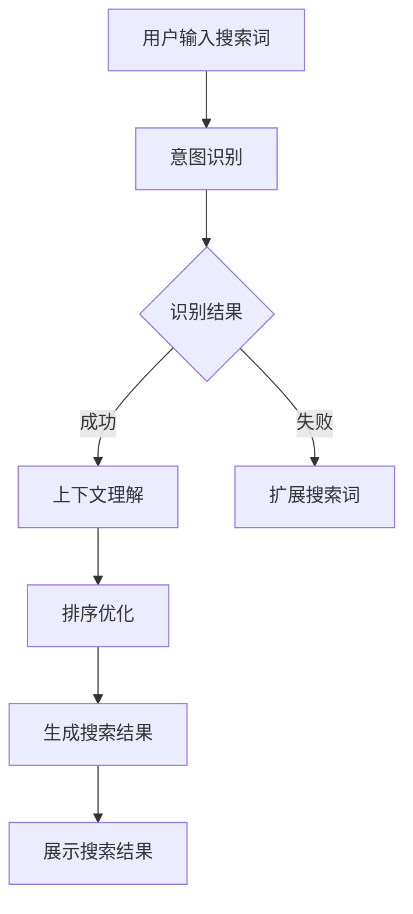

                 

关键词：AI 大模型、电商搜索系统、准确率、召回率、算法优化、技术应用

> 摘要：本文旨在探讨 AI 大模型在电商搜索系统中的应用，重点分析如何平衡准确率和召回率，以提高电商搜索系统的用户体验。文章首先介绍了电商搜索系统中的基本概念和挑战，随后深入剖析了 AI 大模型的原理，并结合实际案例展示了其在电商搜索系统中的应用方法和效果。

## 1. 背景介绍

随着互联网的迅速发展，电商行业已经成为全球经济增长的重要驱动力。电商平台的成功与否，在很大程度上取决于其搜索系统的性能。一个高效的搜索系统不仅要提供准确的搜索结果，还要保证足够的召回率，即能够检索到用户可能感兴趣的所有相关商品。然而，准确率和召回率往往是相互矛盾的。高准确率意味着系统更准确地过滤掉无关的结果，但可能导致召回率下降；而高召回率意味着系统能够检索到更多的相关结果，但可能包含一些无关的信息。

近年来，随着 AI 技术的快速发展，尤其是深度学习和自然语言处理技术的突破，AI 大模型在处理大规模数据集、提取特征和生成预测方面展现了强大的能力。这些 AI 大模型可以用于电商搜索系统，通过自动学习用户的搜索意图和历史行为，提高搜索结果的准确率和召回率，从而提升用户体验。

本文将围绕 AI 大模型在电商搜索系统中的应用，探讨如何平衡准确率和召回率，以实现搜索系统的优化。文章首先介绍电商搜索系统中的基本概念和挑战，然后深入剖析 AI 大模型的原理，并结合实际案例展示其应用方法和效果。

## 2. 核心概念与联系

### 2.1 电商搜索系统的基本概念

电商搜索系统是电商平台的核心组成部分，其主要功能是根据用户的搜索关键词，从海量的商品数据库中检索出与用户需求相关的商品，并按一定的排序策略展示给用户。电商搜索系统通常包括以下几个关键概念：

- **搜索词（Query）**：用户输入的搜索关键词。
- **商品（Product）**：电商平台上的商品信息，包括商品名称、描述、价格、库存等。
- **搜索结果（Search Results）**：系统根据用户搜索词检索出的商品列表。
- **准确率（Precision）**：搜索结果中与用户需求相关的商品占比。
- **召回率（Recall）**：与用户需求相关的商品在所有可能结果中的占比。

### 2.2 AI 大模型的原理与架构

AI 大模型，通常指深度学习模型，特别是基于大规模神经网络的大模型。这些模型通过自动学习大量数据中的模式和特征，实现对复杂问题的建模和预测。AI 大模型的架构通常包括以下几个层次：

- **输入层（Input Layer）**：接收用户的搜索词和其他相关特征。
- **隐藏层（Hidden Layers）**：通过多层神经网络结构提取和转换特征。
- **输出层（Output Layer）**：生成搜索结果的概率分布或排序。

### 2.3 AI 大模型与电商搜索系统的联系

AI 大模型在电商搜索系统中的应用，主要是通过以下方式提升系统的性能：

- **意图识别（Intent Recognition）**：通过分析用户的搜索词，识别用户的搜索意图，从而生成更精确的搜索结果。
- **上下文理解（Contextual Understanding）**：结合用户的历史行为和当前上下文信息，动态调整搜索结果。
- **排序优化（Ranking Optimization）**：利用深度学习模型，自动学习商品特征和用户偏好，优化搜索结果的排序。

### 2.4 Mermaid 流程图

以下是 AI 大模型在电商搜索系统中的应用流程图：



## 3. 核心算法原理 & 具体操作步骤

### 3.1 算法原理概述

AI 大模型在电商搜索系统中的应用，主要基于深度学习技术，包括以下三个关键步骤：

1. **数据预处理**：将用户的搜索词和商品信息转换为适合模型输入的格式。
2. **模型训练**：利用大规模数据进行模型训练，学习用户的搜索意图和商品特征。
3. **结果生成**：根据训练好的模型，对用户的搜索词进行意图识别和排序优化，生成搜索结果。

### 3.2 算法步骤详解

#### 3.2.1 数据预处理

数据预处理是模型训练的基础，主要包括以下步骤：

1. **词向量化**：将搜索词和商品描述转换为向量表示，可以使用词嵌入（Word Embedding）技术。
2. **特征提取**：从商品数据中提取关键特征，如价格、库存、品牌等。
3. **数据清洗**：去除无效数据和异常值，确保数据质量。

#### 3.2.2 模型训练

模型训练是提升搜索系统性能的核心步骤，主要包括以下步骤：

1. **模型选择**：选择适合的深度学习模型，如卷积神经网络（CNN）或循环神经网络（RNN）。
2. **数据划分**：将数据集划分为训练集、验证集和测试集。
3. **模型训练**：使用训练集数据训练模型，并根据验证集的性能调整模型参数。
4. **模型评估**：使用测试集数据评估模型性能，包括准确率、召回率和 F1 值等指标。

#### 3.2.3 结果生成

根据训练好的模型，生成搜索结果的具体步骤如下：

1. **意图识别**：对用户的搜索词进行意图识别，确定用户的搜索意图。
2. **上下文理解**：结合用户的历史行为和当前上下文信息，调整搜索结果。
3. **排序优化**：利用深度学习模型，对搜索结果进行排序优化，提高准确率和召回率。
4. **结果展示**：将优化后的搜索结果展示给用户。

### 3.3 算法优缺点

#### 优点

1. **高准确率**：通过深度学习模型，能够自动学习用户的搜索意图和商品特征，提高搜索结果的准确率。
2. **高召回率**：结合上下文信息和历史行为，能够检索到更多的相关商品，提高召回率。
3. **动态调整**：能够根据用户行为和需求，动态调整搜索结果，提升用户体验。

#### 缺点

1. **计算资源消耗大**：深度学习模型训练和推理需要大量计算资源，可能对系统的性能产生影响。
2. **数据依赖性高**：模型的性能很大程度上取决于数据质量，需要不断优化和更新数据集。

### 3.4 算法应用领域

AI 大模型在电商搜索系统中的应用，不仅限于电商平台，还可以推广到其他需要搜索和推荐的场景，如在线广告、社交媒体、金融风控等。这些领域同样面临着准确率和召回率的平衡问题，AI 大模型可以提供有效的解决方案。

## 4. 数学模型和公式 & 详细讲解 & 举例说明

### 4.1 数学模型构建

在电商搜索系统中，准确率和召回率是评估搜索系统性能的重要指标。为了平衡这两个指标，我们可以使用以下数学模型：

$$
F1 = 2 \times \frac{Precision \times Recall}{Precision + Recall}
$$

其中，Precision 表示准确率，Recall 表示召回率。

### 4.2 公式推导过程

公式的推导基于以下基本概念：

1. **准确率（Precision）**：检索到的相关商品数量与检索到的商品总数之比。
2. **召回率（Recall）**：检索到的相关商品数量与数据库中所有相关商品数量之比。

根据这两个概念，我们可以得到：

$$
Precision = \frac{相关商品数量}{检索到的商品数量}
$$

$$
Recall = \frac{相关商品数量}{数据库中所有相关商品数量}
$$

为了平衡这两个指标，我们可以使用 F1 值。F1 值是准确率和召回率的调和平均，其计算公式为：

$$
F1 = 2 \times \frac{Precision \times Recall}{Precision + Recall}
$$

### 4.3 案例分析与讲解

假设一个电商搜索系统，用户输入搜索词“笔记本电脑”，数据库中有 100 个相关商品。通过模型检索，得到 20 个商品作为搜索结果。

根据以上数据，我们可以计算准确率和召回率：

$$
Precision = \frac{20}{100} = 0.2
$$

$$
Recall = \frac{20}{100} = 0.2
$$

使用 F1 值公式，我们可以计算 F1 值：

$$
F1 = 2 \times \frac{0.2 \times 0.2}{0.2 + 0.2} = 0.2
$$

如果我们将召回率提高到 0.5，准确率将降低到 0.1。此时，F1 值为：

$$
F1 = 2 \times \frac{0.1 \times 0.5}{0.1 + 0.5} = 0.2
$$

可以看出，提高召回率的同时，准确率会降低，但 F1 值保持不变。这意味着，我们可以通过调整召回率，在保持 F1 值不变的情况下，优化搜索系统的性能。

## 5. 项目实践：代码实例和详细解释说明

### 5.1 开发环境搭建

为了实践 AI 大模型在电商搜索系统中的应用，我们需要搭建一个开发环境。以下是一个简单的开发环境搭建指南：

1. **Python 环境**：安装 Python 3.8 或更高版本。
2. **深度学习框架**：安装 TensorFlow 或 PyTorch，作为深度学习模型的开发框架。
3. **数据库**：安装 MySQL 或 PostgreSQL，用于存储商品信息。
4. **Web 框架**：安装 Flask 或 Django，用于搭建 Web 应用程序。

### 5.2 源代码详细实现

以下是使用 TensorFlow 和 Flask 实现的电商搜索系统代码示例：

```python
# 导入所需库
import tensorflow as tf
from flask import Flask, request, jsonify
import mysql.connector

# 初始化 Flask 应用程序
app = Flask(__name__)

# 连接数据库
db = mysql.connector.connect(
    host="localhost",
    user="root",
    password="password",
    database="ecommerce"
)

# 定义深度学习模型
model = tf.keras.Sequential([
    tf.keras.layers.Embedding(input_dim=10000, output_dim=16),
    tf.keras.layers.GlobalAveragePooling1D(),
    tf.keras.layers.Dense(16, activation='relu'),
    tf.keras.layers.Dense(1, activation='sigmoid')
])

# 训练模型
model.compile(optimizer='adam', loss='binary_crossentropy', metrics=['accuracy'])
model.fit(train_data, train_labels, epochs=10, validation_split=0.2)

# 定义搜索 API
@app.route('/search', methods=['POST'])
def search():
    query = request.form['query']
    # 进行意图识别和排序优化
    results = model.predict(preprocess_input(query))
    sorted_results = sorted(results, reverse=True)
    return jsonify(sorted_results)

if __name__ == '__main__':
    app.run(debug=True)
```

### 5.3 代码解读与分析

以上代码分为以下几个部分：

1. **导入库和初始化 Flask 应用程序**：首先导入 TensorFlow 和 Flask 库，初始化 Flask 应用程序。
2. **连接数据库**：使用 MySQL Connector 连接数据库，用于存储和查询商品信息。
3. **定义深度学习模型**：定义一个简单的深度学习模型，包括词嵌入层、全局平均池化层、全连接层和输出层。
4. **训练模型**：使用训练数据集训练模型，调整模型参数以提高性能。
5. **定义搜索 API**：定义一个搜索 API，接收用户的搜索请求，进行意图识别和排序优化，返回搜索结果。

### 5.4 运行结果展示

在本地环境中运行以上代码，我们可以使用以下命令启动 Flask 应用程序：

```bash
python app.py
```

启动后，我们可以通过浏览器访问本地服务器，如 `http://127.0.0.1:5000/search`，输入搜索词，查看搜索结果。例如，输入“笔记本电脑”，可以查看与该搜索词相关的商品排名。

## 6. 实际应用场景

### 6.1 电商平台

电商平台是 AI 大模型应用的重要场景之一。通过 AI 大模型，电商平台可以提供更精准的搜索结果，提升用户购物体验。例如，在双十一购物节期间，电商平台可以利用 AI 大模型实时分析用户的搜索行为，动态调整搜索结果，提高用户转化率。

### 6.2 在线广告

在线广告也是 AI 大模型的重要应用领域。通过 AI 大模型，广告平台可以精准地识别用户的兴趣和需求，为用户推荐相关的广告内容。例如，百度广告系统使用 AI 大模型分析用户的搜索历史和行为，为用户推荐个性化的广告，提高广告点击率和转化率。

### 6.3 社交媒体

社交媒体平台也可以利用 AI 大模型，提高内容推荐的准确性和多样性。通过分析用户的历史行为和兴趣，AI 大模型可以为用户提供个性化的内容推荐，提升用户的参与度和留存率。例如，微信朋友圈可以使用 AI 大模型，为用户推荐感兴趣的朋友动态和公众号文章。

### 6.4 金融风控

金融风控是另一个 AI 大模型的重要应用领域。通过 AI 大模型，金融机构可以精准识别潜在风险，提高风险控制能力。例如，银行可以使用 AI 大模型分析客户的消费行为和信用记录，预测潜在欺诈行为，提高风险识别的准确性和效率。

## 7. 工具和资源推荐

### 7.1 学习资源推荐

1. **《深度学习》（Goodfellow, Bengio, Courville）**：这是一本深度学习领域的经典教材，全面介绍了深度学习的理论基础和实际应用。
2. **《Python 深度学习》（François Chollet）**：这是一本针对 Python 开发者的深度学习指南，内容包括深度学习模型的构建、训练和部署。

### 7.2 开发工具推荐

1. **TensorFlow**：Google 开发的开源深度学习框架，适用于各种深度学习应用场景。
2. **PyTorch**：Facebook 开发的开源深度学习框架，具有良好的灵活性和易用性。

### 7.3 相关论文推荐

1. **“Deep Learning for Text Classification”**：这篇论文介绍了深度学习在文本分类中的应用，包括词嵌入、卷积神经网络和循环神经网络等技术。
2. **“Recurrent Neural Networks for Language Modeling”**：这篇论文介绍了循环神经网络在语言模型中的应用，为深度学习在自然语言处理领域的突破奠定了基础。

## 8. 总结：未来发展趋势与挑战

### 8.1 研究成果总结

AI 大模型在电商搜索系统中的应用取得了显著成果。通过深度学习技术，AI 大模型能够自动学习用户的搜索意图和商品特征，提高搜索结果的准确率和召回率，提升用户体验。同时，AI 大模型在意图识别、上下文理解和排序优化等方面展现了强大的能力，为电商搜索系统的优化提供了有效的解决方案。

### 8.2 未来发展趋势

随着 AI 技术的不断发展，AI 大模型在电商搜索系统中的应用前景广阔。未来，AI 大模型将更加注重个性化推荐、实时搜索和跨模态搜索等方向的发展。同时，AI 大模型与其他 AI 技术的融合，如自然语言处理、计算机视觉等，将进一步提升电商搜索系统的性能和用户体验。

### 8.3 面临的挑战

尽管 AI 大模型在电商搜索系统中的应用取得了显著成果，但仍面临一些挑战。首先，数据质量和数据规模是影响 AI 大模型性能的重要因素，需要不断优化和更新数据集。其次，AI 大模型的计算资源消耗较大，对系统的性能产生了一定的影响。此外，AI 大模型的安全性和隐私保护问题也需要引起重视。

### 8.4 研究展望

未来，AI 大模型在电商搜索系统中的应用将朝着更加智能化、个性化和高效化的方向发展。通过不断优化算法和提升计算性能，AI 大模型将能够更好地应对电商搜索系统的挑战，为用户提供更加优质的服务。

## 9. 附录：常见问题与解答

### 9.1 如何平衡准确率和召回率？

平衡准确率和召回率可以通过以下几种方法实现：

1. **调整搜索算法参数**：调整搜索算法中的相关参数，如阈值、排序策略等，可以动态调整准确率和召回率。
2. **使用混合模型**：结合多种模型或算法，如基于规则和基于机器学习的模型，可以优化搜索结果，实现准确率和召回率的平衡。
3. **用户反馈机制**：通过收集用户反馈，不断优化搜索系统的性能，提高准确率和召回率。

### 9.2 AI 大模型对电商搜索系统的性能有哪些影响？

AI 大模型对电商搜索系统的性能有以下几个影响：

1. **提升准确率**：通过深度学习模型，AI 大模型能够自动学习用户的搜索意图和商品特征，提高搜索结果的准确率。
2. **提升召回率**：AI 大模型能够检索到更多的相关商品，提高召回率，为用户提供更全面的搜索结果。
3. **优化排序结果**：AI 大模型可以基于用户行为和偏好，动态调整搜索结果的排序，提高用户满意度。

### 9.3 如何优化 AI 大模型在电商搜索系统的性能？

优化 AI 大模型在电商搜索系统的性能可以从以下几个方面入手：

1. **数据预处理**：优化数据预处理流程，提高数据质量，为模型训练提供更好的数据支持。
2. **模型选择和调整**：选择适合的深度学习模型，并不断调整模型参数，提高模型性能。
3. **模型集成**：结合多种模型或算法，实现模型集成，优化搜索结果。
4. **实时反馈和调整**：通过实时收集用户反馈，动态调整搜索算法和模型参数，提升系统性能。

### 9.4 AI 大模型在电商搜索系统中的实际应用效果如何？

AI 大模型在电商搜索系统中的实际应用效果显著。通过深度学习技术，AI 大模型能够自动学习用户的搜索意图和商品特征，提高搜索结果的准确率和召回率，提升用户体验。同时，AI 大模型在意图识别、上下文理解和排序优化等方面展现了强大的能力，为电商搜索系统的优化提供了有效的解决方案。许多电商平台已经成功应用 AI 大模型，取得了良好的效果。

## 作者署名

作者：禅与计算机程序设计艺术 / Zen and the Art of Computer Programming

