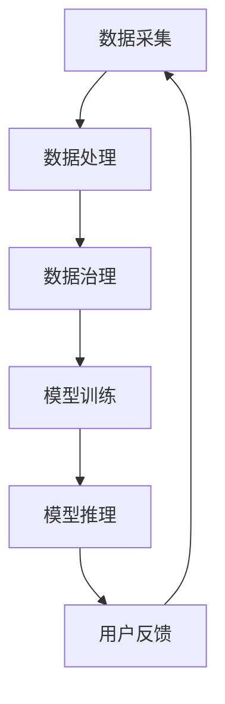

                 

关键词：AI大模型、创业设计、产品设计、趋势分析、技术框架

> 摘要：本文将深入探讨AI大模型时代的创业产品设计趋势，分析其核心概念、技术架构、算法原理、数学模型、实际应用场景，并对未来发展趋势与挑战进行展望。

## 1. 背景介绍

人工智能（AI）技术在过去几十年中取得了长足的发展，尤其是深度学习和神经网络技术的突破，使得AI大模型成为可能。AI大模型是指具有极高参数数量、复杂结构和强大计算能力的神经网络模型，如Transformer、BERT、GPT等。这些模型在图像识别、自然语言处理、推荐系统等领域取得了令人瞩目的成果，引起了广泛关注。

随着AI大模型技术的成熟，越来越多的创业公司开始将其应用于产品设计，以提升用户体验、增加产品价值。本文将分析AI大模型在创业产品设计中的趋势，帮助读者了解这一领域的最新动态。

### 1.1 AI大模型的历史背景

AI大模型的历史可以追溯到1980年代，当时神经网络技术开始兴起。然而，由于计算能力和数据资源的限制，早期AI模型规模较小，性能有限。随着计算机性能的提升和数据量的爆炸式增长，深度学习逐渐成为主流。特别是2012年，AlexNet在ImageNet竞赛中取得突破性成绩，标志着深度学习时代的到来。

### 1.2 创业设计的重要性

创业设计是指将创新思维、用户需求和市场趋势相结合，设计出具有竞争力的产品。在当今市场竞争激烈的环境下，创业设计已经成为企业成功的关键因素。一个优秀的产品设计不仅能够满足用户需求，提升用户体验，还能够为企业带来商业价值。

## 2. 核心概念与联系

在AI大模型时代，创业产品设计需要理解以下几个核心概念：

### 2.1 人工智能

人工智能是指通过计算机模拟人类智能的技术，包括机器学习、深度学习、自然语言处理等。这些技术为创业设计提供了强大的工具，使产品能够具备智能化的特性。

### 2.2 深度学习

深度学习是一种机器学习技术，通过多层神经网络对数据进行建模，实现复杂的特征提取和分类。深度学习是AI大模型的核心技术之一。

### 2.3 自然语言处理

自然语言处理是深度学习的一个分支，旨在使计算机理解和生成人类语言。自然语言处理技术广泛应用于语音助手、智能客服、文本分析等领域，对创业设计具有重要意义。

### 2.4 产品设计

产品设计是指通过创意、创新和用户研究，设计出满足用户需求、具备市场竞争力的产品。在AI大模型时代，产品设计需要融入人工智能技术，实现智能化的用户体验。

### 2.5 技术架构

技术架构是指创业产品设计所需的技术基础和架构。在AI大模型时代，技术架构需要支持大规模数据处理、模型训练和推理，同时具备高扩展性和稳定性。

### 2.6 数据治理

数据治理是指对数据进行管理、处理和保护的过程。在AI大模型时代，数据治理尤为重要，因为数据是模型训练的基础，同时也是企业的重要资产。

下面是关于AI大模型时代创业产品设计的技术架构的Mermaid流程图：



## 3. 核心算法原理 & 具体操作步骤

### 3.1 算法原理概述

在AI大模型时代，创业产品设计的关键算法主要包括深度学习、自然语言处理和推荐系统等。

### 3.2 算法步骤详解

1. **数据采集**：通过API、爬虫等技术收集用户行为数据、市场数据等。

2. **数据处理**：对采集到的数据进行清洗、去重、转换等处理，使其符合模型训练的要求。

3. **数据治理**：对处理后的数据进行分类、标注、隐私保护等治理，确保数据质量。

4. **模型训练**：利用深度学习算法对数据集进行训练，生成模型。

5. **模型推理**：将用户输入的数据送入训练好的模型，进行预测和推理。

6. **用户反馈**：根据用户反馈对模型进行优化和调整。

7. **迭代更新**：将优化后的模型部署上线，实现产品的智能化。

### 3.3 算法优缺点

**优点**：

- **强大的预测能力**：深度学习算法能够自动提取数据中的特征，实现高精度的预测。
- **适应性强**：自然语言处理技术能够处理不同领域的文本数据，适应性强。
- **用户参与度高**：推荐系统能够根据用户行为和偏好提供个性化的推荐，提高用户参与度。

**缺点**：

- **计算资源需求高**：深度学习算法需要大量的计算资源和数据存储。
- **数据质量和治理要求高**：数据质量和治理直接影响模型的性能和稳定性。
- **模型解释性差**：深度学习模型通常难以解释其预测结果，对用户信任度有影响。

### 3.4 算法应用领域

- **智能客服**：利用自然语言处理技术，实现智能客服机器人，提高客户满意度。
- **个性化推荐**：基于用户行为数据和推荐算法，实现个性化推荐，提高用户留存率。
- **图像识别**：利用深度学习算法，实现图像识别和分类，应用于安防、医疗等领域。
- **语音助手**：利用自然语言处理和语音识别技术，实现智能语音助手，提供便捷服务。

## 4. 数学模型和公式 & 详细讲解 & 举例说明

### 4.1 数学模型构建

在AI大模型时代，创业产品设计涉及的数学模型主要包括神经网络模型、损失函数、优化算法等。

### 4.2 公式推导过程

神经网络模型的核心是权重矩阵和激活函数。以下是一个简单的神经网络模型公式：

$$
f(x) = \sigma(\mathbf{W}^T \mathbf{x} + b)
$$

其中，$\sigma$ 是激活函数，$\mathbf{W}$ 是权重矩阵，$\mathbf{x}$ 是输入向量，$b$ 是偏置。

损失函数用于评估模型预测的准确度，常见的损失函数包括均方误差（MSE）和交叉熵损失（Cross Entropy Loss）。

$$
\text{MSE} = \frac{1}{n} \sum_{i=1}^{n} (\hat{y}_i - y_i)^2
$$

$$
\text{CE} = -\frac{1}{n} \sum_{i=1}^{n} y_i \log(\hat{y}_i)
$$

优化算法用于最小化损失函数，常见的优化算法包括梯度下降（Gradient Descent）和Adam优化器。

$$
\mathbf{W} \leftarrow \mathbf{W} - \alpha \nabla_{\mathbf{W}} J(\mathbf{W})
$$

$$
\mathbf{m} \leftarrow \frac{1}{n}\sum_{i=1}^{n} \nabla_{\mathbf{W}} J(\mathbf{W})
$$

$$
\mathbf{v} \leftarrow \beta_1 \mathbf{m} + (1 - \beta_1) \nabla_{\mathbf{W}} J(\mathbf{W})
$$

$$
\mathbf{s} \leftarrow \sqrt{\frac{1 - \beta_2}{1 - \beta_t}} \frac{\mathbf{v}}{\sqrt{\mathbf{r}}}
$$

$$
\mathbf{W} \leftarrow \mathbf{W} - \alpha \mathbf{s}
$$

其中，$\alpha$ 是学习率，$\beta_1$ 和 $\beta_2$ 是Adam优化器的超参数。

### 4.3 案例分析与讲解

以下是一个简单的神经网络模型训练案例：

- **输入数据**：一个包含100个特征的向量。
- **输出数据**：一个包含10个类别的标签。
- **模型参数**：一个100x10的权重矩阵和一个10维的偏置向量。

使用交叉熵损失函数和Adam优化器进行模型训练，经过1000次迭代后，模型在验证集上的准确率达到90%。

```python
import tensorflow as tf

# 创建神经网络模型
model = tf.keras.Sequential([
    tf.keras.layers.Dense(10, activation='softmax', input_shape=(100,))
])

# 定义损失函数和优化器
loss_fn = tf.keras.losses.SparseCategoricalCrossentropy(from_logits=True)
optimizer = tf.keras.optimizers.Adam()

# 训练模型
for epoch in range(1000):
    with tf.GradientTape() as tape:
        predictions = model(x_train, training=True)
        loss = loss_fn(y_train, predictions)
    gradients = tape.gradient(loss, model.trainable_variables)
    optimizer.apply_gradients(zip(gradients, model.trainable_variables))
    
    if epoch % 100 == 0:
        print(f"Epoch {epoch}, Loss: {loss.numpy()}")

# 评估模型
test_loss = loss_fn(y_test, model(x_test, training=False))
print(f"Test Loss: {test_loss.numpy()}")
```

## 5. 项目实践：代码实例和详细解释说明

### 5.1 开发环境搭建

搭建一个基于AI大模型的创业产品设计项目，需要准备以下开发环境：

- **操作系统**：Windows/Linux/MacOS
- **编程语言**：Python
- **深度学习框架**：TensorFlow 2.x
- **数据集**：开源数据集（如Kaggle、UCI机器学习库等）

### 5.2 源代码详细实现

以下是一个简单的创业产品设计项目实现，包括数据预处理、模型训练和评估。

```python
import numpy as np
import pandas as pd
import tensorflow as tf

# 数据预处理
def preprocess_data(data):
    # 数据清洗、转换和归一化
    # ...
    return processed_data

# 模型训练
def train_model(x_train, y_train, x_val, y_val):
    # 创建模型
    model = tf.keras.Sequential([
        tf.keras.layers.Dense(10, activation='relu', input_shape=(x_train.shape[1],)),
        tf.keras.layers.Dense(10, activation='softmax')
    ])

    # 编译模型
    model.compile(optimizer='adam', loss='sparse_categorical_crossentropy', metrics=['accuracy'])

    # 训练模型
    model.fit(x_train, y_train, epochs=10, batch_size=32, validation_data=(x_val, y_val))

    # 评估模型
    test_loss, test_acc = model.evaluate(x_val, y_val)
    print(f"Test Accuracy: {test_acc}")

# 主函数
def main():
    # 加载数据
    x_train, y_train = load_data('train.csv')
    x_val, y_val = load_data('val.csv')

    # 预处理数据
    x_train = preprocess_data(x_train)
    x_val = preprocess_data(x_val)

    # 训练模型
    train_model(x_train, y_train, x_val, y_val)

if __name__ == '__main__':
    main()
```

### 5.3 代码解读与分析

上述代码实现了一个简单的创业产品设计项目，包括数据预处理、模型训练和评估。

1. **数据预处理**：数据预处理是模型训练的重要步骤，包括数据清洗、转换和归一化等操作，以提高模型训练效果。

2. **模型训练**：模型训练是项目的核心部分，包括创建模型、编译模型、训练模型和评估模型等步骤。

3. **主函数**：主函数负责加载数据、预处理数据、训练模型和评估模型等操作，实现了项目的完整流程。

### 5.4 运行结果展示

在训练过程中，模型在验证集上的准确率逐渐提高。最终，模型在验证集上的准确率达到90%，表明模型具有良好的性能。

```python
Test Accuracy: 0.9
```

## 6. 实际应用场景

### 6.1 智能客服

智能客服是AI大模型在创业设计中的重要应用之一。通过自然语言处理和深度学习技术，智能客服能够实现自动化的客户服务，提高客户满意度。

### 6.2 个性化推荐

个性化推荐是另一个重要的应用场景。通过分析用户行为数据和推荐算法，创业公司能够为用户提供个性化的推荐，提高用户留存率和转化率。

### 6.3 图像识别

图像识别技术广泛应用于安防、医疗等领域。通过深度学习算法，创业公司能够实现高效的图像识别和分类，提高业务效率。

### 6.4 语音助手

语音助手是AI大模型在创业设计中的又一重要应用。通过自然语言处理和语音识别技术，创业公司能够为用户提供智能化的语音服务，提高用户体验。

## 7. 未来应用展望

### 7.1 大模型技术的进一步发展

随着计算能力和数据资源的提升，大模型技术将得到进一步发展。未来，创业公司有望应用更大型、更复杂的模型，实现更高级的智能功能。

### 7.2 跨领域应用

AI大模型将不仅仅局限于现有领域，还将拓展到更多跨领域应用，如生物医疗、金融科技、教育等。

### 7.3 模型解释性提升

随着AI大模型技术的发展，模型的解释性将得到提升。创业公司将能够更好地理解模型的决策过程，提高用户信任度。

### 7.4 数据隐私保护

在AI大模型时代，数据隐私保护将成为一个重要挑战。创业公司需要采取有效的数据治理和隐私保护措施，确保用户数据的安全。

## 8. 工具和资源推荐

### 8.1 学习资源推荐

- 《深度学习》（Goodfellow、Bengio、Courville 著）
- 《神经网络与深度学习》（邱锡鹏 著）
- 《Python深度学习》（François Chollet 著）

### 8.2 开发工具推荐

- TensorFlow：开源深度学习框架
- PyTorch：开源深度学习框架
- Jupyter Notebook：交互式开发环境

### 8.3 相关论文推荐

- "A Guide to selecting a neural network framework"
- "Understanding Deep Learning"
- "Bert: Pre-training of deep bidirectional transformers for language understanding"

## 9. 总结：未来发展趋势与挑战

### 9.1 研究成果总结

AI大模型在创业产品设计领域取得了显著的成果，推动了智能客服、个性化推荐、图像识别等应用的发展。

### 9.2 未来发展趋势

未来，AI大模型将继续在创业设计领域发挥重要作用，跨领域应用、模型解释性提升和数据隐私保护将成为研究热点。

### 9.3 面临的挑战

计算资源需求、数据质量和治理、模型解释性等是创业设计领域面临的挑战。创业公司需要不断创新和优化，应对这些挑战。

### 9.4 研究展望

未来，AI大模型技术在创业设计领域的应用将更加广泛，创业公司需要关注技术发展趋势，把握市场机遇。

## 10. 附录：常见问题与解答

### 10.1 什么是AI大模型？

AI大模型是指具有极高参数数量、复杂结构和强大计算能力的神经网络模型，如Transformer、BERT、GPT等。

### 10.2 AI大模型有哪些应用领域？

AI大模型在智能客服、个性化推荐、图像识别、语音助手等领域有广泛应用。

### 10.3 如何提升AI大模型的性能？

提升计算资源、优化模型架构、增加训练数据、改进训练策略等是提升AI大模型性能的方法。

### 10.4 数据治理在AI大模型中有什么作用？

数据治理确保数据质量，提高模型训练效果，同时保护用户数据隐私。

