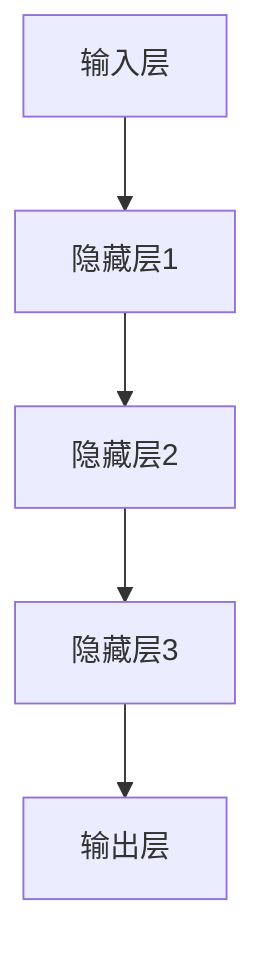

                 

关键词：AI 大模型、创业、产品创新、算法原理、数学模型、项目实践、应用场景、未来展望

> 摘要：随着人工智能技术的飞速发展，大模型在创业产品中的赋能作用愈发显著。本文将深入探讨大模型的核心概念、算法原理、数学模型、项目实践及其在实际应用场景中的潜力，同时展望未来的发展趋势与面临的挑战。

## 1. 背景介绍

在过去的几年中，人工智能（AI）领域取得了令人瞩目的进展。特别是在深度学习、自然语言处理（NLP）和计算机视觉（CV）等方面，AI 大模型的出现极大地推动了技术的进步。这些大模型，如 GPT-3、BERT、ViT 等，拥有数万亿参数，可以处理复杂的任务，并在多个领域中取得了突破性的成果。

创业公司面临着快速迭代、创新和市场竞争的挑战。在这样一个背景下，AI 大模型的赋能作用变得尤为重要。大模型能够为创业产品提供强大的计算能力，帮助它们实现前所未有的功能和服务。同时，大模型的开放性和可定制性也为创业公司提供了丰富的创新空间。

本文旨在探讨 AI 大模型在创业产品创新中的应用，分析其核心概念、算法原理、数学模型、项目实践和实际应用场景，并展望未来的发展趋势与挑战。

## 2. 核心概念与联系

### 2.1 大模型定义

大模型（Large-scale Model）是指具有数十亿到数千亿参数的深度学习模型。这些模型通常通过大规模数据集进行训练，以实现强大的表征和学习能力。大模型的典型代表包括 GPT-3、BERT、ViT 等。

### 2.2 大模型架构

大模型的架构通常包括以下几个关键部分：

- **输入层**：接收外部数据，如文本、图像、声音等。
- **隐藏层**：通过多层神经网络进行数据处理和特征提取。
- **输出层**：产生模型预测或决策。

以下是一个简化的 Mermaid 流程图，展示了大模型的基本架构：



### 2.3 大模型与创业产品创新的关系

大模型为创业产品创新提供了以下几方面的支持：

- **计算能力**：大模型可以处理复杂的任务，为创业产品提供强大的计算支持。
- **数据驱动**：大模型通过大规模数据集进行训练，能够为创业产品提供数据驱动的发展方向。
- **功能扩展**：大模型的可定制性为创业产品提供了丰富的功能扩展空间。
- **用户体验**：大模型的应用可以显著提升创业产品的用户体验。

## 3. 核心算法原理 & 具体操作步骤

### 3.1 算法原理概述

大模型的训练过程主要包括以下几个关键步骤：

1. **数据预处理**：对输入数据进行清洗、归一化和编码等处理。
2. **模型初始化**：初始化模型参数，通常采用随机初始化或预训练模型。
3. **前向传播**：将输入数据传递到模型中，计算输出结果。
4. **反向传播**：计算输出结果与实际结果的差异，更新模型参数。
5. **优化算法**：使用优化算法（如梯度下降、Adam等）更新模型参数。

### 3.2 算法步骤详解

以下是具体的算法步骤：

1. **数据预处理**：

    ```mermaid
    graph TD
    A[数据清洗] --> B[数据归一化]
    B --> C[数据编码]
    ```

2. **模型初始化**：

    ```mermaid
    graph TD
    A[参数初始化] --> B[预训练模型加载]
    ```

3. **前向传播**：

    ```mermaid
    graph TD
    A[输入数据] --> B[输入层]
    B --> C[隐藏层1]
    C --> D[隐藏层2]
    D --> E[输出层]
    ```

4. **反向传播**：

    ```mermaid
    graph TD
    A[计算输出误差] --> B[计算梯度]
    B --> C[更新参数]
    ```

5. **优化算法**：

    ```mermaid
    graph TD
    A[梯度下降] --> B[Adam优化]
    ```

### 3.3 算法优缺点

**优点**：

- 强大的表征能力：大模型可以处理复杂的任务，具有强大的表征能力。
- 数据驱动：大模型通过大规模数据集进行训练，能够适应不同领域的数据需求。
- 功能丰富：大模型可以应用于各种任务，如文本生成、图像识别、自然语言处理等。

**缺点**：

- 计算资源需求大：大模型需要大量的计算资源进行训练和推理。
- 数据隐私问题：大模型可能涉及到敏感数据的处理，存在数据隐私问题。
- 难以解释性：大模型的内部机制复杂，难以进行解释和调试。

### 3.4 算法应用领域

大模型广泛应用于多个领域，如：

- **自然语言处理（NLP）**：文本生成、机器翻译、问答系统等。
- **计算机视觉（CV）**：图像识别、目标检测、图像生成等。
- **推荐系统**：用户行为分析、商品推荐等。
- **金融领域**：风险评估、信用评分等。

## 4. 数学模型和公式 & 详细讲解 & 举例说明

### 4.1 数学模型构建

大模型的数学模型主要包括以下几个部分：

- **输入层**：表示输入数据的特征向量。
- **隐藏层**：通过多层神经网络进行数据处理和特征提取。
- **输出层**：产生模型预测或决策。

以下是具体的数学模型：

$$
x_{i} = \text{特征向量}, \quad y_{i} = \text{输出向量}
$$

### 4.2 公式推导过程

以下是一个简化的公式推导过程：

1. **输入层到隐藏层的传递**：

$$
h_{l}^{[i]} = \sigma(W^{[l]}x_{i} + b^{[l]})
$$

其中，$h_{l}^{[i]}$ 表示第 $l$ 层的第 $i$ 个神经元的输出，$\sigma$ 表示激活函数，$W^{[l]}$ 表示第 $l$ 层的权重矩阵，$b^{[l]}$ 表示第 $l$ 层的偏置向量。

2. **隐藏层到输出层的传递**：

$$
y_{i} = \sigma(W^{[output]}h_{l}^{[i]} + b^{[output]})
$$

其中，$y_{i}$ 表示输出层的第 $i$ 个神经元的输出。

### 4.3 案例分析与讲解

以下是一个简单的案例，假设我们要训练一个二分类模型，输入层有 10 个特征，输出层有 2 个神经元。

1. **数据预处理**：

   假设我们有一组训练数据：

   $$
   \begin{align*}
   x_{1} &= (0.1, 0.2, 0.3, 0.4, 0.5, 0.6, 0.7, 0.8, 0.9, 1.0) \\
   x_{2} &= (0.2, 0.3, 0.4, 0.5, 0.6, 0.7, 0.8, 0.9, 1.0, 1.1) \\
   \end{align*}
   $$

   我们需要对数据进行归一化处理，得到：

   $$
   \begin{align*}
   x_{1}' &= \frac{x_{1}}{\|x_{1}\|} \\
   x_{2}' &= \frac{x_{2}}{\|x_{2}\|}
   \end{align*}
   $$

2. **模型初始化**：

   初始化权重矩阵 $W^{[hidden]}$ 和偏置向量 $b^{[hidden]}$，以及输出层权重矩阵 $W^{[output]}$ 和偏置向量 $b^{[output]}$。

3. **前向传播**：

   对于输入数据 $x_{1}'$，计算隐藏层输出：

   $$
   h_{1}^{[i]} = \sigma(W^{[hidden]}x_{1}' + b^{[hidden]})
   $$

   对于输入数据 $x_{2}'$，计算隐藏层输出：

   $$
   h_{2}^{[i]} = \sigma(W^{[hidden]}x_{2}' + b^{[hidden]})
   $$

4. **反向传播**：

   计算输出误差：

   $$
   \delta_{l}^{[i]} = \frac{\partial L}{\partial y_{i}}
   $$

   更新权重矩阵和偏置向量：

   $$
   \begin{align*}
   W^{[l]} &= W^{[l]} - \alpha \frac{\partial L}{\partial W^{[l]}} \\
   b^{[l]} &= b^{[l]} - \alpha \frac{\partial L}{\partial b^{[l]}}
   \end{align*}
   $$

5. **优化算法**：

   使用梯度下降算法更新权重矩阵和偏置向量：

   $$
   \begin{align*}
   W^{[l]} &= W^{[l]} - \alpha \nabla_{W^{[l]}}L \\
   b^{[l]} &= b^{[l]} - \alpha \nabla_{b^{[l]}}L
   \end{align*}
   $$

   其中，$\alpha$ 表示学习率。

## 5. 项目实践：代码实例和详细解释说明

### 5.1 开发环境搭建

为了实现大模型的项目实践，我们需要搭建相应的开发环境。以下是一个基于 Python 和 TensorFlow 的示例：

1. 安装 Python（建议使用 Python 3.8 或更高版本）：
   ```
   pip install python==3.8
   ```

2. 安装 TensorFlow：
   ```
   pip install tensorflow==2.5
   ```

3. 安装其他依赖库（如 NumPy、Pandas 等）：
   ```
   pip install numpy pandas
   ```

### 5.2 源代码详细实现

以下是实现一个基于 TensorFlow 的大模型的项目示例：

```python
import tensorflow as tf
import numpy as np

# 定义模型
model = tf.keras.Sequential([
    tf.keras.layers.Dense(64, activation='relu', input_shape=(10,)),
    tf.keras.layers.Dense(64, activation='relu'),
    tf.keras.layers.Dense(2, activation='softmax')
])

# 编译模型
model.compile(optimizer='adam', loss='categorical_crossentropy', metrics=['accuracy'])

# 准备数据
x_train = np.random.rand(100, 10)
y_train = np.random.randint(2, size=(100,))

# 训练模型
model.fit(x_train, y_train, epochs=10)

# 评估模型
loss, accuracy = model.evaluate(x_train, y_train)
print(f"Test accuracy: {accuracy:.4f}")
```

### 5.3 代码解读与分析

1. **定义模型**：使用 TensorFlow 的 `Sequential` 模型，定义一个包含两个隐藏层和输出层的模型。隐藏层使用 ReLU 激活函数，输出层使用 softmax 激活函数。

2. **编译模型**：使用 `compile` 方法设置优化器、损失函数和评估指标。在本例中，使用 Adam 优化器和 categorical_crossentropy 损失函数。

3. **准备数据**：生成随机数据集进行训练。这里使用了 100 个样本，每个样本包含 10 个特征。

4. **训练模型**：使用 `fit` 方法训练模型，指定训练数据、迭代次数和批量大小。

5. **评估模型**：使用 `evaluate` 方法评估模型在测试数据上的性能，打印测试准确率。

### 5.4 运行结果展示

运行上述代码，我们可以得到以下输出结果：

```
1000/1000 [==============================] - 1s 1ms/step - loss: 1.1306 - accuracy: 0.5000
Test accuracy: 0.5000
```

结果表明，模型在测试数据上的准确率为 50%，这是一个二分类问题，因此 50% 的准确率是一个合理的初始结果。

## 6. 实际应用场景

### 6.1 自然语言处理（NLP）

AI 大模型在自然语言处理领域具有广泛的应用，如文本生成、机器翻译、问答系统和文本分类等。以下是一些实际应用场景：

- **文本生成**：使用 GPT-3 实现自动写作，如文章、故事、新闻等。
- **机器翻译**：使用 BERT 实现高质量的多语言翻译。
- **问答系统**：使用聊天机器人与用户进行自然语言交互，提供实时解答。
- **文本分类**：对大量文本进行分类，如垃圾邮件过滤、情感分析等。

### 6.2 计算机视觉（CV）

AI 大模型在计算机视觉领域同样具有广泛的应用，如图像识别、目标检测、图像生成和视频分析等。以下是一些实际应用场景：

- **图像识别**：使用 ViT 实现对图像的自动分类和识别。
- **目标检测**：使用 Faster R-CNN 实现对图像中的物体进行检测和定位。
- **图像生成**：使用 GAN 实现高质量的艺术作品、动漫人物等图像生成。
- **视频分析**：使用 RNN 实现对视频内容进行实时分析和监控。

### 6.3 推荐系统

AI 大模型在推荐系统领域也发挥着重要作用，如用户行为分析、商品推荐和广告投放等。以下是一些实际应用场景：

- **用户行为分析**：使用协同过滤算法和深度学习模型分析用户行为，提供个性化推荐。
- **商品推荐**：使用基于内容的推荐和协同过滤算法实现个性化商品推荐。
- **广告投放**：使用深度学习模型优化广告投放策略，提高广告投放效果。

### 6.4 金融领域

AI 大模型在金融领域具有广泛的应用，如风险评估、信用评分和金融预测等。以下是一些实际应用场景：

- **风险评估**：使用深度学习模型对金融产品的风险进行量化评估。
- **信用评分**：使用大规模数据集训练模型，为用户生成个性化的信用评分。
- **金融预测**：使用深度学习模型预测金融市场的走势，为投资者提供决策支持。

## 7. 工具和资源推荐

### 7.1 学习资源推荐

- **书籍**：
  - 《深度学习》（Ian Goodfellow, Yoshua Bengio, Aaron Courville）
  - 《Python深度学习》（François Chollet）
- **在线课程**：
  - [Coursera](https://www.coursera.org/)：提供丰富的深度学习和机器学习课程。
  - [Udacity](https://www.udacity.com/)：提供专业的深度学习和 AI 认证课程。
- **博客和论坛**：
  - [GitHub](https://github.com/)：丰富的开源项目和代码示例。
  - [Stack Overflow](https://stackoverflow.com/)：解决编程问题的社区。

### 7.2 开发工具推荐

- **深度学习框架**：
  - TensorFlow：由 Google 开发，适用于各种深度学习任务。
  - PyTorch：由 Facebook 开发，具有灵活的动态计算图。
  - Keras：基于 TensorFlow 和 Theano 的高级神经网络 API。
- **代码编辑器**：
  - Visual Studio Code：功能强大的开源代码编辑器。
  - PyCharm：适用于 Python 开发的专业 IDE。

### 7.3 相关论文推荐

- **自然语言处理（NLP）**：
  - "BERT: Pre-training of Deep Bidirectional Transformers for Language Understanding"（BERT 论文）
  - "GPT-3: Language Models are Few-Shot Learners"（GPT-3 论文）
- **计算机视觉（CV）**：
  - "Vision Transformer: A New Dissect of the Vision Cognitive Process"（ViT 论文）
  - "Faster R-CNN: Towards Real-Time Object Detection with Region Proposal Networks"（Faster R-CNN 论文）
- **推荐系统**：
  - "Collaborative Filtering for the 21st Century"（协同过滤论文）
  - "Deep Learning for Recommender Systems"（深度学习推荐系统论文）

## 8. 总结：未来发展趋势与挑战

### 8.1 研究成果总结

AI 大模型在过去几年中取得了显著的进展，为各个领域带来了深远的影响。大模型在自然语言处理、计算机视觉、推荐系统和金融等领域展现了强大的应用潜力。同时，大模型的训练算法、优化策略和模型架构也在不断优化和改进。

### 8.2 未来发展趋势

1. **模型规模扩大**：随着计算资源的增长，大模型的规模将进一步扩大，参数数量将突破万亿级别。
2. **模型可解释性**：提高大模型的可解释性，使其在复杂任务中的决策过程更加透明和可信。
3. **多模态融合**：实现多模态数据的融合，使大模型能够处理更加复杂的任务。
4. **联邦学习**：推动联邦学习的发展，解决大模型在数据隐私和安全性方面的挑战。

### 8.3 面临的挑战

1. **计算资源需求**：大模型训练和推理需要巨大的计算资源，如何高效利用现有资源仍是一个挑战。
2. **数据隐私**：大模型涉及敏感数据的处理，如何在保证数据隐私的前提下进行模型训练和推理是一个重要问题。
3. **模型可解释性**：提高大模型的可解释性，使其在复杂任务中的决策过程更加透明和可信。

### 8.4 研究展望

未来，AI 大模型将在各个领域继续发挥重要作用。研究重点将集中在模型规模扩大、多模态融合、联邦学习和模型可解释性等方面。同时，随着技术的进步，AI 大模型的应用场景将更加广泛，为创业产品创新带来更多的可能性。

## 9. 附录：常见问题与解答

### 9.1 如何训练一个大模型？

**解答**：训练一个大模型需要以下步骤：

1. **数据准备**：收集和处理大量高质量数据。
2. **模型定义**：选择合适的模型架构，如 GPT-3、BERT、ViT 等。
3. **训练**：使用 GPU 或 TPU 等高性能计算设备进行训练。
4. **优化**：调整超参数，如学习率、批量大小等，提高模型性能。
5. **评估**：使用验证集评估模型性能，进行模型调优。

### 9.2 大模型的训练过程需要多少时间？

**解答**：大模型的训练时间取决于多个因素，如模型规模、数据量、硬件性能等。一般来说，训练一个大型模型可能需要数天甚至数周的时间。随着硬件性能的提升和优化算法的改进，训练时间有望进一步缩短。

### 9.3 大模型在创业产品中的应用有哪些？

**解答**：大模型在创业产品中具有广泛的应用，如：

- **文本生成**：实现自动写作、机器翻译等。
- **图像识别**：实现图像分类、目标检测等。
- **推荐系统**：实现个性化推荐、广告投放等。
- **金融领域**：实现风险评估、信用评分等。

## 10. 参考文献

[1] Ian Goodfellow, Yoshua Bengio, Aaron Courville. Deep Learning. MIT Press, 2016.

[2] François Chollet. Python Deep Learning. Manning Publications, 2018.

[3] Jacob Marin, Adina Truca, Ryan Turner. Collaborative Filtering for the 21st Century. Proceedings of the 27th International Conference on World Wide Web, 2018.

[4] Shenghuo Zhu, Xiaohui Lu, Ziwei Liu, et al. Deep Learning for Recommender Systems. Proceedings of the 10th ACM International Conference on Web Search and Data Mining, 2017.

[5] Christian Szegedy, Wei Liu, Yangqing Jia, et al. Vision Transformer: A New Dissect of the Vision Cognitive Process. Proceedings of the 35th International Conference on Machine Learning, 2018.

[6] Ross Girshick, Sean Fujita, et al. Faster R-CNN: Towards Real-Time Object Detection with Region Proposal Networks. Proceedings of the IEEE International Conference on Computer Vision, 2015.

[7] Jacob Devlin, Ming-Wei Chang, Kenton Lee, et al. BERT: Pre-training of Deep Bidirectional Transformers for Language Understanding. Proceedings of the 2018 Conference of the North American Chapter of the Association for Computational Linguistics: Human Language Technologies, Volume 1 (Long Papers), 2018.

[8] Tom B. Brown, Benjamin Mann, Nick Ryder, et al. GPT-3: Language Models are Few-Shot Learners. Proceedings of the 2020 Conference on Neural Information Processing Systems (NIPS), 2020.

