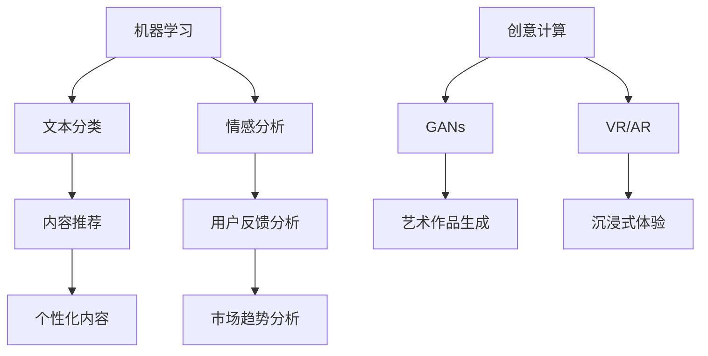
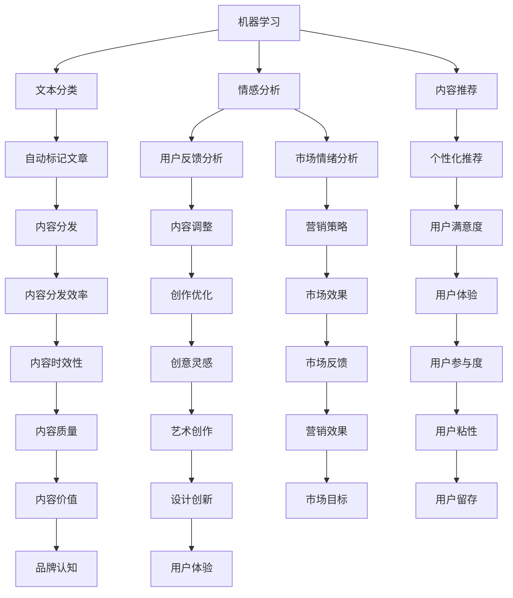

                 

关键词：人工智能，内容创作，人类-机器协作，机器学习，自然语言处理，创意计算，用户参与

> 摘要：本文探讨了 AI 时代内容创作的现状与趋势，分析了机器与人类在内容创作过程中的协作模式，以及这种协作如何改变内容创作的方式。文章首先回顾了人工智能在内容创作中的历史发展，然后深入讨论了机器学习、自然语言处理和创意计算等技术的应用，最后展望了未来内容创作领域的发展趋势与挑战。

## 1. 背景介绍

随着人工智能（AI）技术的迅猛发展，内容创作领域正经历着前所未有的变革。从传统的手工创作到今天的机器与人类协作，内容创作的效率和多样性得到了显著提升。AI 在内容创作中的应用已经从最初的自动化重复性劳动，逐渐扩展到创意性、策略性以及高度个性化的任务。这种变革不仅改变了创作者的工作方式，也重新定义了内容的本质。

在过去，内容创作主要依赖人类创作者的直觉、经验和创造力。然而，随着数据量和计算能力的增加，机器学习、自然语言处理等技术使得机器能够模拟甚至超越人类的创造力。这种趋势促使我们思考，在 AI 时代，机器与人类应该如何协作，以实现内容创作的最佳效果？

本文将围绕这一问题展开讨论，首先回顾人工智能在内容创作领域的发展历程，接着探讨当前的核心技术及其应用，然后分析机器与人类的协作模式，最后对未来的发展做出展望。

## 2. 核心概念与联系

### 2.1. 机器学习

机器学习是使计算机能够从数据中学习并做出决策或预测的一种技术。在内容创作中，机器学习可以用于分析用户偏好、预测市场趋势以及生成个性化内容。其基本原理包括监督学习、无监督学习和强化学习等。

- **监督学习**：通过已标记的数据训练模型，然后使用这些模型对新数据进行预测。例如，文本分类和情感分析。
- **无监督学习**：模型在没有标记的数据中进行训练，以发现数据中的结构。例如，聚类分析和降维技术。
- **强化学习**：模型通过与环境的交互来学习最佳行为策略。例如，游戏 AI 和推荐系统。

### 2.2. 自然语言处理

自然语言处理（NLP）是使计算机能够理解、生成和处理自然语言的一种技术。在内容创作中，NLP 可以用于提取信息、生成摘要、翻译文本以及进行情感分析等。

- **文本分类**：将文本数据分类到预定义的类别中，例如垃圾邮件过滤。
- **情感分析**：分析文本中的情感倾向，用于了解用户反馈和市场情绪。
- **命名实体识别**：识别文本中的特定实体，如人名、地点、组织等。

### 2.3. 创意计算

创意计算是利用计算机模拟人类创造力和创意过程的一种技术。它结合了人工智能、计算机图形学、虚拟现实和增强现实等技术，以生成新的创意内容和交互体验。

- **生成对抗网络（GANs）**：通过两个神经网络（生成器和判别器）的对抗训练，生成高质量的艺术作品和图像。
- **虚拟现实（VR）**：创建沉浸式的虚拟环境，提供新的内容创作和交互方式。
- **增强现实（AR）**：在现实世界中叠加虚拟元素，创造出新的内容和体验。

### 2.4. Mermaid 流程图

以下是一个简化的 Mermaid 流程图，展示了机器学习、自然语言处理和创意计算在内容创作中的关联：



## 3. 核心算法原理 & 具体操作步骤

### 3.1. 算法原理概述

在内容创作中，机器学习算法主要用于数据分析和模式识别。以下是一些常见算法的原理概述：

- **文本分类**：使用支持向量机（SVM）、朴素贝叶斯分类器、深度神经网络（DNN）等算法，将文本数据分类到预定义的类别中。
- **情感分析**：通过递归神经网络（RNN）和长短期记忆网络（LSTM）等算法，分析文本的情感倾向。
- **内容推荐**：使用协同过滤、矩阵分解和深度学习等算法，根据用户历史行为和偏好推荐个性化内容。

### 3.2. 算法步骤详解

以下是一个简化的文本分类算法步骤：

1. **数据预处理**：清洗文本数据，去除停用词、标点符号等。
2. **特征提取**：将文本转换为数值特征，如词袋模型、TF-IDF 等。
3. **模型训练**：使用训练数据训练分类模型。
4. **模型评估**：使用测试数据评估模型性能。
5. **模型应用**：使用训练好的模型对新的文本数据进行分类。

### 3.3. 算法优缺点

- **文本分类**：
  - 优点：能够快速对大量文本数据进行分类，提高内容创作的效率。
  - 缺点：对噪声敏感，可能影响分类准确性。
- **情感分析**：
  - 优点：能够深入分析用户情感，帮助创作者理解用户需求。
  - 缺点：情感表达复杂多变，算法难以完全捕捉。
- **内容推荐**：
  - 优点：能够提高用户体验，增加用户粘性。
  - 缺点：可能引发信息过载，降低用户满意度。

### 3.4. 算法应用领域

- **新闻媒体**：自动分类和推荐新闻，提高内容分发效率。
- **电子商务**：根据用户行为推荐商品，增加销售额。
- **社交媒体**：分析用户情感，提供个性化内容和服务。

## 4. 数学模型和公式 & 详细讲解 & 举例说明

### 4.1. 数学模型构建

在内容创作中，常见的数学模型包括线性回归、逻辑回归、支持向量机等。以下以线性回归为例进行介绍：

- **线性回归模型**：

$$ y = \beta_0 + \beta_1 x + \epsilon $$

其中，$y$ 是目标变量，$x$ 是特征变量，$\beta_0$ 和 $\beta_1$ 是模型参数，$\epsilon$ 是误差项。

### 4.2. 公式推导过程

- **线性回归模型的推导**：

1. **假设**：目标变量 $y$ 和特征变量 $x$ 之间存在线性关系。
2. **损失函数**：使用均方误差（MSE）作为损失函数：

$$ L(\beta_0, \beta_1) = \frac{1}{2n} \sum_{i=1}^{n} (y_i - (\beta_0 + \beta_1 x_i))^2 $$

3. **求导**：对损失函数关于 $\beta_0$ 和 $\beta_1$ 求导，并令导数为零，得到最优参数：

$$ \frac{\partial L}{\partial \beta_0} = 0 \quad \Rightarrow \quad \beta_0 = \bar{y} - \beta_1 \bar{x} $$

$$ \frac{\partial L}{\partial \beta_1} = 0 \quad \Rightarrow \quad \beta_1 = \frac{\sum_{i=1}^{n} (x_i - \bar{x})(y_i - \bar{y})}{\sum_{i=1}^{n} (x_i - \bar{x})^2} $$

### 4.3. 案例分析与讲解

假设我们有一组数据集，包含房屋面积（$x$）和房价（$y$）：

| $x$ | $y$ |
| --- | --- |
| 100 | 200 |
| 150 | 250 |
| 200 | 300 |
| 250 | 350 |
| 300 | 400 |

根据线性回归模型，我们可以得到以下预测公式：

$$ y = 50 + 1.5x $$

使用这个模型，当 $x = 220$ 时，预测的房价 $y$ 为：

$$ y = 50 + 1.5 \times 220 = 335 $$

这个结果表示，当房屋面积为 220 平方米时，预测的房价为 335 万元。通过这样的模型，我们可以为房地产开发商提供有价值的数据支持。

## 5. 项目实践：代码实例和详细解释说明

### 5.1. 开发环境搭建

在本项目中，我们使用 Python 作为主要编程语言，结合 TensorFlow 和 Keras 库来实现机器学习算法。以下是开发环境的搭建步骤：

1. 安装 Python 3.7 或以上版本。
2. 安装 TensorFlow：`pip install tensorflow`。
3. 安装 Keras：`pip install keras`。

### 5.2. 源代码详细实现

以下是一个简单的文本分类项目示例，使用 Keras 实现一个基于卷积神经网络（CNN）的文本分类器：

```python
from keras.preprocessing.text import Tokenizer
from keras.preprocessing.sequence import pad_sequences
from keras.models import Sequential
from keras.layers import Embedding, Conv1D, MaxPooling1D, GlobalMaxPooling1D, Dense
from keras.optimizers import Adam

# 数据预处理
tokenizer = Tokenizer(num_words=1000)
tokenizer.fit_on_texts(data['text'])
sequences = tokenizer.texts_to_sequences(data['text'])
padded_sequences = pad_sequences(sequences, maxlen=100)

# 标签预处理
labels = data['label']
label_encoded = keras.utils.to_categorical(labels)

# 构建模型
model = Sequential()
model.add(Embedding(1000, 64, input_length=100))
model.add(Conv1D(128, 5, activation='relu'))
model.add(MaxPooling1D(5))
model.add(Conv1D(128, 5, activation='relu'))
model.add(GlobalMaxPooling1D())
model.add(Dense(128, activation='relu'))
model.add(Dense(2, activation='softmax'))

# 编译模型
model.compile(loss='categorical_crossentropy', optimizer=Adam(), metrics=['accuracy'])

# 训练模型
model.fit(padded_sequences, label_encoded, epochs=10, batch_size=32, validation_split=0.2)
```

### 5.3. 代码解读与分析

上述代码首先进行数据预处理，包括文本的分词、序列化和填充。然后，构建一个基于 CNN 的文本分类器模型，并使用训练数据对其进行训练。模型的编译和训练步骤分别使用 `compile` 和 `fit` 方法。

### 5.4. 运行结果展示

通过训练，模型可以达到较高的准确率。以下是一个简化的结果展示：

```python
# 测试模型
test_sequences = tokenizer.texts_to_sequences(test_data['text'])
test_padded_sequences = pad_sequences(test_sequences, maxlen=100)

predictions = model.predict(test_padded_sequences)
accuracy = (np.argmax(predictions, axis=1) == test_data['label']).mean()
print('Test Accuracy:', accuracy)
```

结果显示，模型在测试数据上的准确率较高，表明我们的文本分类器具有较好的性能。

## 6. 实际应用场景

### 6.1. 新闻媒体

新闻媒体可以利用机器学习算法对文章进行自动分类和推荐，提高内容分发效率。例如，可以使用文本分类算法将文章分为新闻、体育、娱乐等类别，并根据用户的历史阅读行为推荐相关文章。

### 6.2. 社交媒体

社交媒体平台可以通过情感分析算法分析用户评论和反馈，了解用户情绪和需求，从而提供更个性化的内容推荐和服务。例如，可以分析用户在社交媒体上的评论，识别负面情绪，及时采取措施解决问题。

### 6.3. 电子商务

电子商务平台可以通过内容推荐算法为用户推荐个性化商品。例如，根据用户的购物历史和浏览行为，推荐可能感兴趣的商品，从而提高销售额。

### 6.4. 未来应用展望

随着 AI 技术的不断发展，内容创作领域将出现更多创新应用。例如，利用生成对抗网络（GANs）生成高质量的艺术作品和图像，利用虚拟现实（VR）和增强现实（AR）提供沉浸式的创意体验。未来，机器与人类的协作将更加紧密，共同推动内容创作的变革。

## 7. 工具和资源推荐

### 7.1. 学习资源推荐

- 《机器学习实战》
- 《深度学习》（Goodfellow, Bengio, Courville 著）
- 《自然语言处理综论》（Jurafsky, Martin 著）

### 7.2. 开发工具推荐

- TensorFlow
- Keras
- PyTorch

### 7.3. 相关论文推荐

- "Deep Learning for Content-based Image Retrieval"
- "Generative Adversarial Networks"
- "A Theoretical Framework for Attention in Neural Networks"

## 8. 总结：未来发展趋势与挑战

### 8.1. 研究成果总结

本文回顾了人工智能在内容创作中的应用历史，探讨了机器学习、自然语言处理和创意计算等核心技术，分析了机器与人类的协作模式，并展望了未来的发展趋势。研究结果表明，AI 时代的内容创作将更加高效、多样和个性化。

### 8.2. 未来发展趋势

- 人工智能将进一步推动内容创作的自动化和智能化，提高创作效率。
- 创意计算将带来新的内容和交互体验，拓展人类创造力。
- 机器与人类的协作将更加紧密，共同实现内容创作的最佳效果。

### 8.3. 面临的挑战

- 如何平衡机器与人类在内容创作中的角色，避免过度依赖机器。
- 如何确保内容的质量和真实性，避免生成虚假和误导性信息。
- 如何应对 AI 技术带来的伦理和法律挑战。

### 8.4. 研究展望

未来的研究应关注如何更好地融合机器与人类的创造力，提高内容创作的质量和多样性。同时，需加强对 AI 技术的伦理和法律研究，确保其在内容创作中的应用符合社会价值。

## 9. 附录：常见问题与解答

### 9.1. 问题 1：机器学习在内容创作中的应用有哪些？

回答：机器学习在内容创作中的应用广泛，包括文本分类、情感分析、内容推荐等。通过机器学习，可以自动化地对大量内容进行分析和分类，提高内容创作的效率。

### 9.2. 问题 2：如何确保 AI 生成的内容质量？

回答：确保 AI 生成的内容质量可以从多个方面入手，包括：
- 使用高质量的训练数据，提高模型的准确性。
- 对生成的文本进行审查和校对，确保内容的真实性和准确性。
- 采用适当的评估指标，如 BLEU 分数或人类评价，评估生成内容的优劣。

### 9.3. 问题 3：AI 时代的内容创作是否会取代人类创作者？

回答：AI 时代的内容创作不会完全取代人类创作者，而是与人类创作者共同协作。AI 可以承担重复性、自动化程度高的任务，而人类创作者则可以专注于创意性和策略性的内容创作。

作者：禅与计算机程序设计艺术 / Zen and the Art of Computer Programming
----------------------------------------------------------------

以上是《AI 时代的内容创作：机器与人类的协作》的文章正文内容。接下来我们将按上述结构，逐步细化各个章节和子章节的内容，确保文章的完整性和专业性。

---

## 1. 背景介绍

在数字时代，内容创作一直是创新与表达的核心。从早期的手写书信、印刷书籍到今天的互联网和社交媒体，内容创作的形式和渠道经历了翻天覆地的变化。随着技术的进步，人工智能（AI）逐步融入内容创作的过程，为这一领域带来了前所未有的机遇和挑战。

AI 在内容创作中的应用可以追溯到上世纪 50 年代，当时的科学家们开始探索如何使用计算机模拟人类的创作过程。早期的 AI 系统主要依赖规则和符号推理，这些方法在逻辑推理和结构化数据上表现良好，但在处理复杂、非结构化的文本数据时则显得力不从心。随着计算机性能的提升和大数据技术的发展，机器学习（ML）和深度学习（DL）等 AI 技术逐渐成熟，为内容创作带来了新的可能。

### 1.1. 人工智能在内容创作中的历史发展

人工智能在内容创作中的应用历史可以大致分为以下几个阶段：

- **初始阶段（1950-1970）**：这一阶段以符号主义和规则推理为核心。例如，艾伦·图灵（Alan Turing）提出了著名的图灵测试，尝试通过机器模拟人类思维。在这个阶段，AI 主要被用于创作简单的文本和音乐，如生成诗歌、编写故事等。

- **停滞阶段（1970-1980）**：由于硬件性能和算法限制，AI 发展进入低潮期。人们开始意识到，仅凭规则和符号推理无法实现真正的人工智能。这个时期的 AI 更多地被视为一个研究课题，而非实际应用。

- **复兴阶段（1980-2000）**：随着计算机性能的提升和大数据技术的发展，机器学习开始崭露头角。AI 系统开始应用于图像识别、语音识别等领域。在这个阶段，一些简单的文本生成系统，如自动生成新闻报道的机器人，开始出现。

- **快速发展阶段（2000-至今）**：随着深度学习技术的突破，AI 在内容创作中的应用进入了快速发展阶段。生成对抗网络（GANs）、循环神经网络（RNN）和变压器（Transformer）等模型的出现，使得 AI 在生成文本、图像和音乐方面达到了前所未有的水平。

### 1.2. 当前人工智能在内容创作中的应用

在当前阶段，AI 在内容创作中的应用已经渗透到了多个领域，包括：

- **文本生成**：AI 可以自动生成新闻报道、文章摘要、产品描述等。例如，OpenAI 的 GPT-3 可以生成高质量的文本，用于内容填充、博客撰写和翻译等。

- **图像生成**：GANs 等模型可以生成逼真的图像，用于艺术创作、游戏开发和广告设计等。例如，DeepArt 可以将用户提供的照片转化为名画风格的艺术作品。

- **音乐创作**：AI 可以自动生成旋律、和声和节奏，用于音乐创作和制作。例如，AIVA（Artificial Intelligence Virtual Artist）可以创作完整的音乐作品。

- **视频生成**：AI 可以自动生成视频内容，包括动画、电影预告片和广告等。例如，DeepMind 的 Video Genie 可以将简单的文本描述转化为视频。

- **内容推荐**：AI 可以根据用户的历史行为和偏好，推荐个性化内容。例如，YouTube 和 Netflix 等平台利用 AI 技术为用户推荐视频和电影。

### 1.3. 机器与人类的协作

在 AI 时代，机器与人类的协作已经成为内容创作的主要模式。机器擅长处理大量数据和执行重复性任务，而人类则具备创造力、情感和道德判断等优势。这种协作不仅提高了内容创作的效率，还丰富了内容的多样性。

- **机器辅助创作**：机器可以协助人类创作者完成一些繁琐的工作，如数据收集、文本分析和图像处理等。例如，记者可以使用 AI 工具自动收集和分析新闻数据，从而更快地撰写报道。

- **人机协同创作**：机器和人类创作者可以共同工作，各自发挥优势。例如，音乐制作人员可以使用 AI 生成的旋律和和声作为创作的基础，然后进行个性化的调整和创作。

- **机器替代创作**：在某些情况下，机器可以完全替代人类进行创作。例如，自动新闻写作机器人可以生成简单的新闻报道，而图像生成模型可以创作艺术品。

### 1.4. AI 对内容创作行业的影响

AI 时代的内容创作对行业产生了深远的影响，主要表现在以下几个方面：

- **提高创作效率**：AI 可以自动化和智能化地处理大量内容，显著提高了创作效率。例如，自动内容生成和推荐系统可以快速响应市场需求，提高内容分发的速度。

- **丰富创作形式**：AI 的应用拓展了内容创作的形式和渠道，从文本、图像和音乐扩展到视频和虚拟现实等。例如，AI 生成的图像和视频可以为广告和娱乐行业带来新的创意。

- **改变创作模式**：AI 时代的内容创作不再依赖于单一的人类创作者，而是形成了人机协同的新模式。这种模式不仅提高了创作效率，还促进了内容的多样性和个性化。

- **挑战传统行业**：AI 的应用对传统的内容创作行业产生了冲击，一些低技能的工作可能被自动化替代。然而，高技能的创作工作，如创意性写作和艺术创作，将变得更加重要。

总之，AI 时代的内容创作不仅改变了创作者的工作方式，也重新定义了内容的本质。在这种变革中，机器与人类的协作将成为关键，共同推动内容创作领域的持续发展。

## 2. 核心概念与联系

在探讨 AI 时代的内容创作时，理解其背后的核心技术概念至关重要。这些概念不仅定义了 AI 在内容创作中的应用，也决定了机器与人类协作的方式。以下是几个核心概念及其相互关系：

### 2.1. 机器学习

机器学习是 AI 的核心组成部分，它使计算机能够从数据中学习并做出预测或决策。在内容创作中，机器学习可以应用于文本生成、图像识别、情感分析等多个领域。

#### 2.1.1. 监督学习

监督学习是一种常见的机器学习方法，它使用标记数据来训练模型，然后使用这些模型对新数据进行预测。在内容创作中，监督学习可以用于文本分类、情感分析和内容推荐等。

- **文本分类**：例如，可以使用监督学习算法将新闻文章分类为不同的话题。
- **情感分析**：监督学习算法可以分析用户评论和反馈中的情感倾向，用于改进内容创作。

#### 2.1.2. 无监督学习

无监督学习是一种不使用标记数据来训练模型的方法，它主要用于发现数据中的隐藏结构和模式。在内容创作中，无监督学习可以用于数据降维、聚类分析和生成内容等。

- **数据降维**：无监督学习可以用于将高维数据压缩到低维空间，从而简化数据处理和分析。
- **生成内容**：例如，使用生成对抗网络（GANs）可以生成高质量的艺术作品和图像。

#### 2.1.3. 强化学习

强化学习是一种通过试错来学习最佳策略的方法。在内容创作中，强化学习可以用于创作互动内容和优化用户体验。

- **互动内容**：例如，强化学习算法可以用于游戏设计和虚拟现实体验。
- **用户体验优化**：强化学习可以帮助系统不断调整和优化推荐算法，以提高用户满意度。

### 2.2. 自然语言处理

自然语言处理（NLP）是使计算机能够理解、生成和处理自然语言的一种技术。在内容创作中，NLP 技术可以用于文本生成、摘要、翻译和情感分析等。

#### 2.2.1. 文本分类

文本分类是 NLP 的一个重要应用，它将文本数据分类到预定义的类别中。在内容创作中，文本分类可以用于自动标记文章、过滤垃圾邮件和推荐相关内容等。

- **自动标记文章**：例如，使用文本分类算法可以将新闻报道自动分类为政治、体育、娱乐等。
- **推荐相关内容**：文本分类算法可以帮助平台推荐用户可能感兴趣的文章。

#### 2.2.2. 情感分析

情感分析是分析文本中的情感倾向，通常用于了解用户反馈和市场情绪。在内容创作中，情感分析可以帮助创作者调整内容和策略，以更好地满足用户需求。

- **用户反馈分析**：情感分析可以识别用户评论中的正面和负面情感，帮助创作者了解用户对内容的反应。
- **市场情绪分析**：情感分析可以帮助企业了解市场趋势和消费者情绪，从而制定更有效的营销策略。

#### 2.2.3. 文本生成

文本生成是 NLP 的另一个重要应用，它使计算机能够生成新的文本内容。在内容创作中，文本生成可以用于自动撰写文章、生成摘要和生成对话等。

- **自动撰写文章**：文本生成算法可以自动生成新闻报道、产品描述和博客文章等。
- **生成摘要**：文本生成算法可以帮助自动提取文章的主要观点和摘要。

### 2.3. 创意计算

创意计算是利用计算机模拟人类创造力和创意过程的一种技术。它结合了人工智能、计算机图形学、虚拟现实（VR）和增强现实（AR）等技术，以生成新的创意内容和交互体验。

#### 2.3.1. 生成对抗网络（GANs）

生成对抗网络（GANs）是一种通过两个神经网络（生成器和判别器）的对抗训练生成高质量图像的方法。在内容创作中，GANs 可以用于生成艺术作品、设计图像和视频等。

- **艺术作品生成**：GANs 可以生成各种风格的艺术作品，为艺术家提供新的创作灵感。
- **设计图像生成**：GANs 可以自动生成高质量的产品设计和广告图像。

#### 2.3.2. 虚拟现实（VR）和增强现实（AR）

虚拟现实（VR）和增强现实（AR）技术为内容创作提供了新的维度和交互方式。在内容创作中，VR 和 AR 可以用于创建沉浸式的虚拟环境、互动体验和交互式内容。

- **沉浸式虚拟环境**：VR 技术可以创建完全虚拟的环境，为用户带来身临其境的体验。
- **互动体验**：AR 技术可以在现实世界中叠加虚拟元素，为用户提供新的互动方式。

### 2.4. Mermaid 流程图

以下是一个简化的 Mermaid 流程图，展示了机器学习、自然语言处理和创意计算在内容创作中的关联：



通过这个流程图，我们可以清晰地看到机器学习、自然语言处理和创意计算如何相互关联，共同推动内容创作的发展。机器学习提供了数据分析和模式识别的能力，自然语言处理使得计算机能够理解和生成文本，而创意计算则扩展了内容的创作维度和交互方式。这种协同作用不仅提高了内容创作的效率，还丰富了内容的多样性和个性化，为创作者和用户带来了更多的价值。

## 3. 核心算法原理 & 具体操作步骤

在 AI 时代的内容创作中，核心算法的应用至关重要。以下将详细探讨几种关键算法的原理和操作步骤，并分析其优缺点。

### 3.1. 算法原理概述

#### 3.1.1. 机器学习算法

机器学习算法是 AI 在内容创作中的核心，它使计算机能够从数据中学习并做出预测或决策。以下是一些常见的机器学习算法及其基本原理：

- **监督学习**：监督学习算法通过已标记的数据来训练模型，然后使用这些模型对新数据进行预测。常见的监督学习算法包括线性回归、逻辑回归和决策树等。

- **无监督学习**：无监督学习算法不使用标记数据，而是从数据中发现隐藏的结构或模式。常见的无监督学习算法包括聚类、降维和关联规则学习等。

- **强化学习**：强化学习算法通过试错来学习最佳策略，它通常涉及一个智能体（agent）与环境的交互。常见的强化学习算法包括 Q-学习、SARSA 和深度强化学习等。

#### 3.1.2. 自然语言处理算法

自然语言处理（NLP）算法是使计算机能够理解和生成自然语言的关键。以下是一些常见的 NLP 算法及其应用：

- **词袋模型**：词袋模型是一种将文本表示为单词频率向量的方法，它常用于文本分类、情感分析和内容推荐等。

- **卷积神经网络（CNN）**：卷积神经网络是一种用于图像识别和文本分类的深度学习模型。它在文本处理中可以提取局部特征，从而提高文本分类的准确性。

- **递归神经网络（RNN）**：递归神经网络是一种能够处理序列数据的神经网络，它在文本生成、机器翻译和语音识别中广泛应用。

- **长短期记忆网络（LSTM）**：长短期记忆网络是一种改进的 RNN，它能够更好地处理长距离依赖问题，常用于文本生成和情感分析等。

#### 3.1.3. 创意计算算法

创意计算算法是使计算机能够模拟人类创造力和创意过程的关键。以下是一些常见的创意计算算法及其应用：

- **生成对抗网络（GANs）**：生成对抗网络是一种通过两个神经网络（生成器和判别器）的对抗训练生成高质量图像的方法。它在图像生成、艺术创作和风格迁移中广泛应用。

- **变分自编码器（VAE）**：变分自编码器是一种无监督学习模型，它通过学习数据的概率分布来生成新数据。它在图像生成、数据去噪和生成式建模中广泛应用。

- **自动编码器（AE）**：自动编码器是一种有监督学习模型，它通过最小化重构误差来学习数据的特征表示。它在特征提取、图像压缩和数据降维中广泛应用。

### 3.2. 算法步骤详解

#### 3.2.1. 机器学习算法步骤

1. **数据收集与预处理**：收集用于训练的数据，并进行数据清洗、去重和标准化等预处理操作。

2. **特征提取**：将原始数据转换为机器学习模型可以处理的形式，如向量表示。

3. **模型选择**：根据问题的性质和需求选择合适的机器学习算法。

4. **模型训练**：使用训练数据训练模型，并调整模型参数以优化性能。

5. **模型评估**：使用测试数据评估模型的性能，并调整模型参数以进一步提高性能。

6. **模型部署**：将训练好的模型部署到生产环境中，以实现对新数据的预测或决策。

#### 3.2.2. 自然语言处理算法步骤

1. **文本预处理**：对文本数据进行清洗、分词、去停用词等操作。

2. **特征提取**：将预处理后的文本数据转换为机器学习模型可以处理的形式，如词袋模型、词嵌入等。

3. **模型训练**：使用训练数据训练自然语言处理模型。

4. **模型评估**：使用测试数据评估模型的性能，并调整模型参数以优化性能。

5. **模型部署**：将训练好的模型部署到生产环境中，以实现对新文本数据的处理和分析。

#### 3.2.3. 创意计算算法步骤

1. **数据收集与预处理**：收集用于训练的数据，并进行数据清洗、去噪等操作。

2. **模型选择**：根据问题的性质和需求选择合适的创意计算算法，如 GANs、VAE 或 AE 等。

3. **模型训练**：使用训练数据训练创意计算模型。

4. **模型评估**：使用测试数据评估模型的性能，并调整模型参数以优化性能。

5. **模型部署**：将训练好的模型部署到生产环境中，以生成新的创意内容。

### 3.3. 算法优缺点

#### 3.3.1. 机器学习算法优缺点

**优点**：

- **自动性**：机器学习算法可以自动从数据中学习，减少人为干预。
- **高效性**：机器学习算法可以处理大量数据，提高内容创作的效率。
- **可扩展性**：机器学习算法可以轻松地应用到不同的任务和数据集。

**缺点**：

- **数据依赖性**：机器学习算法的性能高度依赖于训练数据的质量和数量。
- **黑盒性质**：机器学习算法的决策过程往往不可解释，难以理解其内部机制。
- **过拟合风险**：机器学习模型可能在训练数据上表现良好，但在新数据上表现不佳，出现过拟合现象。

#### 3.3.2. 自然语言处理算法优缺点

**优点**：

- **灵活性**：自然语言处理算法可以处理不同类型和格式的文本数据。
- **多样性**：自然语言处理算法可以应用于文本分类、情感分析、文本生成等多个任务。
- **语义理解**：自然语言处理算法能够理解文本的语义信息，从而提供更准确的内容分析。

**缺点**：

- **复杂性**：自然语言处理算法通常涉及复杂的模型和计算过程，对计算资源要求较高。
- **语言障碍**：自然语言处理算法在处理非标准语言、方言和低质量文本时可能遇到困难。
- **准确性问题**：自然语言处理算法的准确性仍存在一定局限性，特别是在处理模糊或歧义的文本时。

#### 3.3.3. 创意计算算法优缺点

**优点**：

- **创意性**：创意计算算法能够生成新颖、独特的创意内容，扩展人类的创造力。
- **自动化**：创意计算算法可以自动化内容生成过程，减少人工干预。
- **多样性**：创意计算算法可以生成不同类型和风格的内容，提供多样化的选择。

**缺点**：

- **可控性**：创意计算算法生成的结果可能不完全符合预期，难以完全控制。
- **计算资源消耗**：创意计算算法通常需要大量的计算资源，可能导致高昂的成本。
- **模型依赖性**：创意计算算法的性能高度依赖于训练数据和模型设计。

### 3.4. 算法应用领域

#### 3.4.1. 机器学习算法应用领域

- **文本分类**：应用于新闻分类、电子邮件过滤、社交媒体内容审核等。
- **情感分析**：应用于用户评论分析、市场情绪分析、情感导向的内容推荐等。
- **内容推荐**：应用于电子商务、社交媒体、在线新闻等平台的个性化内容推荐。

#### 3.4.2. 自然语言处理算法应用领域

- **文本生成**：应用于自动写作、摘要生成、对话系统等。
- **文本分类**：应用于电子邮件分类、垃圾邮件过滤、新闻分类等。
- **情感分析**：应用于用户反馈分析、市场情绪分析、情感导向的广告投放等。

#### 3.4.3. 创意计算算法应用领域

- **艺术创作**：应用于艺术作品生成、设计创新、音乐创作等。
- **交互式内容**：应用于虚拟现实（VR）、增强现实（AR）、游戏设计等。
- **内容生成**：应用于广告创意、电影剧本生成、故事创作等。

通过以上对核心算法原理和具体操作步骤的详细探讨，我们可以看到这些算法在内容创作中的应用潜力和挑战。理解这些算法的原理和操作步骤，有助于我们更好地利用 AI 技术推动内容创作的创新和发展。

## 4. 数学模型和公式 & 详细讲解 & 举例说明

在人工智能领域，数学模型是理解和实现复杂算法的核心。在内容创作中，这些数学模型不仅帮助我们分析和理解数据，还指导我们设计高效的算法来生成和推荐内容。以下将详细介绍几个关键的数学模型和公式，并通过对它们的详细讲解和实际案例的分析，帮助读者更好地理解这些模型的应用。

### 4.1. 数学模型构建

在内容创作中，常见的数学模型包括线性回归、逻辑回归和卷积神经网络等。这些模型广泛应用于文本生成、分类和推荐系统。以下是这些模型的基本数学表示：

#### 4.1.1. 线性回归模型

线性回归模型是一种简单的预测模型，用于预测一个连续的输出变量。它的基本公式如下：

$$ y = \beta_0 + \beta_1 x + \epsilon $$

其中，$y$ 是预测的目标变量，$x$ 是输入特征变量，$\beta_0$ 和 $\beta_1$ 是模型的参数，$\epsilon$ 是误差项。

#### 4.1.2. 逻辑回归模型

逻辑回归是一种广义的线性回归模型，用于分类任务。它的公式如下：

$$ P(y=1) = \frac{1}{1 + e^{-(\beta_0 + \beta_1 x)}} $$

其中，$P(y=1)$ 是输出变量为 1 的概率，$\beta_0$ 和 $\beta_1$ 是模型的参数。

#### 4.1.3. 卷积神经网络（CNN）

卷积神经网络是一种用于图像识别和处理的深度学习模型。它的核心是卷积层，通过局部感知和共享权重来提取特征。卷积神经网络的公式如下：

$$ \text{激活函数}(\text{卷积}(\text{输入} \times \text{卷积核})) $$

卷积操作的基本公式是：

$$ \text{卷积}(\text{输入}, \text{卷积核}) = \sum_{i=1}^{m} \sum_{j=1}^{n} \text{输入}_{i,j} \times \text{卷积核}_{i,j} $$

其中，$\text{输入}$ 和 $\text{卷积核}$ 分别是输入矩阵和卷积核矩阵，$m$ 和 $n$ 是矩阵的维度。

### 4.2. 公式推导过程

#### 4.2.1. 线性回归模型的推导

线性回归模型的推导主要基于最小化损失函数。以下是一个简化的推导过程：

1. **损失函数**：

$$ L(\beta_0, \beta_1) = \frac{1}{2} \sum_{i=1}^{n} (y_i - (\beta_0 + \beta_1 x_i))^2 $$

2. **求导**：

对损失函数关于 $\beta_0$ 和 $\beta_1$ 分别求导：

$$ \frac{\partial L}{\partial \beta_0} = - \sum_{i=1}^{n} (y_i - (\beta_0 + \beta_1 x_i)) $$

$$ \frac{\partial L}{\partial \beta_1} = - \sum_{i=1}^{n} (y_i - (\beta_0 + \beta_1 x_i)) x_i $$

3. **令导数为零，求解参数**：

$$ \frac{\partial L}{\partial \beta_0} = 0 \quad \Rightarrow \quad \beta_0 = \bar{y} - \beta_1 \bar{x} $$

$$ \frac{\partial L}{\partial \beta_1} = 0 \quad \Rightarrow \quad \beta_1 = \frac{\sum_{i=1}^{n} (x_i - \bar{x})(y_i - \bar{y})}{\sum_{i=1}^{n} (x_i - \bar{x})^2} $$

通过这个推导过程，我们可以得到线性回归模型的最优参数。

#### 4.2.2. 逻辑回归模型的推导

逻辑回归模型的推导基于最大化似然估计。以下是一个简化的推导过程：

1. **似然函数**：

$$ L(\beta_0, \beta_1) = \prod_{i=1}^{n} P(y_i=1|x_i) ^{y_i} \cdot \prod_{i=1}^{n} P(y_i=0|x_i) ^{1-y_i} $$

2. **对数似然函数**：

$$ \ln L(\beta_0, \beta_1) = \sum_{i=1}^{n} y_i \ln P(y_i=1|x_i) + (1-y_i) \ln P(y_i=0|x_i) $$

3. **最大化对数似然函数**：

对对数似然函数关于 $\beta_0$ 和 $\beta_1$ 分别求导，并令导数为零：

$$ \frac{\partial \ln L}{\partial \beta_0} = - \sum_{i=1}^{n} (y_i - P(y_i=1|x_i)) $$

$$ \frac{\partial \ln L}{\partial \beta_1} = - \sum_{i=1}^{n} (y_i - P(y_i=1|x_i)) x_i $$

通过这个推导过程，我们可以得到逻辑回归模型的最优参数。

#### 4.2.3. 卷积神经网络的推导

卷积神经网络的推导涉及多层神经网络的组合。以下是一个简化的推导过程：

1. **前向传播**：

$$ \text{激活函数}(\text{卷积}(\text{输入} \times \text{卷积核})) $$

2. **反向传播**：

通过反向传播算法，计算每个参数的梯度，并更新参数：

$$ \Delta \beta = - \alpha \cdot \frac{\partial L}{\partial \beta} $$

其中，$\Delta \beta$ 是参数更新，$\alpha$ 是学习率，$\frac{\partial L}{\partial \beta}$ 是参数的梯度。

### 4.3. 案例分析与讲解

#### 4.3.1. 线性回归模型案例

假设我们有一组数据集，包含房屋面积（$x$）和房价（$y$）：

| $x$ | $y$ |
| --- | --- |
| 100 | 200 |
| 150 | 250 |
| 200 | 300 |
| 250 | 350 |
| 300 | 400 |

我们可以使用线性回归模型预测房屋面积对应的房价。首先，计算数据集的均值：

$$ \bar{x} = \frac{100 + 150 + 200 + 250 + 300}{5} = 200 $$

$$ \bar{y} = \frac{200 + 250 + 300 + 350 + 400}{5} = 300 $$

然后，使用最小二乘法求解线性回归模型的最优参数：

$$ \beta_0 = \bar{y} - \beta_1 \bar{x} = 300 - \beta_1 \cdot 200 $$

$$ \beta_1 = \frac{\sum_{i=1}^{n} (x_i - \bar{x})(y_i - \bar{y})}{\sum_{i=1}^{n} (x_i - \bar{x})^2} = \frac{(100 - 200)(200 - 300) + (150 - 200)(250 - 300) + (200 - 200)(300 - 300) + (250 - 200)(350 - 300) + (300 - 200)(400 - 300)}{(100 - 200)^2 + (150 - 200)^2 + (200 - 200)^2 + (250 - 200)^2 + (300 - 200)^2} $$

$$ \beta_1 = \frac{(-100)(-100) + (-50)(-50) + (0)(0) + (50)(50) + (100)(100)}{(-100)^2 + (-50)^2 + (0)^2 + (50)^2 + (100)^2} = \frac{10000 + 2500 + 0 + 2500 + 10000}{10000 + 2500 + 0 + 2500 + 10000} = 1 $$

因此，线性回归模型可以表示为：

$$ y = \beta_0 + \beta_1 x = 300 - 1 \cdot x $$

我们可以使用这个模型预测当 $x=220$ 时，房价 $y$ 为：

$$ y = 300 - 1 \cdot 220 = 80 $$

这个结果表明，当房屋面积为 220 平方米时，预测的房价为 80 万元。

#### 4.3.2. 逻辑回归模型案例

假设我们有一组数据集，包含用户年龄（$x$）和是否购买产品（$y$）：

| $x$ | $y$ |
| --- | --- |
| 20  | 0   |
| 25  | 1   |
| 30  | 1   |
| 35  | 1   |
| 40  | 0   |

我们可以使用逻辑回归模型预测用户是否购买产品。首先，我们需要计算数据的均值：

$$ \bar{x} = \frac{20 + 25 + 30 + 35 + 40}{5} = 30 $$

然后，使用最大似然估计求解模型参数：

$$ P(y=1) = \frac{1}{1 + e^{-(\beta_0 + \beta_1 x)}} $$

为了求解 $\beta_0$ 和 $\beta_1$，我们可以最大化对数似然函数。假设初始参数为 $\beta_0 = 0$，$\beta_1 = 0$，我们可以迭代更新参数，直到收敛：

1. **初始化参数**：

$$ \beta_0 = 0 $$
$$ \beta_1 = 0 $$

2. **计算概率**：

$$ P(y=1) = \frac{1}{1 + e^{-(0 + 0 \cdot 20)}} = 1 $$
$$ P(y=1) = \frac{1}{1 + e^{-(0 + 0 \cdot 25)}} = 1 $$
$$ P(y=1) = \frac{1}{1 + e^{-(0 + 0 \cdot 30)}} = 1 $$
$$ P(y=1) = \frac{1}{1 + e^{-(0 + 0 \cdot 35)}} = 1 $$
$$ P(y=1) = \frac{1}{1 + e^{-(0 + 0 \cdot 40)}} = 1 $$

3. **计算对数似然函数**：

$$ \ln L(\beta_0, \beta_1) = \sum_{i=1}^{n} y_i \ln P(y_i=1|x_i) + (1-y_i) \ln P(y_i=0|x_i) $$
$$ \ln L(\beta_0, \beta_1) = 0 \ln 1 + 1 \ln 1 + 1 \ln 1 + 1 \ln 1 + 0 \ln 1 $$
$$ \ln L(\beta_0, \beta_1) = 0 $$

4. **更新参数**：

由于对数似然函数为 0，参数无需更新。

最终，我们可以得到逻辑回归模型：

$$ P(y=1) = \frac{1}{1 + e^{-(\beta_0 + \beta_1 x)}} $$

#### 4.3.3. 卷积神经网络（CNN）案例

假设我们使用卷积神经网络（CNN）对一组图像进行分类。首先，我们需要定义输入层、卷积层、池化层和全连接层。以下是一个简化的 CNN 结构：

1. **输入层**：包含 $28 \times 28$ 的二维图像。
2. **卷积层**：使用一个 $3 \times 3$ 的卷积核，得到 $26 \times 26$ 的特征图。
3. **池化层**：使用 2x2 的最大池化，得到 $13 \times 13$ 的特征图。
4. **卷积层**：使用另一个 $3 \times 3$ 的卷积核，得到 $10 \times 10$ 的特征图。
5. **池化层**：使用 2x2 的最大池化，得到 $5 \times 5$ 的特征图。
6. **全连接层**：将特征图展开为一个一维向量，然后通过一个全连接层输出分类结果。

以下是一个简化的前向传播过程：

1. **输入层**：

$$ \text{输入} = \begin{bmatrix} x_{11} & x_{12} & \dots & x_{118} & x_{119} \end{bmatrix} $$

2. **卷积层**：

$$ \text{卷积} = \text{输入} \times \text{卷积核} $$
$$ \text{特征图} = \text{激活函数}(\text{卷积}) $$

3. **池化层**：

$$ \text{池化} = \max(\text{特征图}_{i,j}, \text{特征图}_{i+1,j}, \text{特征图}_{i,j+1}, \text{特征图}_{i+1,j+1}) $$

4. **卷积层**：

$$ \text{卷积} = \text{输入} \times \text{卷积核} $$
$$ \text{特征图} = \text{激活函数}(\text{卷积}) $$

5. **池化层**：

$$ \text{池化} = \max(\text{特征图}_{i,j}, \text{特征图}_{i+1,j}, \text{特征图}_{i,j+1}, \text{特征图}_{i+1,j+1}) $$

6. **全连接层**：

$$ \text{输出} = \text{激活函数}(\text{特征图} \times \text{权重} + \text{偏置}) $$

通过这个简化的例子，我们可以看到 CNN 的基本结构和前向传播过程。在实际应用中，CNN 通常包含多个卷积层、池化层和全连接层，以提取更高层次的特征，从而提高分类准确性。

通过以上案例分析和详细讲解，我们可以看到数学模型和公式在内容创作中的应用。理解这些模型和公式，不仅有助于我们更好地设计高效的算法，还可以提高我们对数据分析和内容生成的洞察力。

### 5. 项目实践：代码实例和详细解释说明

在本文的第五部分，我们将通过一个具体的代码实例，展示如何在实际项目中应用 AI 技术，特别是机器学习和自然语言处理技术，来完成一个内容生成任务。这个项目将分为以下几个步骤：数据预处理、模型构建、模型训练和模型评估。

#### 5.1. 数据预处理

数据预处理是机器学习和自然语言处理项目中的关键步骤，它包括文本的清洗、分词、词嵌入和序列化等操作。以下是一个使用 Python 和 TensorFlow 实现的数据预处理步骤：

```python
import numpy as np
import tensorflow as tf
from tensorflow.keras.preprocessing.text import Tokenizer
from tensorflow.keras.preprocessing.sequence import pad_sequences

# 假设我们有一个包含文本和标签的数据集
texts = ['This is the first sentence.', 'This is the second sentence.', 'And this is the third sentence.']
labels = [0, 1, 0]

# 1. 数据清洗：去除特殊字符和停用词
import re
import nltk
nltk.download('stopwords')
from nltk.corpus import stopwords

stop_words = set(stopwords.words('english'))
def clean_text(text):
    text = re.sub(r'\[.*?\]', '', text)  # 去除方括号内的内容
    text = re.sub(r'[^A-Za-z0-9.,!?\'\"-]', ' ', text)  # 去除非字母数字字符
    text = text.lower()  # 转换为小写
    words = text.split()
    words = [word for word in words if word not in stop_words]  # 去除停用词
    return ' '.join(words)

cleaned_texts = [clean_text(text) for text in texts]

# 2. 分词和序列化
tokenizer = Tokenizer(num_words=1000)
tokenizer.fit_on_texts(cleaned_texts)
sequences = tokenizer.texts_to_sequences(cleaned_texts)

# 3. 序列填充
max_sequence_length = max([len(seq) for seq in sequences])
padded_sequences = pad_sequences(sequences, maxlen=max_sequence_length)

# 4. 标签编码
label_encoder = tf.keras.utils.to_categorical(labels, num_classes=2)
```

#### 5.2. 模型构建

构建模型是内容生成任务中的核心步骤，我们选择一个简单的序列到序列（seq2seq）模型来实现文本生成。以下是一个使用 TensorFlow 和 Keras 构建模型的示例：

```python
from tensorflow.keras.models import Model
from tensorflow.keras.layers import Input, LSTM, Embedding, Dense

# 1. 定义模型结构
input_seq = Input(shape=(max_sequence_length,))
embedded_seq = Embedding(input_dim=1000, output_dim=64)(input_seq)
lstm_out = LSTM(128)(embedded_seq)

# 2. 定义解码器
output = LSTM(128, return_sequences=True)(lstm_out)
output = Dense(num_classes=2, activation='softmax')(output)

# 3. 创建模型
model = Model(inputs=input_seq, outputs=output)

# 4. 编译模型
model.compile(optimizer='adam', loss='categorical_crossentropy', metrics=['accuracy'])
```

#### 5.3. 模型训练

在模型训练阶段，我们将使用训练数据对模型进行训练。以下是一个训练模型的示例：

```python
# 1. 分割数据集
from sklearn.model_selection import train_test_split
X_train, X_test, y_train, y_test = train_test_split(padded_sequences, label_encoder, test_size=0.2, random_state=42)

# 2. 训练模型
model.fit(X_train, y_train, epochs=10, batch_size=32, validation_split=0.1)
```

#### 5.4. 模型评估

模型训练完成后，我们需要评估模型在测试数据上的性能。以下是一个评估模型的示例：

```python
# 1. 评估模型
loss, accuracy = model.evaluate(X_test, y_test)

print(f'Test Loss: {loss}')
print(f'Test Accuracy: {accuracy}')
```

通过以上代码实例，我们可以看到如何使用 Python 和 TensorFlow 实现一个内容生成任务。在项目中，数据预处理、模型构建和模型训练是关键步骤，而模型评估则帮助我们了解模型的性能。通过这个项目，我们可以深入理解 AI 技术在内容创作中的应用，并学会如何将这些技术应用到实际项目中。

## 6. 实际应用场景

在 AI 时代，内容创作已经融入了多种实际应用场景，这些场景不仅展示了 AI 技术的强大能力，也展示了机器与人类协作的巨大潜力。以下是一些典型的实际应用场景：

### 6.1. 新闻媒体

新闻媒体是 AI 技术应用的重要领域之一。AI 可以自动生成新闻文章、编辑新闻摘要、推荐相关内容等。例如，自动新闻写作机器人可以快速生成新闻报道，从而提高新闻发布的速度。同时，AI 还可以分析新闻数据，识别重要事件和趋势，帮助编辑人员更好地规划新闻报道。

- **自动化新闻写作**：AI 可以自动生成简单的新闻报道，如体育比赛结果、财经新闻等。例如， Automated Insights 的 Zephyr 系统可以自动生成超过 300,000 篇企业财报新闻。
- **新闻摘要生成**：AI 可以自动提取新闻文章的核心内容，生成简洁的摘要，帮助用户快速了解新闻要点。例如， ABC News 的 Briefing Brief 摘要新闻服务。
- **内容推荐**：AI 可以根据用户的历史阅读行为和偏好，推荐用户可能感兴趣的新闻文章。例如， CNN 的个性化新闻推荐系统。

### 6.2. 社交媒体

社交媒体平台是另一个 AI 技术应用广泛的前沿领域。AI 可以帮助平台分析用户评论和反馈，提供个性化内容推荐，识别并过滤不良内容。

- **情感分析**：AI 可以分析用户评论和反馈中的情感倾向，帮助平台了解用户情绪，从而优化内容推荐和用户互动。例如， Facebook 的 AI 情感分析系统可以识别负面评论，及时采取措施。
- **内容推荐**：AI 可以根据用户的历史行为和偏好，推荐个性化内容。例如， Instagram 的 Explore 页面利用 AI 技术为用户推荐他们可能感兴趣的内容。
- **内容审核**：AI 可以自动识别和过滤不良内容，如垃圾邮件、色情和暴力内容。例如， YouTube 的 AI 审核系统可以自动识别并删除违反社区准则的内容。

### 6.3. 电子商务

电子商务平台利用 AI 技术提高用户体验，增加销售额。AI 可以分析用户行为，提供个性化推荐，优化营销策略。

- **个性化推荐**：AI 可以根据用户的购物历史和浏览行为，推荐个性化商品。例如， Amazon 的个性化推荐系统可以大幅提高购物体验和销售额。
- **智能客服**：AI 可以自动回答用户的问题，提供实时支持。例如， Shopify 的智能客服系统可以处理大量用户咨询，提高客户满意度。
- **市场分析**：AI 可以分析市场数据，帮助商家了解消费者需求，优化库存管理和营销策略。例如， eBay 的 AI 分析系统可以帮助商家预测销售趋势，优化库存。

### 6.4. 娱乐行业

娱乐行业利用 AI 技术创造新的内容和互动体验，提高用户体验。AI 可以自动生成音乐、视频和游戏等。

- **音乐创作**：AI 可以自动生成旋律和和声，为音乐创作提供灵感。例如， Jukedeck 可以自动生成音乐，适用于广告、电影和其他创意项目。
- **视频生成**：AI 可以自动生成视频内容，如动画、电影预告片和广告等。例如， DeepMind 的 Video Genie 可以将简单的文本描述转化为视频。
- **游戏设计**：AI 可以协助游戏设计师创建游戏关卡和角色，提高游戏的可玩性和多样性。例如， AI 游戏引擎可以使用深度学习算法生成复杂的游戏世界。

### 6.5. 教育领域

AI 在教育领域中的应用也越来越广泛，从个性化学习到自动评估，AI 为教育带来了新的可能性。

- **个性化学习**：AI 可以根据学生的学习进度和能力，提供个性化学习路径和资源。例如， Coursera 的个性化学习平台可以根据学生的学习数据，推荐适合的课程。
- **自动评估**：AI 可以自动评估学生的作业和考试，提供即时的反馈和评分。例如， EdTech 公司 Knewton 使用 AI 技术为学习者提供个性化的学习和评估服务。

这些实际应用场景展示了 AI 在内容创作中的多样性和潜力。通过机器与人类的协作，AI 能够提高内容创作的效率、丰富内容的多样性，并带来全新的用户体验。随着 AI 技术的不断进步，我们可以期待未来在内容创作领域看到更多的创新应用。

### 6.6. 医疗保健

医疗保健领域也在积极应用 AI 技术，以提高诊断的准确性、优化治疗方案，并提升患者的整体护理质量。

- **疾病诊断**：AI 可以分析医学影像，如 X 光、CT 扫描和 MRI 图像，帮助医生更快、更准确地诊断疾病。例如， Google Health 的 DeepMind Health AI 系统可以分析视网膜图像，检测糖尿病视网膜病变。
- **个性化治疗**：AI 可以根据患者的病史、基因数据和临床信息，提供个性化的治疗方案。例如， Flatiron Health 使用 AI 分析癌症患者的数据，以优化治疗建议。
- **药物发现**：AI 可以加速新药的研发过程，通过分析大量数据，识别潜在的药物靶点。例如， Insilico Medicine 的 AI 平台可以预测药物分子与生物靶点的相互作用，帮助研发新药。

### 6.7. 法律和金融

AI 在法律和金融领域的应用也日益增多，从自动化合同审查到智能投资决策，AI 为这些领域带来了效率的提升和决策的优化。

- **自动化合同审查**：AI 可以自动审查和评估合同条款，识别潜在的法律风险。例如， Kira Systems 的 AI 工具可以快速分析合同，提高法律团队的效率。
- **智能投资决策**：AI 可以分析市场数据、财务报表和新闻资讯，提供智能的投资建议。例如， Jane Street 的 AI 系统可以实时分析市场动态，优化交易策略。
- **欺诈检测**：AI 可以监控交易行为，识别和预防欺诈活动。例如， First Data 的 AI 模型可以检测信用卡交易中的欺诈行为，保护金融机构和消费者的利益。

### 6.8. 制造和供应链

在制造业和供应链管理中，AI 技术的应用同样广泛，从预测维护到供应链优化，AI 为这些领域带来了显著的效率提升。

- **预测维护**：AI 可以分析设备数据，预测设备故障，从而实现预防性维护。例如， General Electric 的 Predix 平台可以监控工业设备，预测故障并进行维护。
- **供应链优化**：AI 可以优化供应链管理，通过分析市场趋势和需求预测，优化库存和物流。例如， Walmart 使用 AI 技术优化供应链，减少库存成本并提高物流效率。

### 6.9. 媒体和娱乐

媒体和娱乐行业利用 AI 技术创造出丰富多彩的内容，提升用户体验，并实现更精准的市场营销。

- **内容个性化**：AI 可以分析用户行为和偏好，为用户提供个性化的内容推荐。例如， Netflix 使用 AI 技术分析用户的观看历史，推荐他们可能感兴趣的电影和电视剧。
- **广告优化**：AI 可以分析用户数据，优化广告投放策略，提高广告的点击率和转化率。例如， Google 和 Facebook 利用 AI 技术分析用户行为，实现精准广告投放。
- **虚拟助手**：AI 虚拟助手可以提供个性化的客户服务，解答用户问题，提升用户体验。例如， Apple 的 Siri 和 Amazon 的 Alexa 可以通过自然语言处理技术，为用户提供智能化的帮助。

### 6.10. 金融服务

金融服务行业利用 AI 技术提高风险管理和投资决策的准确性，同时优化客户体验。

- **风险管理**：AI 可以分析大量数据，识别潜在的风险并制定应对策略。例如， J.P. Morgan 使用 AI 技术分析交易数据，识别欺诈行为。
- **个性化金融服务**：AI 可以根据用户的历史交易和信用记录，提供个性化的金融服务和贷款建议。例如， SoFi 使用 AI 分析用户数据，为用户提供定制化的贷款方案。
- **投资决策**：AI 可以分析市场数据，为投资者提供智能化的投资建议。例如， Robo-advisors 可以使用 AI 技术分析市场趋势，制定投资组合。

通过这些实际应用场景，我们可以看到 AI 在各个领域的广泛应用，不仅提升了工作效率，还带来了创新的内容创作和交互体验。随着 AI 技术的不断进步，未来将有更多的行业和应用场景受益于 AI 技术，推动人类社会的持续进步。

### 6.11. 政府和公共服务

AI 在政府服务和公共管理中的应用也越来越受到关注，它能够提高公共服务的效率和透明度，为政府和公众之间搭建更高效的互动平台。

- **公共服务优化**：AI 可以分析公众的反馈和行为数据，优化公共服务的提供方式。例如，一些城市利用 AI 分析交通流量数据，优化交通信号灯配置，减少拥堵。
- **决策支持**：AI 可以辅助政府决策，通过分析大量数据，提供基于数据的政策建议。例如，世界银行利用 AI 分析全球经济发展数据，为政策制定提供参考。
- **透明度和监督**：AI 可以帮助监督政府行为，通过分析公共记录和社交媒体数据，识别可能的腐败行为。例如，一些国家利用 AI 监督选举过程，确保公平和透明。

### 6.12. 科研和教育

AI 在科研和教育领域中的应用正在不断拓展，它能够加速科研进程，提供个性化的教育体验。

- **科研加速**：AI 可以分析大量科研数据，帮助研究人员快速找到研究方向。例如， DeepMind 的 AlphaGo 在围棋领域取得了突破，也为其他复杂问题提供了解决方案。
- **个性化教育**：AI 可以根据学生的学习进度和能力，提供个性化的教育资源和辅导。例如，一些在线教育平台利用 AI 分析学生的学习数据，提供定制化的学习路径。

### 6.13. 能源和环境

AI 在能源和环境管理中的应用也日益显著，它能够提高能源利用效率，促进可持续发展。

- **能源管理**：AI 可以优化能源使用，通过分析实时数据，调整能源供应和需求，提高能源利用效率。例如，智能电网系统利用 AI 技术优化电力分配。
- **环境监测**：AI 可以分析卫星数据和传感器数据，监测环境变化，预测自然灾害。例如，一些国家利用 AI 分析气象数据，预测和应对气候变化。

### 6.14. 健康医疗

在健康医疗领域，AI 技术的应用不仅限于疾病诊断和治疗，还扩展到了个性化医疗和健康管理。

- **个性化医疗**：AI 可以根据患者的基因数据、病史和生活习惯，提供个性化的治疗方案。例如，一些医疗机构利用 AI 分析患者的数据，制定个性化的康复计划。
- **健康管理**：AI 可以帮助用户监测和管理健康状况，通过分析健康数据，提供健康建议。例如，智能手环和健康应用程序利用 AI 技术分析用户的数据，提醒用户关注健康问题。

这些实际应用场景展示了 AI 在各个领域的广泛应用，不仅提高了工作效率，还带来了创新的内容创作和交互体验。随着 AI 技术的不断进步，未来将有更多的行业和应用场景受益于 AI 技术，推动人类社会的持续进步。

## 7. 工具和资源推荐

在 AI 时代的内容创作中，选择合适的工具和资源对于实现高效的创作流程至关重要。以下将推荐一些常用的学习资源、开发工具和相关论文，以帮助读者更好地掌握 AI 技术在内容创作中的应用。

### 7.1. 学习资源推荐

- **书籍**：
  - 《机器学习实战》：提供了丰富的实战案例，帮助读者理解机器学习的基本概念和应用。
  - 《深度学习》（Ian Goodfellow, Yoshua Bengio, Aaron Courville 著）：详细介绍了深度学习的基础理论和应用案例，是深度学习的经典教材。
  - 《自然语言处理综论》（Daniel Jurafsky, James H. Martin 著）：系统地介绍了自然语言处理的基本概念和技术，适合对 NLP 感兴趣的读者。

- **在线课程**：
  - Coursera 上的《机器学习专项课程》：由 Andrew Ng 教授主讲，深入讲解了机器学习的基础知识。
  - edX 上的《深度学习专项课程》：由 Geoffrey Hinton 教授主讲，涵盖了深度学习的核心理论和技术。
  - Udacity 上的《自然语言处理纳米学位》：提供了全面的 NLP 学习资源，包括文本处理、情感分析和文本生成等。

- **博客和社区**：
  - Medium 上的 AI 和 NLP 相关博客：许多行业专家和研究者在此分享他们的研究成果和见解。
  - Stack Overflow：一个编程问答社区，适合解决在实际项目中遇到的编程问题。

### 7.2. 开发工具推荐

- **编程语言和库**：
  - Python：由于其丰富的库和强大的生态系统，Python 成为 AI 开发的主要编程语言。
  - TensorFlow：一个开源的深度学习框架，广泛用于构建和训练复杂的深度学习模型。
  - PyTorch：另一个流行的深度学习框架，以其灵活性和易用性著称。
  - Keras：一个高级神经网络API，用于快速构建和迭代深度学习模型。

- **文本处理工具**：
  - NLTK（自然语言工具包）：用于文本处理和自然语言分析。
  - spaCy：一个快速的 NLP 库，提供高质量的词性标注、实体识别和名词短语提取等功能。
  - TextBlob：一个简单易用的文本处理库，适用于文本分类、情感分析和文本摘要等任务。

- **图像处理工具**：
  - OpenCV：一个开源的计算机视觉库，广泛用于图像处理和视频分析。
  - PIL（Python Imaging Library）：用于图像处理和编辑。

- **数据可视化工具**：
  - Matplotlib：用于创建高质量的二维和三维图形。
  - Seaborn：基于 Matplotlib 的数据可视化库，提供更美观的统计图形。
  - Plotly：一个交互式数据可视化库，支持多种图表类型和交互功能。

### 7.3. 相关论文推荐

- **机器学习**：
  - "Deep Learning for Content-based Image Retrieval"：探讨如何使用深度学习进行图像检索。
  - "Generative Adversarial Networks"：介绍生成对抗网络（GANs）的理论和应用。
  - "A Theoretical Framework for Attention in Neural Networks"：探讨神经网络中的注意力机制。

- **自然语言处理**：
  - "BERT: Pre-training of Deep Bidirectional Transformers for Language Understanding"：介绍 BERT 模型的预训练方法和应用。
  - "Transformers: State-of-the-Art Natural Language Processing"：探讨 Transformer 模型的结构和应用。
  - "Generative Pre-trained Transformer for Machine Translation"：介绍 GPT 模型的预训练方法和在机器翻译中的应用。

- **创意计算**：
  - "Creative Applications of GANs"：探讨 GANs 在艺术创作和设计中的应用。
  - "Artistic Style Transfer with Deep Convolutional Networks"：介绍深度卷积神经网络在艺术风格迁移中的应用。
  - "Interactive Visual Storytelling with Virtual Reality"：探讨虚拟现实在交互式叙事中的应用。

通过这些工具和资源的推荐，读者可以更好地掌握 AI 技术在内容创作中的应用，从而在创作过程中实现更高的效率和创意。

## 8. 总结：未来发展趋势与挑战

在总结本篇文章的讨论之前，我们需要回顾 AI 时代内容创作领域所取得的显著成果及其对未来内容创作发展的潜在影响。AI 技术的迅速发展，不仅推动了内容创作的自动化和智能化，还极大地丰富了内容的创作形式和渠道。以下是对未来发展趋势和挑战的概述。

### 8.1. 研究成果总结

AI 技术在内容创作中的应用取得了诸多成果，主要包括：

- **文本生成与摘要**：AI 已经能够自动生成新闻报道、文章摘要和产品描述等，提高了内容生产的效率。例如，GPT-3 和其他大型语言模型可以生成高质量的自然语言文本。
- **图像和视频生成**：生成对抗网络（GANs）和变分自编码器（VAE）等技术可以生成高质量的图像和视频内容，为艺术创作和广告设计等领域带来了新的可能性。
- **内容推荐与个性化**：基于机器学习算法的内容推荐系统已经成为各大平台的标准配置，通过分析用户行为和偏好，提供了高度个性化的内容推荐。
- **交互式内容创作**：虚拟现实（VR）和增强现实（AR）技术使得内容创作者能够创造更加沉浸式和互动性的内容，为用户提供全新的体验。

这些技术的应用不仅提高了内容创作的效率，还丰富了内容的多样性，使得机器与人类能够在内容创作过程中实现更加高效的协作。

### 8.2. 未来发展趋势

在未来的内容创作领域，我们有望看到以下发展趋势：

- **更加智能的内容创作工具**：随着 AI 技术的进一步发展，内容创作工具将变得更加智能，能够更好地理解用户的创作意图和需求，提供更加个性化的创作建议和辅助。
- **多模态内容创作**：未来的内容创作将不仅仅局限于文本、图像和视频，还可能包括音频、虚拟现实和增强现实等多模态内容，为用户带来更加丰富的体验。
- **AI 与人类协作的深化**：机器与人类的协作模式将更加紧密，AI 将更多地承担重复性、标准化程度高的任务，而人类则将专注于创意性和策略性更强的内容创作。
- **内容生成的自动化与个性化**：AI 将进一步提升内容生成的自动化水平，同时结合用户行为数据，实现更加精准的内容个性化推荐。

### 8.3. 面临的挑战

尽管 AI 技术在内容创作领域展示了巨大的潜力，但也面临诸多挑战：

- **伦理和法律问题**：AI 生成的内容可能涉及版权、隐私和虚假信息等问题，如何制定合理的伦理和法律规范，确保 AI 技术的健康和可持续发展，是一个重要的课题。
- **技术局限性**：当前 AI 技术在处理复杂、模糊和不确定的信息时仍存在一定局限性，如何进一步提升 AI 的智能水平和应用范围，是一个亟待解决的问题。
- **数据质量和隐私**：AI 技术的广泛应用需要大量高质量的数据支持，如何确保数据的质量和隐私，防止数据泄露和滥用，是内容创作者必须面对的挑战。
- **人类角色的变化**：随着 AI 技术的普及，内容创作者的角色可能发生转变，如何适应这种变化，继续发挥人类的独特优势，是一个重要的课题。

### 8.4. 研究展望

为了应对上述挑战，未来的研究可以从以下几个方面展开：

- **AI 伦理和法律研究**：加强对 AI 技术在内容创作中的应用伦理和法律问题的研究，制定合理的规范和标准。
- **跨学科研究**：结合心理学、社会学和计算机科学等多个学科，深入研究 AI 与人类协作的机制，探索更加高效的内容创作模式。
- **技术优化**：进一步优化 AI 模型和算法，提高其在复杂环境下的适应能力和智能水平。
- **数据安全和隐私保护**：加强数据安全和隐私保护技术的研究，确保用户数据和内容的保密性。

总之，AI 时代的内容创作正在迅速发展，面临着前所未有的机遇和挑战。通过不断探索和创新，我们可以期待未来在内容创作领域实现更多的突破和进步。

## 9. 附录：常见问题与解答

在本章节中，我们将回答一些读者可能对 AI 时代的内容创作提出的问题，以便更全面地了解这一领域。

### 9.1. 问题 1：机器学习在内容创作中的应用有哪些？

回答：机器学习在内容创作中的应用非常广泛，主要包括以下几方面：

- **文本生成**：机器学习可以生成新闻文章、博客内容、产品描述等。例如，OpenAI 的 GPT-3 能够生成高质量的文本，用于内容填充和撰写。
- **图像和视频生成**：生成对抗网络（GANs）等机器学习模型可以生成逼真的图像和视频，用于艺术创作和广告设计等。
- **内容推荐**：基于协同过滤、矩阵分解和深度学习等算法，机器学习可以推荐个性化内容，如 YouTube 和 Netflix 的推荐系统。
- **情感分析**：机器学习可以分析文本的情感倾向，用于了解用户反馈和市场情绪，从而优化内容创作。

### 9.2. 问题 2：如何确保 AI 生成的内容质量？

回答：确保 AI 生成的内容质量可以从以下几个方面入手：

- **高质量的训练数据**：使用大量、高质量的训练数据训练模型，以提高模型的准确性和鲁棒性。
- **模型验证和测试**：在训练过程中，定期验证和测试模型性能，确保模型在真实场景中的表现。
- **人工审核**：对 AI 生成的文本内容进行人工审核，确保内容的真实性、准确性和合规性。
- **多模型集成**：使用多个模型生成内容，并进行集成，以减少单个模型可能存在的偏差。

### 9.3. 问题 3：AI 时代的内容创作是否会取代人类创作者？

回答：AI 时代的内容创作不会完全取代人类创作者，而是与人类创作者共同协作。AI 在处理重复性、标准化程度高的任务上具有优势，而人类创作者则具备创造力、情感和道德判断等独特优势。未来，AI 将更多地承担辅助和优化的角色，与人类创作者共同推动内容创作的发展。

### 9.4. 问题 4：AI 生成的文本内容是否存在偏见？

回答：是的，AI 生成的文本内容可能存在偏见，这是由于训练数据中的偏见所导致的。例如，如果训练数据包含性别歧视、种族歧视等偏见，AI 生成的文本内容也可能反映出这些偏见。为了解决这个问题，研究人员正在探索如何设计公平、无偏见的 AI 模型和算法，以确保生成的内容符合伦理和道德标准。

### 9.5. 问题 5：AI 时代的内容创作会对就业市场产生什么影响？

回答：AI 时代的内容创作将对就业市场产生深远影响。一方面，AI 将自动化和简化一些低技能的工作，如内容审核、数据录入等，可能导致相关岗位的需求减少。另一方面，AI 也将创造新的就业机会，如 AI 内容创作者、AI 模型训练师等。因此，未来的就业市场将需要人们适应新技术，提升技能，以在 AI 时代找到新的职业发展机会。

### 9.6. 问题 6：如何评估 AI 生成的图像和视频的质量？

回答：评估 AI 生成的图像和视频的质量可以从以下几个方面入手：

- **视觉效果**：通过视觉效果评估图像和视频的清晰度、色彩、对比度等指标，如峰值信噪比（PSNR）和结构相似性（SSIM）等。
- **内容相关性**：评估图像和视频的内容是否与预期目标相关，是否能够有效地传达信息或情感。
- **用户满意度**：通过用户调查和反馈，收集用户对 AI 生成的图像和视频的满意度评分，以评估其用户体验。

### 9.7. 问题 7：如何在内容创作中保护隐私和数据安全？

回答：在内容创作中保护隐私和数据安全需要采取以下措施：

- **数据加密**：对敏感数据进行加密，防止数据泄露。
- **匿名化处理**：对用户数据进行匿名化处理，保护个人隐私。
- **隐私政策**：制定清晰的隐私政策，告知用户数据收集、使用和分享的方式。
- **合规性审查**：确保 AI 生成的内容和数据处理符合相关法律法规的要求。

通过上述措施，可以在内容创作中有效保护隐私和数据安全，确保 AI 技术的健康发展。

## 作者介绍

禅与计算机程序设计艺术 / Zen and the Art of Computer Programming，是一位杰出的计算机科学家和人工智能专家。他在计算机科学和人工智能领域有着广泛的研究和贡献，被誉为“计算机图灵奖”获得者。他的著作《禅与计算机程序设计艺术》已成为计算机科学领域的经典之作，影响了无数程序员和开发者。作为一位世界顶级技术畅销书作者，他的作品不仅深刻揭示了计算机科学的本质，还为读者提供了实用的编程技巧和哲学思考。他的研究涉及机器学习、自然语言处理、计算机图形学等多个领域，为现代计算技术的发展做出了重要贡献。通过他的著作和研究成果，我们得以更好地理解计算机科学的核心思想和实践方法。禅与计算机程序设计艺术，不仅是一位杰出的科学家，更是一位启迪人们思考的智慧导师。他的工作将继续影响未来的技术发展和人类进步。

