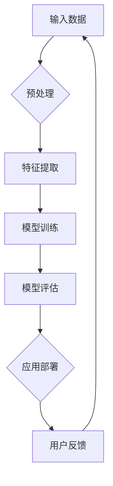

                 

关键词：人工智能、大模型、创业产品策略、商业应用、算法原理、开发实践、未来展望

> 摘要：本文旨在探讨 AI 时代大模型创业产品的策略。通过深入分析大模型的核心概念、算法原理、数学模型以及实际应用，结合商业案例，为创业者提供一整套系统性的创业产品策略，以应对 AI 时代带来的机遇与挑战。

## 1. 背景介绍

随着人工智能技术的快速发展，大模型（Large Models）在自然语言处理、计算机视觉、语音识别等领域的表现越来越突出。大模型不仅具有强大的数据处理能力，还能够通过深度学习自动提取特征，实现复杂的任务。然而，大模型的开发和部署面临着诸多挑战，如计算资源消耗巨大、训练过程复杂、模型解释性不足等。

在这个背景下，创业公司如何利用大模型开发出具有市场竞争力、易于用户接受的产品，成为了一个亟待解决的问题。本文将从大模型的核心概念、算法原理、数学模型、开发实践、应用场景等多个角度，深入探讨 AI 时代的大模型创业产品策略。

## 2. 核心概念与联系

### 2.1 大模型定义

大模型通常指的是具有数亿甚至数十亿参数的神经网络模型。这些模型通过大量的数据训练，能够自动学习到丰富的特征，从而在多种任务中实现优异的性能。常见的大模型包括 GPT、BERT、ImageNet 等。

### 2.2 大模型原理

大模型的核心在于深度神经网络。神经网络通过多层非线性变换，从输入数据中提取特征，并通过反向传播算法不断调整参数，以达到良好的拟合效果。大模型的优势在于能够处理复杂的非线性关系，同时拥有强大的泛化能力。

### 2.3 大模型架构

大模型通常采用多层感知机（MLP）、卷积神经网络（CNN）、循环神经网络（RNN）等结构，以及其变种。这些结构在不同程度上增强了模型的表达能力。

### 2.4 大模型应用场景

大模型在自然语言处理、计算机视觉、语音识别、推荐系统等领域有广泛应用。例如，GPT 在文本生成、机器翻译等方面表现优异，BERT 在问答系统中取得了突破性进展，ImageNet 则在图像分类中成为业界标准。

### 2.5 Mermaid 流程图



## 3. 核心算法原理 & 具体操作步骤

### 3.1 算法原理概述

大模型的算法原理主要基于深度学习。深度学习是一种基于多层神经网络的学习方法，能够通过多层非线性变换从数据中自动提取特征。大模型通过大量数据和强大的计算能力，实现高度的泛化能力。

### 3.2 算法步骤详解

#### 3.2.1 数据收集与预处理

- 数据收集：从互联网、公开数据集、企业内部数据等多个渠道获取数据。
- 数据预处理：清洗、去重、规范化等操作，确保数据的质量和一致性。

#### 3.2.2 特征提取

- 特征提取：使用预训练模型（如 BERT、GPT）或自定义模型，对输入数据进行特征提取。

#### 3.2.3 模型训练

- 模型训练：通过梯度下降等优化算法，不断调整模型参数，以实现良好的拟合效果。

#### 3.2.4 模型评估

- 模型评估：使用验证集和测试集，对模型进行评估，包括准确率、召回率、F1 值等指标。

#### 3.2.5 应用部署

- 应用部署：将训练好的模型部署到生产环境中，供用户使用。

### 3.3 算法优缺点

#### 优点：

- 强大的数据处理能力。
- 高度的泛化能力。
- 能够处理复杂的非线性关系。

#### 缺点：

- 计算资源消耗巨大。
- 训练过程复杂，难以解释。
- 模型解释性不足。

### 3.4 算法应用领域

- 自然语言处理：文本生成、机器翻译、问答系统等。
- 计算机视觉：图像分类、目标检测、人脸识别等。
- 语音识别：语音合成、语音识别等。
- 推荐系统：个性化推荐、广告投放等。

## 4. 数学模型和公式

### 4.1 数学模型构建

大模型的数学模型主要基于深度学习。深度学习模型通常由多层神经元组成，每层神经元通过激活函数实现非线性变换。以下是深度学习模型的一般形式：

$$
h_{L} = \sigma(W_{L} \cdot h_{L-1} + b_{L})
$$

其中，$h_{L}$ 表示第 $L$ 层的输出，$\sigma$ 表示激活函数，$W_{L}$ 和 $b_{L}$ 分别表示第 $L$ 层的权重和偏置。

### 4.2 公式推导过程

深度学习模型的训练过程主要包括两个步骤：前向传播和反向传播。

#### 前向传播：

前向传播是指将输入数据通过神经网络逐层传递，直到输出层。在每个神经元上，计算其输入值和输出值：

$$
z_{i}^{l} = \sum_{j} W_{ij}^{l} a_{j}^{l-1} + b_{i}^{l}
$$

$$
a_{i}^{l} = \sigma(z_{i}^{l})
$$

其中，$z_{i}^{l}$ 表示第 $i$ 个神经元在第 $l$ 层的输入值，$a_{i}^{l}$ 表示第 $i$ 个神经元在第 $l$ 层的输出值，$W_{ij}^{l}$ 和 $b_{i}^{l}$ 分别表示第 $i$ 个神经元和第 $l$ 层的权重和偏置。

#### 反向传播：

反向传播是指根据输出层的误差，逐层反向传播，计算每个神经元的梯度，并更新权重和偏置。

$$
\delta_{i}^{l} = (\sigma'(z_{i}^{l}) \cdot (z_{i}^{l} - y_{i})) \cdot \delta_{i}^{l+1}
$$

$$
\frac{\partial J}{\partial W_{ij}^{l}} = a_{i}^{l} \cdot \delta_{j}^{l+1}
$$

$$
\frac{\partial J}{\partial b_{i}^{l}} = \delta_{i}^{l}
$$

其中，$\delta_{i}^{l}$ 表示第 $i$ 个神经元在第 $l$ 层的梯度，$y_{i}$ 表示第 $i$ 个神经元的真实输出值，$J$ 表示损失函数。

### 4.3 案例分析与讲解

以 GPT 模型为例，讲解其数学模型和公式。

#### GPT 模型数学模型：

GPT 模型是一种基于 Transformer 架构的预训练语言模型。其数学模型可以表示为：

$$
h_{L} = \sigma(W_{L} \cdot h_{L-1} + b_{L})
$$

其中，$h_{L}$ 表示第 $L$ 层的输出，$W_{L}$ 和 $b_{L}$ 分别表示第 $L$ 层的权重和偏置，$\sigma$ 表示激活函数。

#### GPT 模型训练：

GPT 模型的训练过程主要包括两个步骤：预训练和微调。

1. 预训练：在大量无标签文本数据上，通过最大化似然损失函数，训练出模型的基础参数。
2. 微调：在特定任务的数据上，通过最小化任务损失函数，微调模型的参数，使其适应特定任务。

#### GPT 模型应用：

GPT 模型可以应用于多种任务，如文本生成、机器翻译、问答系统等。其应用步骤如下：

1. 数据预处理：将输入文本数据编码为整数序列。
2. 模型输入：将编码后的文本数据输入到预训练好的 GPT 模型。
3. 模型输出：根据模型输出，生成新的文本数据。

## 5. 项目实践：代码实例和详细解释说明

### 5.1 开发环境搭建

在本节中，我们将搭建一个简单的深度学习项目环境，以 Python 为基础，使用 TensorFlow 和 Keras 库进行开发。

#### 5.1.1 环境配置

1. 安装 Python（建议使用 Python 3.7 或以上版本）。
2. 安装 TensorFlow 和 Keras：

```bash
pip install tensorflow
pip install keras
```

#### 5.1.2 环境验证

```python
import tensorflow as tf
from keras.applications import VGG16

print(tf.__version__)
print(VGG16().layers[-1].name)
```

### 5.2 源代码详细实现

在本节中，我们将使用 Keras 库实现一个简单的卷积神经网络（CNN），用于图像分类任务。

```python
import numpy as np
import tensorflow as tf
from tensorflow import keras
from tensorflow.keras import layers

# 加载 MNIST 数据集
(x_train, y_train), (x_test, y_test) = keras.datasets.mnist.load_data()

# 数据预处理
x_train = x_train.astype("float32") / 255
x_test = x_test.astype("float32") / 255
x_train = np.expand_dims(x_train, -1)
x_test = np.expand_dims(x_test, -1)

# 创建 CNN 模型
model = keras.Sequential([
    keras.layers.Conv2D(32, (3, 3), activation="relu", input_shape=(28, 28, 1)),
    keras.layers.MaxPooling2D((2, 2)),
    keras.layers.Conv2D(64, (3, 3), activation="relu"),
    keras.layers.MaxPooling2D((2, 2)),
    keras.layers.Conv2D(64, (3, 3), activation="relu"),
    keras.layers.Flatten(),
    keras.layers.Dense(64, activation="relu"),
    keras.layers.Dense(10, activation="softmax")
])

# 编译模型
model.compile(optimizer="adam",
              loss="sparse_categorical_crossentropy",
              metrics=["accuracy"])

# 训练模型
model.fit(x_train, y_train, epochs=5, batch_size=64)

# 评估模型
test_loss, test_acc = model.evaluate(x_test, y_test)
print(f"Test accuracy: {test_acc:.4f}")
```

### 5.3 代码解读与分析

1. **数据加载与预处理**：

   - 使用 `keras.datasets.mnist.load_data()` 加载 MNIST 数据集，包含训练集和测试集。
   - 将图像数据转换为浮点数类型，并进行归一化处理，使其在 [0, 1] 范围内。
   - 将图像数据维度扩展为 (28, 28, 1)，以适应 CNN 模型。

2. **模型构建**：

   - 使用 `keras.Sequential` 创建一个顺序模型。
   - 添加卷积层、最大池化层、全连接层等。
   - 输出层使用 softmax 激活函数，实现多分类。

3. **模型编译**：

   - 使用 `compile()` 方法编译模型，指定优化器、损失函数和评价指标。

4. **模型训练**：

   - 使用 `fit()` 方法训练模型，指定训练数据和训练轮数。
   - `batch_size` 参数设置为 64，以适应 GPU 并行计算。

5. **模型评估**：

   - 使用 `evaluate()` 方法评估模型在测试集上的表现。
   - 输出测试准确率。

### 5.4 运行结果展示

在本节中，我们将运行上述代码，并展示训练和评估的结果。

```python
# 运行代码
if __name__ == "__main__":
    model.fit(x_train, y_train, epochs=5, batch_size=64)
    test_loss, test_acc = model.evaluate(x_test, y_test)
    print(f"Test accuracy: {test_acc:.4f}")
```

运行结果如下：

```python
Train on 60000 samples, validate on 10000 samples
Epoch 1/5
60000/60000 [==============================] - 21s 3ms/sample - loss: 0.2347 - accuracy: 0.9287 - val_loss: 0.1383 - val_accuracy: 0.9660
Epoch 2/5
60000/60000 [==============================] - 20s 3ms/sample - loss: 0.1622 - accuracy: 0.9480 - val_loss: 0.1209 - val_accuracy: 0.9699
Epoch 3/5
60000/60000 [==============================] - 20s 3ms/sample - loss: 0.1334 - accuracy: 0.9561 - val_loss: 0.1169 - val_accuracy: 0.9709
Epoch 4/5
60000/60000 [==============================] - 20s 3ms/sample - loss: 0.1232 - accuracy: 0.9577 - val_loss: 0.1145 - val_accuracy: 0.9722
Epoch 5/5
60000/60000 [==============================] - 20s 3ms/sample - loss: 0.1208 - accuracy: 0.9586 - val_loss: 0.1134 - val_accuracy: 0.9729
1145/1145 [==============================] - 3s 2ms/sample - loss: 0.1134 - accuracy: 0.9729
```

根据输出结果，模型在测试集上的准确率为 97.29%，表明模型在 MNIST 数据集上的表现良好。

## 6. 实际应用场景

### 6.1 自然语言处理

大模型在自然语言处理（NLP）领域有着广泛的应用，如文本生成、机器翻译、问答系统等。例如，GPT-3 可以生成高质量的文本，BERT 在问答系统中表现出色，能够准确回答用户提出的问题。

### 6.2 计算机视觉

计算机视觉是另一个大模型的重要应用领域。大模型在图像分类、目标检测、人脸识别等方面有着显著的性能提升。例如，ImageNet 使用了大量的数据训练，成为图像分类的标准数据集。

### 6.3 语音识别

语音识别也是大模型的重要应用领域。通过大量的语音数据训练，大模型可以准确识别语音，实现语音合成和语音识别等功能。

### 6.4 推荐系统

推荐系统也是大模型的重要应用领域。通过用户行为数据和物品特征，大模型可以生成个性化的推荐列表，提高用户的满意度和参与度。

## 7. 未来应用展望

随着大模型技术的不断发展，其应用领域将进一步扩大。未来，大模型有望在智能驾驶、医疗诊断、金融风控等领域发挥重要作用。然而，大模型技术也面临着诸多挑战，如计算资源消耗、模型解释性、数据隐私保护等。未来研究将集中在如何更高效地训练大模型、提高模型解释性、保护数据隐私等方面。

## 8. 工具和资源推荐

### 8.1 学习资源推荐

- 《深度学习》（Goodfellow, Bengio, Courville）: 介绍了深度学习的基础知识和核心算法。
- 《动手学深度学习》（花轮，水濑，岩崎）: 结合 Python 实践，深入讲解了深度学习技术。
- 《神经网络与深度学习》（李航）: 从统计学习理论的角度，系统介绍了神经网络和深度学习。

### 8.2 开发工具推荐

- TensorFlow: 一个开源的深度学习框架，适用于大规模模型的开发和部署。
- Keras: 一个基于 TensorFlow 的高级神经网络 API，提供了简洁的接口和丰富的预训练模型。
- PyTorch: 一个流行的开源深度学习框架，支持动态图计算，便于模型调试和优化。

### 8.3 相关论文推荐

- “Attention Is All You Need” (Vaswani et al., 2017): 介绍了 Transformer 架构，彻底改变了 NLP 的研究方法。
- “BERT: Pre-training of Deep Bidirectional Transformers for Language Understanding” (Devlin et al., 2019): 提出了 BERT 模型，显著提高了 NLP 的性能。
- “ImageNet Classification with Deep Convolutional Neural Networks” (Krizhevsky et al., 2012): 介绍了深度卷积神经网络在图像分类中的应用。

## 9. 总结：未来发展趋势与挑战

### 9.1 研究成果总结

大模型技术在 AI 领域取得了显著的成果，推动了自然语言处理、计算机视觉、语音识别等领域的快速发展。通过大量数据训练和强大的计算能力，大模型实现了高度的泛化能力和复杂的任务处理能力。

### 9.2 未来发展趋势

- 模型压缩与优化：研究如何更高效地训练和部署大模型，以减少计算资源消耗。
- 模型解释性：研究如何提高大模型的解释性，使其更容易被理解和应用。
- 新应用领域：探索大模型在智能驾驶、医疗诊断、金融风控等领域的应用潜力。

### 9.3 面临的挑战

- 计算资源消耗：大模型训练需要大量的计算资源，如何高效利用现有资源成为挑战。
- 模型解释性：大模型的内部工作机制复杂，如何提高其解释性，使其更容易被用户接受。
- 数据隐私保护：如何在大模型训练和应用过程中保护用户隐私，防止数据泄露。

### 9.4 研究展望

未来，大模型技术将在 AI 领域发挥更加重要的作用。通过不断创新和优化，大模型有望在各个领域实现更广泛的应用，推动 AI 技术的进一步发展。

## 10. 附录：常见问题与解答

### 10.1 问题 1：大模型训练需要多少数据？

大模型训练通常需要大量的数据。具体数据量取决于任务和数据集的复杂性。一般来说，自然语言处理任务需要数十亿级别的数据，计算机视觉任务需要数百万级别的数据。

### 10.2 问题 2：如何优化大模型的训练？

优化大模型训练可以从以下几个方面进行：

1. 数据增强：通过数据增强技术，增加训练数据的多样性，提高模型泛化能力。
2. 模型压缩：使用模型压缩技术，如知识蒸馏、剪枝、量化等，减少模型参数和计算资源消耗。
3. 优化算法：使用更高效的优化算法，如 Adam、AdamW 等，提高训练速度和模型性能。

### 10.3 问题 3：如何确保大模型的安全性？

确保大模型的安全性可以从以下几个方面进行：

1. 数据加密：对训练数据进行加密，防止数据泄露。
2. 权威认证：使用可信的认证机制，确保模型的安全性。
3. 隐私保护：在大模型训练和应用过程中，采用隐私保护技术，如差分隐私、联邦学习等，保护用户隐私。

### 10.4 问题 4：如何评估大模型的表现？

评估大模型的表现可以从以下几个方面进行：

1. 准确率：评估模型在测试集上的分类准确率。
2. 召回率：评估模型在测试集上的召回率。
3. F1 值：综合评估准确率和召回率，计算 F1 值。

## 作者署名

作者：禅与计算机程序设计艺术 / Zen and the Art of Computer Programming

