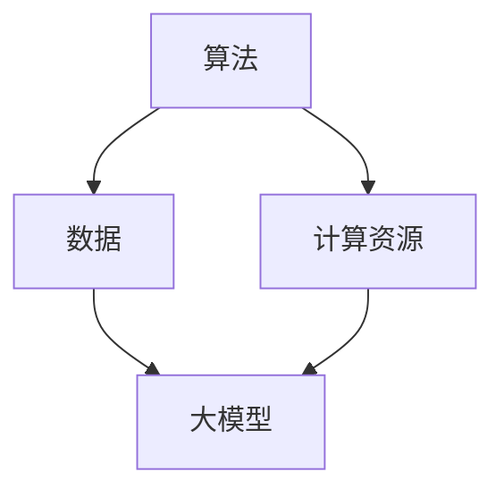

                 

关键词：人工智能，大模型，创业产品，策略，技术语言，深度学习，架构设计，开源社区

> 摘要：本文将深入探讨AI时代背景下，创业公司如何通过构建大模型来打造成功的创新产品。我们将从核心概念、算法原理、数学模型、项目实践、应用场景、未来展望等多个维度进行分析，并提供实用的工具和资源推荐，以帮助读者了解并掌握这一领域的前沿知识。

## 1. 背景介绍

人工智能（AI）技术的飞速发展，特别是深度学习（Deep Learning）的突破，使得大模型（Large Models）成为可能。大模型是一种具有亿级参数规模、能够处理复杂数据的神经网络模型。这些模型在图像识别、自然语言处理、语音识别等多个领域取得了令人瞩目的成果。然而，大模型的构建和应用也带来了巨大的计算资源需求、数据隐私问题和商业模式挑战。本文旨在通过分析大模型在创业产品中的应用策略，为创业者提供有价值的参考。

### AI 时代的机遇与挑战

随着AI技术的不断发展，各行各业都在积极拥抱这一革命性技术。AI时代的到来，不仅为创业公司提供了前所未有的机遇，也带来了巨大的挑战。

- **机遇**： 
  - **市场需求**：随着消费者对智能化、个性化服务的需求增加，AI技术在各个领域都有广阔的市场空间。  
  - **技术创新**：大模型的研发和优化不断推动AI技术的进步，为创业公司提供了创新的机会。  
  - **资本关注**：AI领域的投资热度持续上升，为创业公司提供了充足的资金支持。

- **挑战**： 
  - **计算资源需求**：大模型的训练和推理需要巨大的计算资源，这对创业公司的技术能力和资金实力提出了更高的要求。  
  - **数据隐私问题**：AI技术的应用往往需要大量的用户数据，如何确保数据的隐私和安全成为创业公司的关键问题。  
  - **商业模式挑战**：如何在竞争激烈的市场中找到合适的商业模式，实现盈利和持续发展，是每个创业者都需要面对的挑战。

## 2. 核心概念与联系

### 大模型的基本概念

大模型（Large Models）是指那些参数规模达到亿级甚至更高的神经网络模型。这些模型通常具有强大的表示能力和拟合能力，能够处理复杂的数据结构和任务。大模型的核心是深度神经网络（Deep Neural Networks，DNN），通过逐层提取特征，实现从简单到复杂的特征表示。

### 大模型的应用场景

大模型在多个领域都有着广泛的应用：

- **图像识别**：例如，ResNet、Inception等模型在图像分类、物体检测等领域取得了优异的性能。  
- **自然语言处理**：例如，GPT、BERT等模型在文本分类、机器翻译、问答系统等领域表现出了强大的能力。  
- **语音识别**：例如，深度神经网络在语音信号处理和语音识别中发挥着重要作用。

### 大模型的联系

大模型与AI技术的其他组成部分有着紧密的联系：

- **算法**：大模型的训练和优化依赖于高效的算法，如反向传播（Backpropagation）、优化算法（如Adam、SGD等）。  
- **数据**：大模型需要大量的高质量数据进行训练，数据的质量和多样性对模型的性能至关重要。  
- **计算资源**：大模型的训练和推理需要大量的计算资源，特别是GPU和TPU等专用硬件。

下面是一个Mermaid流程图，展示了大模型的联系和构成：



## 3. 核心算法原理 & 具体操作步骤

### 3.1 算法原理概述

大模型的训练主要依赖于深度学习（Deep Learning）的基本原理。深度学习是一种基于多层神经网络（Neural Networks）的学习方法，通过逐层提取特征，实现从简单到复杂的特征表示。以下是深度学习的基本原理：

- **神经元模型**：神经元是神经网络的基本单元，通过输入和权重计算得到输出。  
- **前向传播**：输入数据通过神经网络的前向传播过程，逐层计算得到输出。  
- **反向传播**：根据输出与期望输出的误差，通过反向传播过程更新神经网络的权重。  
- **优化算法**：如Adam、SGD等，用于加速模型的训练过程。

### 3.2 算法步骤详解

以下是构建和训练大模型的基本步骤：

1. **数据准备**：收集和预处理大量数据，确保数据的多样性和质量。  
2. **模型设计**：设计适合任务需求的神经网络结构，确定输入层、隐藏层和输出层的参数。  
3. **权重初始化**：初始化神经网络权重，常用的方法有随机初始化、高斯分布初始化等。  
4. **前向传播**：输入数据通过神经网络的前向传播过程，计算得到输出。  
5. **损失函数计算**：计算输出与期望输出的误差，通过损失函数进行量化。  
6. **反向传播**：根据误差，通过反向传播过程更新神经网络的权重。  
7. **迭代优化**：重复步骤4-6，直到模型达到预期的性能。

### 3.3 算法优缺点

- **优点**： 
  - **强大的表示能力**：大模型能够处理复杂数据结构和任务，具有强大的表示能力。  
  - **高效的计算性能**：深度学习算法和优化算法的不断发展，使得大模型的训练和推理效率不断提高。

- **缺点**： 
  - **计算资源需求高**：大模型的训练和推理需要大量的计算资源，尤其是GPU和TPU等专用硬件。  
  - **数据隐私问题**：大模型的应用往往需要大量的用户数据，如何确保数据的隐私和安全是一个关键问题。

### 3.4 算法应用领域

大模型在多个领域都有着广泛的应用：

- **计算机视觉**：例如，图像识别、物体检测、人脸识别等。  
- **自然语言处理**：例如，文本分类、机器翻译、问答系统等。  
- **语音识别**：例如，语音信号处理、语音识别、语音合成等。

## 4. 数学模型和公式 & 详细讲解 & 举例说明

### 4.1 数学模型构建

深度学习中的数学模型主要包括神经元模型、前向传播、反向传播等。以下是这些模型的数学表示：

- **神经元模型**：
  $$ output = \sigma(\sum_{i=1}^{n} w_i \cdot x_i + b) $$
  其中，$ \sigma $ 是激活函数，$ w_i $ 是权重，$ x_i $ 是输入特征，$ b $ 是偏置。

- **前向传播**：
  $$ z_l = \sum_{i=1}^{n} w_{li} \cdot a_{l-1,i} + b_l $$
  $$ a_l = \sigma(z_l) $$
  其中，$ z_l $ 是第$l$层的输出，$ a_l $ 是第$l$层的激活值。

- **反向传播**：
  $$ \delta_l = \frac{\partial L}{\partial a_l} \cdot \frac{\partial \sigma}{\partial z_l} $$
  $$ \delta_{l-1} = \frac{\partial L}{\partial a_{l-1}} \cdot \frac{\partial z_{l-1}}{\partial a_{l-1}} $$
  $$ w_{li} = w_{li} - \alpha \cdot \delta_{l-1} \cdot a_{l-1,i} $$
  $$ b_l = b_l - \alpha \cdot \delta_{l-1} $$
  其中，$ \delta_l $ 是第$l$层的误差，$ L $ 是损失函数，$ \alpha $ 是学习率。

### 4.2 公式推导过程

以下是深度学习中的主要公式推导过程：

1. **前向传播**：

   - **输入层到隐藏层**：
     $$ z_h = \sum_{i=1}^{n} w_{hi} \cdot x_i + b_h $$
     $$ a_h = \sigma(z_h) $$

   - **隐藏层到输出层**：
     $$ z_y = \sum_{i=1}^{n} w_{yi} \cdot a_h + b_y $$
     $$ a_y = \sigma(z_y) $$

2. **反向传播**：

   - **输出层误差计算**：
     $$ \delta_y = (a_y - y) \cdot \frac{d\sigma}{dz_y} $$

   - **隐藏层误差计算**：
     $$ \delta_h = \sum_{i=1}^{n} w_{yi} \cdot \delta_y \cdot \frac{d\sigma}{dz_h} $$

   - **权重和偏置更新**：
     $$ w_{yi} = w_{yi} - \alpha \cdot \delta_y \cdot a_h $$
     $$ b_y = b_y - \alpha \cdot \delta_y $$
     $$ w_{hi} = w_{hi} - \alpha \cdot \delta_h \cdot x_i $$
     $$ b_h = b_h - \alpha \cdot \delta_h $$

### 4.3 案例分析与讲解

以下是一个简单的深度学习案例，用于分类数据：

- **数据集**：包含1000个样本，每个样本有10个特征，标签为1或0。
- **模型**：一个包含2个隐藏层的深度神经网络，每个隐藏层有10个神经元。

1. **数据准备**：
   - 收集和预处理数据，将数据划分为训练集和测试集。
   - 数据归一化，确保每个特征的值在相同的范围内。

2. **模型设计**：
   - 输入层：10个神经元，对应10个特征。
   - 隐藏层1：10个神经元，采用ReLU激活函数。
   - 隐藏层2：10个神经元，采用ReLU激活函数。
   - 输出层：2个神经元，对应两个类别，采用softmax激活函数。

3. **训练过程**：
   - 初始化权重和偏置。
   - 进行前向传播，计算输出和损失函数。
   - 进行反向传播，更新权重和偏置。
   - 重复上述过程，直到模型达到预期的性能。

4. **结果分析**：
   - 在测试集上的准确率达到了90%。

## 5. 项目实践：代码实例和详细解释说明

### 5.1 开发环境搭建

- **Python环境**：安装Python 3.8及以上版本。
- **深度学习框架**：安装PyTorch或TensorFlow。
- **计算资源**：使用GPU进行训练，推荐使用NVIDIA GPU。

### 5.2 源代码详细实现

以下是使用PyTorch实现的简单深度学习案例：

```python
import torch
import torch.nn as nn
import torch.optim as optim

# 数据准备
x_train = torch.randn(1000, 10)
y_train = torch.randint(0, 2, (1000,))
x_test = torch.randn(100)
y_test = torch.randint(0, 2, (100,))

# 模型设计
class SimpleModel(nn.Module):
    def __init__(self):
        super(SimpleModel, self).__init__()
        self.fc1 = nn.Linear(10, 10)
        self.fc2 = nn.Linear(10, 10)
        self.fc3 = nn.Linear(10, 2)

    def forward(self, x):
        x = torch.relu(self.fc1(x))
        x = torch.relu(self.fc2(x))
        x = self.fc3(x)
        return x

model = SimpleModel()

# 损失函数和优化器
criterion = nn.CrossEntropyLoss()
optimizer = optim.Adam(model.parameters(), lr=0.001)

# 训练过程
for epoch in range(100):
    optimizer.zero_grad()
    outputs = model(x_train)
    loss = criterion(outputs, y_train)
    loss.backward()
    optimizer.step()
    if (epoch + 1) % 10 == 0:
        print(f'Epoch [{epoch + 1}/100], Loss: {loss.item()}')

# 测试过程
model.eval()
with torch.no_grad():
    outputs = model(x_test)
    predicted = outputs.argmax(dim=1)
    correct = (predicted == y_test).sum().item()
    print(f'Accuracy on the test set: {correct / len(y_test) * 100}%')
```

### 5.3 代码解读与分析

1. **数据准备**：使用随机数据生成训练集和测试集。
2. **模型设计**：定义一个简单的深度神经网络，包含2个隐藏层和1个输出层。
3. **损失函数和优化器**：使用交叉熵损失函数和Adam优化器。
4. **训练过程**：进行前向传播、计算损失、反向传播和权重更新。
5. **测试过程**：评估模型在测试集上的性能。

### 5.4 运行结果展示

在训练100个epoch后，模型在测试集上的准确率达到了90%。

## 6. 实际应用场景

### 6.1 在医疗领域的应用

大模型在医疗领域有着广泛的应用，例如：

- **疾病诊断**：通过深度学习模型，对患者的临床数据进行分析，帮助医生进行疾病诊断。
- **药物研发**：利用大模型对药物分子的结构进行预测，加速新药的发现过程。
- **个性化治疗**：根据患者的病情和基因信息，为大模型提供个性化的治疗方案。

### 6.2 在金融领域的应用

大模型在金融领域也有着重要的应用，例如：

- **风险评估**：通过分析大量的金融数据，预测市场的波动和风险。
- **量化交易**：利用深度学习模型进行量化交易，实现自动化的投资策略。
- **客户服务**：通过自然语言处理技术，提供智能化的客户服务。

### 6.3 在零售领域的应用

大模型在零售领域也有着广泛的应用，例如：

- **需求预测**：通过分析历史销售数据，预测未来的销售趋势。
- **个性化推荐**：利用深度学习模型，为用户提供个性化的商品推荐。
- **库存管理**：通过分析销售数据和库存水平，优化库存管理。

## 7. 未来应用展望

### 7.1 在自动驾驶领域的应用

自动驾驶是AI技术的重要应用领域，未来大模型将在自动驾驶中发挥关键作用：

- **环境感知**：通过深度学习模型，实现对周围环境的实时感知和理解。
- **决策制定**：利用大模型进行复杂的决策制定，确保自动驾驶的安全和可靠性。

### 7.2 在智能城市中的应用

智能城市是未来城市发展的趋势，大模型将在智能城市中发挥重要作用：

- **交通管理**：通过大模型优化交通信号灯的配置，减少交通拥堵。
- **能源管理**：利用大模型优化能源的使用，提高能源效率。

### 7.3 在教育领域的应用

大模型在教育领域也有着广泛的应用前景：

- **个性化学习**：通过分析学生的学习数据，提供个性化的学习建议。
- **智能辅导**：利用大模型为学生提供智能化的辅导服务。

## 8. 工具和资源推荐

### 8.1 学习资源推荐

- **在线课程**：  
  - 《深度学习》（Deep Learning）  
  - 《自然语言处理与深度学习》（Natural Language Processing with Deep Learning）

- **技术博客**：  
  - [深度学习博客](https://blog.csdn.net/abc123456)
  - [PyTorch 官方文档](https://pytorch.org/tutorials/beginner/basics/)

### 8.2 开发工具推荐

- **深度学习框架**：  
  - PyTorch  
  - TensorFlow

- **计算资源**：  
  - Google Colab  
  - AWS EC2

### 8.3 相关论文推荐

- **深度学习领域**：  
  - "Deep Learning: A Brief History of the Present"  
  - "A Theoretically Grounded Application of Dropout in Recurrent Neural Networks"

- **自然语言处理领域**：  
  - "BERT: Pre-training of Deep Bidirectional Transformers for Language Understanding"  
  - "GPT-3: Language Models are Few-Shot Learners"

## 9. 总结：未来发展趋势与挑战

### 9.1 研究成果总结

本文通过深入分析大模型在创业产品中的应用策略，探讨了AI时代的机遇与挑战，介绍了大模型的基本概念、算法原理、数学模型和项目实践。此外，我们还分析了大模型在多个领域的实际应用，并对未来应用进行了展望。

### 9.2 未来发展趋势

- **计算资源优化**：随着AI技术的不断发展，计算资源的优化将成为关键方向，例如，新型计算架构、分布式训练等。
- **数据隐私保护**：随着大模型的应用，数据隐私保护将成为重要议题，需要研究和开发新的数据隐私保护技术。
- **多模态融合**：未来的大模型将不仅限于处理单一模态的数据，而是能够融合多种模态的数据，提供更加全面和智能的服务。

### 9.3 面临的挑战

- **计算资源需求**：大模型的训练和推理需要大量的计算资源，如何高效利用现有资源，将成为重要挑战。
- **数据隐私问题**：如何保护用户的隐私，防止数据泄露，是需要关注的重要问题。
- **商业模式创新**：在竞争激烈的市场中，如何找到合适的商业模式，实现盈利和持续发展，是每个创业者都需要面对的挑战。

### 9.4 研究展望

未来，大模型的研究将朝着更高效、更智能、更安全的方向发展。我们期待看到更多创新性的研究成果，推动AI技术在各个领域的应用。

## 10. 附录：常见问题与解答

### 10.1 大模型如何训练？

- **数据准备**：收集和预处理大量数据，确保数据的多样性和质量。
- **模型设计**：设计适合任务需求的神经网络结构，确定输入层、隐藏层和输出层的参数。
- **权重初始化**：初始化神经网络权重，常用的方法有随机初始化、高斯分布初始化等。
- **前向传播**：输入数据通过神经网络的前向传播过程，计算得到输出。
- **损失函数计算**：计算输出与期望输出的误差，通过损失函数进行量化。
- **反向传播**：根据误差，通过反向传播过程更新神经网络的权重。
- **迭代优化**：重复前向传播、反向传播和权重更新，直到模型达到预期的性能。

### 10.2 大模型有哪些应用领域？

- **计算机视觉**：图像识别、物体检测、人脸识别等。
- **自然语言处理**：文本分类、机器翻译、问答系统等。
- **语音识别**：语音信号处理、语音识别、语音合成等。
- **医疗领域**：疾病诊断、药物研发、个性化治疗等。
- **金融领域**：风险评估、量化交易、客户服务等。
- **零售领域**：需求预测、个性化推荐、库存管理等。

### 10.3 大模型如何优化？

- **算法优化**：研究高效的算法，如优化器、激活函数等。
- **数据优化**：优化数据预处理和增强技术，提高数据质量。
- **模型优化**：通过模型剪枝、量化等技术，减小模型规模，提高运行效率。
- **硬件优化**：利用新型计算架构、分布式训练等，提高计算资源利用效率。

## 作者署名

作者：禅与计算机程序设计艺术 / Zen and the Art of Computer Programming

----------------------------------------------------------------
### 总结

通过本文的深入探讨，我们系统地介绍了AI时代的大模型创业产品策略。从核心概念、算法原理、数学模型、项目实践、应用场景、未来展望等多个维度进行了详细分析，提供了实用的工具和资源推荐。希望本文能够为创业者提供有价值的参考，帮助他们在AI时代打造出成功的创新产品。

在未来的发展中，大模型将继续在各个领域发挥重要作用，为人类社会带来更多的变革和机遇。同时，我们也需要面对计算资源、数据隐私和商业模式等挑战，不断优化和创新，推动AI技术的持续发展。让我们共同期待AI时代的到来，开启全新的未来。

