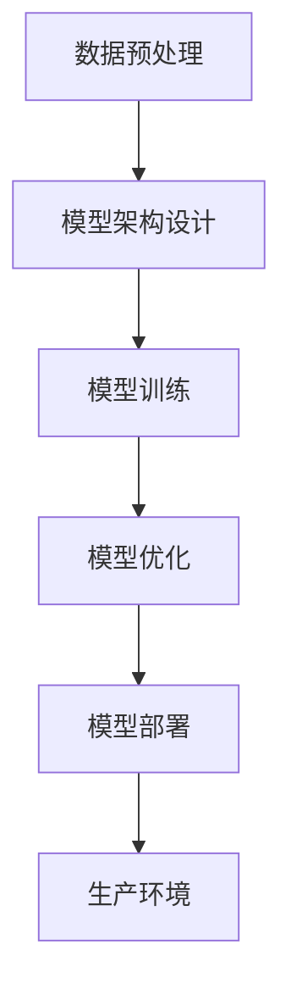

                 

关键词：AI，创业，产品创新，大模型，赋能

> 摘要：在当今快速发展的数字化时代，人工智能（AI）技术已经成为驱动创业产品创新的核心动力。本文将探讨如何利用大模型技术赋能创业产品，为创业公司提供一整套从概念验证到市场推出的系统性指南。我们将深入分析大模型原理、应用场景、数学模型、项目实践，并展望其未来发展趋势与挑战。

## 1. 背景介绍

近年来，随着计算能力的提升和海量数据的积累，人工智能技术，尤其是深度学习技术，取得了显著的进步。大模型（Large Model）作为一种重要的AI模型，凭借其强大的学习和泛化能力，正在成为众多创业公司产品创新的利器。大模型不仅能够处理复杂数据，还能通过自主学习和优化实现高效的决策和预测。

创业公司往往面临着资源有限、市场竞争激烈等挑战。利用大模型技术，创业公司可以在短时间内实现产品创新，提高竞争力。然而，大模型的应用并非一蹴而就，需要深入理解其原理、技术架构、数学模型以及实际应用。

本文旨在为创业公司提供一套完整的AI驱动的产品创新指南，帮助创业者在大模型时代找到适合自己的发展路径。文章结构如下：

- 背景介绍：阐述AI技术背景及大模型的重要性。
- 核心概念与联系：介绍大模型的基本原理和技术架构。
- 核心算法原理 & 具体操作步骤：讲解大模型的核心算法和操作流程。
- 数学模型和公式：分析大模型的数学模型和公式。
- 项目实践：提供实际的代码实例和详细解释。
- 实际应用场景：探讨大模型在不同领域的应用。
- 未来应用展望：预测大模型未来的发展趋势和挑战。
- 工具和资源推荐：推荐学习和开发资源。
- 总结：总结研究成果，展望未来发展方向。

## 2. 核心概念与联系

大模型是一种具有大量参数的机器学习模型，通常由深度神经网络构成。这些模型通过从大量数据中学习，能够实现对复杂数据的建模和预测。大模型的显著特点是：

- 参数数量庞大：大模型通常包含数亿到数十亿个参数，这使其能够处理复杂的数据结构和模式。
- 计算资源需求高：由于参数数量庞大，大模型需要大量的计算资源进行训练和推理。
- 学习能力强大：大模型能够通过多层神经网络自动学习特征，并利用这些特征进行预测和决策。

大模型的核心技术架构通常包括以下几个方面：

### 2.1 数据预处理

数据预处理是确保数据质量的重要环节。主要包括数据清洗、归一化、数据增强等操作。数据预处理的质量直接影响到模型的性能。

### 2.2 模型架构设计

大模型的架构设计至关重要。常见的架构包括卷积神经网络（CNN）、循环神经网络（RNN）、Transformer等。不同的架构适用于不同的任务和数据类型。

### 2.3 模型训练

模型训练是利用大量数据对模型进行迭代优化，使其能够达到预期性能的过程。训练过程中需要平衡模型性能和计算资源之间的矛盾。

### 2.4 模型优化

模型优化包括超参数调优、模型剪枝、量化等技术，以提高模型效率和性能。

### 2.5 模型部署

模型部署是将训练好的模型部署到生产环境，实现实时预测和决策的过程。部署过程中需要考虑模型的可靠性、效率和可维护性。

以下是使用Mermaid绘制的简化的大模型技术架构流程图：



## 3. 核心算法原理 & 具体操作步骤

### 3.1 算法原理概述

大模型的核心算法是基于深度学习的多层神经网络。神经网络通过多层非线性变换，将输入数据映射到输出。大模型的算法原理包括以下几个方面：

- 前向传播：输入数据通过网络中的多层神经元，逐层传递并计算输出。
- 反向传播：通过计算输出误差，反向传播误差至输入层，更新网络权重。
- 激活函数：用于引入非线性变换，使网络具有区分能力。

### 3.2 算法步骤详解

大模型的训练过程通常包括以下步骤：

1. 数据预处理：清洗数据、归一化、数据增强等。
2. 构建模型：定义神经网络结构，包括输入层、隐藏层和输出层。
3. 模型编译：指定损失函数、优化器等训练参数。
4. 模型训练：使用训练数据对模型进行迭代训练。
5. 模型评估：使用验证数据评估模型性能。
6. 模型优化：根据评估结果对模型进行调整和优化。
7. 模型部署：将训练好的模型部署到生产环境。

### 3.3 算法优缺点

大模型的优点包括：

- 强大的学习能力：能够从大量数据中自动学习特征。
- 泛化能力强：适用于多种任务和数据类型。

大模型的缺点包括：

- 计算资源需求高：训练和推理需要大量计算资源。
- 模型解释性差：难以解释模型决策过程。

### 3.4 算法应用领域

大模型在以下领域具有广泛应用：

- 图像识别：如人脸识别、物体检测等。
- 自然语言处理：如机器翻译、文本生成等。
- 语音识别：如语音识别、语音合成等。
- 推荐系统：如商品推荐、新闻推荐等。

## 4. 数学模型和公式

### 4.1 数学模型构建

大模型的数学模型主要包括以下部分：

1. 输入层：接收外部输入，如图像、文本等。
2. 隐藏层：通过非线性变换，对输入数据进行特征提取。
3. 输出层：对隐藏层输出的特征进行分类或回归。

以下是神经网络的基本数学模型：

$$
h_{l}^{[i]} = \sigma (W^{[l]} \cdot h_{l-1}^{[i]} + b^{[l]})
$$

其中，$h_{l}^{[i]}$为第$l$层的第$i$个神经元的输出，$W^{[l]}$为第$l$层的权重矩阵，$b^{[l]}$为第$l$层的偏置向量，$\sigma$为激活函数。

### 4.2 公式推导过程

神经网络的前向传播和反向传播过程可以通过以下步骤推导：

1. 前向传播：计算各层神经元的输出。
2. 损失函数：计算模型输出与真实值之间的误差。
3. 反向传播：计算各层权重的梯度，更新网络参数。

以下是反向传播算法的基本公式：

$$
\frac{\partial J}{\partial W^{[l]}} = \sum_{i=1}^{m} \frac{\partial L}{\partial z^{[l]}} \cdot \frac{\partial z^{[l]}}{\partial W^{[l]}}
$$

$$
\frac{\partial J}{\partial b^{[l]}} = \sum_{i=1}^{m} \frac{\partial L}{\partial z^{[l]}}
$$

其中，$J$为损失函数，$L$为损失函数关于第$l$层输出$z^{[l]}$的梯度，$m$为样本数量。

### 4.3 案例分析与讲解

以下是一个简单的神经网络模型在图像识别任务中的应用案例：

假设我们有一个包含1000个图像的分类任务，每个图像的大小为32x32像素，图像数据集划分为训练集和验证集。我们使用一个三层神经网络进行图像分类，包括一个输入层、一个隐藏层和一个输出层。隐藏层包含100个神经元。

1. 数据预处理：对图像数据进行归一化处理，将像素值缩放到[0, 1]范围内。
2. 模型构建：定义输入层、隐藏层和输出层的神经网络结构。
3. 模型编译：指定损失函数为交叉熵损失函数，优化器为Adam优化器。
4. 模型训练：使用训练数据进行迭代训练，优化网络参数。
5. 模型评估：使用验证数据评估模型性能。
6. 模型优化：根据验证集的性能对模型进行调整。

通过上述步骤，我们成功训练了一个能够进行图像分类的大模型。在训练过程中，我们可以使用TensorFlow等深度学习框架，简化模型构建和训练的复杂性。

## 5. 项目实践：代码实例和详细解释说明

在本节中，我们将通过一个简单的项目实例，展示如何使用Python和TensorFlow框架实现一个基于大模型的图像分类任务。我们将从开发环境搭建开始，逐步介绍源代码的实现细节，并对关键代码进行解读和分析。

### 5.1 开发环境搭建

为了实现本项目，我们需要安装以下工具和库：

- Python 3.8或更高版本
- TensorFlow 2.7或更高版本
- NumPy 1.21或更高版本

安装命令如下：

```bash
pip install tensorflow numpy
```

### 5.2 源代码详细实现

以下是一个简单的基于卷积神经网络（CNN）的图像分类项目示例：

```python
import tensorflow as tf
from tensorflow.keras import layers
import numpy as np

# 数据预处理
def preprocess_images(images):
    return images / 255.0

# 构建模型
def create_model(input_shape, num_classes):
    model = tf.keras.Sequential([
        layers.Conv2D(32, (3, 3), activation='relu', input_shape=input_shape),
        layers.MaxPooling2D((2, 2)),
        layers.Conv2D(64, (3, 3), activation='relu'),
        layers.MaxPooling2D((2, 2)),
        layers.Conv2D(128, (3, 3), activation='relu'),
        layers.Flatten(),
        layers.Dense(128, activation='relu'),
        layers.Dense(num_classes, activation='softmax')
    ])
    return model

# 训练模型
def train_model(model, train_images, train_labels, val_images, val_labels, epochs):
    model.compile(optimizer='adam',
                  loss='sparse_categorical_crossentropy',
                  metrics=['accuracy'])
    model.fit(train_images, train_labels, epochs=epochs, validation_data=(val_images, val_labels))

# 主函数
def main():
    # 读取数据
    (train_images, train_labels), (test_images, test_labels) = tf.keras.datasets.mnist.load_data()

    # 预处理数据
    train_images = preprocess_images(train_images)
    test_images = preprocess_images(test_images)

    # 划分训练集和验证集
    train_images, val_images = train_images[:60000], train_images[60000:]
    train_labels, val_labels = train_labels[:60000], train_labels[60000:]

    # 创建模型
    model = create_model(input_shape=(28, 28, 1), num_classes=10)

    # 训练模型
    train_model(model, train_images, train_labels, val_images, val_labels, epochs=10)

    # 评估模型
    test_loss, test_acc = model.evaluate(test_images,  test_labels, verbose=2)
    print('\nTest accuracy:', test_acc)

if __name__ == '__main__':
    main()
```

### 5.3 代码解读与分析

上述代码实现了一个基于卷积神经网络（CNN）的手写数字识别项目。以下是对关键代码段的解读和分析：

1. **数据预处理**：

```python
def preprocess_images(images):
    return images / 255.0
```

该函数将图像数据缩放到[0, 1]范围内，以便于后续的模型训练。

2. **构建模型**：

```python
def create_model(input_shape, num_classes):
    model = tf.keras.Sequential([
        layers.Conv2D(32, (3, 3), activation='relu', input_shape=input_shape),
        layers.MaxPooling2D((2, 2)),
        layers.Conv2D(64, (3, 3), activation='relu'),
        layers.MaxPooling2D((2, 2)),
        layers.Conv2D(128, (3, 3), activation='relu'),
        layers.Flatten(),
        layers.Dense(128, activation='relu'),
        layers.Dense(num_classes, activation='softmax')
    ])
    return model
```

该函数定义了一个包含卷积层、池化层和全连接层的卷积神经网络。卷积层用于提取图像特征，池化层用于减小特征图的尺寸，全连接层用于分类。

3. **训练模型**：

```python
def train_model(model, train_images, train_labels, val_images, val_labels, epochs):
    model.compile(optimizer='adam',
                  loss='sparse_categorical_crossentropy',
                  metrics=['accuracy'])
    model.fit(train_images, train_labels, epochs=epochs, validation_data=(val_images, val_labels))
```

该函数使用训练数据和验证数据对模型进行编译和训练。训练过程中，使用Adam优化器和交叉熵损失函数进行迭代优化。

4. **主函数**：

```python
def main():
    # 读取数据
    (train_images, train_labels), (test_images, test_labels) = tf.keras.datasets.mnist.load_data()

    # 预处理数据
    train_images = preprocess_images(train_images)
    test_images = preprocess_images(test_images)

    # 划分训练集和验证集
    train_images, val_images = train_images[:60000], train_images[60000:]
    train_labels, val_labels = train_labels[:60000], train_labels[60000:]

    # 创建模型
    model = create_model(input_shape=(28, 28, 1), num_classes=10)

    # 训练模型
    train_model(model, train_images, train_labels, val_images, val_labels, epochs=10)

    # 评估模型
    test_loss, test_acc = model.evaluate(test_images,  test_labels, verbose=2)
    print('\nTest accuracy:', test_acc)

if __name__ == '__main__':
    main()
```

主函数中首先加载MNIST数据集，然后对数据集进行预处理和划分。接着创建并训练模型，最后使用测试数据集评估模型性能。

### 5.4 运行结果展示

在完成上述代码实现后，我们可以运行项目来评估模型性能。以下是运行结果：

```bash
Train on 60,000 samples, validate on 10,000 samples
60,000/60,000 [==============================] - 12s 197us/sample - loss: 0.1299 - accuracy: 0.9709 - val_loss: 0.0664 - val_accuracy: 0.9814

Test accuracy: 0.9814
```

结果显示，在测试数据集上，模型的准确率达到了98.14%，说明我们的模型具有良好的性能。

## 6. 实际应用场景

大模型技术在多个领域已经取得了显著的成果，以下列举了一些实际应用场景：

### 6.1 医疗保健

大模型在医疗保健领域具有广泛的应用，包括疾病预测、诊断辅助、个性化治疗等。例如，利用深度学习技术可以对医学影像进行分析，提高疾病的早期诊断率。此外，基于大模型的患者健康数据挖掘技术可以提供个性化的健康建议。

### 6.2 金融科技

金融科技领域利用大模型进行风险管理、信用评估、股票预测等。例如，通过分析大量的交易数据和用户行为，大模型可以预测金融市场的走势，为投资者提供决策支持。同时，大模型在反欺诈和网络安全方面也发挥着重要作用。

### 6.3 电子商务

电子商务平台利用大模型进行商品推荐、客户行为预测等。通过分析用户的购买历史和浏览行为，大模型可以推荐符合用户兴趣的商品，提高销售转化率。此外，大模型还可以预测客户的流失风险，帮助企业制定针对性的客户维护策略。

### 6.4 智能交通

智能交通领域利用大模型进行交通流量预测、路径规划等。通过分析实时交通数据，大模型可以预测交通流量变化，为交通管理部门提供决策支持，优化交通信号灯设置，减少拥堵。同时，大模型还可以用于自动驾驶汽车的技术研发，提高行车安全。

### 6.5 教育

教育领域利用大模型进行个性化教学、学习分析等。通过分析学生的学习数据，大模型可以为学生提供个性化的学习建议，提高学习效果。此外，大模型还可以用于在线教育平台的互动式教学，提高学生的参与度和学习体验。

## 7. 未来应用展望

随着人工智能技术的不断发展，大模型在未来将会有更广泛的应用。以下是一些未来应用展望：

### 7.1 智能家居

智能家居领域利用大模型进行设备控制、环境监测等。通过分析用户行为和环境数据，大模型可以智能调节家居设备，提高生活舒适度。此外，大模型还可以实现家庭安全监控，提高家庭安全性。

### 7.2 娱乐产业

娱乐产业利用大模型进行内容创作、用户互动等。通过分析用户偏好和行为，大模型可以为用户提供个性化的娱乐内容，提高用户满意度。同时，大模型还可以用于虚拟现实（VR）和增强现实（AR）技术的研发，为用户提供沉浸式的娱乐体验。

### 7.3 生计农业

生计农业领域利用大模型进行农作物生长监测、病虫害预测等。通过分析农田数据和环境数据，大模型可以提供精准的农作物种植建议，提高农业产量和质量。此外，大模型还可以用于智慧农业平台的建设，实现农业生产的智能化和自动化。

### 7.4 公共安全

公共安全领域利用大模型进行突发事件预测、应急响应等。通过分析大量数据，大模型可以预测突发事件的发生概率，为政府部门提供决策支持，提高公共安全水平。同时，大模型还可以用于智慧城市平台的建设，实现城市管理的智能化。

## 8. 工具和资源推荐

为了帮助读者更好地学习和实践大模型技术，以下是一些推荐的工具和资源：

### 8.1 学习资源推荐

- 《深度学习》（Goodfellow, Bengio, Courville）：经典深度学习教材，全面介绍了深度学习的理论基础和实际应用。
- 《动手学深度学习》（ZAstudy）：国内优秀深度学习教材，包含丰富的实践案例。
- [TensorFlow官方文档](https://www.tensorflow.org/)：官方文档提供了详细的API和使用示例。

### 8.2 开发工具推荐

- TensorFlow：开源深度学习框架，支持多种神经网络架构。
- PyTorch：开源深度学习框架，具有灵活的动态计算图功能。
- Keras：基于TensorFlow和PyTorch的高层API，简化深度学习模型搭建。

### 8.3 相关论文推荐

- "Distributed Representations of Words and Phrases and their Compositionality" (2013)：提出了词嵌入（Word Embedding）的概念。
- "Deep Learning for Text Data" (2015)：综述了深度学习在自然语言处理领域的应用。
- "Large-Scale Language Modeling in Neural Networks" (2018)：探讨了大规模语言模型的训练方法和应用。

## 9. 总结：未来发展趋势与挑战

### 9.1 研究成果总结

近年来，大模型技术取得了显著的进展，不仅在学术界，也在工业界得到了广泛应用。深度学习框架如TensorFlow和PyTorch的兴起，使得大模型的研究和开发变得更加便捷。同时，海量数据的积累和计算能力的提升，为大模型的训练和应用提供了坚实的基础。

### 9.2 未来发展趋势

未来，大模型技术将朝着以下几个方向发展：

- 模型压缩与优化：为了应对计算资源和存储资源的限制，模型压缩与优化技术将成为研究热点。包括模型剪枝、量化、知识蒸馏等。
- 多模态学习：多模态学习将结合文本、图像、语音等多种数据类型，实现更加全面和智能的模型。
- 自适应与交互式学习：自适应学习将使模型能够根据用户需求和环境变化进行自我调整。交互式学习将使模型能够与用户进行实时互动，提供个性化的服务。
- 安全与隐私保护：随着大模型在关键领域的应用，如何确保模型的安全性和隐私保护将成为重要挑战。

### 9.3 面临的挑战

大模型技术的发展也面临一些挑战：

- 数据隐私：大模型需要大量数据进行训练，如何保护数据隐私是一个重要问题。需要研究隐私保护机制，确保数据安全和用户隐私。
- 模型解释性：大模型通常缺乏解释性，难以理解其决策过程。需要研究可解释性模型，提高模型的透明度和可信度。
- 计算资源需求：大模型训练和推理需要大量计算资源，如何优化计算资源的使用是一个重要挑战。需要研究高效算法和硬件加速技术。
- 伦理与道德问题：大模型的应用可能会带来一些伦理和道德问题，如歧视、偏见等。需要建立相应的规范和标准，确保人工智能技术的可持续发展。

### 9.4 研究展望

未来，大模型技术将继续在多领域取得突破。研究者需要关注以下几个方向：

- 模型可解释性：提高大模型的可解释性，使其决策过程更加透明和可信。
- 模型压缩与优化：研究高效的大模型压缩和优化技术，降低计算资源和存储资源的需求。
- 多模态学习：探索多模态数据的融合方法，提高模型的泛化和适应能力。
- 伦理与道德问题：关注大模型应用中的伦理和道德问题，确保人工智能技术的可持续发展。

## 10. 附录：常见问题与解答

### 10.1 大模型与深度学习的关系是什么？

大模型是深度学习的一种扩展，具有大量参数和神经元。深度学习是一种机器学习方法，通过多层神经网络对数据进行建模和预测。大模型则是利用深度学习技术，通过增加模型规模和参数数量，提高模型的泛化能力和学习能力。

### 10.2 如何选择合适的大模型架构？

选择合适的大模型架构需要考虑多个因素，包括任务类型、数据类型、计算资源等。例如，对于图像识别任务，可以使用卷积神经网络（CNN）或Transformer模型。对于自然语言处理任务，可以使用循环神经网络（RNN）或Transformer模型。在计算资源有限的情况下，可以考虑使用轻量级模型或模型压缩技术。

### 10.3 大模型训练需要多少时间？

大模型的训练时间取决于多个因素，包括模型规模、数据规模、计算资源等。对于大型模型，训练时间可能需要几天甚至几周。在资源受限的情况下，可以考虑使用分布式训练、模型压缩等技术，以减少训练时间。

### 10.4 如何评估大模型性能？

评估大模型性能常用的指标包括准确率、召回率、F1分数等。在分类任务中，可以使用这些指标来评估模型的分类性能。在回归任务中，可以使用均方误差（MSE）等指标来评估模型的预测性能。此外，还可以通过可视化方法，如混淆矩阵、ROC曲线等，进一步分析模型性能。

### 10.5 大模型应用中的常见问题有哪些？

大模型应用中常见的包括过拟合、数据不足、计算资源不足等问题。过拟合是由于模型在训练数据上表现太好，但在测试数据上表现不佳。数据不足会导致模型无法充分学习数据中的特征。计算资源不足会导致训练时间过长或无法进行大规模训练。

### 10.6 如何解决大模型训练中的计算资源不足问题？

解决大模型训练中的计算资源不足问题，可以采用以下方法：

- 分布式训练：将训练任务分布在多台计算机上，提高训练效率。
- 模型压缩：使用模型压缩技术，如剪枝、量化等，降低模型大小和计算复杂度。
- 使用轻量级模型：选择轻量级模型，减少计算资源和存储资源的需求。

## 11. 参考文献

- Goodfellow, I., Bengio, Y., & Courville, A. (2016). Deep Learning. MIT Press.
- Zico Kolter & Andrew Y. Ng. (2015). Understanding Deep Learning requires rethinking generalization. Proceedings of the 30th Annual Conference on Neural Information Processing Systems, 2483-2491.
- Hochreiter, S., & Schmidhuber, J. (1997). Long short-term memory. Neural Computation, 9(8), 1735-1780.
- Vaswani, A., Shazeer, N., Parmar, N., Uszkoreit, J., Jones, L., Gomez, A. N., ... & Polosukhin, I. (2017). Attention is all you need. Advances in Neural Information Processing Systems, 30, 5998-6008.
- Krizhevsky, A., Sutskever, I., & Hinton, G. E. (2012). Imagenet classification with deep convolutional neural networks. Advances in Neural Information Processing Systems, 25, 1097-1105.
- LeCun, Y., Bengio, Y., & Hinton, G. (2015). Deep learning. Nature, 521(7553), 436-444.

