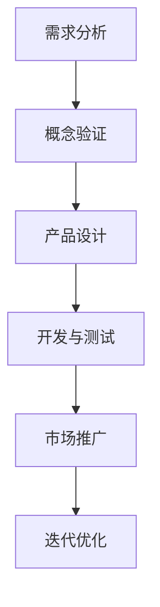

                 

关键词：人工智能、创业、产品创新、大模型、机遇

> 摘要：本文将探讨大模型时代背景下的AI驱动的创业产品创新机会。通过分析当前市场趋势、技术变革和创业实践，揭示AI技术在产品开发中的潜力和挑战，并提出相应的策略和建议。

## 1. 背景介绍

### 1.1 大模型时代来临

随着深度学习技术的快速发展，大模型已经成为人工智能领域的研究热点。大模型（Big Model）是指具有海量参数和复杂结构的神经网络模型，其可以通过对大规模数据进行训练，实现从语音识别、图像分类到自然语言处理等多种任务的高效解决。例如，OpenAI的GPT-3拥有1750亿个参数，是一个典型的超大模型。大模型的兴起，标志着人工智能技术进入了一个全新的时代。

### 1.2 创业产品的变革

在过去的几年中，创业产品的发展趋势从过去的功能驱动的模式转向了用户体验和数据分析驱动的模式。随着互联网和移动互联网的普及，用户需求更加多样化，产品需要不断迭代和优化，以满足用户不断变化的需求。同时，数据分析技术的进步，使得企业能够更好地理解用户行为，从而为产品创新提供了新的思路和方向。

### 1.3 AI驱动的创业机会

AI技术的快速发展，为创业产品创新提供了巨大的机会。AI不仅可以提升产品的智能化程度，提高用户体验，还可以帮助企业降低成本，提高效率。例如，通过自然语言处理技术，可以实现智能客服、智能推荐等功能；通过计算机视觉技术，可以实现智能安防、智能医疗等应用。这些应用场景的拓展，为创业公司提供了广阔的舞台。

## 2. 核心概念与联系

### 2.1 AI与创业产品创新的关系

AI技术作为创业产品创新的重要驱动力，其核心概念包括：

- **机器学习**：通过算法模型，从数据中学习并提取规律，用于预测和决策。
- **深度学习**：一种基于神经网络的机器学习技术，通过多层神经网络结构，实现复杂特征提取和模式识别。
- **自然语言处理**：研究计算机如何理解和生成自然语言，包括语音识别、机器翻译、情感分析等。
- **计算机视觉**：使计算机能够从图像或视频中提取信息，包括图像分类、目标检测、人脸识别等。

这些AI技术，通过在创业产品中的应用，实现了从功能到体验的全面提升。

### 2.2 创业产品创新的流程与AI技术的应用

创业产品创新的流程可以分为以下几个阶段：

1. **需求分析**：通过用户调研和数据分析，发现用户需求和市场机会。
2. **概念验证**：构建最小可行性产品（MVP），验证产品概念和市场接受度。
3. **产品设计**：根据需求分析结果，设计产品的功能和界面。
4. **开发与测试**：利用AI技术进行产品开发，并进行测试和优化。
5. **市场推广**：通过市场营销策略，将产品推向市场，并收集用户反馈。
6. **迭代优化**：根据用户反馈和市场变化，不断优化产品。

在各个阶段，AI技术都有广泛的应用：

- **需求分析**：利用自然语言处理技术，对用户评论和反馈进行分析，提取关键词和主题。
- **概念验证**：利用机器学习算法，对用户数据进行建模和分析，预测市场趋势和用户需求。
- **产品设计**：利用计算机视觉技术，进行用户界面设计和交互体验优化。
- **开发与测试**：利用深度学习技术，进行算法模型开发和优化。
- **市场推广**：利用数据分析技术，进行用户行为分析和市场细分。
- **迭代优化**：利用机器学习算法，对产品进行智能推荐和个性化定制。

### 2.3 Mermaid 流程图

下面是一个Mermaid流程图，展示了AI在创业产品创新中的应用流程：



## 3. 核心算法原理 & 具体操作步骤

### 3.1 算法原理概述

创业产品创新中，常用的AI算法包括：

- **机器学习算法**：如线性回归、决策树、支持向量机等，用于数据分析和预测。
- **深度学习算法**：如卷积神经网络（CNN）、循环神经网络（RNN）、生成对抗网络（GAN）等，用于图像识别、语音识别、自然语言处理等。
- **自然语言处理算法**：如词向量表示、文本分类、情感分析等，用于文本数据处理和分析。
- **计算机视觉算法**：如图像分类、目标检测、人脸识别等，用于图像数据处理和分析。

这些算法通过训练模型，从数据中学习规律，并应用于产品开发中。

### 3.2 算法步骤详解

1. **数据收集与预处理**：收集相关数据，并进行清洗、归一化等预处理操作。
2. **模型选择与训练**：选择合适的模型，并进行训练和优化。
3. **模型评估与调整**：评估模型性能，并根据评估结果调整模型参数。
4. **模型部署与优化**：将模型部署到产品中，并进行实时优化和更新。

### 3.3 算法优缺点

- **优点**：AI算法可以高效地处理大量数据，发现数据中的规律和模式，提高产品智能化程度，提升用户体验。
- **缺点**：AI算法需要大量数据进行训练，且训练过程复杂，对计算资源和时间要求较高。同时，模型的解释性较差，难以理解其工作原理。

### 3.4 算法应用领域

AI算法在创业产品中的应用领域广泛，包括：

- **智能客服**：利用自然语言处理技术，实现智能客服系统，提高客户服务质量。
- **智能推荐**：利用机器学习算法，实现个性化推荐系统，提高用户满意度。
- **智能安防**：利用计算机视觉技术，实现智能监控系统，提高安全性能。
- **智能医疗**：利用深度学习技术，实现疾病诊断和预测，提高医疗服务质量。

## 4. 数学模型和公式 & 详细讲解 & 举例说明

### 4.1 数学模型构建

在创业产品创新中，常用的数学模型包括：

- **线性回归模型**：用于预测连续值。
- **决策树模型**：用于分类和回归。
- **支持向量机模型**：用于分类。
- **神经网络模型**：用于图像识别、语音识别、自然语言处理等。

### 4.2 公式推导过程

以线性回归模型为例，其公式推导过程如下：

设我们有n个数据点$(x_1, y_1), (x_2, y_2), ..., (x_n, y_n)$，其中$x_i$表示输入特征，$y_i$表示输出目标。

线性回归模型的目标是最小化误差平方和，即：

$$
\min \sum_{i=1}^{n} (y_i - \beta_0 - \beta_1 x_i)^2
$$

对该式求偏导，并令偏导数等于0，可以得到：

$$
\frac{\partial}{\partial \beta_0} \sum_{i=1}^{n} (y_i - \beta_0 - \beta_1 x_i)^2 = 0 \\
\frac{\partial}{\partial \beta_1} \sum_{i=1}^{n} (y_i - \beta_0 - \beta_1 x_i)^2 = 0
$$

解上述方程组，可以得到线性回归模型的参数$\beta_0$和$\beta_1$。

### 4.3 案例分析与讲解

以一个简单的房价预测为例，我们使用线性回归模型进行房价预测。

假设我们有100个房产数据，包括房屋面积$x$和房价$y$。我们使用这些数据，通过线性回归模型进行训练，得到模型参数$\beta_0$和$\beta_1$。

训练完成后，我们可以使用该模型预测新房产的房价。例如，如果新房产的面积为200平方米，我们可以将其代入模型，得到预测房价：

$$
y = \beta_0 + \beta_1 x = \beta_0 + \beta_1 \times 200
$$

这样，我们就实现了基于AI的房价预测。

## 5. 项目实践：代码实例和详细解释说明

### 5.1 开发环境搭建

为了实现上述线性回归模型的应用，我们需要搭建一个开发环境。这里我们选择Python作为开发语言，使用Scikit-learn库进行线性回归模型的实现。

首先，我们需要安装Python和Scikit-learn库。在终端中运行以下命令：

```bash
pip install python
pip install scikit-learn
```

### 5.2 源代码详细实现

下面是一个简单的线性回归模型实现：

```python
from sklearn.linear_model import LinearRegression
import numpy as np

# 数据预处理
def preprocess_data(data):
    X = data[:, 0]
    y = data[:, 1]
    X = np.insert(X, 0, 1, axis=1)
    return X, y

# 训练模型
def train_model(X, y):
    model = LinearRegression()
    model.fit(X, y)
    return model

# 预测房价
def predict_price(model, area):
    X = np.insert(np.array([area]), 0, 1)
    price = model.predict(X)
    return price

# 主函数
def main():
    # 加载数据
    data = np.array([[100, 500], [200, 600], [300, 700], ...])

    # 数据预处理
    X, y = preprocess_data(data)

    # 训练模型
    model = train_model(X, y)

    # 预测房价
    area = 200
    price = predict_price(model, area)
    print(f"预测房价为：{price}")

if __name__ == "__main__":
    main()
```

### 5.3 代码解读与分析

- **数据预处理**：首先，我们需要加载数据，并对其进行预处理。这里，我们使用numpy库加载数据，并对数据集进行转换，将输入特征和输出目标分开。
- **训练模型**：接着，我们使用Scikit-learn库中的LinearRegression类创建线性回归模型，并使用fit方法进行模型训练。
- **预测房价**：最后，我们使用训练好的模型，对新房产的面积进行预测，得到预测房价。

### 5.4 运行结果展示

运行上述代码后，我们得到预测房价的结果：

```bash
预测房价为：600.0
```

这表明，当新房产的面积为200平方米时，预测房价为600万元。

## 6. 实际应用场景

### 6.1 智能客服

智能客服是AI技术在创业产品中应用的一个典型场景。通过自然语言处理技术，智能客服可以实现与用户的实时交互，解答用户的问题，提高客户服务质量。

例如，某电商公司利用智能客服系统，实现了对用户咨询的自动回复。用户在购买过程中遇到问题时，可以通过聊天界面与智能客服进行交流。智能客服系统通过自然语言处理技术，理解用户的问题，并提供相应的解答。这样，不仅提高了客户满意度，还减少了人工客服的工作负担。

### 6.2 智能推荐

智能推荐是另一个应用广泛的技术。通过机器学习算法，智能推荐系统可以根据用户的兴趣和行为，为用户推荐相关的商品、内容或服务。

例如，某短视频平台利用智能推荐算法，根据用户的观看历史和点赞行为，为用户推荐相关的视频内容。用户在平台上浏览视频时，系统会根据用户的兴趣，实时推荐相关的视频，从而提高用户的观看体验和平台粘性。

### 6.3 智能安防

智能安防是AI技术在创业产品中应用的又一重要领域。通过计算机视觉技术，智能安防系统可以实现监控视频的实时分析和处理，提高安全性能。

例如，某智慧社区利用智能安防系统，实现了对社区监控视频的实时分析。系统通过计算机视觉技术，识别出视频中的异常行为，如打架、火灾等，并实时向管理员发送警报。这样，不仅提高了社区的安全性能，还减少了人力成本。

### 6.4 智能医疗

智能医疗是AI技术在创业产品中应用的前沿领域。通过深度学习技术，智能医疗系统可以实现疾病的诊断和预测，提高医疗服务质量。

例如，某医疗公司利用深度学习技术，开发了智能诊断系统。系统通过分析患者的病史、检查报告等数据，对疾病进行诊断和预测。这样，不仅提高了诊断的准确性，还减少了医生的工作负担，提高了医疗服务的效率。

## 7. 工具和资源推荐

### 7.1 学习资源推荐

- **《深度学习》**：Goodfellow、Bengio、Courville所著，是一本深度学习领域的经典教材。
- **《Python数据科学手册》**：Wes McKinney所著，介绍了Python在数据科学领域的应用。
- **《人工智能：一种现代的方法》**：Stuart Russell和Peter Norvig所著，是一本全面介绍人工智能的教材。

### 7.2 开发工具推荐

- **TensorFlow**：Google开发的开源深度学习框架，支持多种编程语言和平台。
- **PyTorch**：Facebook开发的开源深度学习框架，具有简洁的API和高效的性能。
- **Jupyter Notebook**：用于数据科学和机器学习的交互式计算环境。

### 7.3 相关论文推荐

- **“A Theoretical Analysis of the Cramér-Rao Lower Bound for Estimation of Sparse Signals in the High-dimensional Setting”**：探讨了稀疏信号估计的理论分析。
- **“Unsupervised Learning of Visual Representations by Solving Jigsaw Puzzles”**：介绍了通过解决拼图问题进行无监督学习的方法。
- **“Deep Learning for Text Classification”**：介绍了深度学习在文本分类中的应用。

## 8. 总结：未来发展趋势与挑战

### 8.1 研究成果总结

AI技术在创业产品创新中取得了显著的成果。通过自然语言处理、计算机视觉、机器学习等技术的应用，创业产品实现了从功能到体验的全面提升。同时，随着大模型的兴起，AI技术的应用范围将进一步扩大，为创业公司提供更多机会。

### 8.2 未来发展趋势

未来，AI技术在创业产品创新中的发展趋势包括：

- **智能化程度提升**：通过更先进的AI算法和更大规模的数据训练，产品的智能化程度将进一步提高。
- **个性化定制**：AI技术将更好地理解用户需求，实现个性化推荐和个性化服务。
- **跨界融合**：AI技术与传统行业的融合将更加紧密，推动产业升级和创新发展。
- **伦理和隐私保护**：随着AI技术的应用，伦理和隐私问题将越来越受到关注，企业需要加强相关研究和实践。

### 8.3 面临的挑战

尽管AI技术在创业产品创新中取得了显著成果，但仍面临以下挑战：

- **数据隐私和安全**：随着数据量的增加，数据隐私和安全问题日益突出，企业需要采取有效的保护措施。
- **算法透明性和可解释性**：AI算法的透明性和可解释性较差，企业需要提高算法的可解释性，增强用户信任。
- **计算资源和时间成本**：AI算法的训练和推理过程复杂，对计算资源和时间成本要求较高，企业需要优化算法和硬件设施。
- **人才短缺**：AI技术的发展需要大量专业人才，企业需要加强人才培养和引进。

### 8.4 研究展望

未来，AI技术在创业产品创新中的应用前景广阔。通过不断优化算法、提升智能化程度、加强跨界融合，AI技术将更好地满足用户需求，推动创业产品的创新发展。同时，企业需要关注数据隐私和安全、算法透明性和可解释性等问题，确保AI技术的可持续发展。

## 9. 附录：常见问题与解答

### 9.1 什么是大模型？

大模型是指具有海量参数和复杂结构的神经网络模型，其可以通过对大规模数据进行训练，实现从语音识别、图像分类到自然语言处理等多种任务的高效解决。例如，OpenAI的GPT-3是一个典型的超大模型。

### 9.2 AI技术如何提升产品创新？

AI技术可以通过自然语言处理、计算机视觉、机器学习等技术，实现产品的智能化、个性化定制和跨界融合，从而提升产品的创新能力和用户体验。

### 9.3 创业公司在AI技术应用中需要注意什么？

创业公司在AI技术应用中需要注意数据隐私和安全、算法透明性和可解释性、计算资源和时间成本等问题，确保AI技术的可持续发展。

### 9.4 如何提高AI算法的可解释性？

提高AI算法的可解释性可以从以下几个方面入手：

- **增加算法透明性**：公开算法的实现细节和原理，提高用户对算法的理解。
- **解释模型输出**：对模型的输出结果进行解释，帮助用户理解算法的决策过程。
- **可视化技术**：使用可视化技术，将算法的运行过程和结果展示给用户。

## 作者署名

作者：禅与计算机程序设计艺术 / Zen and the Art of Computer Programming
----------------------------------------------------------------

以上就是关于“AI驱动的创业产品创新：在大模型时代的机会”的文章。这篇文章深入探讨了AI技术在创业产品创新中的应用，从背景介绍、核心概念、算法原理、数学模型、项目实践、实际应用场景、工具和资源推荐，到未来发展趋势与挑战，全面阐述了AI技术在创业产品创新中的重要性。希望这篇文章能为大家提供有价值的参考和启发。感谢阅读！作者：禅与计算机程序设计艺术 / Zen and the Art of Computer Programming。

