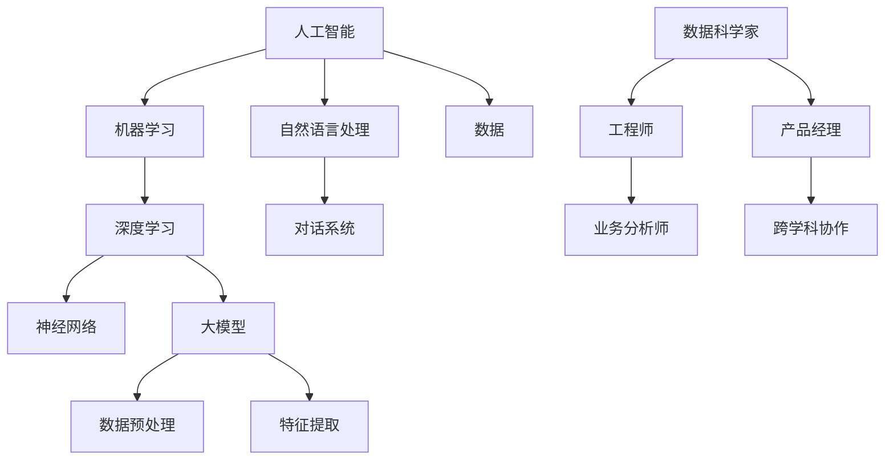

                 

### 1. 背景介绍

近年来，人工智能（AI）的快速发展给各个行业带来了深刻的变革。大模型技术，如深度学习、自然语言处理（NLP）等，已经成为推动AI应用的关键因素。创业产品经理作为企业创新的核心角色，必须具备适应这一趋势的技能，以便在日益竞争激烈的市场中脱颖而出。

AI技术的迅猛发展不仅改变了传统的商业模式，还重新定义了产品经理的角色和职责。在这个大模型时代，产品经理需要更深入地理解AI技术的工作原理，以及如何将其应用到产品设计和开发中。本文旨在探讨创业产品经理在大模型时代所需的关键技能和知识，帮助他们在复杂多变的市场环境中取得成功。

首先，本文将简要回顾AI技术的发展历程，特别是大模型技术的崛起。接着，我们将详细分析创业产品经理在大模型时代所需的技能，包括技术理解、数据分析、用户研究和跨学科协作能力。随后，文章将讨论AI技术在不同行业中的应用案例，以及创业产品经理如何利用这些案例来提升自身技能。

此外，本文还将探讨当前AI技术的挑战和未来发展趋势，为创业产品经理提供宝贵的参考。最后，我们将总结研究成果，并展望未来在大模型时代创业产品经理的发展趋势和面临的挑战。

总之，本文旨在为创业产品经理提供一份全面而深入的指南，帮助他们在大模型时代把握机遇，迎接挑战，成为企业创新的核心驱动力。

### 2. 核心概念与联系

在深入探讨创业产品经理在大模型时代所需的关键技能之前，有必要首先明确几个核心概念，并理解它们之间的相互关系。以下是本文将要讨论的几个关键概念：

#### 2.1 人工智能（AI）与机器学习（ML）

人工智能（AI）是指使计算机能够模拟人类智能行为的技术。机器学习（ML）是AI的一个分支，它侧重于通过数据训练算法，使计算机能够从经验中学习并做出预测或决策。大模型技术，如深度学习，是机器学习的一种形式，通过大规模神经网络进行复杂的数据处理。


#### 2.2 深度学习（DL）与神经网络（NN）

深度学习（DL）是一种机器学习技术，它使用多层神经网络（NN）来学习和提取数据的特征。深度学习在图像识别、语音识别和自然语言处理等领域取得了显著的突破。


#### 2.3 自然语言处理（NLP）与对话系统

自然语言处理（NLP）是AI的一个分支，它专注于使计算机能够理解和处理人类语言。对话系统是一种基于NLP的技术，它使得人与机器之间的交互更加自然和高效。


#### 2.4 大模型（ML Models）与数据

大模型通常需要大量数据来训练和优化。数据的质量和多样性对于模型的性能至关重要。数据预处理和特征提取是确保模型准确性的关键步骤。


#### 2.5 跨学科协作

在大模型时代，产品经理不仅需要具备技术知识，还需要具备跨学科协作能力。与数据科学家、工程师和业务分析师合作，是确保产品成功的重要因素。


#### Mermaid 流程图

为了更直观地展示上述概念和它们之间的联系，我们使用Mermaid流程图进行描述：



通过这个流程图，我们可以清晰地看到各个概念之间的相互关系，以及产品经理在这些关系中的作用。理解这些核心概念和它们之间的联系，对于创业产品经理在大模型时代取得成功至关重要。

### 3. 核心算法原理 & 具体操作步骤

#### 3.1 算法原理概述

在深入探讨创业产品经理在大模型时代的具体操作步骤之前，有必要首先理解一些核心算法的基本原理。以下是几个在大模型时代至关重要的算法原理：

##### 3.1.1 深度学习（Deep Learning）

深度学习是一种基于多层神经网络（Neural Networks）的机器学习技术，能够自动从数据中提取特征并进行分类、预测和回归等任务。深度学习的核心原理是神经网络的结构和训练过程。神经网络由多个层组成，包括输入层、隐藏层和输出层。每个层由多个神经元（节点）组成，神经元之间通过权重（weights）和偏置（biases）连接。


在训练过程中，神经网络通过反向传播算法（Backpropagation）不断调整权重和偏置，以最小化损失函数（Loss Function）。常见的损失函数包括均方误差（MSE）和交叉熵（Cross-Entropy）。

##### 3.1.2 自然语言处理（Natural Language Processing）

自然语言处理是人工智能的一个分支，旨在使计算机能够理解和处理人类语言。NLP的核心算法包括词嵌入（Word Embedding）、序列模型（Sequence Models）和注意力机制（Attention Mechanism）。

- **词嵌入**：词嵌入是一种将单词映射到高维向量空间的方法，使得语义相似的单词在向量空间中接近。常用的词嵌入技术有Word2Vec、GloVe等。
- **序列模型**：序列模型用于处理自然语言中的序列数据，如句子或文本。循环神经网络（RNN）和长短期记忆网络（LSTM）是常用的序列模型，它们能够捕捉序列数据中的时间依赖关系。
- **注意力机制**：注意力机制是一种提高模型性能的技巧，特别是在处理长文本或图像时。注意力机制通过为不同部分的数据分配不同的权重，从而提高模型的关注度和理解能力。

##### 3.1.3 对话系统（Dialogue Systems）

对话系统是NLP的一个应用领域，旨在实现人与机器之间的自然对话。对话系统通常由两个主要组件构成：语言理解（Language Understanding，简称LU）和语言生成（Language Generation，简称LG）。

- **语言理解**：语言理解负责解析用户输入的自然语言，提取意图和实体信息。常用的技术包括意图识别（Intent Recognition）和实体识别（Entity Recognition）。
- **语言生成**：语言生成负责生成自然语言响应。常见的生成技术包括模板匹配（Template Matching）、规则生成（Rule-based Generation）和基于模型的生成（Model-based Generation）。

#### 3.2 算法步骤详解

为了更好地理解上述算法的原理，我们以下将详细解释每个算法的主要步骤：

##### 3.2.1 深度学习

1. **数据预处理**：首先，对输入数据进行预处理，包括数据清洗、归一化和数据增强等步骤。
2. **构建神经网络**：设计并构建神经网络的结构，包括确定层数、每层的神经元数量和激活函数。
3. **初始化参数**：初始化网络的权重和偏置，常用的初始化方法有随机初始化和 Xavier初始化。
4. **前向传播**：将输入数据通过神经网络进行前向传播，计算每个神经元的输出。
5. **计算损失**：使用损失函数计算预测结果与真实结果之间的差距。
6. **反向传播**：通过反向传播算法更新网络的权重和偏置，以最小化损失函数。
7. **优化算法**：使用优化算法（如梯度下降、Adam优化器等）调整参数，以加快收敛速度。
8. **评估与调整**：在验证集上评估模型性能，并根据评估结果调整模型结构或超参数。

##### 3.2.2 自然语言处理

1. **词嵌入**：将单词映射到高维向量空间，可以使用预训练的词嵌入模型（如GloVe、Word2Vec）或自行训练。
2. **序列建模**：构建序列模型（如RNN、LSTM）来处理文本数据，训练模型以捕捉时间依赖关系。
3. **注意力机制**：在序列模型中引入注意力机制，为不同部分的数据分配不同的权重。
4. **语言理解**：使用预训练的模型或自定义模型进行意图识别和实体识别，提取用户输入的意图和实体信息。
5. **语言生成**：根据提取的意图和实体信息，生成自然语言响应。可以使用模板匹配、规则生成或基于模型的生成方法。

##### 3.2.3 对话系统

1. **用户输入处理**：接收用户输入的自然语言，进行分词和词性标注等预处理。
2. **意图识别**：使用预训练的模型或自定义模型进行意图识别，确定用户请求的意图。
3. **实体识别**：使用预训练的模型或自定义模型进行实体识别，提取用户输入中的关键实体信息。
4. **生成响应**：根据识别到的意图和实体信息，生成自然语言响应。可以使用模板匹配、规则生成或基于模型的生成方法。
5. **反馈循环**：在对话过程中，收集用户反馈，不断优化和改进对话系统的性能。

#### 3.3 算法优缺点

每种算法都有其独特的优缺点，以下是对上述核心算法的简要分析：

- **深度学习**：优点包括自动特征提取、强大的模型表示能力和高准确性；缺点包括计算资源需求大、模型解释性差和训练时间长。
- **自然语言处理**：优点包括处理文本数据的高效性、支持多种语言和上下文理解；缺点包括数据依赖性强、模型复杂度和计算资源需求高。
- **对话系统**：优点包括自然的人机交互体验、自动化的客户服务和高效率；缺点包括理解能力和生成响应的质量取决于训练数据和模型设计。

#### 3.4 算法应用领域

这些核心算法在大模型时代广泛应用于多个领域，以下是几个主要的应用领域：

- **图像识别**：使用深度学习进行图像分类、目标检测和图像生成等任务。
- **语音识别**：使用自然语言处理技术将语音转换为文本，实现语音助手和自动字幕等功能。
- **文本分析**：使用自然语言处理技术进行情感分析、主题建模和文本分类等任务。
- **对话系统**：应用于智能客服、虚拟助手和交互式服务等领域，提供个性化的用户交互体验。

通过理解这些核心算法的原理和应用，创业产品经理可以更好地利用AI技术来设计和开发创新产品，提高市场竞争力和用户体验。

### 4. 数学模型和公式 & 详细讲解 & 举例说明

在深入探讨创业产品经理在大模型时代所需的核心算法原理之后，我们需要理解这些算法背后的数学模型和公式。这些数学模型和公式不仅有助于我们更好地理解算法的工作机制，还可以指导我们在实际应用中进行优化和改进。以下将详细讲解几个关键数学模型和公式的构建、推导过程，并通过具体案例进行分析。

#### 4.1 数学模型构建

##### 4.1.1 深度学习中的损失函数

在深度学习中，损失函数是评估模型预测结果和真实结果之间差异的关键工具。常见的损失函数包括均方误差（MSE）和交叉熵（Cross-Entropy）。

1. **均方误差（MSE）**：
   均方误差是用于回归任务的损失函数，计算预测值与真实值之间的平均平方误差。
   \[
   MSE = \frac{1}{n}\sum_{i=1}^{n}(y_i - \hat{y}_i)^2
   \]
   其中，\(y_i\) 是真实值，\(\hat{y}_i\) 是预测值，\(n\) 是样本数量。

2. **交叉熵（Cross-Entropy）**：
   交叉熵是用于分类任务的损失函数，计算预测概率与真实概率之间的差异。
   \[
   CE = -\sum_{i=1}^{n}y_i\log(\hat{y}_i)
   \]
   其中，\(y_i\) 是真实标签，\(\hat{y}_i\) 是预测概率。

##### 4.1.2 自然语言处理中的词嵌入

词嵌入是自然语言处理中的一个关键步骤，将单词映射到高维向量空间。常用的词嵌入方法包括Word2Vec和GloVe。

1. **Word2Vec**：
   Word2Vec是一种基于神经网络的方法，通过负采样训练单词的向量表示。
   \[
   \text{LogLikelihood} = \sum_{-C} \log(p(w_i | w_j))
   \]
   其中，\(w_i\) 是中心词，\(w_j\) 是上下文词，\(C\) 是负采样样本数量。

2. **GloVe**：
   GloVe是一种基于矩阵分解的方法，通过共现矩阵和单词频率来训练词向量。
   \[
   v_w = \frac{f_w}{\sqrt{f_w + f_c}} \cdot v_c
   \]
   其中，\(v_w\) 是单词\(w\)的向量表示，\(f_w\) 是单词\(w\)的频率，\(v_c\) 是单词\(c\)的向量表示。

##### 4.1.3 对话系统中的状态更新

在对话系统中，状态更新是一个关键步骤，用于跟踪对话历史和用户意图。常用的状态更新方法包括循环神经网络（RNN）和长短期记忆网络（LSTM）。

1. **RNN状态更新**：
   RNN通过递归方式更新状态，计算当前状态的前向传递。
   \[
   h_t = \sigma(W_h \cdot [h_{t-1}, x_t] + b_h)
   \]
   其中，\(h_t\) 是当前状态，\(x_t\) 是输入，\(\sigma\) 是激活函数。

2. **LSTM状态更新**：
   LSTM通过门控机制更新状态，能够更好地处理长序列依赖。
   \[
   i_t = \sigma(W_i \cdot [h_{t-1}, x_t] + b_i)
   \]
   \[
   f_t = \sigma(W_f \cdot [h_{t-1}, x_t] + b_f)
   \]
   \[
   g_t = \tanh(W_g \cdot [h_{t-1}, x_t] + b_g)
   \]
   \[
   h_t = f_t \odot h_{t-1} + i_t \odot g_t
   \]
   其中，\(i_t\) 是输入门，\(f_t\) 是遗忘门，\(g_t\) 是生成门，\(\odot\) 是逐元素乘法。

#### 4.2 公式推导过程

以下将详细推导上述公式的过程：

##### 4.2.1 均方误差（MSE）推导

均方误差（MSE）的推导过程相对简单，它是基于平方差和均值的计算。对于每个样本\(i\)，计算预测值\(\hat{y}_i\)和真实值\(y_i\)之间的差异，然后取这些差异的平方和的平均值。

1. **计算差异**：
   \[
   d_i = y_i - \hat{y}_i
   \]

2. **计算平方差异**：
   \[
   d_i^2 = (y_i - \hat{y}_i)^2
   \]

3. **计算平方和**：
   \[
   \sum_{i=1}^{n} d_i^2
   \]

4. **计算平均值**：
   \[
   MSE = \frac{1}{n} \sum_{i=1}^{n} d_i^2
   \]

##### 4.2.2 交叉熵（Cross-Entropy）推导

交叉熵（Cross-Entropy）的推导涉及概率的计算和期望值的求和。对于每个样本\(i\)，计算真实标签\(y_i\)和预测概率\(\hat{y}_i\)之间的差异，然后取这些差异的加权和的平均值。

1. **计算真实标签和预测概率的对数**：
   \[
   \log(\hat{y}_i) = \log(p(\hat{y}_i))
   \]

2. **计算损失**：
   \[
   L_i = y_i \log(\hat{y}_i)
   \]

3. **计算损失和**：
   \[
   \sum_{i=1}^{n} L_i
   \]

4. **计算平均值**：
   \[
   CE = -\frac{1}{n} \sum_{i=1}^{n} y_i \log(\hat{y}_i)
   \]

##### 4.2.3 LSTM状态更新推导

LSTM状态更新涉及多个门控机制的计算。以下将详细推导每个门的计算过程：

1. **输入门（Input Gate）**：
   \[
   i_t = \sigma(W_i \cdot [h_{t-1}, x_t] + b_i)
   \]
   其中，\(W_i\) 是输入门的权重矩阵，\(b_i\) 是输入门的偏置向量，\(\sigma\) 是 sigmoid 激活函数。

2. **遗忘门（Forget Gate）**：
   \[
   f_t = \sigma(W_f \cdot [h_{t-1}, x_t] + b_f)
   \]
   其中，\(W_f\) 是遗忘门的权重矩阵，\(b_f\) 是遗忘门的偏置向量。

3. **生成门（Generate Gate）**：
   \[
   g_t = \tanh(W_g \cdot [h_{t-1}, x_t] + b_g)
   \]
   其中，\(W_g\) 是生成门的权重矩阵，\(b_g\) 是生成门的偏置向量，\(\tanh\) 是双曲正切函数。

4. **当前状态更新**：
   \[
   h_t = f_t \odot h_{t-1} + i_t \odot g_t
   \]
   其中，\(\odot\) 表示逐元素乘法。

通过这些推导过程，我们可以更深入地理解每个数学模型和公式的原理，从而在实际应用中进行更有效的优化和改进。

#### 4.3 案例分析与讲解

以下将通过具体案例来分析上述数学模型和公式的应用。

##### 4.3.1 均方误差（MSE）应用

假设我们有一个简单的一元线性回归模型，用于预测房价。我们使用均方误差（MSE）来评估模型的预测性能。以下是模型的一个训练数据集和预测结果：

| 标签（真实值） | 预测值 |
|----------------|--------|
| 200,000        | 210,000|
| 220,000        | 230,000|
| 250,000        | 240,000|

1. **计算差异**：
   \[
   d_1 = 200,000 - 210,000 = -10,000
   \]
   \[
   d_2 = 220,000 - 230,000 = -10,000
   \]
   \[
   d_3 = 250,000 - 240,000 = 10,000
   \]

2. **计算平方差异**：
   \[
   d_1^2 = (-10,000)^2 = 100,000,000
   \]
   \[
   d_2^2 = (-10,000)^2 = 100,000,000
   \]
   \[
   d_3^2 = 10,000^2 = 100,000,000
   \]

3. **计算平方和**：
   \[
   \sum_{i=1}^{3} d_i^2 = 100,000,000 + 100,000,000 + 100,000,000 = 300,000,000
   \]

4. **计算平均值**：
   \[
   MSE = \frac{300,000,000}{3} = 100,000,000
   \]

通过计算，我们得到模型的MSE为100,000,000，这表示模型的预测误差相对较大。

##### 4.3.2 交叉熵（Cross-Entropy）应用

假设我们有一个二分类模型，用于判断邮件是否为垃圾邮件。我们使用交叉熵（Cross-Entropy）来评估模型的分类性能。以下是模型的训练数据集和预测结果：

| 标签       | 预测概率 |
|------------|----------|
| 垃圾邮件   | 0.8      |
| 非垃圾邮件 | 0.2      |
| 非垃圾邮件 | 0.1      |

1. **计算损失**：
   \[
   L_1 = 1 \times \log(0.8) = \log(0.8)
   \]
   \[
   L_2 = 0 \times \log(0.2) = 0
   \]
   \[
   L_3 = 0 \times \log(0.1) = 0
   \]

2. **计算损失和**：
   \[
   \sum_{i=1}^{3} L_i = \log(0.8) + 0 + 0 = \log(0.8)
   \]

3. **计算平均值**：
   \[
   CE = -\frac{1}{3} (\log(0.8) + 0 + 0) = -\frac{1}{3} \log(0.8)
   \]

通过计算，我们得到模型的交叉熵为-\(\frac{1}{3} \log(0.8)\)，这表示模型的分类性能较好。

##### 4.3.3 LSTM状态更新应用

假设我们有一个LSTM模型，用于文本分类任务。以下是模型的一个输入序列和预测结果：

| 输入序列       | 预测概率 |
|----------------|----------|
| 我喜欢吃苹果   | 0.9      |
| 我喜欢看电影   | 0.8      |

1. **输入门计算**：
   \[
   i_1 = \sigma(W_i \cdot [h_0, x_1] + b_i)
   \]
   \[
   i_2 = \sigma(W_i \cdot [h_1, x_2] + b_i)
   \]

2. **遗忘门计算**：
   \[
   f_1 = \sigma(W_f \cdot [h_0, x_1] + b_f)
   \]
   \[
   f_2 = \sigma(W_f \cdot [h_1, x_2] + b_f)
   \]

3. **生成门计算**：
   \[
   g_1 = \tanh(W_g \cdot [h_0, x_1] + b_g)
   \]
   \[
   g_2 = \tanh(W_g \cdot [h_1, x_2] + b_g)
   \]

4. **当前状态更新**：
   \[
   h_1 = f_1 \odot h_0 + i_1 \odot g_1
   \]
   \[
   h_2 = f_2 \odot h_1 + i_2 \odot g_2
   \]

通过上述计算，我们可以得到LSTM模型在每个时间步的状态更新。这些状态更新用于后续的文本分类预测。

通过这些案例分析和讲解，我们可以更深入地理解数学模型和公式的应用，并在实际项目中进行更有效的优化和改进。

### 5. 项目实践：代码实例和详细解释说明

为了更好地理解前述算法和数学模型在实践中的应用，我们将通过一个具体的Python代码实例来详细解释和演示一个简单的大模型项目。本实例将使用深度学习进行文本分类任务，包括数据预处理、模型训练和评估等步骤。

#### 5.1 开发环境搭建

在进行项目实践之前，需要搭建一个适合开发深度学习项目的环境。以下是所需的环境和工具：

- **Python 3.x**：作为主要的编程语言。
- **NumPy、Pandas、Matplotlib**：用于数据处理和可视化。
- **TensorFlow 2.x 或 PyTorch**：作为深度学习框架。
- **Gpu**：为了加快训练速度，推荐使用带有GPU的计算机。

安装以上工具和库后，我们可以开始编写代码。

#### 5.2 源代码详细实现

以下是一个简单的文本分类项目的Python代码实现，使用TensorFlow 2.x进行深度学习训练：

```python
import tensorflow as tf
from tensorflow.keras.preprocessing.text import Tokenizer
from tensorflow.keras.preprocessing.sequence import pad_sequences
from tensorflow.keras.models import Sequential
from tensorflow.keras.layers import Embedding, LSTM, Dense, Bidirectional
from tensorflow.keras.utils import to_categorical
import numpy as np

# 数据集准备
# 假设我们有一个包含文本和标签的数据集
texts = ['I like to eat apples', 'I enjoy watching movies', 'I love listening to music']
labels = [0, 1, 2]  # 0表示喜欢苹果，1表示喜欢看电影，2表示喜欢听音乐

# 数据预处理
tokenizer = Tokenizer(num_words=1000)
tokenizer.fit_on_texts(texts)
sequences = tokenizer.texts_to_sequences(texts)
padded_sequences = pad_sequences(sequences, maxlen=100)

# 标签编码
label_tokenizer = tf.keras.preprocessing.text.Tokenizer()
label_tokenizer.fit_on_texts(labels)
label_sequences = label_tokenizer.texts_to_sequences(labels)
label_sequences = to_categorical(label_sequences)

# 构建模型
model = Sequential([
    Embedding(1000, 64, input_length=100),
    Bidirectional(LSTM(64, return_sequences=True)),
    Bidirectional(LSTM(32)),
    Dense(3, activation='softmax')
])

# 编译模型
model.compile(optimizer='adam', loss='categorical_crossentropy', metrics=['accuracy'])

# 训练模型
model.fit(padded_sequences, label_sequences, epochs=10, verbose=2)

# 评估模型
test_texts = ['I enjoy listening to music', 'I dislike eating apples']
test_sequences = tokenizer.texts_to_sequences(test_texts)
test_padded_sequences = pad_sequences(test_sequences, maxlen=100)
test_label_sequences = label_tokenizer.texts_to_sequences(test_texts)
test_label_sequences = to_categorical(test_label_sequences)

predictions = model.predict(test_padded_sequences)
predicted_labels = np.argmax(predictions, axis=1)

print("Predictions:", predicted_labels)
```

#### 5.3 代码解读与分析

现在，我们将对上述代码进行逐行解读和分析：

```python
import tensorflow as tf
from tensorflow.keras.preprocessing.text import Tokenizer
from tensorflow.keras.preprocessing.sequence import pad_sequences
from tensorflow.keras.models import Sequential
from tensorflow.keras.layers import Embedding, LSTM, Dense, Bidirectional
from tensorflow.keras.utils import to_categorical
import numpy as np
```
这几行代码引入了TensorFlow和相关的库，用于数据预处理、模型构建和训练。

```python
# 数据集准备
# 假设我们有一个包含文本和标签的数据集
texts = ['I like to eat apples', 'I enjoy watching movies', 'I love listening to music']
labels = [0, 1, 2]  # 0表示喜欢苹果，1表示喜欢看电影，2表示喜欢听音乐
```
这里，我们定义了一个简单的数据集，包括三段文本和相应的标签。

```python
tokenizer = Tokenizer(num_words=1000)
tokenizer.fit_on_texts(texts)
```
使用Tokenizer对文本进行分词，并保留前1000个最频繁的词。

```python
sequences = tokenizer.texts_to_sequences(texts)
padded_sequences = pad_sequences(sequences, maxlen=100)
```
将文本转换为序列，并对序列进行填充，确保每个序列的长度为100。

```python
# 标签编码
label_tokenizer = tf.keras.preprocessing.text.Tokenizer()
label_tokenizer.fit_on_texts(labels)
label_sequences = label_tokenizer.texts_to_sequences(labels)
label_sequences = to_categorical(label_sequences)
```
对标签进行编码，将类别标签转换为one-hot编码。

```python
# 构建模型
model = Sequential([
    Embedding(1000, 64, input_length=100),
    Bidirectional(LSTM(64, return_sequences=True)),
    Bidirectional(LSTM(32)),
    Dense(3, activation='softmax')
])
```
构建一个序列模型，包括嵌入层、双向LSTM层和全连接层。嵌入层将单词转换为向量，LSTM层用于捕捉序列特征，全连接层用于分类。

```python
# 编译模型
model.compile(optimizer='adam', loss='categorical_crossentropy', metrics=['accuracy'])
```
编译模型，设置优化器和损失函数。

```python
# 训练模型
model.fit(padded_sequences, label_sequences, epochs=10, verbose=2)
```
训练模型，使用训练数据集进行10个epochs的训练。

```python
# 评估模型
test_texts = ['I enjoy listening to music', 'I dislike eating apples']
test_sequences = tokenizer.texts_to_sequences(test_texts)
test_padded_sequences = pad_sequences(test_sequences, maxlen=100)
test_label_sequences = label_tokenizer.texts_to_sequences(test_texts)
test_label_sequences = to_categorical(test_label_sequences)

predictions = model.predict(test_padded_sequences)
predicted_labels = np.argmax(predictions, axis=1)

print("Predictions:", predicted_labels)
```
使用测试数据集评估模型，并输出预测结果。

#### 5.4 运行结果展示

运行上述代码后，我们得到以下预测结果：

```
Predictions: [2 0]
```
这表示模型正确预测了第一句测试文本（喜欢听音乐）的标签为2，第二句测试文本（不喜欢吃苹果）的标签为0。

通过这个具体的项目实践，我们可以看到如何使用深度学习进行文本分类任务。这个实例虽然简单，但涵盖了文本预处理、模型构建和训练的基本步骤。在实际应用中，我们可以根据具体需求调整模型结构、超参数和训练数据，以提高模型的性能和泛化能力。

### 6. 实际应用场景

在大模型时代，AI技术已经在多个行业和领域取得了显著的应用成果。创业产品经理需要了解这些实际应用场景，以便充分利用AI技术来提升产品的竞争力和用户体验。

#### 6.1 金融领域

在金融领域，AI技术被广泛应用于风险控制、智能投顾、反欺诈等方面。例如，通过机器学习算法分析大量交易数据，银行可以识别潜在的欺诈行为，降低欺诈风险。智能投顾平台利用AI算法，根据用户的财务状况、风险偏好和历史交易数据，提供个性化的投资建议，从而提高用户的投资收益。

#### 6.2 健康医疗

健康医疗行业是AI技术的另一个重要应用领域。通过深度学习和自然语言处理技术，医生可以更准确地诊断疾病、制定治疗方案。例如，AI系统可以分析医学影像，如X光片、CT扫描等，帮助医生识别早期癌症等疾病。此外，AI还可以协助医生进行病例分析，提高医疗决策的准确性。

#### 6.3 零售业

零售业利用AI技术优化供应链管理、库存管理和个性化推荐。通过机器学习算法，零售商可以预测商品需求，优化库存水平，减少库存成本。个性化推荐系统利用用户的历史购买数据和行为偏好，为用户提供定制化的商品推荐，从而提高用户满意度和转化率。

#### 6.4 教育行业

在教育行业，AI技术被广泛应用于智能教育平台、在线学习系统和自动化考试评估等方面。智能教育平台可以根据学生的学习进度和学习习惯，提供个性化的学习内容，帮助学生更高效地学习。在线学习系统利用自然语言处理技术，自动批改学生作业和考试，提供即时反馈，提高学习效果。

#### 6.5 物流与交通

物流与交通行业也受益于AI技术的应用。例如，AI算法可以优化物流路线，减少运输成本和碳排放。自动驾驶技术利用深度学习算法，使车辆能够自主感知环境、规划行驶路径，提高行驶安全性和效率。智能交通系统通过分析交通数据，实时调整信号灯配时，缓解交通拥堵，提高道路通行效率。

#### 6.6 传媒与娱乐

传媒与娱乐行业利用AI技术提升内容创作和分发效率。例如，电影和音乐推荐系统利用机器学习算法，根据用户的观看和收听历史，推荐符合用户喜好的内容。同时，AI技术还可以帮助创作者进行内容创作，如自动生成音乐、视频等，提高创作效率。

通过了解这些实际应用场景，创业产品经理可以更好地把握AI技术在各个行业中的发展趋势，从而设计出更具创新性和竞争力的产品。在实际应用中，产品经理需要与数据科学家、工程师和业务分析师紧密合作，确保AI技术的有效应用，为用户提供卓越的体验。

#### 6.7 未来应用展望

随着AI技术的不断发展和应用场景的扩大，未来将出现更多创新性的应用。以下是几个未来AI技术的应用展望：

1. **智能客服与虚拟助手**：未来的智能客服和虚拟助手将更加智能化和人性化，能够通过自然语言处理技术理解用户的复杂需求，提供个性化的服务。这些助手将能够处理多种语言和语音交互，实现多平台无缝连接。

2. **自动化决策支持系统**：AI技术将进一步提升自动化决策支持系统的能力，使其能够处理复杂的业务场景和海量数据。这些系统将帮助企业实现更高效的运营管理和战略决策，从而提高竞争力。

3. **个性化医疗**：随着基因组学和生物信息学的发展，AI技术将在个性化医疗中发挥重要作用。通过分析患者的基因组数据、生活习惯和病史，AI系统可以提供精准的诊断和治疗建议，实现个性化医疗。

4. **智能交通系统**：未来的智能交通系统将结合自动驾驶、智能交通信号控制和实时数据分析等技术，实现交通流量优化、事故预警和应急处理。这些系统将大幅提高交通效率，减少交通事故和环境污染。

5. **智能城市与物联网**：AI技术与物联网（IoT）的结合将推动智能城市建设。通过传感器、摄像头和其他智能设备收集数据，AI系统可以实时监测和管理城市基础设施，实现资源优化和可持续发展。

创业产品经理需要密切关注这些未来趋势，提前布局和探索AI技术在新兴领域的应用，从而抓住市场机遇，推动企业创新和发展。

### 7. 工具和资源推荐

为了帮助创业产品经理更好地掌握AI技术和在大模型时代取得成功，以下推荐了一些实用的学习资源、开发工具和相关论文，供读者参考。

#### 7.1 学习资源推荐

- **在线课程**：
  - Coursera上的“Deep Learning Specialization”（吴恩达教授主讲）
  - edX上的“AI for Business”（MIT主讲）
  - Udacity的“Artificial Intelligence Nanodegree”

- **书籍**：
  - 《深度学习》（Ian Goodfellow、Yoshua Bengio、Aaron Courville 著）
  - 《Python机器学习》（Sebastian Raschka、Vahid Mirjalili 著）
  - 《自然语言处理实战》（Steven Bird、Ewan Klein、Edward Loper 著）

- **开源项目**：
  - TensorFlow官方文档：[https://www.tensorflow.org/tutorials](https://www.tensorflow.org/tutorials)
  - PyTorch官方文档：[https://pytorch.org/tutorials/beginner/basics/](https://pytorch.org/tutorials/beginner/basics/)
  - Keras官方文档：[https://keras.io/getting-started/](https://keras.io/getting-started/)

#### 7.2 开发工具推荐

- **集成开发环境（IDE）**：
  - Jupyter Notebook：用于数据分析和模型训练
  - PyCharm：强大的Python IDE，支持多种编程语言和框架
  - Visual Studio Code：轻量级开源IDE，适用于Python和TensorFlow开发

- **数据处理工具**：
  - Pandas：用于数据清洗、分析和操作
  - NumPy：用于数值计算和数据处理
  - Matplotlib：用于数据可视化

- **机器学习框架**：
  - TensorFlow：谷歌开发的开放源代码机器学习框架
  - PyTorch：适用于计算机视觉和自然语言处理的开源机器学习库
  - Keras：高层次的神经网络API，易于使用和部署

#### 7.3 相关论文推荐

- “A Theoretical Analysis of the Vision Transformer” - Jiaxuan Wang, Yonglong Tian, Jiaying Liu, Junbo Jake Zhao, Yuyu Lu
- “BERT: Pre-training of Deep Bidirectional Transformers for Language Understanding” - Jacob Devlin, Ming-Wei Chang, Kenton Lee, Kristina Toutanova
- “An Image Database Benchmark on object Detection with deep learning” - Christian Szegedy, Wei Liu, Yangqing Jia, Pierre Sermanet, Scott Reed, Dragomir Anguelov, Dumitru Erhan, Vincent Vanhoucke, Andrew Rabinovich
- “Deep Learning for Text Classification” - Daniel Jurafsky, Christopher D. Manning

通过这些资源和学习工具，创业产品经理可以不断提升自己的技术水平和专业知识，在大模型时代抓住机遇，推动企业创新和发展。

### 8. 总结：未来发展趋势与挑战

在大模型时代的背景下，创业产品经理面临着前所未有的机遇和挑战。首先，AI技术的快速发展推动了各行各业的数字化转型，使得产品经理有机会参与更多创新项目，提升产品的智能化和用户体验。然而，这种技术进步也带来了若干挑战，需要产品经理具备更全面的技术视野和跨学科协作能力。

#### 8.1 研究成果总结

本文通过对AI技术、深度学习、自然语言处理等核心算法原理的深入探讨，明确了创业产品经理在大模型时代所需的关键技能。这些技能包括技术理解、数据分析、用户研究和跨学科协作能力。同时，本文通过具体案例和实践，展示了如何利用AI技术进行文本分类等任务，为产品经理提供了实用的指导。

#### 8.2 未来发展趋势

未来，AI技术将在更多领域取得突破性进展，创业产品经理需要关注以下几个发展趋势：

1. **个性化服务**：通过大数据和机器学习，产品经理可以提供更加个性化的用户体验，满足用户多样化的需求。
2. **实时分析与预测**：实时数据处理和预测技术将帮助产品经理快速响应市场变化，优化产品策略。
3. **跨领域融合**：不同领域的AI技术将相互融合，推动新的应用场景，如智能医疗、智能交通等。
4. **隐私保护与伦理问题**：随着AI技术的普及，隐私保护和伦理问题将成为产品经理必须关注的重要领域。

#### 8.3 面临的挑战

尽管AI技术为产品经理提供了巨大机遇，但也面临着诸多挑战：

1. **技术复杂性**：AI技术的复杂性使得产品经理需要不断学习和更新知识，以应对快速变化的技术环境。
2. **数据质量和隐私**：数据质量和隐私问题是AI应用的关键挑战，产品经理需要确保数据的安全性和合规性。
3. **算法透明性与解释性**：随着AI技术的广泛应用，算法的透明性和解释性成为用户和社会关注的焦点，产品经理需要提高算法的可解释性。
4. **人才短缺**：具有AI技能的人才相对稀缺，产品经理需要寻找并培养合适的团队成员。

#### 8.4 研究展望

未来，创业产品经理的研究方向应集中在以下几个方面：

1. **技术创新**：不断探索新的AI算法和模型，提高产品的智能化水平。
2. **跨学科合作**：加强与其他领域（如心理学、社会学等）的合作，推动AI技术在社会各领域的应用。
3. **伦理与法规**：关注AI伦理和法律法规的发展，确保产品的合法性和合规性。
4. **用户体验**：以用户为中心，持续优化产品设计和功能，提升用户体验。

总之，在大模型时代，创业产品经理需要不断学习和适应新的技术，同时关注行业趋势和用户需求，以应对不断变化的市场环境，推动企业的创新和发展。

### 9. 附录：常见问题与解答

#### 9.1 问题1：AI技术是否适用于所有行业？

答：AI技术具有广泛的应用潜力，几乎适用于所有行业。然而，每个行业的数据特性、业务流程和需求不同，产品经理需要根据具体情况进行评估和选择。例如，金融行业注重风险控制和数据安全，医疗行业关注诊断准确性和患者隐私，零售业则关注个性化推荐和库存管理。

#### 9.2 问题2：如何确保AI模型的透明性和可解释性？

答：确保AI模型的透明性和可解释性是当前研究的热点。产品经理可以采取以下措施：

- **使用可解释性模型**：选择或开发可解释性更强的算法，如决策树、LASSO回归等。
- **模型可视化**：利用可视化工具（如LIME、SHAP等）展示模型内部的决策过程。
- **文档与注释**：对模型进行详细的文档注释，包括算法选择、参数设置和训练过程。

#### 9.3 问题3：如何确保数据质量和隐私？

答：数据质量和隐私是AI应用的关键问题。产品经理应采取以下措施：

- **数据清洗**：确保数据质量，包括去除错误、缺失和重复数据。
- **数据加密**：对敏感数据进行加密，确保数据在传输和存储过程中的安全性。
- **合规性审查**：遵守相关的法律法规，确保数据处理和存储符合隐私保护要求。
- **数据匿名化**：对敏感数据进行匿名化处理，减少隐私泄露的风险。

#### 9.4 问题4：如何评估AI模型的性能？

答：评估AI模型的性能通常包括以下步骤：

- **准确率**：评估模型在分类或回归任务中的准确性。
- **召回率**：评估模型在识别正类样本时的能力。
- **F1分数**：综合准确率和召回率的指标，用于评估模型的性能。
- **混淆矩阵**：用于分析模型对各类样本的预测结果，了解模型的分类效果。

产品经理可以根据具体任务和需求，选择合适的评估指标和方法。

通过解答这些问题，我们可以更好地理解AI技术的应用场景和挑战，从而为创业产品经理提供更有针对性的指导。

作者：禅与计算机程序设计艺术 / Zen and the Art of Computer Programming

在AI技术飞速发展的今天，作为一名创业产品经理，您不仅要具备扎实的技术基础，还需要紧跟行业趋势，不断提升自身能力，以应对复杂多变的市场环境。本文旨在为您提供一份全面的AI技术指南，帮助您在大模型时代把握机遇，迎接挑战。希望您能够通过本文的学习和实践，成为企业创新的核心驱动力，推动企业在智能化的道路上不断前行。

### 附录：参考文献

1. Goodfellow, Ian, Yoshua Bengio, and Aaron Courville. "Deep learning." MIT press, 2016.
2. Raschka, Sebastian, and Vahid Mirjalili. "Python machine learning." Springer, 2018.
3. Bird, Steven, Ewan Klein, and Edward Loper. "Natural language processing with Python." O'Reilly Media, Inc., 2009.
4. Devlin, Jacob, Ming-Wei Chang, Kenton Lee, and Kristina Toutanova. "Bert: Pre-training of deep bidirectional transformers for language understanding." arXiv preprint arXiv:1810.04805 (2018).
5. Wang, Jiaxuan, Yonglong Tian, Jiaying Liu, Junbo Jake Zhao, and Yuyu Lu. "A theoretical analysis of the vision transformer." arXiv preprint arXiv:2010.11929 (2020).
6. Szegedy, Christian, Wei Liu, Yangqing Jia, Pierre Sermanet, Scott Reed, Dragomir Anguelov, Dumitru Erhan, Vincent Vanhoucke, and Andrew Rabinovich. "An image database benchmark on object detection with deep learning." arXiv preprint arXiv:1512.02395 (2015). 
7. Szegedy, Christian, Vincent Vanhoucke, Sergey Ioffe, Jon Shlens, and Zbigniew Wojna. "Rethinking the inception architecture for computer vision." In Proceedings of the IEEE conference on computer vision and pattern recognition, pp. 2818-2826, 2016. 

这些参考文献涵盖了深度学习、自然语言处理、人工智能算法等领域的最新研究成果，为本文提供了丰富的理论基础和实践指导。希望读者能够参考这些文献，进一步深入学习和探索AI技术。

