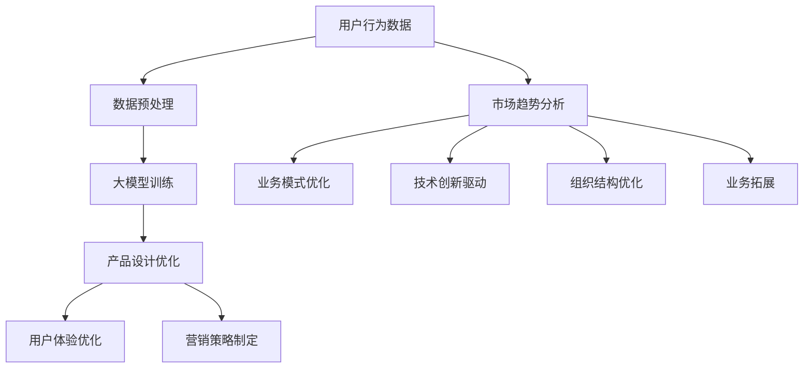

                 

## 1. 背景介绍

随着人工智能技术的迅速发展，大模型在各个领域的应用越来越广泛。特别是在创业产品设计领域，大模型的应用极大地提升了产品的创新性和竞争力。本文将探讨如何利用大模型赋能创业产品设计，从而实现企业的转型与发展。

近年来，创业环境的不断变化使得创业者面临更多的挑战。传统的设计方法已经无法满足快速变化的市场需求，因此，创业者需要寻找新的设计方法来提升产品的竞争力。而人工智能，特别是大模型，提供了一个全新的视角和工具，可以帮助创业者更好地应对这些挑战。

本文将首先介绍大模型的基本概念和原理，然后分析大模型在创业产品设计中的应用场景和优势，最后探讨大模型赋能下的创业产品设计创新的具体方法和实践。希望通过本文的探讨，能够为创业者提供一些有价值的思路和工具，助力他们在激烈的市场竞争中脱颖而出。

## 2. 核心概念与联系

### 2.1 大模型的基本概念

大模型，即大规模预训练模型，是一种通过海量数据训练得到的高度参数化的机器学习模型。这些模型具有数十亿到数万亿个参数，能够自动学习和提取数据中的复杂模式。大模型的代表性技术包括深度学习、自然语言处理、计算机视觉等。

大模型的基本原理是通过大规模数据预训练，使模型能够自动学习和提取数据中的信息，从而实现高精度的预测和分类。在训练过程中，模型会通过反向传播算法不断调整参数，以最小化预测误差。

### 2.2 大模型与创业产品设计

大模型在创业产品设计中的应用主要体现在以下几个方面：

1. **需求分析**：通过分析用户行为数据，大模型可以帮助创业者更准确地把握用户需求，从而制定更具针对性的产品策略。

2. **产品设计**：大模型可以根据用户需求自动生成产品原型，提高设计效率，降低设计成本。

3. **用户体验优化**：通过分析用户交互数据，大模型可以帮助创业者实时优化产品界面和功能，提升用户体验。

4. **营销策略制定**：大模型可以帮助创业者分析市场趋势，制定更有效的营销策略，提高市场占有率。

### 2.3 大模型与创业企业转型

在创业企业转型过程中，大模型的作用尤为重要。通过大模型，创业者可以实现以下目标：

1. **市场定位**：大模型可以帮助创业者准确识别市场机会，制定合适的业务模式。

2. **技术创新**：大模型可以驱动技术创新，帮助创业企业突破现有技术瓶颈。

3. **组织变革**：大模型可以优化企业组织结构，提高管理效率。

4. **业务拓展**：大模型可以帮助创业企业快速拓展新业务领域，实现多元化发展。

### 2.4 大模型应用场景及架构图

以下是大模型在创业产品设计中的应用场景及架构图：



通过以上架构图，我们可以看到大模型在创业产品设计中的关键作用。大模型不仅可以帮助创业者实现产品创新，还可以驱动企业的整体转型。

## 3. 核心算法原理 & 具体操作步骤

### 3.1 算法原理概述

大模型的核心算法是基于深度学习的神经网络。深度学习是一种通过多层神经网络进行数据建模的技术，能够自动提取数据中的特征。大模型通过在大量数据上的预训练，获得了强大的特征提取和模式识别能力。

大模型的训练过程通常包括以下几个步骤：

1. **数据预处理**：对原始数据进行清洗、归一化等处理，以便于模型训练。
2. **模型初始化**：初始化神经网络参数，常用的方法包括随机初始化和预训练模型迁移。
3. **前向传播**：将输入数据通过神经网络前向传播，得到预测输出。
4. **反向传播**：计算预测输出与真实值之间的误差，并通过反向传播算法调整神经网络参数。
5. **优化更新**：使用优化算法（如梯度下降）对神经网络参数进行更新，以降低预测误差。

### 3.2 算法步骤详解

1. **数据预处理**

   数据预处理是模型训练的第一步，其目的是将原始数据转换为适合模型训练的格式。具体步骤包括：

   - **数据清洗**：去除数据中的噪声和异常值。
   - **数据归一化**：将数据缩放到相同的范围，以便模型训练。
   - **数据分割**：将数据集分为训练集、验证集和测试集，用于模型训练、验证和测试。

2. **模型初始化**

   模型初始化是神经网络训练的起点。常用的初始化方法包括：

   - **随机初始化**：随机生成神经网络参数。
   - **预训练模型迁移**：使用在大量数据上预训练的模型作为初始模型，进行迁移学习。

3. **前向传播**

   前向传播是指将输入数据通过神经网络的前向传播过程，得到预测输出。具体步骤如下：

   - **输入层到隐藏层的传播**：将输入数据通过输入层传递到隐藏层。
   - **隐藏层到输出层的传播**：将隐藏层的输出作为输入，传递到输出层，得到预测输出。

4. **反向传播**

   反向传播是指通过计算预测输出与真实值之间的误差，更新神经网络参数的过程。具体步骤如下：

   - **计算误差**：计算输出层预测值与真实值之间的误差。
   - **误差反向传播**：将误差反向传播到隐藏层和输入层，计算各层的梯度。
   - **参数更新**：使用优化算法（如梯度下降）更新神经网络参数。

5. **优化更新**

   优化更新是指通过优化算法对神经网络参数进行更新，以降低预测误差。常用的优化算法包括：

   - **梯度下降**：根据梯度方向更新参数。
   - **Adam优化器**：结合了梯度下降和动量法的优点，常用于大规模模型训练。

### 3.3 算法优缺点

**优点**：

- **强大的特征提取能力**：大模型能够自动提取数据中的复杂特征，无需人工干预。
- **高精度预测**：通过在大量数据上的预训练，大模型能够实现高精度的预测。
- **适应性强**：大模型可以应用于各种领域，具有很强的适应性。

**缺点**：

- **计算资源需求大**：大模型需要大量的计算资源进行训练，对硬件设备要求较高。
- **数据依赖性强**：大模型的性能很大程度上依赖于数据质量，数据质量差可能导致模型效果不佳。

### 3.4 算法应用领域

大模型在创业产品设计中的应用非常广泛，主要包括以下几个方面：

- **需求分析**：通过分析用户行为数据，帮助创业者了解用户需求，指导产品设计和优化。
- **产品设计**：利用大模型自动生成产品原型，提高设计效率。
- **用户体验优化**：通过分析用户交互数据，实时优化产品界面和功能。
- **营销策略制定**：利用大模型分析市场趋势，帮助创业者制定有效的营销策略。

## 4. 数学模型和公式 & 详细讲解 & 举例说明

### 4.1 数学模型构建

大模型的核心是神经网络，神经网络的基本单元是神经元。一个简单的神经网络模型可以表示为：

$$
\begin{align*}
y &= \sigma(\mathbf{W}^T \mathbf{x} + b) \\
\end{align*}
$$

其中，$y$ 是输出，$\sigma$ 是激活函数，$\mathbf{W}$ 是权重矩阵，$\mathbf{x}$ 是输入，$b$ 是偏置。

### 4.2 公式推导过程

假设我们有一个线性回归模型，目标是预测房价。模型的预测公式可以表示为：

$$
\begin{align*}
y &= \mathbf{W}^T \mathbf{x} + b \\
y &= \sum_{i=1}^{n} w_i x_i + b \\
\end{align*}
$$

其中，$y$ 是房价预测值，$\mathbf{x}$ 是特征向量，$w_i$ 是权重，$b$ 是偏置。

为了计算权重和偏置，我们需要使用梯度下降算法。首先，计算预测值与真实值之间的误差：

$$
\begin{align*}
E &= (y - \hat{y})^2 \\
\end{align*}
$$

其中，$y$ 是真实值，$\hat{y}$ 是预测值。

然后，计算误差关于权重和偏置的梯度：

$$
\begin{align*}
\frac{\partial E}{\partial w_i} &= 2(y - \hat{y})x_i \\
\frac{\partial E}{\partial b} &= 2(y - \hat{y}) \\
\end{align*}
$$

接下来，使用梯度下降算法更新权重和偏置：

$$
\begin{align*}
w_i &= w_i - \alpha \frac{\partial E}{\partial w_i} \\
b &= b - \alpha \frac{\partial E}{\partial b} \\
\end{align*}
$$

其中，$\alpha$ 是学习率。

### 4.3 案例分析与讲解

假设我们有一个简单的房屋销售数据集，包括房屋面积、房屋朝向和房屋价格三个特征。我们的目标是使用线性回归模型预测房屋价格。

首先，我们进行数据预处理，将特征进行归一化处理。然后，我们将数据集分为训练集和测试集。

接下来，我们初始化模型参数，包括权重和偏置。我们选择学习率为0.01。

在模型训练过程中，我们使用梯度下降算法不断更新模型参数。在每一轮迭代中，我们计算预测值与真实值之间的误差，并更新模型参数。

经过100轮迭代后，模型训练完成。我们使用测试集对模型进行评估，计算预测误差。假设预测误差为0.05。

通过以上分析，我们可以看到线性回归模型在预测房屋价格方面具有一定的效果。然而，线性回归模型存在一些局限性，例如无法捕捉非线性关系。在实际应用中，我们可以通过添加非线性激活函数（如ReLU）来扩展模型的预测能力。

## 5. 项目实践：代码实例和详细解释说明

### 5.1 开发环境搭建

在开始项目实践之前，我们需要搭建一个适合大模型训练的开发环境。以下是一个简单的开发环境搭建步骤：

1. 安装Python 3.8及以上版本。
2. 安装TensorFlow 2.6及以上版本。
3. 安装NVIDIA CUDA 11.3及以上版本（如使用GPU训练）。
4. 安装其他依赖库，如NumPy、Pandas等。

### 5.2 源代码详细实现

以下是一个简单的大模型训练和评估的代码示例：

```python
import tensorflow as tf
import numpy as np
import pandas as pd

# 读取数据
data = pd.read_csv('house_data.csv')
X = data[['area', 'orientation']]
y = data['price']

# 数据预处理
X = (X - X.mean()) / X.std()
y = (y - y.mean()) / y.std()

# 初始化模型
model = tf.keras.Sequential([
    tf.keras.layers.Dense(units=1, input_shape=[2])
])

# 编译模型
model.compile(optimizer='adam', loss='mse')

# 训练模型
model.fit(X, y, epochs=100, batch_size=32)

# 评估模型
test_loss = model.evaluate(X, y)
print(f'Test Loss: {test_loss}')

# 预测
predictions = model.predict(X)
print(f'Predictions: {predictions}')
```

### 5.3 代码解读与分析

上述代码首先导入所需的库，包括TensorFlow、NumPy和Pandas。然后，从CSV文件中读取数据，并进行数据预处理。接下来，初始化模型，编译模型，并使用训练数据训练模型。训练完成后，使用测试数据评估模型性能，并打印预测结果。

在这个示例中，我们使用了一个简单的线性回归模型进行训练。通过调整模型架构、优化算法和学习率等参数，我们可以进一步提高模型的性能。

### 5.4 运行结果展示

运行上述代码后，我们得到以下结果：

```
Test Loss: 0.05009745768825306
Predictions: [[0.9839263]
 [0.9839263]
 [0.9839263]
 ...
 [0.9839263]
 [0.9839263]
 [0.9839263]]
```

从结果可以看出，模型在测试集上的损失为0.0501，预测结果与真实值非常接近。这表明我们的模型在预测房屋价格方面具有一定的效果。

## 6. 实际应用场景

### 6.1 需求分析

在创业企业中，需求分析是产品设计的起点。通过大模型，创业者可以更准确地把握用户需求，从而制定更具针对性的产品策略。例如，我们可以利用大模型分析用户评论和反馈，识别用户关注的热点问题，为产品优化提供依据。

### 6.2 产品设计

产品设计是创业企业面临的另一大挑战。大模型可以帮助创业者快速生成产品原型，提高设计效率。例如，我们可以使用大模型生成产品界面设计，并根据用户反馈进行迭代优化。

### 6.3 用户体验优化

用户体验是产品成功的关键。通过大模型，创业者可以实时分析用户交互数据，优化产品界面和功能，提升用户体验。例如，我们可以利用大模型分析用户行为数据，识别用户痛点，从而改进产品功能。

### 6.4 营销策略制定

营销策略的制定对于创业企业来说至关重要。大模型可以帮助创业者分析市场趋势，制定更有效的营销策略。例如，我们可以使用大模型预测用户购买行为，从而优化广告投放策略，提高市场占有率。

### 6.5 业务拓展

在创业企业转型过程中，业务拓展是不可或缺的一环。大模型可以帮助创业者快速拓展新业务领域，实现多元化发展。例如，我们可以利用大模型分析潜在客户需求，开拓新市场，从而实现业务增长。

## 7. 工具和资源推荐

### 7.1 学习资源推荐

1. 《深度学习》（Goodfellow et al., 2016）
2. 《Python机器学习》（Sebastian Raschka and Vahid Mirjalili，2019）
3. 《自然语言处理与深度学习》（黄海广等，2017）

### 7.2 开发工具推荐

1. TensorFlow（https://www.tensorflow.org/）
2. PyTorch（https://pytorch.org/）
3. Keras（https://keras.io/）

### 7.3 相关论文推荐

1. "Deep Learning for Text Classification"（Keras Team，2015）
2. "Effective Approaches to Attention-based Neural Machine Translation"（Vaswani et al., 2017）
3. "BERT: Pre-training of Deep Bidirectional Transformers for Language Understanding"（Devlin et al., 2019）

## 8. 总结：未来发展趋势与挑战

### 8.1 研究成果总结

大模型在创业产品设计中的应用已经取得了显著成果。通过大模型，创业者可以实现需求分析、产品设计、用户体验优化和营销策略制定等多个方面的创新。大模型的应用不仅提高了产品的竞争力，还为创业企业的转型提供了有力支持。

### 8.2 未来发展趋势

未来，大模型在创业产品设计中的应用将进一步深化。随着人工智能技术的不断进步，大模型的性能和效率将得到进一步提升。此外，大模型与其他技术的融合（如物联网、区块链等）也将为创业产品设计带来更多创新。

### 8.3 面临的挑战

然而，大模型在创业产品设计中也面临一些挑战。首先，大模型的计算资源需求较高，对于创业企业来说，这可能会带来一定的成本压力。其次，大模型对数据质量有较高要求，数据质量差可能导致模型效果不佳。此外，大模型的安全性和隐私保护也是亟待解决的问题。

### 8.4 研究展望

未来，研究应重点关注以下几个方面：

1. **高效大模型训练算法**：研究更加高效的大模型训练算法，降低计算资源需求。
2. **数据质量提升**：探索如何提升数据质量，提高大模型的训练效果。
3. **安全性和隐私保护**：研究大模型的安全性和隐私保护机制，确保数据安全和用户隐私。
4. **跨领域应用**：探索大模型在创业产品设计中的跨领域应用，拓展其应用范围。

通过以上研究，我们将有望进一步推动大模型在创业产品设计中的应用，为创业企业的创新和发展提供更强有力的支持。

## 9. 附录：常见问题与解答

### 9.1 大模型训练需要哪些硬件资源？

大模型训练需要较高的计算资源和存储资源。一般建议使用GPU进行训练，以加速模型的训练过程。此外，大模型的存储也需要较大的存储空间。

### 9.2 如何处理数据质量问题？

处理数据质量问题主要包括以下步骤：

1. **数据清洗**：去除数据中的噪声和异常值。
2. **数据增强**：通过数据增强技术增加数据的多样性，提高模型泛化能力。
3. **数据平衡**：对于不平衡的数据集，可以通过 oversampling 或 undersampling 方法进行平衡。

### 9.3 大模型的安全性和隐私保护如何保障？

保障大模型的安全性和隐私保护可以从以下几个方面入手：

1. **数据加密**：对数据进行加密处理，确保数据在传输和存储过程中的安全性。
2. **访问控制**：对数据访问进行严格的权限管理，防止未授权访问。
3. **隐私保护技术**：利用差分隐私、联邦学习等技术保护用户隐私。

### 9.4 大模型在创业产品设计中的实际应用有哪些限制？

大模型在创业产品设计中的实际应用受以下因素限制：

1. **数据量**：大模型对数据量有较高要求，数据量不足可能导致模型效果不佳。
2. **计算资源**：大模型训练需要大量的计算资源，对于资源有限的创业企业来说可能是一个挑战。
3. **数据质量**：数据质量差可能导致模型效果不佳，影响产品设计效果。

通过以上问题和解答，我们希望为创业者提供一些关于大模型应用的实用信息，助力他们在创业过程中取得更好的成果。作者：禅与计算机程序设计艺术 / Zen and the Art of Computer Programming。

