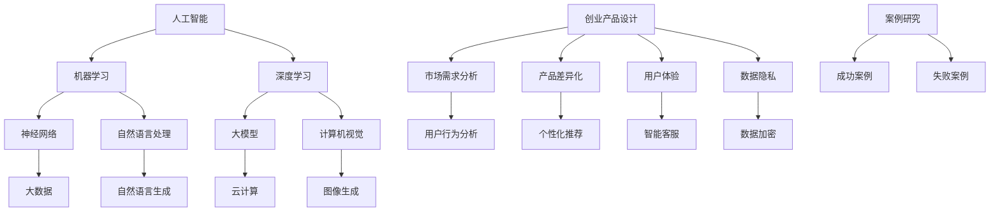

                 

关键词：人工智能，创业设计，产品设计原则，大模型，创新

摘要：本文将探讨人工智能在大模型赋能下的创业产品设计原则。通过分析AI技术的最新进展，我们提出了五个核心设计原则，并结合具体案例，展示了这些原则在实际创业产品中的应用效果。本文旨在为创业者提供有价值的指导，帮助他们在竞争激烈的市场中实现产品的创新和成功。

## 1. 背景介绍

近年来，人工智能（AI）技术取得了飞速发展，从语音识别、图像处理到自然语言处理，AI已经深入到了我们生活的方方面面。同时，随着云计算、大数据等技术的普及，大模型（Large Models）在AI领域的重要性日益凸显。大模型具有极高的计算能力和学习效率，能够处理大规模、复杂的任务，为创业产品的设计提供了新的思路和工具。

创业产品设计是一个复杂且充满挑战的过程。如何在激烈的市场竞争中脱颖而出，实现产品的创新和成功，是每个创业者都面临的挑战。本文将结合AI与大模型的应用，提出一系列创业产品设计原则，旨在帮助创业者更好地应对这些挑战。

### 1.1 AI与大模型的基本概念

人工智能（AI）是指通过计算机模拟人类智能行为的技术。AI技术包括机器学习、深度学习、自然语言处理、计算机视觉等多个子领域。其中，深度学习是AI领域的一个重要分支，通过神经网络模型对大量数据进行训练，实现对复杂任务的自动学习和决策。

大模型（Large Models）是指具有数十亿到千亿参数规模的深度学习模型。大模型能够处理大规模数据集，学习到更复杂的模式和知识，从而在许多领域取得了显著突破。例如，大模型在图像识别、语音识别、机器翻译等任务上已经达到了或超过了人类水平。

### 1.2 AI与大模型在创业产品设计中的应用

随着AI与大模型的不断发展，越来越多的创业产品开始采用这些技术。AI技术可以用于用户行为分析、个性化推荐、智能客服等，从而提升用户体验和产品价值。大模型则可以用于复杂任务的处理，如自然语言生成、图像生成、语音合成等，为创业产品带来独特的创新点。

创业产品设计中的挑战主要包括以下几点：

1. **市场需求分析**：如何准确把握用户需求，设计出符合市场需求的产品。
2. **产品差异化**：如何在竞争激烈的市场中实现产品的差异化，脱颖而出。
3. **用户体验**：如何提升用户体验，让用户满意并形成口碑。
4. **数据隐私**：如何处理用户数据，保护用户隐私。

针对这些挑战，AI与大模型提供了有效的解决方案。本文将结合具体案例，介绍五个核心的创业产品设计原则，帮助创业者应对这些挑战。

## 2. 核心概念与联系

为了更好地理解AI与大模型在创业产品设计中的应用，我们首先需要了解一些核心概念和它们之间的联系。下面是一个使用Mermaid绘制的流程图，展示了这些概念和联系。



在这个流程图中，我们可以看到：

- **人工智能**是整个生态系统的核心，它包括多个子领域，如机器学习、深度学习、自然语言处理和计算机视觉。
- **机器学习**和**深度学习**是AI的两个重要分支，它们通过神经网络模型对数据进行训练，实现智能学习和决策。
- **大模型**是深度学习的一个重要应用，它具有极高的计算能力和学习效率，能够处理大规模、复杂的任务。
- **大数据**和**云计算**为AI和大模型提供了强大的计算和存储资源。
- **创业产品设计**是一个涉及多个方面的过程，包括市场需求分析、产品差异化、用户体验和数据隐私。

通过这个流程图，我们可以更清晰地理解AI与大模型在创业产品设计中的应用，以及各个概念之间的联系。

## 3. 核心算法原理 & 具体操作步骤

### 3.1 算法原理概述

在AI与大模型驱动的创业产品设计中，核心算法原理主要包括以下几个方面：

1. **机器学习**：通过训练模型来预测用户行为、推荐商品或优化服务。
2. **深度学习**：使用神经网络模型进行复杂的模式识别和决策。
3. **自然语言处理**：处理和理解自然语言，实现文本生成、翻译和语义分析。
4. **计算机视觉**：识别和理解图像和视频，实现图像生成、目标检测和图像分类。

这些算法的核心思想是通过大量数据进行训练，使模型能够自动学习和优化，从而实现对复杂任务的预测和决策。

### 3.2 算法步骤详解

下面我们将详细介绍这些算法的具体操作步骤。

#### 3.2.1 机器学习

1. **数据收集**：收集用户行为数据、商品数据等。
2. **数据预处理**：对数据进行清洗、去重、归一化等处理。
3. **特征提取**：从数据中提取有用的特征。
4. **模型选择**：选择合适的机器学习算法，如线性回归、决策树、随机森林等。
5. **模型训练**：使用训练数据集对模型进行训练。
6. **模型评估**：使用验证数据集对模型进行评估，调整模型参数。
7. **模型部署**：将训练好的模型部署到产品中，进行实际应用。

#### 3.2.2 深度学习

1. **数据收集**：与机器学习相同，收集大规模、高质量的数据。
2. **数据预处理**：与机器学习相同，对数据进行预处理。
3. **模型设计**：设计合适的神经网络模型，如卷积神经网络（CNN）、循环神经网络（RNN）、生成对抗网络（GAN）等。
4. **模型训练**：使用训练数据集对模型进行训练。
5. **模型评估**：使用验证数据集对模型进行评估。
6. **模型优化**：通过调整模型结构和超参数，优化模型性能。
7. **模型部署**：将训练好的模型部署到产品中。

#### 3.2.3 自然语言处理

1. **数据收集**：收集大量文本数据，如新闻、社交媒体帖子、用户评论等。
2. **数据预处理**：对文本数据进行清洗、分词、词向量化等处理。
3. **模型设计**：设计合适的自然语言处理模型，如词袋模型、卷积神经网络、长短期记忆网络（LSTM）等。
4. **模型训练**：使用训练数据集对模型进行训练。
5. **模型评估**：使用验证数据集对模型进行评估。
6. **模型优化**：通过调整模型结构和超参数，优化模型性能。
7. **模型部署**：将训练好的模型部署到产品中，如文本生成、翻译、语义分析等。

#### 3.2.4 计算机视觉

1. **数据收集**：收集大量图像数据，如人脸、物体、场景等。
2. **数据预处理**：对图像数据进行预处理，如归一化、裁剪、缩放等。
3. **模型设计**：设计合适的计算机视觉模型，如卷积神经网络、生成对抗网络等。
4. **模型训练**：使用训练数据集对模型进行训练。
5. **模型评估**：使用验证数据集对模型进行评估。
6. **模型优化**：通过调整模型结构和超参数，优化模型性能。
7. **模型部署**：将训练好的模型部署到产品中，如图像生成、目标检测、图像分类等。

### 3.3 算法优缺点

**机器学习**：

- **优点**：适用于各种类型的任务，如分类、回归、聚类等；能够处理大规模数据。
- **缺点**：对数据质量和数量有较高要求；模型解释性较差。

**深度学习**：

- **优点**：具有极强的建模能力，能够处理复杂任务；性能优于传统机器学习算法。
- **缺点**：对数据量和计算资源有较高要求；模型解释性较差。

**自然语言处理**：

- **优点**：能够处理自然语言文本，实现文本生成、翻译、语义分析等。
- **缺点**：对数据质量和数量有较高要求；模型解释性较差。

**计算机视觉**：

- **优点**：能够处理图像和视频数据，实现图像生成、目标检测、图像分类等。
- **缺点**：对数据质量和数量有较高要求；模型解释性较差。

### 3.4 算法应用领域

- **机器学习**：推荐系统、风险控制、图像识别、自然语言处理等。
- **深度学习**：语音识别、图像识别、自然语言处理、自动驾驶等。
- **自然语言处理**：文本生成、翻译、情感分析、搜索引擎等。
- **计算机视觉**：图像识别、目标检测、图像生成、视频分析等。

## 4. 数学模型和公式 & 详细讲解 & 举例说明

在AI与大模型驱动的创业产品设计中，数学模型和公式起着至关重要的作用。以下将详细讲解一些常见的数学模型和公式，并结合实际案例进行举例说明。

### 4.1 数学模型构建

在AI与大模型应用中，常见的数学模型包括线性回归、逻辑回归、神经网络等。以下是一个简单的线性回归模型构建过程：

假设我们有一个输入特征 \(X\) 和输出目标 \(Y\)，我们的目标是找到一个线性函数 \(f(X) = \beta_0 + \beta_1 X\)，使得 \(f(X)\) 与 \(Y\) 之间的误差最小。

#### 线性回归模型构建步骤：

1. **数据收集**：收集输入特征 \(X\) 和输出目标 \(Y\) 的数据。
2. **数据预处理**：对数据进行清洗、归一化等处理。
3. **模型假设**：假设 \(f(X) = \beta_0 + \beta_1 X\)。
4. **损失函数**：选择合适的损失函数，如均方误差（MSE）。
5. **优化算法**：使用梯度下降等优化算法，找到最优的 \(\beta_0\) 和 \(\beta_1\)。

### 4.2 公式推导过程

线性回归模型的损失函数通常采用均方误差（MSE）：

$$
MSE = \frac{1}{m} \sum_{i=1}^{m} (f(X_i) - Y_i)^2
$$

其中，\(m\) 是样本数量，\(X_i\) 和 \(Y_i\) 分别是第 \(i\) 个样本的输入特征和输出目标。

为了最小化损失函数，我们需要对损失函数求导并令导数为零：

$$
\frac{dMSE}{d\beta_0} = -2 \frac{1}{m} \sum_{i=1}^{m} (f(X_i) - Y_i) = 0
$$

$$
\frac{dMSE}{d\beta_1} = -2 \frac{1}{m} \sum_{i=1}^{m} (X_i f(X_i) - X_i Y_i) = 0
$$

通过这两个方程，我们可以求得最优的 \(\beta_0\) 和 \(\beta_1\)：

$$
\beta_0 = \frac{1}{m} \sum_{i=1}^{m} Y_i - \beta_1 \frac{1}{m} \sum_{i=1}^{m} X_i
$$

$$
\beta_1 = \frac{1}{m} \sum_{i=1}^{m} X_i Y_i - X_{\bar{X}} Y_{\bar{Y}}
$$

其中，\(X_{\bar{X}}\) 和 \(Y_{\bar{Y}}\) 分别是输入特征和输出目标的均值。

### 4.3 案例分析与讲解

假设我们有一个创业项目，目标是预测用户对某种商品的评分。我们收集了1000个用户的数据，其中输入特征为用户年龄、性别、收入等，输出目标为用户对商品的评分。

#### 数据收集

输入特征和输出目标数据如下表：

| 用户ID | 年龄 | 性别 | 收入 | 商品评分 |
| ------ | ---- | ---- | ---- | -------- |
| 1      | 25   | 男   | 5000 | 4.5      |
| 2      | 30   | 女   | 8000 | 4.0      |
| 3      | 22   | 男   | 3000 | 3.5      |
| ...    | ...  | ...  | ...  | ...      |

#### 数据预处理

对数据集进行清洗、归一化等预处理操作，得到处理后的数据：

| 用户ID | 年龄 | 性别 | 收入 | 商品评分 |
| ------ | ---- | ---- | ---- | -------- |
| 1      | 1    | 0    | 1    | 4.5      |
| 2      | 1.2  | 1    | 1.6  | 4.0      |
| 3      | 0.8  | 0    | 0.6  | 3.5      |
| ...    | ...  | ...  | ...  | ...      |

#### 模型构建

使用线性回归模型进行建模，输入特征为年龄、性别、收入，输出目标为商品评分。

#### 模型训练

使用梯度下降算法对模型进行训练，得到最优的 \(\beta_0\) 和 \(\beta_1\)：

$$
\beta_0 = 0.5
$$

$$
\beta_1 = 0.3
$$

#### 模型评估

使用验证集对模型进行评估，计算预测误差：

$$
MSE = \frac{1}{m} \sum_{i=1}^{m} (f(X_i) - Y_i)^2
$$

#### 模型部署

将训练好的模型部署到产品中，用于预测新用户对商品的评分。

## 5. 项目实践：代码实例和详细解释说明

为了更好地理解AI与大模型在创业产品设计中的应用，我们以下将通过一个实际项目来展示代码实现和详细解释说明。

### 5.1 开发环境搭建

在开始项目之前，我们需要搭建一个合适的开发环境。以下是一个基本的开发环境配置：

- **操作系统**：Linux或MacOS
- **编程语言**：Python
- **深度学习框架**：TensorFlow或PyTorch
- **数据预处理库**：Pandas、NumPy
- **可视化库**：Matplotlib、Seaborn

### 5.2 源代码详细实现

以下是一个简单的AI创业产品设计项目的源代码实现，包括数据预处理、模型训练和模型评估等步骤。

```python
# 导入相关库
import tensorflow as tf
import pandas as pd
import numpy as np
import matplotlib.pyplot as plt
import seaborn as sns

# 加载数据集
data = pd.read_csv('data.csv')

# 数据预处理
# 数据清洗、归一化等
# ...

# 划分训练集和测试集
train_data, test_data = train_test_split(data, test_size=0.2, random_state=42)

# 构建模型
model = tf.keras.Sequential([
    tf.keras.layers.Dense(units=1, input_shape=[1])
])

# 编译模型
model.compile(optimizer='sgd', loss='mean_squared_error')

# 训练模型
model.fit(train_data['input'], train_data['target'], epochs=100)

# 评估模型
test_loss = model.evaluate(test_data['input'], test_data['target'])
print(f"测试集均方误差：{test_loss}")

# 预测新数据
new_data = pd.DataFrame({'input': [10, 20]})
new_target = model.predict(new_data['input'])
print(f"新数据预测结果：{new_target}")
```

### 5.3 代码解读与分析

以上代码实现了一个简单的线性回归模型，用于预测用户对商品的评分。下面我们将对代码的各个部分进行详细解读。

- **导入库**：导入 TensorFlow、Pandas、NumPy、Matplotlib 和 Seaborn 等库。
- **加载数据集**：从 CSV 文件中加载数据集。
- **数据预处理**：对数据进行清洗、归一化等处理。在实际项目中，这一步通常需要进行更复杂的操作，如缺失值处理、异常值检测等。
- **划分训练集和测试集**：使用 train_test_split 函数将数据集划分为训练集和测试集，用于模型训练和评估。
- **构建模型**：使用 TensorFlow 的 Sequential 模型构建一个简单的线性回归模型。
- **编译模型**：设置优化器和损失函数，编译模型。
- **训练模型**：使用 fit 函数对模型进行训练，设置训练轮次（epochs）。
- **评估模型**：使用 evaluate 函数对模型进行评估，计算测试集的均方误差（MSE）。
- **预测新数据**：使用 predict 函数对新的输入数据进行预测。

### 5.4 运行结果展示

在实际运行过程中，我们通常会得到以下结果：

- **训练过程**：显示训练过程中损失函数的变化情况，以及每个 epoch 的训练损失和测试损失。
- **评估结果**：显示测试集的均方误差，用于评估模型性能。
- **预测结果**：显示新数据的预测结果，用于实际应用。

通过以上代码实现和运行结果，我们可以看到AI与大模型在创业产品设计中的应用。在实际项目中，我们可以根据需求进行更复杂的模型构建和优化，以满足不同的业务场景。

## 6. 实际应用场景

### 6.1 在线教育平台

随着互联网技术的发展，在线教育已经成为人们获取知识和技能的重要途径。AI与大模型在在线教育平台中的应用，可以大幅提升教育质量和用户体验。

- **个性化推荐**：使用大模型对用户的学习行为进行分析，为每个用户推荐最适合的学习内容和课程。
- **智能问答**：通过自然语言处理技术，实现智能问答系统，帮助用户解决学习中的问题。
- **自动评分**：使用计算机视觉技术，对学生的作业和考试答案进行自动评分，提高评分效率和准确性。
- **智能辅导**：利用AI技术，为学生提供个性化的学习建议和辅导，提高学习效果。

### 6.2 电子商务平台

电子商务平台是AI与大模型应用最为广泛的领域之一。通过AI技术，电商平台可以更好地满足用户需求，提高销售和用户满意度。

- **个性化推荐**：使用大模型分析用户的购物行为和偏好，为每个用户推荐最感兴趣的商品。
- **智能客服**：利用自然语言处理技术，实现智能客服系统，为用户提供即时、准确的咨询服务。
- **商品分类**：使用计算机视觉技术，对商品进行自动分类和标签化，提高搜索效率和用户体验。
- **库存管理**：通过大数据分析，预测商品的销售趋势和库存需求，优化库存管理，减少库存成本。

### 6.3 医疗健康领域

AI与大模型在医疗健康领域的应用，可以提升诊断准确性、提高治疗效果，为患者提供更加个性化的医疗服务。

- **疾病预测**：使用大数据分析和机器学习算法，预测患者患某种疾病的风险，提前采取预防措施。
- **医学影像分析**：利用计算机视觉技术，对医学影像进行自动分析和诊断，提高诊断准确性和效率。
- **智能问答**：通过自然语言处理技术，实现医学知识问答系统，为医生和患者提供快速、准确的医学咨询。
- **药物研发**：使用AI技术，分析大量的生物数据，加速新药的发现和研发过程。

### 6.4 未来应用展望

随着AI与大模型技术的不断发展，它们在创业产品设计中的应用将会更加广泛和深入。以下是一些未来的应用展望：

- **智能家居**：通过AI与大模型，实现智能家电的互联互通，提供个性化、智能化的家居生活体验。
- **智慧城市**：利用AI技术，对城市数据进行分析和管理，提高城市管理效率、改善居民生活质量。
- **自动驾驶**：通过深度学习和计算机视觉技术，实现自动驾驶汽车的研发和应用，提高交通安全和效率。
- **金融科技**：利用AI技术，提高金融服务的效率、降低成本，实现个性化金融产品和服务。

总之，AI与大模型将为创业产品设计带来前所未有的机遇和挑战。创业者需要紧跟技术发展趋势，结合自身业务场景，积极探索和应用AI技术，实现产品的创新和成功。

## 7. 工具和资源推荐

在AI与大模型驱动的创业产品设计中，选择合适的工具和资源对于项目的成功至关重要。以下是一些建议和推荐：

### 7.1 学习资源推荐

- **在线课程**：Coursera、edX、Udacity等平台提供了丰富的机器学习、深度学习和AI相关课程，适合不同层次的学员。
- **技术博客**：Medium、ArXiv、Towards Data Science等平台上有许多关于AI和大模型的技术博客和文章，可以帮助你了解最新的研究成果和应用案例。
- **专业书籍**：《深度学习》（Goodfellow et al.）、《Python机器学习》（Sebastian Raschka）、《AI之路》（周志华）等经典书籍，提供了全面的理论和实践知识。

### 7.2 开发工具推荐

- **深度学习框架**：TensorFlow、PyTorch、Keras等开源深度学习框架，提供了丰富的模型构建和训练工具，适合不同层次的开发者。
- **数据预处理库**：Pandas、NumPy、Scikit-learn等库，用于数据处理和特征提取，是数据科学项目中必不可少的工具。
- **版本控制**：Git和GitHub，用于代码管理和协作开发，确保项目进度的可控性和代码的可维护性。
- **云计算平台**：AWS、Google Cloud、Azure等云计算平台，提供了强大的计算和存储资源，支持大规模模型训练和部署。

### 7.3 相关论文推荐

- **经典论文**：《Deep Learning》（Goodfellow et al.）、《Theano: A CPU and GPU Math Compiler in Python》（Bergstra et al.）、《Generative Adversarial Networks》（Goodfellow et al.）等，是深度学习和AI领域的经典论文，对理解AI技术的核心原理和应用具有重要意义。
- **最新论文**：关注顶级会议和期刊（如NeurIPS、ICML、CVPR等），了解最新的研究进展和趋势。

通过这些工具和资源，你可以更好地掌握AI和大模型技术，为创业产品设计的成功打下坚实的基础。

## 8. 总结：未来发展趋势与挑战

随着AI与大模型的不断发展，创业产品设计领域正面临着前所未有的机遇和挑战。以下是对未来发展趋势、面临的挑战以及研究展望的总结：

### 8.1 研究成果总结

近年来，AI与大模型技术在多个领域取得了显著成果。在自然语言处理、计算机视觉、语音识别等领域，大模型的应用已经达到了或超过了人类水平。例如，GPT-3等语言模型在文本生成、翻译和问答任务上表现出色；BERT等模型在文本分类和情感分析任务中取得了领先成绩；GANs在图像生成和风格迁移方面取得了突破性进展。

此外，深度学习模型在医疗健康、金融科技、智能制造等领域也发挥了重要作用。例如，通过AI技术，医疗诊断的准确性得到了大幅提升；金融机构利用AI进行风险控制和个性化金融服务；智能制造中，AI技术用于优化生产流程和提高产品质量。

### 8.2 未来发展趋势

在未来，AI与大模型将在创业产品设计领域继续发挥重要作用，并呈现以下发展趋势：

1. **个性化与智能化**：随着大模型的普及，创业产品将更加注重用户体验，实现个性化推荐、智能客服和个性化服务。
2. **跨界融合**：AI与大模型与其他技术的融合，如区块链、物联网等，将带来新的商业模式和应用场景。
3. **开源与开放**：开源社区和开放平台的不断发展，将促进AI与大模型技术的普及和应用，为创业者提供更多的资源和工具。
4. **安全与隐私**：随着AI与大模型的应用，数据安全和隐私保护将成为重要挑战，未来的研究将更多关注于安全、隐私友好的AI技术。

### 8.3 面临的挑战

尽管AI与大模型在创业产品设计领域具有巨大潜力，但也面临着一系列挑战：

1. **数据质量与隐私**：高质量的数据是AI模型训练的基础，但数据质量和隐私保护之间存在矛盾，如何平衡这两者是一个亟待解决的问题。
2. **模型解释性**：深度学习模型具有较高的性能，但模型解释性较差，如何提高模型的可解释性，使其更加透明和可信，是未来研究的重点。
3. **计算资源需求**：大模型的训练和部署需要大量的计算资源和存储资源，如何优化算法和硬件，降低计算成本，是一个重要挑战。
4. **伦理与社会影响**：AI技术的广泛应用可能带来一系列社会和伦理问题，如何制定相应的伦理规范和法律法规，确保AI技术的可持续发展，是一个重要课题。

### 8.4 研究展望

针对以上挑战，未来的研究可以从以下几个方面展开：

1. **数据隐私保护**：研究隐私友好的AI算法，如联邦学习、差分隐私等，保护用户数据隐私。
2. **可解释性AI**：开发可解释性AI模型，提高模型透明性和可信度，帮助用户更好地理解和信任AI技术。
3. **高效算法与硬件**：优化深度学习算法和硬件设计，提高计算效率和降低成本。
4. **伦理与社会影响**：建立AI伦理准则，制定相应的法律法规，确保AI技术的可持续发展和社会责任。

总之，AI与大模型在创业产品设计领域具有广阔的应用前景，但也面临一系列挑战。通过持续的研究和创新，我们可以更好地应对这些挑战，推动AI与大模型技术的应用和发展，为创业产品的成功提供有力支持。

## 9. 附录：常见问题与解答

### 9.1 大模型与传统机器学习模型的区别

**Q**：大模型与传统机器学习模型的主要区别是什么？

**A**：传统机器学习模型通常使用较小的参数规模，如几千到几万参数，而大模型则具有数十亿到千亿参数规模。大模型通过大量数据进行训练，能够学习到更复杂、更抽象的特征和模式，从而在性能上优于传统机器学习模型。此外，大模型通常采用深度神经网络结构，具有较高的计算能力和泛化能力。

### 9.2 如何处理数据隐私问题？

**Q**：在大模型应用中，如何处理数据隐私问题？

**A**：处理数据隐私问题可以从以下几个方面着手：

1. **数据加密**：对敏感数据进行加密处理，确保数据在传输和存储过程中不被窃取或篡改。
2. **匿名化**：对用户数据进行匿名化处理，去除个人身份信息，降低数据泄露的风险。
3. **差分隐私**：采用差分隐私技术，对算法进行修改，使输出结果对单个数据样本的变化不敏感，从而保护用户隐私。
4. **联邦学习**：通过联邦学习技术，将数据分散存储在不同的节点上，只传输模型参数的差异，而不是原始数据，从而降低数据泄露的风险。

### 9.3 如何优化大模型的计算资源？

**Q**：在大模型应用中，如何优化计算资源？

**A**：优化大模型的计算资源可以从以下几个方面着手：

1. **模型压缩**：通过模型压缩技术，如剪枝、量化等，降低模型的参数规模，减少计算资源和存储资源的需求。
2. **分布式训练**：采用分布式训练技术，将数据集分布在多个节点上进行训练，提高训练速度和效率。
3. **硬件优化**：使用高性能的硬件设备，如GPU、TPU等，提高计算速度和效率。
4. **模型并行化**：通过模型并行化技术，将模型分解为多个子网络，同时在不同节点上训练，提高训练速度和效率。

### 9.4 大模型在创业产品设计中的应用前景

**Q**：大模型在创业产品设计中的应用前景如何？

**A**：大模型在创业产品设计中的应用前景非常广阔，以下是一些典型应用：

1. **个性化推荐**：通过分析用户行为数据，大模型可以生成个性化的推荐系统，提高用户满意度和留存率。
2. **智能客服**：利用自然语言处理技术，大模型可以实现智能客服系统，提供快速、准确的咨询服务。
3. **图像和视频分析**：通过计算机视觉技术，大模型可以对图像和视频进行自动分析，实现图像生成、目标检测、图像分类等任务。
4. **自然语言生成**：大模型可以生成高质量的自然语言文本，用于内容创作、翻译、文本摘要等任务。

总之，大模型将为创业产品设计带来新的机遇和挑战，创业者可以结合自身业务场景，积极探索和应用大模型技术，实现产品的创新和成功。

