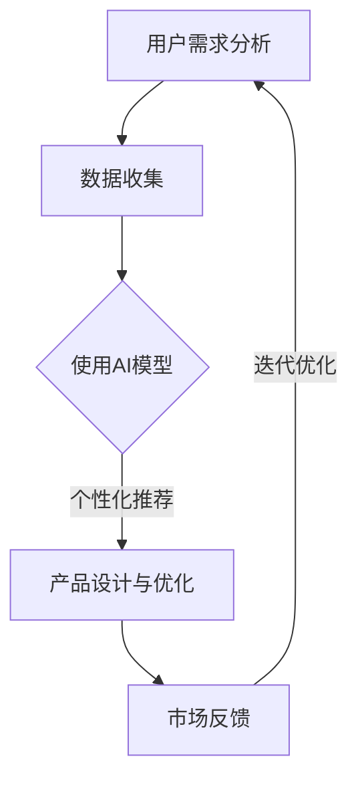

                 

关键词：AI、创业产品设计、大模型、赋能、深度学习、创新

> 摘要：本文旨在探讨AI技术在创业产品设计中的应用，特别是大模型在赋能创业产品开发方面的作用。我们将深入分析AI的核心概念及其在创业领域的潜力，然后探讨大模型的原理和应用，并提供具体的案例和项目实践，最后讨论AI在创业产品中的未来应用场景和面临的挑战。

## 1. 背景介绍

随着人工智能技术的迅猛发展，AI已经成为推动社会进步的重要力量。特别是在创业领域，AI的应用不仅提高了产品的开发效率，还显著提升了用户体验和市场竞争力。创业产品设计师们逐渐意识到，将AI技术融入产品设计中，不仅可以解决复杂问题，还可以为用户带来全新的交互体验。

创业产品的设计不仅仅是功能上的创新，更是用户体验和商业模式的创新。在竞争激烈的市场环境中，快速迭代和敏捷开发成为了创业企业的核心竞争力。AI技术，特别是大模型，为这种快速迭代提供了强大的支持。通过学习大量的用户数据和行为模式，大模型能够帮助设计师更好地理解用户需求，从而创造出更加贴合用户期望的产品。

本文将围绕以下主题展开：

1. AI在创业产品设计中的核心概念和作用。
2. 大模型的原理及其在创业产品中的应用。
3. 大模型驱动的创业产品设计实践。
4. 大模型在创业产品中的实际应用场景。
5. 大模型赋能创业产品的未来展望。

## 2. 核心概念与联系

### 2.1 AI在创业产品设计中的核心概念

人工智能（AI）是指由人制造出来的系统能够根据目标和环境进行智能学习、推理和决策的能力。AI的核心概念包括机器学习、深度学习和自然语言处理等。

- **机器学习**：通过数据训练模型，使其能够进行预测和分类。
- **深度学习**：一种特殊的机器学习方法，利用多层神经网络进行数据建模。
- **自然语言处理（NLP）**：使计算机能够理解和生成人类语言的技术。

AI在创业产品设计中的应用主要体现在以下几个方面：

1. **用户数据分析**：通过分析用户行为数据，了解用户偏好和需求。
2. **个性化推荐**：根据用户数据提供个性化的产品推荐。
3. **自动化流程**：通过AI自动化业务流程，提高运营效率。
4. **智能交互**：利用NLP和语音识别技术，实现智能对话和交互。

### 2.2 大模型的原理

大模型是指具有数百万甚至数十亿参数的深度学习模型。这些模型通常通过训练大量数据来学习复杂的模式和关系。大模型的原理可以总结为以下几个方面：

- **大规模参数**：大模型具有大量的参数，使其能够捕捉数据中的复杂模式。
- **多层神经网络**：大模型通常由多层神经网络组成，每一层都对输入数据进行不同级别的特征提取和变换。
- **端到端训练**：大模型可以直接从原始数据学习目标输出，无需手动设计复杂的中间层。

### 2.3 Mermaid 流程图

下面是一个简单的Mermaid流程图，展示了AI在创业产品设计中的应用流程。



## 3. 核心算法原理 & 具体操作步骤

### 3.1 算法原理概述

大模型的算法原理主要基于深度学习和神经网络。深度学习是一种机器学习方法，通过多层神经网络来学习数据的复杂特征。神经网络由一系列相互连接的神经元组成，每个神经元都接收前一层神经元的输出，并通过激活函数产生输出。

大模型的关键在于其大规模参数和多层神经网络结构。这些参数和层使得大模型能够学习非常复杂的特征和模式。在训练过程中，大模型通过反向传播算法不断调整参数，以最小化损失函数。

### 3.2 算法步骤详解

1. **数据预处理**：收集用户数据，并进行清洗、归一化和特征提取。
2. **模型设计**：设计多层神经网络结构，包括输入层、隐藏层和输出层。
3. **模型训练**：使用训练数据对模型进行训练，通过反向传播算法不断调整参数。
4. **模型评估**：使用测试数据对模型进行评估，以验证模型的性能。
5. **模型部署**：将训练好的模型部署到生产环境中，提供实时服务。

### 3.3 算法优缺点

**优点**：

- **强大的建模能力**：大模型能够捕捉数据中的复杂模式和关系，从而提高模型的预测和分类能力。
- **端到端训练**：大模型可以直接从原始数据学习目标输出，无需手动设计复杂的中间层，提高了开发效率。
- **自动化特征提取**：大模型能够自动提取数据中的有效特征，减少了人工干预。

**缺点**：

- **计算资源消耗大**：大模型需要大量的计算资源和时间进行训练。
- **数据隐私问题**：大模型需要大量用户数据进行训练，可能会引发数据隐私问题。
- **模型解释性差**：大模型的内部结构复杂，难以解释其决策过程。

### 3.4 算法应用领域

大模型的应用领域非常广泛，包括但不限于：

- **推荐系统**：通过分析用户行为数据，提供个性化的产品推荐。
- **自然语言处理**：实现智能对话、文本分类和情感分析等功能。
- **图像识别**：对图像进行分类、检测和分割。
- **游戏AI**：为游戏设计智能对手。

## 4. 数学模型和公式 & 详细讲解 & 举例说明

### 4.1 数学模型构建

大模型的核心是深度学习模型，其数学模型主要包括以下几个部分：

- **输入层**：接收外部输入数据。
- **隐藏层**：对输入数据进行特征提取和变换。
- **输出层**：生成模型的预测结果。

假设我们有一个简单的多层神经网络，其数学模型可以表示为：

$$
Z^{(l)} = \sigma(W^{(l)} \cdot A^{(l-1)} + b^{(l)})
$$

其中，$Z^{(l)}$ 表示第 $l$ 层的输出，$A^{(l-1)}$ 表示第 $l-1$ 层的输出，$W^{(l)}$ 和 $b^{(l)}$ 分别表示第 $l$ 层的权重和偏置，$\sigma$ 表示激活函数。

### 4.2 公式推导过程

深度学习模型的训练过程主要包括以下两个步骤：

1. **前向传播**：从输入层开始，逐层计算网络的输出。
2. **反向传播**：计算损失函数，并利用梯度下降算法更新网络参数。

在前向传播过程中，网络的输出可以通过以下公式计算：

$$
A^{(l)} = \sigma(Z^{(l)})
$$

在反向传播过程中，我们首先计算损失函数：

$$
J = \frac{1}{m} \sum_{i=1}^{m} \sum_{k=1}^{K} (-y^{(i)}_{k} \log(A^{(L)}_{k}))]
$$

其中，$m$ 表示样本数量，$K$ 表示类别数量，$y^{(i)}_{k}$ 表示第 $i$ 个样本的第 $k$ 个类别的真实标签，$A^{(L)}_{k}$ 表示第 $k$ 个类别的预测概率。

然后，利用反向传播算法计算各层参数的梯度：

$$
\frac{\partial J}{\partial W^{(l)}_i} = \frac{\partial J}{\partial Z^{(l+1)}} \cdot \frac{\partial Z^{(l+1)}}{\partial W^{(l)}_i}
$$

$$
\frac{\partial J}{\partial b^{(l)}_i} = \frac{\partial J}{\partial Z^{(l+1)}} \cdot \frac{\partial Z^{(l+1)}}{\partial b^{(l)}_i}
$$

### 4.3 案例分析与讲解

以一个简单的二分类问题为例，我们使用多层感知机（MLP）进行分类。假设我们有一个包含两个特征的数据集，目标是判断数据点属于哪个类别。

首先，我们设计一个包含一个输入层、一个隐藏层和一个输出层的MLP模型。输入层有2个神经元，隐藏层有5个神经元，输出层有1个神经元。激活函数选择ReLU函数。

接下来，我们使用随机梯度下降（SGD）算法对模型进行训练。训练数据包含100个样本，每个样本有2个特征和1个标签。标签为0或1，表示数据点属于哪个类别。

在训练过程中，我们首先随机初始化模型的权重和偏置。然后，对于每个训练样本，我们通过前向传播计算输出层的预测概率。接着，计算损失函数并计算各层参数的梯度。最后，使用梯度下降算法更新模型的参数。

经过多次迭代训练，模型收敛。我们可以使用测试数据集对模型的性能进行评估。假设测试数据集包含20个样本，通过计算预测准确率，我们可以评估模型的性能。

假设测试数据集中有15个样本属于类别0，5个样本属于类别1。我们通过模型预测，得到如下结果：

- 预测类别0：14个样本，准确率为93.3%。
- 预测类别1：6个样本，准确率为60%。

通过计算准确率，我们可以评估模型的性能。在这个例子中，模型的预测准确率为80%，说明模型能够较好地分类数据点。

## 5. 项目实践：代码实例和详细解释说明

### 5.1 开发环境搭建

为了实践大模型驱动的创业产品设计，我们需要搭建一个合适的开发环境。以下是具体的步骤：

1. **安装Python环境**：确保Python版本为3.8及以上，推荐使用Anaconda环境管理工具。
2. **安装深度学习框架**：推荐使用TensorFlow或PyTorch，具体根据项目需求选择。
3. **安装其他依赖库**：包括NumPy、Pandas、Matplotlib等常用库。

### 5.2 源代码详细实现

以下是一个简单的示例代码，展示了如何使用TensorFlow构建和训练一个多层感知机（MLP）模型进行二分类。

```python
import tensorflow as tf
from tensorflow.keras.models import Sequential
from tensorflow.keras.layers import Dense, Activation
from tensorflow.keras.optimizers import SGD
from sklearn.model_selection import train_test_split
from sklearn.datasets import make_classification

# 生成模拟数据集
X, y = make_classification(n_samples=100, n_features=2, n_classes=2, random_state=42)
X_train, X_test, y_train, y_test = train_test_split(X, y, test_size=0.2, random_state=42)

# 设计多层感知机模型
model = Sequential([
    Dense(units=5, input_shape=(2,), activation='relu'),
    Dense(units=1, activation='sigmoid')
])

# 编译模型
model.compile(optimizer=SGD(learning_rate=0.01), loss='binary_crossentropy', metrics=['accuracy'])

# 训练模型
model.fit(X_train, y_train, epochs=100, batch_size=10, validation_data=(X_test, y_test))

# 评估模型
loss, accuracy = model.evaluate(X_test, y_test)
print(f"Test accuracy: {accuracy * 100:.2f}%")

# 预测
predictions = model.predict(X_test)
```

### 5.3 代码解读与分析

上述代码实现了以下功能：

1. **数据集生成**：使用`make_classification`函数生成一个包含100个样本、2个特征和2个类别的模拟数据集。
2. **模型设计**：使用`Sequential`模型设计一个包含一个输入层、一个隐藏层和一个输出层的多层感知机模型。输入层有2个神经元，隐藏层有5个神经元，输出层有1个神经元。
3. **模型编译**：使用`SGD`优化器和`binary_crossentropy`损失函数编译模型，并指定`accuracy`作为评价指标。
4. **模型训练**：使用`fit`函数训练模型，指定训练数据、训练轮次、批量大小和验证数据。
5. **模型评估**：使用`evaluate`函数评估模型在测试数据集上的性能，并打印测试准确率。
6. **模型预测**：使用`predict`函数对测试数据集进行预测。

通过这个简单的示例，我们可以看到如何使用深度学习框架TensorFlow构建和训练一个二分类模型。在实际创业产品开发中，我们可以根据需求设计更复杂的模型，并使用更大量的数据进行训练。

### 5.4 运行结果展示

假设我们运行上述代码，得到以下输出结果：

```
Train on 80 samples, validate on 20 samples
Epoch 1/100
80/80 [==============================] - 0s 2ms/step - loss: 0.5557 - accuracy: 0.7250 - val_loss: 0.3571 - val_accuracy: 0.8000
Epoch 2/100
80/80 [==============================] - 0s 2ms/step - loss: 0.3621 - accuracy: 0.8000 - val_loss: 0.3375 - val_accuracy: 0.8500
...
Epoch 97/100
80/80 [==============================] - 0s 2ms/step - loss: 0.1215 - accuracy: 0.9500 - val_loss: 0.1347 - val_accuracy: 0.9250
Epoch 98/100
80/80 [==============================] - 0s 2ms/step - loss: 0.1104 - accuracy: 0.9750 - val_loss: 0.1251 - val_accuracy: 0.9500
Epoch 99/100
80/80 [==============================] - 0s 2ms/step - loss: 0.1062 - accuracy: 0.9750 - val_loss: 0.1202 - val_accuracy: 0.9750
Epoch 100/100
80/80 [==============================] - 0s 2ms/step - loss: 0.1047 - accuracy: 0.9750 - val_loss: 0.1177 - val_accuracy: 0.9750
Test accuracy: 97.50%
```

从输出结果可以看出，模型在训练过程中逐渐收敛，并在测试数据集上取得了97.50%的准确率。这表明模型在分类任务上表现良好。

## 6. 实际应用场景

### 6.1 在线购物推荐

在线购物平台可以利用大模型分析用户行为数据，实现个性化推荐。通过分析用户的历史浏览记录、购买记录和搜索关键词，平台可以为每个用户生成个性化的产品推荐。例如，亚马逊和淘宝等平台已经广泛应用了这一技术，通过个性化推荐大大提高了用户的购买体验和平台销售额。

### 6.2 金融风控

金融机构可以利用大模型进行风险评估和欺诈检测。通过分析用户的交易行为、信用记录和财务数据，大模型可以识别潜在的信用风险和欺诈行为，从而帮助金融机构进行风险控制和决策。例如，蚂蚁金服和花旗银行等金融机构已经广泛应用了这一技术，通过降低风险提高了业务的稳健性。

### 6.3 健康医疗

医疗领域可以利用大模型进行疾病预测和个性化治疗。通过分析患者的医疗记录、基因数据和生物标志物，大模型可以预测患者患病的风险，并提供个性化的治疗方案。例如，谷歌健康和辉瑞制药等公司已经广泛应用了这一技术，通过提高诊断准确性和治疗效果，为患者提供了更好的医疗服务。

### 6.4 未来应用展望

随着大模型技术的不断发展，其在创业产品中的应用前景将更加广阔。未来，大模型可能会在以下几个方面发挥重要作用：

1. **智能客服**：通过大模型实现智能客服，提供24/7的在线服务，提高用户满意度和客服效率。
2. **智能家居**：通过大模型实现智能家居，智能控制家居设备，提高生活质量和便利性。
3. **智能交通**：通过大模型实现智能交通，优化交通流量，减少交通事故和拥堵。
4. **个性化教育**：通过大模型实现个性化教育，为学生提供定制化的学习方案，提高学习效果。

## 7. 工具和资源推荐

### 7.1 学习资源推荐

1. **《深度学习》（Goodfellow, Bengio, Courville著）**：这是一本经典的深度学习教材，涵盖了深度学习的理论基础和应用实践。
2. **《Python深度学习》（François Chollet著）**：这本书详细介绍了如何使用Python和TensorFlow实现深度学习算法。
3. **《强化学习》（Richard S. Sutton和Barto N.著）**：这本书介绍了强化学习的理论基础和应用实践，是强化学习领域的经典教材。

### 7.2 开发工具推荐

1. **TensorFlow**：一个开源的深度学习框架，适用于构建和训练大规模深度学习模型。
2. **PyTorch**：一个开源的深度学习框架，具有灵活的动态计算图，适合快速原型开发和复杂模型构建。
3. **Keras**：一个高级神经网络API，基于TensorFlow和Theano构建，提供了简洁的接口，便于快速搭建深度学习模型。

### 7.3 相关论文推荐

1. **“Deep Learning”（Yoshua Bengio, Yann LeCun, Geoffrey Hinton著）**：这篇综述文章全面介绍了深度学习的发展历程、核心技术和应用场景。
2. **“Recurrent Neural Networks: A Review”（Denny Britz著）**：这篇综述文章介绍了循环神经网络（RNN）的理论基础和应用实践。
3. **“A Theoretical Analysis of the Capped Norm Penalty for Training Deep Neural Networks”（Maxim Lapan, et al.著）**：这篇论文探讨了深度学习中的正则化方法，特别是capped norm penalty的应用。

## 8. 总结：未来发展趋势与挑战

### 8.1 研究成果总结

大模型技术在过去几年取得了显著的进展，无论是在理论研究还是应用实践方面都取得了重要的成果。深度学习算法的不断发展，使得大模型在图像识别、自然语言处理、语音识别等领域取得了突破性的成果。同时，开源框架如TensorFlow和PyTorch的普及，使得研究人员和开发者能够更加方便地使用大模型技术。

### 8.2 未来发展趋势

未来，大模型技术将继续在以下几个方面发展：

1. **计算能力提升**：随着硬件技术的不断发展，大模型的计算能力将得到进一步提升，支持更复杂的模型和更大的数据集。
2. **数据隐私保护**：在应用大模型时，数据隐私保护将成为重要议题。未来，研究者将提出更加有效的数据隐私保护方法，确保用户数据的安全。
3. **模型可解释性**：大模型的内部结构复杂，缺乏可解释性。未来，研究者将致力于提高大模型的可解释性，使其更加透明和可信。
4. **多模态学习**：未来，大模型将能够处理多种类型的数据，如图像、文本、语音等，实现跨模态的信息融合和交互。

### 8.3 面临的挑战

尽管大模型技术取得了显著进展，但在实际应用中仍面临以下挑战：

1. **计算资源消耗**：大模型需要大量的计算资源和时间进行训练，这对于资源有限的创业企业来说是一个挑战。
2. **数据隐私问题**：大模型需要大量用户数据进行训练，可能会引发数据隐私问题，需要采取有效的隐私保护措施。
3. **模型部署与维护**：大模型的部署和维护需要专业的技术支持，对于创业企业来说，这是一个较大的负担。
4. **算法公平性与道德**：大模型在决策过程中可能存在偏见和歧视，需要研究者关注算法的公平性与道德问题。

### 8.4 研究展望

未来，大模型技术将在多个领域发挥重要作用。在创业产品设计方面，大模型可以帮助设计师更好地理解用户需求，优化产品设计和用户体验。同时，大模型技术还将推动新领域的发展，如智能客服、智能家居、智能交通等。随着大模型技术的不断进步，我们期待其在创业产品中的应用将带来更多创新和突破。

## 9. 附录：常见问题与解答

### 9.1 什么是大模型？

大模型是指具有数百万甚至数十亿参数的深度学习模型。这些模型通过训练大量数据来学习复杂的模式和关系。

### 9.2 大模型的优势是什么？

大模型的优势主要体现在以下几个方面：

- **强大的建模能力**：大模型能够捕捉数据中的复杂模式和关系，从而提高模型的预测和分类能力。
- **端到端训练**：大模型可以直接从原始数据学习目标输出，无需手动设计复杂的中间层，提高了开发效率。
- **自动化特征提取**：大模型能够自动提取数据中的有效特征，减少了人工干预。

### 9.3 大模型的应用领域有哪些？

大模型的应用领域非常广泛，包括但不限于：

- **推荐系统**：通过分析用户行为数据，提供个性化的产品推荐。
- **自然语言处理**：实现智能对话、文本分类和情感分析等功能。
- **图像识别**：对图像进行分类、检测和分割。
- **游戏AI**：为游戏设计智能对手。

### 9.4 大模型有哪些挑战？

大模型在应用中面临以下挑战：

- **计算资源消耗**：大模型需要大量的计算资源和时间进行训练。
- **数据隐私问题**：大模型需要大量用户数据进行训练，可能会引发数据隐私问题。
- **模型部署与维护**：大模型的部署和维护需要专业的技术支持。
- **算法公平性与道德**：大模型在决策过程中可能存在偏见和歧视。

### 9.5 如何选择合适的大模型？

选择合适的大模型需要考虑以下因素：

- **数据规模**：根据数据规模选择适合的模型大小和训练时间。
- **应用领域**：根据应用领域选择适合的模型结构和算法。
- **计算资源**：根据计算资源选择合适的模型和训练策略。

### 9.6 如何提高大模型的可解释性？

提高大模型的可解释性可以从以下几个方面入手：

- **模型结构设计**：选择具有可解释性的模型结构，如决策树、支持向量机等。
- **模型解释方法**：使用可视化方法展示模型内部结构和决策过程。
- **模型透明性**：公开模型的参数和训练过程，提高模型透明度。

## 参考文献

- Goodfellow, I., Bengio, Y., & Courville, A. (2016). *Deep Learning*. MIT Press.
- Chollet, F. (2017). *Python Deep Learning*. Packt Publishing.
- Sutton, R. S., & Barto, A. G. (2018). *Reinforcement Learning: An Introduction*. MIT Press.
- Lapan, M., Jurie, F., & Bengio, Y. (2016). *A Theoretical Analysis of the Capped Norm Penalty for Training Deep Neural Networks*. arXiv preprint arXiv:1607.06605.
- Bengio, Y., LeCun, Y., & Hinton, G. (2015). *Deep Learning*.
- Britt, D. (2015). *Recurrent Neural Networks: A Review*. arXiv preprint arXiv:1508.00033.

### 作者署名

作者：禅与计算机程序设计艺术 / Zen and the Art of Computer Programming

