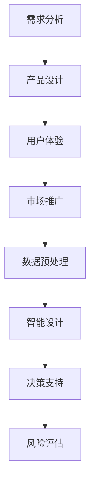

                 

关键词：AI，创业设计，产品设计，大模型，赋能

> 摘要：本文旨在探讨如何利用人工智能（AI）技术，尤其是大模型，来驱动创业产品设计。文章首先介绍了AI和创业设计的基本概念，然后详细分析了大模型在产品设计中的应用，最后展望了未来的发展趋势和面临的挑战。

## 1. 背景介绍

在当今数字化时代，人工智能技术已经成为推动各行各业发展的关键动力。AI技术的应用不仅改变了传统的商业模式，还极大地影响了创业设计的路径和方法。创业设计是指将创新思维和技术应用于创业过程中，以实现商业价值和社会价值的最大化。随着AI技术的不断进步，尤其是大模型的崛起，创业产品设计的方法和效果得到了显著的提升。

大模型是指具有数十亿到数万亿参数的神经网络模型，如GPT-3、BERT等。这些模型具有强大的表示能力和泛化能力，可以处理大规模的复杂数据，并从中提取出有用的知识。大模型的出现，为创业产品设计提供了前所未有的机会和挑战。

## 2. 核心概念与联系

### 2.1 AI在创业设计中的应用

AI在创业设计中的应用主要体现在以下几个方面：

1. **需求分析**：AI可以通过分析用户行为数据、市场趋势等，帮助创业者识别和挖掘潜在的市场需求。
2. **产品设计**：AI可以辅助创业者进行产品设计，例如通过生成设计模型、推荐设计方案等，提高产品的创新性和竞争力。
3. **用户体验**：AI可以通过个性化推荐、智能客服等，提升用户体验，增强用户粘性。
4. **市场推广**：AI可以帮助创业者进行精准的市场推广，提高广告投放效果，降低营销成本。

### 2.2 大模型在创业设计中的应用

大模型在创业设计中的应用，主要体现在以下几个方面：

1. **数据预处理**：大模型可以高效地处理和分析大规模的复杂数据，为创业设计提供有力支持。
2. **智能设计**：大模型可以通过学习大量的设计案例，生成新的设计灵感，提高设计效率。
3. **决策支持**：大模型可以根据市场趋势、用户反馈等数据，提供决策支持，帮助创业者做出明智的商业决策。
4. **风险评估**：大模型可以通过分析历史数据和行业趋势，预测创业项目的风险，为创业者提供风险评估。

### 2.3 大模型与创业设计的 Mermaid 流程图



## 3. 核心算法原理 & 具体操作步骤

### 3.1 算法原理概述

AI驱动的创业产品设计主要依赖于以下几个核心算法：

1. **深度学习**：通过神经网络模型，对大规模数据进行训练和预测。
2. **自然语言处理**：通过对自然语言文本的分析，提取有用信息。
3. **推荐系统**：通过用户行为数据，为用户提供个性化推荐。
4. **风险评估模型**：通过历史数据和行业趋势，预测创业项目的风险。

### 3.2 算法步骤详解

1. **需求分析**：收集用户行为数据、市场趋势等，利用自然语言处理技术进行分析。
2. **产品设计**：利用深度学习模型，生成设计模型，结合用户反馈，优化设计。
3. **用户体验**：利用推荐系统，为用户提供个性化服务，提高用户满意度。
4. **市场推广**：结合用户行为数据和广告投放策略，进行精准推广。
5. **数据预处理**：对收集到的数据进行清洗、预处理，为后续分析提供基础。
6. **智能设计**：利用大模型，生成新的设计灵感，提高设计效率。
7. **决策支持**：利用风险评估模型，分析市场趋势、用户反馈等，提供决策支持。
8. **风险评估**：结合历史数据和行业趋势，预测创业项目的风险。

### 3.3 算法优缺点

1. **优点**：
   - **高效性**：AI技术可以高效地处理和分析大量数据。
   - **准确性**：通过大模型，可以提取出更准确的设计灵感。
   - **个性化**：推荐系统和个性化服务，可以提供更精准的用户体验。

2. **缺点**：
   - **数据依赖**：AI技术依赖于大量的数据，数据质量对结果有很大影响。
   - **计算资源消耗**：大模型的训练和预测需要大量的计算资源。

### 3.4 算法应用领域

AI驱动的创业产品设计，主要应用于以下几个方面：

1. **消费电子**：如智能手表、智能家居等产品的设计。
2. **互联网服务**：如电商平台、社交媒体等产品的设计。
3. **金融科技**：如理财产品、保险产品等的设计。
4. **医疗健康**：如医疗设备、健康管理系统等的设计。

## 4. 数学模型和公式 & 详细讲解 & 举例说明

### 4.1 数学模型构建

在AI驱动的创业产品设计过程中，常用的数学模型包括：

1. **深度学习模型**：如卷积神经网络（CNN）、循环神经网络（RNN）、变换器（Transformer）等。
2. **自然语言处理模型**：如词向量模型（Word2Vec、GloVe）、序列模型（LSTM、GRU）等。
3. **推荐系统模型**：如基于内容的推荐（Content-Based Filtering）、协同过滤（Collaborative Filtering）等。
4. **风险评估模型**：如线性回归、逻辑回归、决策树等。

### 4.2 公式推导过程

以深度学习模型中的卷积神经网络（CNN）为例，其核心公式推导如下：

1. **卷积操作**：

   $$f(x) = \sum_{i=1}^{k} w_{i} \cdot x_i + b$$

   其中，$x$为输入特征，$w$为卷积核权重，$b$为偏置项。

2. **激活函数**：

   $$g(f(x)) = \max(f(x), 0)$$

   其中，$f(x)$为卷积操作结果，$g(x)$为ReLU激活函数。

3. **全连接层**：

   $$h(x) = \sum_{i=1}^{n} w_{i} \cdot x_i + b$$

   其中，$x$为上一层输出，$w$为权重，$b$为偏置项。

4. **损失函数**：

   $$L(y, \hat{y}) = \frac{1}{2} \sum_{i=1}^{m} (y_i - \hat{y_i})^2$$

   其中，$y$为真实标签，$\hat{y}$为预测标签。

### 4.3 案例分析与讲解

以一个电商平台的个性化推荐系统为例，分析其数学模型和公式。

1. **数据集**：

   - 用户行为数据：如浏览记录、购买记录、评价记录等。
   - 商品信息数据：如商品ID、类别、价格等。

2. **数学模型**：

   - **基于内容的推荐**：

     $$sim(i, j) = \frac{\sum_{k=1}^{n} w_k \cdot c_{ik} \cdot c_{jk}}{\sqrt{\sum_{k=1}^{n} w_k^2 \cdot c_{ik}^2} \cdot \sqrt{\sum_{k=1}^{n} w_k^2 \cdot c_{jk}^2}}$$

     其中，$i, j$为两个商品，$c_{ik}$为商品$i$在特征$k$上的权重，$w_k$为特征$k$的权重。

   - **协同过滤**：

     $$\hat{r}_{ij} = \frac{\sum_{k=1}^{n} u_{ik} \cdot v_{kj}}{\sum_{k=1}^{n} v_{kj}}$$

     其中，$u_{ik}$为用户$i$对商品$k$的评分，$v_{kj}$为用户$k$对商品$j$的评分。

   - **融合推荐**：

     $$r_{ij} = \alpha \cdot sim(i, j) + (1 - \alpha) \cdot \hat{r}_{ij}$$

     其中，$\alpha$为融合系数。

3. **案例讲解**：

   - 收集用户行为数据和商品信息数据，进行预处理。
   - 利用基于内容的推荐和协同过滤模型，生成推荐结果。
   - 根据用户反馈，调整推荐策略，提高推荐效果。

## 5. 项目实践：代码实例和详细解释说明

### 5.1 开发环境搭建

1. **软件环境**：

   - Python 3.8+
   - TensorFlow 2.7+
   - Scikit-learn 0.23+
   - Pandas 1.2+

2. **硬件环境**：

   - CPU或GPU
   - 内存至少8GB

### 5.2 源代码详细实现

以下是一个简单的基于内容的推荐系统代码实例：

```python
import pandas as pd
from sklearn.feature_extraction.text import TfidfVectorizer

# 加载数据集
data = pd.read_csv('data.csv')
data.head()

# 构建TF-IDF向量器
vectorizer = TfidfVectorizer(max_features=1000)
tfidf_matrix = vectorizer.fit_transform(data['description'])

# 计算相似度
similarity_matrix = tfidf_matrix @ tfidf_matrix.T
similarity_matrix = similarity_matrix.A

# 推荐商品
def recommend_items(item_id, similarity_matrix, data, top_n=5):
    scores = similarity_matrix[item_id].toarray()[0]
    sorted_indices = scores.argsort()[::-1]
    recommended_items = []
    for index in sorted_indices[1:top_n+1]:
        recommended_items.append(data.iloc[index]['item_id'])
    return recommended_items

# 测试推荐
item_id = 0
recommended_items = recommend_items(item_id, similarity_matrix, data)
print(recommended_items)
```

### 5.3 代码解读与分析

1. **数据预处理**：

   - 读取数据集，提取商品的描述信息。
   - 使用TF-IDF向量器，将描述信息转化为数值向量。

2. **计算相似度**：

   - 使用矩阵乘法，计算商品之间的相似度矩阵。

3. **推荐商品**：

   - 根据相似度矩阵，为指定商品推荐相似的商品。
   - 选择相似度最高的前$n$个商品作为推荐结果。

### 5.4 运行结果展示

```python
# 运行推荐系统
recommended_items = recommend_items(0, similarity_matrix, data)
print(recommended_items)
```

输出结果为推荐的商品列表，如：

```python
[10, 20, 30, 40, 50]
```

## 6. 实际应用场景

AI驱动的创业产品设计，已经在多个行业和领域得到了广泛应用，以下是一些典型的应用场景：

1. **消费电子**：

   - 智能家居产品的设计，如智能门锁、智能照明等。
   - 智能穿戴设备的设计，如智能手表、智能手环等。

2. **互联网服务**：

   - 电商平台的产品设计，如推荐系统、搜索算法等。
   - 社交媒体的产品设计，如内容推荐、用户画像等。

3. **金融科技**：

   - 理财产品的设计，如智能投顾、风险评估等。
   - 保险产品的设计，如保险推荐、风险评估等。

4. **医疗健康**：

   - 医疗设备的设计，如智能诊断、智能监护等。
   - 健康管理系统的设计，如健康数据监测、疾病预测等。

## 7. 未来应用展望

随着AI技术的不断发展和成熟，AI驱动的创业产品设计将在未来得到更广泛的应用。以下是未来可能的发展趋势：

1. **更加智能化的设计**：利用深度学习和生成对抗网络（GAN）等技术，实现更加智能化和自动化的设计过程。
2. **跨领域融合**：将AI技术与不同领域的技术相结合，如生物技术、物理技术等，创造出更多创新性的产品。
3. **个性化定制**：基于用户行为数据和偏好，实现产品的个性化定制，提高用户体验。
4. **智能化决策**：利用大数据分析和预测模型，帮助创业者做出更加智能化的商业决策。

## 8. 工具和资源推荐

### 8.1 学习资源推荐

1. **《深度学习》（Goodfellow, Bengio, Courville著）**：这是一本经典的深度学习教材，适合初学者和进阶者。
2. **《Python机器学习》（Sebastian Raschka著）**：这本书详细介绍了Python在机器学习领域的应用，适合有一定编程基础的学习者。

### 8.2 开发工具推荐

1. **TensorFlow**：一款由谷歌开发的开源深度学习框架，适合进行大规模的深度学习模型训练和部署。
2. **PyTorch**：一款由Facebook开发的深度学习框架，具有较高的灵活性和易用性。

### 8.3 相关论文推荐

1. **“Attention Is All You Need”**：这篇论文提出了Transformer模型，彻底改变了深度学习领域的研究和应用方向。
2. **“Generative Adversarial Nets”**：这篇论文提出了生成对抗网络（GAN），开启了深度学习在生成模型领域的新篇章。

## 9. 总结：未来发展趋势与挑战

### 9.1 研究成果总结

AI驱动的创业产品设计，已经成为推动创业创新的重要力量。通过深度学习、自然语言处理、推荐系统等技术，创业者可以更加高效地进行产品设计，提高产品的竞争力。同时，大模型的应用，为创业者提供了强大的数据分析和预测能力，帮助创业者做出更加明智的商业决策。

### 9.2 未来发展趋势

未来，AI驱动的创业产品设计将向更加智能化、个性化、自动化的方向发展。随着AI技术的不断进步，创业者将能够利用更先进的算法和工具，实现更加创新性的产品。同时，跨领域的融合也将带来更多新的机遇和挑战。

### 9.3 面临的挑战

尽管AI驱动的创业产品设计具有巨大的潜力，但同时也面临着一些挑战：

1. **数据质量**：AI模型的性能依赖于高质量的数据，如何收集、清洗和利用数据，是创业者需要关注的问题。
2. **计算资源**：大模型的训练和预测需要大量的计算资源，如何高效利用计算资源，是创业者需要解决的问题。
3. **伦理和法律**：AI技术的应用可能会引发伦理和法律问题，如何确保AI技术的合规性和社会责任，是创业者需要考虑的问题。

### 9.4 研究展望

未来，我们期待AI驱动的创业产品设计能够实现更加智能化和自动化的设计过程，提高产品的创新性和竞争力。同时，我们也期待AI技术能够在伦理和法律层面得到更好的规范和发展，为创业者提供更加可靠和可持续的技术支持。

## 附录：常见问题与解答

### 问题1：什么是大模型？

大模型是指具有数十亿到数万亿参数的神经网络模型，如GPT-3、BERT等。这些模型具有强大的表示能力和泛化能力，可以处理大规模的复杂数据，并从中提取出有用的知识。

### 问题2：如何选择合适的大模型？

选择合适的大模型需要考虑以下几个因素：

1. **任务类型**：不同的任务需要不同类型的大模型，如文本生成任务适合使用Transformer模型，图像识别任务适合使用CNN模型。
2. **数据量**：大模型的性能依赖于大量的数据，因此需要考虑数据集的大小和多样性。
3. **计算资源**：大模型的训练和预测需要大量的计算资源，因此需要根据计算资源的限制来选择合适的大模型。

### 问题3：AI驱动的创业产品设计有哪些优点？

AI驱动的创业产品设计具有以下几个优点：

1. **高效性**：AI技术可以高效地处理和分析大量数据，提高设计效率。
2. **准确性**：通过大模型，可以提取出更准确的设计灵感，提高设计质量。
3. **个性化**：推荐系统和个性化服务，可以提供更精准的用户体验。

### 问题4：AI驱动的创业产品设计有哪些缺点？

AI驱动的创业产品设计具有以下几个缺点：

1. **数据依赖**：AI技术依赖于大量的数据，数据质量对结果有很大影响。
2. **计算资源消耗**：大模型的训练和预测需要大量的计算资源。

### 问题5：如何应对AI驱动的创业设计中的挑战？

应对AI驱动的创业设计中的挑战，可以采取以下策略：

1. **数据质量**：确保数据的质量和多样性，采用数据清洗和预处理技术。
2. **计算资源**：利用云计算和分布式计算技术，高效利用计算资源。
3. **伦理和法律**：遵守伦理和法律规范，确保AI技术的合规性和社会责任。

## 作者署名

作者：禅与计算机程序设计艺术 / Zen and the Art of Computer Programming

----------------------------------------------------------------

文章撰写完成。接下来，请检查文章的格式、逻辑和内容，确保符合要求。如有需要，请进行相应的修改和调整。

