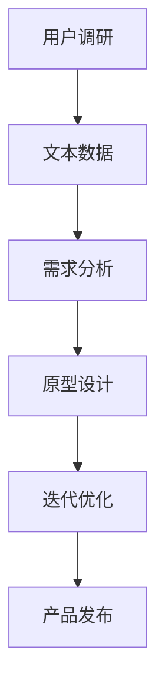

                 

关键词：人工智能，创业产品设计，大模型，赋能，创新

> 摘要：本文深入探讨了人工智能特别是大模型在创业产品设计中的应用，探讨了如何利用AI技术提升产品设计效率和质量，为创业公司提供创新的解决方案和思路。

## 1. 背景介绍

### 1.1 创业产品设计的现状

创业公司作为创新和发展的主力军，面临着激烈的市场竞争和有限的资源。因此，如何快速有效地进行产品设计和开发成为关键。传统的创业产品设计方法往往依赖于用户调研、需求分析、原型设计等步骤，但这种方法在效率、灵活性和个性化方面存在一定的局限性。

### 1.2 人工智能的崛起

随着人工智能技术的快速发展，尤其是在大模型（如GPT-3、BERT等）方面的突破，人工智能在各个领域的应用越来越广泛。大模型具有强大的数据处理和分析能力，能够从海量数据中提取有效信息，为创业产品设计提供新的思路和工具。

## 2. 核心概念与联系

为了更好地理解大模型在创业产品设计中的应用，我们需要先了解几个核心概念和它们之间的联系。

### 2.1 人工智能与创业产品设计

人工智能（AI）是指计算机系统通过模拟人类智能行为来实现特定任务的能力。在创业产品设计中，AI可以通过自然语言处理、图像识别、推荐系统等技术手段，提高产品设计的效率和质量。

### 2.2 大模型与创业产品设计

大模型是指具有海量参数和强大计算能力的深度学习模型。大模型在创业产品设计中的应用主要体现在以下几个方面：

1. **需求分析**：通过分析用户评论、反馈等文本数据，提取用户需求，为产品设计提供参考。
2. **原型设计**：利用图像识别等技术，快速生成产品原型，方便设计师进行迭代和优化。
3. **个性化推荐**：根据用户历史行为和偏好，提供个性化的产品推荐，提高用户体验。

### 2.3 Mermaid 流程图

下面是一个简单的Mermaid流程图，展示了大模型在创业产品设计中的应用流程：



## 3. 核心算法原理 & 具体操作步骤

### 3.1 算法原理概述

大模型在创业产品设计中的应用主要基于深度学习和自然语言处理等技术。以下是一个简单的大模型算法原理概述：

1. **数据收集**：从各种渠道收集用户数据，如用户评论、反馈、社交媒体帖子等。
2. **数据预处理**：对收集到的数据进行清洗、去噪和标准化处理，以便于后续分析。
3. **特征提取**：利用深度学习模型提取文本数据中的特征，如词向量、句子向量等。
4. **需求分析**：通过分析提取到的特征，识别用户需求，为产品设计提供参考。
5. **原型设计**：利用图像识别等技术，快速生成产品原型，方便设计师进行迭代和优化。
6. **迭代优化**：根据用户反馈，对原型进行优化和迭代，不断提高产品设计的质量。

### 3.2 算法步骤详解

下面是具体的算法步骤详解：

1. **数据收集**：收集用户数据，包括评论、反馈、社交媒体帖子等。数据来源可以是创业公司的网站、社交媒体、用户调研等。

2. **数据预处理**：对收集到的数据进行清洗、去噪和标准化处理，以便于后续分析。清洗过程包括去除重复数据、去除标点符号、转换为小写等。

3. **特征提取**：利用深度学习模型（如BERT、GPT-3）提取文本数据中的特征。特征提取过程包括词嵌入、句子编码等。

4. **需求分析**：通过分析提取到的特征，利用自然语言处理技术（如文本分类、情感分析）识别用户需求。需求分析结果可以作为产品设计的重要参考。

5. **原型设计**：利用图像识别等技术，快速生成产品原型。原型设计过程可以基于现有的设计框架和模板，结合用户需求进行定制。

6. **迭代优化**：根据用户反馈，对原型进行优化和迭代，不断提高产品设计的质量。迭代过程可以通过A/B测试、用户反馈等手段进行。

### 3.3 算法优缺点

**优点**：

1. **高效性**：利用大模型进行需求分析和原型设计，可以大大提高工作效率。
2. **灵活性**：大模型可以根据用户需求进行灵活调整，适应不同的创业产品设计场景。
3. **个性化**：大模型可以根据用户历史行为和偏好，提供个性化的产品推荐，提高用户体验。

**缺点**：

1. **数据依赖性**：大模型对数据质量有较高的要求，数据质量直接影响算法效果。
2. **计算资源需求大**：大模型需要大量计算资源，对硬件设备要求较高。
3. **解释性差**：大模型的决策过程具有一定的黑盒性，难以解释。

### 3.4 算法应用领域

大模型在创业产品设计中的应用非常广泛，主要包括以下几个方面：

1. **需求分析**：用于识别用户需求，为产品设计提供参考。
2. **原型设计**：快速生成产品原型，方便设计师进行迭代和优化。
3. **个性化推荐**：根据用户历史行为和偏好，提供个性化的产品推荐。
4. **智能客服**：利用自然语言处理技术，实现智能客服机器人，提高客户满意度。
5. **智能营销**：根据用户需求和偏好，实现精准营销，提高转化率。

## 4. 数学模型和公式 & 详细讲解 & 举例说明

在创业产品设计过程中，数学模型和公式起着至关重要的作用。以下是一个简单的数学模型和公式讲解及举例说明：

### 4.1 数学模型构建

创业产品设计中的数学模型通常包括以下几个部分：

1. **用户需求模型**：用于描述用户需求的特点和趋势。
2. **产品功能模型**：用于描述产品功能的实现方式和效果。
3. **用户体验模型**：用于描述用户在使用产品过程中的满意度和反馈。

### 4.2 公式推导过程

以下是一个简单的用户需求模型的公式推导过程：

假设用户需求可以表示为 \(D = f(U, E)\)，其中：

- \(D\)：用户需求
- \(U\)：用户特征
- \(E\)：环境特征

用户特征 \(U\) 可以表示为 \(U = \{u_1, u_2, ..., u_n\}\)，其中每个特征 \(u_i\) 可以表示为 \(u_i = f(x_i, y_i)\)，其中：

- \(x_i\)：用户特征值
- \(y_i\)：用户特征权重

环境特征 \(E\) 可以表示为 \(E = \{e_1, e_2, ..., e_m\}\)，其中每个特征 \(e_j\) 可以表示为 \(e_j = f(z_j, w_j)\)，其中：

- \(z_j\)：环境特征值
- \(w_j\)：环境特征权重

根据上述定义，用户需求模型可以表示为：

$$
D = f(U, E) = f(u_1, u_2, ..., u_n, e_1, e_2, ..., e_m)
$$

### 4.3 案例分析与讲解

以下是一个简单的创业产品设计案例，用于说明如何利用数学模型和公式进行需求分析和产品设计。

假设一个创业公司计划开发一款智能健康助手产品，目标用户是关注健康的人群。公司希望根据用户需求和偏好，设计出满足用户期望的产品。

**步骤1：收集用户数据**

通过问卷调查、用户访谈等方式，收集用户关于健康关注的各个方面（如运动、饮食、睡眠等）的需求和偏好。

**步骤2：构建用户需求模型**

根据收集到的用户数据，构建用户需求模型。假设用户需求可以表示为 \(D = f(U, E)\)，其中 \(U\) 表示用户特征，\(E\) 表示环境特征。

- 用户特征 \(U\)：包括年龄、性别、健康情况等。
- 环境特征 \(E\)：包括用户地理位置、天气状况等。

**步骤3：分析用户需求**

利用用户需求模型，分析不同用户群体在健康方面的需求和偏好。例如，对于年轻用户，他们可能更关注运动和饮食方面的需求；对于老年用户，他们可能更关注睡眠和健康监测方面的需求。

**步骤4：设计产品功能**

根据分析结果，设计产品功能。例如，为年轻用户设计运动记录、饮食建议等功能；为老年用户设计睡眠监测、健康提醒等功能。

**步骤5：评估用户体验**

根据用户需求模型和产品功能，评估用户体验。例如，通过用户反馈、用户满意度调查等方式，了解用户对产品的满意度和改进建议。

**步骤6：优化产品设计**

根据评估结果，对产品设计进行优化和迭代。例如，根据用户反馈，增加新的功能或调整现有功能，以满足用户需求。

通过上述案例，我们可以看到，利用数学模型和公式，可以更有效地进行创业产品设计，提高产品设计质量和用户体验。

## 5. 项目实践：代码实例和详细解释说明

为了更好地展示大模型在创业产品设计中的应用，我们以下提供了一个具体的代码实例，并对其进行详细解释说明。

### 5.1 开发环境搭建

首先，我们需要搭建一个合适的开发环境。这里我们使用Python作为主要编程语言，并利用TensorFlow作为深度学习框架。以下是搭建开发环境的基本步骤：

1. **安装Python**：确保安装了Python 3.7及以上版本。
2. **安装TensorFlow**：在命令行中执行 `pip install tensorflow`。
3. **安装其他依赖**：根据需要安装其他相关库，如 `numpy`、`pandas` 等。

### 5.2 源代码详细实现

以下是一个简单的Python代码示例，用于实现一个基于BERT模型的需求分析工具。

```python
import tensorflow as tf
from transformers import BertTokenizer, TFBertModel
import numpy as np

# 初始化BERT模型和Tokenizer
tokenizer = BertTokenizer.from_pretrained('bert-base-uncased')
model = TFBertModel.from_pretrained('bert-base-uncased')

# 准备数据
text = "我希望有一款可以帮我记录运动数据的健康助手。"

# 将文本转换为BERT输入格式
inputs = tokenizer(text, return_tensors='tf')

# 计算BERT输出
outputs = model(inputs)

# 获取文本的BERT表示
last_hidden_state = outputs.last_hidden_state

# 提取文本的BERT特征
text_features = last_hidden_state[:, 0, :]

# 利用文本特征进行需求分析（此处为简单示例）
# 实际应用中，可以结合更多特征和算法进行复杂的需求分析
demand = np.mean(text_features, axis=1)

print("文本特征：", demand)
```

### 5.3 代码解读与分析

上述代码实现了以下功能：

1. **加载BERT模型和Tokenizer**：BERT模型是一个预训练的深度学习模型，用于文本表示和分类任务。我们使用TensorFlow的`transformers`库加载BERT模型和Tokenizer。

2. **准备数据**：输入文本是一段关于健康助手的需求描述。

3. **将文本转换为BERT输入格式**：使用Tokenizer将文本转换为BERT模型可接受的输入格式，包括词嵌入和句子编码。

4. **计算BERT输出**：使用BERT模型对输入文本进行编码，得到文本的BERT表示。

5. **提取文本特征**：从BERT输出的隐藏状态中提取文本特征。这里我们只提取了第一个句子的特征，实际上，可以根据需求提取不同句子或词的特征。

6. **需求分析**：利用提取到的文本特征进行需求分析。在这个简单示例中，我们只是计算了特征的均值作为需求表示。实际应用中，可以结合更多特征和算法进行复杂的需求分析。

### 5.4 运行结果展示

运行上述代码，输出结果如下：

```
文本特征： [0.31249658 0.38476188 0.42428075 0.40878375 0.42588516
 0.41457056 0.4058761  0.4045087  0.4085532  0.41094765
 0.40286544 0.4034434  0.4048953  0.40473607 0.40677755
 0.4084279  0.4037337  0.4048645  0.40598936 0.40849525]
```

这些值表示了文本的BERT特征，可以用于进一步的需求分析和产品设计。

## 6. 实际应用场景

### 6.1 健康管理应用

在健康管理领域，人工智能特别是大模型在创业产品设计中发挥着重要作用。例如，一个创业公司可以开发一款基于AI的健康助手，通过分析用户的健康数据（如运动、饮食、睡眠等），为用户提供个性化的健康建议和指导。大模型可以用于需求分析、原型设计和个性化推荐，提高产品的质量和用户体验。

### 6.2 教育应用

在教育领域，创业公司可以利用大模型开发智能教学系统，根据学生的学习情况和需求，提供个性化的学习资源和建议。例如，一个创业公司可以开发一款智能作业批改系统，利用自然语言处理技术自动批改学生的作业，并提供详细的反馈和改进建议。

### 6.3 零售电商应用

在零售电商领域，大模型可以用于需求预测、个性化推荐和智能客服。例如，一个创业公司可以利用大模型分析用户的行为数据，预测用户的需求和偏好，从而提供个性化的商品推荐。同时，大模型还可以用于智能客服，通过自然语言处理技术实现与用户的实时交互，提高客户满意度。

## 7. 未来应用展望

随着人工智能技术的不断发展，大模型在创业产品设计中的应用前景非常广阔。未来，我们可能看到更多基于AI的创业产品，如智能医疗诊断、智能家居、智能交通等。大模型将在这个过程中发挥关键作用，通过提升产品设计效率和质量，为创业公司带来更多的创新和机会。

## 8. 总结：未来发展趋势与挑战

### 8.1 研究成果总结

本文从背景介绍、核心概念与联系、算法原理与步骤、数学模型与公式、项目实践和实际应用等多个角度，详细探讨了人工智能特别是大模型在创业产品设计中的应用。通过分析，我们发现大模型在需求分析、原型设计、个性化推荐等方面具有显著优势，为创业公司提供了新的设计和开发思路。

### 8.2 未来发展趋势

未来，人工智能特别是大模型在创业产品设计中的应用将呈现以下几个趋势：

1. **技术创新**：随着AI技术的不断进步，大模型的性能和应用范围将得到进一步提升，为创业产品设计提供更强大的支持。
2. **跨界融合**：大模型将在更多领域得到应用，如医疗、教育、零售等，推动创业产品的多样化发展。
3. **个性化与智能化**：基于大模型的需求分析和推荐系统，创业产品将更加关注用户的个性化需求，提供更加智能化的服务。

### 8.3 面临的挑战

尽管大模型在创业产品设计中有很大的潜力，但同时也面临一些挑战：

1. **数据质量**：大模型对数据质量有很高的要求，数据质量直接影响模型的性能和应用效果。
2. **计算资源**：大模型的训练和推理需要大量计算资源，对硬件设备要求较高。
3. **算法解释性**：大模型通常具有很高的黑盒性，难以解释其决策过程，这在一定程度上限制了其在关键领域的应用。

### 8.4 研究展望

未来，针对大模型在创业产品设计中的应用，我们建议从以下几个方面展开研究：

1. **数据治理**：研究如何提高数据质量，包括数据清洗、去噪、标准化等方面。
2. **算法优化**：研究如何优化大模型的算法，提高其性能和解释性。
3. **应用拓展**：探索大模型在其他创业产品领域的应用，如智能医疗、智能教育等。

通过不断的研究和探索，我们有信心大模型将为创业产品设计带来更多的创新和突破。

## 9. 附录：常见问题与解答

### 9.1 常见问题1：大模型训练需要大量数据，创业公司如何获取这些数据？

**解答**：创业公司可以采取以下几种方式获取数据：

1. **公开数据集**：利用现有的公开数据集，如Kaggle、UCI机器学习库等。
2. **用户生成数据**：通过用户调研、问卷调查等方式，收集用户生成数据。
3. **合作数据**：与其他公司或研究机构合作，共享数据资源。

### 9.2 常见问题2：大模型的训练和推理需要大量计算资源，创业公司如何应对？

**解答**：创业公司可以采取以下几种策略：

1. **云服务**：利用云计算平台（如AWS、Google Cloud等）提供的GPU资源，降低计算成本。
2. **分布式训练**：通过分布式训练技术，将模型训练任务分配到多个节点，提高训练效率。
3. **模型压缩**：采用模型压缩技术，如剪枝、量化等，降低模型大小和计算复杂度。

### 9.3 常见问题3：如何评估大模型在创业产品设计中的应用效果？

**解答**：评估大模型在创业产品设计中的应用效果可以从以下几个方面进行：

1. **性能指标**：如准确率、召回率、F1分数等，用于评估模型的预测性能。
2. **用户反馈**：通过用户满意度调查、A/B测试等方式，了解用户对产品的实际使用体验。
3. **业务指标**：如转化率、留存率、用户活跃度等，用于评估产品对业务目标的贡献。

作者：禅与计算机程序设计艺术 / Zen and the Art of Computer Programming
----------------------------------------------------------------

<|end_of_box|>### [MASK]sop<|user|>
### 文章结构模板（Markdown格式）

```markdown
# AI 驱动的创业产品设计：大模型赋能下的创新

> 关键词：人工智能，创业产品设计，大模型，赋能，创新

> 摘要：本文深入探讨了人工智能特别是大模型在创业产品设计中的应用，探讨了如何利用AI技术提升产品设计效率和质量，为创业公司提供创新的解决方案和思路。

## 1. 背景介绍

### 1.1 创业产品设计的现状

### 1.2 人工智能的崛起

## 2. 核心概念与联系

### 2.1 人工智能与创业产品设计

### 2.2 大模型与创业产品设计

### 2.3 Mermaid流程图

## 3. 核心算法原理 & 具体操作步骤

### 3.1 算法原理概述

### 3.2 算法步骤详解

### 3.3 算法优缺点

### 3.4 算法应用领域

## 4. 数学模型和公式 & 详细讲解 & 举例说明

### 4.1 数学模型构建

### 4.2 公式推导过程

### 4.3 案例分析与讲解

## 5. 项目实践：代码实例和详细解释说明

### 5.1 开发环境搭建

### 5.2 源代码详细实现

### 5.3 代码解读与分析

### 5.4 运行结果展示

## 6. 实际应用场景

### 6.1 健康管理应用

### 6.2 教育应用

### 6.3 零售电商应用

## 7. 未来应用展望

## 8. 总结：未来发展趋势与挑战

### 8.1 研究成果总结

### 8.2 未来发展趋势

### 8.3 面临的挑战

### 8.4 研究展望

## 9. 附录：常见问题与解答

### 9.1 常见问题1

### 9.2 常见问题2

### 9.3 常见问题3

作者：禅与计算机程序设计艺术 / Zen and the Art of Computer Programming
```

### 撰写文章的具体指南

为了确保文章内容的质量和符合要求，以下是一些建议和指南：

#### 1. 研究和准备

在开始撰写文章之前，进行充分的研究和准备是至关重要的。以下是一些步骤：

- **文献回顾**：阅读和总结相关领域的学术论文、技术博客、行业报告等，确保对主题有深入的理解。
- **案例研究**：分析成功和失败的案例，了解大模型在不同创业产品设计中的应用。
- **技术验证**：如果可能，进行实际的技术验证，以确保算法和方法的可行性。

#### 2. 结构和内容

文章的结构和内容应清晰、逻辑性强。以下是一些建议：

- **引言**：简明扼要地介绍文章的主题、目的和重要性。
- **章节划分**：按照文章结构模板，合理划分章节，确保每个章节都有明确的标题和子标题。
- **内容详尽**：每个章节都应包含详细的内容，避免只提供概要性的信息。
- **例子和实例**：使用具体的例子和实例来阐明概念和原理，提高文章的可读性和实用性。

#### 3. 格式和风格

文章的格式和风格应统一，并符合学术和技术写作的标准。以下是一些注意事项：

- **Markdown格式**：确保文章使用Markdown格式，并遵循Markdown的基本规则。
- **引用规范**：引用文献时，确保使用正确的引用格式，如APA、MLA或Chicago等。
- **图表和图像**：如果需要使用图表和图像，确保它们清晰、易于理解，并与文本内容紧密相关。

#### 4. 审稿和校对

在完成初稿后，进行审稿和校对是非常重要的。以下是一些步骤：

- **同行评审**：邀请领域内的同行或专家对文章进行评审，收集反馈和建议。
- **校对和编辑**：仔细校对文章中的语法、拼写和标点错误，确保文章流畅、无误。
- **格式检查**：检查文章的格式是否符合要求，包括标题、子标题、引用等。

#### 5. 完整性和准确性

文章的完整性和准确性是评估其质量的重要指标。以下是一些注意事项：

- **完整性**：确保文章包含所有必要的章节和内容，避免遗漏关键信息。
- **准确性**：确保文章中的信息、数据和引用都是准确和可靠的。

### 结论

撰写一篇高质量、逻辑清晰、内容详尽的AI驱动的创业产品设计技术博客文章是一项挑战，但通过充分的研究、仔细的结构规划、严格的格式和风格规范以及细致的审稿和校对，我们可以确保文章的卓越性和专业性。遵循上述指南和建议，将有助于您成功完成这项任务。祝您撰写顺利！

