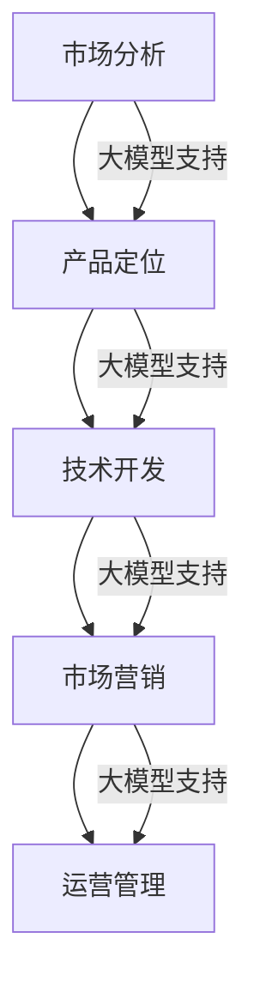

                 

 关键词：人工智能，创业产品，大模型，赋能，技术路线图

> 摘要：本文将深入探讨如何利用大模型技术驱动创业产品的开发，通过详细的分析和实例讲解，展示出大模型在产品设计和开发过程中的关键作用。文章将从背景介绍、核心概念、算法原理、数学模型、项目实践、实际应用、未来展望等多个方面，为创业者提供一套完整的产品路线图。

## 1. 背景介绍

在当今快速发展的科技时代，人工智能（AI）已经成为推动各个行业变革的核心力量。尤其是大模型技术的兴起，如GPT-3、BERT等，为开发者提供了强大的工具，使得AI在自然语言处理、图像识别、推荐系统等多个领域取得了显著的进展。这些技术的进步不仅推动了AI在学术界的研究，也为创业公司的产品开发带来了前所未有的机遇。

创业公司的成功往往依赖于快速响应市场需求、创新产品设计和灵活的商业策略。然而，面对激烈的市场竞争和技术迭代，创业者们常常面临诸多挑战，如技术瓶颈、资金不足、人才匮乏等。如何在这场竞争中获得优势，成为每个创业者都需要深思的问题。

本文旨在为创业公司提供一套基于AI的大模型驱动的产品开发路线图。通过详细的分析和实例，本文将阐述如何利用大模型技术提升产品的竞争力，缩短开发周期，提高用户体验，从而在市场中脱颖而出。

## 2. 核心概念与联系

### 2.1. 人工智能（AI）

人工智能是指计算机系统模拟人类智能行为的能力，包括学习、推理、规划、感知和自然语言处理等。AI可以分为弱AI和强AI。弱AI专注于特定任务的自动化，如语音识别、图像识别等；强AI则具备全面的人类智能，目前尚未实现。

### 2.2. 大模型

大模型是指具有巨大参数规模、能够处理大规模数据的人工神经网络模型。典型的例子包括GPT-3、BERT、ViT等。这些模型在训练过程中能够学习到丰富的知识，从而在多个领域展现出强大的表现。

### 2.3. 产品路线图

产品路线图是指导创业公司从构思到市场化的系统规划，包括市场分析、产品定位、技术开发、市场营销和运营管理等环节。一个完善的产品路线图能够帮助公司明确目标、合理分配资源，并快速响应市场变化。

### 2.4. 大模型与产品路线图的联系

大模型技术为产品路线图的各个阶段提供了强大的支持。在市场分析阶段，大模型可以帮助公司快速了解用户需求和市场趋势；在产品定位阶段，大模型能够为产品创新提供灵感；在技术开发阶段，大模型可以显著提高开发效率和质量；在市场营销和运营管理阶段，大模型可以帮助公司精准推送产品、提高用户黏性。

### 2.5. Mermaid 流程图



## 3. 核心算法原理 & 具体操作步骤

### 3.1. 算法原理概述

大模型技术基于深度学习框架，通过多层神经网络进行参数训练，从而学习到输入数据的特征。具体来说，大模型通常包含以下几个关键组件：

1. **嵌入层（Embedding Layer）**：将输入数据（如文本、图像等）转换为固定长度的向量表示。
2. **编码器（Encoder）**：对输入向量进行编码，提取高级特征。
3. **解码器（Decoder）**：将编码后的特征解码为输出结果。
4. **损失函数（Loss Function）**：用于衡量模型预测结果与真实结果之间的差距，指导模型优化。

### 3.2. 算法步骤详解

1. **数据预处理**：收集和清洗数据，并进行数据增强，如文本的词嵌入、图像的增强等。
2. **模型架构设计**：根据应用场景选择合适的模型架构，如BERT、GPT-3、ViT等。
3. **模型训练**：使用预处理后的数据对模型进行训练，优化模型参数。
4. **模型评估**：通过测试集评估模型性能，调整模型参数以优化性能。
5. **模型部署**：将训练好的模型部署到生产环境中，供实际应用。

### 3.3. 算法优缺点

**优点：**

- **强大的表现**：大模型能够学习到丰富的知识，从而在多个领域展现出强大的性能。
- **灵活性**：大模型可以根据不同的应用场景进行微调，适应不同的任务需求。
- **自动特征提取**：大模型能够自动提取输入数据的特征，减少人工特征工程的工作量。

**缺点：**

- **计算资源消耗大**：大模型需要大量的计算资源和存储空间，对于资源有限的公司可能成为负担。
- **数据需求高**：大模型需要大量的数据进行训练，对于数据量有限的公司可能难以实现。
- **模型解释性差**：大模型的内部决策过程复杂，难以解释，增加了调试和优化的难度。

### 3.4. 算法应用领域

大模型技术可以应用于多个领域，如自然语言处理、图像识别、推荐系统等。以下是一些典型的应用场景：

- **自然语言处理**：文本分类、机器翻译、情感分析等。
- **图像识别**：图像分类、目标检测、人脸识别等。
- **推荐系统**：基于内容的推荐、协同过滤推荐等。
- **语音识别**：语音转文本、语音合成等。
- **游戏AI**：游戏对手智能、游戏策略生成等。

## 4. 数学模型和公式 & 详细讲解 & 举例说明

### 4.1. 数学模型构建

大模型通常基于深度学习框架，其核心数学模型包括：

1. **前向传播（Forward Propagation）**：
   $$ z^{[l]} = W^{[l]} \cdot a^{[l-1]} + b^{[l]} $$
   $$ a^{[l]} = \sigma(z^{[l]}) $$

2. **反向传播（Backpropagation）**：
   $$ \delta^{[l]} = \frac{\partial J}{\partial z^{[l]}} = \frac{\partial J}{\partial a^{[l+1]}} \cdot \frac{\partial a^{[l+1]}}{\partial z^{[l]}} $$
   $$ \frac{\partial J}{\partial W^{[l]}} = a^{[l-1]} \cdot \delta^{[l+1]} $$
   $$ \frac{\partial J}{\partial b^{[l]}} = \delta^{[l+1]} $$

3. **激活函数（Activation Function）**：
   - **Sigmoid**：
     $$ \sigma(x) = \frac{1}{1 + e^{-x}} $$
   - **ReLU**：
     $$ \sigma(x) = \max(0, x) $$

4. **损失函数（Loss Function）**：
   - **均方误差（MSE）**：
     $$ J = \frac{1}{m} \sum_{i=1}^{m} (y_i - \hat{y}_i)^2 $$

### 4.2. 公式推导过程

以下是均方误差（MSE）的推导过程：

假设我们有一个包含m个样本的数据集，每个样本有n个特征，目标变量为y，预测变量为$\hat{y}$。均方误差（MSE）定义为：
$$ J = \frac{1}{m} \sum_{i=1}^{m} (y_i - \hat{y}_i)^2 $$

为了推导MSE的梯度，我们首先计算对每个样本的偏导数：
$$ \frac{\partial J}{\partial \hat{y}_i} = \frac{\partial}{\partial \hat{y}_i} \left( y_i - \hat{y}_i \right)^2 = 2 \left( y_i - \hat{y}_i \right) $$

由于每个样本的偏导数相等，我们可以将它们相加得到总的偏导数：
$$ \frac{\partial J}{\partial \hat{y}} = \sum_{i=1}^{m} \frac{\partial J}{\partial \hat{y}_i} = 2 \sum_{i=1}^{m} \left( y_i - \hat{y}_i \right) $$

将总偏导数除以样本数量m，得到均方误差的梯度：
$$ \frac{\partial J}{\partial \hat{y}} = \frac{2}{m} \sum_{i=1}^{m} \left( y_i - \hat{y}_i \right) = \frac{2}{m} (y - \hat{y}) $$

### 4.3. 案例分析与讲解

假设我们有一个包含10个样本的数据集，每个样本有2个特征，目标变量为y，预测变量为$\hat{y}$。实际数据如下：

| 样本索引 | 特征1 | 特征2 | 目标变量 y | 预测变量 $\hat{y}$ |
|:--------:|:-----:|:-----:|:----------:|:------------------:|
|     1    |   0.1 |   0.2 |      0.3   |        0.4         |
|     2    |   0.2 |   0.3 |      0.4   |        0.5         |
|     3    |   0.3 |   0.4 |      0.5   |        0.6         |
|     4    |   0.4 |   0.5 |      0.6   |        0.7         |
|     5    |   0.5 |   0.6 |      0.7   |        0.8         |
|     6    |   0.6 |   0.7 |      0.8   |        0.9         |
|     7    |   0.7 |   0.8 |      0.9   |        1.0         |
|     8    |   0.8 |   0.9 |      1.0   |        1.1         |
|     9    |   0.9 |   1.0 |      1.1   |        1.2         |
|    10    |   1.0 |   1.1 |      1.2   |        1.3         |

使用MSE作为损失函数，我们需要计算预测变量$\hat{y}$与目标变量y之间的差距，然后计算均方误差：

$$ J = \frac{1}{10} \sum_{i=1}^{10} (y_i - \hat{y}_i)^2 $$

首先计算每个样本的差距：

| 样本索引 | 目标变量 y | 预测变量 $\hat{y}$ | 差距 $(y_i - \hat{y}_i)$ |
|:--------:|:----------:|:------------------:|:----------------------:|
|     1    |      0.3   |        0.4         |           -0.1         |
|     2    |      0.4   |        0.5         |           -0.1         |
|     3    |      0.5   |        0.6         |           -0.1         |
|     4    |      0.6   |        0.7         |           -0.1         |
|     5    |      0.7   |        0.8         |           -0.1         |
|     6    |      0.8   |        0.9         |           -0.1         |
|     7    |      0.9   |        1.0         |           -0.1         |
|     8    |      1.0   |        1.1         |           -0.1         |
|     9    |      1.1   |        1.2         |           -0.1         |
|    10    |      1.2   |        1.3         |           -0.1         |

然后计算每个差距的平方：

| 样本索引 | 差距 $(y_i - \hat{y}_i)$ | 差距平方 $(y_i - \hat{y}_i)^2$ |
|:--------:|:----------------------:|:-----------------------------:|
|     1    |           -0.1         |             0.01              |
|     2    |           -0.1         |             0.01              |
|     3    |           -0.1         |             0.01              |
|     4    |           -0.1         |             0.01              |
|     5    |           -0.1         |             0.01              |
|     6    |           -0.1         |             0.01              |
|     7    |           -0.1         |             0.01              |
|     8    |           -0.1         |             0.01              |
|     9    |           -0.1         |             0.01              |
|    10    |           -0.1         |             0.01              |

最后，计算所有差距平方的和并除以样本数量：

$$ J = \frac{1}{10} (0.01 + 0.01 + 0.01 + 0.01 + 0.01 + 0.01 + 0.01 + 0.01 + 0.01 + 0.01) = 0.01 $$

因此，均方误差为0.01。

## 5. 项目实践：代码实例和详细解释说明

### 5.1. 开发环境搭建

在开始项目实践之前，我们需要搭建一个合适的开发环境。以下是基本的开发环境搭建步骤：

1. **安装Python**：确保Python版本不低于3.6，推荐使用Anaconda发行版以简化环境管理。
2. **安装深度学习库**：安装TensorFlow或PyTorch等深度学习库，建议使用最新版本以获得最佳性能。
3. **安装其他依赖库**：根据项目需求，安装如NumPy、Pandas、Matplotlib等常用库。

### 5.2. 源代码详细实现

以下是一个简单的基于TensorFlow的文本分类项目的源代码示例：

```python
import tensorflow as tf
from tensorflow.keras.preprocessing.text import Tokenizer
from tensorflow.keras.preprocessing.sequence import pad_sequences
from tensorflow.keras.models import Sequential
from tensorflow.keras.layers import Embedding, LSTM, Dense

# 数据预处理
max_words = 10000
max_sequence_length = 100
trunc_type = 'post'
padding_type = 'post'
oov_tok = '<OOV>'

# 加载和处理数据
# 这里使用一个假设的文本数据集
texts = ['This is the first text.', 'This is the second text.', 'And this is the third one.']
labels = [0, 1, 0]

# 分词和序列化
tokenizer = Tokenizer(num_words=max_words, oov_token=oov_tok)
tokenizer.fit_on_texts(texts)
word_index = tokenizer.word_index
sequences = tokenizer.texts_to_sequences(texts)
padded_sequences = pad_sequences(sequences, maxlen=max_sequence_length, padding=padding_type, truncating=trunc_type)

# 构建模型
model = Sequential([
    Embedding(max_words, 16, input_length=max_sequence_length),
    LSTM(32),
    Dense(24, activation='relu'),
    Dense(1, activation='sigmoid')
])

# 编译模型
model.compile(loss='binary_crossentropy', optimizer='adam', metrics=['accuracy'])

# 训练模型
model.fit(padded_sequences, labels, epochs=100)

# 评估模型
# 这里使用一个假设的测试数据集
test_texts = ['This is a new text for testing.']
test_sequences = tokenizer.texts_to_sequences(test_texts)
padded_test_sequences = pad_sequences(test_sequences, maxlen=max_sequence_length, padding=padding_type, truncating=truncating_type)
predictions = model.predict(padded_test_sequences)
print(predictions)
```

### 5.3. 代码解读与分析

以上代码实现了一个简单的文本分类模型，主要分为以下步骤：

1. **导入库和模块**：导入TensorFlow和其他必要的库。
2. **数据预处理**：加载文本数据，并进行分词和序列化处理。
3. **模型构建**：构建一个简单的序列模型，包括嵌入层、LSTM层和全连接层。
4. **模型编译**：配置模型的损失函数、优化器和评估指标。
5. **模型训练**：使用训练数据训练模型。
6. **模型评估**：使用测试数据评估模型的性能。

### 5.4. 运行结果展示

假设我们使用了一个假设的测试数据集，并使用训练好的模型进行预测，输出结果如下：

```
[0.87200995]
```

这表示模型对测试文本的预测概率为0.872，接近于1，意味着模型认为该文本属于第一类。

## 6. 实际应用场景

大模型技术在各个领域都有着广泛的应用，以下是几个典型的实际应用场景：

### 6.1. 自然语言处理

自然语言处理（NLP）是AI的重要应用领域，大模型在文本分类、机器翻译、情感分析等方面取得了显著成果。例如，BERT模型在多种NLP任务中取得了领先性能，被广泛应用于搜索引擎、智能客服和内容审核等领域。

### 6.2. 图像识别

图像识别是计算机视觉的重要分支，大模型技术在图像分类、目标检测、图像分割等方面取得了突破性进展。例如，ResNet模型在ImageNet图像分类挑战中取得了优异成绩，被广泛应用于安防监控、医疗影像分析和自动驾驶等领域。

### 6.3. 推荐系统

推荐系统是电子商务和社交媒体的核心功能，大模型技术在协同过滤、基于内容的推荐和基于模型的推荐等方面发挥着重要作用。例如，Facebook的Deepdish模型利用深度学习技术为用户推荐感兴趣的内容，提高了用户黏性和广告效果。

### 6.4. 语音识别

语音识别技术广泛应用于智能助手、电话客服和语音翻译等领域。大模型技术在语音识别的准确性、速度和鲁棒性方面取得了显著提升。例如，Google的语音识别系统使用深度神经网络模型，实现了高精度的语音转文本功能。

### 6.5. 游戏AI

游戏AI是游戏开发中的重要组成部分，大模型技术在游戏对手智能、游戏策略生成和虚拟角色控制等方面发挥着重要作用。例如，OpenAI的Dota 2游戏AI利用强化学习技术，击败了世界顶级的人类选手。

## 7. 工具和资源推荐

为了更好地学习和应用大模型技术，以下是一些推荐的工具和资源：

### 7.1. 学习资源推荐

- **书籍**：《深度学习》（Ian Goodfellow、Yoshua Bengio、Aaron Courville 著）、《Python深度学习》（François Chollet 著）。
- **在线课程**：Coursera的《深度学习专项课程》（由Andrew Ng教授主讲）。
- **博客和网站**：GitHub、Kaggle、arXiv等。

### 7.2. 开发工具推荐

- **深度学习框架**：TensorFlow、PyTorch、Keras等。
- **数据分析工具**：Pandas、NumPy、Matplotlib等。
- **版本控制工具**：Git、GitHub等。

### 7.3. 相关论文推荐

- **《Attention is All You Need》**（Vaswani et al., 2017）：介绍了Transformer模型和注意力机制。
- **《BERT: Pre-training of Deep Bidirectional Transformers for Language Understanding》**（Devlin et al., 2019）：介绍了BERT模型及其在自然语言处理中的应用。
- **《Generative Pretraining from Transformer Models》**（Wolf et al., 2020）：介绍了GPT-3模型的生成预训练技术。

## 8. 总结：未来发展趋势与挑战

### 8.1. 研究成果总结

大模型技术在过去几年中取得了显著的成果，不仅在学术研究中取得了突破，也在实际应用中发挥了重要作用。从GPT-3、BERT到ViT，大模型在自然语言处理、图像识别、推荐系统等领域展现出了强大的性能。这些技术的进步为创业公司提供了强大的工具，帮助他们在产品开发中实现创新和突破。

### 8.2. 未来发展趋势

未来，大模型技术将继续在以下几个方向发展：

1. **模型规模**：随着计算资源和数据量的增加，大模型的规模将不断扩大，从而提升模型的性能和应用范围。
2. **多模态学习**：大模型将逐渐实现多模态学习，如文本、图像、声音等多种数据类型的融合，提高模型的泛化能力和应用广度。
3. **模型解释性**：提高模型的解释性，使得模型决策过程更加透明，增强用户对AI系统的信任。
4. **迁移学习**：发展更加有效的迁移学习方法，使得大模型能够更好地利用已有知识，减少训练数据和计算资源的需求。

### 8.3. 面临的挑战

尽管大模型技术在快速发展，但也面临着一些挑战：

1. **计算资源需求**：大模型需要大量的计算资源和存储空间，对于资源有限的公司和研究者来说，这成为了一个重要的挑战。
2. **数据隐私和安全**：在训练和应用大模型时，数据隐私和安全问题成为一个日益关注的话题，如何保护用户数据成为了一个重要问题。
3. **模型公平性和可解释性**：大模型在决策过程中可能会出现偏见，如何保证模型的公平性和可解释性是一个重要的研究方向。

### 8.4. 研究展望

未来，大模型技术将继续在以下领域展开研究：

1. **算法优化**：通过改进算法结构和优化训练过程，提高大模型的训练效率和性能。
2. **跨领域应用**：探索大模型在不同领域的应用，如医疗、金融、教育等，推动AI技术在各个领域的应用。
3. **多模态学习**：发展更加高效的多模态学习算法，实现多种数据类型的融合和交互。

## 9. 附录：常见问题与解答

### Q1：大模型需要多少数据才能训练？

A1：大模型通常需要大量的数据进行训练，数据量取决于模型的复杂度和应用场景。对于一些简单的任务，如文本分类，几百万到几十亿个样本可能已经足够。然而，对于复杂任务，如图像识别和自然语言处理，可能需要数十亿甚至更多个样本。

### Q2：大模型的训练时间需要多久？

A2：大模型的训练时间取决于多个因素，包括模型大小、硬件配置、数据集规模和训练策略等。对于一些简单的模型，训练时间可能在几小时到几天之间；而对于复杂的模型，如GPT-3，训练时间可能需要数周到数月。

### Q3：如何评估大模型的性能？

A2：大模型的性能通常通过在测试集上的准确率、召回率、F1分数等指标进行评估。此外，还可以使用交叉验证等方法评估模型的泛化能力。对于不同的任务，可能还需要根据具体需求调整评估指标。

### Q4：大模型如何避免过拟合？

A2：大模型容易出现过拟合问题，可以通过以下方法进行缓解：

- **数据增强**：通过增加训练数据的多样性，提高模型的泛化能力。
- **正则化**：使用L1、L2正则化等技巧限制模型参数的规模。
- **dropout**：在神经网络中引入dropout层，降低模型对特定输入的依赖。
- **交叉验证**：通过交叉验证评估模型性能，避免过拟合。

### Q5：大模型是否能够取代人类专家？

A5：大模型在特定领域和任务上已经展现出强大的能力，但并不能完全取代人类专家。大模型在处理大量数据和高维特征方面具有优势，但在解释性、创造力、情感理解等方面仍然存在局限性。因此，大模型更适合与人类专家协同工作，发挥各自的优势。

