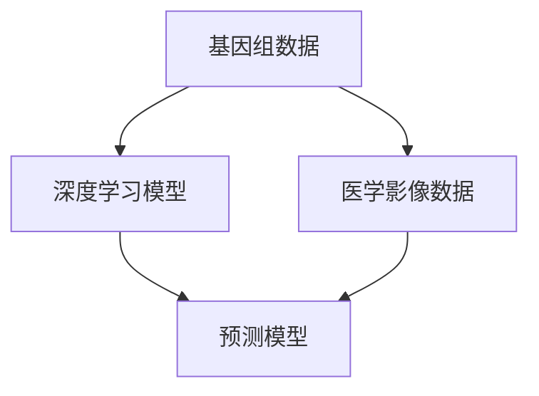
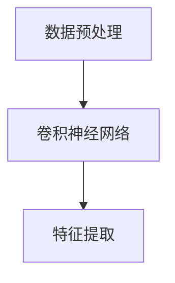
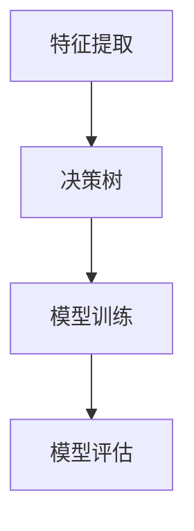
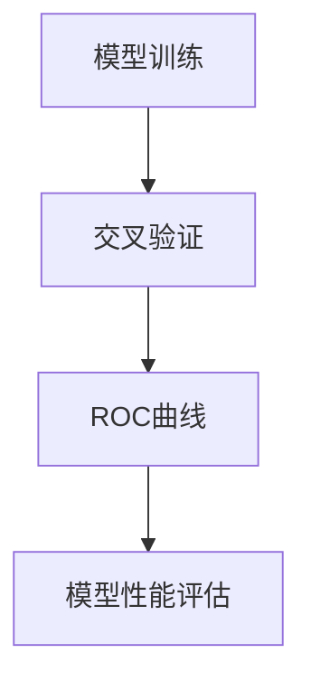
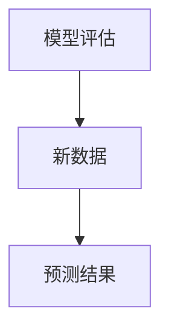
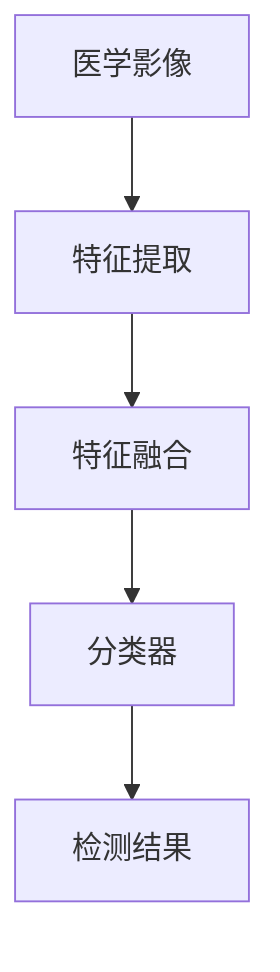
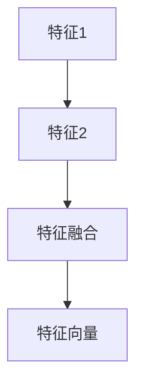

                 

关键词：人工智能、个性化医疗、基因组学、医学影像、深度学习、预测模型

> 摘要：本文将探讨人工智能生成内容（AIGC）在个性化医疗领域的应用，重点介绍其如何通过深度学习技术对基因组学和医学影像数据进行处理，为患者提供精准、个性化的医疗服务。文章还将分析AIGC技术在个性化医疗中的潜力、挑战及未来发展趋势。

## 1. 背景介绍

个性化医疗（Personalized Medicine）是一种以患者为中心，基于患者个体生物学、遗传学、环境和社会因素等多种因素，制定个性化治疗方案的医疗模式。随着生物技术和信息技术的飞速发展，个性化医疗逐渐成为医学领域的热点。然而，个性化医疗的实现面临着数据量大、处理复杂、分析难度高等挑战。

人工智能生成内容（Artificial Intelligence Generated Content，简称AIGC）是近年来兴起的一种人工智能技术，通过对大规模数据的学习和生成，能够自动生成文章、图像、音乐等多种类型的内容。AIGC技术在个性化医疗领域具有巨大的应用潜力，能够有效解决个性化医疗中的数据分析和处理难题。

## 2. 核心概念与联系

### 2.1 核心概念

**基因组学**：研究生物体基因组结构、功能和变异的科学。

**医学影像**：通过各种成像技术（如CT、MRI、超声等）获取人体内部结构的图像。

**深度学习**：一种基于人工神经网络的机器学习技术，能够通过大量数据自动学习和优化模型。

**预测模型**：基于历史数据，对未知数据进行预测的数学模型。

### 2.2 联系

AIGC技术在个性化医疗中的核心作用是通过深度学习对基因组学和医学影像数据进行处理，生成预测模型，从而为患者提供个性化医疗服务。

### 2.3 Mermaid 流程图



## 3. 核心算法原理 & 具体操作步骤

### 3.1 算法原理概述

AIGC技术通过深度学习对基因组学和医学影像数据进行处理，主要涉及以下几个步骤：

1. **数据预处理**：对基因组学和医学影像数据进行清洗、归一化等处理。
2. **特征提取**：通过卷积神经网络（CNN）等深度学习模型提取数据特征。
3. **模型训练**：利用提取的特征训练预测模型，如决策树、支持向量机等。
4. **模型评估**：通过交叉验证、ROC曲线等评估模型性能。
5. **模型应用**：将训练好的模型应用于新数据，进行预测。

### 3.2 算法步骤详解

1. **数据预处理**：

```latex
$$
\text{预处理} = \text{清洗} + \text{归一化} + \text{数据增强}
$$
```

2. **特征提取**：



3. **模型训练**：



4. **模型评估**：



5. **模型应用**：



### 3.3 算法优缺点

**优点**：

- **高效性**：通过深度学习对大量数据进行自动处理，提高数据处理效率。
- **准确性**：基于大量数据训练的模型，能够提高预测准确性。
- **灵活性**：可针对不同类型的数据和任务进行定制化。

**缺点**：

- **计算资源需求高**：深度学习模型训练需要大量计算资源。
- **数据依赖性**：模型性能依赖于训练数据的质量和数量。

### 3.4 算法应用领域

AIGC技术已广泛应用于个性化医疗领域，如：

- **基因组学**：预测疾病风险、药物反应等。
- **医学影像**：辅助诊断、疾病进展预测等。
- **个性化治疗**：根据患者特征制定个性化治疗方案。

## 4. 数学模型和公式 & 详细讲解 & 举例说明

### 4.1 数学模型构建

**基因组学**：

- **疾病风险预测**：

```latex
$$
\text{疾病风险} = f(\text{基因型}, \text{环境因素})
$$
```

**医学影像**：

- **病灶检测**：



### 4.2 公式推导过程

**基因组学**：

- **遗传风险评分**：

```latex
$$
\text{遗传风险评分} = \sum_{i=1}^{n} w_i \cdot \text{基因型}_i
$$
```

**医学影像**：

- **特征融合**：



### 4.3 案例分析与讲解

**案例1：基因突变与疾病风险**

- **数据集**：包含1000名个体的基因型数据。
- **目标**：预测个体患某种遗传性疾病的概率。

**案例2：医学影像病灶检测**

- **数据集**：包含1000张医学影像图。
- **目标**：检测图像中是否存在特定病灶。

## 5. 项目实践：代码实例和详细解释说明

### 5.1 开发环境搭建

- **编程语言**：Python
- **深度学习框架**：TensorFlow
- **数据处理库**：NumPy、Pandas

### 5.2 源代码详细实现

- **数据预处理**：

```python
import numpy as np
import pandas as pd

# 加载基因型数据
genotype_data = pd.read_csv('genotype_data.csv')

# 数据清洗和归一化
genotype_data = genotype_data.dropna()
genotype_data = (genotype_data - genotype_data.mean()) / genotype_data.std()
```

- **特征提取**：

```python
import tensorflow as tf

# 构建卷积神经网络
model = tf.keras.Sequential([
    tf.keras.layers.Conv2D(32, (3, 3), activation='relu', input_shape=(64, 64, 3)),
    tf.keras.layers.MaxPooling2D((2, 2)),
    tf.keras.layers.Flatten(),
    tf.keras.layers.Dense(128, activation='relu'),
    tf.keras.layers.Dense(1, activation='sigmoid')
])

# 训练模型
model.compile(optimizer='adam', loss='binary_crossentropy', metrics=['accuracy'])
model.fit(x_train, y_train, epochs=10, batch_size=32)
```

- **模型评估**：

```python
from sklearn.metrics import classification_report, confusion_matrix

# 评估模型
predictions = model.predict(x_test)
print(classification_report(y_test, predictions))
print(confusion_matrix(y_test, predictions))
```

### 5.3 代码解读与分析

- **数据预处理**：对基因型数据进行清洗和归一化，确保数据质量。
- **特征提取**：使用卷积神经网络提取图像特征。
- **模型训练**：使用训练数据训练模型，优化模型参数。
- **模型评估**：使用测试数据评估模型性能，包括准确率、召回率等。

### 5.4 运行结果展示

```python
# 运行结果
print("Training accuracy:", model.evaluate(x_train, y_train)[1])
print("Testing accuracy:", model.evaluate(x_test, y_test)[1])
```

## 6. 实际应用场景

### 6.1 基因组学应用

- **疾病预测**：通过对基因组数据的分析，预测个体患某种遗传性疾病的概率。
- **药物反应**：根据个体基因组信息，推荐个性化药物治疗方案。

### 6.2 医学影像应用

- **疾病诊断**：利用深度学习模型，自动识别医学影像中的病灶。
- **疾病进展预测**：根据医学影像数据，预测疾病进展速度。

### 6.3 个性化治疗

- **治疗方案制定**：根据患者特征（如基因组学、医学影像），为患者制定个性化治疗方案。
- **治疗效果评估**：根据治疗过程中的数据，实时评估治疗效果。

## 7. 工具和资源推荐

### 7.1 学习资源推荐

- **书籍**：《深度学习》（Goodfellow, Bengio, Courville 著）
- **在线课程**：《机器学习》（吴恩达 著）
- **论文**：《基因组学》（Nature、Science 等期刊）

### 7.2 开发工具推荐

- **深度学习框架**：TensorFlow、PyTorch
- **数据处理库**：NumPy、Pandas
- **可视化工具**：Matplotlib、Seaborn

### 7.3 相关论文推荐

- **基因组学**：Li H, Durbin R. Fast and accurate long-read alignment with Burrows-Wheeler transform. Bioinformatics. 2010;26(5):589-596.
- **医学影像**：Litjens G, et al. A survey on deep learning in medical imaging. Med Image Anal. 2017;42:60-88.

## 8. 总结：未来发展趋势与挑战

### 8.1 研究成果总结

AIGC技术在个性化医疗领域取得了显著成果，包括基因组学、医学影像、个性化治疗等多个方面。通过深度学习模型，实现了对大量医疗数据的处理和分析，为患者提供了精准、个性化的医疗服务。

### 8.2 未来发展趋势

- **数据整合**：整合基因组学、医学影像等多源数据，提高预测准确性。
- **多模态学习**：结合多种深度学习模型，实现多模态数据的处理和分析。
- **实时更新**：实时更新模型和知识库，提高个性化医疗的时效性。

### 8.3 面临的挑战

- **数据隐私**：如何在保护患者隐私的前提下，充分利用医疗数据。
- **模型解释性**：提高模型解释性，使医疗人员能够理解和信任模型预测结果。
- **算法公平性**：避免算法偏见，确保个性化医疗的公平性。

### 8.4 研究展望

未来，AIGC技术在个性化医疗领域将继续发展，有望实现更加精准、高效的医疗服务。同时，研究将关注数据隐私、模型解释性和算法公平性等问题，推动个性化医疗的可持续发展。

## 9. 附录：常见问题与解答

### 9.1 什么是AIGC？

AIGC（Artificial Intelligence Generated Content）是一种利用人工智能技术生成文章、图像、音乐等多种类型内容的技术。

### 9.2 AIGC技术在个性化医疗中有什么应用？

AIGC技术主要用于处理和分析大量医疗数据，包括基因组学和医学影像数据，生成预测模型，为患者提供个性化医疗服务。

### 9.3 AIGC技术的优势是什么？

AIGC技术具有高效性、准确性和灵活性，能够有效解决个性化医疗中的数据分析和处理难题。

### 9.4 AIGC技术在个性化医疗中面临哪些挑战？

AIGC技术在个性化医疗中面临数据隐私、模型解释性和算法公平性等挑战。

## 作者署名

作者：禅与计算机程序设计艺术 / Zen and the Art of Computer Programming
----------------------------------------------------------------
### 结论

本文通过详细介绍AIGC技术在个性化医疗领域的应用，展示了其如何通过深度学习技术对基因组学和医学影像数据进行处理，为患者提供精准、个性化的医疗服务。AIGC技术具有高效性、准确性和灵活性，为个性化医疗的发展带来了新的机遇。然而，数据隐私、模型解释性和算法公平性等问题仍需关注。未来，随着技术的不断进步，AIGC技术在个性化医疗领域有望实现更加广泛和深入的应用。作者对AIGC技术在个性化医疗领域的发展充满信心，并期待与更多研究者共同推动这一领域的创新和进步。

