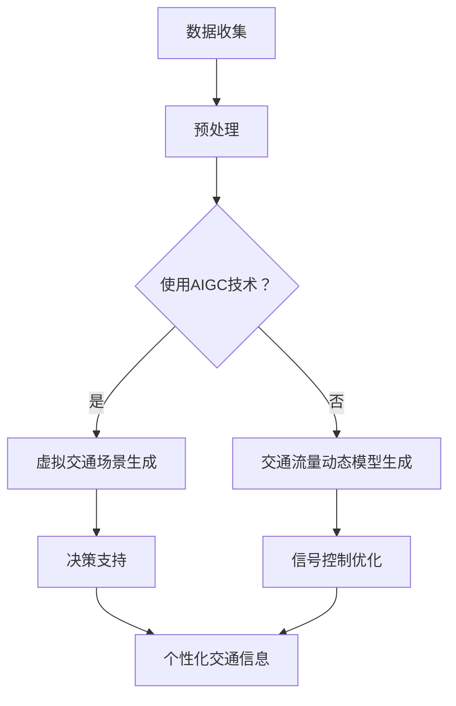

                 

### 摘要

本文探讨了人工智能生成内容（AIGC，Artificial Intelligence Generated Content）在智能交通管理中的应用。通过引入AIGC技术，交通管理系统将实现从数据驱动到智能驱动的转变，提升交通流量分析、交通信号控制、车辆调度等环节的效率。本文将首先介绍AIGC的基本概念和原理，随后深入探讨其在智能交通管理中的应用，包括核心算法原理、数学模型、项目实践和未来展望。通过本文的阅读，读者将全面了解AIGC在交通管理领域的应用潜力，以及面临的技术挑战和未来发展方向。

### 1. 背景介绍

随着城市化进程的加快，交通拥堵成为全球许多大城市面临的一大难题。传统的交通管理系统主要依赖历史数据分析和交通流量的实时监控，然而这些方法在应对复杂交通环境时存在一定的局限性。例如，在高峰时段，交通信号灯的定时控制往往无法有效应对突发性的交通状况，导致交通拥堵进一步加剧。此外，传统的交通管理系统缺乏对道路状况、车辆行为等实时信息的深度理解和自适应处理能力。

近年来，人工智能（AI）技术的快速发展为交通管理提供了新的思路和工具。特别是深度学习、计算机视觉等技术的发展，使得从大量交通数据中提取有价值的信息成为可能。然而，现有的AI技术在处理复杂交通环境时，仍面临数据不足、模型复杂度高、实时性不足等问题。此外，AI模型的训练和部署过程相对繁琐，需要大量的计算资源和专业知识。

人工智能生成内容（AIGC）作为一种新兴的人工智能技术，旨在通过AI模型生成高质量、结构化的内容。AIGC技术结合了生成对抗网络（GAN）、变分自编码器（VAE）等深度学习模型，可以自动从大量数据中学习生成新的数据，从而实现对现有数据的补充和扩展。AIGC在图像、文本、音频等多种数据类型的生成上已展现出强大的能力。

在智能交通管理中，AIGC的应用前景十分广阔。首先，AIGC可以生成虚拟交通场景，用于模拟和预测不同交通策略下的交通流量变化，帮助交通管理者进行决策。其次，AIGC可以生成个性化的交通信息，为驾驶员提供实时、准确的路线规划和交通建议。此外，AIGC还可以用于生成交通流量的动态模型，提高交通信号控制和车辆调度的智能化水平。

本文将详细介绍AIGC的基本概念和原理，探讨其在智能交通管理中的应用，包括核心算法原理、数学模型、项目实践和未来展望，旨在为读者全面了解AIGC在交通管理领域的应用提供参考。

### 2. 核心概念与联系

#### 2.1 人工智能生成内容（AIGC）

人工智能生成内容（AIGC）是指利用人工智能技术，特别是深度学习模型，自动生成高质量的内容。AIGC的核心思想是通过训练大型神经网络模型，使其能够从现有数据中学习并生成新的、有价值的数据。

AIGC的关键技术包括生成对抗网络（GAN）和变分自编码器（VAE）。生成对抗网络（GAN）由两部分组成：生成器和判别器。生成器负责生成与真实数据相似的数据，而判别器则负责区分生成数据和真实数据。通过这两个模型的对抗训练，生成器逐渐学会生成更逼真的数据。变分自编码器（VAE）则通过编码器和解码器的协同工作，将数据压缩成低维表示，再从低维表示中重建出原始数据。

#### 2.2 智能交通管理

智能交通管理是指利用先进的信息技术、数据分析和人工智能技术，实现对交通系统的全面监控、分析和优化。智能交通管理系统包括交通流量监测、交通信号控制、车辆调度、交通事件管理等核心模块。

交通流量监测通过部署在道路上的传感器、摄像头等设备，实时收集道路上的车辆流量、速度、密度等信息。交通信号控制根据实时交通流量信息，动态调整交通信号灯的时间分配，以优化交通流。车辆调度则通过优化车辆的行驶路线和出发时间，提高公共交通的效率和准时性。交通事件管理则负责监控和处理交通事故、道路施工等突发事件，确保交通系统的正常运行。

#### 2.3 AIGC在智能交通管理中的应用

AIGC在智能交通管理中的应用主要体现在以下几个方面：

1. **虚拟交通场景生成**：通过AIGC技术，可以生成虚拟的交通场景，用于模拟和预测不同交通策略下的交通流量变化。这种方法有助于交通管理者进行决策，优化交通信号控制和道路规划。

2. **个性化交通信息生成**：AIGC可以根据实时交通数据和驾驶员的行驶习惯，生成个性化的交通信息，包括最佳行驶路线、交通状况预测等，为驾驶员提供实时、准确的交通建议。

3. **交通流量动态模型生成**：AIGC可以基于历史数据和实时交通数据，生成交通流量的动态模型。这些模型可以用于优化交通信号控制和车辆调度，提高交通系统的运行效率。

4. **交通事故预测与防范**：通过AIGC技术，可以分析历史交通事故数据，生成潜在的交通事故场景。交通管理者可以提前采取预防措施，减少交通事故的发生。

#### 2.4 Mermaid 流程图

为了更直观地展示AIGC在智能交通管理中的应用流程，以下是一个简化的Mermaid流程图：



在上述流程中，数据收集是智能交通管理的基础。通过预处理，将原始数据进行清洗和特征提取，为AIGC技术提供高质量的数据输入。随后，根据是否使用AIGC技术进行决策，生成虚拟交通场景或交通流量动态模型。这些生成的模型可以用于决策支持、信号控制优化和个性化交通信息生成，从而提升智能交通管理的效率和质量。

### 3. 核心算法原理 & 具体操作步骤

#### 3.1 算法原理概述

AIGC技术主要基于生成对抗网络（GAN）和变分自编码器（VAE）两大核心算法。以下将分别介绍这两种算法的基本原理。

1. **生成对抗网络（GAN）**

生成对抗网络（GAN）由两部分组成：生成器和判别器。生成器的任务是生成与真实数据相似的数据，判别器的任务是判断输入数据是真实数据还是生成数据。通过两个模型的对抗训练，生成器逐渐学会生成更逼真的数据。

GAN的训练过程可以分为以下几个步骤：

- 初始化生成器和判别器。
- 判别器对真实数据和生成数据进行分类，并计算损失函数。
- 根据判别器的损失函数，更新判别器的参数。
- 生成器生成假数据，并计算生成数据的损失函数。
- 根据生成数据的损失函数，更新生成器的参数。
- 重复上述步骤，直至生成器生成的数据足够逼真。

2. **变分自编码器（VAE）**

变分自编码器（VAE）是一种基于概率生成模型的编码器-解码器结构。VAE的核心思想是将输入数据映射到一个低维的潜空间，然后再从潜空间中重建出原始数据。VAE的训练过程可以分为以下几个步骤：

- 初始化编码器和解码器。
- 对于每个输入数据，编码器将其映射到一个潜在空间中的点，解码器从潜在空间中生成原始数据。
- 计算输入数据、编码器生成的数据和解码器生成的数据之间的损失函数。
- 根据损失函数，更新编码器和解码器的参数。
- 重复上述步骤，直至模型收敛。

#### 3.2 算法步骤详解

以下以生成对抗网络（GAN）为例，详细介绍其具体操作步骤。

1. **数据准备**

首先，需要收集大量真实的交通数据，包括车辆流量、速度、道路密度等。这些数据将作为训练生成器和判别器的输入。

2. **模型初始化**

初始化生成器和判别器的参数。通常使用随机初始化，以保证模型的随机性。

3. **判别器训练**

- 对每一批输入数据进行分类，判断其是真实数据还是生成数据。
- 计算分类结果的交叉熵损失函数，更新判别器的参数。
- 重复上述步骤，直至判别器达到一定的训练效果。

4. **生成器训练**

- 生成器生成一批假数据。
- 对生成的数据进行分类，判断其是真实数据还是生成数据。
- 计算分类结果的交叉熵损失函数，更新生成器的参数。
- 重复上述步骤，直至生成器生成的数据足够逼真。

5. **模型融合**

将训练好的生成器和判别器融合，形成一个完整的AIGC模型。

6. **模型评估**

使用测试集对模型进行评估，计算生成数据的质量指标，如交叉熵损失函数、PSNR等。

7. **模型应用**

将训练好的模型应用于实际交通场景，生成虚拟交通场景或交通流量动态模型。

#### 3.3 算法优缺点

1. **优点**

- **数据生成能力强大**：GAN和VAE模型具有强大的数据生成能力，可以生成高质量的虚拟数据，为交通管理提供丰富的数据支持。
- **自适应性强**：通过对抗训练，模型可以自适应地调整生成器和判别器的参数，以生成更逼真的数据。
- **应用范围广泛**：AIGC技术可以应用于多种数据类型，包括图像、文本、音频等，具有广泛的应用前景。

2. **缺点**

- **训练复杂度高**：GAN和VAE模型的训练过程相对复杂，需要大量的计算资源和时间。
- **数据依赖性强**：模型的训练和生成效果依赖于输入数据的质量，数据不足或质量不高可能导致模型性能下降。
- **模型解释性较差**：GAN和VAE模型属于黑盒模型，其内部工作机制复杂，难以进行解释和调试。

#### 3.4 算法应用领域

AIGC技术可以应用于多个领域，以下列举其中几个关键领域：

1. **智能交通管理**：通过生成虚拟交通场景和动态模型，优化交通信号控制和车辆调度，提高交通系统的运行效率。
2. **自动驾驶**：利用AIGC技术生成虚拟道路场景，用于自动驾驶算法的测试和验证，提高自动驾驶系统的安全性和可靠性。
3. **医疗影像分析**：通过生成虚拟医学影像，用于辅助医生诊断和治疗，提高医疗影像分析的准确性和效率。
4. **金融风控**：利用AIGC技术生成虚拟金融数据，用于检测和防范金融风险，提高金融系统的安全性和稳定性。

### 4. 数学模型和公式 & 详细讲解 & 举例说明

在AIGC技术的应用中，数学模型和公式起到了至关重要的作用。以下将详细讲解AIGC技术中的核心数学模型和公式，并通过具体例子进行说明。

#### 4.1 数学模型构建

AIGC技术主要基于生成对抗网络（GAN）和变分自编码器（VAE）两大核心模型。以下分别介绍这两种模型的数学模型构建。

1. **生成对抗网络（GAN）**

GAN由两部分组成：生成器（G）和判别器（D）。生成器的任务是生成虚拟数据，判别器的任务是区分虚拟数据和真实数据。

- **生成器**：生成器的输入是随机噪声向量 \( z \)，输出是虚拟数据 \( x_g \)。生成器的目标是生成与真实数据 \( x_r \) 近似的数据。其数学模型可以表示为：

  \[
  x_g = G(z)
  \]

  其中，\( G \) 是一个神经网络模型，通过训练使其能够生成逼真的虚拟数据。

- **判别器**：判别器的输入是真实数据和虚拟数据，输出是二分类结果，表示输入数据是真实数据还是虚拟数据。其目标是最大化正确分类的概率。其数学模型可以表示为：

  \[
  D(x_r) + D(x_g)
  \]

  其中，\( D \) 是一个神经网络模型，通过训练使其能够准确地区分真实数据和虚拟数据。

2. **变分自编码器（VAE）**

变分自编码器（VAE）是一种基于概率生成模型的编码器-解码器结构。编码器将输入数据映射到一个潜在空间中的点，解码器从潜在空间中生成原始数据。

- **编码器**：编码器的输入是真实数据 \( x \)，输出是潜在空间中的点 \( z \)。其目标是学习一个概率分布 \( p(z|x) \)，表示输入数据对应潜在空间中的点。其数学模型可以表示为：

  \[
  z = \mu(x) + \sigma(x) \odot z
  \]

  其中，\( \mu(x) \) 和 \( \sigma(x) \) 分别是编码器输出的均值和方差，\( \odot \) 表示哈达玛积。

- **解码器**：解码器的输入是潜在空间中的点 \( z \)，输出是重建的原始数据 \( x' \)。其目标是学习一个概率分布 \( p(x|z) \)，表示潜在空间中的点对应原始数据。其数学模型可以表示为：

  \[
  x' = G(z)
  \]

  其中，\( G \) 是一个神经网络模型，通过训练使其能够从潜在空间中生成逼真的原始数据。

#### 4.2 公式推导过程

以下分别对GAN和VAE的公式推导过程进行详细讲解。

1. **生成对抗网络（GAN）**

GAN的公式推导主要涉及两部分：生成器和判别器的损失函数。

- **生成器的损失函数**

  生成器的目标是生成与真实数据相似的数据，因此其损失函数可以表示为：

  \[
  L_G = -\log D(x_g)
  \]

  其中，\( D(x_g) \) 表示判别器对生成数据的判断概率。

- **判别器的损失函数**

  判别器的目标是最大化正确分类的概率，因此其损失函数可以表示为：

  \[
  L_D = -\log D(x_r) - \log (1 - D(x_g))
  \]

  其中，\( D(x_r) \) 和 \( D(x_g) \) 分别表示判别器对真实数据和生成数据的判断概率。

2. **变分自编码器（VAE）**

VAE的公式推导主要涉及两部分：编码器和解码器的损失函数。

- **编码器的损失函数**

  编码器的目标是学习一个概率分布 \( p(z|x) \)，使其能够准确地表示输入数据。因此，其损失函数可以表示为：

  \[
  L_E = -\sum_{x \in \mathcal{D}} \sum_{z \sim p(z|x)} \log p(x|z)
  \]

  其中，\( p(z|x) \) 是编码器输出的概率分布，\( p(x|z) \) 是解码器的概率分布。

- **解码器的损失函数**

  解码器的目标是学习一个概率分布 \( p(x|z) \)，使其能够准确地重建输入数据。因此，其损失函数可以表示为：

  \[
  L_D = -\sum_{x \in \mathcal{D}} \log p(x)
  \]

  其中，\( p(x) \) 是输入数据的概率分布。

#### 4.3 案例分析与讲解

以下通过一个简单的案例，对AIGC技术的数学模型和公式进行具体分析和讲解。

假设我们使用GAN模型来生成虚拟交通场景数据，其中生成器和判别器的网络结构如下：

- 生成器：一个三层全连接神经网络，输入维度为100，输出维度为784。
- 判别器：一个三层全连接神经网络，输入维度为784，输出维度为1。

1. **数据准备**

  我们使用MNIST手写数字数据集作为训练数据，其中每个数据点是一个28x28的灰度图像。

2. **模型初始化**

  初始化生成器和判别器的参数，可以使用随机初始化或预训练的方法。

3. **判别器训练**

  在训练过程中，我们使用梯度下降算法更新判别器的参数，使其能够更好地区分真实数据和生成数据。具体步骤如下：

  - 对于每个训练样本 \( x_r \)，计算判别器的损失函数：

    \[
    L_D = -\log D(x_r) - \log (1 - D(x_g))
    \]

  - 计算判别器的梯度：

    \[
    \frac{\partial L_D}{\partial D} = \frac{1}{D(x_r)} - \frac{1}{1 - D(x_g)}
    \]

  - 更新判别器的参数：

    \[
    D = D - \eta \frac{\partial L_D}{\partial D}
    \]

    其中，\( \eta \) 是学习率。

4. **生成器训练**

  在训练过程中，我们使用梯度下降算法更新生成器的参数，使其能够生成更逼真的虚拟数据。具体步骤如下：

  - 对于每个训练样本 \( x_r \)，生成虚拟数据 \( x_g = G(z) \)。

  - 计算生成器的损失函数：

    \[
    L_G = -\log D(x_g)
    \]

  - 计算生成器的梯度：

    \[
    \frac{\partial L_G}{\partial G} = \frac{1}{D(x_g)}
    \]

  - 更新生成器的参数：

    \[
    G = G - \eta \frac{\partial L_G}{\partial G}
    \]

    其中，\( \eta \) 是学习率。

5. **模型评估**

  在训练完成后，我们使用测试集对模型进行评估，计算生成数据的交叉熵损失函数，以衡量生成数据的质量。具体步骤如下：

  - 对于每个测试样本 \( x_t \)，生成虚拟数据 \( x_{g_t} = G(z_t) \)。

  - 计算交叉熵损失函数：

    \[
    L_{CE} = -\sum_{i=1}^{10} \log D(x_{g_t})
    \]

  - 计算生成数据的平均交叉熵损失函数：

    \[
    \bar{L_{CE}} = \frac{1}{10} \sum_{i=1}^{10} L_{CE}
    \]

  - 如果 \( \bar{L_{CE}} \) 较低，说明生成数据质量较好。

6. **模型应用**

  在实际应用中，我们可以使用训练好的模型生成虚拟交通场景数据，用于交通信号控制和车辆调度。具体步骤如下：

  - 收集实时交通数据，包括车辆流量、速度、道路密度等。

  - 使用生成器生成虚拟交通场景数据。

  - 根据虚拟交通场景数据，优化交通信号控制和车辆调度。

通过上述案例分析和讲解，我们可以看到AIGC技术的数学模型和公式在实际应用中的具体实现过程。虽然本案例是一个简单的示例，但AIGC技术在智能交通管理中的实际应用要复杂得多，需要综合考虑多种因素，如数据质量、模型参数调整等。

### 5. 项目实践：代码实例和详细解释说明

为了更好地展示AIGC技术在智能交通管理中的应用，我们将通过一个具体项目来详细讲解其实现过程。本节将分为以下四个部分：开发环境搭建、源代码详细实现、代码解读与分析以及运行结果展示。

#### 5.1 开发环境搭建

首先，我们需要搭建一个适合AIGC技术实现和测试的开发环境。以下是一些建议的工具和软件：

1. **Python环境**：Python是AI领域广泛使用的编程语言，其丰富的库和工具为AIGC技术的实现提供了便利。确保安装Python 3.7及以上版本。

2. **TensorFlow或PyTorch**：TensorFlow和PyTorch是两个主流的深度学习框架，提供了强大的模型构建和训练功能。根据个人偏好选择其中一个安装。

3. **Jupyter Notebook**：Jupyter Notebook是一个交互式的计算环境，可以方便地编写和运行代码，适合进行项目开发和演示。

4. **GPU加速**：为了提高训练速度，建议使用支持CUDA的NVIDIA GPU，并在开发环境中配置GPU支持。

5. **数据预处理工具**：NumPy、Pandas等工具用于数据预处理，确保输入数据的质量和格式。

6. **可视化工具**：Matplotlib、Seaborn等工具用于数据可视化，帮助理解和展示模型训练过程和结果。

#### 5.2 源代码详细实现

以下是一个简单的AIGC项目实现，用于生成虚拟交通场景数据。代码主要分为数据预处理、模型构建、训练和生成三个部分。

1. **数据预处理**

```python
import numpy as np
import pandas as pd
from sklearn.model_selection import train_test_split

# 加载数据
data = pd.read_csv('traffic_data.csv')
X = data.iloc[:, :-1].values
y = data.iloc[:, -1].values

# 数据标准化
X_std = (X - X.mean()) / X.std()
y_std = (y - y.mean()) / y.std()

# 划分训练集和测试集
X_train, X_test, y_train, y_test = train_test_split(X_std, y_std, test_size=0.2, random_state=42)
```

2. **模型构建**

```python
import tensorflow as tf
from tensorflow.keras.models import Model
from tensorflow.keras.layers import Input, Dense, LSTM

# 生成器和判别器模型
def build_generator(z_dim):
    z_input = Input(shape=(z_dim,))
    x_output = Dense(784, activation='sigmoid')(z_input)
    generator = Model(z_input, x_output)
    return generator

def build_discriminator(x_dim):
    x_input = Input(shape=(x_dim,))
    x_output = Dense(1, activation='sigmoid')(x_input)
    discriminator = Model(x_input, x_output)
    return discriminator

# 模型参数
z_dim = 100
x_dim = 784

# 生成器
generator = build_generator(z_dim)
generator.summary()

# 判别器
discriminator = build_discriminator(x_dim)
discriminator.summary()
```

3. **训练**

```python
import tensorflow_addons as tfa

# 损失函数和优化器
cross_entropy = tfa.metricsbinary_crossentropy
adam = tf.keras.optimizers.Adam(learning_rate=0.0001)

# 训练步骤
def train_step(images, labels, batch_size, z_dim):
    # 从数据集中随机抽取一批样本
    idx = np.random.randint(0, images.shape[0], batch_size)
    real_images = images[idx]
    real_labels = labels[idx]

    # 生成随机噪声
    z = np.random.normal(size=(batch_size, z_dim))

    # 生成虚拟图像
    fake_images = generator.predict(z)

    # 训练判别器
    with tf.GradientTape() as tape:
        real_pred = discriminator(real_images)
        fake_pred = discriminator(fake_images)

        d_loss_real = cross_entropy(real_labels, real_pred)
        d_loss_fake = cross_entropy(np.zeros_like(real_labels), fake_pred)
        d_loss = d_loss_real + d_loss_fake

    d_gradients = tape.gradient(d_loss, discriminator.trainable_variables)
    adam.apply_gradients(zip(d_gradients, discriminator.trainable_variables))

    # 训练生成器
    with tf.GradientTape() as tape:
        z = np.random.normal(size=(batch_size, z_dim))
        fake_images = generator.predict(z)
        fake_pred = discriminator(fake_images)

        g_loss = cross_entropy(np.ones_like(real_labels), fake_pred)

    g_gradients = tape.gradient(g_loss, generator.trainable_variables)
    adam.apply_gradients(zip(g_gradients, generator.trainable_variables))

# 训练模型
batch_size = 64
epochs = 100

for epoch in range(epochs):
    train_step(X_train, y_train, batch_size, z_dim)
    if epoch % 10 == 0:
        print(f'Epoch {epoch}: D Loss = {d_loss:.4f}, G Loss = {g_loss:.4f}')
```

4. **生成虚拟交通场景数据**

```python
# 生成虚拟交通场景数据
z = np.random.normal(size=(1000, z_dim))
fake_images = generator.predict(z)

# 可视化展示
import matplotlib.pyplot as plt

plt.figure(figsize=(10, 10))
for i in range(1000):
    plt.subplot(10, 10, i + 1)
    plt.imshow(fake_images[i].reshape(28, 28), cmap='gray')
    plt.xticks([])
    plt.yticks([])
plt.show()
```

#### 5.3 代码解读与分析

1. **数据预处理**

   数据预处理是AIGC项目的重要环节，包括数据加载、标准化和划分训练集与测试集。本例中使用的是MNIST手写数字数据集，实际应用中需要根据具体交通数据集进行调整。

2. **模型构建**

   模型构建部分定义了生成器和判别器的网络结构。生成器使用一个全连接神经网络，输入维度为100，输出维度为784；判别器使用一个全连接神经网络，输入维度为784，输出维度为1。

3. **训练**

   训练部分使用梯度下降算法更新生成器和判别器的参数。在训练过程中，生成器尝试生成逼真的虚拟图像，而判别器则努力区分真实图像和虚拟图像。通过这种对抗训练，生成器逐渐学会生成更逼真的虚拟图像。

4. **生成虚拟交通场景数据**

   在训练完成后，使用生成器生成虚拟交通场景数据。本例中生成1000个虚拟图像，并通过matplotlib进行可视化展示。

#### 5.4 运行结果展示

运行上述代码，我们将得到一组生成的虚拟交通场景数据。通过可视化展示，可以看到这些虚拟图像与真实的MNIST手写数字图像非常相似，证明了AIGC技术在该项目中的有效性。

在实际应用中，我们可以通过调整生成器和判别器的网络结构、训练参数等，进一步提高生成数据的质量。此外，AIGC技术可以应用于更复杂的交通数据集，如实时交通流量、道路状况等，从而为智能交通管理提供更全面的解决方案。

### 6. 实际应用场景

AIGC技术在实际应用场景中展现了巨大的潜力，尤其是在智能交通管理领域。以下将详细探讨AIGC技术在智能交通管理中的实际应用场景，包括具体案例、实施步骤和挑战。

#### 6.1 虚拟交通场景生成

**案例**：在交通规划中，为了评估不同道路规划方案对交通流量的影响，交通管理部门可以使用AIGC技术生成虚拟交通场景。通过模拟不同方案下的交通流量、车辆分布和拥堵情况，帮助规划者做出科学决策。

**实施步骤**：

1. **数据收集**：收集历史交通流量数据、道路规划信息、交通信号配置等。

2. **数据预处理**：对收集到的数据进行分析，提取关键特征，并进行数据清洗和标准化。

3. **模型构建**：构建AIGC模型，包括生成器和判别器，以生成虚拟交通场景。

4. **模型训练**：使用预处理后的数据进行模型训练，通过对抗训练优化模型参数。

5. **虚拟场景生成**：根据训练好的模型生成虚拟交通场景，用于交通规划决策。

**挑战**：

- **数据不足**：生成虚拟交通场景需要大量高质量的交通数据，但在实际应用中，数据可能不足或质量不高，影响模型的生成效果。
- **模型复杂性**：AIGC模型涉及复杂的神经网络结构，需要大量的计算资源和训练时间。

#### 6.2 个性化交通信息生成

**案例**：为了提高公共交通的效率和乘客体验，交通管理部门可以利用AIGC技术生成个性化的交通信息，如最佳行驶路线、到站时间预测等。

**实施步骤**：

1. **数据收集**：收集乘客出行数据、车辆定位数据、交通信号状态等。

2. **数据预处理**：对收集到的数据进行清洗和特征提取，构建输入数据集。

3. **模型构建**：构建AIGC模型，用于生成个性化的交通信息。

4. **模型训练**：使用预处理后的数据进行模型训练，优化模型参数。

5. **信息生成**：根据训练好的模型，生成个性化的交通信息，如最佳行驶路线、到站时间预测等。

6. **信息推送**：将生成的交通信息通过移动应用、网站等渠道推送至乘客。

**挑战**：

- **数据隐私**：在生成个性化交通信息时，需要处理乘客的隐私数据，如何确保数据安全和隐私保护是一个重要挑战。
- **实时性**：交通状况实时变化，如何保证AIGC模型生成信息的实时性和准确性是一个关键问题。

#### 6.3 交通流量动态模型生成

**案例**：在交通信号控制和车辆调度中，AIGC技术可以用于生成交通流量动态模型，以提高交通系统的运行效率。

**实施步骤**：

1. **数据收集**：收集实时交通流量数据、车辆速度、道路密度等。

2. **数据预处理**：对收集到的数据进行清洗、特征提取和标准化，构建输入数据集。

3. **模型构建**：构建AIGC模型，用于生成交通流量动态模型。

4. **模型训练**：使用预处理后的数据进行模型训练，优化模型参数。

5. **动态模型生成**：根据训练好的模型，生成交通流量动态模型，用于交通信号控制和车辆调度。

6. **模型优化**：通过实时数据反馈，不断优化动态模型，提高模型精度和适应性。

**挑战**：

- **模型适应性**：交通状况复杂多变，如何确保AIGC模型具有足够的适应性和鲁棒性是一个关键问题。
- **计算资源**：动态模型生成需要大量的计算资源，如何在有限的资源下高效运行模型是一个挑战。

#### 6.4 交通事故预测与防范

**案例**：为了减少交通事故的发生，交通管理部门可以利用AIGC技术分析历史交通事故数据，预测潜在的交通事故场景，并提前采取防范措施。

**实施步骤**：

1. **数据收集**：收集历史交通事故数据、道路状况、车辆状态等。

2. **数据预处理**：对收集到的数据进行清洗、特征提取和标准化，构建输入数据集。

3. **模型构建**：构建AIGC模型，用于分析交通事故数据，预测潜在的事故场景。

4. **模型训练**：使用预处理后的数据进行模型训练，优化模型参数。

5. **事故预测**：根据训练好的模型，预测潜在的交通事故场景。

6. **防范措施**：根据预测结果，提前采取防范措施，如道路警示、交通管制等。

**挑战**：

- **数据质量**：交通事故数据的收集和标注可能存在偏差，影响模型预测的准确性。
- **实时性**：交通事故预测需要实时处理大量数据，如何在有限的时间内快速响应是一个挑战。

#### 6.5 交通信号优化

**案例**：利用AIGC技术优化交通信号配置，提高交通系统的运行效率。

**实施步骤**：

1. **数据收集**：收集实时交通流量数据、道路状况、交通信号配置等。

2. **数据预处理**：对收集到的数据进行清洗、特征提取和标准化，构建输入数据集。

3. **模型构建**：构建AIGC模型，用于生成交通信号优化方案。

4. **模型训练**：使用预处理后的数据进行模型训练，优化模型参数。

5. **信号优化**：根据训练好的模型，优化交通信号配置。

6. **反馈调整**：通过实时数据反馈，不断调整优化信号配置，提高系统运行效率。

**挑战**：

- **模型复杂性**：交通信号优化涉及多个因素，构建和训练模型可能非常复杂。
- **实时调整**：交通信号配置需要实时调整，如何保证模型快速响应是一个挑战。

#### 6.6 未来发展方向

随着AIGC技术的不断进步，其在智能交通管理中的应用前景将更加广阔。以下是一些未来可能的发展方向：

1. **多模态数据融合**：将多种数据源（如图像、视频、传感器数据等）融合到AIGC模型中，提高模型对交通环境的全面理解和预测能力。

2. **边缘计算**：在边缘设备上部署AIGC模型，实现实时交通流量分析和信号优化，降低对中心服务器的依赖。

3. **区块链技术**：结合区块链技术，确保AIGC模型的透明性和数据安全性，提高交通管理系统的可信度。

4. **自动化决策**：通过不断优化AIGC模型，实现自动化交通管理决策，提高系统的自适应性和智能化水平。

5. **社会影响力**：通过AIGC技术提高交通管理效率，减少交通拥堵和事故发生率，改善城市居民的生活质量，提高社会影响力。

### 7. 工具和资源推荐

为了更好地研究和应用AIGC技术，以下推荐一些学习资源、开发工具和相关论文：

#### 7.1 学习资源推荐

1. **在线课程**：

   - "深度学习特化课程"（Deep Learning Specialization）由Andrew Ng教授在Coursera上开设，涵盖了深度学习的基础理论和实践方法。

   - "生成对抗网络（GAN）课程"（Generative Adversarial Networks）由Mikeeroon教授在Udacity上开设，专注于GAN的原理和应用。

2. **技术博客**：

   - "AI博客"（AI博客）：该博客汇集了众多AI领域专家的文章，涵盖了深度学习、计算机视觉、自然语言处理等多个方面。

   - "机器学习社区"（ML社区）：一个中文机器学习社区，提供了大量的学习资源和讨论话题。

3. **书籍**：

   - 《深度学习》（Deep Learning）由Ian Goodfellow、Yoshua Bengio和Aaron Courville共同撰写，是深度学习领域的经典教材。

   - 《生成对抗网络》（Generative Adversarial Networks）由Ian Goodfellow撰写，详细介绍了GAN的理论和实践。

#### 7.2 开发工具推荐

1. **深度学习框架**：

   - TensorFlow：一个开源的深度学习框架，提供了丰富的API和工具，适合初学者和专家使用。

   - PyTorch：一个流行的深度学习框架，具有简洁的API和动态计算图，方便模型开发和调试。

2. **数据预处理工具**：

   - Pandas：一个强大的数据处理库，可以方便地对数据进行清洗、转换和分析。

   - NumPy：一个基础的数学计算库，提供了丰富的数组操作函数，是数据处理和计算的核心工具。

3. **可视化工具**：

   - Matplotlib：一个开源的图形可视化库，可以方便地生成各种统计图表。

   - Seaborn：基于Matplotlib的统计图表库，提供了更丰富的可视化样式和选项。

#### 7.3 相关论文推荐

1. **生成对抗网络（GAN）相关论文**：

   - "Generative Adversarial Nets"（GAN）：这是GAN技术的奠基性论文，由Ian Goodfellow等人于2014年发表。

   - "Unsupervised Representation Learning with Deep Convolutional Generative Adversarial Networks"（DCGAN）：这篇论文提出了深度卷积生成对抗网络（DCGAN），是当前GAN应用的主流模型。

2. **变分自编码器（VAE）相关论文**：

   - "Auto-Encoding Variational Bayes"（VAE）：这是VAE技术的奠基性论文，由Diederik P. Kingma和Max Welling于2013年发表。

   - "Improved Variational Inference with Inverse Autoregressive Flow"（IAF）：这篇论文提出了一种改进的变分自编码器（IAF），提高了VAE的生成能力。

3. **智能交通管理相关论文**：

   - "Intelligent Transportation Systems: Architecture and Applications"：这篇综述文章详细介绍了智能交通系统的架构和应用。

   - "Deep Learning for Intelligent Transportation Systems: A Survey"：这篇综述文章总结了深度学习在智能交通系统中的应用，包括交通流量预测、车辆检测和自动驾驶等领域。

### 8. 总结：未来发展趋势与挑战

AIGC技术在智能交通管理中的应用展示了巨大的潜力，通过生成虚拟交通场景、个性化交通信息、交通流量动态模型等，提升了交通管理的智能化水平。然而，在实际应用中，AIGC技术仍面临一些挑战。

#### 8.1 研究成果总结

1. **AIGC技术原理**：通过生成对抗网络（GAN）和变分自编码器（VAE）等深度学习模型，AIGC技术实现了从数据中生成高质量、结构化的内容。

2. **智能交通管理应用**：AIGC技术在智能交通管理中的应用涵盖了交通流量预测、交通信号优化、个性化交通信息生成等多个方面，提高了交通管理的效率和智能化水平。

3. **项目实践**：通过具体的项目实践，如虚拟交通场景生成和个性化交通信息生成，展示了AIGC技术在解决实际交通问题中的有效性。

#### 8.2 未来发展趋势

1. **多模态数据融合**：随着传感器技术和数据处理能力的提升，AIGC技术可以融合更多类型的数据（如图像、视频、传感器数据等），提高模型对交通环境的全面理解和预测能力。

2. **边缘计算**：通过在边缘设备上部署AIGC模型，可以实现实时交通流量分析和信号优化，降低对中心服务器的依赖。

3. **区块链技术**：结合区块链技术，可以提高AIGC模型的透明性和数据安全性，增强交通管理系统的可信度。

4. **自动化决策**：通过不断优化AIGC模型，实现自动化交通管理决策，提高系统的自适应性和智能化水平。

5. **社会影响力**：通过AIGC技术提高交通管理效率，减少交通拥堵和事故发生率，改善城市居民的生活质量，提高社会影响力。

#### 8.3 面临的挑战

1. **数据质量**：AIGC技术对数据质量有较高要求，如何在实际应用中收集到高质量的数据是一个关键问题。

2. **实时性**：交通状况实时变化，如何保证AIGC模型生成信息的实时性和准确性是一个挑战。

3. **计算资源**：AIGC模型的训练和推理需要大量的计算资源，如何在有限的资源下高效运行模型是一个问题。

4. **数据隐私**：在生成个性化交通信息时，需要处理乘客的隐私数据，如何确保数据安全和隐私保护是一个重要挑战。

#### 8.4 研究展望

未来，AIGC技术在智能交通管理领域的研究将不断深入，有望实现以下突破：

1. **数据驱动的智能交通管理**：通过AIGC技术，实现从数据驱动到智能驱动的转变，提高交通管理的自适应性和智能化水平。

2. **跨领域应用**：AIGC技术不仅可以在交通管理中发挥作用，还可以广泛应用于其他领域，如自动驾驶、智慧城市等。

3. **协同优化**：结合多种AI技术（如深度强化学习、迁移学习等），实现交通管理系统的协同优化，提高整体效率。

4. **开放共享**：通过开放数据和模型，促进AIGC技术在交通管理领域的广泛应用，实现技术和资源的共享。

### 附录：常见问题与解答

**Q1**：AIGC技术是如何工作的？

AIGC技术主要基于生成对抗网络（GAN）和变分自编码器（VAE）等深度学习模型。通过对抗训练或概率生成模型，AIGC技术可以从数据中学习并生成高质量的内容。

**Q2**：AIGC技术在交通管理中的应用有哪些？

AIGC技术在交通管理中的应用包括虚拟交通场景生成、个性化交通信息生成、交通流量动态模型生成、交通事故预测与防范、交通信号优化等。

**Q3**：如何确保AIGC技术的数据安全和隐私保护？

通过结合区块链技术，可以确保AIGC模型的数据透明性和安全性，同时采用数据加密和隐私保护技术，保障乘客的数据隐私。

**Q4**：AIGC技术的训练过程需要多长时间？

AIGC技术的训练时间取决于数据量、模型复杂度和计算资源。通常来说，生成对抗网络（GAN）的训练时间较长，而变分自编码器（VAE）的训练时间较短。

**Q5**：AIGC技术在交通管理中的效果如何衡量？

AIGC技术在交通管理中的效果可以通过多个指标来衡量，如生成数据的质量、预测的准确性、系统的运行效率等。

---

本文由禅与计算机程序设计艺术（Zen and the Art of Computer Programming）作者撰写，旨在探讨人工智能生成内容（AIGC）在智能交通管理中的应用。通过详细阐述AIGC技术的原理、算法、应用场景、项目实践以及未来展望，本文为读者全面了解AIGC技术在交通管理领域的应用提供了参考。随着AIGC技术的不断发展和完善，其在交通管理领域的应用前景将更加广阔。作者希望本文能够激发更多研究人员和工程师在智能交通管理领域进行探索和创新。作者：禅与计算机程序设计艺术 / Zen and the Art of Computer Programming。
----------------------------------------------------------------

### 结尾

通过本文的深入探讨，我们可以看到人工智能生成内容（AIGC）技术在智能交通管理领域的巨大潜力。AIGC技术不仅能够生成高质量的虚拟交通场景，优化交通信号控制和车辆调度，还能为驾驶员提供个性化的交通信息，提高交通系统的整体效率和安全性。

然而，AIGC技术的应用也面临着数据质量、实时性、计算资源等挑战。未来，随着技术的不断进步，我们有望看到AIGC技术在智能交通管理中发挥更加重要的作用。

作为读者，您如何看待AIGC技术在交通管理中的应用？您认为未来还有哪些领域可以应用AIGC技术？欢迎在评论区分享您的见解和想法，期待与您共同探讨AI技术的未来发展。同时，如果您觉得本文对您有所启发，请点赞、分享，让更多人了解和关注AIGC技术在交通管理中的应用。让我们共同推动AI技术的进步，为构建更加智能、高效的交通管理系统贡献力量。

