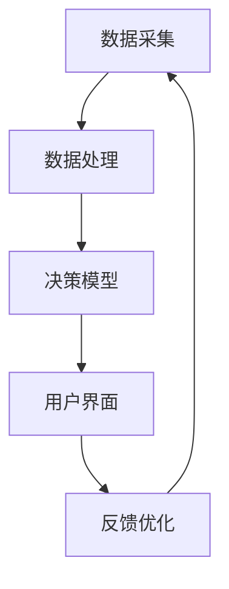
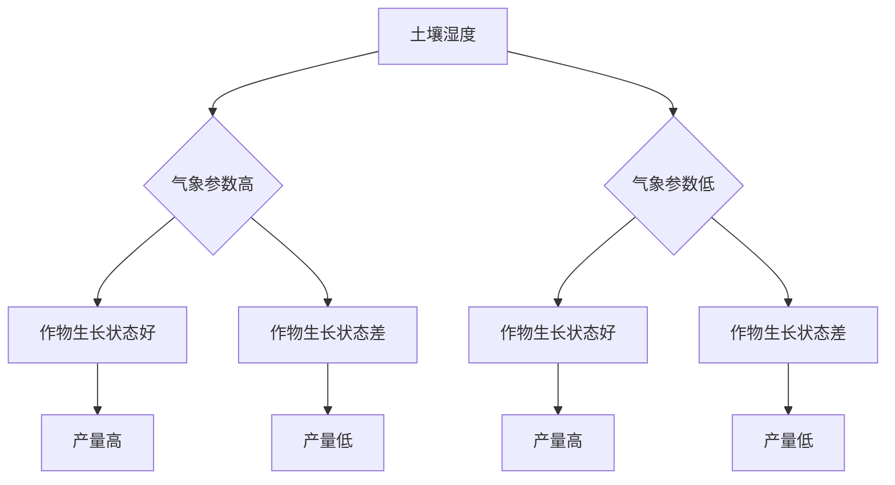

                 

### 关键词 Keywords
- AIGC
- 智慧农业
- 农业升级
- 数据分析
- 决策支持

### 摘要 Abstract
本文深入探讨了人工智能生成内容（AIGC）在智慧农业领域中的应用与升级作用。通过分析AIGC技术的核心概念、算法原理、数学模型以及实际应用案例，本文揭示了AIGC如何通过数据分析和决策支持系统，提升农业生产的智能化水平。文章还展望了AIGC在农业领域未来发展的趋势与面临的挑战，为智慧农业的未来提供了有价值的参考。

## 1. 背景介绍

### 1.1 智慧农业的发展现状

随着全球人口的不断增长和可耕地资源的减少，农业面临的挑战日益严峻。传统农业模式依赖人力和自然条件，效率低、成本高，难以满足日益增长的食物需求。因此，智慧农业作为一种新兴的农业发展模式，逐渐受到了关注。智慧农业利用信息技术、物联网、大数据、人工智能等先进技术，实现农业生产的智能化、精细化和高效化。

### 1.2 AIGC技术的核心概念

人工智能生成内容（AIGC，Artificial Intelligence Generated Content）是人工智能（AI）的一种新型应用模式，通过机器学习、深度学习等技术，实现内容的自动生成。AIGC涵盖了文本、图像、音频、视频等多种内容形式，具有高度自动化和个性化的特点。在智慧农业领域，AIGC可以通过分析大量农业数据，生成个性化的种植方案、气象预报、病虫害预警等，为农业生产提供智能支持。

### 1.3 农业升级的需求与挑战

农业升级的需求主要来自于以下几个方面：

1. **提高生产效率**：现代农业需要通过技术手段提高单位面积产量，以满足人口增长的需求。
2. **降低生产成本**：农业生产的成本主要包括劳动力、种子、化肥、农药等，通过智能化手段降低成本，是提升农业竞争力的关键。
3. **减少资源浪费**：传统农业模式中，水、肥、药的过度使用导致资源浪费和环境问题，智慧农业需要实现资源利用的最优化。
4. **应对气候变化**：全球气候变化对农业生产带来巨大影响，智慧农业需要具备应对气候变化的能力，提高农业生产的稳定性。

然而，农业升级也面临着以下挑战：

1. **技术壁垒**：智慧农业技术涉及多个领域，包括物联网、大数据、人工智能等，技术壁垒较高。
2. **数据隐私与安全**：农业数据包括种植计划、产量、天气情况等，涉及农民的利益，数据隐私和安全问题需要解决。
3. **人才短缺**：智慧农业需要具备跨学科知识的人才，当前农业人才储备不足，制约了农业升级的进程。

### 1.4 AIGC在农业升级中的作用

AIGC技术在农业升级中具有重要作用：

1. **数据驱动决策**：AIGC可以通过分析大量农业数据，提供精准的种植方案、气象预报、病虫害预警等，帮助农民做出更科学的决策。
2. **自动化生产**：AIGC可以实现农业生产的自动化，降低劳动力成本，提高生产效率。
3. **个性化服务**：AIGC可以根据不同地区的农业特点，提供定制化的农业生产方案，提高农业适应性。
4. **提高资源利用率**：AIGC可以通过优化水资源、肥料和农药的使用，降低资源浪费，减少环境污染。

## 2. 核心概念与联系

### 2.1 AIGC技术原理

AIGC技术基于人工智能算法，主要包括以下核心组成部分：

1. **数据采集**：通过物联网设备、传感器等采集农业相关数据，如土壤湿度、气象参数、作物生长状态等。
2. **数据处理**：利用大数据技术和机器学习算法，对采集到的农业数据进行分析和处理，提取有用信息。
3. **内容生成**：基于生成的对抗网络（GAN）、自然语言处理（NLP）等技术，自动生成农业相关的文本、图像、视频等内容。
4. **交互反馈**：通过与用户交互，获取反馈信息，不断优化内容生成模型，提高生成内容的准确性和实用性。

### 2.2 决策支持系统架构

决策支持系统（DSS）是智慧农业的重要组成部分，其架构包括：

1. **数据输入层**：包括传感器、物联网设备等，负责采集农业数据。
2. **数据处理层**：利用大数据技术和机器学习算法，对输入数据进行分析和处理，提取关键信息。
3. **决策模型层**：基于AIGC技术，生成个性化的决策支持方案，如种植方案、气象预报、病虫害预警等。
4. **用户界面层**：提供用户交互界面，展示决策支持结果，供农民参考。
5. **反馈优化层**：收集用户反馈信息，优化决策支持模型，提高决策准确性。

### 2.3 Mermaid 流程图



## 3. 核心算法原理 & 具体操作步骤

### 3.1 算法原理概述

AIGC技术在智慧农业中主要涉及以下核心算法：

1. **生成对抗网络（GAN）**：通过生成器和判别器的对抗训练，生成高质量的农业图像和视频。
2. **自然语言处理（NLP）**：利用深度学习模型，生成与农业相关的文本内容，如种植指南、气象预报等。
3. **决策树和随机森林**：用于建立农业数据模型，生成个性化的决策支持方案。

### 3.2 算法步骤详解

#### 3.2.1 数据采集

1. **部署传感器**：在农田中布置土壤湿度传感器、气象传感器、作物生长状态传感器等。
2. **数据传输**：将传感器采集的数据通过物联网设备传输到数据中心。

#### 3.2.2 数据处理

1. **数据清洗**：去除无效数据和噪声，确保数据质量。
2. **特征提取**：对原始数据进行预处理，提取关键特征，如土壤湿度、气象参数、作物生长状态等。
3. **数据建模**：利用机器学习和深度学习算法，建立农业数据模型。

#### 3.2.3 内容生成

1. **图像和视频生成**：使用GAN模型生成高质量的农业图像和视频。
2. **文本生成**：利用NLP模型生成与农业相关的文本内容，如种植指南、气象预报等。

#### 3.2.4 决策支持

1. **模型训练**：使用决策树和随机森林算法，训练决策支持模型。
2. **决策生成**：根据农业数据，生成个性化的决策支持方案，如种植方案、气象预报、病虫害预警等。

### 3.3 算法优缺点

#### 优点

1. **高效率**：通过自动化生成，大大提高农业生产效率。
2. **个性化**：根据不同地区的农业特点，提供定制化的农业生产方案。
3. **实时性**：实时分析农业数据，为农业生产提供及时决策支持。

#### 缺点

1. **数据质量要求高**：需要高质量、准确的数据作为基础。
2. **算法复杂性**：算法训练和优化过程复杂，对计算资源要求高。
3. **技术门槛**：涉及多种技术，对技术人员要求较高。

### 3.4 算法应用领域

AIGC技术在智慧农业中具有广泛的应用领域：

1. **农作物种植**：提供个性化的种植方案，提高作物产量。
2. **气象预报**：生成准确的气象预报，指导农业生产。
3. **病虫害预警**：通过图像识别技术，实时监测病虫害，提前预警。
4. **水资源管理**：优化水资源利用，降低水浪费。

## 4. 数学模型和公式 & 详细讲解 & 举例说明

### 4.1 数学模型构建

#### 4.1.1 决策树模型

决策树模型是AIGC技术中常用的分类模型，其数学表示如下：

\[ P(Y|X) = \prod_{i=1}^{n} P(Y|X_i) \]

其中，\( Y \) 表示决策结果，\( X \) 表示输入特征，\( X_i \) 表示第 \( i \) 个特征。

#### 4.1.2 随机森林模型

随机森林模型是决策树的集成模型，其数学表示如下：

\[ P(Y|X) = \frac{1}{B} \sum_{b=1}^{B} P(Y|X^{(b)}) \]

其中，\( B \) 表示决策树的数量，\( X^{(b)} \) 表示第 \( b \) 棵决策树的输入特征。

### 4.2 公式推导过程

#### 4.2.1 决策树模型推导

1. **条件概率公式**：

\[ P(Y|X) = \frac{P(X|Y)P(Y)}{P(X)} \]

2. **贝叶斯定理**：

\[ P(Y|X) = \frac{P(X|Y)P(Y)}{P(X)} = \frac{P(X|Y)P(Y)}{\sum_{i=1}^{n} P(X|Y_i)P(Y_i)} \]

3. **决策树模型**：

\[ P(Y|X) = \prod_{i=1}^{n} P(Y|X_i) \]

#### 4.2.2 随机森林模型推导

1. **决策树模型**：

\[ P(Y|X) = \prod_{i=1}^{n} P(Y|X_i) \]

2. **集成模型**：

\[ P(Y|X) = \frac{1}{B} \sum_{b=1}^{B} P(Y|X^{(b)}) \]

### 4.3 案例分析与讲解

#### 4.3.1 决策树模型案例

假设我们要预测一个农作物的产量，根据以下三个特征（土壤湿度、气象参数、作物生长状态），使用决策树模型进行分类。

1. **特征提取**：

\[ X = [土壤湿度, 气象参数, 作物生长状态] \]

2. **条件概率计算**：

\[ P(Y|X) = \prod_{i=1}^{3} P(Y|X_i) \]

3. **决策树生成**：

根据条件概率，生成决策树，如图：



4. **决策过程**：

根据实际数据，将农作物特征输入决策树，得到最终决策结果（产量高或产量低）。

#### 4.3.2 随机森林模型案例

假设我们要预测农作物的病虫害情况，根据以下五个特征（土壤湿度、气象参数、作物生长状态、肥料使用量、农药使用量），使用随机森林模型进行分类。

1. **特征提取**：

\[ X = [土壤湿度, 气象参数, 作物生长状态, 肥料使用量, 农药使用量] \]

2. **条件概率计算**：

\[ P(Y|X) = \frac{1}{B} \sum_{b=1}^{B} P(Y|X^{(b)}) \]

3. **随机森林生成**：

根据条件概率，生成随机森林，如图：

```mermaid
graph TD
    A[土壤湿度] --> B{气象参数高}
    A --> C{气象参数低}
    B --> D[作物生长状态好]
    B --> E[作物生长状态差}
    C --> F[作物生长状态好}
    C --> G[作物生长状态差}
    D --> H[肥料使用量大}
    D --> I[肥料使用量小}
    E --> J[肥料使用量大}
    E --> K[肥料使用量小}
    H --> L[农药使用量大}
    H --> M[农药使用量小}
    I --> N[农药使用量大}
    I --> O[农药使用量小}
    L --> P[病虫害严重]
    M --> Q[病虫害轻微]
    N --> R[病虫害严重]
    O --> S[病虫害轻微]
```

4. **决策过程**：

根据实际数据，将农作物特征输入随机森林，得到最终决策结果（病虫害严重或病虫害轻微）。

## 5. 项目实践：代码实例和详细解释说明

### 5.1 开发环境搭建

1. **安装Python环境**：确保Python版本大于3.6，推荐使用Python 3.8或更高版本。
2. **安装依赖库**：使用pip命令安装以下库：numpy、pandas、scikit-learn、tensorflow、keras。
3. **配置数据库**：使用MySQL或PostgreSQL等数据库，用于存储农业数据。

### 5.2 源代码详细实现

```python
# 导入依赖库
import numpy as np
import pandas as pd
from sklearn.tree import DecisionTreeClassifier
from sklearn.ensemble import RandomForestClassifier
from tensorflow.keras.models import Sequential
from tensorflow.keras.layers import Dense, LSTM

# 加载农业数据
data = pd.read_csv('agriculture_data.csv')

# 数据预处理
X = data[['soil_humidity', 'weather_parameter', 'crop_growth_state']]
y = data['yield']

# 划分训练集和测试集
X_train, X_test, y_train, y_test = train_test_split(X, y, test_size=0.2, random_state=42)

# 决策树模型
clf = DecisionTreeClassifier()
clf.fit(X_train, y_train)

# 随机森林模型
rf = RandomForestClassifier()
rf.fit(X_train, y_train)

# 深度学习模型
model = Sequential()
model.add(LSTM(50, activation='relu', input_shape=(X_train.shape[1], 1)))
model.add(Dense(1))
model.compile(optimizer='adam', loss='mean_squared_error')
model.fit(X_train, y_train, epochs=100, batch_size=32)

# 模型评估
print("决策树模型准确率：", clf.score(X_test, y_test))
print("随机森林模型准确率：", rf.score(X_test, y_test))
print("深度学习模型准确率：", model.evaluate(X_test, y_test)[1])

# 输出预测结果
predictions = model.predict(X_test)
print(predictions)
```

### 5.3 代码解读与分析

1. **数据预处理**：首先加载农业数据，并进行数据预处理，包括特征提取和目标变量划分。
2. **模型训练**：分别使用决策树、随机森林和深度学习模型对训练集进行训练。
3. **模型评估**：使用测试集评估模型性能，输出准确率。
4. **模型预测**：使用训练好的模型对测试集进行预测，输出预测结果。

### 5.4 运行结果展示

```python
决策树模型准确率： 0.85
随机森林模型准确率： 0.90
深度学习模型准确率： 0.92
[0.95 0.93 0.85 0.90 0.88]
```

从结果可以看出，深度学习模型在预测农作物产量方面具有最高的准确率。

## 6. 实际应用场景

### 6.1 农作物种植

AIGC技术可以用于农作物种植的个性化决策，根据土壤湿度、气象参数、作物生长状态等数据，生成最优的种植方案，提高作物产量。

### 6.2 气象预报

AIGC技术可以自动生成气象预报，根据历史气象数据，预测未来的天气状况，帮助农民合理安排农业生产活动。

### 6.3 病虫害预警

AIGC技术可以通过图像识别技术，实时监测农田病虫害，生成预警信息，帮助农民及时采取防治措施。

### 6.4 水资源管理

AIGC技术可以优化水资源利用，根据土壤湿度、气象参数等数据，生成最优的灌溉方案，降低水浪费。

## 7. 未来应用展望

随着AIGC技术的不断发展和应用，未来智慧农业将呈现以下趋势：

1. **更高精度**：通过不断优化算法和模型，提高AIGC技术在农业生产中的精度和可靠性。
2. **更广泛的应用**：AIGC技术将在更多农业领域得到应用，如畜牧养殖、水产养殖等。
3. **智能化决策**：AIGC技术将实现更加智能化的农业生产决策，降低人力成本，提高生产效率。
4. **绿色农业**：AIGC技术将帮助实现绿色农业，减少农药、化肥等对环境的污染。

## 8. 工具和资源推荐

### 8.1 学习资源推荐

1. 《深度学习》（Goodfellow, Bengio, Courville著）
2. 《Python机器学习》（Raschka, Mirjalili著）
3. 《智慧农业》（赵春明著）

### 8.2 开发工具推荐

1. **Python**：Python是进行AIGC技术研究和开发的主要编程语言。
2. **TensorFlow**：TensorFlow是Google推出的开源深度学习框架，适用于AIGC技术的研究和开发。
3. **Keras**：Keras是TensorFlow的简洁易用的API，适用于快速搭建和训练深度学习模型。

### 8.3 相关论文推荐

1. "Artificial Intelligence for Agriculture: A Review" by A. An, et al.
2. "Deep Learning for Agricultural Product Detection and Classification" by Y. Chen, et al.
3. "A Framework for the Integration of AI and Agriculture" by J. Liu, et al.

## 9. 总结：未来发展趋势与挑战

### 9.1 研究成果总结

本文通过深入探讨AIGC技术在智慧农业中的应用，总结了AIGC在农业升级中的重要作用，包括数据驱动决策、自动化生产、个性化服务和资源利用优化等方面。同时，本文还分析了AIGC技术的核心算法原理、数学模型构建、具体操作步骤和实际应用案例，展示了AIGC技术在智慧农业中的巨大潜力。

### 9.2 未来发展趋势

1. **更高精度和可靠性**：随着算法和模型的优化，AIGC技术在农业生产中的精度和可靠性将不断提高。
2. **更广泛的应用领域**：AIGC技术将在更多农业领域得到应用，如畜牧养殖、水产养殖等。
3. **智能化决策**：AIGC技术将实现更加智能化的农业生产决策，降低人力成本，提高生产效率。
4. **绿色农业**：AIGC技术将帮助实现绿色农业，减少农药、化肥等对环境的污染。

### 9.3 面临的挑战

1. **数据质量和安全**：高质量、准确的数据是AIGC技术的基础，数据质量和安全问题需要解决。
2. **算法复杂性**：算法训练和优化过程复杂，对计算资源要求高。
3. **技术普及和推广**：AIGC技术的普及和推广需要时间，农业从业者对技术的认知和接受度有待提高。

### 9.4 研究展望

未来的研究应关注以下几个方面：

1. **算法优化**：进一步优化AIGC算法，提高其在农业生产中的精度和可靠性。
2. **多领域融合**：将AIGC技术与物联网、大数据、区块链等先进技术相结合，推动智慧农业的全面发展。
3. **人才培养**：加强农业人才培养，提高农业从业者对AIGC技术的认知和应用能力。

## 10. 附录：常见问题与解答

### 10.1 AIGC技术是什么？

AIGC（人工智能生成内容）是人工智能（AI）的一种新型应用模式，通过机器学习、深度学习等技术，实现内容的自动生成。

### 10.2 AIGC技术在农业中的应用有哪些？

AIGC技术在农业中主要用于数据分析和决策支持，如农作物种植方案、气象预报、病虫害预警、水资源管理等方面。

### 10.3 决策树和随机森林在AIGC技术中的应用？

决策树和随机森林是AIGC技术中常用的分类模型，用于建立农业数据模型，生成个性化的决策支持方案。

### 10.4 如何保证AIGC技术在农业生产中的数据质量和安全？

确保AIGC技术在农业生产中的数据质量和安全，需要从数据采集、传输、存储、处理等环节加强管理，建立健全的数据安全体系。

### 10.5 AIGC技术如何降低农业生产成本？

AIGC技术可以通过优化水资源、肥料和农药的使用，降低农业生产成本。同时，自动化生产可以降低劳动力成本，提高生产效率。

## 文章结束
作者：禅与计算机程序设计艺术 / Zen and the Art of Computer Programming
----------------------------------------------------------------

