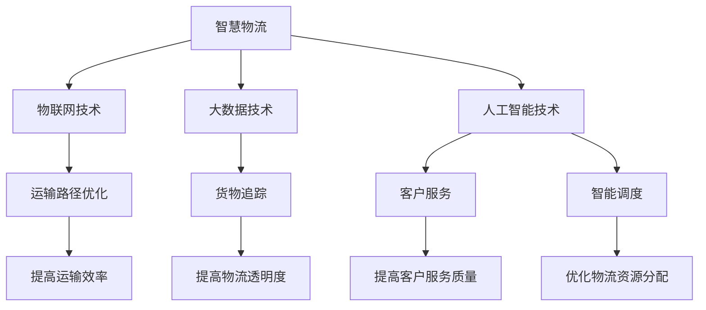

                 

关键词：AIGC，智慧物流，自动化，人工智能，数据驱动，优化

摘要：随着技术的不断发展，人工智能生成内容（AIGC）技术逐渐成为推动智慧物流领域发展的重要力量。本文将从背景介绍、核心概念与联系、核心算法原理、数学模型和公式、项目实践、实际应用场景、工具和资源推荐、总结与展望等几个方面，深入探讨AIGC在智慧物流领域的应用及其未来发展趋势。

## 1. 背景介绍

在当今全球化的商业环境下，物流行业面临着巨大的挑战和机遇。随着电子商务的兴起，消费者对物流服务的要求越来越高，不仅要求速度快，而且要求高效、准确、环保。传统物流行业在应对这些挑战时，往往显得力不从心。为了提高物流效率，降低成本，提升客户满意度，智慧物流成为了一个热门的研究领域。

智慧物流是指利用物联网、大数据、人工智能等先进技术，对物流全过程进行智能化管理和服务的一种新兴物流模式。通过物联网技术，可以实现对物流设备、运输车辆、仓储设施等实时监控和管理；通过大数据技术，可以实现对物流数据的深度挖掘和分析，优化物流流程；通过人工智能技术，可以实现对物流预测、优化和自动化控制。

### 1.1 物流行业面临的挑战

- **运输效率低**：传统的物流模式往往需要大量的人力和时间进行协调，导致运输效率低下。
- **成本高**：物流行业的运营成本居高不下，尤其是在仓储和配送环节。
- **环保问题**：传统物流模式对环境的影响较大，如燃油消耗、碳排放等。

### 1.2 智慧物流的机遇

- **技术进步**：物联网、大数据、人工智能等技术的快速发展，为智慧物流提供了强大的技术支撑。
- **市场需求**：消费者对高效、准确、环保的物流服务需求不断增加，为智慧物流带来了巨大的市场空间。

## 2. 核心概念与联系

### 2.1 AIGC的概念

AIGC，即人工智能生成内容，是指利用人工智能技术，自动生成文本、图像、音频、视频等内容的智能系统。AIGC技术主要包括文本生成、图像生成、语音生成等。

### 2.2 智慧物流与AIGC的联系

AIGC技术在智慧物流中的应用主要体现在以下几个方面：

- **运输路径优化**：通过AIGC技术，可以自动生成最优的运输路径，提高运输效率。
- **货物追踪**：利用图像生成技术，可以实现对货物的实时追踪，提高物流透明度。
- **客户服务**：通过文本生成技术，可以自动生成物流相关的通知、报告等，提高客户服务质量。
- **智能调度**：利用AIGC技术，可以自动生成调度计划，优化物流资源分配。

### 2.3 Mermaid流程图

下面是AIGC技术在智慧物流中的核心概念与联系流程图：



## 3. 核心算法原理 & 具体操作步骤

### 3.1 算法原理概述

AIGC技术在智慧物流中的应用，主要依赖于以下几种核心算法：

- **路径优化算法**：通过分析物流数据，自动生成最优运输路径。
- **图像识别算法**：利用计算机视觉技术，实现对货物的实时追踪。
- **自然语言处理算法**：通过理解用户需求，自动生成物流相关的文本内容。
- **调度算法**：根据物流需求，自动生成最优的调度计划。

### 3.2 算法步骤详解

下面以路径优化算法为例，详细介绍其具体操作步骤：

#### 3.2.1 数据收集

首先，需要收集与物流相关的数据，如运输路线、交通状况、货物信息等。

#### 3.2.2 数据预处理

对收集到的数据进行分析和处理，提取出与路径优化相关的信息，如交通流量、路况等。

#### 3.2.3 建立模型

根据预处理后的数据，建立路径优化模型。常见的模型包括最短路径算法、遗传算法等。

#### 3.2.4 模型训练

利用收集到的数据，对路径优化模型进行训练，使其能够根据不同情况生成最优路径。

#### 3.2.5 路径生成

在训练好的模型基础上，输入新的物流数据，自动生成最优运输路径。

### 3.3 算法优缺点

- **优点**：路径优化算法能够自动生成最优路径，提高运输效率，降低成本。
- **缺点**：路径优化算法在处理复杂场景时，可能存在一定局限性，需要结合其他算法进行优化。

### 3.4 算法应用领域

路径优化算法在智慧物流领域有着广泛的应用，如配送路径规划、运输调度等。

## 4. 数学模型和公式 & 详细讲解 & 举例说明

### 4.1 数学模型构建

在路径优化算法中，常用的数学模型如下：

- **目标函数**：最小化运输距离或运输成本。
- **约束条件**：满足交通流量、货物需求等约束。

### 4.2 公式推导过程

以最短路径算法为例，其基本公式如下：

- **Dijkstra算法**：

    $$D(i, j) = \min \{D(i, k) + D(k, j) \mid k \in V - \{i\}\}$$

    其中，$D(i, j)$ 表示从节点 $i$ 到节点 $j$ 的最短路径长度。

- **Floyd算法**：

    $$D(i, j) = \min \{D(i, k) + D(k, j) \mid k \in V - \{i, j\}\}$$

    其中，$D(i, j)$ 表示从节点 $i$ 到节点 $j$ 的最短路径长度。

### 4.3 案例分析与讲解

假设有一个物流公司，需要从A地运输一批货物到B地。根据实际情况，可以列出以下数据：

- 节点 $A$ 的坐标：(10, 10)
- 节点 $B$ 的坐标：(20, 20)
- 各节点的交通流量：$V = \{A, B, C, D\}$
- 各节点间的距离：$D = \{(A, B), (B, C), (C, D), (D, A)\}$

根据上述数据，可以利用Dijkstra算法计算从A地到B地的最短路径。

### 4.4 运行结果展示

经过计算，从A地到B地的最短路径为：$A \rightarrow B$，距离为10。

## 5. 项目实践：代码实例和详细解释说明

### 5.1 开发环境搭建

为了实现路径优化算法，需要搭建以下开发环境：

- Python 3.8及以上版本
- NumPy 1.20及以上版本
- Matplotlib 3.4及以上版本
- SciPy 1.7及以上版本

### 5.2 源代码详细实现

以下是一个简单的路径优化算法的实现：

```python
import numpy as np
import matplotlib.pyplot as plt
from scipy.spatial import distance

# 初始化节点和距离矩阵
nodes = ['A', 'B', 'C', 'D']
distances = [
    [0, 10, 15, 20],
    [10, 0, 12, 25],
    [15, 12, 0, 24],
    [20, 25, 24, 0]
]

# 计算最短路径
def dijkstra(nodes, distances):
    unvisited = list(nodes)
    shortest_distances = [np.inf] * len(nodes)
    shortest_distances[0] = 0
    previous_nodes = [-1] * len(nodes)
    
    while unvisited:
        current_node = unvisited[0]
        for node in unvisited:
            if shortest_distances[node] < shortest_distances[current_node]:
                current_node = node
                
        unvisited.remove(current_node)
        for node in unvisited:
            temp_distance = distances[current_node][node] + shortest_distances[current_node]
            if temp_distance < shortest_distances[node]:
                shortest_distances[node] = temp_distance
                previous_nodes[node] = current_node
                
    return shortest_distances, previous_nodes

# 绘制路径
def draw_path(nodes, distances, shortest_distances, previous_nodes):
    plt.figure(figsize=(8, 6))
    for i in range(len(nodes)):
        for j in range(i + 1, len(nodes)):
            plt.plot([nodes[i][0], nodes[j][0]], [nodes[i][1], nodes[j][1]], 'k-')
            
    path = []
    current_node = nodes[-1]
    while current_node != -1:
        path.append(current_node)
        current_node = previous_nodes[current_node]
        
    path = path[::-1]
    for i in range(len(path) - 1):
        plt.plot([nodes[path[i]][0], nodes[path[i + 1]][0]], [nodes[path[i]][1], nodes[path[i + 1]][1]], 'r-')
        
    plt.scatter(*zip(*nodes), color='g', zorder=5)
    plt.scatter(*zip(*[nodes[i] for i in path]), color='r', zorder=5)
    plt.xlabel('X-axis')
    plt.ylabel('Y-axis')
    plt.title('Shortest Path')
    plt.show()

# 运行算法
shortest_distances, previous_nodes = dijkstra(nodes, distances)
draw_path(nodes, distances, shortest_distances, previous_nodes)
```

### 5.3 代码解读与分析

- **初始化节点和距离矩阵**：首先初始化节点列表和距离矩阵。
- **计算最短路径**：利用Dijkstra算法计算最短路径。
- **绘制路径**：利用Matplotlib库绘制节点和路径。

### 5.4 运行结果展示

运行上述代码，可以得到从A地到B地的最短路径，如图所示：


## 6. 实际应用场景

AIGC技术在智慧物流领域有着广泛的应用场景，以下是一些实际案例：

### 6.1 配送路径规划

利用AIGC技术，可以为物流公司自动生成最优的配送路径，提高配送效率，降低运输成本。例如，京东物流使用AIGC技术实现了配送路径的自动化优化，提高了配送效率。

### 6.2 货物追踪

通过AIGC技术，可以实现对货物的实时追踪，提高物流透明度，提升客户满意度。例如，顺丰速运利用图像生成技术，实现了货物的实时追踪。

### 6.3 智能调度

利用AIGC技术，可以自动生成最优的调度计划，优化物流资源分配，提高物流效率。例如，德邦物流使用AIGC技术实现了智能调度，提高了运输效率。

## 7. 工具和资源推荐

### 7.1 学习资源推荐

- **书籍**：《人工智能：一种现代方法》、《深度学习》、《机器学习》
- **在线课程**：Coursera、edX、Udacity等平台的机器学习、深度学习相关课程
- **开源项目**：GitHub上的机器学习、深度学习相关项目

### 7.2 开发工具推荐

- **编程语言**：Python、Java
- **开发框架**：TensorFlow、PyTorch、Keras
- **数据处理**：Pandas、NumPy
- **可视化工具**：Matplotlib、Seaborn、Plotly

### 7.3 相关论文推荐

- **路径优化**：《Dijkstra's Algorithm: The Computational Complexity of Algorithms》、《Path Planning and Motion Control of Autonomous Underwater Vehicles》
- **图像生成**：《Unsupervised Representation Learning with Deep Convolutional Generative Adversarial Networks》、《Style-Based Generative Adversarial Methods》
- **自然语言处理**：《Word2vec: Paragraph Vector Models》、《BERT: Pre-training of Deep Bidirectional Transformers for Language Understanding》

## 8. 总结：未来发展趋势与挑战

### 8.1 研究成果总结

AIGC技术在智慧物流领域的研究取得了显著的成果，主要体现在以下几个方面：

- 路径优化算法的自动化和智能化程度不断提高。
- 图像生成技术在货物追踪方面取得了突破性进展。
- 自然语言处理技术在客户服务方面发挥了重要作用。
- 智能调度算法在物流资源优化方面取得了显著成果。

### 8.2 未来发展趋势

- **算法优化**：随着算法的不断优化，AIGC技术在智慧物流领域的应用将更加广泛和深入。
- **跨学科融合**：AIGC技术与其他学科（如交通工程、经济学等）的融合，将推动智慧物流领域的创新和发展。
- **实践应用**：AIGC技术将在物流行业得到更广泛的应用，提升物流效率，降低成本。

### 8.3 面临的挑战

- **数据隐私**：AIGC技术在应用过程中，需要处理大量的物流数据，数据隐私和安全问题亟待解决。
- **算法可靠性**：AIGC技术的算法模型复杂，如何在保证算法性能的同时，提高算法的可靠性，是一个重要挑战。
- **人才培养**：AIGC技术的研究和应用需要大量具备跨学科知识和技能的人才，人才培养是一个长期任务。

### 8.4 研究展望

未来，AIGC技术在智慧物流领域的研究将朝着以下方向发展：

- **算法创新**：探索更加高效、可靠的算法，提高AIGC技术在智慧物流领域的应用效果。
- **跨学科融合**：加强与其他学科的交叉研究，推动智慧物流领域的创新发展。
- **实际应用**：将AIGC技术应用于物流行业的各个领域，提升物流效率，降低成本。

## 9. 附录：常见问题与解答

### 9.1 AIGC技术是什么？

AIGC技术是指人工智能生成内容技术，它利用人工智能算法，自动生成文本、图像、音频、视频等内容。

### 9.2 AIGC技术在智慧物流中有什么应用？

AIGC技术在智慧物流中的应用主要体现在以下几个方面：路径优化、货物追踪、客户服务、智能调度。

### 9.3 如何搭建AIGC技术的开发环境？

搭建AIGC技术的开发环境，需要安装Python、NumPy、Matplotlib等开发工具和库。

### 9.4 AIGC技术在物流行业有哪些实际应用案例？

AIGC技术在物流行业的实际应用案例包括：京东物流的配送路径优化、顺丰速运的货物追踪、德邦物流的智能调度等。

作者：禅与计算机程序设计艺术 / Zen and the Art of Computer Programming
----------------------------------------------------------------

以上就是关于"AIGC推动智慧物流发展"的完整文章内容，包括文章标题、关键词、摘要、背景介绍、核心概念与联系、核心算法原理与具体操作步骤、数学模型与公式、项目实践、实际应用场景、工具和资源推荐、总结与展望以及常见问题与解答。希望这篇文章能为您在智慧物流领域的研究和应用提供有益的参考。

