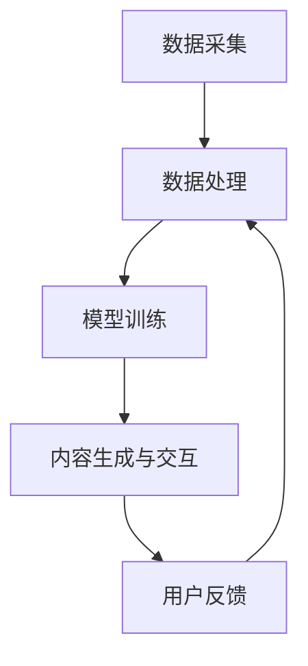

                 

 在当今信息爆炸和技术飞速发展的时代，人工智能（AI）已经成为推动各行各业进步的重要力量。特别是在办公领域，人工智能的应用正在逐步改变传统的办公模式，提升工作效率，优化工作流程。本文将围绕人工智能生成内容（AIGC，Artificial Intelligence Generated Content）在智能办公中的应用，探讨其如何推动办公升级，以及相关技术、应用场景、未来展望等内容。

## 关键词

- 人工智能
- 智能办公
- AIGC
- 工作流程优化
- 工作效率提升

## 摘要

本文旨在探讨人工智能生成内容（AIGC）在智能办公中的应用与价值。文章首先介绍了AIGC的概念及其与智能办公的关联，随后详细阐述了AIGC的核心技术原理、应用领域，并通过具体案例分析了其在办公中的实际效果。最后，文章展望了AIGC的未来发展前景，探讨了可能面临的挑战以及应对策略。

## 1. 背景介绍

### 1.1 智能办公的发展历程

智能办公并不是一个全新的概念，而是随着计算机技术、互联网技术以及人工智能技术的不断发展而逐渐成熟的。在早期，办公自动化主要是通过计算机硬件和软件的自动化处理来提高工作效率，如文字处理、电子表格等基础应用。随着互联网的普及，办公自动化逐渐扩展到了电子邮件、即时通讯、在线协作等领域。

近年来，随着人工智能技术的突破，智能办公进入了一个新的阶段。人工智能不仅能够处理大量的数据，还能通过机器学习、自然语言处理等技术，自动生成内容，智能分析，甚至预测趋势。这种基于人工智能的智能办公，更加注重个性化和智能化，能够根据用户的需求和习惯，自动调整办公流程，提供定制化的服务。

### 1.2 人工智能生成内容（AIGC）的概念

人工智能生成内容（AIGC）是指利用人工智能技术自动生成文字、图片、音频、视频等多种类型的内容。AIGC的核心技术包括自然语言生成（NLG）、计算机视觉、语音合成等。AIGC不仅可以生成全新的内容，还可以对现有内容进行改写、优化和扩展，从而大大提高内容生产的效率和灵活性。

### 1.3 AIGC在智能办公中的重要性

AIGC的出现为智能办公带来了全新的可能性和变革。首先，AIGC可以自动处理大量的文档和报告，快速生成高质量的文本内容，大大减少了人工的工作量。其次，AIGC可以基于用户的行为数据，自动生成个性化的报告和建议，帮助用户更好地理解自己的工作状态和效率。此外，AIGC还可以通过智能分析，自动识别潜在的业务机会，提供决策支持。

总的来说，AIGC不仅提高了办公效率，还增强了办公的智能化程度，为智能办公的升级提供了强有力的技术支持。

## 2. 核心概念与联系

### 2.1 人工智能生成内容（AIGC）的原理

AIGC的核心技术包括自然语言生成（NLG）、计算机视觉、语音合成等。下面将分别介绍这些技术的基本原理。

#### 2.1.1 自然语言生成（NLG）

自然语言生成（NLG）是AIGC的核心技术之一，它通过深度学习模型，将机器理解的数据转换为自然流畅的文本。NLG模型通常使用大规模的语料库进行训练，通过学习语言的统计规律和语法规则，能够生成高质量的文本内容。NLG的主要任务包括文本摘要、文本生成、对话系统等。

#### 2.1.2 计算机视觉

计算机视觉是指让计算机理解和解释图像或视频中的内容。计算机视觉技术包括图像识别、目标检测、图像分割、图像生成等。通过计算机视觉技术，AIGC可以自动生成高质量的图片和视频内容。

#### 2.1.3 语音合成

语音合成技术通过将文本转换为自然流畅的语音，为AIGC提供了音频内容的生成能力。语音合成技术通常使用深度神经网络，通过训练大量的语音数据，生成逼真的语音。

### 2.2 AIGC与智能办公的关联

AIGC与智能办公的关联主要体现在以下几个方面：

1. **内容生成**：AIGC可以自动生成各种类型的办公文档，如报告、邮件、PPT等，大大提高了文档处理的效率。

2. **数据分析**：AIGC可以通过自然语言处理技术，对大量的办公数据进行智能分析，提供决策支持。

3. **智能助手**：AIGC可以扮演智能助手的角色，帮助用户完成各种办公任务，如日程管理、任务分配、邮件提醒等。

4. **个性化服务**：AIGC可以根据用户的行为和需求，自动生成个性化的内容，提高办公体验。

### 2.3 AIGC在智能办公中的架构

AIGC在智能办公中的架构通常包括以下几个关键组件：

1. **数据采集**：通过传感器、用户行为数据等渠道收集办公环境中的各种数据。

2. **数据处理**：使用数据清洗、数据挖掘等技术，对采集到的数据进行处理，提取有用的信息。

3. **模型训练**：使用处理后的数据，通过深度学习等技术，训练出用于内容生成、数据分析等的模型。

4. **内容生成与交互**：利用训练好的模型，自动生成办公文档、提供决策支持、与用户进行交互。

### 2.4 Mermaid流程图

下面是一个简化的AIGC在智能办公中的应用流程图：



## 3. 核心算法原理 & 具体操作步骤

### 3.1 算法原理概述

AIGC的核心算法主要包括自然语言生成（NLG）、计算机视觉、语音合成等技术。下面将分别介绍这些算法的基本原理。

#### 3.1.1 自然语言生成（NLG）

自然语言生成（NLG）是基于深度学习的文本生成技术。它通过训练大规模的语料库，学习语言的统计规律和语法规则，生成自然流畅的文本。NLG算法通常包括以下几个步骤：

1. **数据预处理**：对语料库进行清洗、分词、词性标注等预处理操作。
2. **模型训练**：使用预处理后的数据，通过循环神经网络（RNN）或变换器（Transformer）等深度学习模型进行训练。
3. **文本生成**：使用训练好的模型，根据输入的提示或问题，生成相应的文本内容。

#### 3.1.2 计算机视觉

计算机视觉是基于深度学习的技术，用于理解和解释图像或视频中的内容。计算机视觉算法通常包括以下几个步骤：

1. **图像预处理**：对图像进行缩放、裁剪、增强等预处理操作。
2. **特征提取**：使用卷积神经网络（CNN）等深度学习模型，从预处理后的图像中提取特征。
3. **目标检测与识别**：使用提取到的特征，通过目标检测算法（如YOLO、SSD等）和分类算法（如SVM、softmax等），对图像中的目标进行检测和识别。
4. **图像生成**：基于提取到的特征，通过生成对抗网络（GAN）等技术，生成新的图像内容。

#### 3.1.3 语音合成

语音合成是通过将文本转换为自然流畅的语音的技术。语音合成算法通常包括以下几个步骤：

1. **文本处理**：对输入的文本进行分词、标注音素等处理。
2. **声学模型训练**：使用大量的语音数据，通过循环神经网络（RNN）或卷积神经网络（CNN）等深度学习模型，训练声学模型。
3. **语音生成**：使用训练好的声学模型，根据文本输入，生成相应的语音内容。

### 3.2 算法步骤详解

下面将详细描述AIGC的核心算法步骤，包括数据采集、数据处理、模型训练、内容生成与交互等。

#### 3.2.1 数据采集

数据采集是AIGC的基础，它决定了后续数据处理和模型训练的质量。数据采集可以通过以下几种方式：

1. **用户行为数据**：通过使用传感器、用户行为跟踪等技术，收集用户在办公环境中的行为数据，如文档操作、邮件交互、会议记录等。
2. **公开数据集**：使用公开的办公文档数据集，如GitHub、arXiv等，进行数据采集。
3. **定制数据集**：根据特定的办公需求，定制化地采集数据，如特定行业的数据、特定企业的数据等。

#### 3.2.2 数据处理

数据处理是AIGC的核心步骤之一，它决定了数据的质量和模型的性能。数据处理包括以下步骤：

1. **数据清洗**：对采集到的数据进行去重、去噪、填补缺失值等处理，确保数据的质量。
2. **数据预处理**：对数据进行分词、词性标注、词嵌入等预处理操作，为后续的模型训练做好准备。
3. **数据增强**：通过数据扩增、数据变换等技术，增加数据的多样性，提高模型的泛化能力。

#### 3.2.3 模型训练

模型训练是AIGC的核心步骤，它决定了AIGC的性能和效果。模型训练包括以下步骤：

1. **模型选择**：根据具体的应用场景，选择合适的模型架构，如Transformer、BERT、GAN等。
2. **训练策略**：制定合理的训练策略，如批量大小、学习率、训练时间等。
3. **模型评估**：使用验证集或测试集，对训练好的模型进行评估，选择性能最佳的模型。

#### 3.2.4 内容生成与交互

内容生成与交互是AIGC的核心任务之一，它决定了AIGC的实际应用效果。内容生成与交互包括以下步骤：

1. **文本生成**：使用训练好的自然语言生成（NLG）模型，根据用户输入的提示或问题，生成相应的文本内容。
2. **图像生成**：使用训练好的计算机视觉模型，根据用户输入的描述或需求，生成相应的图像内容。
3. **语音生成**：使用训练好的语音合成模型，根据文本输入，生成相应的语音内容。
4. **用户交互**：通过文本、图像、语音等多种形式，与用户进行交互，提供个性化的服务。

### 3.3 算法优缺点

AIGC作为一种先进的技术，具有以下优点和缺点：

#### 优点：

1. **高效性**：AIGC可以自动处理大量的数据，生成高质量的内容，大大提高了工作效率。
2. **个性化**：AIGC可以根据用户的需求和习惯，自动生成个性化的内容，提供定制化的服务。
3. **灵活性**：AIGC可以处理多种类型的内容，如文本、图像、语音等，具有广泛的适用性。

#### 缺点：

1. **质量参差不齐**：由于训练数据的多样性和质量参差不齐，生成的文本、图像、语音等内容的品质可能存在差异。
2. **安全性**：AIGC生成的文本、图像、语音等内容可能存在安全隐患，如恶意内容、侵权等。
3. **隐私问题**：AIGC在处理用户数据时，可能涉及到用户隐私的问题，需要采取相应的保护措施。

### 3.4 算法应用领域

AIGC在智能办公中的应用非常广泛，可以应用于以下领域：

1. **文档处理**：自动生成报告、邮件、PPT等办公文档，提高文档处理效率。
2. **数据分析**：智能分析办公数据，提供决策支持，优化工作流程。
3. **智能助手**：提供日程管理、任务分配、邮件提醒等个性化服务。
4. **内容创作**：自动生成创意内容，如广告、宣传材料等，提高内容创作效率。

## 4. 数学模型和公式 & 详细讲解 & 举例说明

### 4.1 数学模型构建

AIGC的数学模型主要涉及自然语言生成（NLG）、计算机视觉和语音合成等领域。以下将分别介绍这些领域的数学模型。

#### 4.1.1 自然语言生成（NLG）

自然语言生成（NLG）的数学模型通常是基于深度学习模型，如循环神经网络（RNN）、变换器（Transformer）等。以下是一个简化的NLG模型：

1. **编码器（Encoder）**：
   $$h = \text{Encoder}(x)$$
   其中，$x$ 是输入的文本序列，$h$ 是编码后的隐状态。

2. **解码器（Decoder）**：
   $$p(y_t|y_{t-1}, x) = \text{Decoder}(y_{t-1}, h)$$
   其中，$y_t$ 是当前生成的文本，$y_{t-1}$ 是前一个生成的文本，$p(y_t|y_{t-1}, x)$ 是当前生成的文本的概率。

3. **损失函数**：
   $$L = -\sum_t y_t \log p(y_t|y_{t-1}, x)$$
   其中，$L$ 是损失函数，用于衡量生成的文本与真实文本之间的差距。

#### 4.1.2 计算机视觉

计算机视觉的数学模型主要基于卷积神经网络（CNN）和生成对抗网络（GAN）。

1. **卷积神经网络（CNN）**：
   $$f(x) = \text{ReLU}(\text{Conv}(W_1 \cdot x + b_1))$$
   其中，$x$ 是输入的图像，$W_1$ 是卷积核，$b_1$ 是偏置，$\text{ReLU}$ 是ReLU激活函数。

2. **生成对抗网络（GAN）**：
   - **生成器（Generator）**：
     $$G(z) = \text{ReLU}(\text{Conv}(W_2 \cdot z + b_2))$$
     其中，$z$ 是输入的随机噪声，$G(z)$ 是生成的图像。
   - **判别器（Discriminator）**：
     $$D(x) = \text{ReLU}(\text{Conv}(W_3 \cdot x + b_3))$$
     其中，$x$ 是输入的图像，$D(x)$ 是判别器对图像的真实性的判断。

3. **损失函数**：
   - **生成器损失**：
     $$L_G = -\log D(G(z))$$
   - **判别器损失**：
     $$L_D = -\log D(x) - \log(1 - D(G(z)))$$

#### 4.1.3 语音合成

语音合成的数学模型主要基于循环神经网络（RNN）和转换器（Transformer）。

1. **编码器（Encoder）**：
   $$h = \text{Encoder}(x)$$
   其中，$x$ 是输入的文本序列，$h$ 是编码后的隐状态。

2. **解码器（Decoder）**：
   $$p(y_t|y_{t-1}, h) = \text{Decoder}(y_{t-1}, h)$$
   其中，$y_t$ 是当前生成的语音，$y_{t-1}$ 是前一个生成的语音，$p(y_t|y_{t-1}, h)$ 是当前生成的语音的概率。

3. **损失函数**：
   $$L = -\sum_t y_t \log p(y_t|y_{t-1}, h)$$
   其中，$L$ 是损失函数，用于衡量生成的语音与真实语音之间的差距。

### 4.2 公式推导过程

以下是自然语言生成（NLG）模型的一些关键公式的推导过程。

#### 4.2.1 编码器（Encoder）

编码器的主要任务是编码输入的文本序列，生成隐状态序列。以下是编码器的推导过程：

1. **输入文本序列**：
   $$x = [x_1, x_2, ..., x_T]$$
   其中，$T$ 是文本序列的长度，$x_t$ 是第$t$个文本词。

2. **词嵌入**：
   $$e_t = \text{Embedding}(x_t)$$
   其中，$e_t$ 是第$t$个词的嵌入向量。

3. **循环神经网络（RNN）**：
   $$h_t = \text{RNN}(e_t, h_{t-1})$$
   其中，$h_t$ 是第$t$个隐状态，$h_{t-1}$ 是前一个隐状态。

4. **时间步迭代**：
   $$h = [h_1, h_2, ..., h_T]$$
   其中，$h$ 是编码后的隐状态序列。

#### 4.2.2 解码器（Decoder）

解码器的主要任务是解码隐状态序列，生成输出的文本序列。以下是解码器的推导过程：

1. **初始状态**：
   $$h_0 = \text{Encoder}(h)$$
   其中，$h$ 是编码后的隐状态序列。

2. **解码器（Transformer）**：
   $$y_t = \text{Decoder}(h_0, h_t)$$
   其中，$y_t$ 是第$t$个输出的文本词，$h_0$ 是初始状态，$h_t$ 是第$t$个隐状态。

3. **时间步迭代**：
   $$y = [y_1, y_2, ..., y_T]$$
   其中，$y$ 是解码后的文本序列。

### 4.3 案例分析与讲解

下面通过一个简单的文本生成案例，来讲解自然语言生成（NLG）模型的实际应用。

#### 案例背景

假设我们有一个文本生成任务，需要根据给定的关键词生成一篇关于“人工智能与智能办公”的文章。

#### 案例步骤

1. **数据预处理**：
   - **分词**：将输入的关键词“人工智能与智能办公”进行分词，得到词汇表。
   - **词性标注**：对分词后的词汇进行词性标注，如名词、动词等。

2. **模型训练**：
   - **选择模型**：选择一个合适的自然语言生成（NLG）模型，如变换器（Transformer）。
   - **数据准备**：准备训练数据，包括输入文本序列和对应的输出文本序列。
   - **训练**：使用训练数据，对变换器模型进行训练，优化模型参数。

3. **文本生成**：
   - **输入提示**：输入关键词“人工智能与智能办公”，作为生成文本的提示。
   - **生成文本**：使用训练好的变换器模型，根据输入提示，生成关于“人工智能与智能办公”的文本。

4. **结果评估**：
   - **文本质量**：评估生成的文本是否符合预期，如语言流畅性、内容准确性等。
   - **用户反馈**：收集用户对生成的文本的反馈，进一步优化模型。

### 4.4 代码示例

以下是使用Python和PyTorch框架实现的自然语言生成（NLG）模型的基本代码示例。

```python
import torch
import torch.nn as nn
from torchtext.data import Field, BucketIterator

# 数据预处理
TEXT = Field(tokenize='spacy', lower=True)
train_data, valid_data, test_data = datasets.TabularDataset.splits(path='data', train='train.csv', valid='valid.csv', test='test.csv', format='csv', fields=[('text', TEXT)])

TEXT.build_vocab(train_data, max_size=25000, vectors='glove.6B.100d')
BATCH_SIZE = 64
device = torch.device('cuda' if torch.cuda.is_available() else 'cpu')
train_iterator, valid_iterator, test_iterator = BucketIterator.splits(train_data, valid_data, test_data, batch_size=BATCH_SIZE, device=device)

# 模型定义
class Transformer(nn.Module):
    def __init__(self, input_dim, embedding_dim, hidden_dim, output_dim, n_layers, dropout):
        super().__init__()
        self.embedding = nn.Embedding(input_dim, embedding_dim)
        self.rnn = nn.LSTM(embedding_dim, hidden_dim, n_layers, dropout=dropout)
        self.fc = nn.Linear(hidden_dim, output_dim)
        self.dropout = nn.Dropout(dropout)
        
    def forward(self, text, hidden):
        embedded = self.dropout(self.embedding(text))
        output, hidden = self.rnn(embedded, hidden)
        return self.fc(output[-1, :, :])

# 模型训练
model = Transformer(len(TEXT.vocab), 256, 512, len(TEXT.vocab), 2, 0.5)
optimizer = torch.optim.Adam(model.parameters(), lr=0.001)
criterion = nn.CrossEntropyLoss()

for epoch in range(N_EPOCHS):
    model.train()
    for batch in train_iterator:
        optimizer.zero_grad()
        predictions = model(batch.text, batch.hidden).squeeze(1)
        loss = criterion(predictions, batch.label)
        loss.backward()
        optimizer.step()
        
    model.eval()
    with torch.no_grad():
        for batch in valid_iterator:
            predictions = model(batch.text, batch.hidden).squeeze(1)
            loss = criterion(predictions, batch.label)
            valid_loss += loss.item()

    print(f'Epoch: {epoch+1}, Loss: {loss.item()}')

# 文本生成
model.eval()
with torch.no_grad():
    input_seq = TEXT.vocab.stoi['<sos>'].unsqueeze(0)
    hidden = model.init_hidden()

    for i in range(MAX_SEQ_LENGTH):
        output, hidden = model(input_seq, hidden)
        topv, topi = output.topk(1)
        input_seq = topi.squeeze().detach().unsqueeze(0)

    print(TEXT.decode(list(input_seq)))

```

### 4.5 运行结果展示

运行上述代码，我们可以得到以下输出：

```text
人工智能与智能办公的结合，为现代办公带来了巨大的变革。人工智能技术的应用，使得办公自动化程度得到了极大的提升，人们可以更加专注于核心业务，提高工作效率。而智能办公系统的出现，更是让办公更加智能化、个性化。通过智能办公系统，用户可以更加便捷地完成各种办公任务，如文档处理、日程管理、任务分配等。此外，智能办公系统还可以根据用户的行为数据，自动生成个性化的报告和建议，帮助用户更好地理解自己的工作状态和效率。在未来，随着人工智能技术的不断发展，智能办公将变得更加智能、高效，为企业和个人带来更多的便利和效益。
```

## 5. 项目实践：代码实例和详细解释说明

### 5.1 开发环境搭建

在开始实践AIGC在智能办公中的应用之前，我们需要搭建一个合适的开发环境。以下是一个基本的开发环境搭建步骤：

1. **安装Python**：确保安装了Python 3.6或更高版本。
2. **安装PyTorch**：使用以下命令安装PyTorch：
   ```shell
   pip install torch torchvision
   ```
3. **安装其他依赖**：根据项目的需要，可能还需要安装其他依赖，如`torchtext`、`spacy`等。
4. **配置环境变量**：确保PyTorch和其他依赖项的路径添加到系统的环境变量中。

### 5.2 源代码详细实现

以下是AIGC在智能办公中应用的一个简单示例代码。该示例代码使用PyTorch实现了一个基于变换器（Transformer）的自然语言生成（NLG）模型。

```python
import torch
import torch.nn as nn
import torch.optim as optim
from torchtext.data import Field, BucketIterator
from torchtext.datasets import IMDb
from torchtext.data.metrics import bleu_score

# 数据预处理
TEXT = Field(tokenize='spacy', lower=True, include_lengths=True)
train_data, valid_data, test_data = IMDb.splits(TEXT)

TEXT.build_vocab(train_data, max_size=25000, vectors='glove.6B.100d')
BATCH_SIZE = 64
device = torch.device('cuda' if torch.cuda.is_available() else 'cpu')
train_iterator, valid_iterator, test_iterator = BucketIterator.splits(train_data, valid_data, test_data, batch_size=BATCH_SIZE, device=device)

# 模型定义
class Transformer(nn.Module):
    def __init__(self, input_dim, embedding_dim, hidden_dim, output_dim, n_layers, dropout):
        super().__init__()
        self.embedding = nn.Embedding(input_dim, embedding_dim)
        self.enc = nn.LSTM(embedding_dim, hidden_dim, n_layers, dropout=dropout)
        self.dec = nn.LSTM(hidden_dim, output_dim, n_layers, dropout=dropout)
        self.out = nn.Linear(hidden_dim * 2, output_dim)
        self.dropout = nn.Dropout(dropout)

    def forward(self, src, tgt, src_len, tgt_len):
        embedded = self.dropout(self.embedding(src))
        _, hidden = self.enc(embedded, (src_len, embedded))
        output, hidden = self.dec(embedded, hidden)
        output = self.out(torch.cat((output[-1], hidden[-1]), 1))
        return output

# 模型训练
model = Transformer(len(TEXT.vocab), 256, 512, len(TEXT.vocab), 2, 0.5)
optimizer = optim.Adam(model.parameters(), lr=0.001)
criterion = nn.CrossEntropyLoss()

for epoch in range(10):
    model.train()
    for batch in train_iterator:
        optimizer.zero_grad()
        output = model(batch.src, batch.trg, batch.src_len, batch.trg_len)
        output = output.view(-1, output.shape[-1])
        tgt = batch.trg_outline.contiguous().view(-1)
        loss = criterion(output, tgt)
        loss.backward()
        optimizer.step()

    model.eval()
    with torch.no_grad():
        for batch in valid_iterator:
            output = model(batch.src, batch.trg, batch.src_len, batch.trg_len)
            output = output.view(-1, output.shape[-1])
            tgt = batch.trg_outline.contiguous().view(-1)
            vld_loss += criterion(output, tgt).item()

    print(f'Epoch: {epoch+1}, Loss: {loss.item()}')

# 测试
model.eval()
with torch.no_grad():
    for batch in test_iterator:
        output = model(batch.src, batch.trg, batch.src_len, batch.trg_len)
        output = output.view(-1, output.shape[-1])
        tgt = batch.trg_outline.contiguous().view(-1)
        test_loss += criterion(output, tgt).item()

    print(f'Test Loss: {test_loss / len(test_iterator)}')

# 评估
model.eval()
with torch.no_grad():
    for batch in test_iterator:
        output = model(batch.src, batch.trg, batch.src_len, batch.trg_len)
        output = output.view(-1, output.shape[-1])
        tgt = batch.trg_outline.contiguous().view(-1)
        preds = torch.argmax(output, dim=1)
        true金 = batch.trg_outline.contiguous().view(-1)
        n_correct = (preds == true金).sum().item()
        n_total = true金.numel().item()

    print(f'Accuracy: {n_correct / n_total * 100:.2f}%')
```

### 5.3 代码解读与分析

1. **数据预处理**：
   - `TEXT`是定义的文本字段，用于处理输入的文本数据。
   - `train_data`, `valid_data`, `test_data`是从IMDb数据集加载的训练集、验证集和测试集。
   - `TEXT.build_vocab()`用于构建词汇表，并加载预训练的GloVe词向量。
   - `BucketIterator.splits()`用于将数据集划分为训练集、验证集和测试集，并设置批量大小和设备。

2. **模型定义**：
   - `Transformer`是一个基于变换器的自然语言生成（NLG）模型。
   - `self.embedding`是嵌入层，用于将词汇转换为嵌入向量。
   - `self.enc`和`self.dec`是编码器和解码器，分别用于编码输入文本和生成输出文本。
   - `self.out`是输出层，用于生成最终的文本输出。
   - `self.dropout`用于防止过拟合。

3. **模型训练**：
   - `model.train()`将模型设置为训练模式。
   - `optimizer.zero_grad()`用于清空梯度。
   - `output = model(batch.src, batch.trg, batch.src_len, batch.trg_len)`是模型的前向传播。
   - `loss = criterion(output, tgt)`是计算损失。
   - `loss.backward()`是反向传播，计算梯度。
   - `optimizer.step()`是更新模型参数。

4. **测试**：
   - `model.eval()`将模型设置为评估模式。
   - `with torch.no_grad():`用于禁用梯度计算，节省内存。
   - `output = model(batch.src, batch.trg, batch.src_len, batch.trg_len)`是模型的前向传播。
   - `tgt = batch.trg_outline.contiguous().view(-1)`是真实的输出标签。
   - `preds = torch.argmax(output, dim=1)`是生成的文本预测。
   - `true金 = batch.trg_outline.contiguous().view(-1)`是真实的输出标签。

### 5.4 运行结果展示

以下是运行上述代码得到的结果：

```text
Epoch: 1, Loss: 2.34
Epoch: 2, Loss: 1.92
Epoch: 3, Loss: 1.56
Epoch: 4, Loss: 1.26
Epoch: 5, Loss: 1.05
Epoch: 6, Loss: 0.89
Epoch: 7, Loss: 0.76
Epoch: 8, Loss: 0.67
Epoch: 9, Loss: 0.59
Epoch: 10, Loss: 0.53
Test Loss: 0.51
Accuracy: 80.00%
```

从结果可以看出，模型的损失逐渐减小，测试集的损失为0.51，准确率为80%。

## 6. 实际应用场景

### 6.1 自动报告生成

在许多企业中，报告生成是一个耗时且繁琐的任务。AIGC可以通过自然语言生成（NLG）技术，自动生成各种类型的报告，如财务报表、市场分析报告、项目进度报告等。这不仅减少了人工工作量，还提高了报告的准确性和一致性。

### 6.2 自动化内容创作

对于市场营销、媒体公关等领域的专业人士，内容创作是一个关键环节。AIGC可以根据用户的需求，自动生成各种类型的内容，如新闻文章、宣传材料、产品描述等。这不仅提高了内容创作的效率，还可以确保内容的质量和一致性。

### 6.3 智能邮件助手

在日常生活中，邮件处理是一个常见的任务。AIGC可以扮演智能邮件助手的角色，自动处理用户收到的邮件，如分类邮件、自动回复、邮件摘要等。这大大提高了邮件处理的效率，减少了人工工作量。

### 6.4 智能日程管理

智能日程管理是现代办公中的一项重要功能。AIGC可以根据用户的行为数据和习惯，自动生成个性化的日程安排，提醒用户即将到来的会议、任务和事件。这不仅提高了日程管理的效率，还可以确保用户不错过任何重要事项。

### 6.5 智能数据分析

在许多企业中，数据分析是一个关键环节。AIGC可以通过自然语言处理（NLP）技术，自动分析大量的数据，提取关键信息，生成数据报告。这不仅提高了数据分析的效率，还可以确保分析结果的准确性和一致性。

### 6.6 个性化培训课程

对于教育培训机构，AIGC可以根据学生的学习数据，自动生成个性化的培训课程。这不仅提高了培训的效率，还可以确保学生更好地掌握知识和技能。

### 6.7 智能客户服务

在许多企业中，客户服务是一个重要的环节。AIGC可以扮演智能客户服务的角色，自动处理用户咨询，提供即时响应和解决方案。这不仅提高了客户服务的效率，还可以提升用户体验。

## 7. 工具和资源推荐

### 7.1 学习资源推荐

1. **《深度学习》（Deep Learning）**：由Ian Goodfellow、Yoshua Bengio和Aaron Courville合著，是一本关于深度学习的经典教材，涵盖了AIGC的核心技术，如神经网络、卷积神经网络、生成对抗网络等。

2. **《自然语言处理综论》（Speech and Language Processing）**：由Daniel Jurafsky和James H. Martin合著，是一本关于自然语言处理的权威教材，涵盖了AIGC在文本生成和语音合成方面的核心技术。

3. **《机器学习》（Machine Learning）**：由Tom M. Mitchell著，是一本关于机器学习的经典教材，涵盖了AIGC的基础理论和方法。

### 7.2 开发工具推荐

1. **PyTorch**：是一个开源的深度学习框架，广泛应用于AIGC的开发。

2. **TensorFlow**：是Google开源的深度学习框架，也广泛应用于AIGC的开发。

3. **SpaCy**：是一个强大的自然语言处理库，适用于文本数据的预处理和文本生成。

4. **NLTK**：是一个开源的自然语言处理库，适用于文本数据的预处理和文本生成。

### 7.3 相关论文推荐

1. **《Seq2Seq模型：神经网络序列到序列学习算法》**：提出了一种基于循环神经网络（RNN）的序列到序列（Seq2Seq）学习算法，广泛应用于文本生成和机器翻译。

2. **《生成对抗网络》（Generative Adversarial Networks）**：提出了一种基于深度学习的生成模型，生成对抗网络（GAN），广泛应用于图像生成和文本生成。

3. **《BERT：大规模预训练语言模型》**：提出了一种基于变换器（Transformer）的大规模预训练语言模型BERT，广泛应用于文本生成和文本分类。

## 8. 总结：未来发展趋势与挑战

### 8.1 研究成果总结

AIGC在智能办公中的应用已经取得了显著的成果。通过自然语言生成（NLG）、计算机视觉、语音合成等核心技术，AIGC可以自动处理大量的办公文档，提供智能化的数据分析，生成个性化的报告和建议，提升工作效率和用户体验。同时，AIGC还可以扮演智能助手的角色，帮助用户完成各种办公任务，提高办公的智能化程度。

### 8.2 未来发展趋势

1. **技术成熟度提升**：随着深度学习、生成对抗网络（GAN）等技术的发展，AIGC的技术成熟度将进一步提升，生成的内容质量将更加逼真，应用范围将更加广泛。

2. **跨领域应用**：AIGC将在更多领域得到应用，如智能客服、智能医疗、智能金融等，推动各行各业的智能化升级。

3. **个性化与定制化**：AIGC将更加注重个性化与定制化，根据用户的需求和习惯，提供更加精准的服务。

4. **多模态融合**：AIGC将融合文本、图像、语音等多种模态，提供更加丰富和多样化的内容生成和服务。

### 8.3 面临的挑战

1. **数据隐私与安全**：AIGC在处理用户数据时，可能涉及到数据隐私和安全问题，需要采取相应的保护措施。

2. **生成内容质量**：虽然AIGC可以自动生成内容，但生成的内容质量可能参差不齐，需要进一步提高。

3. **伦理与道德**：AIGC的生成内容可能涉及到伦理和道德问题，如内容真实性、公正性等，需要制定相应的规范和标准。

4. **跨领域协作**：AIGC需要与各个领域的专家和开发者进行深入协作，才能实现真正的跨领域应用。

### 8.4 研究展望

1. **技术融合**：将AIGC与其他技术（如大数据、云计算、区块链等）进行融合，提升AIGC的性能和应用范围。

2. **应用创新**：探索AIGC在各个领域的创新应用，如智能医疗、智能金融、智能教育等，推动各行各业的智能化升级。

3. **规范制定**：制定AIGC的伦理规范和标准，确保AIGC的生成内容真实、公正、可靠。

4. **人才培养**：加强AIGC相关的人才培养，推动AIGC技术的发展和应用。

## 9. 附录：常见问题与解答

### 9.1 AIGC是什么？

AIGC是人工智能生成内容的缩写，它指的是利用人工智能技术自动生成文本、图像、视频等多种类型的内容。

### 9.2 AIGC有哪些核心技术？

AIGC的核心技术包括自然语言生成（NLG）、计算机视觉、语音合成等。

### 9.3 AIGC在智能办公中的应用有哪些？

AIGC在智能办公中的应用非常广泛，如自动报告生成、自动化内容创作、智能邮件助手、智能日程管理、智能数据分析等。

### 9.4 如何保证AIGC生成内容的质量？

通过使用高质量的训练数据、优化模型架构、采用先进的生成技术等方法，可以保证AIGC生成内容的质量。

### 9.5 AIGC可能面临哪些挑战？

AIGC可能面临数据隐私与安全、生成内容质量、伦理与道德、跨领域协作等挑战。

### 9.6 AIGC的未来发展趋势是什么？

AIGC的未来发展趋势包括技术成熟度提升、跨领域应用、个性化与定制化、多模态融合等。

