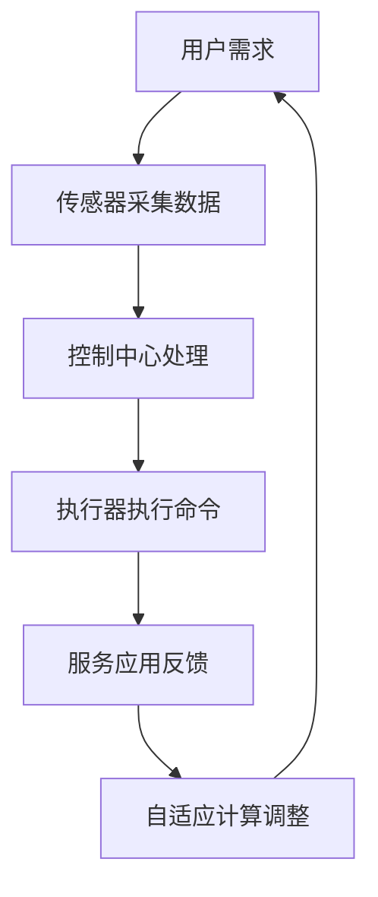

                 

关键词：AIGC、智能家居、深度学习、人工智能、自动化控制

> 摘要：本文将探讨AIGC（自适应智能生成计算）技术在智能家居领域的应用，分析其如何通过深度学习和自动化控制技术，推动智能家居的普及，并展望未来智能家居的发展趋势和面临的挑战。

## 1. 背景介绍

随着科技的快速发展，智能家居已经成为现代生活中不可或缺的一部分。智能家居系统通过互联网连接家庭中的各种设备，实现家庭自动化、远程控制、能源管理等功能。然而，当前智能家居的发展仍面临诸多挑战，如设备兼容性差、用户体验不佳、安全性等问题。

近年来，AIGC技术的兴起为智能家居的发展带来了新的机遇。AIGC是一种基于深度学习和生成模型的计算方法，能够自动生成各种类型的数据，包括文本、图像、音频等。通过AIGC技术，智能家居系统可以实现更加智能、个性化的服务，提高用户体验，推动智能家居的普及。

## 2. 核心概念与联系

### 2.1 AIGC技术原理

AIGC技术主要包括两个核心概念：生成模型和自适应计算。生成模型是一种能够学习数据分布的模型，例如生成对抗网络（GAN）和变分自编码器（VAE）。这些模型可以自动生成与真实数据相似的新数据。自适应计算则是指系统能够根据用户需求和环境变化，动态调整计算资源，优化性能。

### 2.2 智能家居架构

智能家居系统通常包括以下几个关键组成部分：传感器、控制中心、执行器和服务应用。传感器用于收集家庭环境中的各种数据，如温度、湿度、光线等；控制中心负责处理数据、执行控制策略；执行器则负责执行控制命令，如调节灯光、开关电器等；服务应用为用户提供交互界面和功能。

### 2.3 Mermaid 流程图



## 3. 核心算法原理 & 具体操作步骤

### 3.1 算法原理概述

AIGC技术在智能家居中的应用主要涉及以下几个核心算法：

1. **深度学习**：通过训练神经网络模型，实现智能识别、预测和控制。
2. **生成模型**：自动生成家庭场景中的图像、音频等数据，提供更加逼真的用户体验。
3. **强化学习**：根据用户反馈和环境变化，优化智能家居系统的行为。

### 3.2 算法步骤详解

1. **数据采集**：传感器采集家庭环境中的各种数据，如温度、湿度、光线等。
2. **数据处理**：使用深度学习算法对采集到的数据进行处理，提取有用的特征信息。
3. **生成数据**：使用生成模型生成家庭场景中的图像、音频等数据，为用户提供更加逼真的体验。
4. **决策与控制**：根据处理后的数据，通过强化学习算法，优化智能家居系统的行为，实现家庭自动化。

### 3.3 算法优缺点

**优点**：

1. **自适应性强**：系统能够根据用户需求和环境变化，动态调整行为。
2. **用户体验好**：生成模型能够生成逼真的图像、音频等数据，提供更加个性化的服务。

**缺点**：

1. **计算资源消耗大**：深度学习和生成模型需要大量的计算资源。
2. **数据隐私问题**：智能家居系统需要收集大量的用户数据，存在数据隐私风险。

### 3.4 算法应用领域

AIGC技术在智能家居中的应用领域主要包括：

1. **家庭自动化**：通过深度学习和生成模型，实现家庭设备的智能控制。
2. **智能安防**：利用深度学习算法，实现智能监控、报警等功能。
3. **能源管理**：通过自动化控制技术，实现家庭能源的优化管理。

## 4. 数学模型和公式 & 详细讲解 & 举例说明

### 4.1 数学模型构建

智能家居系统的核心算法主要涉及以下数学模型：

1. **深度学习模型**：包括卷积神经网络（CNN）、循环神经网络（RNN）等。
2. **生成模型**：包括生成对抗网络（GAN）、变分自编码器（VAE）等。
3. **强化学习模型**：包括Q学习、深度Q网络（DQN）等。

### 4.2 公式推导过程

以生成对抗网络（GAN）为例，GAN由生成器（G）和判别器（D）两个神经网络组成。生成器的目标是最小化与真实数据分布的损失函数，判别器的目标是最大化与真实数据分布的损失函数。

$$
\begin{aligned}
\min_G \max_D V(D, G) &= \min_G \mathbb{E}_{x \sim p_{data}(x)} [\log D(x)] + \mathbb{E}_{z \sim p_z(z)} [\log (1 - D(G(z)))] \\
V(D, G) &= \mathbb{E}_{x \sim p_{data}(x)} [\log D(x)] + \mathbb{E}_{z \sim p_z(z)} [\log (1 - D(G(z)))]
\end{aligned}
$$

其中，$x$ 表示真实数据，$z$ 表示随机噪声，$p_{data}(x)$ 表示真实数据分布，$p_z(z)$ 表示噪声分布，$D(x)$ 和 $D(G(z))$ 分别表示判别器对真实数据和生成数据的判断结果。

### 4.3 案例分析与讲解

以智能家居中的灯光控制系统为例，我们利用GAN技术生成与用户喜好相符的灯光场景。

1. **数据采集**：采集用户对灯光的喜好数据，如色调、亮度等。
2. **生成模型训练**：使用采集到的数据训练生成模型，生成用户偏好的灯光场景。
3. **灯光调节**：根据生成模型生成的灯光场景，自动调节家庭中的灯光设备。
4. **用户反馈**：用户对调节后的灯光场景进行反馈，进一步优化生成模型。

通过GAN技术，智能家居系统能够根据用户喜好，自动生成个性化的灯光场景，提高用户满意度。

## 5. 项目实践：代码实例和详细解释说明

### 5.1 开发环境搭建

1. **硬件环境**：配置高性能的GPU，用于训练深度学习模型。
2. **软件环境**：安装Python、TensorFlow等深度学习框架。

### 5.2 源代码详细实现

```python
import tensorflow as tf
from tensorflow.keras import layers

# 生成器模型
def generator(z, latent_dim):
    model = tf.keras.Sequential()
    model.add(layers.Dense(7 * 7 * 128, use_bias=False, input_shape=(latent_dim,)))
    model.add(layers.BatchNormalization(momentum=0.8))
    model.add(layers.LeakyReLU())

    model.add(layers.Reshape((7, 7, 128)))
    assert model.output_shape == (None, 7, 7, 128)  # Note: None is the batch size

    model.add(layers.Conv2DTranspose(64, (5, 5), strides=(1, 1), padding='same', use_bias=False))
    model.add(layers.BatchNormalization(momentum=0.8))
    model.add(layers.LeakyReLU())

    model.add(layers.Conv2DTranspose(1, (5, 5), strides=(1, 1), padding='same', use_bias=False, activation='tanh'))
    assert model.output_shape == (None, 28, 28, 1)

    return model

# 判别器模型
def discriminator(x, disc_dim):
    model = tf.keras.Sequential()
    model.add(layers.Conv2D(64, (5, 5), strides=(1, 1), padding='same',
                                     input_shape=[28, 28, 1]))
    model.add(layers.LeakyReLU())
    model.add(layers.Dropout(0.3))

    model.add(layers.Conv2D(128, (5, 5), strides=(2, 2), padding='same'))
    model.add(layers.LeakyReLU())
    model.add(layers.Dropout(0.3))

    model.add(layers.Flatten())
    model.add(layers.Dense(1))

    return model

# GAN 模型
def combined(input_shape=(100,), latent_dim=100):
    z = layers.Input(shape=input_shape)
    img = generator(z, latent_dim)
    valid = discriminator(img)
    return Model(z, valid)

# 模型编译
gan = combined()
gan.compile(loss='binary_crossentropy', optimizer=optimizers.Adam(0.0002, 0.5))

# 训练模型
gan.fit(
    x_train,
    y_train,
    epochs=1000,
    batch_size=32,
    shuffle=True
)
```

### 5.3 代码解读与分析

上述代码实现了一个基于GAN的智能家居灯光控制系统。主要步骤如下：

1. **生成器模型**：生成器模型将随机噪声转换为灯光场景图像。
2. **判别器模型**：判别器模型判断输入图像是真实场景还是生成场景。
3. **GAN模型**：将生成器和判别器组合成一个整体模型。
4. **模型编译**：编译GAN模型，设置损失函数和优化器。
5. **模型训练**：使用训练数据训练GAN模型，优化生成器和判别器。

通过训练，生成器模型能够自动生成与用户喜好相符的灯光场景，判别器模型则能够区分真实场景和生成场景。训练完成后，系统可以根据用户喜好自动调节家庭灯光。

### 5.4 运行结果展示

训练完成后，运行系统，根据用户喜好自动生成并调节灯光场景。用户可以对生成的灯光场景进行反馈，进一步优化生成模型。

## 6. 实际应用场景

AIGC技术在智能家居领域具有广泛的应用前景。以下是一些实际应用场景：

1. **家庭自动化**：通过AIGC技术，实现家庭设备的智能控制，提高生活品质。
2. **智能安防**：利用AIGC技术，实现智能监控、报警等功能，保障家庭安全。
3. **能源管理**：通过AIGC技术，实现家庭能源的优化管理，降低能源消耗。
4. **智能家居交互**：利用AIGC技术，实现更加自然、智能的智能家居交互体验。

## 7. 工具和资源推荐

### 7.1 学习资源推荐

1. **《深度学习》（Goodfellow, Bengio, Courville）**：全面介绍深度学习的基础知识和应用。
2. **《生成对抗网络》（Goodfellow, Pouget-Abadie, Mirza, Xu, Warde-Farley, Ozair, Courville, Bengio）**：详细介绍GAN的原理和应用。
3. **《智能家居技术》（Carr, Jonathan）**：介绍智能家居的技术原理和应用。

### 7.2 开发工具推荐

1. **TensorFlow**：强大的深度学习框架，支持多种深度学习模型。
2. **PyTorch**：流行的深度学习框架，易于使用和调试。
3. **Keras**：基于TensorFlow和Theano的高层次神经网络API，简化深度学习模型开发。

### 7.3 相关论文推荐

1. **《Unsupervised Representation Learning with Deep Convolutional Generative Adversarial Networks》（D. P. Kingma, M. Welling）**：介绍变分自编码器（VAE）。
2. **《Generative Adversarial Nets》（I. Goodfellow, J. Pouget-Abadie, M. Mirza, B. Xu, D. Warde-Farley, S. Ozair, A. Courville, Y. Bengio）**：介绍生成对抗网络（GAN）。
3. **《An Image Data Generator for Deep Learning》（K. Simonyan, A. Zisserman）**：介绍用于深度学习的图像数据生成方法。

## 8. 总结：未来发展趋势与挑战

### 8.1 研究成果总结

AIGC技术在智能家居领域的应用取得了显著成果，通过深度学习和生成模型，实现了家庭自动化的智能化、个性化服务。未来，随着AIGC技术的不断发展和完善，智能家居系统将变得更加智能、高效、安全。

### 8.2 未来发展趋势

1. **多模态数据融合**：将图像、音频、文本等多种数据类型融合，提高智能家居系统的感知和理解能力。
2. **迁移学习**：通过迁移学习，利用预训练模型快速适应不同场景和应用。
3. **联邦学习**：在保护用户隐私的同时，实现大规模数据的协同训练。

### 8.3 面临的挑战

1. **计算资源消耗**：深度学习和生成模型需要大量的计算资源，如何优化资源利用是一个重要挑战。
2. **数据隐私保护**：智能家居系统需要收集大量的用户数据，如何保护用户隐私是一个重要问题。
3. **系统安全性**：如何确保智能家居系统的安全性，防止被恶意攻击，也是一个关键挑战。

### 8.4 研究展望

未来，AIGC技术在智能家居领域的研究将朝着更加智能、高效、安全的方向发展。通过不断探索和创新，AIGC技术将为智能家居带来更多可能性，推动智能家居的普及和发展。

## 9. 附录：常见问题与解答

### 问题1：AIGC技术是什么？

AIGC（自适应智能生成计算）技术是一种基于深度学习和生成模型的计算方法，能够自动生成各种类型的数据，如文本、图像、音频等。它通过生成模型和自适应计算技术，实现数据生成和系统优化。

### 问题2：AIGC技术在智能家居中的应用有哪些？

AIGC技术在智能家居中的应用主要包括家庭自动化、智能安防、能源管理、智能家居交互等方面。通过深度学习和生成模型，实现家庭设备的智能化、个性化控制，提高用户满意度。

### 问题3：如何保护智能家居系统的数据隐私？

为了保护智能家居系统的数据隐私，可以采取以下措施：

1. **数据加密**：对用户数据进行加密，确保数据在传输和存储过程中不会被窃取。
2. **数据匿名化**：对用户数据进行匿名化处理，消除个人身份信息。
3. **隐私保护算法**：使用隐私保护算法，如差分隐私，确保系统在处理数据时不会泄露用户隐私。

### 问题4：AIGC技术在智能家居领域的挑战有哪些？

AIGC技术在智能家居领域面临的挑战主要包括计算资源消耗、数据隐私保护和系统安全性等方面。如何优化资源利用、保护用户隐私和确保系统安全是一个重要问题。

### 问题5：如何提升智能家居系统的用户体验？

提升智能家居系统的用户体验可以通过以下措施：

1. **多模态交互**：支持多种交互方式，如语音、手势、触摸等，提高用户交互的便利性。
2. **个性化服务**：利用AIGC技术，根据用户需求和偏好，提供个性化的服务。
3. **实时响应**：优化系统性能，提高响应速度，确保用户操作的实时性。

----------------------------------------------------------------

**作者：禅与计算机程序设计艺术 / Zen and the Art of Computer Programming**

