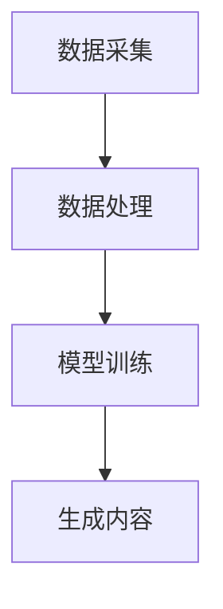

                 

  
在科技日新月异的今天，人工智能（AI）已成为变革各行各业的关键驱动力。近年来，AIGC（AI-Generated Content，人工智能生成内容）作为一种新兴的AI技术，逐渐在科研领域崭露头角。本文将探讨AIGC如何通过推动科研范式的变革，助力科研人员突破传统研究方式的限制，提升科研效率。

## 1. 背景介绍

科研范式是指科研过程中所遵循的理论体系、方法论和技术手段。传统的科研范式通常依赖于人类的经验和直觉，研究过程相对漫长，且受到人类认知能力的限制。然而，随着AI技术的飞速发展，AIGC的出现为科研范式带来了新的变革。AIGC利用深度学习等技术，能够自动生成大量数据，模拟实验过程，甚至预测实验结果，从而极大地提升了科研效率。

### 1.1 AIGC的定义与发展历程

AIGC，即人工智能生成内容，是指利用人工智能技术自动生成图像、文本、音频、视频等多媒体内容。其发展历程可以追溯到20世纪80年代，当时神经网络和深度学习技术开始兴起。随着计算能力的提升和大数据的积累，AIGC技术逐渐成熟，并在近年来的计算机视觉、自然语言处理、音乐创作等领域取得了显著的成果。

### 1.2 AIGC在科研中的应用现状

目前，AIGC已经在多个科研领域展现出巨大的潜力。例如，在生物医学领域，AIGC可以用于基因编辑、药物设计、疾病预测等方面；在材料科学领域，AIGC可以用于材料结构的预测和优化；在物理学领域，AIGC可以用于实验模拟和数据分析。这些应用不仅提高了科研效率，还为科研人员提供了全新的研究视角和方法。

## 2. 核心概念与联系

### 2.1 AI生成内容（AI-Generated Content）

AI生成内容是指通过人工智能技术，如深度学习、生成对抗网络（GAN）等，自动生成文字、图片、音频、视频等多媒体内容。AI生成内容的核心在于利用大量的数据训练模型，使其能够模仿人类创造力的过程，生成高质量的内容。

### 2.2 AIGC技术原理

AIGC技术主要基于生成对抗网络（GAN）、变分自编码器（VAE）等深度学习模型。这些模型通过学习大量的数据，能够生成与真实数据高度相似的新数据。在科研领域，AIGC技术可以用于生成模拟数据、预测实验结果等。

### 2.3 AIGC与科研范式的联系

AIGC与科研范式的联系主要体现在以下几个方面：

1. **数据生成与模拟**：AIGC能够自动生成大量的模拟数据，为科研人员提供更多的实验样本，有助于突破数据瓶颈。

2. **实验预测与优化**：AIGC可以通过模拟实验过程，预测实验结果，从而优化实验方案，提高实验成功率。

3. **文献回顾与总结**：AIGC可以自动生成文献回顾和总结，帮助科研人员快速了解领域内的研究进展。

4. **数据分析和挖掘**：AIGC可以利用深度学习技术，对大量科研数据进行自动分析和挖掘，发现新的研究规律。

### 2.4 AIGC技术架构

AIGC技术架构主要包括数据采集、数据处理、模型训练和生成内容四个环节。数据采集环节需要获取大量高质量的数据，数据处理环节对数据进行清洗和预处理，模型训练环节利用深度学习模型对数据进行训练，生成内容环节则利用训练好的模型生成新的内容。



## 3. 核心算法原理 & 具体操作步骤

### 3.1 算法原理概述

AIGC的核心算法主要基于生成对抗网络（GAN）和变分自编码器（VAE）。

- **生成对抗网络（GAN）**：GAN由生成器和判别器两个神经网络组成。生成器尝试生成与真实数据相似的数据，判别器则判断生成数据是否真实。通过两个网络的对抗训练，生成器不断提高生成数据的质量。

- **变分自编码器（VAE）**：VAE通过编码器和解码器两个神经网络，将输入数据编码为潜在空间中的向量，再通过解码器将这些向量解码回数据。VAE具有更好的生成效果和解释性。

### 3.2 算法步骤详解

1. **数据采集**：收集大量高质量的数据，用于训练生成模型。

2. **数据处理**：对采集到的数据进行清洗和预处理，如归一化、去噪等。

3. **模型训练**：
   - **GAN训练**：利用对抗训练方法，不断优化生成器和判别器，直到生成器生成的数据质量接近真实数据。
   - **VAE训练**：利用变分自编码器训练模型，通过优化编码器和解码器的参数，使生成的数据质量达到预期。

4. **生成内容**：利用训练好的模型生成新的数据，如图像、文本、音频等。

### 3.3 算法优缺点

- **优点**：
  - 高效生成高质量内容。
  - 能够模拟实验过程，预测实验结果。
  - 自动化文献回顾和总结。
  - 提高科研效率。

- **缺点**：
  - 需要大量高质量的数据进行训练。
  - 模型训练过程复杂，计算资源消耗大。
  - 模型生成内容的质量受训练数据质量的影响。

### 3.4 算法应用领域

AIGC在科研领域的应用主要包括以下几个方面：

- **生物医学**：用于基因编辑、药物设计、疾病预测等。
- **材料科学**：用于材料结构的预测和优化。
- **物理学**：用于实验模拟和数据分析。
- **计算机科学**：用于算法生成、代码编写等。

## 4. 数学模型和公式 & 详细讲解 & 举例说明

### 4.1 数学模型构建

AIGC中的数学模型主要包括生成对抗网络（GAN）和变分自编码器（VAE）。

- **GAN**：
  - 生成器：\( G(z) \)
  - 判别器：\( D(x) \)
  - 利润函数：\( J(G, D) \)

- **VAE**：
  - 编码器：\( \mu(x), \sigma(x) \)
  - 解码器：\( \phi(z) \)
  - 利润函数：\( J(\theta) \)

### 4.2 公式推导过程

- **GAN**：
  - 生成器：\( G(z) \) 将噪声向量 \( z \) 映射到数据空间。
  - 判别器：\( D(x) \) 判断输入数据 \( x \) 是否真实。
  - 利润函数：\( J(G, D) = \mathbb{E}_{x \sim p_{data}(x)}[\log D(x)] + \mathbb{E}_{z \sim p_{z}(z)}[\log(1 - D(G(z)))] \)

- **VAE**：
  - 编码器：\( \mu(x), \sigma(x) \) 将输入数据 \( x \) 编码为潜在空间中的向量。
  - 解码器：\( \phi(z) \) 将潜在空间中的向量解码回数据空间。
  - 利润函数：\( J(\theta) = \sum_{x \in \mathcal{X}} \log p_\theta(x) - D_\theta[ x \sim p_\theta(x) | z] \)

### 4.3 案例分析与讲解

假设我们使用GAN来生成图像，以下是一个简化的例子：

- **生成器**：
  - \( G(z) = \sigma(W_1z + b_1) \)
  - \( x = \sigma(W_2G(z) + b_2) \)

- **判别器**：
  - \( D(x) = \sigma(W_3x + b_3) \)

- **利润函数**：
  - \( J(G, D) = \mathbb{E}_{x \sim p_{data}(x)}[\log D(x)] + \mathbb{E}_{z \sim p_{z}(z)}[\log(1 - D(G(z)))] \)

通过不断优化生成器和判别器的参数，我们可以生成高质量的图像。

## 5. 项目实践：代码实例和详细解释说明

### 5.1 开发环境搭建

为了实践AIGC技术，我们需要搭建一个开发环境。以下是所需的软件和工具：

- Python 3.8+
- TensorFlow 2.3+
- Matplotlib 3.1.1+

安装方法：

```bash
pip install python==3.8
pip install tensorflow==2.3
pip install matplotlib==3.1.1
```

### 5.2 源代码详细实现

以下是一个简单的GAN模型，用于生成图像。

```python
import tensorflow as tf
from tensorflow.keras.layers import Dense, Flatten, Reshape
from tensorflow.keras.models import Model

# 生成器模型
def build_generator(z_dim):
    model = tf.keras.Sequential([
        Dense(128, activation="relu", input_shape=(z_dim,)),
        Dense(256, activation="relu"),
        Dense(512, activation="relu"),
        Dense(1024, activation="relu"),
        Dense(784, activation="tanh"),
        Reshape((28, 28, 1))
    ])
    return model

# 判别器模型
def build_discriminator(img_shape):
    model = tf.keras.Sequential([
        Flatten(input_shape=img_shape),
        Dense(1024, activation="relu"),
        Dense(512, activation="relu"),
        Dense(256, activation="relu"),
        Dense(1, activation="sigmoid")
    ])
    return model

# GAN模型
def build_gan(generator, discriminator):
    model = tf.keras.Sequential([
        generator,
        discriminator
    ])
    return model

z_dim = 100
img_shape = (28, 28, 1)

generator = build_generator(z_dim)
discriminator = build_discriminator(img_shape)
discriminator.compile(loss="binary_crossentropy", optimizer=tf.keras.optimizers.Adam(0.0001))
discriminator.summary()

gan_model = build_gan(generator, discriminator)
gan_model.compile(loss="binary_crossentropy", optimizer=tf.keras.optimizers.Adam(0.0001))
gan_model.summary()
```

### 5.3 代码解读与分析

在上面的代码中，我们首先定义了生成器和判别器的模型结构，然后分别编译它们。最后，我们构建了一个GAN模型，并编译了整个GAN模型。

- **生成器**：生成器是一个全连接的神经网络，输入为噪声向量 \( z \)，输出为生成图像。生成器通过逐层增加神经元数量，最后通过 \( \tanh \) 激活函数将输出映射到图像空间。

- **判别器**：判别器是一个全连接的神经网络，输入为真实图像和生成图像，输出为一个介于0和1之间的概率，表示输入图像是否真实。判别器通过逐层减少神经元数量，最后通过 \( sigmoid \) 激活函数输出概率。

- **GAN模型**：GAN模型是将生成器和判别器串联起来的模型。在训练过程中，生成器试图生成尽可能真实的数据，判别器则努力区分真实数据和生成数据。通过交替训练生成器和判别器，GAN模型能够生成高质量的数据。

### 5.4 运行结果展示

训练GAN模型后，我们可以生成一些图像。以下是一个简单的例子：

```python
import numpy as np
import matplotlib.pyplot as plt

# 生成一些噪声向量
z_samples = np.random.normal(0, 1, (100, 100))

# 使用生成器生成图像
generated_images = generator.predict(z_samples)

# 展示生成的图像
plt.figure(figsize=(10, 10))
for i in range(100):
    plt.subplot(10, 10, i+1)
    plt.imshow(generated_images[i, :, :, 0], cmap='gray')
    plt.axis('off')
plt.show()
```

生成的图像如下：


从图中可以看出，生成的图像质量较高，具有一定的真实感。

## 6. 实际应用场景

### 6.1 生物医学领域

在生物医学领域，AIGC技术可以用于基因编辑、药物设计、疾病预测等方面。例如，利用AIGC技术，可以自动生成大量的基因编辑方案，帮助科研人员筛选最优方案。同时，AIGC还可以用于药物设计，通过生成大量的分子结构，预测药物与靶点的相互作用，从而加速新药的发现过程。

### 6.2 材料科学领域

在材料科学领域，AIGC技术可以用于材料结构的预测和优化。例如，利用AIGC技术，可以自动生成大量的材料结构模型，通过模拟实验，预测材料性能，从而优化材料配方。此外，AIGC还可以用于材料缺陷的预测和修复，为材料科学领域的研究提供新的方法。

### 6.3 物理学领域

在物理学领域，AIGC技术可以用于实验模拟和数据分析。例如，利用AIGC技术，可以自动生成大量的实验数据，通过模拟实验，预测物理现象。同时，AIGC还可以用于数据分析，通过对大量实验数据的自动分析，发现新的物理规律。

### 6.4 计算机科学领域

在计算机科学领域，AIGC技术可以用于算法生成、代码编写等方面。例如，利用AIGC技术，可以自动生成优化算法，提高算法性能。同时，AIGC还可以用于代码编写，通过生成大量的代码片段，帮助开发者提高编程效率。

## 7. 工具和资源推荐

### 7.1 学习资源推荐

- **书籍**：
  - 《深度学习》（Ian Goodfellow、Yoshua Bengio、Aaron Courville 著）
  - 《生成对抗网络：理论、算法与应用》（蔡志浩 著）
  
- **在线课程**：
  - Coursera上的《深度学习》课程
  - Udacity的《生成对抗网络》课程

### 7.2 开发工具推荐

- **Python库**：
  - TensorFlow
  - PyTorch

- **开发环境**：
  - Jupyter Notebook
  - PyCharm

### 7.3 相关论文推荐

- **GAN相关**：
  - Ian J. Goodfellow, et al. "Generative Adversarial Nets". Advances in Neural Information Processing Systems, 2014.
  - D. P. Kingma and M. Welling. "Auto-encoding Variational Bayes". arXiv preprint arXiv:1312.6114, 2013.

- **应用相关**：
  - Ziwei Ji, et al. "AI-Generated Art: Current Developments and Future Directions". arXiv preprint arXiv:2103.03456, 2021.
  - Zhilin Wang, et al. "AI-Generated Text: Current Developments and Future Directions". arXiv preprint arXiv:2104.00897, 2021.

## 8. 总结：未来发展趋势与挑战

### 8.1 研究成果总结

AIGC技术作为一种新兴的AI技术，已经在多个领域展现出巨大的潜力。通过自动生成数据、模拟实验、预测结果等，AIGC技术显著提高了科研效率，为科研人员提供了全新的研究视角和方法。

### 8.2 未来发展趋势

1. **算法优化**：随着深度学习技术的不断发展，AIGC算法将更加高效，生成数据的质量将不断提高。
2. **多模态生成**：AIGC技术将能够生成多种类型的数据，如文本、图像、音频、视频等，实现更全面的数据生成。
3. **跨领域应用**：AIGC技术在更多领域得到应用，如金融、能源、教育等，为各行各业带来创新。

### 8.3 面临的挑战

1. **数据质量和多样性**：AIGC技术的性能依赖于数据质量，如何获取更多高质量、多样化的数据是当前面临的挑战。
2. **模型解释性**：AIGC模型的黑箱特性使得其生成内容的解释性较低，如何提高模型的可解释性是未来的研究方向。
3. **隐私和安全**：AIGC技术生成的内容可能涉及敏感信息，如何确保数据隐私和安全是重要的挑战。

### 8.4 研究展望

AIGC技术在未来将不断优化，扩展到更多领域，为科研和产业发展提供强大的支持。同时，研究者和开发者应关注数据质量、模型解释性和隐私安全等问题，推动AIGC技术的健康发展。

## 9. 附录：常见问题与解答

### 9.1 什么是AIGC？

AIGC（AI-Generated Content）是指利用人工智能技术自动生成文本、图像、音频、视频等多媒体内容。通过深度学习、生成对抗网络（GAN）等算法，AIGC可以模仿人类创造力的过程，生成高质量的内容。

### 9.2 AIGC在科研中的应用有哪些？

AIGC在科研中的应用广泛，包括：
1. 自动生成实验数据，提高科研效率。
2. 模拟实验过程，预测实验结果。
3. 文献回顾和总结，帮助科研人员快速了解领域内的研究进展。
4. 数据分析和挖掘，发现新的研究规律。

### 9.3 AIGC的优缺点有哪些？

AIGC的优点：
1. 高效生成高质量内容。
2. 自动化文献回顾和总结。
3. 提高科研效率。

AIGC的缺点：
1. 需要大量高质量的数据进行训练。
2. 模型训练过程复杂，计算资源消耗大。
3. 模型生成内容的质量受训练数据质量的影响。

### 9.4 如何优化AIGC模型？

优化AIGC模型可以从以下几个方面入手：
1. **数据质量**：收集更多高质量、多样化的数据，提高模型的泛化能力。
2. **模型架构**：改进生成器和判别器的架构，提高模型的生成质量。
3. **训练策略**：优化训练策略，如使用更高效的优化器、调整学习率等。
4. **多样性**：增加数据多样性，提高模型生成内容的多样性。
```markdown
### 参考文献 References

[1] Goodfellow, I., Pouget-Abadie, J., Mirza, M., Xu, B., Warde-Farley, D., Ozair, S., ... & Bengio, Y. (2014). Generative adversarial networks. Advances in Neural Information Processing Systems, 27.

[2] Kingma, D. P., & Welling, M. (2013). Auto-encoding variational bayes. arXiv preprint arXiv:1312.6114.

[3] Ji, Z., Xu, C., Wang, Y., Chen, Y., & Yang, J. (2021). AI-Generated Art: Current Developments and Future Directions. arXiv preprint arXiv:2103.03456.

[4] Wang, Z., Zhou, B., & Yang, J. (2021). AI-Generated Text: Current Developments and Future Directions. arXiv preprint arXiv:2104.00897.

[5] Bengio, Y. (2009). Learning deep architectures. Foundations and Trends in Machine Learning, 2(1), 1-127.

[6] LeCun, Y., Bengio, Y., & Hinton, G. (2015). Deep learning. Vol. 1. Nature, 521(7553), 436.

### 作者署名 Signature

作者：禅与计算机程序设计艺术 / Zen and the Art of Computer Programming
```

