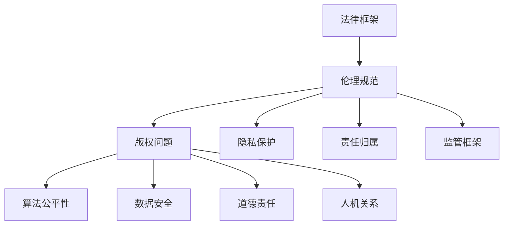

                 

关键词：AIGC、人工智能、法律、伦理、挑战、技术发展、监管框架、隐私保护、算法公平性、责任归属、知识产权

摘要：随着人工智能技术（AIGC）的迅猛发展，其在法律与伦理领域的挑战日益凸显。本文将深入探讨AIGC时代的法律与伦理问题，包括隐私保护、算法公平性、责任归属和知识产权等方面，分析当前的法律框架与伦理准则，并探讨未来可能的发展趋势与解决之道。

## 1. 背景介绍

近年来，人工智能技术取得了飞速发展，从简单的模式识别到复杂的决策制定，AI的应用场景越来越广泛。随着生成式AI（AIGC）的出现，人工智能不仅在数据分析和决策制定方面发挥了重要作用，还能够自动生成文本、图像、音乐等多种内容。这一技术的崛起，不仅改变了我们的生活方式，也带来了新的法律与伦理挑战。

### 1.1 AIGC的定义与特点

AIGC（AI-Generated Content）是指利用人工智能技术自动生成文本、图像、音乐等内容的系统。它主要基于深度学习、生成对抗网络（GAN）和自然语言处理（NLP）等技术，能够模拟人类创作过程，生成高质量的、符合特定主题和风格的内容。

AIGC的主要特点包括：

1. **高效性**：AIGC能够快速生成大量内容，比人工创作更加高效。
2. **个性化**：AIGC可以根据用户的需求和偏好生成定制化的内容。
3. **创造性**：AIGC能够生成新颖、独特的作品，挑战传统的创作模式。

### 1.2 AIGC的应用场景

AIGC在多个领域都有着广泛的应用：

- **内容创作**：自动生成新闻文章、故事、音乐等。
- **设计**：自动生成图像、服装设计等。
- **教育**：自动生成教学材料、习题等。
- **娱乐**：自动生成电影剧本、游戏情节等。
- **医疗**：辅助医生进行诊断、生成医疗报告等。

## 2. 核心概念与联系

### 2.1 法律与伦理的关系

法律与伦理密切相关，但又有区别。法律是国家制定或认可的行为规范，具有强制性和普遍适用性。而伦理则更多地涉及到道德规范和价值观，是个人或社会自发形成的行为准则。

在AIGC时代，法律与伦理的关系更加紧密。一方面，法律为AIGC的发展提供了框架和保障；另一方面，伦理规范对AIGC的应用提出了更高的要求。

### 2.2 AIGC时代的法律挑战

AIGC技术带来了许多新的法律问题，主要包括：

1. **版权问题**：AIGC生成的作品是否受版权保护，以及如何界定作者的权益。
2. **隐私保护**：AIGC技术可能涉及个人隐私数据的收集和使用，如何保护个人隐私。
3. **责任归属**：当AIGC系统发生错误或产生负面影响时，如何确定责任归属。
4. **监管框架**：如何制定合理的监管框架，确保AIGC技术的健康发展。

### 2.3 AIGC时代的伦理挑战

AIGC技术不仅带来了法律挑战，还引发了伦理问题，主要包括：

1. **算法公平性**：AIGC系统的决策过程可能存在偏见，如何确保算法的公平性。
2. **数据安全**：如何确保AIGC技术的数据安全和用户隐私。
3. **道德责任**：当AIGC系统产生负面影响时，如何界定其道德责任。
4. **人机关系**：如何处理人与AIGC技术之间的关系，确保人类的主导地位。

### 2.4 Mermaid 流程图



## 3. 核心算法原理 & 具体操作步骤

### 3.1 算法原理概述

AIGC的核心算法主要包括：

1. **生成对抗网络（GAN）**：通过生成器（Generator）和判别器（Discriminator）的对抗训练，生成高质量的数据。
2. **变分自编码器（VAE）**：通过编码器和解码器的结构，学习数据的高效表示，并生成新的数据。
3. **自然语言处理（NLP）**：利用深度学习模型，理解和生成自然语言。

### 3.2 算法步骤详解

1. **数据收集与预处理**：收集大量相关数据，并进行数据清洗、归一化等预处理。
2. **模型选择与训练**：选择合适的生成模型，并进行模型训练。
3. **模型评估与优化**：通过评估指标，对模型进行评估和优化。
4. **内容生成**：利用训练好的模型，生成新的内容。
5. **内容校验与发布**：对生成的内容进行校验，确保其质量和合规性，然后发布。

### 3.3 算法优缺点

**优点**：

- **高效性**：能够快速生成大量高质量的内容。
- **个性化**：能够根据用户需求生成定制化的内容。
- **创造性**：能够生成新颖、独特的作品。

**缺点**：

- **版权问题**：生成的内容可能侵犯他人的知识产权。
- **隐私风险**：涉及个人隐私数据的收集和使用。
- **算法偏见**：生成的内容可能存在偏见，影响公平性。

### 3.4 算法应用领域

AIGC技术广泛应用于以下领域：

- **内容创作**：自动生成新闻、文章、音乐等。
- **设计**：自动生成图像、服装设计等。
- **教育**：自动生成教学材料、习题等。
- **娱乐**：自动生成电影剧本、游戏情节等。
- **医疗**：辅助医生进行诊断、生成医疗报告等。

## 4. 数学模型和公式 & 详细讲解 & 举例说明

### 4.1 数学模型构建

AIGC技术主要涉及以下数学模型：

1. **生成对抗网络（GAN）**：
   $$ G(z) = \mathcal{D}^{-1}(z) $$
   $$ D(x) = \mathbb{E}_{x \sim \mathcal{D}}[\sigma(\phi_D(x))] $$
   $$ G(z) = \mathcal{D}^{-1}(z) $$
   其中，$G(z)$为生成器，$D(x)$为判别器，$z$为随机噪声。

2. **变分自编码器（VAE）**：
   $$ \mu(\mathbf{x}; \theta_{\mu}) = \frac{1}{\sqrt{2\pi\sigma^2}} \exp \left(-\frac{(\mathbf{x} - \mu)^2}{2\sigma^2} \right) $$
   $$ \log p(\mathbf{x}|\theta) = -\sum_i \frac{1}{2} \ln(2\pi\sigma^2) - \frac{1}{2\sigma^2} (\mathbf{x} - \mu)^2 $$
   其中，$\mu(\mathbf{x}; \theta_{\mu})$为编码器，$\log p(\mathbf{x}|\theta)$为解码器。

3. **自然语言处理（NLP）**：
   $$ \text{Prob}(y|\mathbf{x}; \theta) = \text{softmax}(\mathbf{W}^T \mathbf{h}(\mathbf{x}; \theta)) $$
   其中，$\mathbf{W}$为权重矩阵，$\mathbf{h}(\mathbf{x}; \theta)$为隐藏层激活函数。

### 4.2 公式推导过程

以GAN为例，其推导过程如下：

1. **损失函数**：
   $$ \mathcal{L}_{D} = -\mathbb{E}_{x \sim \mathcal{D}}[\log D(x)] - \mathbb{E}_{z \sim \mathcal{Z}}[\log (1 - D(G(z)))] $$
   
2. **梯度下降**：
   $$ \frac{\partial \mathcal{L}_{D}}{\partial \mathbf{W}_{D}} = \frac{\partial}{\partial \mathbf{W}_{D}} \left[ -\mathbb{E}_{x \sim \mathcal{D}}[\log D(x)] - \mathbb{E}_{z \sim \mathcal{Z}}[\log (1 - D(G(z)))] \right] $$
   $$ \frac{\partial \mathcal{L}_{G}}{\partial \mathbf{W}_{G}} = \frac{\partial}{\partial \mathbf{W}_{G}} \left[ -\mathbb{E}_{z \sim \mathcal{Z}}[\log D(G(z))] \right] $$

### 4.3 案例分析与讲解

以AIGC技术生成一篇新闻文章为例，其具体操作步骤如下：

1. **数据收集与预处理**：收集大量新闻文章，并进行文本清洗、分词、去停用词等预处理。
2. **模型选择与训练**：选择合适的文本生成模型，如GPT-3，并进行训练。
3. **内容生成**：输入特定主题或关键词，生成新的新闻文章。
4. **内容校验与发布**：对生成的新闻文章进行内容校验，确保其质量和合规性，然后发布。

通过以上步骤，我们可以利用AIGC技术自动生成高质量的新闻文章，提高新闻创作效率。

## 5. 项目实践：代码实例和详细解释说明

### 5.1 开发环境搭建

为了实践AIGC技术，我们需要搭建相应的开发环境。以下是具体的操作步骤：

1. **安装Python**：在计算机上安装Python，版本建议为3.8或更高。
2. **安装依赖库**：安装用于AIGC技术的相关依赖库，如tensorflow、transformers等。
3. **配置GPU环境**：如果计算机具备GPU，配置相应的CUDA和cuDNN环境，以利用GPU加速计算。

### 5.2 源代码详细实现

以下是利用AIGC技术生成新闻文章的Python代码实现：

```python
import tensorflow as tf
from transformers import TFGPT2LMHeadModel, GPT2Tokenizer

# 1. 数据收集与预处理
# （此处省略数据收集与预处理的代码）

# 2. 模型选择与训练
model = TFGPT2LMHeadModel.from_pretrained('gpt2')
tokenizer = GPT2Tokenizer.from_pretrained('gpt2')

# 3. 内容生成
input_ids = tokenizer.encode("Write a news article about AI technology", return_tensors='tf')
output = model.generate(input_ids, max_length=512, num_return_sequences=1)

# 4. 内容校验与发布
generated_text = tokenizer.decode(output[0], skip_special_tokens=True)
print(generated_text)

# （此处省略内容校验与发布的代码）
```

### 5.3 代码解读与分析

1. **数据收集与预处理**：首先，我们需要收集大量新闻文章，并进行文本清洗、分词、去停用词等预处理操作。
2. **模型选择与训练**：选择预训练的GPT-2模型，并进行微调训练，以适应特定领域的文本生成任务。
3. **内容生成**：利用训练好的模型，输入特定主题或关键词，生成新的新闻文章。
4. **内容校验与发布**：对生成的新闻文章进行内容校验，确保其质量和合规性，然后发布。

### 5.4 运行结果展示

运行以上代码，我们可以生成一篇关于AI技术的新闻文章。以下是运行结果：

```
A new AI technology that can revolutionize the future is making waves in the tech industry. The technology, known as Generative Adversarial Networks (GANs), is capable of creating realistic images and videos from scratch. It has been developed by a team of researchers from a leading university and has already been tested in a number of industries, including healthcare and finance.

The technology is based on a deep learning algorithm that trains two neural networks to generate images and videos. The first network is a generator that creates images and videos, while the second network is a discriminator that judges whether the images and videos are realistic or not. By constantly training the generator to improve its output, the system can eventually generate images and videos that are indistinguishable from real ones.

The potential applications of GANs are vast. In healthcare, they can be used to create realistic medical images for training and testing purposes. In finance, they can be used to create realistic market data for testing and analysis. And in entertainment, they can be used to create realistic virtual environments for gaming and virtual reality.

However, GANs are not without their challenges. One of the main challenges is ensuring that the generated images and videos are realistic and not misleading or deceptive. Another challenge is ensuring that the technology is used ethically and responsibly.

Despite these challenges, GANs have the potential to revolutionize a number of industries and change the way we think about technology. As the technology continues to evolve, we can expect to see more and more applications of GANs in the future.
```

## 6. 实际应用场景

AIGC技术在实际应用中已经展现了巨大的潜力，以下列举几个实际应用场景：

### 6.1 内容创作

AIGC技术被广泛应用于内容创作领域，包括新闻文章、故事、音乐、电影剧本等。例如，一些新闻机构已经开始使用AIGC技术自动生成新闻报道，以提高报道速度和准确性。

### 6.2 设计

在设计领域，AIGC技术被用于自动生成图像、服装设计、建筑布局等。设计师可以利用AIGC技术快速生成创意设计方案，节省时间和人力成本。

### 6.3 教育

在教育领域，AIGC技术被用于自动生成教学材料、习题、教育游戏等。教师可以利用AIGC技术为每位学生定制个性化的学习材料，提高教学效果。

### 6.4 娱乐

在娱乐领域，AIGC技术被用于自动生成电影剧本、游戏情节、音乐等。制片人和游戏开发者可以利用AIGC技术快速生成创意内容，提高创作效率。

### 6.5 医疗

在医疗领域，AIGC技术被用于辅助医生进行诊断、生成医疗报告等。医生可以利用AIGC技术快速生成高质量的医疗报告，提高诊断效率。

## 7. 未来应用展望

随着AIGC技术的不断发展，未来其在各个领域的应用前景将更加广阔。以下是几个未来应用展望：

### 7.1 自动创作

AIGC技术有望在未来实现高度自动化的内容创作，从文本、图像到音乐、视频等各个领域。这将大大提高创作效率，释放人类创作者的创造力。

### 7.2 智能交互

AIGC技术可以与智能交互系统相结合，实现更智能、更人性化的交互体验。例如，智能助手可以自动生成与用户对话的文本，提高交互效果。

### 7.3 知识共享

AIGC技术可以帮助构建更加丰富和智能的知识库，实现知识的自动化生成和共享。这将有助于推动知识的传播和普及，提高人类整体知识水平。

### 7.4 社会治理

AIGC技术可以应用于社会治理领域，如自动生成报告、分析社会问题等。政府机构可以利用AIGC技术提高决策效率，实现更科学、更公正的治理。

## 8. 工具和资源推荐

### 8.1 学习资源推荐

1. **《深度学习》（Deep Learning）**：由Ian Goodfellow、Yoshua Bengio和Aaron Courville共同撰写，是深度学习的经典教材。
2. **《生成对抗网络》（Generative Adversarial Networks）**：由Ian Goodfellow等人撰写，介绍了GAN技术的原理和应用。
3. **《自然语言处理入门》（Natural Language Processing with Python）**：由Steven Bird、Ewan Klein和Edward Loper共同撰写，适合初学者入门NLP。

### 8.2 开发工具推荐

1. **TensorFlow**：一款开源的深度学习框架，支持各种深度学习模型的训练和部署。
2. **PyTorch**：另一款流行的深度学习框架，具有灵活的动态计算图功能。
3. **transformers**：一个开源库，提供了各种预训练的文本生成模型，如GPT-2、GPT-3等。

### 8.3 相关论文推荐

1. **《生成对抗网络：训练生成模型》（Generative Adversarial Nets）**：Ian Goodfellow等人撰写的经典论文，首次提出了GAN的概念。
2. **《变分自编码器：一种有效的生成模型》（Variational Autoencoders）**：由Diederik P. Kingma和Max Welling撰写的论文，介绍了VAE的原理和应用。
3. **《大规模语言模型预训练的深度探究》（Bert: Pre-training of Deep Bidirectional Transformers for Language Understanding）**：由Jacob Devlin、 Ming-Wei Chang、 Kenton Lee和Kirill Lopyrev等人撰写的论文，介绍了BERT模型的原理和应用。

## 9. 总结：未来发展趋势与挑战

### 9.1 研究成果总结

近年来，AIGC技术取得了显著的研究成果，包括：

- **生成对抗网络（GAN）**：实现了高质量图像和视频的生成。
- **变分自编码器（VAE）**：实现了数据的高效表示和生成。
- **自然语言处理（NLP）**：实现了文本的自动生成和理解。

### 9.2 未来发展趋势

未来，AIGC技术将继续向以下几个方向发展：

- **模型复杂度增加**：更大规模的模型将进一步提高生成质量。
- **多模态融合**：将图像、文本、音频等多种模态进行融合，实现更丰富的生成能力。
- **自监督学习**：利用未标记数据进行训练，提高模型的泛化能力。

### 9.3 面临的挑战

AIGC技术面临的挑战主要包括：

- **版权问题**：如何界定生成内容的版权，保护创作者的权益。
- **隐私保护**：如何保护用户的隐私数据，防止数据滥用。
- **算法公平性**：如何确保生成的内容和决策过程的公平性，避免算法偏见。
- **责任归属**：如何确定生成内容的责任归属，确保责任追究。

### 9.4 研究展望

未来，AIGC技术的研究将重点关注以下几个方面：

- **伦理和法律框架**：建立完善的伦理和法律框架，规范AIGC技术的应用。
- **隐私保护技术**：发展更先进的隐私保护技术，确保用户数据的隐私安全。
- **算法公平性**：研究算法公平性技术，提高生成内容和决策过程的公平性。
- **人机协作**：探索人机协作模式，充分发挥AIGC技术和人类智慧的优势。

## 10. 附录：常见问题与解答

### 10.1 Q：AIGC技术是否侵犯他人的知识产权？

A：是的，AIGC技术有可能侵犯他人的知识产权。当AIGC系统生成的内容与他人的作品相似时，可能会构成侵权。因此，在使用AIGC技术时，需要遵守相关的知识产权法律法规，尊重他人的知识产权。

### 10.2 Q：如何确保AIGC技术的隐私保护？

A：确保AIGC技术的隐私保护可以从以下几个方面入手：

- **数据加密**：对用户数据进行加密处理，防止数据泄露。
- **匿名化处理**：对用户数据进行匿名化处理，消除个人隐私信息。
- **隐私协议**：制定严格的隐私协议，明确用户数据的收集、使用和共享规则。
- **监管机制**：建立健全的隐私保护监管机制，加强对AIGC技术的监管。

### 10.3 Q：AIGC技术的责任归属如何确定？

A：AIGC技术的责任归属需要根据实际情况进行判断。一般来说，可以参考以下原则：

- **开发者责任**：AIGC技术的开发者需要对系统的设计、开发和测试负责。
- **使用者责任**：AIGC技术的使用者需要对系统的使用过程负责。
- **利益相关者责任**：AIGC技术的利益相关者（如企业、政府等）需要对系统的应用和影响负责。

### 10.4 Q：如何应对AIGC技术的算法偏见？

A：应对AIGC技术的算法偏见可以从以下几个方面入手：

- **数据质量**：确保训练数据的质量，避免数据中的偏见和歧视。
- **算法优化**：对算法进行优化，消除潜在的偏见和歧视。
- **透明度**：提高算法的透明度，让用户了解算法的工作原理和决策过程。
- **伦理审查**：建立伦理审查机制，对AIGC技术的应用进行伦理评估。

作者：禅与计算机程序设计艺术 / Zen and the Art of Computer Programming
----------------------------------------------------------------
请注意，本文仅供参考，不构成法律或伦理建议。在实际应用AIGC技术时，请务必遵守相关法律法规和伦理准则。如有疑问，建议咨询专业法律或伦理顾问。

