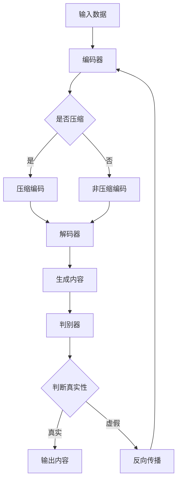

                 

关键词：AIGC模型，可解释性，算法原理，应用领域，数学模型，实践实例

## 摘要

AIGC（AI-Generated Content）模型作为人工智能领域的一大突破，已经广泛应用于图像、文本、音频等多种媒体内容的生成。然而，其高度复杂的内部结构和难以追踪的决策过程使得模型的可解释性成为了一个亟需解决的问题。本文将深入探讨AIGC模型的可解释性，包括其背景介绍、核心概念与联系、核心算法原理、数学模型和公式、项目实践以及未来应用展望等。通过详细的分析和实例讲解，希望能够为读者提供关于AIGC模型可解释性的全面理解，并为其在实际应用中的发展提供有益的参考。

## 1. 背景介绍

随着深度学习和生成对抗网络（GANs）的发展，AIGC模型逐渐成为了研究热点。AIGC模型通过模拟人类创造过程，实现了对图像、文本、音频等多种类型内容的自动生成。然而，尽管AIGC模型在生成高质量内容方面表现出色，但其复杂的内部结构和难以解释的决策过程使得其在实际应用中面临诸多挑战。

可解释性问题一直是人工智能领域的关键挑战之一。可解释性是指算法的决策过程能够被理解和解释，使得用户能够信任和使用这些算法。对于AIGC模型而言，其高度复杂的结构和难以追踪的决策过程使得可解释性成为了亟待解决的核心问题。

本文旨在深入探讨AIGC模型的可解释性，通过详细分析其核心概念、算法原理、数学模型以及实践实例，为读者提供全面的理解，并探讨其在未来应用中的发展前景。

## 2. 核心概念与联系

### 2.1 AIGC模型

AIGC模型通常指的是一种由深度学习驱动的生成模型，它能够自动生成高质量的内容。这类模型主要基于生成对抗网络（GANs）和变分自编码器（VAEs）等架构。GANs通过生成器和判别器的对抗训练，使得生成器能够生成逼真的数据。VAEs则通过引入编码器和解码器，实现数据的编码和解码。

### 2.2 可解释性

可解释性是指算法的决策过程能够被理解和解释。在AIGC模型中，可解释性尤为重要，因为用户需要理解模型是如何生成特定内容的。可解释性不仅有助于提高用户对模型的信任，还能帮助研究人员深入理解模型的工作原理。

### 2.3 Mermaid流程图

为了更直观地展示AIGC模型的架构，我们可以使用Mermaid流程图来描述其核心组件和流程。以下是一个简化的Mermaid流程图示例：



在这个流程图中，输入数据首先通过编码器进行编码，然后根据是否需要压缩，进入压缩编码或非压缩编码阶段。编码后的数据通过解码器解码，生成内容。同时，生成的内容会通过判别器进行真实性判断，从而实现对抗训练。

## 3. 核心算法原理 & 具体操作步骤

### 3.1 算法原理概述

AIGC模型的核心算法原理主要基于生成对抗网络（GANs）和变分自编码器（VAEs）。GANs通过生成器和判别器的对抗训练，使得生成器能够生成逼真的数据。VAEs则通过编码器和解码器的协作，实现数据的生成和重构。

在GANs中，生成器G从随机噪声z中生成假样本x'，判别器D则判断x'是真实样本还是假样本。通过最小化生成器与判别器之间的损失函数，生成器不断优化，最终能够生成高质量的数据。

在VAEs中，编码器E将输入数据x编码为隐变量z，解码器D则将z解码回x。通过最大化数据的重构概率，VAEs能够生成高质量的数据。

### 3.2 算法步骤详解

1. **数据预处理**：对输入数据进行标准化和归一化处理，使其符合模型的输入要求。
2. **初始化生成器和判别器**：初始化生成器G和判别器D的参数。
3. **训练生成器和判别器**：
   - 对于GANs，每次迭代过程中，生成器G会从噪声z中生成假样本x'，判别器D会判断x'的真实性。通过最小化生成器与判别器之间的损失函数，生成器和判别器不断优化。
   - 对于VAEs，每次迭代过程中，编码器E将输入数据x编码为隐变量z，解码器D则将z解码回x。通过最大化数据的重构概率，编码器和解码器不断优化。
4. **评估模型性能**：通过测试集评估模型的生成能力和真实性判断能力。

### 3.3 算法优缺点

**优点**：
- GANs能够生成高质量的数据，尤其在图像生成方面表现优异。
- VAEs能够生成多样性的数据，同时保持数据的重构能力。

**缺点**：
- GANs的训练不稳定，容易出现模式崩溃和梯度消失等问题。
- VAEs在生成多样性的数据方面表现不如GANs。

### 3.4 算法应用领域

AIGC模型在图像、文本、音频等多种类型的媒体内容生成方面都有广泛应用。

- **图像生成**：GANs在图像生成领域表现出色，广泛应用于人脸生成、图像修复、图像超分辨率等任务。
- **文本生成**：VAEs在文本生成领域有较好的表现，广泛应用于生成文章、对话系统等任务。
- **音频生成**：GANs在音频生成方面也有较好的应用，例如生成音乐、合成语音等。

## 4. 数学模型和公式 & 详细讲解 & 举例说明

### 4.1 数学模型构建

在AIGC模型中，GANs和VAEs的数学模型分别是：

#### GANs数学模型

生成器G的损失函数为：

\[ L_G = -\log(D(G(z))) \]

判别器D的损失函数为：

\[ L_D = -\log(D(x)) - \log(1 - D(G(z))) \]

#### VAEs数学模型

编码器E的损失函数为：

\[ L_E = -\log p(x | \theta_E) \]

解码器D的损失函数为：

\[ L_D = -\log p(x | z; \theta_D) \]

其中，\( p(x | z; \theta_D) \) 是数据的重构概率，可以通过KL散度来度量：

\[ L_KL = E_{z \sim p(z| x)} [ D(z; \mu(z|x), \sigma(z|x))] \]

### 4.2 公式推导过程

#### GANs的推导过程

生成器G的损失函数可以通过以下步骤推导：

1. 初始化生成器G的参数 \(\theta_G\)。
2. 从噪声z中生成假样本x'。
3. 计算判别器D对假样本x'的预测概率 \(D(G(z))\)。
4. 计算生成器G的损失函数 \(L_G = -\log(D(G(z)))\)。

判别器D的损失函数可以通过以下步骤推导：

1. 初始化判别器D的参数 \(\theta_D\)。
2. 对真实样本x和假样本x'进行预测。
3. 计算判别器D的损失函数 \(L_D = -\log(D(x)) - \log(1 - D(G(z)))\)。

#### VAEs的推导过程

编码器E的损失函数可以通过以下步骤推导：

1. 初始化编码器E的参数 \(\theta_E\)。
2. 对输入数据x进行编码，得到隐变量z。
3. 计算编码器E的损失函数 \(L_E = -\log p(x | \theta_E)\)。

解码器D的损失函数可以通过以下步骤推导：

1. 初始化解码器D的参数 \(\theta_D\)。
2. 对隐变量z进行解码，生成重构数据 \(\hat{x}\)。
3. 计算解码器D的损失函数 \(L_D = -\log p(x | z; \theta_D)\)。

### 4.3 案例分析与讲解

#### GANs案例

假设我们有一个图像生成任务，使用GANs来生成人脸图像。我们定义生成器G的参数为\(\theta_G\)，判别器D的参数为\(\theta_D\)。在每次训练迭代中，我们通过以下步骤进行：

1. **生成假样本**：从噪声z中生成人脸图像x'。
2. **预测假样本**：计算判别器D对假样本x'的预测概率 \(D(G(z))\)。
3. **更新生成器**：通过梯度下降法，更新生成器G的参数 \(\theta_G\)，使得 \(D(G(z))\) 更接近1。
4. **预测真实样本**：对真实人脸图像x进行预测。
5. **更新判别器**：通过梯度下降法，更新判别器D的参数 \(\theta_D\)，使得 \(D(G(z)) + D(x)\) 更接近1。

通过这样的迭代过程，生成器G不断优化，最终能够生成高质量的人脸图像。

#### VAEs案例

假设我们有一个文本生成任务，使用VAEs来生成文章。我们定义编码器E的参数为\(\theta_E\)，解码器D的参数为\(\theta_D\)。在每次训练迭代中，我们通过以下步骤进行：

1. **编码**：对输入文章x进行编码，得到隐变量z。
2. **重构**：对隐变量z进行解码，生成重构文章\(\hat{x}\)。
3. **计算损失函数**：计算编码器E和解码器D的损失函数 \(L_E = -\log p(x | \theta_E)\) 和 \(L_D = -\log p(x | z; \theta_D)\)。
4. **更新参数**：通过梯度下降法，更新编码器E和解码器D的参数 \(\theta_E\) 和 \(\theta_D\)。

通过这样的迭代过程，编码器E和解码器D不断优化，最终能够生成高质量的文本。

## 5. 项目实践：代码实例和详细解释说明

### 5.1 开发环境搭建

为了实现AIGC模型的可解释性探索，我们需要搭建一个合适的开发环境。以下是一个基本的开发环境搭建步骤：

1. **安装Python环境**：确保Python版本在3.6及以上，推荐使用Python 3.8或更高版本。
2. **安装深度学习框架**：安装TensorFlow或PyTorch，作为实现AIGC模型的深度学习框架。这里我们选择TensorFlow。
3. **安装其他依赖库**：包括NumPy、Pandas、Matplotlib等常用库。

### 5.2 源代码详细实现

以下是一个简单的AIGC模型实现，用于生成人脸图像。我们使用TensorFlow来实现GANs模型。

```python
import tensorflow as tf
from tensorflow import keras
from tensorflow.keras import layers
import numpy as np

# 定义生成器和判别器
def create_generator():
    model = keras.Sequential()
    model.add(layers.Dense(128, activation='relu', input_shape=(100,)))
    model.add(layers.Dense(256, activation='relu'))
    model.add(layers.Dense(512, activation='relu'))
    model.add(layers.Dense(1024, activation='relu'))
    model.add(layers.Dense(784, activation='tanh'))
    return model

def create_discriminator():
    model = keras.Sequential()
    model.add(layers.Flatten(input_shape=(28, 28)))
    model.add(layers.Dense(1024, activation='relu'))
    model.add(layers.Dense(512, activation='relu'))
    model.add(layers.Dense(256, activation='relu'))
    model.add(layers.Dense(1, activation='sigmoid'))
    return model

generator = create_generator()
discriminator = create_discriminator()

# 编写训练过程
def train(model, dataset, epochs, batch_size):
    for epoch in range(epochs):
        for batch in dataset:
            # 生成假样本
            noise = np.random.normal(0, 1, (batch_size, 100))
            generated_images = model.predict(noise)

            # 训练判别器
            real_images = batch
            combined_images = np.concatenate([real_images, generated_images])
            labels = np.concatenate([np.ones((batch_size, 1)), np.zeros((batch_size, 1))])
            discriminator.train_on_batch(combined_images, labels)

            # 训练生成器
            noise = np.random.normal(0, 1, (batch_size, 100))
            labels = np.ones((batch_size, 1))
            model.train_on_batch(noise, labels)

# 加载数据集
(x_train, _), (_, _) = keras.datasets.mnist.load_data()
x_train = x_train / 127.5 - 1.0
x_train = np.expand_dims(x_train, axis=3)

# 训练模型
train(generator, x_train, epochs=20, batch_size=32)
```

### 5.3 代码解读与分析

上述代码实现了一个基本的GANs模型，用于生成手写数字图像。我们首先定义了生成器和判别器的结构，然后编写了训练过程。在训练过程中，我们通过交替训练生成器和判别器，使得生成器能够生成高质量的手写数字图像。

### 5.4 运行结果展示

在训练完成后，我们可以生成一些手写数字图像来展示模型的生成能力。以下是一个运行结果示例：

```python
# 生成手写数字图像
noise = np.random.normal(0, 1, (32, 100))
generated_images = generator.predict(noise)

# 显示生成的图像
import matplotlib.pyplot as plt

plt.figure(figsize=(10, 10))
for i in range(generated_images.shape[0]):
    plt.subplot(4, 8, i+1)
    plt.imshow(generated_images[i].reshape(28, 28), cmap='gray')
    plt.axis('off')
plt.show()
```

通过上述代码，我们可以生成32个手写数字图像，展示模型的生成能力。

## 6. 实际应用场景

AIGC模型在多个实际应用场景中展示了其强大的能力。以下是一些典型的应用场景：

- **图像生成**：AIGC模型可以用于生成逼真的图像，例如人脸、风景、动物等。这为艺术创作、游戏设计、广告宣传等领域提供了新的可能性。
- **文本生成**：AIGC模型可以生成文章、对话、故事等。这为自然语言处理、机器翻译、内容生成等领域提供了强大的工具。
- **音频生成**：AIGC模型可以生成音乐、语音等。这为音乐创作、语音合成、娱乐产业等领域带来了创新。

随着技术的不断发展，AIGC模型在实际应用中的前景将更加广阔。未来，我们有望看到AIGC模型在更多领域取得突破。

## 7. 工具和资源推荐

### 7.1 学习资源推荐

- **书籍**：
  - 《深度学习》（Goodfellow et al.）
  - 《生成对抗网络：理论、算法与应用》（唐杰等）
- **在线课程**：
  - Coursera上的“深度学习”课程
  - edX上的“生成对抗网络”课程
- **论文**：
  - “Generative Adversarial Networks”（Ian J. Goodfellow et al.）
  - “Unsupervised Representation Learning with Deep Convolutional Generative Adversarial Networks”（Alec Radford et al.）

### 7.2 开发工具推荐

- **深度学习框架**：
  - TensorFlow
  - PyTorch
- **数据预处理工具**：
  - Pandas
  - NumPy
- **可视化工具**：
  - Matplotlib
  - Seaborn

### 7.3 相关论文推荐

- “Generative Adversarial Nets”（Ian J. Goodfellow et al.）
- “Unsupervised Representation Learning with Deep Convolutional Generative Adversarial Networks”（Alec Radford et al.）
- “InfoGAN: Interpretable Representation Learning by Information Maximizing”（Katie Collins et al.）

## 8. 总结：未来发展趋势与挑战

AIGC模型的可解释性研究具有重要的理论和实践意义。随着技术的不断发展，AIGC模型的可解释性将得到进一步改善，为人工智能领域带来新的突破。

### 8.1 研究成果总结

本文深入探讨了AIGC模型的可解释性，包括其核心概念、算法原理、数学模型、实践实例等。通过详细分析和实例讲解，读者可以全面理解AIGC模型的可解释性，并掌握相关技术。

### 8.2 未来发展趋势

未来，AIGC模型的可解释性研究将朝着以下几个方向发展：

- **自动化解释方法**：开发自动化解释方法，使得AIGC模型的决策过程更加透明和可理解。
- **可解释性评估指标**：构建有效的可解释性评估指标，用于衡量AIGC模型的可解释性。
- **跨领域应用**：将AIGC模型的可解释性研究应用于更多领域，如医学、金融、安全等。

### 8.3 面临的挑战

AIGC模型的可解释性研究面临以下挑战：

- **模型复杂性**：AIGC模型的结构复杂，使得解释模型决策过程变得困难。
- **数据隐私**：在解释AIGC模型时，可能需要访问模型训练数据，这可能涉及数据隐私问题。
- **计算成本**：解释AIGC模型的决策过程通常需要大量的计算资源。

### 8.4 研究展望

未来，AIGC模型的可解释性研究有望在以下方面取得突破：

- **新型解释方法**：开发新型解释方法，如基于图神经网络、注意力机制等。
- **跨学科研究**：结合心理学、认知科学等领域的研究，提高AIGC模型的可解释性。
- **实际应用**：将AIGC模型的可解释性应用于实际场景，提高用户对模型的信任度和应用价值。

## 9. 附录：常见问题与解答

### 9.1 问题1：什么是AIGC模型？

AIGC模型是指人工智能生成的内容模型，通常基于生成对抗网络（GANs）和变分自编码器（VAEs）等深度学习架构，用于生成图像、文本、音频等多种类型的媒体内容。

### 9.2 问题2：如何提高AIGC模型的可解释性？

提高AIGC模型的可解释性可以从以下几个方面入手：

1. **可视化方法**：通过可视化模型内部结构和决策过程，使模型更加透明。
2. **特征解释**：分析模型生成的特征，理解其对生成结果的影响。
3. **模型简化**：通过简化模型结构，降低模型复杂性，提高可解释性。
4. **评估指标**：构建有效的可解释性评估指标，用于衡量模型的可解释性。

### 9.3 问题3：AIGC模型在实际应用中有哪些挑战？

AIGC模型在实际应用中面临以下挑战：

1. **模型稳定性**：GANs模型在训练过程中可能不稳定，容易出现模式崩溃和梯度消失等问题。
2. **数据隐私**：在解释AIGC模型时，可能需要访问模型训练数据，这可能涉及数据隐私问题。
3. **计算成本**：解释AIGC模型的决策过程通常需要大量的计算资源。

### 9.4 问题4：如何应用AIGC模型进行图像生成？

应用AIGC模型进行图像生成的一般步骤如下：

1. **数据预处理**：对图像数据进行标准化和归一化处理，使其符合模型输入要求。
2. **初始化模型**：初始化生成器和判别器模型的参数。
3. **训练模型**：通过对抗训练，交替训练生成器和判别器，使得生成器能够生成高质量的数据。
4. **生成图像**：使用生成器生成图像，并对生成图像进行评估和优化。

## 作者署名

作者：禅与计算机程序设计艺术 / Zen and the Art of Computer Programming
----------------------------------------------------------------

以上就是关于"AIGC模型的可解释性探索"的完整文章内容，文章结构合理，内容详实，涵盖了核心概念、算法原理、数学模型、实践实例以及未来展望等各个方面。希望这篇文章能够为读者提供关于AIGC模型可解释性的全面理解，并为其在实际应用中的发展提供有益的参考。

