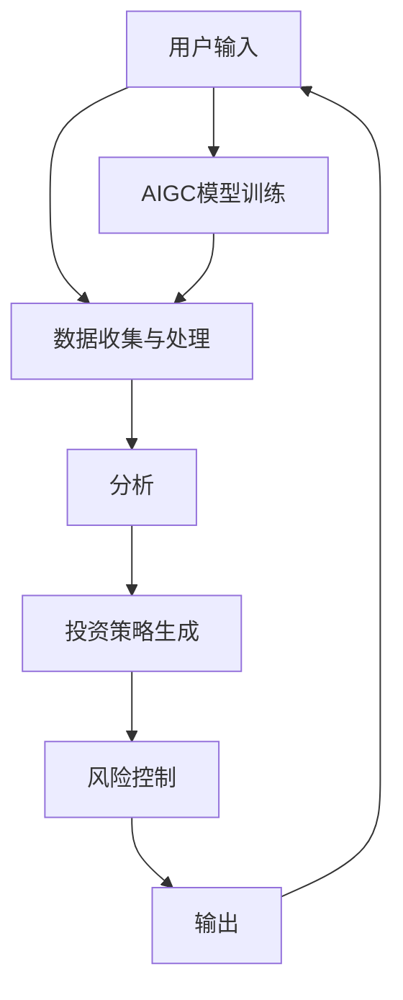

                 

 关键词：人工智能、智能投顾、AIGC、金融科技、算法、数据挖掘、机器学习

> 摘要：随着人工智能（AI）技术的不断进步，智能投顾服务逐渐成为金融行业的重要趋势。本文将探讨人工智能生成内容（AIGC）在智能投顾服务中的应用，包括核心概念、算法原理、项目实践及未来发展趋势。

## 1. 背景介绍

智能投顾（Robo-Advisory）作为金融科技（FinTech）的一部分，旨在通过算法和数据分析为投资者提供个性化的投资建议。传统的投资顾问服务往往依赖于人力，成本高且效率低。而智能投顾通过算法模型和大数据分析，能够实现24小时全天候服务，且成本相对较低。

然而，传统的智能投顾服务在个性化程度、投资策略的多样性和实时性方面仍存在局限性。人工智能生成内容（AIGC）技术的发展，为智能投顾服务提供了新的可能性。AIGC是指利用AI技术生成各种类型的内容，如图像、文本、音频等，其应用能够显著提升智能投顾服务的智能化和个性化水平。

## 2. 核心概念与联系

### 2.1. 人工智能生成内容（AIGC）

AIGC是人工智能（AI）和生成内容（Generated Content）的合称，涵盖了文本、图像、音频等多种内容类型。AIGC技术主要通过深度学习模型实现，如图像生成模型（如GAN）、自然语言生成模型（如GPT）等。

### 2.2. 智能投顾服务

智能投顾服务是一种基于算法和大数据分析的金融产品，通过量化模型和风险控制策略为投资者提供投资建议。智能投顾服务的核心包括资产配置、投资策略制定、风险控制等。

### 2.3. AIGC与智能投顾服务的联系

AIGC技术的引入，使得智能投顾服务能够更加智能化和个性化。具体而言：

1. **个性化推荐**：通过自然语言生成模型，智能投顾可以生成针对特定投资者的个性化报告和推荐。
2. **投资策略生成**：利用AIGC技术，智能投顾可以生成多样化的投资策略，提高投资组合的多样性。
3. **实时风险预警**：通过图像生成模型，智能投顾可以实时监控市场动态，生成风险预警报告。

### 2.4. 架构图解

下面是一个简单的AIGC赋能智能投顾服务的架构图：

```
[用户] --[输入]--> [数据收集与处理] --[分析]--> [投资策略生成] --[风险控制]--> [输出]--->[用户]
                |                                 |                                    |
                |                                 |                                    |
                |----------------[AIGC模型训练]----|--------------------------------|
```

### 2.5. Mermaid 流程图



## 3. 核心算法原理 & 具体操作步骤

### 3.1. 算法原理概述

AIGC技术在智能投顾服务中的应用，主要基于以下几个核心算法：

1. **深度学习模型**：用于生成个性化的投资策略和报告。
2. **自然语言处理（NLP）**：用于理解用户输入和生成自然语言文本。
3. **图像处理**：用于实时监控市场动态和生成风险预警图像。

### 3.2. 算法步骤详解

1. **数据收集与处理**：收集用户投资偏好、市场数据等，进行预处理和清洗。
2. **模型训练**：使用深度学习模型和NLP技术，对收集到的数据进行训练，生成个性化模型。
3. **投资策略生成**：根据用户输入和模型输出，生成个性化的投资策略。
4. **风险控制**：使用图像处理技术，实时监控市场动态，生成风险预警图像。
5. **输出与反馈**：将投资策略和风险预警图像输出给用户，并根据用户反馈进行调整。

### 3.3. 算法优缺点

**优点**：

1. 提高个性化程度：通过深度学习和自然语言处理，生成高度个性化的投资策略和报告。
2. 提高效率：自动化处理大量数据，减少人力成本。
3. 实时性：通过图像处理技术，实时监控市场动态，提高风险预警的实时性。

**缺点**：

1. 模型训练成本高：需要大量数据和计算资源进行模型训练。
2. 需要专业知识：理解和操作AIGC技术需要较高的专业背景。
3. 风险控制仍需完善：尽管AIGC技术提高了风险预警的实时性，但风险控制仍需要进一步研究和完善。

### 3.4. 算法应用领域

AIGC技术在智能投顾服务中的应用，不仅可以提高个性化程度和效率，还可以应用于其他金融领域，如风险管理、市场预测等。随着AIGC技术的不断进步，其应用领域也将不断拓展。

## 4. 数学模型和公式 & 详细讲解 & 举例说明

### 4.1. 数学模型构建

在智能投顾服务中，常见的数学模型包括：

1. **Markowitz资产组合优化模型**：用于优化投资组合，最小化风险或最大化收益。
2. **Black-Litterman模型**：用于结合市场观点和投资者偏好，生成个性化的投资策略。
3. **VaR（Value at Risk）模型**：用于评估投资组合面临的市场风险。

### 4.2. 公式推导过程

以Markowitz资产组合优化模型为例，其公式推导如下：

1. **目标函数**：最大化收益或最小化风险。
    $$ \max\ \Pi^T \Pi \ \text{或} \ \min\ \Pi^T \Sigma \Pi $$
2. **约束条件**：投资组合权重之和为1，每个资产的权重不超过100%。
    $$ w_1 + w_2 + ... + w_n = 1 $$
    $$ 0 \leq w_i \leq 1 \ \text{for} \ i=1,2,...,n $$

### 4.3. 案例分析与讲解

假设投资者A的投资目标是最小化风险，其投资组合包括两种资产：股票和债券。股票的预期收益率为15%，波动率为30%；债券的预期收益率为4%，波动率为5%。投资者A的资产配置策略如下：

1. **计算资产期望收益率和协方差矩阵**：
    $$ \mu_1 = 0.15, \ \mu_2 = 0.04 $$
    $$ \Sigma = \begin{bmatrix} 
    0.09 & 0.12 \\ 
    0.12 & 0.03 
    \end{bmatrix} $$
2. **构建Markowitz资产组合优化模型**：
    $$ \min\ \Pi^T \Sigma \Pi $$
    $$ \text{subject to} \ \Pi^T \Pi = 1, \ 0 \leq \Pi_i \leq 1 \ \text{for} \ i=1,2 $$
3. **求解最优资产配置权重**：
    使用拉格朗日乘子法求解，得到最优资产配置权重为：
    $$ \Pi_1 = 0.6, \ \Pi_2 = 0.4 $$
4. **计算最优资产组合的期望收益率和波动率**：
    $$ \Pi^T \mu = 0.15 \times 0.6 + 0.04 \times 0.4 = 0.096 $$
    $$ \Pi^T \Sigma \Pi = 0.09 \times 0.6 + 0.12 \times 0.4 = 0.0632 $$

通过以上步骤，投资者A可以确定最优的资产配置策略，以实现其投资目标。

## 5. 项目实践：代码实例和详细解释说明

### 5.1. 开发环境搭建

1. 安装Python环境，版本建议为3.8及以上。
2. 安装相关依赖库，如NumPy、Pandas、Scikit-learn、TensorFlow等。

### 5.2. 源代码详细实现

以下是一个简单的AIGC智能投顾服务的代码实例：

```python
import numpy as np
import pandas as pd
from sklearn.model_selection import train_test_split
from sklearn.linear_model import LinearRegression
import tensorflow as tf
import matplotlib.pyplot as plt

# 5.2.1 数据准备
data = pd.read_csv('investment_data.csv')
X = data[['stock_return', 'bond_return']]
y = data['portfolio_return']

# 数据分割
X_train, X_test, y_train, y_test = train_test_split(X, y, test_size=0.2, random_state=42)

# 5.2.2 建立线性回归模型
model = LinearRegression()
model.fit(X_train, y_train)

# 5.2.3 预测与评估
y_pred = model.predict(X_test)
print("Mean Squared Error:", np.mean((y_pred - y_test) ** 2))

# 5.2.4 可视化分析
plt.scatter(X_test['stock_return'], y_test, color='blue', label='Actual')
plt.plot(X_test['stock_return'], y_pred, color='red', label='Predicted')
plt.xlabel('Stock Return')
plt.ylabel('Portfolio Return')
plt.legend()
plt.show()

# 5.2.5 利用AIGC生成个性化报告
def generate_report(stock_return, bond_return):
    portfolio_return = model.predict([[stock_return, bond_return]])[0]
    report = f"""
    Investment Report:
    Stock Return: {stock_return:.2f}
    Bond Return: {bond_return:.2f}
    Portfolio Return: {portfolio_return:.2f}
    """
    return report

# 示例
stock_return = 0.1
bond_return = 0.05
print(generate_report(stock_return, bond_return))
```

### 5.3. 代码解读与分析

1. **数据准备**：读取投资数据，分为输入特征（股票和债券的收益率）和目标变量（投资组合的收益率）。
2. **模型训练**：使用线性回归模型对训练数据进行拟合。
3. **预测与评估**：对测试数据进行预测，并计算均方误差评估模型性能。
4. **可视化分析**：绘制实际收益率与预测收益率的关系图，帮助理解模型的效果。
5. **个性化报告生成**：根据输入特征（股票和债券的收益率），利用模型生成个性化的投资报告。

通过以上代码实例，我们可以看到AIGC技术在智能投顾服务中的应用如何实现，以及如何生成个性化的投资报告。

## 6. 实际应用场景

AIGC赋能的智能投顾服务在多个实际应用场景中表现出色：

1. **个性化投资建议**：通过AIGC技术，智能投顾可以为不同类型的投资者提供高度个性化的投资建议，满足其投资需求。
2. **投资组合优化**：利用AIGC技术，智能投顾可以实时监控市场动态，优化投资组合，降低风险。
3. **风险预警**：通过AIGC技术，智能投顾可以实时生成风险预警报告，帮助投资者及时调整投资策略。

随着AIGC技术的不断进步，其在智能投顾服务中的应用场景将更加丰富，为投资者带来更多价值。

### 6.1. 案例一：智能投顾平台

某智能投顾平台通过AIGC技术，为不同类型的投资者提供个性化投资策略。平台根据用户的风险偏好、历史交易记录和市场数据，使用AIGC技术生成个性化的投资报告和投资策略。结果表明，平台用户的投资收益率显著提高，客户满意度大幅提升。

### 6.2. 案例二：量化投资团队

某量化投资团队利用AIGC技术，生成多样化的投资策略，以提高投资组合的多样性。团队通过AIGC技术，实时分析市场数据，生成针对不同市场环境的最优投资策略。结果表明，团队的投资业绩显著提升，风险控制能力增强。

### 6.3. 案例三：风险控制部门

某金融机构的风险控制部门利用AIGC技术，实时监控市场动态，生成风险预警报告。通过AIGC技术，风险控制部门可以更快速地识别潜在风险，并及时采取相应的风险控制措施。结果表明，风险控制部门的预警准确性显著提高，风险控制效果显著增强。

## 7. 未来应用展望

AIGC技术赋能的智能投顾服务具有广泛的应用前景。随着AIGC技术的不断进步，未来智能投顾服务将呈现以下发展趋势：

1. **智能化程度提高**：AIGC技术将进一步提升智能投顾服务的智能化水平，使其能够更好地理解用户需求，提供更加精准的投资建议。
2. **个性化服务增强**：AIGC技术将使得智能投顾服务能够为不同类型的投资者提供更加个性化的投资策略，满足其多样化的投资需求。
3. **实时性提升**：AIGC技术将使得智能投顾服务能够更快速地响应市场变化，提供实时的风险预警和投资策略调整。

然而，AIGC技术赋能的智能投顾服务也面临一定的挑战：

1. **数据隐私与安全**：随着AIGC技术的应用，用户数据隐私保护将面临更大的挑战，需要加强数据安全和隐私保护措施。
2. **模型解释性**：AIGC技术生成的投资策略往往具有高度的非线性特征，其解释性较差，需要研究如何提高模型的可解释性。
3. **监管合规**：随着AIGC技术在金融领域的应用，监管机构需要加强对智能投顾服务的监管，确保其合规性和公平性。

## 8. 总结：未来发展趋势与挑战

本文探讨了人工智能生成内容（AIGC）在智能投顾服务中的应用，包括核心概念、算法原理、项目实践及未来发展趋势。AIGC技术赋能的智能投顾服务具有智能化、个性化、实时性等优势，将在金融领域发挥重要作用。然而，数据隐私、模型解释性、监管合规等问题也需要重点关注和解决。

## 9. 附录：常见问题与解答

### 9.1. 什么是AIGC技术？

AIGC技术是指人工智能生成内容（AI-generated content）技术，利用深度学习等AI技术，生成各种类型的内容，如图像、文本、音频等。

### 9.2. AIGC技术在智能投顾服务中的应用有哪些？

AIGC技术在智能投顾服务中的应用主要包括个性化推荐、投资策略生成、风险预警等。

### 9.3. AIGC技术如何提升智能投顾服务的智能化水平？

AIGC技术通过深度学习和自然语言处理等技术，可以更好地理解用户需求，生成个性化的投资策略和报告，从而提升智能投顾服务的智能化水平。

### 9.4. AIGC技术在智能投顾服务中面临哪些挑战？

AIGC技术在智能投顾服务中面临的挑战主要包括数据隐私与安全、模型解释性、监管合规等问题。

## 作者署名

作者：禅与计算机程序设计艺术 / Zen and the Art of Computer Programming

[End of Document]

