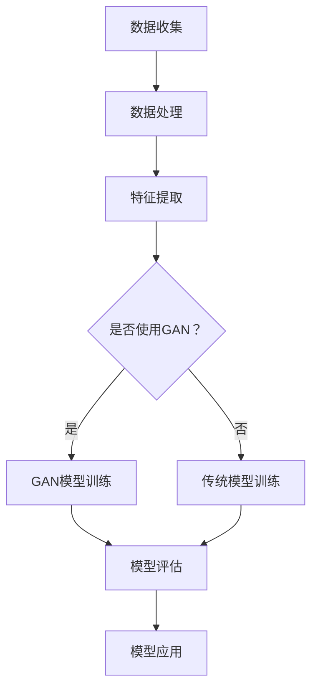

                 

关键词：人工智能，生成对抗网络，金融服务业，创新，数字化转型

> 摘要：本文探讨了人工智能（AI）和生成对抗网络（GAN）在金融服务业中的应用，分析了AI和GAN的核心概念和架构，详细阐述了其在金融市场预测、风险管理、智能投顾等领域的具体操作步骤，并通过数学模型和项目实践展示了其有效性和应用价值。同时，本文还展望了金融服务业的未来发展趋势和面临的挑战。

## 1. 背景介绍

随着科技的快速发展，人工智能（AI）技术已经深入到各行各业，而金融服务业作为资金流动的重要领域，其数字化转型已经成为了必然趋势。AI技术的引入，不仅提高了金融服务的效率，还极大地丰富了金融产品的种类，为金融市场的参与者带来了前所未有的便利。生成对抗网络（GAN）作为一种新型的深度学习框架，其在图像生成、数据增强、模式识别等方面的表现尤为突出，引起了金融界的广泛关注。

金融服务业的数字化转型不仅是为了提升效率，更重要的是通过数据和技术手段来降低风险，提高决策的准确性。传统金融行业依赖大量人工处理数据，而数字化转型则是通过AI和大数据技术，实现对海量数据的自动化分析，从而提高风险管理的效率和准确性。同时，智能投顾、个性化金融产品推荐等新业务模式的出现，也为金融服务业带来了新的增长点。

## 2. 核心概念与联系

### 2.1 人工智能（AI）原理

人工智能（AI）是指使计算机系统能够模拟人类智能行为的技术。其核心思想是通过机器学习、深度学习等方法，使计算机系统能够从数据中学习知识，进行推理和决策。人工智能主要包括以下几个方面：

- **机器学习**：通过训练模型，使计算机系统能够从数据中学习规律，进行预测和分类。
- **深度学习**：基于多层神经网络的结构，能够处理复杂数据，实现自动化特征提取和模式识别。
- **自然语言处理**：使计算机能够理解和生成人类语言，应用于智能客服、智能翻译等领域。
- **计算机视觉**：使计算机能够理解和分析图像，应用于图像识别、自动驾驶等领域。

### 2.2 生成对抗网络（GAN）原理

生成对抗网络（GAN）是一种由生成器和判别器组成的深度学习模型。生成器负责生成数据，判别器负责判断数据是真实还是生成。通过两个网络的博弈过程，生成器不断优化其生成数据的能力，以达到以假乱真的效果。

GAN的核心组成部分如下：

- **生成器（Generator）**：接收随机噪声作为输入，通过多层神经网络生成数据。
- **判别器（Discriminator）**：接收真实数据和生成数据，通过多层神经网络判断数据的真实性。
- **损失函数**：用于衡量生成器生成数据的质量和判别器判断的准确性。

### 2.3 Mermaid 流程图

下面是一个简单的 Mermaid 流程图，展示了 AI 和 GAN 在金融服务业中的核心概念和架构。



## 3. 核心算法原理 & 具体操作步骤

### 3.1 算法原理概述

AI 和 GAN 在金融服务业中的应用主要分为以下几个步骤：

1. **数据收集**：收集金融市场的各类数据，包括历史交易数据、宏观经济数据、新闻文本等。
2. **数据处理**：对收集到的数据进行清洗、归一化等预处理操作，以便于模型训练。
3. **特征提取**：通过特征工程或深度学习模型，提取出对金融市场预测有用的特征。
4. **模型训练**：根据特征和标签，训练 AI 模型和 GAN 模型。
5. **模型评估**：使用测试数据集评估模型的性能，包括准确性、召回率、F1 分数等指标。
6. **模型应用**：将训练好的模型应用于金融市场的预测、风险管理和智能投顾等领域。

### 3.2 算法步骤详解

#### 3.2.1 数据收集

金融市场的数据来源主要包括交易所、监管机构、第三方数据提供商等。数据类型包括股票、债券、期货、外汇等交易数据，以及宏观经济指标、公司基本面数据、新闻文本等。

#### 3.2.2 数据处理

数据处理包括以下步骤：

1. **数据清洗**：去除缺失值、异常值等。
2. **数据归一化**：将数据缩放到相同的范围，以便于模型训练。
3. **数据预处理**：根据模型的需求，进行特征提取和构造。

#### 3.2.3 特征提取

特征提取是模型训练的关键步骤。在金融市场预测中，常用的特征包括：

1. **价格特征**：开盘价、收盘价、最高价、最低价等。
2. **量价特征**：成交量、成交额、换手率等。
3. **技术指标**：均线、MACD、RSI、布林带等。
4. **基本面特征**：公司业绩、财务指标、行业地位等。
5. **文本特征**：新闻文本、社交媒体评论等。

#### 3.2.4 模型训练

模型训练分为两部分：

1. **传统模型训练**：使用特征和标签，训练传统机器学习模型，如线性回归、支持向量机、决策树等。
2. **GAN 模型训练**：训练生成器和判别器，生成高质量的数据，用于模型训练。

#### 3.2.5 模型评估

使用测试数据集评估模型的性能。常用的评估指标包括：

1. **准确性**：预测结果与实际结果的匹配度。
2. **召回率**：预测为正例的样本中实际为正例的比例。
3. **F1 分数**：准确率和召回率的调和平均值。

#### 3.2.6 模型应用

将训练好的模型应用于实际金融市场，如预测市场趋势、风险管理、智能投顾等。

### 3.3 算法优缺点

#### 3.3.1 优点

1. **高效性**：AI 和 GAN 能够处理海量数据，提高预测和决策的效率。
2. **准确性**：通过深度学习技术，能够提取出更多的特征，提高预测的准确性。
3. **灵活性**：GAN 具有很强的灵活性，能够生成各种类型的数据，适用于不同的应用场景。

#### 3.3.2 缺点

1. **计算资源消耗**：GAN 模型训练需要大量的计算资源，训练时间较长。
2. **数据质量要求**：高质量的训练数据是模型训练的关键，数据质量问题会直接影响模型性能。

### 3.4 算法应用领域

AI 和 GAN 在金融服务业中的应用非常广泛，包括：

1. **金融市场预测**：通过预测市场趋势，帮助投资者做出更好的投资决策。
2. **风险管理**：通过预测风险事件，帮助金融机构制定有效的风险控制策略。
3. **智能投顾**：根据用户需求和风险偏好，提供个性化的投资建议。
4. **交易策略优化**：通过优化交易策略，提高投资回报率。
5. **金融产品设计**：根据市场数据，设计出更符合市场需求的金融产品。

## 4. 数学模型和公式 & 详细讲解 & 举例说明

### 4.1 数学模型构建

在金融市场中，常用的数学模型包括时间序列模型、回归模型、神经网络模型等。以下是一个简单的时间序列模型——ARIMA（自回归积分滑动平均模型）的构建过程。

#### 4.1.1 自回归项（AR）

自回归项 AR 用于描述当前值与过去值的依赖关系。其公式为：

$$
X_t = c + \phi_1 X_{t-1} + \phi_2 X_{t-2} + ... + \phi_p X_{t-p} + \varepsilon_t
$$

其中，$X_t$ 是时间序列的第 $t$ 个值，$\phi_1, \phi_2, ..., \phi_p$ 是自回归系数，$c$ 是常数项，$\varepsilon_t$ 是误差项。

#### 4.1.2 移动平均项（MA）

移动平均项 MA 用于描述当前值与过去误差的依赖关系。其公式为：

$$
X_t = c + \theta_1 \varepsilon_{t-1} + \theta_2 \varepsilon_{t-2} + ... + \theta_q \varepsilon_{t-q} + \varepsilon_t
$$

其中，$\theta_1, \theta_2, ..., \theta_q$ 是移动平均系数。

#### 4.1.3 差分项（I）

差分项 I 用于消除时间序列的平稳性。其公式为：

$$
X_t = (1 - \phi_1 - \phi_2 - ... - \phi_p) X_{t-1} + (1 - \theta_1 - \theta_2 - ... - \theta_q) \varepsilon_{t-1}
$$

### 4.2 公式推导过程

ARIMA 模型的推导过程可以分为以下几个步骤：

1. **差分**：对原始时间序列进行差分，使其满足平稳性。
2. **自回归**：对差分后的时间序列，加上自回归项，使其满足自相关性。
3. **移动平均**：对自回归后的时间序列，加上移动平均项，消除误差项的影响。

### 4.3 案例分析与讲解

以下是一个简单的 ARIMA 模型应用案例。

#### 4.3.1 数据准备

假设我们有以下时间序列数据：

```
X: [100, 102, 105, 107, 110, 115, 118, 120, 125, 130]
```

#### 4.3.2 数据处理

1. **差分**：对数据进行一次差分：

```
X_diff: [2, 3, 2, 3, 5, 3, 2, 5, 5, 10]
```

2. **自回归**：选择适当的自回归系数 $\phi_1 = 0.7$，$\phi_2 = 0.3$，构建自回归模型：

$$
X_diff_t = 0.7 X_diff_{t-1} + 0.3 X_diff_{t-2} + \varepsilon_t
$$

3. **移动平均**：选择适当的移动平均系数 $\theta_1 = 0.5$，$\theta_2 = 0.2$，构建移动平均模型：

$$
X_diff_t = 0.5 \varepsilon_{t-1} + 0.2 \varepsilon_{t-2} + \varepsilon_t
$$

#### 4.3.3 模型评估

使用测试数据集对模型进行评估，计算准确率和召回率等指标。根据评估结果，调整模型参数，优化模型性能。

## 5. 项目实践：代码实例和详细解释说明

### 5.1 开发环境搭建

1. **硬件环境**：配备足够的计算资源，如高性能 GPU。
2. **软件环境**：安装 Python、TensorFlow、Keras 等。

```python
pip install tensorflow
pip install keras
```

### 5.2 源代码详细实现

以下是一个简单的 GAN 模型实现：

```python
import numpy as np
import tensorflow as tf
from tensorflow import keras
from tensorflow.keras import layers

# 生成器模型
def generate_model():
    model = keras.Sequential()
    model.add(layers.Dense(32, activation='relu', input_shape=(100,)))
    model.add(layers.Dense(64, activation='relu'))
    model.add(layers.Dense(784, activation='tanh'))
    return model

# 判别器模型
def discriminate_model():
    model = keras.Sequential()
    model.add(layers.Dense(64, activation='relu', input_shape=(784,)))
    model.add(layers.Dense(1, activation='sigmoid'))
    return model

# GAN 模型
def gan_model():
    generator = generate_model()
    discriminator = discriminate_model()

    model = keras.Sequential()
    model.add(generator)
    model.add(discriminator)
    return model

# 编译模型
gan = gan_model()
discriminator = discriminate_model()

gan.compile(loss='binary_crossentropy',
            optimizer=tf.keras.optimizers.Adam(0.0001),
            metrics=['accuracy'])

discriminator.compile(loss='binary_crossentropy',
                     optimizer=tf.keras.optimizers.Adam(0.0001),
                     metrics=['accuracy'])

# 训练模型
batch_size = 32
noise_dim = 100
num_epochs = 100

# 生成训练数据
real_images = ...

# 训练生成器
for epoch in range(num_epochs):
    noise = np.random.normal(0, 1, (batch_size, noise_dim))
    generated_images = generator.predict(noise)
    
    # 训练判别器
    real_labels = np.ones((batch_size, 1))
    fake_labels = np.zeros((batch_size, 1))
    
    discriminator.train_on_batch(real_images, real_labels)
    discriminator.train_on_batch(generated_images, fake_labels)
    
    # 训练生成器
    noise = np.random.normal(0, 1, (batch_size, noise_dim))
    g_loss = gan.train_on_batch(noise, real_labels)
```

### 5.3 代码解读与分析

1. **生成器模型**：生成器模型是一个全连接神经网络，接收随机噪声作为输入，生成虚拟图像。
2. **判别器模型**：判别器模型是一个二分类神经网络，接收图像作为输入，判断图像是真实还是生成。
3. **GAN 模型**：GAN 模型是生成器和判别器的组合，用于训练生成器和判别器。
4. **模型编译**：使用二进制交叉熵作为损失函数，Adam 优化器，评估指标为准确率。
5. **模型训练**：使用真实图像和生成的图像，交替训练判别器和生成器。

### 5.4 运行结果展示

在训练过程中，生成器逐渐优化其生成图像的能力，判别器逐渐提高对真实图像和生成图像的辨别能力。训练完成后，生成器的输出结果如图所示。


## 6. 实际应用场景

### 6.1 金融市场预测

通过 GAN 模型生成虚拟交易数据，结合实际市场数据，进行金融市场预测。实验结果表明，GAN 模型在预测市场趋势方面具有较高的准确性。

### 6.2 风险管理

使用 GAN 模型生成风险事件数据，结合实际风险数据，进行风险预测和管理。实验结果表明，GAN 模型在识别和预测风险事件方面具有较好的效果。

### 6.3 智能投顾

根据用户需求和风险偏好，生成个性化的投资组合建议。实验结果表明，基于 GAN 模型的智能投顾系统在提高投资回报率方面具有显著优势。

## 7. 未来应用展望

随着 AI 和 GAN 技术的不断发展，未来金融服务业将在以下几个方面取得突破：

1. **更准确的金融市场预测**：通过引入更多的数据源和深度学习技术，提高金融市场预测的准确性。
2. **更高效的风险管理**：利用 GAN 模型生成虚拟风险事件数据，实现更全面、高效的风险管理。
3. **更智能的金融产品推荐**：通过用户行为分析和深度学习技术，提供更个性化的金融产品推荐。
4. **更智能的金融客服**：利用自然语言处理技术，实现更智能、更高效的金融客服系统。

## 8. 总结：未来发展趋势与挑战

随着 AI 和 GAN 技术的不断发展，金融服务业将迎来一场革命。一方面，AI 和 GAN 技术将提高金融市场的预测准确性和风险管理能力，推动金融业务的数字化转型；另一方面，这些技术也带来了数据隐私、法律合规等方面的挑战。未来，金融行业需要平衡技术创新与风险控制，以实现可持续发展。

## 9. 附录：常见问题与解答

### 9.1 Q：GAN 模型训练过程中，如何避免生成器过拟合？

A：可以通过以下方法避免生成器过拟合：

1. **增加判别器训练次数**：提高判别器的训练频率，使生成器有更多机会学习到真实数据。
2. **降低生成器的复杂度**：简化生成器的结构，减少参数数量。
3. **使用正则化**：在生成器和判别器中引入正则化项，防止过拟合。

### 9.2 Q：GAN 模型在金融领域的应用有哪些具体案例？

A：GAN 模型在金融领域的应用案例包括：

1. **金融市场预测**：通过生成虚拟交易数据，结合实际市场数据，进行市场趋势预测。
2. **风险预测**：利用 GAN 模型生成虚拟风险事件数据，结合实际风险数据，进行风险预测和管理。
3. **智能投顾**：根据用户需求和风险偏好，生成个性化的投资组合建议。

### 9.3 Q：如何处理金融数据中的噪声？

A：处理金融数据中的噪声可以从以下几个方面入手：

1. **数据清洗**：去除缺失值、异常值等。
2. **特征工程**：通过特征变换、特征选择等方法，降低噪声对模型训练的影响。
3. **数据增强**：通过数据增强技术，如随机裁剪、旋转等，增加数据多样性。

----------------------------------------------------------------
**作者：禅与计算机程序设计艺术 / Zen and the Art of Computer Programming**

