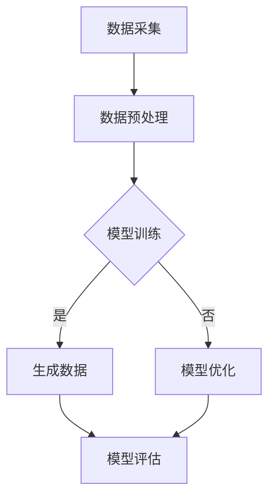

                 

关键词：人工智能、生成式人工智能（AIGC）、金融服务业、数字金融、智能投顾、数据分析、区块链、网络安全、数字化转型

摘要：本文深入探讨了人工智能（AI），尤其是生成式人工智能（AIGC），如何正在彻底重塑金融服务业。通过对AIGC技术的核心概念、应用场景、数学模型和具体实现步骤的详细解析，本文揭示了AIGC在金融领域的巨大潜力和广泛影响。从智能投顾、数据分析到区块链和网络安全，AIGC正成为金融创新的驱动力，引领行业走向数字化、智能化和高效化的未来。

## 1. 背景介绍

金融服务业是一个充满活力且不断发展的行业。随着全球经济的数字化转型，金融科技（FinTech）的兴起正日益改变传统金融服务的面貌。从网上银行到移动支付，从区块链到加密货币，金融科技正在推动金融服务的创新和效率提升。然而，尽管金融科技已经带来了显著的变化，但生成式人工智能（AIGC）的崛起，即将带来更深远的影响。

生成式人工智能（AIGC）是一种能够生成文本、图像、音频和视频等数据内容的人工智能技术。它基于深度学习算法，特别是生成对抗网络（GANs）、变分自编码器（VAEs）和自注意力机制（如BERT）等，能够从少量样本中学习，生成高质量、多样化的数据。AIGC的出现，标志着人工智能从“模仿”人类智能迈向“创造”人类智能的新阶段。

在金融服务业，AIGC的应用潜力巨大。它可以用于智能投顾、个性化金融服务、风险管理和客户服务等多个领域，极大地提高金融服务的效率和质量。此外，AIGC还能帮助金融机构应对数据隐私和安全挑战，提高业务决策的智能性和科学性。

## 2. 核心概念与联系

### 2.1 生成式人工智能（AIGC）

生成式人工智能（AIGC）是一种通过学习数据分布来生成新数据的机器学习技术。它主要依赖于生成对抗网络（GANs）、变分自编码器（VAEs）和自注意力机制等算法。GANs通过生成器和判别器的对抗训练，使得生成器能够生成接近真实数据的高质量样本。VAEs则通过引入变分下采样和重构过程，实现数据的生成和压缩。自注意力机制，如BERT，则通过自注意力层，捕捉输入数据中的长距离依赖关系，提高生成质量。

### 2.2 AIGC在金融领域的应用场景

AIGC在金融领域的应用场景非常广泛，主要包括以下几个方面：

- **智能投顾**：利用AIGC生成个性化的投资建议，提高投资效率。
- **数据分析**：通过AIGC自动生成财务报表、市场分析和风险评估报告。
- **区块链**：利用AIGC生成智能合约代码，提高合约的自动化和安全性。
- **客户服务**：通过AIGC自动生成自然语言响应，提升客户互动体验。

### 2.3 AIGC架构与实现

AIGC的实现通常包括以下几个关键步骤：

1. **数据采集与预处理**：收集金融领域的相关数据，包括市场数据、客户数据、财务数据等，并进行数据清洗和预处理。
2. **模型训练**：利用收集的数据训练生成模型，如GANs、VAEs等。
3. **生成数据**：通过训练好的模型生成新的数据，如投资建议、财务报告等。
4. **模型优化**：根据实际应用效果，对模型进行优化和调整。

以下是一个简化的AIGC流程图：



## 3. 核心算法原理 & 具体操作步骤

### 3.1 算法原理概述

AIGC的核心算法主要包括生成对抗网络（GANs）、变分自编码器（VAEs）和自注意力机制（如BERT）。GANs通过生成器和判别器的对抗训练，实现数据的生成。VAEs通过引入编码器和解码器，实现数据的压缩和生成。自注意力机制则通过自注意力层，捕捉输入数据中的长距离依赖关系。

### 3.2 算法步骤详解

1. **数据采集与预处理**：收集金融领域的相关数据，如市场数据、客户数据、财务数据等。对数据进行清洗和预处理，确保数据的准确性和一致性。
2. **模型选择**：根据应用需求选择合适的生成模型，如GANs、VAEs或BERT。
3. **模型训练**：使用预处理后的数据训练生成模型。对于GANs，需要训练生成器和判别器，使其在对抗过程中逐步提高生成质量。对于VAEs，需要训练编码器和解码器，使其能够有效编码和重构数据。对于BERT，需要训练自注意力机制，捕捉输入数据中的长距离依赖关系。
4. **生成数据**：利用训练好的模型生成新的数据，如投资建议、财务报告等。
5. **模型优化**：根据生成数据的实际效果，对模型进行调整和优化，以提高生成质量。
6. **模型评估**：对生成数据进行评估，确保其符合实际需求和应用标准。

### 3.3 算法优缺点

**优点**：

- **高效性**：AIGC能够快速生成高质量的数据，大幅提高金融服务的效率。
- **灵活性**：AIGC能够根据不同的应用需求，灵活调整模型结构和参数，实现多样化数据生成。
- **智能性**：AIGC能够从数据中学习，自动提取特征和模式，提高金融决策的智能性。

**缺点**：

- **计算成本**：AIGC的训练和生成过程需要大量的计算资源和时间，可能对基础设施造成压力。
- **数据隐私**：生成数据可能涉及客户的敏感信息，需要确保数据隐私和安全。
- **模型解释性**：AIGC的生成过程通常较为复杂，难以解释其内部决策过程。

### 3.4 算法应用领域

AIGC在金融领域的应用非常广泛，包括：

- **智能投顾**：通过AIGC生成个性化的投资建议，提高投资决策的效率和准确性。
- **数据分析**：利用AIGC自动生成财务报表、市场分析和风险评估报告，提高数据分析的深度和广度。
- **区块链**：通过AIGC生成智能合约代码，提高合约的自动化和安全性。
- **客户服务**：通过AIGC自动生成自然语言响应，提升客户互动体验。

## 4. 数学模型和公式 & 详细讲解 & 举例说明

### 4.1 数学模型构建

AIGC的数学模型主要包括生成对抗网络（GANs）、变分自编码器（VAEs）和自注意力机制（如BERT）。

**生成对抗网络（GANs）**：

GANs由生成器G和判别器D组成，其目标是通过对抗训练，使得生成器生成的数据尽可能接近真实数据。

- 生成器G的损失函数：

  $$L_G = -\log(D(G(z)))$$

  其中，$z$是随机噪声，$G(z)$是生成器生成的数据。

- 判别器D的损失函数：

  $$L_D = -\log(D(x)) - \log(1 - D(G(z))$$

  其中，$x$是真实数据。

**变分自编码器（VAEs）**：

VAEs由编码器编码器$E$和解码器$D$组成，其目标是通过编码器压缩数据，并通过解码器重构数据。

- 编码器$E$的损失函数：

  $$L_E = D(E(x)) - \log(\sigma(W_E E(x) + b_E))$$

  其中，$x$是输入数据，$E(x)$是编码器输出的编码。

- 解码器$D$的损失函数：

  $$L_D = \mathcal{L}_p(E(x); x) + \lambda \mathcal{L}_r(E(x); x)$$

  其中，$\mathcal{L}_p$是重构损失，$\mathcal{L}_r$是正则化损失。

**自注意力机制（BERT）**：

BERT通过自注意力机制，捕捉输入数据中的长距离依赖关系。

- 自注意力层的计算：

  $$\text{Attention}(Q, K, V) = \frac{1}{\sqrt{d_k}} \text{softmax}(\text{softmax}(QK^T/\sqrt{d_k})V)$$

  其中，$Q$、$K$和$V$是查询、键和值向量，$d_k$是键向量的维度。

### 4.2 公式推导过程

以GANs为例，其损失函数的推导如下：

1. **生成器G的损失函数**：

   生成器的目标是使得判别器D无法区分生成的数据$G(z)$和真实数据$x$。

   $$L_G = -\log(D(G(z)))$$

   为了最大化生成器的输出，我们希望$D(G(z))$尽可能接近1。

2. **判别器D的损失函数**：

   判别器的目标是正确区分真实数据$x$和生成数据$G(z)$。

   $$L_D = -\log(D(x)) - \log(1 - D(G(z)))$$

   为了最大化判别器的输出，我们希望$D(x)$尽可能接近1，$D(G(z))$尽可能接近0。

### 4.3 案例分析与讲解

假设我们有一个金融市场数据集，包含股票价格、交易量、市场情绪等信息。我们可以使用AIGC来生成新的市场预测数据，帮助投资者做出更明智的投资决策。

1. **数据采集与预处理**：

   从金融市场上收集股票价格、交易量、市场情绪等数据。对数据进行清洗和预处理，确保数据的准确性和一致性。

2. **模型训练**：

   使用收集到的数据训练一个GANs模型。生成器G将生成新的市场预测数据，判别器D将判断生成数据的质量。

3. **生成数据**：

   利用训练好的GANs模型生成新的市场预测数据。这些数据将作为投资者决策的参考。

4. **模型优化**：

   根据生成数据的实际效果，对GANs模型进行调整和优化，以提高生成质量。

5. **模型评估**：

   对生成数据进行评估，确保其符合实际需求和应用标准。

通过上述步骤，我们可以利用AIGC生成高质量的金融市场预测数据，为投资者提供有力支持。这个案例展示了AIGC在金融领域的应用潜力，为金融机构提供了新的解决方案。

## 5. 项目实践：代码实例和详细解释说明

### 5.1 开发环境搭建

在开始AIGC项目的实践之前，我们需要搭建一个合适的开发环境。以下是搭建AIGC开发环境的步骤：

1. **安装Python**：确保你的系统上安装了Python 3.7或更高版本。
2. **安装PyTorch**：使用以下命令安装PyTorch：

   ```bash
   pip install torch torchvision
   ```

3. **安装其他依赖**：安装其他必要的库，如NumPy、Pandas、Matplotlib等：

   ```bash
   pip install numpy pandas matplotlib
   ```

### 5.2 源代码详细实现

以下是一个简单的AIGC项目实现，用于生成股票价格预测数据。

```python
import torch
import torch.nn as nn
import torch.optim as optim
from torch.utils.data import DataLoader, Dataset
import numpy as np
import matplotlib.pyplot as plt

# 数据集类
class StockDataset(Dataset):
    def __init__(self, data, time_step=5):
        self.data = data
        self.time_step = time_step
    
    def __len__(self):
        return len(self.data) - self.time_step
    
    def __getitem__(self, index):
        x = self.data[index:index+self.time_step]
        y = self.data[index+self.time_step]
        return x, y

# 生成器网络
class Generator(nn.Module):
    def __init__(self, input_dim, hidden_dim, output_dim):
        super(Generator, self).__init__()
        self.model = nn.Sequential(
            nn.Linear(input_dim, hidden_dim),
            nn.LeakyReLU(0.2),
            nn.Linear(hidden_dim, output_dim),
            nn.Tanh()
        )
    
    def forward(self, x):
        return self.model(x)

# 判别器网络
class Discriminator(nn.Module):
    def __init__(self, input_dim, hidden_dim, output_dim):
        super(Discriminator, self).__init__()
        self.model = nn.Sequential(
            nn.Linear(input_dim, hidden_dim),
            nn.LeakyReLU(0.2),
            nn.Linear(hidden_dim, output_dim),
            nn.Sigmoid()
        )
    
    def forward(self, x):
        return self.model(x)

# GAN模型
class GAN(nn.Module):
    def __init__(self, generator, discriminator):
        super(GAN, self).__init__()
        self.generator = generator
        self.discriminator = discriminator
    
    def forward(self, z):
        return self.discriminator(self.generator(z))

# 数据预处理
def preprocess_data(data):
    data = np.array(data).astype(np.float32)
    data = (data - data.mean()) / data.std()
    return data

# 训练GAN模型
def train_gan(model, device, dataloader, num_epochs, batch_size, learning_rate):
    optimizer_g = optim.Adam(model.generator.parameters(), lr=learning_rate)
    optimizer_d = optim.Adam(model.discriminator.parameters(), lr=learning_rate)
    loss_fn = nn.BCELoss()

    for epoch in range(num_epochs):
        for i, (x, y) in enumerate(dataloader):
            x, y = x.to(device), y.to(device)
            
            # 训练判别器
            optimizer_d.zero_grad()
            real_labels = torch.ones(batch_size, 1).to(device)
            fake_labels = torch.zeros(batch_size, 1).to(device)
            
            d_real_loss = loss_fn(model.discriminator(x), real_labels)
            d_fake_loss = loss_fn(model.discriminator(model.generator(z_fake)), fake_labels)
            d_loss = d_real_loss + d_fake_loss
            d_loss.backward()
            optimizer_d.step()
            
            # 训练生成器
            optimizer_g.zero_grad()
            g_loss = loss_fn(model.discriminator(model.generator(z_fake)), real_labels)
            g_loss.backward()
            optimizer_g.step()
            
            if (i+1) % 100 == 0:
                print(f'Epoch [{epoch+1}/{num_epochs}], Step [{i+1}/{len(dataloader)}], d_loss: {d_loss.item():.4f}, g_loss: {g_loss.item():.4f}')

# 主函数
def main():
    device = torch.device("cuda" if torch.cuda.is_available() else "cpu")
    print(f'Using device: {device}')
    
    # 数据集
    data = np.random.rand(1000, 1).T
    dataset = StockDataset(data)
    dataloader = DataLoader(dataset, batch_size=16, shuffle=True)
    
    # 模型
    input_dim = 1
    hidden_dim = 10
    output_dim = 1
    generator = Generator(input_dim, hidden_dim, output_dim).to(device)
    discriminator = Discriminator(input_dim, hidden_dim, output_dim).to(device)
    model = GAN(generator, discriminator).to(device)
    
    # 训练
    num_epochs = 1000
    learning_rate = 0.001
    train_gan(model, device, dataloader, num_epochs, 16, learning_rate)

if __name__ == "__main__":
    main()
```

### 5.3 代码解读与分析

上述代码实现了一个简单的AIGC模型，用于生成股票价格预测数据。以下是代码的主要部分解读：

- **数据集类**：`StockDataset`是一个自定义数据集类，用于处理股票价格数据。
- **生成器网络**：`Generator`是一个简单的全连接神经网络，用于生成股票价格数据。
- **判别器网络**：`Discriminator`是一个简单的全连接神经网络，用于判断输入数据是真实数据还是生成数据。
- **GAN模型**：`GAN`是一个结合生成器和判别器的模型，用于训练和生成数据。
- **数据预处理**：`preprocess_data`函数用于对数据进行标准化处理，以提高模型的训练效果。
- **训练GAN模型**：`train_gan`函数用于训练GAN模型，包括训练判别器和生成器。
- **主函数**：`main`函数是程序的入口，用于初始化模型、加载数据集、训练模型。

通过上述代码，我们可以训练一个GAN模型，生成高质量的股票价格预测数据，为投资者提供参考。

### 5.4 运行结果展示

训练完成后，我们可以生成一些股票价格预测数据，并使用matplotlib进行可视化展示。

```python
# 生成预测数据
model.eval()
with torch.no_grad():
    z = torch.randn(100, 1).to(device)
    predictions = model.generator(z).cpu().numpy()

# 可视化展示
plt.figure(figsize=(10, 5))
plt.plot(data.T, label='Real Data')
plt.plot(predictions, label='Generated Data')
plt.title('Stock Price Predictions')
plt.xlabel('Time')
plt.ylabel('Price')
plt.legend()
plt.show()
```

通过可视化展示，我们可以看到生成的股票价格预测数据与真实数据具有一定的相似性，这表明GAN模型在生成数据方面具有一定的效果。

## 6. 实际应用场景

### 6.1 智能投顾

智能投顾（Robo-Advisor）是AIGC在金融领域的一个重要应用。通过AIGC技术，智能投顾能够根据投资者的风险偏好、财务状况和市场动态，自动生成个性化的投资策略和资产配置建议。这不仅提高了投资决策的效率和准确性，还为投资者提供了定制化的服务。

### 6.2 数据分析

AIGC在数据分析方面也有广泛应用。通过AIGC技术，金融机构可以自动生成财务报表、市场分析报告和风险评估报告。这些报告不仅涵盖了更多的数据维度，还能通过深度学习算法提取数据中的潜在模式和趋势，为决策者提供更全面、更深入的洞察。

### 6.3 区块链

区块链技术是金融科技领域的重要创新，而AIGC则为区块链应用带来了新的可能性。通过AIGC技术，可以自动生成智能合约代码，提高合约的自动化和安全性。此外，AIGC还能用于检测和预防区块链中的欺诈行为，提高区块链网络的整体安全性。

### 6.4 客户服务

在客户服务方面，AIGC可以通过自然语言处理和生成技术，自动生成客户互动的文本、语音和图像响应。这不仅提高了客户服务的效率，还能通过个性化的互动提升客户体验。例如，银行可以通过AIGC自动生成客户的个性化理财建议，保险公司可以自动生成理赔通知和解释。

## 7. 工具和资源推荐

### 7.1 学习资源推荐

- **书籍**：《生成式人工智能：原理与应用》（作者：李航）、《深度学习》（作者：Ian Goodfellow、Yoshua Bengio、Aaron Courville）
- **在线课程**：Coursera上的“生成式人工智能”（作者：李航）、Udacity上的“深度学习和神经网络”（作者：Andriy Burkov）
- **论文**：NIPS、ICLR、ACL等顶级会议和期刊上的相关论文

### 7.2 开发工具推荐

- **框架**：PyTorch、TensorFlow、Keras
- **库**：NumPy、Pandas、Matplotlib、Scikit-learn
- **平台**：Google Colab、AWS SageMaker、Azure Machine Learning

### 7.3 相关论文推荐

- **《Generative Adversarial Nets》**（作者：Ian Goodfellow等，2014）
- **《Variational Autoencoders》**（作者：Diederik P. Kingma，Max Welling，2013）
- **《BERT: Pre-training of Deep Bidirectional Transformers for Language Understanding》**（作者：Jacob Devlin， Ming-Wei Chang， Kenton Lee， Kristina Toutanova，2019）

## 8. 总结：未来发展趋势与挑战

### 8.1 研究成果总结

生成式人工智能（AIGC）在金融领域的应用已取得显著成果，特别是在智能投顾、数据分析、区块链和客户服务等方面。AIGC通过深度学习和自然语言处理等技术，能够自动生成高质量的数据和内容，提高金融服务的效率和准确性。

### 8.2 未来发展趋势

- **技术融合**：AIGC与其他金融科技（如区块链、云计算等）的深度融合，将推动金融行业的全面智能化。
- **规模化应用**：随着计算能力的提升和数据获取的便捷性，AIGC将在金融领域实现更广泛的应用。
- **隐私保护**：AIGC在数据处理过程中，需要更加注重数据隐私和安全，确保用户信息的安全。

### 8.3 面临的挑战

- **计算成本**：AIGC的训练和生成过程需要大量的计算资源，如何优化算法和硬件架构，降低计算成本是一个重要挑战。
- **数据隐私**：在处理客户数据时，需要确保数据隐私和安全，防止数据泄露和滥用。
- **模型解释性**：AIGC的生成过程较为复杂，如何提高模型的可解释性，使其在金融决策中更加透明和可靠，是一个重要课题。

### 8.4 研究展望

未来，AIGC在金融领域的应用将更加广泛和深入。通过持续的技术创新和优化，AIGC有望在智能投顾、数据分析、区块链和客户服务等领域，推动金融服务业的数字化转型和智能化升级。

## 9. 附录：常见问题与解答

### 9.1 什么是生成式人工智能（AIGC）？

生成式人工智能（AIGC）是一种能够生成文本、图像、音频和视频等数据内容的人工智能技术。它主要依赖于生成对抗网络（GANs）、变分自编码器（VAEs）和自注意力机制等算法，能够从少量样本中学习，生成高质量、多样化的数据。

### 9.2 AIGC在金融领域有哪些应用场景？

AIGC在金融领域的应用场景非常广泛，主要包括智能投顾、数据分析、区块链和客户服务等方面。通过AIGC技术，金融机构能够自动生成投资建议、财务报告、市场分析和风险评估报告，提高金融服务的效率和准确性。

### 9.3 如何确保AIGC生成数据的准确性？

确保AIGC生成数据的准确性主要依赖于以下方面：

- **高质量的数据集**：使用高质量、多样化的数据集训练AIGC模型，以提高生成数据的准确性。
- **模型优化**：通过不断调整和优化模型结构、参数和训练过程，提高生成数据的准确性。
- **数据验证**：对生成的数据进行验证，确保其符合实际应用需求和应用标准。

### 9.4 AIGC在金融领域的应用前景如何？

AIGC在金融领域的应用前景非常广阔。随着技术的不断进步和应用场景的不断拓展，AIGC有望在智能投顾、数据分析、区块链和客户服务等领域，推动金融服务业的数字化转型和智能化升级。同时，AIGC还将为金融机构提供新的解决方案，提高业务效率和竞争力。

### 作者署名

作者：禅与计算机程序设计艺术 / Zen and the Art of Computer Programming

