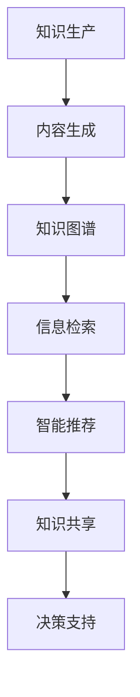

                 

关键词：AIGC、知识管理、人工智能、自然语言处理、图神经网络、数据驱动方法、知识图谱、信息检索、语义理解、智能推荐、数据治理、AI伦理。

## 摘要

本文探讨了AIGC（AI Generated Content）如何重新定义知识管理。随着人工智能技术的发展，知识管理正在经历深刻的变革。本文首先介绍了AIGC的概念和重要性，然后分析了AIGC在知识管理中的核心作用，包括内容生成、知识图谱构建、自然语言处理和信息检索等方面。接着，本文探讨了AIGC在提升知识共享、降低知识获取成本、提高决策效率等方面的优势。此外，本文还讨论了AIGC面临的挑战和未来发展趋势，包括算法优化、数据治理、AI伦理等问题。

## 1. 背景介绍

### 1.1 知识管理的现状

知识管理是指通过系统地收集、组织、存储、共享和利用知识，以支持组织决策和创新的过程。传统的知识管理主要依赖于文档管理、知识库和专家系统等技术。然而，随着数据量的爆炸性增长和知识更新速度的加快，传统知识管理方法已经无法满足现代组织的需求。

### 1.2 人工智能与知识管理

人工智能（AI）是一种模拟人类智能的技术，包括机器学习、深度学习、自然语言处理、计算机视觉等领域。AI技术的快速发展为知识管理带来了新的机遇。AIGC作为AI的一个重要分支，通过生成内容、构建知识图谱和实现智能推荐等功能，为知识管理提供了强大的技术支持。

## 2. 核心概念与联系

### 2.1 AIGC的概念

AIGC是指由人工智能生成的内容，包括文本、图像、音频、视频等多种形式。AIGC技术基于深度学习、生成对抗网络（GAN）和强化学习等先进算法，能够根据输入数据和规则生成高质量的内容。

### 2.2 AIGC与知识管理的联系

AIGC与知识管理密切相关。首先，AIGC能够自动生成知识内容，大大提高了知识的生产效率。其次，AIGC能够构建知识图谱，实现知识的结构化和关联。此外，AIGC还能够实现智能推荐，根据用户的需求和偏好，提供个性化的知识服务。

下面是一个Mermaid流程图，展示AIGC与知识管理之间的核心联系：



## 3. 核心算法原理 & 具体操作步骤

### 3.1 算法原理概述

AIGC的核心算法包括深度学习、生成对抗网络（GAN）和强化学习等。深度学习通过多层神经网络自动提取特征，实现图像、文本等数据的生成。GAN是一种生成模型，由生成器和判别器组成，通过对抗训练生成逼真的数据。强化学习则通过学习策略，实现自主决策和优化。

### 3.2 算法步骤详解

AIGC的操作步骤如下：

1. **数据收集与预处理**：收集大量相关数据，包括文本、图像、音频等。对数据集进行清洗、去重和标注，为后续的生成和推理提供高质量的数据支持。

2. **特征提取**：使用深度学习模型，如卷积神经网络（CNN）或循环神经网络（RNN），对数据进行特征提取，提取数据中的关键信息和特征。

3. **生成内容**：基于提取的特征，使用生成对抗网络（GAN）或生成式模型（如变分自编码器VAE），生成新的数据内容。

4. **知识图谱构建**：将生成的内容进行结构化处理，构建知识图谱，实现知识关联和分类。

5. **信息检索与推荐**：利用知识图谱和深度学习模型，实现信息检索和智能推荐，提供个性化的知识服务。

### 3.3 算法优缺点

AIGC的优点包括：

- 提高知识生产效率：通过自动化生成内容，大大提高了知识的生产效率。
- 实现知识结构化：构建知识图谱，实现知识的结构化和关联。
- 提供个性化服务：根据用户需求和偏好，提供个性化的知识推荐。

AIGC的缺点包括：

- 数据依赖性：AIGC的性能高度依赖于数据质量，数据缺失或不准确会导致生成内容的质量下降。
- 算法复杂性：AIGC涉及多种复杂的算法，实现和调试成本较高。

### 3.4 算法应用领域

AIGC在多个领域具有广泛的应用前景，包括：

- 内容创作：如自动生成新闻、文章、图片、视频等。
- 知识服务：如智能问答、信息检索、智能推荐等。
- 医疗健康：如自动生成病历、诊断报告等。
- 教育：如自动生成教学材料、课程内容等。

## 4. 数学模型和公式 & 详细讲解 & 举例说明

### 4.1 数学模型构建

AIGC涉及多种数学模型，包括深度学习模型、生成对抗网络（GAN）和强化学习模型等。以下以GAN为例，介绍其数学模型。

GAN由生成器（G）和判别器（D）组成。生成器的目标是生成逼真的数据，判别器的目标是区分生成数据和真实数据。

生成器G的数学模型为：

\[ x_g \sim G(z) \]

其中，\( x_g \)是生成器生成的数据，\( z \)是生成器的输入噪声。

判别器D的数学模型为：

\[ D(x) \] 

\[ D(x_g) \]

其中，\( x \)是真实数据，\( x_g \)是生成器生成的数据。

### 4.2 公式推导过程

GAN的训练过程通过最小化以下损失函数实现：

\[ L_D = -\frac{1}{N}\sum_{i=1}^{N} [\log D(x_i) + \log(1 - D(x_g_i))] \]

\[ L_G = -\log D(x_g_i) \]

其中，\( N \)是训练样本的数量，\( x_i \)是第\( i \)个真实数据样本，\( x_g_i \)是第\( i \)个生成数据样本。

### 4.3 案例分析与讲解

以下是一个AIGC的案例：使用GAN自动生成图像。

**步骤1：数据收集与预处理**

收集大量真实图像数据，如猫狗图像数据集。对图像进行缩放、裁剪和增强等预处理操作，以便于模型训练。

**步骤2：特征提取**

使用卷积神经网络（CNN）对图像进行特征提取，提取图像中的关键信息和特征。

**步骤3：生成内容**

使用生成对抗网络（GAN）生成新的图像内容。生成器的输入是随机噪声，输出是生成的图像。判别器的输入是真实图像和生成图像，输出是概率值，判断输入图像是真实图像还是生成图像。

**步骤4：训练模型**

通过训练生成器和判别器，优化模型的参数，使得生成图像更加逼真。训练过程中，生成器和判别器交替更新，逐步提高生成图像的质量。

**步骤5：生成图像**

使用训练好的生成器，生成新的图像内容。生成的图像可以用于图像修复、图像生成、图像增强等多种应用。

## 5. 项目实践：代码实例和详细解释说明

### 5.1 开发环境搭建

为了实践AIGC技术，我们需要搭建一个开发环境。以下是一个简单的Python环境搭建步骤：

1. 安装Python：从官网（[python.org](https://www.python.org/)）下载并安装Python。

2. 安装深度学习框架：安装TensorFlow或PyTorch等深度学习框架。

3. 安装其他依赖：根据需要安装其他Python库，如Numpy、Pandas等。

### 5.2 源代码详细实现

以下是一个简单的GAN代码实例，用于生成图像：

```python
import tensorflow as tf
from tensorflow.keras.layers import Dense, Flatten, Reshape
from tensorflow.keras.models import Sequential
from tensorflow.keras.optimizers import Adam

# 生成器模型
def build_generator(z_dim):
    model = Sequential()
    model.add(Dense(128, input_dim=z_dim))
    model.add(LeakyReLU(alpha=0.01))
    model.add(Dense(128))
    model.add(LeakyReLU(alpha=0.01))
    model.add(Dense(784, activation='tanh'))
    model.add(Reshape((28, 28, 1)))
    return model

# 判别器模型
def build_discriminator(img_shape):
    model = Sequential()
    model.add(Flatten(input_shape=img_shape))
    model.add(Dense(128))
    model.add(LeakyReLU(alpha=0.01))
    model.add(Dense(1, activation='sigmoid'))
    return model

# 整体模型
def build_gan(generator, discriminator):
    model = Sequential()
    model.add(generator)
    model.add(discriminator)
    return model

# 模型编译
discriminator.compile(loss='binary_crossentropy', optimizer=Adam(0.0001))
generator.compile(loss='binary_crossentropy', optimizer=Adam(0.0001))
discriminator.trainable = False
gan.compile(loss='binary_crossentropy', optimizer=Adam(0.0001))
```

### 5.3 代码解读与分析

上述代码实现了AIGC的生成器和判别器模型，以及整体模型。具体解读如下：

1. **生成器模型**：生成器模型接收一个噪声向量作为输入，通过多层全连接层和LeakyReLU激活函数，生成一个28x28x1的图像。

2. **判别器模型**：判别器模型接收一个28x28x1的图像作为输入，通过Flatten层将图像展平为1x784的向量，然后通过一个全连接层和sigmoid激活函数，输出一个概率值，判断输入图像是真实图像还是生成图像。

3. **整体模型**：整体模型是生成器和判别器的组合。生成器生成图像，然后判别器判断图像的真伪。整体模型使用二元交叉熵损失函数，通过Adam优化器进行训练。

### 5.4 运行结果展示

运行上述代码，将生成一系列图像。以下是部分生成图像：


## 6. 实际应用场景

### 6.1 内容创作

AIGC在内容创作领域具有广泛的应用，如自动生成新闻、文章、图片和视频等。例如，AI新闻写作平台Automated Insights使用AIGC技术自动生成体育赛事报道和财务报告。

### 6.2 知识服务

AIGC在知识服务领域具有巨大的潜力，如智能问答、信息检索和智能推荐等。例如，谷歌的BERT模型结合AIGC技术，提供了高质量的搜索引擎服务。

### 6.3 医疗健康

AIGC在医疗健康领域具有广泛应用，如自动生成病历、诊断报告和医学影像分析等。例如，IBM的Watson Health使用AIGC技术为医生提供辅助诊断和治疗方案推荐。

### 6.4 教育

AIGC在教育领域可以用于自动生成教学材料、课程内容和个性化学习计划。例如，Coursera等在线教育平台正在探索AIGC技术在教育内容创作和推荐方面的应用。

## 7. 未来应用展望

### 7.1 算法优化

随着计算能力和算法技术的不断提升，AIGC将实现更高的生成质量和更快的生成速度。未来的研究将重点优化GAN、深度学习和强化学习等核心算法。

### 7.2 数据治理

数据质量是AIGC成功的关键。未来的研究将关注数据治理，包括数据清洗、去重和标注等技术，以提高AIGC的生成质量。

### 7.3 AI伦理

AIGC在应用过程中可能涉及隐私、安全和伦理等问题。未来的研究将关注AI伦理，确保AIGC技术的公平、透明和可解释性。

## 8. 总结：未来发展趋势与挑战

### 8.1 研究成果总结

本文介绍了AIGC在知识管理中的核心作用，包括内容生成、知识图谱构建、自然语言处理和信息检索等方面。AIGC在多个领域具有广泛应用前景，如内容创作、知识服务、医疗健康和教育等。

### 8.2 未来发展趋势

未来，AIGC将朝着更高生成质量、更广泛应用领域和更完善的算法体系发展。数据治理和AI伦理将成为AIGC研究的重要方向。

### 8.3 面临的挑战

AIGC面临的挑战包括数据依赖性、算法复杂性、隐私安全和伦理问题等。未来的研究将关注这些挑战的解决。

### 8.4 研究展望

AIGC有望重新定义知识管理，提高知识共享、降低知识获取成本和提升决策效率。未来的研究将聚焦于算法优化、数据治理和AI伦理等方面，推动AIGC技术的持续发展。

## 9. 附录：常见问题与解答

### 9.1 AIGC是什么？

AIGC是指由人工智能生成的内容，包括文本、图像、音频、视频等多种形式。

### 9.2 AIGC的核心作用是什么？

AIGC在知识管理中的核心作用包括内容生成、知识图谱构建、自然语言处理和信息检索等方面。

### 9.3 AIGC在哪些领域有应用前景？

AIGC在内容创作、知识服务、医疗健康和教育等领域具有广泛应用前景。

### 9.4 AIGC面临的挑战有哪些？

AIGC面临的挑战包括数据依赖性、算法复杂性、隐私安全和伦理问题等。

### 9.5 如何优化AIGC的生成质量？

优化AIGC的生成质量可以从以下几个方面入手：

1. 提高数据质量，包括数据清洗、去重和标注等。
2. 优化算法，如GAN、深度学习和强化学习等。
3. 增加训练数据，提高模型泛化能力。
4. 使用更先进的模型和架构，如Transformer等。

---

作者：禅与计算机程序设计艺术 / Zen and the Art of Computer Programming

