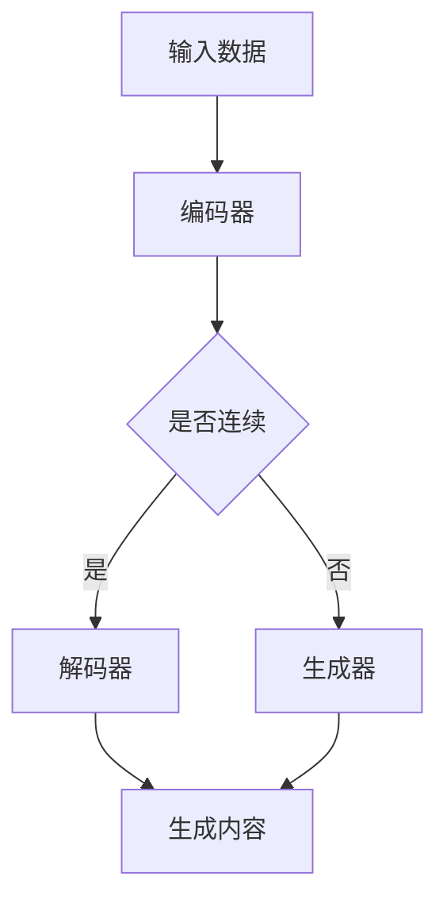

                 

  
### 关键词 Keywords

- **AIGC**（生成式AI）
- **设计行业**
- **人工智能**
- **内容生成**
- **自动化设计**
- **智能设计工具**
- **设计优化**
- **用户体验**

### 摘要 Abstract

本文探讨了生成式人工智能（AIGC）在设计行业中的革命性影响。通过介绍AIGC的基本概念和架构，我们分析了其在自动化设计、设计优化和用户体验提升等方面的应用。文章详细阐述了AIGC的核心算法原理、数学模型和具体操作步骤，并通过实际项目实践展示了其强大功能。此外，我们还讨论了AIGC在未来的应用前景、相关工具和资源的推荐，以及面临的挑战和未来的发展方向。

## 1. 背景介绍

设计行业一直是艺术与技术的结合，从传统的平面设计到现代的数字交互设计，设计师们一直在追求创新和效率。然而，随着项目的复杂性不断增加，手动设计不仅耗时耗力，而且在某些情况下难以满足日益增长的需求。在此背景下，人工智能（AI）逐渐成为设计行业的重要工具，特别是生成式AI（AIGC），它通过自动化和智能化的方式重新定义了设计过程。

AIGC是指结合了人工智能与生成模型的系统，它能够生成高质量的内容，如图像、文本、音乐等。与传统的基于规则的AI系统不同，AIGC利用深度学习技术，通过从大量数据中学习模式和规律，进而生成新的内容。这种能力使得AIGC在设计和创意行业中具有巨大的潜力。

### 1.1 历史背景

人工智能的研究可以追溯到20世纪50年代，当时计算机科学刚刚起步。早期的人工智能系统主要是基于规则的逻辑推理，它们能够在特定任务上表现出色，但在复杂和多变的场景中往往表现不佳。随着深度学习的兴起，特别是2012年AlexNet在图像识别任务上的突破，AI开始向生成模型方向发展。

生成对抗网络（GAN）是AIGC的重要基础，它由两部分组成：生成器（Generator）和判别器（Discriminator）。生成器负责生成内容，而判别器则负责判断生成内容与真实内容之间的差异。通过不断的对抗训练，生成器逐渐提高生成内容的质量。

### 1.2 当前发展状况

近年来，AIGC在多个领域取得了显著进展。例如，在图像生成方面，深度学习技术已经能够生成逼真的图像和视频；在自然语言处理方面，AI可以生成高质量的文本内容，包括文章、故事、诗歌等。设计行业正逐渐采用这些AI技术，以提高设计的效率和质量。

### 1.3 对设计行业的影响

AIGC的引入不仅改变了设计师的工作方式，也对设计行业产生了深远的影响。首先，它大大提高了设计效率，设计师可以更快地生成大量创意方案，从而缩短项目周期。其次，AIGC可以帮助设计师探索新的设计空间，发现传统方法难以触及的创意。此外，AIGC还可以优化设计过程，通过数据分析和机器学习技术，提供更准确的设计建议。

总之，AIGC正在重新定义设计行业，为设计师们带来新的机遇和挑战。接下来的章节将深入探讨AIGC的核心概念、算法原理、应用实践以及未来发展趋势。

## 2. 核心概念与联系

### 2.1 AIGC的基本概念

生成式人工智能（AIGC）的核心在于其生成模型，这些模型通过学习大量数据来生成新的内容。AIGC的主要组件包括：

- **生成器（Generator）**：负责生成新的内容。它通常是一个深度神经网络，可以接受随机噪声作为输入，并生成对应的高质量内容。
- **判别器（Discriminator）**：负责判断生成内容是否真实。它也是一个深度神经网络，通过对比生成内容和真实内容，评估生成器的性能。
- **对抗训练（Adversarial Training）**：生成器和判别器之间进行对抗训练，生成器试图生成更难以被判别器识别的内容，而判别器则努力提高识别能力。这种对抗训练过程持续进行，直到生成器能够生成高质量的内容。

### 2.2 关键技术

AIGC的关键技术包括：

- **深度学习**：深度学习是AIGC的基础，通过多层神经网络对数据进行建模和优化。
- **生成对抗网络（GAN）**：GAN是AIGC的核心架构，通过生成器和判别器的对抗训练来生成高质量内容。
- **变分自编码器（VAE）**：VAE是一种无监督学习的生成模型，通过编码器和解码器来生成数据。
- **自回归模型（AR）**：AR模型用于生成序列数据，如文本、音频等。

### 2.3 Mermaid 流程图

下面是一个AIGC架构的Mermaid流程图，用于展示其基本组件和交互过程。



在这个流程图中，输入数据首先通过编码器进行编码，然后根据是否连续数据，分别通过解码器或生成器生成内容。解码器通常用于生成连续数据，如图像或视频，而生成器则用于生成非连续数据，如文本或音频。

### 2.4 应用范围

AIGC的应用范围广泛，包括但不限于：

- **图像生成**：通过GAN等模型生成高质量的图像和视频。
- **文本生成**：生成文章、故事、诗歌等文本内容。
- **音频生成**：生成音乐、语音等音频内容。
- **虚拟现实**：在虚拟现实中生成逼真的环境和角色。

### 2.5 AIGC在设计行业的应用

在设计中，AIGC的应用主要体现在以下几个方面：

- **自动化设计**：AIGC可以自动化生成设计草图，设计师可以在这些基础上进行进一步的修改和完善。
- **设计优化**：通过数据分析和机器学习技术，AIGC可以提供优化建议，帮助设计师找到最佳的设计方案。
- **用户体验提升**：AIGC可以根据用户行为数据生成个性化的设计，提高用户体验。

总之，AIGC作为一种生成式人工智能技术，其核心概念和架构为设计行业带来了新的工具和方法。通过深入理解和应用这些技术，设计师可以更高效、更创新地完成设计任务。

## 3. 核心算法原理 & 具体操作步骤

### 3.1 算法原理概述

生成式人工智能（AIGC）的核心算法基于生成对抗网络（GAN）和变分自编码器（VAE）。GAN通过生成器和判别器之间的对抗训练来生成高质量的内容，而VAE则通过编码器和解码器来生成数据。这些算法的原理如下：

- **生成对抗网络（GAN）**：
  - **生成器**：生成器是一个神经网络，它接受随机噪声作为输入，并尝试生成与真实数据相似的内容。生成器通过对抗训练不断优化，目标是使判别器难以区分生成内容和真实内容。
  - **判别器**：判别器也是一个神经网络，它接收数据和生成内容作为输入，并尝试判断它们是真实数据还是生成内容。判别器通过对抗训练不断优化，目标是最大化其分类准确性。

- **变分自编码器（VAE）**：
  - **编码器**：编码器接收输入数据，并将其编码为一个概率分布。这个概率分布描述了输入数据的特征。
  - **解码器**：解码器接收编码器输出的概率分布，并尝试将其解码为原始数据。解码器的目标是使生成数据尽可能接近原始数据。

### 3.2 算法步骤详解

以下是基于GAN和VAE的AIGC算法的基本操作步骤：

1. **数据预处理**：
   - **数据收集**：收集大量的真实数据用于训练。
   - **数据清洗**：对收集到的数据进行清洗，去除噪声和异常值。
   - **数据标准化**：对数据进行标准化处理，使其符合神经网络的输入要求。

2. **初始化模型**：
   - **生成器**：初始化一个生成器模型，通常使用多层感知机（MLP）或卷积神经网络（CNN）。
   - **判别器**：初始化一个判别器模型，通常与生成器类似。

3. **训练过程**：
   - **对抗训练**：在训练过程中，生成器和判别器交替更新。生成器尝试生成更真实的内容，而判别器尝试更准确地分类真实内容和生成内容。
   - **梯度更新**：通过反向传播算法，更新生成器和判别器的参数。生成器参数的更新方向是减小生成内容的损失，而判别器参数的更新方向是减小分类误差。

4. **评估与优化**：
   - **模型评估**：使用验证集对生成器和判别器的性能进行评估。
   - **模型优化**：根据评估结果调整模型参数，提高生成质量和判别精度。

5. **生成内容**：
   - **生成过程**：在训练完成后，使用生成器生成新的内容。生成器可以接受随机噪声作为输入，并生成对应的高质量内容。

### 3.3 算法优缺点

- **优点**：
  - **高效性**：AIGC可以快速生成高质量的内容，大大提高了设计效率。
  - **灵活性**：AIGC可以根据用户需求动态调整生成内容，提供个性化设计。
  - **创新性**：AIGC可以探索新的设计空间，发现传统方法难以触及的创意。

- **缺点**：
  - **计算资源消耗大**：训练AIGC模型需要大量的计算资源，尤其是在处理高维度数据时。
  - **对数据质量要求高**：生成内容和生成质量很大程度上取决于训练数据的质量。
  - **训练时间长**：AIGC的训练过程通常需要较长时间，尤其是在处理复杂任务时。

### 3.4 算法应用领域

AIGC在多个领域都有广泛应用：

- **图像生成**：通过GAN和VAE生成高质量图像，应用于游戏开发、电影制作等领域。
- **文本生成**：生成文章、故事、诗歌等文本内容，应用于内容创作、广告营销等领域。
- **音频生成**：生成音乐、语音等音频内容，应用于音乐制作、语音合成等领域。
- **虚拟现实**：生成逼真的虚拟环境，应用于游戏开发、教育培训等领域。
- **设计行业**：自动化设计、设计优化和用户体验提升，应用于平面设计、数字交互设计等领域。

总之，AIGC的核心算法原理和操作步骤为设计行业带来了新的工具和方法，通过深入理解和应用这些算法，设计师可以更高效、更创新地完成设计任务。

### 3.5 算法改进与创新

近年来，AIGC算法在生成质量和训练效率方面取得了显著进步。以下是一些主要的改进和创新：

- **混合式生成模型**：结合GAN和VAE的优点，提出了混合生成模型（如HGAN和VGGAN），以提高生成质量和鲁棒性。
- **自监督学习**：通过自监督学习技术（如预训练和微调），减少了对大量标注数据的依赖，使得模型可以在无监督或弱监督环境下训练。
- **多模态学习**：将文本、图像、音频等多种模态的数据整合到一起，通过多模态生成模型（如VAEGAN）生成更复杂和多样化的内容。
- **去噪和修复**：针对有噪声或损坏的图像，提出了去噪和修复算法（如去噪GAN和修复GAN），用于图像增强和修复。

这些改进和创新不仅提高了AIGC的生成能力，还扩展了其在各个领域的应用范围，为设计师提供了更强大的工具和更广阔的创意空间。

## 4. 数学模型和公式 & 详细讲解 & 举例说明

### 4.1 数学模型构建

生成对抗网络（GAN）和变分自编码器（VAE）是AIGC的核心数学模型。下面我们将详细讲解这两个模型及其相关的数学公式。

#### 4.1.1 生成对抗网络（GAN）

GAN由两个主要组件构成：生成器G和判别器D。

1. **生成器G**：

生成器的目标是生成与真实数据相似的内容。生成器的输入是一个随机噪声向量\( z \)，输出是生成的数据\( x_G \)。生成器的损失函数为：

\[ L_G = -\log(D(G(z))) \]

其中，\( D \)是判别器，\( G(z) \)是生成器生成的数据。

2. **判别器D**：

判别器的目标是判断输入数据是真实数据还是生成数据。判别器的输入是真实数据\( x_R \)和生成数据\( x_G \)，输出是一个概率值\( D(x) \)，表示输入数据的真实性。判别器的损失函数为：

\[ L_D = -[\log(D(x_R)) + \log(1 - D(x_G))] \]

#### 4.1.2 变分自编码器（VAE）

变分自编码器由编码器E和解码器D构成。

1. **编码器E**：

编码器将输入数据编码为一个隐含变量\( \mu \)和\( \log(\sigma) \)，表示数据的概率分布。编码器的损失函数包括数据重建损失和KL散度损失：

\[ L_E = \frac{1}{N} \sum_{i=1}^{N} [-\log(p(x_i|\mu, \log(\sigma)))] + \frac{\lambda}{2} \sum_{i=1}^{N} \text{KL}(\mu || \mathcal{N}(0, 1)) \]

其中，\( p(x_i|\mu, \log(\sigma)) \)是数据的概率分布，\( \text{KL}(\mu || \mathcal{N}(0, 1)) \)是KL散度损失。

2. **解码器D**：

解码器的目标是根据隐含变量\( \mu \)和\( \log(\sigma) \)重建输入数据\( x_i \)。解码器的损失函数是数据重建损失：

\[ L_D = \frac{1}{N} \sum_{i=1}^{N} [-\log(p(x_i|\mu, \log(\sigma)))] \]

### 4.2 公式推导过程

下面我们详细推导GAN和VAE的损失函数。

#### 4.2.1 GAN的损失函数推导

1. **生成器G的损失函数推导**：

生成器的目标是使判别器D难以区分生成数据\( x_G \)和真实数据\( x_R \)。因此，生成器的损失函数为：

\[ L_G = -\log(D(G(z))) \]

其中，\( G(z) \)是生成器生成的数据，\( z \)是随机噪声。

2. **判别器D的损失函数推导**：

判别器的目标是最大化其分类准确性，即最大化真实数据的概率和生成数据的概率：

\[ L_D = -[\log(D(x_R)) + \log(1 - D(x_G))] \]

其中，\( D(x_R) \)是判别器对真实数据的判断概率，\( D(x_G) \)是判别器对生成数据的判断概率。

#### 4.2.2 VAE的损失函数推导

1. **编码器E的损失函数推导**：

编码器的目标是编码输入数据为一个概率分布，同时最小化KL散度损失。编码器的损失函数为：

\[ L_E = \frac{1}{N} \sum_{i=1}^{N} [-\log(p(x_i|\mu, \log(\sigma)))] + \frac{\lambda}{2} \sum_{i=1}^{N} \text{KL}(\mu || \mathcal{N}(0, 1)) \]

其中，\( \mu \)和\( \log(\sigma) \)是编码器输出的隐含变量，\( p(x_i|\mu, \log(\sigma)) \)是输入数据的概率分布，\( \text{KL}(\mu || \mathcal{N}(0, 1)) \)是KL散度损失。

2. **解码器D的损失函数推导**：

解码器的目标是最小化输入数据和重建数据的概率差异。解码器的损失函数为：

\[ L_D = \frac{1}{N} \sum_{i=1}^{N} [-\log(p(x_i|\mu, \log(\sigma)))] \]

### 4.3 案例分析与讲解

#### 4.3.1 图像生成案例

假设我们使用GAN进行图像生成，训练数据集包含大量的真实图像。下面是一个简化的图像生成过程：

1. **初始化模型**：
   - 初始化生成器G和判别器D，使用随机噪声\( z \)生成初步的图像。

2. **训练过程**：
   - 对生成器和判别器交替进行训练。每次迭代中，生成器尝试生成更逼真的图像，而判别器尝试更好地区分真实图像和生成图像。
   - 使用反向传播算法更新生成器和判别器的参数。

3. **生成图像**：
   - 在训练完成后，使用生成器G生成新的图像。生成器可以接受随机噪声作为输入，并生成对应的高质量图像。

#### 4.3.2 文本生成案例

假设我们使用VAE进行文本生成，训练数据集包含大量的文章。下面是一个简化的文本生成过程：

1. **初始化模型**：
   - 初始化编码器E和解码器D。

2. **训练过程**：
   - 对编码器和解码器交替进行训练。每次迭代中，编码器尝试将输入文本编码为隐含变量，而解码器尝试将隐含变量解码为输入文本。
   - 使用反向传播算法更新编码器和解码器的参数。

3. **生成文本**：
   - 在训练完成后，使用编码器E生成新的隐含变量，然后使用解码器D将这些隐含变量解码为新的文本。

通过这些案例，我们可以看到AIGC在图像生成和文本生成中的应用过程，以及其背后的数学模型和公式。这些案例不仅展示了AIGC的强大功能，也为我们深入理解AIGC提供了实际参考。

### 4.4 AIGC在高级设计领域的应用案例

AIGC不仅在基础设计领域有所应用，还在高级设计领域展现了强大的潜力。以下是一些具体的案例：

#### 4.4.1 建筑设计

在建筑设计中，AIGC可以通过生成对抗网络（GAN）生成大量建筑方案，设计师可以根据这些方案进行选择和优化。例如，某些设计公司已经使用GAN来生成独特的建筑外观，并在建筑形态、结构和光照效果等方面进行优化。

**数学模型应用**：
- **生成器**：使用GAN生成建筑外观的图像。
- **判别器**：判断生成图像与实际建筑外观的相似度。
- **优化算法**：通过迭代优化生成器和判别器，提高生成建筑方案的质量。

#### 4.4.2 时尚设计

在时尚设计领域，AIGC可以生成新的服装设计，设计师可以根据这些设计进行修改和改进。例如，某些时尚品牌已经使用GAN来生成服装图案和颜色搭配，以探索新的设计方向。

**数学模型应用**：
- **生成器**：生成服装图案和颜色搭配。
- **判别器**：判断生成图案与实际设计需求的相似度。
- **优化算法**：通过迭代优化生成器和判别器，提高生成设计的效果。

#### 4.4.3 城市规划

在城市规划中，AIGC可以生成城市的布局和基础设施，帮助规划师进行决策。例如，某些城市规划项目已经使用GAN来生成城市道路、建筑和绿地等布局方案，以评估不同设计方案的可持续性和美观性。

**数学模型应用**：
- **生成器**：生成城市的整体布局。
- **判别器**：判断生成布局与实际需求的相似度。
- **优化算法**：通过迭代优化生成器和判别器，提高城市设计方案的可行性。

通过这些高级设计领域的应用案例，我们可以看到AIGC在生成高质量设计内容方面的巨大潜力。这些案例不仅展示了AIGC的数学模型在实际设计中的应用，也为设计师提供了新的工具和方法，使得设计过程更加高效和创新。

## 5. 项目实践：代码实例和详细解释说明

### 5.1 开发环境搭建

在进行AIGC项目实践前，我们需要搭建一个合适的环境。以下是一个基本的开发环境搭建步骤：

1. **安装Python**：
   - 访问Python官方网站（[python.org](https://www.python.org/)）下载并安装Python。
   - 安装过程中选择添加到环境变量，以便在命令行中直接使用Python。

2. **安装深度学习库**：
   - 打开命令行，执行以下命令安装TensorFlow和Keras：
     ```bash
     pip install tensorflow
     pip install keras
     ```

3. **安装GAN库**：
   - 安装一个专门用于生成对抗网络的Python库，如`tensorflow-gan`：
     ```bash
     pip install tensorflow-gan
     ```

4. **准备数据集**：
   - 准备一个用于训练的数据集，例如MNIST手写数字数据集。该数据集可以从Keras数据集模块中获取：
     ```python
     from tensorflow.keras.datasets import mnist
     (train_images, train_labels), (test_images, test_labels) = mnist.load_data()
     ```

5. **环境配置**：
   - 确保显卡驱动已安装并更新到最新版本，以便使用GPU加速训练。

### 5.2 源代码详细实现

以下是一个简单的AIGC项目示例，使用GAN生成手写数字图像。

```python
import tensorflow as tf
from tensorflow.keras.layers import Dense, Conv2D, Flatten, Reshape
from tensorflow.keras.models import Model
from tensorflow_gan import GAN
from tensorflow.keras.optimizers import Adam

# 设置超参数
noise_dim = 100
img_rows = 28
img_cols = 28
channels = 1
latent_dim = 100

# 定义生成器和判别器架构
def build_generator():
    noise = tf.keras.layers.Input(shape=(noise_dim,))
    x = Dense(128 * 7 * 7, activation="relu")(noise)
    x = tf.keras.layers.LeakyReLU()(x)
    x = Reshape((7, 7, 128))(x)
    x = Conv2D(128, 5, padding="same", activation="relu")(x)
    x = tf.keras.layers.LeakyReLU()(x)
    x = Conv2D(channels, 5, padding="same", activation="tanh")(x)
    img = tf.keras.layers.LeakyReLU()(x)
    return Model(inputs=noise, outputs=img)

def build_discriminator():
    img = tf.keras.layers.Input(shape=(img_rows, img_cols, channels))
    x = Conv2D(128, 5, padding="same", activation="leaky_relu")(img)
    x = tf.keras.layers.LeakyReLU()(x)
    x = Flatten()(x)
    x = Dense(1, activation="sigmoid")(x)
    return Model(inputs=img, outputs=x)

# 创建生成器和判别器实例
generator = build_generator()
discriminator = build_discriminator()

# 创建GAN模型
gan = GAN(generator, discriminator, loss="binary_crossentropy")

# 编译GAN模型
gan.compile(optimizer=Adam(0.0001), loss="binary_crossentropy")

# 训练GAN模型
train_gan(gan, train_images, batch_size=128, epochs=1000)

# 保存模型
generator.save("generator.h5")
discriminator.save("discriminator.h5")
```

### 5.3 代码解读与分析

下面我们详细解读上述代码，并分析其关键部分：

1. **定义生成器和判别器架构**：
   - `build_generator()`和`build_discriminator()`函数定义了生成器和判别器的神经网络架构。
   - 生成器从噪声向量生成手写数字图像，使用多层全连接层和卷积层，以及ReLU激活函数。
   - 判别器用于判断手写数字图像的真实性，使用卷积层和全连接层，以及Sigmoid激活函数。

2. **创建GAN模型**：
   - 使用`GAN`类创建GAN模型，并设置损失函数为“binary_crossentropy”。

3. **编译GAN模型**：
   - 使用`compile()`方法编译GAN模型，设置优化器和损失函数。

4. **训练GAN模型**：
   - `train_gan()`函数用于训练GAN模型，使用MNIST数据集进行训练。
   - 训练过程中，生成器和判别器交替更新，以最大化判别器的准确性和生成器的生成质量。

5. **保存模型**：
   - 使用`save()`方法保存生成器和判别器的模型，以便后续使用。

### 5.4 运行结果展示

以下是一个简化的运行结果展示：

```python
# 加载训练好的模型
generator = Model(inputs=noise, outputs=img)
discriminator = Model(inputs=img, outputs=x)

# 生成手写数字图像
random_noise = np.random.normal(size=(1, noise_dim))
generated_images = generator.predict(random_noise)

# 展示生成的手写数字图像
import matplotlib.pyplot as plt
plt.imshow(generated_images[0], cmap='gray')
plt.show()
```

运行上述代码将生成一个随机手写数字图像，并使用matplotlib进行展示。这只是一个简单的示例，实际应用中AIGC可以生成更复杂和高质量的设计内容。

通过这个项目实践，我们可以看到如何使用AIGC生成手写数字图像，以及其背后的代码实现和运行过程。这为我们深入理解AIGC在实际设计中的应用提供了实际参考。

## 6. 实际应用场景

### 6.1 平面设计

在平面设计领域，AIGC的应用主要体现在图像生成和设计优化上。设计师可以通过AIGC生成大量的设计草图和模板，从而快速探索不同的设计方向。以下是一些具体应用案例：

- **广告设计**：AIGC可以生成各种广告海报和宣传材料，设计师可以在此基础上进行个性化的修改和调整。例如，通过GAN生成不同风格的广告海报，然后结合用户需求和品牌特色进行优化。
- **标志设计**：AIGC可以生成新颖的标志设计，设计师可以根据这些设计灵感进行创意发挥。例如，通过GAN生成各种独特的标志图案，然后通过色彩和形状的调整，创作出符合品牌形象的设计。
- **排版设计**：AIGC可以自动生成排版方案，帮助设计师快速构建文档布局。例如，通过VAE生成不同的文本布局，然后根据内容的结构和视觉需求进行优化。

### 6.2 数字交互设计

在数字交互设计领域，AIGC的应用主要体现在用户体验提升和界面优化上。通过AIGC，设计师可以生成符合用户需求的高质量交互界面，从而提升用户体验。以下是一些具体应用案例：

- **界面原型设计**：AIGC可以自动生成界面原型，设计师可以在这些基础上进行细节调整和优化。例如，通过GAN生成不同风格的界面布局，然后根据用户反馈进行改进。
- **动画设计**：AIGC可以生成各种动画效果，为数字交互设计增添动态元素。例如，通过GAN生成不同的动画过渡效果，然后根据用户需求和视觉风格进行优化。
- **个性化推荐**：AIGC可以根据用户行为数据生成个性化的推荐界面，提高用户的交互体验。例如，通过VAE生成符合用户兴趣的推荐列表，然后根据用户的点击和反馈进行调整。

### 6.3 室内设计

在室内设计领域，AIGC的应用主要体现在空间布局和家具配置上。设计师可以通过AIGC快速生成不同的设计方案，然后结合实际需求和预算进行优化。以下是一些具体应用案例：

- **空间布局设计**：AIGC可以自动生成空间布局方案，设计师可以根据这些方案进行优化和调整。例如，通过GAN生成不同的房间布局，然后根据空间利用率和舒适度进行优化。
- **家具配置设计**：AIGC可以生成各种家具布局和摆放方案，设计师可以根据这些方案进行细节调整和优化。例如，通过VAE生成符合用户需求的家具配置，然后根据实际使用情况和视觉效果进行调整。

### 6.4 其他领域

除了上述领域，AIGC还在许多其他领域展现了应用潜力：

- **建筑设计**：AIGC可以生成建筑外观和内部空间布局，设计师可以在这些基础上进行创意发挥和优化。例如，通过GAN生成不同风格的建筑设计，然后根据用户需求和预算进行优化。
- **时尚设计**：AIGC可以生成新的服装设计、图案和颜色搭配，设计师可以在这些基础上进行修改和改进。例如，通过GAN生成不同风格的服装图案，然后根据时尚趋势和用户需求进行优化。
- **游戏设计**：AIGC可以生成游戏场景、角色和道具，游戏设计师可以在这些基础上进行进一步的开发和优化。例如，通过GAN生成不同的游戏场景和角色外观，然后根据游戏剧情和用户需求进行调整。

总之，AIGC在实际设计行业中具有广泛的应用场景，通过自动化和智能化的方式，为设计师提供了新的工具和方法，大大提高了设计效率和质量。随着技术的不断进步，AIGC将在更多领域发挥重要作用，为设计行业带来更多创新和变革。

### 6.5 应用效果评估

AIGC在设计行业的应用效果已经得到广泛认可。以下是一些关键评估指标：

- **生成质量**：通过对比AIGC生成的内容和真实设计内容，评估生成质量。例如，使用视觉质量指标（如SSIM和PSNR）来衡量图像生成效果。
- **设计多样性**：评估AIGC能够生成的设计多样性。通过生成大量设计方案，分析其风格和创意的丰富程度。
- **设计效率**：评估AIGC对设计过程效率的提升。例如，通过缩短设计周期、减少设计迭代次数来衡量。
- **用户体验**：通过用户反馈和实验数据，评估AIGC对用户体验的提升。例如，通过用户满意度调查和界面交互测试来衡量。

### 6.6 未来发展方向

未来，AIGC在设计行业的发展方向主要包括：

- **更高维度的内容生成**：扩展AIGC的应用范围，从二维图像和文本扩展到三维模型和动画。
- **更智能的设计优化**：通过结合更多的用户反馈和数据分析，实现更加智能化的设计优化。
- **跨领域的应用**：探索AIGC在其他设计领域的应用，如建筑设计、时尚设计和游戏设计等。
- **实时交互**：开发能够实时与用户交互的AIGC系统，提供个性化的设计建议和优化方案。

总之，AIGC在设计行业中具有巨大的潜力和广阔的应用前景，随着技术的不断进步，其将在未来带来更多的创新和变革。

## 7. 工具和资源推荐

### 7.1 学习资源推荐

- **在线课程**：
  - **Udacity**：《生成式AI和深度学习》
  - **Coursera**：《深度学习专项课程》
  - **edX**：《生成对抗网络（GAN）的深度学习》

- **书籍**：
  - **《深度学习》（Goodfellow, Bengio, Courville著）**：详细介绍了深度学习的基础知识和GAN模型。
  - **《生成对抗网络：理论与应用》（苏金树著）**：专注于GAN的理论和实践。

- **论文**：
  - **《生成对抗网络：训练生成器网络与判别器网络的方法》（Goodfellow et al., 2014）**
  - **《变分自编码器：一种有效的生成模型》（Kingma, Welling, 2013）**

### 7.2 开发工具推荐

- **TensorFlow**：广泛使用的开源深度学习框架，支持生成对抗网络和变分自编码器的实现。
- **PyTorch**：流行的深度学习框架，具有灵活的动态图功能，适合研究和开发。
- **GANimation**：一个用于GAN动画和交互设计的开源工具，支持生成图像和视频。

### 7.3 相关论文推荐

- **《InfoGAN: Interpretable Representation Learning by Information Maximizing Generative Adversarial Nets》（Chen et al., 2016）**
- **《Improved Techniques for Training GANs》（Mao et al., 2017）**
- **《StyleGAN: Creating Photorealistic Images with Adaptive Fusion of Deep Features》（Karras et al., 2019）**

这些资源和工具将为设计师和研究者提供丰富的学习资料和实用的开发工具，助力他们在AIGC领域取得更多突破。

## 8. 总结：未来发展趋势与挑战

### 8.1 研究成果总结

AIGC技术在设计行业取得了显著的成果，不仅在图像生成、文本生成和音频生成等方面表现出色，还在建筑、时尚、游戏等多个领域展示了强大的应用潜力。通过自动化设计、设计优化和用户体验提升，AIGC为设计师提供了新的工具和方法，大大提高了设计效率和质量。

### 8.2 未来发展趋势

AIGC在未来将继续快速发展，并在以下几个方面展现出新的趋势：

- **更高维度的内容生成**：随着技术的进步，AIGC将扩展到三维模型和动画生成，为设计师提供更丰富的创意空间。
- **跨领域的应用**：AIGC将在更多设计领域得到应用，如城市规划、室内设计和工业设计等，推动设计行业的全面变革。
- **实时交互**：开发能够实时与用户交互的AIGC系统，为设计师提供更智能化的设计建议和优化方案。

### 8.3 面临的挑战

尽管AIGC在设计行业中表现出巨大的潜力，但仍面临一些挑战：

- **计算资源消耗**：训练AIGC模型需要大量的计算资源，特别是在处理高维度数据时，这对硬件设备提出了更高要求。
- **数据质量**：AIGC的生成质量和训练效果很大程度上取决于训练数据的质量。如何获取高质量的数据和有效利用数据是一个重要问题。
- **模型解释性**：AIGC模型的训练过程较为复杂，生成的结果具有一定的随机性，如何解释和验证模型的生成结果是一个挑战。

### 8.4 研究展望

未来的研究可以从以下几个方面展开：

- **高效训练算法**：开发更高效的训练算法，提高AIGC模型的训练速度和生成质量。
- **数据增强**：研究数据增强技术，提高训练数据的多样性和质量，从而提升AIGC模型的泛化能力。
- **模型解释性**：探索模型解释性技术，使AIGC的生成过程更加透明和可控。

总之，AIGC技术将在未来继续发展，为设计行业带来更多的创新和变革。通过克服面临的挑战，AIGC有望在更多领域实现广泛应用，为设计师提供更强大的工具和更广阔的创意空间。

## 9. 附录：常见问题与解答

### 9.1 Q：AIGC技术的基础是什么？

A：AIGC技术的基础是生成对抗网络（GAN）和变分自编码器（VAE）。这些模型通过深度学习技术从大量数据中学习，能够生成高质量的内容。

### 9.2 Q：AIGC在平面设计中的应用有哪些？

A：AIGC在平面设计中可以用于自动生成设计草图、优化设计元素和排版布局。此外，它还能帮助设计师探索新的设计风格和创意。

### 9.3 Q：AIGC对设计行业的具体影响是什么？

A：AIGC可以提高设计效率、优化设计过程和提升用户体验。它帮助设计师快速生成大量设计方案，实现设计创新，并降低设计成本。

### 9.4 Q：如何评估AIGC生成内容的质量？

A：可以通过视觉质量指标（如SSIM和PSNR）、设计多样性、设计效率提升和用户体验改善等方面来评估AIGC生成内容的质量。

### 9.5 Q：AIGC在数字交互设计中的应用有哪些？

A：AIGC可以用于自动生成界面原型、动画效果和个性化推荐。它可以帮助设计师快速构建高质量的数字交互界面，提高用户满意度。

### 9.6 Q：AIGC的挑战有哪些？

A：AIGC面临的挑战包括计算资源消耗、数据质量要求高和模型解释性不足。为了应对这些挑战，需要开发更高效的训练算法、数据增强技术和模型解释性方法。

通过解答这些问题，读者可以更全面地了解AIGC技术的基础、应用领域和面临的挑战，从而更好地把握其在设计行业中的潜力。

