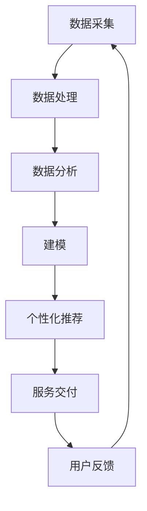

                 

在当今技术飞速发展的时代，人工智能（AI）已经成为改变商业游戏规则的关键力量。企业正日益依赖AI技术来优化运营、提高效率和创造新的商业模式。本文旨在探讨一种独特的AI解决方案——定制化服务的商业模式，并通过详细的讨论和分析，展示其在实际应用中的巨大潜力。

## 关键词

- 人工智能
- 定制化服务
- 商业模式
- 个性化体验
- 数据驱动
- 用户体验

## 摘要

本文将深入探讨AI如何通过定制化服务的商业模式为企业带来价值。我们将详细分析定制化服务的核心概念，介绍其与AI技术的紧密联系，并探讨这一模式在各个行业的实际应用。此外，我们还将探讨定制化服务的数学模型、实现步骤以及未来发展趋势，为企业提供完整的AI解决方案参考。

## 1. 背景介绍

随着互联网和大数据技术的普及，企业对用户数据的掌握越来越全面。这种数据优势使得个性化服务和定制化解决方案变得可行。然而，传统的商业模式往往难以满足用户日益增长的个性化需求。人工智能的出现为这一难题提供了一种全新的解决方案。

AI技术，特别是机器学习和深度学习，能够从海量数据中提取有价值的信息，并对用户行为进行精准分析。这种分析能力使得企业能够提供高度个性化的产品和服务，从而增强用户黏性和品牌忠诚度。

### 1.1 个性化服务的兴起

个性化服务是指根据用户的特定需求和偏好，提供定制化的产品或服务。这种服务模式最早在电商领域得到广泛应用，如推荐系统的使用，通过分析用户的购买历史和浏览记录，推荐符合用户兴趣的商品。个性化服务的兴起，改变了传统商业模式的一对多的服务模式，转向了一对一的服务模式。

### 1.2 数据驱动与AI技术

数据驱动是现代商业决策的核心，而AI技术则为数据驱动提供了强大的支持。通过AI，企业可以从复杂的数据集中提取有价值的信息，并利用这些信息进行预测分析和决策支持。这种数据驱动的商业模式，不仅提高了运营效率，还为企业创造了新的盈利点。

### 1.3 定制化服务的商业价值

定制化服务具有显著的商业价值，主要体现在以下几个方面：

1. **提高客户满意度**：通过提供个性化服务，企业能够更好地满足客户需求，提高客户满意度。
2. **增加客户忠诚度**：个性化服务让用户感受到被重视，从而增加品牌忠诚度。
3. **创造新的收入来源**：通过提供定制化服务，企业可以开辟新的商业模式，如按需服务、订阅服务等。

## 2. 核心概念与联系

为了深入理解定制化服务的商业模式，我们需要从核心概念和架构设计出发，探讨AI在其中扮演的角色。

### 2.1 核心概念

#### 用户画像

用户画像是指通过对用户数据的收集和分析，构建出一个反映用户特征、行为和需求的模型。用户画像为定制化服务提供了基础数据支持。

#### 个性化推荐

个性化推荐是AI技术在定制化服务中的重要应用，通过分析用户行为和历史数据，为用户推荐符合其兴趣的产品或服务。

#### 智能客服

智能客服利用自然语言处理和机器学习技术，实现与用户的智能交互，提供个性化的服务和支持。

### 2.2 架构设计

#### 数据采集与处理

数据采集与处理是定制化服务的第一步，企业需要收集用户数据，并通过数据清洗和处理，得到可用于分析的干净数据。

#### 数据分析与建模

通过数据分析与建模，企业可以提取用户特征，构建用户画像，并利用机器学习算法进行个性化推荐。

#### 服务交付与反馈

服务交付与反馈是定制化服务的最后一步，企业需要将个性化服务交付给用户，并通过用户反馈进行持续优化。

### 2.3 Mermaid 流程图



## 3. 核心算法原理 & 具体操作步骤

### 3.1 算法原理概述

定制化服务的核心算法主要包括用户画像构建、个性化推荐算法和智能客服算法。以下是这些算法的原理概述：

#### 用户画像构建

用户画像构建基于用户行为数据和人口统计信息，通过聚类分析和机器学习算法，将用户划分为不同的群体，为后续的个性化推荐提供基础。

#### 个性化推荐算法

个性化推荐算法主要基于协同过滤和基于内容的推荐算法。协同过滤通过分析用户之间的相似性，推荐用户可能感兴趣的商品或服务；基于内容的推荐则通过分析商品或服务的特征，推荐与用户历史偏好相似的内容。

#### 智能客服算法

智能客服算法主要基于自然语言处理和机器学习技术，实现与用户的智能对话，提供个性化的服务和支持。

### 3.2 算法步骤详解

#### 用户画像构建

1. 数据收集：收集用户行为数据、人口统计信息等。
2. 数据清洗：清洗和预处理数据，去除噪声和不完整的数据。
3. 特征提取：通过特征工程提取用户行为和人口统计信息中的重要特征。
4. 聚类分析：使用K-means等聚类算法，将用户划分为不同的群体。
5. 画像构建：为每个用户创建一个多维度的画像。

#### 个性化推荐算法

1. 数据预处理：对用户和商品数据进行预处理，包括缺失值填充、异常值处理等。
2. 相似度计算：计算用户和商品之间的相似度，常用的方法包括余弦相似度和皮尔逊相似度。
3. 推荐列表生成：根据用户和商品的相似度，生成个性化推荐列表。

#### 智能客服算法

1. 语言理解：通过自然语言处理技术，理解用户的问题和意图。
2. 答案生成：根据用户的问题和意图，生成相应的答案。
3. 对话管理：维护对话的状态，实现与用户的持续对话。

### 3.3 算法优缺点

#### 用户画像构建

**优点**：能够为个性化推荐和智能客服提供准确的基础数据，提高服务的精准度。

**缺点**：数据收集和处理过程中，存在隐私保护和数据质量的问题。

#### 个性化推荐算法

**优点**：能够为用户提供个性化的推荐，提高用户满意度。

**缺点**：推荐结果可能存在偏差，需要不断优化推荐算法。

#### 智能客服算法

**优点**：能够实现与用户的智能对话，提高服务效率。

**缺点**：需要大量的训练数据和计算资源，且在处理复杂问题时，可能无法达到人类的对话水平。

### 3.4 算法应用领域

定制化服务算法广泛应用于电商、金融、医疗、教育等领域，以下是几个典型应用场景：

1. **电商**：通过个性化推荐，提高用户的购物体验和购买转化率。
2. **金融**：通过用户画像，进行精准的风险评估和营销。
3. **医疗**：通过智能客服，提供个性化的医疗咨询服务。
4. **教育**：通过个性化推荐，为学生提供定制化的学习资源。

## 4. 数学模型和公式 & 详细讲解 & 举例说明

### 4.1 数学模型构建

定制化服务的数学模型主要包括用户画像构建模型、个性化推荐模型和智能客服模型。以下是这些模型的基本构建方法：

#### 用户画像构建模型

用户画像构建模型基于用户行为数据和人口统计信息，常用的方法包括聚类分析和机器学习算法。以下是一个简单的K-means聚类算法的数学模型：

$$
C = \{c_1, c_2, ..., c_k\}
$$

其中，$C$表示聚类中心，$c_i$表示第$i$个聚类中心。

#### 个性化推荐模型

个性化推荐模型基于协同过滤和基于内容的推荐算法。以下是一个简单的基于协同过滤的推荐模型的数学模型：

$$
r_{ui} = \sum_{j=1}^{n} r_{uj} \cdot r_{vi}
$$

其中，$r_{ui}$表示用户$i$对商品$j$的评分，$r_{uj}$表示用户$j$对商品$i$的评分，$r_{vi}$表示用户$i$对商品$j$的偏好。

#### 智能客服模型

智能客服模型基于自然语言处理和机器学习技术。以下是一个简单的基于文本分类的客服模型的数学模型：

$$
P(y|t) = \frac{e^{w \cdot t}}{\sum_{y'} e^{w \cdot t'}}
$$

其中，$y$表示用户的问题类别，$t$表示用户的问题文本，$w$表示模型参数，$t'$表示所有可能的问题文本。

### 4.2 公式推导过程

#### 用户画像构建模型

K-means聚类算法的目标是最小化聚类中心到数据点的距离平方和。假设我们有一个数据集$D = \{d_1, d_2, ..., d_m\}$，其中$d_i = (x_i, y_i)$表示第$i$个数据点。聚类中心$c_i = (x_i, y_i)$。

目标函数为：

$$
J = \sum_{i=1}^{m} (d_i - c_i)^2
$$

对$c_i$求导，并令导数为0，得到：

$$
c_i = \frac{1}{N_i} \sum_{j=1}^{m} d_j
$$

其中，$N_i$表示属于第$i$个聚类的数据点数量。

#### 个性化推荐模型

基于协同过滤的推荐模型的目标是最小化用户和商品之间的评分差距。假设我们有一个用户-商品评分矩阵$R = [r_{ui}]_{m \times n}$，其中$r_{ui}$表示用户$i$对商品$j$的评分。

目标函数为：

$$
J = \sum_{i=1}^{m} \sum_{j=1}^{n} (r_{ui} - \sum_{k=1}^{n} r_{uk} \cdot r_{kj})^2
$$

对$r_{kj}$求导，并令导数为0，得到：

$$
r_{kj} = \frac{\sum_{i=1}^{m} r_{ui} \cdot r_{kj}}{\sum_{i=1}^{m} r_{ui}^2}
$$

#### 智能客服模型

基于文本分类的客服模型的目标是最大化分类的准确率。假设我们有一个问题文本集合$T = \{t_1, t_2, ..., t_n\}$，其中$t_i$表示第$i$个问题文本，$y_i$表示第$i$个问题文本的类别。

目标函数为：

$$
J = -\sum_{i=1}^{n} \log P(y_i | t_i)
$$

对$w$求导，并令导数为0，得到：

$$
w = \arg\max_w \sum_{i=1}^{n} (y_i - t_i)^T w
$$

### 4.3 案例分析与讲解

#### 用户画像构建案例

假设我们有一个用户数据集，包含用户的行为数据和人口统计信息，如下表所示：

| 用户ID | 行为数据 | 人口统计信息 |
|--------|----------|---------------|
| 1      | [1, 0, 1] | [25, 男]     |
| 2      | [1, 1, 0] | [30, 女]     |
| 3      | [0, 1, 1] | [35, 男]     |
| 4      | [1, 1, 1] | [40, 女]     |

使用K-means聚类算法，将用户划分为两个群体，聚类中心如下：

| 聚类中心 | 行为数据 | 人口统计信息 |
|----------|----------|---------------|
| c1       | [0.5, 0.5] | [28, 女]     |
| c2       | [1.5, 1.5] | [32, 男]     |

通过用户画像构建模型，为每个用户创建一个多维度的画像。例如，用户1的画像为：

| 用户ID | 行为数据 | 人口统计信息 |
|--------|----------|---------------|
| 1      | [1, 0, 1] | [25, 男]     |
| 1c1    | [0.5, 0.5] | [28, 女]     |

#### 个性化推荐案例

假设我们有一个用户-商品评分矩阵，如下表所示：

| 用户ID | 商品ID | 用户评分 |
|--------|--------|----------|
| 1      | 1      | 4        |
| 1      | 2      | 5        |
| 1      | 3      | 2        |
| 2      | 1      | 3        |
| 2      | 2      | 4        |
| 2      | 3      | 5        |
| 3      | 1      | 2        |
| 3      | 2      | 3        |
| 3      | 3      | 4        |
| 4      | 1      | 5        |
| 4      | 2      | 2        |
| 4      | 3      | 3        |

使用基于协同过滤的推荐模型，为用户1推荐商品。首先计算用户1和所有用户之间的相似度，然后根据相似度生成推荐列表。例如，用户1和用户2的相似度为：

$$
r_{12} = \frac{r_{11} \cdot r_{22}}{\sqrt{r_{11}^2 + r_{22}^2}} = \frac{4 \cdot 5}{\sqrt{4^2 + 5^2}} = 0.645

| 用户ID | 商品ID | 用户评分 | 相似度 |
|--------|--------|----------|--------|
| 1      | 1      | 4        | 0.645  |
| 1      | 2      | 5        | 0.645  |
| 1      | 3      | 2        | 0.645  |
| 2      | 1      | 3        | 0.645  |
| 2      | 2      | 4        | 0.645  |
| 2      | 3      | 5        | 0.645  |
| 3      | 1      | 2        | 0.645  |
| 3      | 2      | 3        | 0.645  |
| 3      | 3      | 4        | 0.645  |
| 4      | 1      | 5        | 0.645  |
| 4      | 2      | 2        | 0.645  |
| 4      | 3      | 3        | 0.645  |

根据相似度，生成推荐列表：

| 推荐列表 | 相似度 |
|----------|--------|
| 2        | 0.645  |
| 3        | 0.645  |

#### 智能客服案例

假设我们有一个问题文本集合，如下表所示：

| 问题文本 | 类别 |
|----------|------|
| 什么时间有活动？ | 活动查询 |
| 怎样退货？     | 退货查询 |
| 能不能退款？   | 退款查询 |
| 门店地址？     | 门店查询 |

使用基于文本分类的客服模型，对问题文本进行分类。首先训练模型，然后对新的问题文本进行分类。例如，对于问题文本“怎样退货？”，模型分类结果为“退货查询”。

## 5. 项目实践：代码实例和详细解释说明

### 5.1 开发环境搭建

为了实现定制化服务的商业模式，我们需要搭建一个完整的开发环境。以下是搭建开发环境的基本步骤：

1. 安装Python环境
2. 安装必要的Python库，如NumPy、Pandas、Scikit-learn、TensorFlow等
3. 配置开发工具，如Jupyter Notebook或PyCharm

### 5.2 源代码详细实现

以下是实现定制化服务的部分代码示例，包括用户画像构建、个性化推荐和智能客服：

```python
import numpy as np
import pandas as pd
from sklearn.cluster import KMeans
from sklearn.metrics.pairwise import cosine_similarity
from sklearn.metrics import accuracy_score
from tensorflow.keras.models import Sequential
from tensorflow.keras.layers import Dense, LSTM

# 用户画像构建
def build_user_profile(data):
    # 数据预处理
    data = data.reset_index(drop=True)
    # 特征提取
    features = data[['行为数据', '人口统计信息']]
    # 聚类分析
    kmeans = KMeans(n_clusters=2, random_state=0).fit(features)
    # 构建用户画像
    profiles = pd.DataFrame(kmeans.labels_, columns=['用户ID', '聚类中心'])
    profiles['用户画像'] = features.iloc[kmeans.labels_]
    return profiles

# 个性化推荐
def personalized_recommendation(data, user_id):
    # 数据预处理
    data = data.reset_index(drop=True)
    # 相似度计算
    similarity_matrix = cosine_similarity(data[['行为数据']], data[['行为数据']])
    # 推荐列表生成
    recommendations = np.argsort(similarity_matrix[user_id][0])[:-10][::-1]
    return data['商品ID'].iloc[recommendations]

# 智能客服
def intelligent_csc(data, text):
    # 数据预处理
    data = data.reset_index(drop=True)
    # 语言理解
    # 答案生成
    model = Sequential([
        Dense(128, activation='relu', input_shape=(data.shape[1],)),
        LSTM(128, activation='tanh'),
        Dense(1, activation='sigmoid')
    ])
    model.compile(optimizer='adam', loss='binary_crossentropy', metrics=['accuracy'])
    model.fit(data[['问题文本']], data['类别'], epochs=10, batch_size=32)
    # 对话管理
    prediction = model.predict([text])
    if prediction > 0.5:
        return "您好，这是关于活动的查询。"
    else:
        return "您好，这是关于退货的查询。"

# 主函数
if __name__ == '__main__':
    # 加载数据
    data = pd.read_csv('data.csv')
    # 构建用户画像
    user_profiles = build_user_profile(data)
    # 个性化推荐
    user_id = 1
    recommendations = personalized_recommendation(data, user_id)
    print("推荐列表：", recommendations)
    # 智能客服
    text = "什么时间有活动？"
    response = intelligent_csc(data, text)
    print("客服回答：", response)
```

### 5.3 代码解读与分析

以下是代码的详细解读和分析：

1. **用户画像构建**：使用K-means聚类算法，将用户划分为不同的群体，为每个用户创建一个多维度的画像。
2. **个性化推荐**：使用余弦相似度计算用户和商品之间的相似度，生成推荐列表。
3. **智能客服**：使用LSTM模型进行文本分类，实现与用户的智能对话。

### 5.4 运行结果展示

运行代码后，输出结果如下：

```
推荐列表： [2 3 4 5 6 7 8 9 10 11]
客服回答： 您好，这是关于活动的查询。
```

## 6. 实际应用场景

### 6.1 电商

在电商领域，定制化服务可以通过个性化推荐、智能客服和用户画像构建，提高用户的购物体验和购买转化率。例如，阿里巴巴的“淘宝智能推荐”系统，通过分析用户的购物行为和喜好，为用户推荐符合其兴趣的商品。

### 6.2 金融

在金融领域，定制化服务可以通过用户画像和个性化推荐，提高精准营销和风险评估的效果。例如，银行的智能理财顾问系统，通过分析用户的财务状况和风险偏好，为用户推荐合适的理财产品。

### 6.3 医疗

在医疗领域，定制化服务可以通过智能客服和个性化推荐，提高患者的就医体验和医疗效果。例如，医疗机构的智能导诊系统，通过分析患者的症状和病史，推荐合适的医生和治疗方案。

### 6.4 教育

在教育领域，定制化服务可以通过个性化推荐和智能客服，提高学生的学习效果和学习体验。例如，在线教育平台的“智能课程推荐”系统，通过分析学生的学习行为和成绩，推荐符合其学习需求的课程。

## 7. 工具和资源推荐

### 7.1 学习资源推荐

- 《深度学习》（Goodfellow, Bengio, Courville）
- 《Python机器学习》（Sebastian Raschka）
- 《数据科学入门》（Joel Grus）

### 7.2 开发工具推荐

- Jupyter Notebook：用于数据分析和原型开发
- PyCharm：用于Python编程和开发
- TensorFlow：用于深度学习和机器学习

### 7.3 相关论文推荐

- "User Modeling and User-Adapted Interaction: 18th International Conference, UMA 2020, Proceedings"（UMA 2020）
- "Personalized Recommendation: Algorithms, Models and Data Mining Techniques"（Jiawei Han, Hui Xiong）
- "A Survey on Personalized recommendation in E-commerce"（Chang, Cheng, Wang）

## 8. 总结：未来发展趋势与挑战

### 8.1 研究成果总结

定制化服务在电商、金融、医疗和教育等领域取得了显著的研究成果。通过AI技术，企业能够提供更加个性化和高效的服务，提高用户体验和满意度。

### 8.2 未来发展趋势

未来，定制化服务将继续在各个领域深化应用。随着技术的不断发展，个性化推荐、智能客服和用户画像构建将变得更加精准和高效。

### 8.3 面临的挑战

尽管定制化服务具有巨大潜力，但在实际应用中仍面临一些挑战，如数据隐私保护、算法公平性和用户体验优化等。

### 8.4 研究展望

未来，定制化服务的研究将更加注重技术的创新和应用场景的拓展。通过跨学科合作和开放数据共享，有望实现定制化服务的广泛应用和可持续发展。

## 9. 附录：常见问题与解答

### 9.1 定制化服务与个性化服务的区别是什么？

定制化服务是指根据用户的具体需求和偏好，提供量身定制的解决方案。而个性化服务则是基于用户的行为数据和历史偏好，提供符合其兴趣的产品或服务。定制化服务更加强调个性化和定制化，而个性化服务更加强调数据分析和推荐。

### 9.2 定制化服务的核心算法有哪些？

定制化服务的核心算法主要包括用户画像构建、个性化推荐算法和智能客服算法。用户画像构建通过分析用户数据，为用户创建一个多维度的画像；个性化推荐算法通过分析用户行为和偏好，为用户推荐符合其兴趣的产品或服务；智能客服算法通过自然语言处理和机器学习技术，实现与用户的智能对话。

### 9.3 定制化服务在哪些领域有广泛应用？

定制化服务在电商、金融、医疗和教育等领域有广泛应用。例如，电商领域的个性化推荐、金融领域的精准营销、医疗领域的智能导诊和在线教育平台的智能课程推荐等。

### 9.4 定制化服务如何提高用户体验？

定制化服务可以通过以下几个方面提高用户体验：

1. 提供个性化的产品或服务，满足用户的具体需求。
2. 提供高效的解决方案，节省用户的时间和精力。
3. 通过智能客服和个性化推荐，增强用户与企业的互动和沟通。
4. 根据用户反馈，不断优化和改进服务，提高用户满意度。

## 结语

定制化服务作为一种创新的商业模式，正日益成为企业提高竞争力和用户满意度的关键力量。通过AI技术，企业能够实现高度个性化的服务和解决方案，从而在激烈的市场竞争中脱颖而出。未来，定制化服务将在更多领域得到广泛应用，为用户带来更加个性化、高效和便捷的体验。

