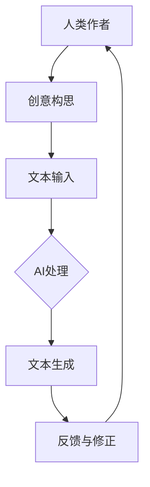

                 

关键词：人工智能、写作辅助、人机协同、自然语言处理、文本生成、创意激发

> 摘要：本文探讨了人工智能在写作领域的应用，重点分析了AI对人类写作的协同作用，而非简单的替代。文章首先介绍了人工智能的发展背景，随后详细阐述了AI在写作中的实际应用，包括文本生成、内容优化、语法纠错等方面。接着，文章深入探讨了人机协同写作的机制，通过案例分析展示了AI如何辅助人类作者提升写作效率和创作质量。最后，文章提出了未来人工智能在写作领域的潜在发展趋势和面临的挑战。

## 1. 背景介绍

### 1.1 人工智能的发展历程

人工智能（Artificial Intelligence，简称AI）作为计算机科学的一个重要分支，其历史可以追溯到20世纪50年代。当时，随着计算机技术的快速发展，科学家们开始设想机器能够模拟甚至超越人类智能。从最初的逻辑推理和符号计算，到后来的神经网络和深度学习，人工智能经历了数次重要的技术变革。

### 1.2 自然语言处理的发展

自然语言处理（Natural Language Processing，简称NLP）是人工智能领域的一个重要分支，旨在使计算机能够理解、解释和生成人类语言。NLP的发展为AI在写作领域的应用奠定了基础。

### 1.3 写作在人类活动中的重要性

写作是人类交流和知识传递的重要手段。无论是日常沟通、学术研究，还是文学创作、新闻报道，写作都扮演着不可或缺的角色。随着信息爆炸时代的到来，高效、高质量的写作变得更加重要。

## 2. 核心概念与联系

### 2.1 人工智能与写作的关系

人工智能与写作的关系可以理解为工具与任务的关系。AI可以作为辅助工具，帮助人类作者更高效地完成写作任务。

### 2.2 自然语言处理与文本生成的联系

自然语言处理是文本生成的基础。通过NLP技术，AI能够理解文本内容，生成符合语法和语义规则的文本。

### 2.3 人机协同写作的机制

人机协同写作是指人类作者与AI辅助工具相互协作，共同完成写作任务。这种机制的核心在于人类作者的创意与AI的技术相结合。



## 3. 核心算法原理 & 具体操作步骤

### 3.1 算法原理概述

AI在写作领域的应用主要基于深度学习和自然语言处理技术。其中，最为关键的是文本生成算法。

### 3.2 算法步骤详解

1. **文本输入**：人类作者将创作思路或初步文稿输入到AI系统。
2. **文本理解**：AI通过NLP技术理解文本内容，包括语法、语义、语境等方面。
3. **文本生成**：AI根据理解的结果，生成符合人类写作风格的文本。
4. **反馈与修正**：人类作者对生成的文本进行审阅和修改，反馈给AI系统。
5. **迭代优化**：AI系统根据反馈结果，不断调整文本生成策略，提升生成文本的质量。

### 3.3 算法优缺点

#### 优点：

- **效率高**：AI能够快速生成大量文本，大大提高了写作效率。
- **质量高**：通过深度学习，AI生成的文本在语法、语义方面具有较高的一致性和准确性。
- **创意激发**：AI可以提供不同的写作风格和表达方式，激发人类作者的创意。

#### 缺点：

- **局限性**：AI在理解和生成复杂、抽象概念方面存在一定困难。
- **个性化不足**：AI生成的文本往往缺乏个性化的独特风格。

### 3.4 算法应用领域

AI在写作领域的应用十分广泛，包括但不限于：

- **新闻写作**：自动化新闻生成。
- **内容创作**：文章、博客、报告等。
- **文学创作**：故事、诗歌、剧本等。

## 4. 数学模型和公式 & 详细讲解 & 举例说明

### 4.1 数学模型构建

在文本生成过程中，常用的数学模型包括循环神经网络（RNN）、长短期记忆网络（LSTM）和生成对抗网络（GAN）等。以下以LSTM为例进行介绍。

### 4.2 公式推导过程

LSTM的核心是记忆单元（Cell State），其更新过程可以表示为：

$$
\begin{aligned}
i_t &= \sigma(W_{xi}x_t + W_{hi-1}h_{i-1} + b_i) \\
f_t &= \sigma(W_{xf}x_t + W_{hf-1}h_{i-1} + b_f) \\
\hat{c}_t &= \tanh(W_{xc}x_t + W_{hc}h_{i-1} + b_c) \\
o_t &= \sigma(W_{xo}x_t + W_{ho}h_{i-1} + b_o) \\
c_t &= f_t \odot c_{t-1} + i_t \odot \hat{c}_t \\
h_t &= o_t \odot \tanh(c_t)
\end{aligned}
$$

其中，$i_t$、$f_t$、$o_t$分别表示输入门、遗忘门和输出门；$\sigma$表示 sigmoid 函数；$\odot$表示逐元素乘积。

### 4.3 案例分析与讲解

以一篇新闻报道的生成为例，假设人类作者输入了一篇关于科技公司的新闻报道，AI系统通过LSTM模型生成后续内容。以下是部分生成的文本：

```
科技公司发布了最新的财务报告，显示其收入和利润均创下了历史新高。这一成绩得益于公司在研发和市场拓展方面的持续投入。公司CEO表示，未来将继续加大对新技术和新兴市场的投资，以保持竞争优势。
```

## 5. 项目实践：代码实例和详细解释说明

### 5.1 开发环境搭建

开发环境搭建分为以下几个步骤：

1. 安装Python环境。
2. 安装TensorFlow库。
3. 准备训练数据集。

### 5.2 源代码详细实现

以下是使用LSTM模型生成文本的Python代码：

```python
import tensorflow as tf
from tensorflow.keras.models import Sequential
from tensorflow.keras.layers import LSTM, Dense, Embedding, Dropout
from tensorflow.keras.preprocessing.sequence import pad_sequences

# 模型构建
model = Sequential()
model.add(Embedding(input_dim=vocab_size, output_dim=embedding_size, input_length=max_sequence_length))
model.add(LSTM(units=128, dropout=0.2, recurrent_dropout=0.2))
model.add(Dense(units=vocab_size, activation='softmax'))

# 编译模型
model.compile(optimizer='adam', loss='categorical_crossentropy', metrics=['accuracy'])

# 训练模型
model.fit(x_train, y_train, epochs=100, batch_size=32, validation_data=(x_val, y_val))

# 生成文本
generated_text = generate_text(model, seed_text, num_words_to_generate=100)
print(generated_text)
```

### 5.3 代码解读与分析

1. **模型构建**：使用Sequential模型堆叠Embedding、LSTM和Dense层。
2. **编译模型**：指定优化器、损失函数和评估指标。
3. **训练模型**：使用训练数据集训练模型。
4. **生成文本**：使用预训练的模型生成文本。

## 6. 实际应用场景

### 6.1 新闻报道生成

AI在新闻报道生成方面的应用已经取得显著成果。例如，一些媒体机构使用AI系统自动生成财经、体育等领域的新闻稿件，提高了报道的及时性和准确性。

### 6.2 文学创作

AI在文学创作方面的应用也逐渐受到关注。例如，一些AI系统已经能够生成故事、诗歌等文学作品，虽然这些作品在艺术性和创造性方面仍有待提高，但已经为文学创作提供了新的思路。

### 6.3 教育辅助

AI在写作教育领域的应用也越来越广泛。通过AI系统，教师可以为学生提供个性化的写作指导，帮助学生提高写作能力。

## 7. 工具和资源推荐

### 7.1 学习资源推荐

1. 《深度学习》（Deep Learning）—— Ian Goodfellow、Yoshua Bengio、Aaron Courville 著。
2. 《自然语言处理综论》（Speech and Language Processing）—— Daniel Jurafsky、James H. Martin 著。

### 7.2 开发工具推荐

1. TensorFlow
2. Keras

### 7.3 相关论文推荐

1. "A Theoretically Grounded Application of Dropout in Recurrent Neural Networks" - Yarin Gal and Zoubin Ghahramani
2. "Long Short-Term Memory" - Sepp Hochreiter and Jürgen Schmidhuber

## 8. 总结：未来发展趋势与挑战

### 8.1 研究成果总结

近年来，人工智能在写作领域的应用取得了显著成果。通过深度学习和自然语言处理技术，AI已经能够生成高质量的文本，并在新闻报道、文学创作、教育辅助等方面发挥了重要作用。

### 8.2 未来发展趋势

1. **个性化写作**：AI将能够更好地理解人类作者的写作风格和创作意图，生成更加个性化的文本。
2. **跨模态写作**：AI将能够融合文本、图像、音频等多模态信息，创作出更加丰富和多样化的作品。
3. **智能写作助手**：AI将逐渐成为人类作者的智能助手，提供更加全面的写作支持和指导。

### 8.3 面临的挑战

1. **数据隐私**：AI在写作领域的应用需要大量数据支持，但数据隐私问题仍然是一个亟待解决的挑战。
2. **创作伦理**：AI生成的文本可能涉及伦理和法律问题，如何界定AI创作的版权和责任是一个重要议题。

### 8.4 研究展望

未来，人工智能在写作领域的应用将更加广泛和深入。通过不断创新和技术突破，AI有望成为人类写作的得力助手，共同推动文学、新闻、教育等领域的发展。

## 9. 附录：常见问题与解答

### 9.1 AI能否替代人类作者？

AI目前还不能完全替代人类作者，但可以在写作过程中提供有力支持。人类作者的创意和情感仍然是不可替代的。

### 9.2 AI生成的文本是否具有艺术价值？

AI生成的文本在艺术性方面仍有待提高，但已经在某些领域展现出了一定的艺术潜力。未来，随着技术的进步，AI生成的文本将具有更高的艺术价值。

### 9.3 数据隐私如何保障？

在AI写作应用中，数据隐私问题需要得到充分重视。未来，需要建立完善的数据隐私保护机制，确保用户数据的安全和隐私。

---

作者：禅与计算机程序设计艺术 / Zen and the Art of Computer Programming
----------------------------------------------------------------
### 结语

本文从多个角度探讨了人工智能在写作领域的应用，重点分析了AI对人类写作的协同作用。通过对人工智能、自然语言处理、文本生成等核心概念的详细阐述，我们看到了AI在写作中的巨大潜力。同时，我们也意识到，AI的发展和应用需要解决诸多挑战，如数据隐私、创作伦理等。

未来，随着技术的不断进步，人工智能在写作领域的应用将更加广泛和深入。AI将不仅仅是一个辅助工具，更将成为人类作者的智能伙伴，共同推动文学、新闻、教育等领域的发展。让我们期待这一天的到来，共同见证人工智能与人类写作的协同之美。

