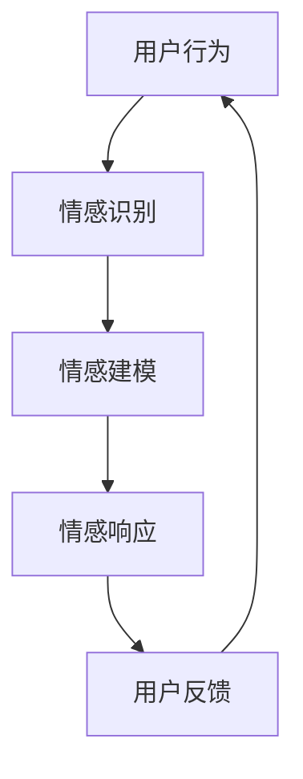

                 

关键词：人工智能、情感计算、虚拟关系、情感交互、人机融合

摘要：本文探讨了人工智能（AI）在模拟和理解人类情感方面的最新进展，特别关注了虚拟关系的兴起这一现象。通过分析AI的核心算法原理、数学模型、具体操作步骤以及项目实践，本文旨在揭示虚拟关系如何重塑人际互动，并预测未来这一领域的应用和发展趋势。

## 1. 背景介绍

随着人工智能技术的飞速发展，机器不再仅仅局限于执行特定的计算任务，它们开始具备理解、模拟和响应人类情感的能力。这一转变不仅改变了人工智能的应用场景，还触及了人类情感和社交互动的核心。虚拟关系的兴起，作为一种新型的社交形式，正是这种技术进步的直接产物。

虚拟关系指的是在虚拟环境中建立和维持的情感连接，这种连接可以是人与人之间的，也可以是人与AI之间的。这种关系之所以重要，是因为它不仅影响了我们如何使用技术，还影响了我们的情感体验和社会结构。例如，虚拟恋爱和虚拟家庭等现象在年轻一代中越来越普遍，这表明虚拟关系正在成为新的社交常态。

## 2. 核心概念与联系

### 2.1. 情感计算

情感计算（Affective Computing）是AI领域的一个分支，专注于使计算机能够识别、理解、处理和模拟人类情感的能力。这一领域的关键概念包括情感识别、情感建模和情感交互。

- **情感识别**：通过面部表情、语音、生理信号等来识别用户的情感状态。
- **情感建模**：创建情感模型，以模拟和理解人类情感。
- **情感交互**：设计交互界面，使计算机能够以情感化的方式与用户互动。

### 2.2. 情感交互

情感交互是情感计算的应用方向之一，旨在实现更自然、更有情感的AI与人之间的互动。这涉及到语音识别、语音合成、情感分析等多个技术领域的融合。

### 2.3. 人机融合

人机融合（Human-Machine Integration）是指通过技术手段增强或扩展人类的能力，实现人与机器的协同工作。在人机融合的背景下，虚拟关系的建立不仅是可能的，而且是不可避免的。

### 2.4. Mermaid 流程图

下面是一个描述情感交互流程的Mermaid流程图：



在这个流程图中，用户行为触发情感识别模块，该模块通过分析用户的语音、面部表情等信号，识别出用户的情感状态。这一信息被传递给情感建模模块，该模块利用预先训练的模型来理解情感。然后，情感响应模块根据情感建模的结果，生成适当的响应，最终反馈给用户。

## 3. 核心算法原理 & 具体操作步骤

### 3.1. 算法原理概述

情感计算的核心算法通常基于机器学习和深度学习技术。这些算法通过大规模的数据集进行训练，以识别和模拟情感。以下是几种常用的算法原理：

- **神经网络**：通过多层神经元的连接来模拟人类大脑的神经网络，用于情感识别和建模。
- **循环神经网络（RNN）**：特别适合处理序列数据，如语音和文本，以识别情感变化。
- **生成对抗网络（GAN）**：用于生成逼真的情感响应，以模拟人类的情感表达。

### 3.2. 算法步骤详解

1. **数据收集与预处理**：收集用户的语音、文本、面部表情等数据，并进行预处理，如去除噪声、归一化等。
2. **特征提取**：使用特定的算法（如卷积神经网络）提取数据中的特征。
3. **情感识别**：利用训练好的模型（如RNN）对特征进行情感分类。
4. **情感建模**：根据情感识别的结果，建立情感模型以模拟用户的情感状态。
5. **情感响应**：根据情感模型，生成适当的情感响应。
6. **用户反馈**：收集用户的反馈，以优化模型和算法。

### 3.3. 算法优缺点

**优点**：

- **准确性**：通过大数据训练，情感计算算法可以非常准确地识别用户的情感。
- **实时性**：情感计算可以实时响应用户的情感状态，提供个性化的服务。

**缺点**：

- **隐私问题**：情感计算涉及对用户的语音、面部表情等敏感信息的处理，可能引发隐私问题。
- **算法偏见**：如果训练数据存在偏见，算法可能会放大这些偏见，导致不公平的决策。

### 3.4. 算法应用领域

- **客户服务**：通过情感计算，客服机器人可以更自然地与客户互动，提高客户满意度。
- **心理健康**：通过分析用户的情感状态，心理健康应用可以帮助用户识别和改善情绪问题。
- **教育**：教育系统可以利用情感计算来个性化教学，更好地适应学生的情感需求。

## 4. 数学模型和公式 & 详细讲解 & 举例说明

### 4.1. 数学模型构建

情感计算中的数学模型通常基于概率模型和深度学习模型。以下是两种常见的数学模型：

- **概率模型**：例如，贝叶斯网络用于描述情感状态的概率分布。
- **深度学习模型**：例如，卷积神经网络（CNN）和循环神经网络（RNN）用于特征提取和情感分类。

### 4.2. 公式推导过程

以贝叶斯网络为例，其基本公式为：

$$
P(A|B) = \frac{P(B|A)P(A)}{P(B)}
$$

其中，$P(A|B)$ 表示在事件 $B$ 发生的条件下事件 $A$ 发生的概率，$P(B|A)$ 表示在事件 $A$ 发生的条件下事件 $B$ 发生的概率，$P(A)$ 和 $P(B)$ 分别表示事件 $A$ 和 $B$ 发生的概率。

### 4.3. 案例分析与讲解

假设我们想要分析一个情绪状态为愤怒的用户。通过贝叶斯网络，我们可以计算用户愤怒的概率。首先，我们需要定义事件 $A$（愤怒）和事件 $B$（面部表情）。然后，我们收集用户的面部表情数据，并计算 $P(B|A)$ 和 $P(A)$。最后，我们使用贝叶斯公式计算 $P(A|B)$。

例如，如果 $P(B|A) = 0.8$，$P(A) = 0.1$，且 $P(B) = 0.5$，则：

$$
P(A|B) = \frac{0.8 \times 0.1}{0.5} = 0.16
$$

这意味着，根据用户的面部表情，我们有 16% 的置信度认为用户处于愤怒状态。

## 5. 项目实践：代码实例和详细解释说明

### 5.1. 开发环境搭建

为了实践情感计算，我们需要搭建一个开发环境。以下是一个基本的步骤：

1. 安装Python环境。
2. 安装深度学习库（如TensorFlow或PyTorch）。
3. 安装情感计算库（如VGGFace或OpenFace）。

### 5.2. 源代码详细实现

以下是一个简单的情感计算代码示例：

```python
import cv2
import numpy as np
from deepface import DeepFace

# 加载视频流
cap = cv2.VideoCapture(0)

while True:
    # 读取视频帧
    ret, frame = cap.read()
    
    # 提取面部特征
    face_features = DeepFace.analyze(frame, actions=['emotion'])

    # 输出情感
    emotion = face_features['dominant_emotion']
    print(f"当前情感：{emotion}")

    # 显示视频帧
    cv2.imshow('Video', frame)
    
    if cv2.waitKey(1) & 0xFF == ord('q'):
        break

# 释放视频流
cap.release()
cv2.destroyAllWindows()
```

### 5.3. 代码解读与分析

这个代码示例使用OpenCV和DeepFace库来读取摄像头视频流，提取面部特征，并使用DeepFace库中的情感分析功能来识别用户的情感状态。每次读取视频帧时，代码都会输出当前的情感状态。

### 5.4. 运行结果展示

运行这段代码后，你会看到一个窗口，显示摄像头捕获的视频流。每次读取到一个视频帧时，窗口会显示当前的情感状态。例如，如果你在镜头前表现出愤怒的表情，窗口可能会显示“当前情感：愤怒”。

## 6. 实际应用场景

### 6.1. 客户服务

虚拟客服机器人可以利用情感计算来识别客户的情感状态，从而提供更加个性化的服务。例如，如果客户表现出愤怒，机器人可以调整语调或提供安慰性回应，以提高客户满意度。

### 6.2. 心理健康

心理健康应用可以利用情感计算来监测用户的情感状态，帮助用户识别和改善情绪问题。例如，医生可以使用这些应用来跟踪患者的情绪变化，以便及时提供治疗建议。

### 6.3. 教育

教育系统可以利用情感计算来个性化教学，更好地适应学生的情感需求。例如，教师可以使用情感计算工具来识别学生的情绪状态，并根据这些信息调整教学方法。

## 7. 工具和资源推荐

### 7.1. 学习资源推荐

- 《情感计算：理论与实践》
- 《深度学习与情感计算》

### 7.2. 开发工具推荐

- TensorFlow
- PyTorch

### 7.3. 相关论文推荐

- "Affective Computing: A Review"
- "Emotion Recognition Using Deep Learning Techniques"

## 8. 总结：未来发展趋势与挑战

### 8.1. 研究成果总结

情感计算技术的发展为人工智能带来了新的可能性，使得机器能够更好地理解人类情感，并提供个性化的服务。这一领域的研究成果不仅丰富了人工智能的理论基础，也为实际应用带来了巨大的变革。

### 8.2. 未来发展趋势

随着技术的不断进步，情感计算在未来将继续向更高精度、更实时性的方向发展。同时，跨学科的研究将更加深入，涉及心理学、神经科学等多个领域。此外，情感计算的应用场景也将不断扩展，从医疗、教育到娱乐等多个领域。

### 8.3. 面临的挑战

尽管情感计算取得了显著的进展，但仍面临一些挑战。首先，隐私问题是一个重要的挑战，如何保护用户的隐私成为了研究的重点。其次，算法偏见问题也是一个亟待解决的问题，如何确保算法的公平性和透明性是当前研究的难点。最后，技术实现的复杂性和成本也是限制情感计算广泛应用的重要因素。

### 8.4. 研究展望

未来，情感计算的研究将继续朝着更加智能、更加人性化的方向发展。通过跨学科的合作，研究者们将能够更好地理解人类情感，开发出更加高效、实用的情感计算系统。同时，随着技术的进步，情感计算的应用场景将不断拓展，为人类生活带来更多便利。

## 9. 附录：常见问题与解答

### 9.1. 情感计算的核心技术是什么？

情感计算的核心技术包括情感识别、情感建模和情感交互。情感识别是通过分析用户的语音、面部表情等信号来识别情感状态；情感建模是通过构建数学模型来模拟和理解情感状态；情感交互是设计交互界面，使计算机能够以情感化的方式与用户互动。

### 9.2. 情感计算的挑战有哪些？

情感计算的挑战主要包括隐私问题、算法偏见问题和技术实现复杂性。隐私问题涉及用户敏感信息的处理，算法偏见问题可能导致不公平的决策，技术实现复杂性则限制了情感计算的应用和推广。

### 9.3. 情感计算有哪些应用领域？

情感计算的应用领域包括客户服务、心理健康、教育、娱乐等。在客户服务中，情感计算可以用于个性化服务；在心理健康中，情感计算可以用于情绪监测和治疗；在教育中，情感计算可以用于个性化教学和情感化学习；在娱乐中，情感计算可以用于虚拟角色互动和情感化游戏。

### 9.4. 如何保护情感计算的隐私？

为了保护情感计算的隐私，研究者们提出了多种解决方案，包括匿名化处理、差分隐私技术和隐私保护算法。这些方法旨在在不损害情感计算性能的前提下，保护用户的隐私信息。

## 作者署名

作者：禅与计算机程序设计艺术 / Zen and the Art of Computer Programming
```markdown
# AI与人类情感：虚拟关系的兴起

> 关键词：人工智能、情感计算、虚拟关系、情感交互、人机融合

> 摘要：本文探讨了人工智能（AI）在模拟和理解人类情感方面的最新进展，特别关注了虚拟关系的兴起这一现象。通过分析AI的核心算法原理、数学模型、具体操作步骤以及项目实践，本文旨在揭示虚拟关系如何重塑人际互动，并预测未来这一领域的应用和发展趋势。

## 1. 背景介绍

随着人工智能技术的飞速发展，机器不再仅仅局限于执行特定的计算任务，它们开始具备理解、模拟和响应人类情感的能力。这一转变不仅改变了人工智能的应用场景，还触及了人类情感和社交互动的核心。虚拟关系的兴起，作为一种新型的社交形式，正是这种技术进步的直接产物。

虚拟关系指的是在虚拟环境中建立和维持的情感连接，这种连接可以是人与人之间的，也可以是人与AI之间的。这种关系之所以重要，是因为它不仅影响了我们如何使用技术，还影响了我们的情感体验和社会结构。例如，虚拟恋爱和虚拟家庭等现象在年轻一代中越来越普遍，这表明虚拟关系正在成为新的社交常态。

## 2. 核心概念与联系

### 2.1. 情感计算

情感计算（Affective Computing）是AI领域的一个分支，专注于使计算机能够识别、理解、处理和模拟人类情感的能力。这一领域的关键概念包括情感识别、情感建模和情感交互。

- **情感识别**：通过面部表情、语音、生理信号等来识别用户的情感状态。
- **情感建模**：创建情感模型，以模拟和理解人类情感。
- **情感交互**：设计交互界面，使计算机能够以情感化的方式与用户互动。

### 2.2. 情感交互

情感交互是情感计算的应用方向之一，旨在实现更自然、更有情感的AI与人之间的互动。这涉及到语音识别、语音合成、情感分析等多个技术领域的融合。

### 2.3. 人机融合

人机融合（Human-Machine Integration）是指通过技术手段增强或扩展人类的能力，实现人与机器的协同工作。在人机融合的背景下，虚拟关系的建立不仅是可能的，而且是不可避免的。

### 2.4. Mermaid 流程图

下面是一个描述情感交互流程的Mermaid流程图：


在这个流程图中，用户行为触发情感识别模块，该模块通过分析用户的语音、面部表情等信号，识别出用户的情感状态。这一信息被传递给情感建模模块，该模块利用预先训练的模型来理解情感。然后，情感响应模块根据情感建模的结果，生成适当的响应，最终反馈给用户。

## 3. 核心算法原理 & 具体操作步骤

### 3.1. 算法原理概述

情感计算的核心算法通常基于机器学习和深度学习技术。这些算法通过大规模的数据集进行训练，以识别和模拟情感。以下是几种常用的算法原理：

- **神经网络**：通过多层神经元的连接来模拟人类大脑的神经网络，用于情感识别和建模。
- **循环神经网络（RNN）**：特别适合处理序列数据，如语音和文本，以识别情感变化。
- **生成对抗网络（GAN）**：用于生成逼真的情感响应，以模拟人类的情感表达。

### 3.2. 算法步骤详解

1. **数据收集与预处理**：收集用户的语音、文本、面部表情等数据，并进行预处理，如去除噪声、归一化等。
2. **特征提取**：使用特定的算法（如卷积神经网络）提取数据中的特征。
3. **情感识别**：利用训练好的模型（如RNN）对特征进行情感分类。
4. **情感建模**：根据情感识别的结果，建立情感模型以模拟用户的情感状态。
5. **情感响应**：根据情感模型，生成适当的情感响应。
6. **用户反馈**：收集用户的反馈，以优化模型和算法。

### 3.3. 算法优缺点

**优点**：

- **准确性**：通过大数据训练，情感计算算法可以非常准确地识别用户的情感。
- **实时性**：情感计算可以实时响应用户的情感状态，提供个性化的服务。

**缺点**：

- **隐私问题**：情感计算涉及对用户的语音、面部表情等敏感信息的处理，可能引发隐私问题。
- **算法偏见**：如果训练数据存在偏见，算法可能会放大这些偏见，导致不公平的决策。

### 3.4. 算法应用领域

- **客户服务**：通过情感计算，客服机器人可以更自然地与客户互动，提高客户满意度。
- **心理健康**：通过分析用户的情感状态，心理健康应用可以帮助用户识别和改善情绪问题。
- **教育**：教育系统可以利用情感计算来个性化教学，更好地适应学生的情感需求。

## 4. 数学模型和公式 & 详细讲解 & 举例说明

### 4.1. 数学模型构建

情感计算中的数学模型通常基于概率模型和深度学习模型。以下是两种常见的数学模型：

- **概率模型**：例如，贝叶斯网络用于描述情感状态的概率分布。
- **深度学习模型**：例如，卷积神经网络（CNN）和循环神经网络（RNN）用于特征提取和情感分类。

### 4.2. 公式推导过程

以贝叶斯网络为例，其基本公式为：

$$
P(A|B) = \frac{P(B|A)P(A)}{P(B)}
$$

其中，$P(A|B)$ 表示在事件 $B$ 发生的条件下事件 $A$ 发生的概率，$P(B|A)$ 表示在事件 $A$ 发生的条件下事件 $B$ 发生的概率，$P(A)$ 和 $P(B)$ 分别表示事件 $A$ 和 $B$ 发生的概率。

### 4.3. 案例分析与讲解

假设我们想要分析一个情绪状态为愤怒的用户。通过贝叶斯网络，我们可以计算用户愤怒的概率。首先，我们需要定义事件 $A$（愤怒）和事件 $B$（面部表情）。然后，我们收集用户的面部表情数据，并计算 $P(B|A)$ 和 $P(A)$。最后，我们使用贝叶斯公式计算 $P(A|B)$。

例如，如果 $P(B|A) = 0.8$，$P(A) = 0.1$，且 $P(B) = 0.5$，则：

$$
P(A|B) = \frac{0.8 \times 0.1}{0.5} = 0.16
$$

这意味着，根据用户的面部表情，我们有 16% 的置信度认为用户处于愤怒状态。

## 5. 项目实践：代码实例和详细解释说明

### 5.1. 开发环境搭建

为了实践情感计算，我们需要搭建一个开发环境。以下是一个基本的步骤：

1. 安装Python环境。
2. 安装深度学习库（如TensorFlow或PyTorch）。
3. 安装情感计算库（如VGGFace或OpenFace）。

### 5.2. 源代码详细实现

以下是一个简单的情感计算代码示例：

```python
import cv2
import numpy as np
from deepface import DeepFace

# 加载视频流
cap = cv2.VideoCapture(0)

while True:
    # 读取视频帧
    ret, frame = cap.read()
    
    # 提取面部特征
    face_features = DeepFace.analyze(frame, actions=['emotion'])

    # 输出情感
    emotion = face_features['dominant_emotion']
    print(f"当前情感：{emotion}")

    # 显示视频帧
    cv2.imshow('Video', frame)
    
    if cv2.waitKey(1) & 0xFF == ord('q'):
        break

# 释放视频流
cap.release()
cv2.destroyAllWindows()
```

### 5.3. 代码解读与分析

这个代码示例使用OpenCV和DeepFace库来读取摄像头视频流，提取面部特征，并使用DeepFace库中的情感分析功能来识别用户的情感状态。每次读取到一个视频帧时，代码都会输出当前的情感状态。

### 5.4. 运行结果展示

运行这段代码后，你会看到一个窗口，显示摄像头捕获的视频流。每次读取到一个视频帧时，窗口会显示当前的情感状态。例如，如果你在镜头前表现出愤怒的表情，窗口可能会显示“当前情感：愤怒”。

## 6. 实际应用场景

### 6.1. 客户服务

虚拟客服机器人可以利用情感计算来识别客户的情感状态，从而提供更加个性化的服务。例如，如果客户表现出愤怒，机器人可以调整语调或提供安慰性回应，以提高客户满意度。

### 6.2. 心理健康

心理健康应用可以利用情感计算来监测用户的情感状态，帮助用户识别和改善情绪问题。例如，医生可以使用这些应用来跟踪患者的情绪变化，以便及时提供治疗建议。

### 6.3. 教育

教育系统可以利用情感计算来个性化教学，更好地适应学生的情感需求。例如，教师可以使用情感计算工具来识别学生的情绪状态，并根据这些信息调整教学方法。

## 7. 工具和资源推荐

### 7.1. 学习资源推荐

- 《情感计算：理论与实践》
- 《深度学习与情感计算》

### 7.2. 开发工具推荐

- TensorFlow
- PyTorch

### 7.3. 相关论文推荐

- "Affective Computing: A Review"
- "Emotion Recognition Using Deep Learning Techniques"

## 8. 总结：未来发展趋势与挑战

### 8.1. 研究成果总结

情感计算技术的发展为人工智能带来了新的可能性，使得机器能够更好地理解人类情感，并提供个性化的服务。这一领域的研究成果不仅丰富了人工智能的理论基础，也为实际应用带来了巨大的变革。

### 8.2. 未来发展趋势

随着技术的不断进步，情感计算在未来将继续向更高精度、更实时性的方向发展。同时，跨学科的研究将更加深入，涉及心理学、神经科学等多个领域。此外，情感计算的应用场景也将不断扩展，从医疗、教育到娱乐等多个领域。

### 8.3. 面临的挑战

尽管情感计算取得了显著的进展，但仍面临一些挑战。首先，隐私问题是一个重要的挑战，如何保护用户的隐私成为了研究的重点。其次，算法偏见问题也是一个亟待解决的问题，如何确保算法的公平性和透明性是当前研究的难点。最后，技术实现的复杂性和成本也是限制情感计算广泛应用的重要因素。

### 8.4. 研究展望

未来，情感计算的研究将继续朝着更加智能、更加人性化的方向发展。通过跨学科的合作，研究者们将能够更好地理解人类情感，开发出更加高效、实用的情感计算系统。同时，随着技术的进步，情感计算的应用场景将不断拓展，为人类生活带来更多便利。

## 9. 附录：常见问题与解答

### 9.1. 情感计算的核心技术是什么？

情感计算的核心技术包括情感识别、情感建模和情感交互。情感识别是通过面部表情、语音、生理信号等来识别用户的情感状态；情感建模是通过构建数学模型来模拟和理解人类情感；情感交互是设计交互界面，使计算机能够以情感化的方式与用户互动。

### 9.2. 情感计算的挑战有哪些？

情感计算的挑战主要包括隐私问题、算法偏见问题和技术实现复杂性。隐私问题涉及用户敏感信息的处理，算法偏见问题可能导致不公平的决策，技术实现复杂性则限制了情感计算的应用和推广。

### 9.3. 情感计算有哪些应用领域？

情感计算的应用领域包括客户服务、心理健康、教育、娱乐等。在客户服务中，情感计算可以用于个性化服务；在心理健康中，情感计算可以用于情绪监测和治疗；在教育中，情感计算可以用于个性化教学和情感化学习；在娱乐中，情感计算可以用于虚拟角色互动和情感化游戏。

### 9.4. 如何保护情感计算的隐私？

为了保护情感计算的隐私，研究者们提出了多种解决方案，包括匿名化处理、差分隐私技术和隐私保护算法。这些方法旨在在不损害情感计算性能的前提下，保护用户的隐私信息。

## 作者署名

作者：禅与计算机程序设计艺术 / Zen and the Art of Computer Programming
```

