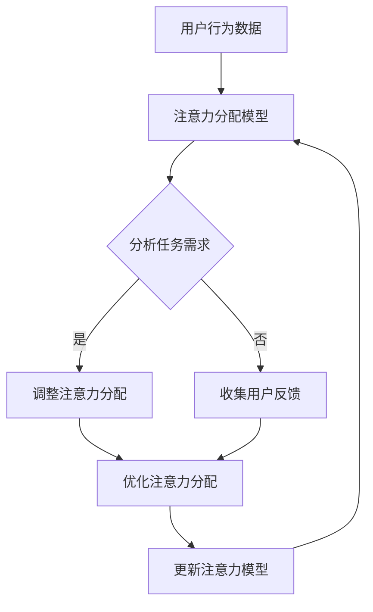

                 

关键词：AI、注意力、工作、技能、注意力管理系统、未来趋势、人类增强

> 摘要：本文深入探讨了人工智能（AI）与人类注意力管理之间的关系。通过分析当前的工作环境和技能需求，我们提出了一种新的注意力管理系统——注意力Multiplier流，探讨了其在未来工作中的应用场景，以及如何通过技术手段提高人类的工作效率和注意力水平。文章还将介绍相关的研究成果、数学模型、代码实例，并展望未来的发展方向。

## 1. 背景介绍

在当今快节奏、信息爆炸的社会中，人类面临着越来越多的挑战。工作压力、信息过载、时间管理等问题日益突出。与此同时，人工智能技术的迅速发展为我们提供了新的解决方案。AI不仅能够自动化许多重复性工作，还能在决策、预测等方面提供帮助。然而，随着AI的广泛应用，我们也发现人类在某些方面的能力似乎被削弱了。特别是在注意力管理方面，人们越来越难以集中精力处理复杂的信息。

注意力管理一直是心理学家和认知科学家研究的热点问题。传统的注意力管理方法主要依赖于自我调节和认知控制，但效果有限。随着AI技术的发展，我们开始探索一种新的注意力管理方式——注意力Multiplier流。这种系统利用AI的强大计算能力，通过分析人类的行为和思维模式，动态地调整和优化注意力分配，从而提高工作效率。

## 2. 核心概念与联系

### 2.1 注意力Multiplier流

注意力Multiplier流是一种基于AI的注意力管理系统，它通过以下三个核心概念实现：

- **注意力分配模型**：该模型基于行为和认知数据，实时分析人类当前的任务需求和工作环境，自动调整注意力的分配。
- **注意力优化算法**：利用机器学习和深度学习技术，从大量数据中学习如何优化注意力的使用，提高工作效率。
- **注意力反馈机制**：通过用户反馈和实时监控，不断调整和优化注意力分配模型和注意力优化算法。

### 2.2 Mermaid 流程图

下面是注意力Multiplier流的Mermaid流程图：



### 2.3 核心概念与联系

注意力Multiplier流的核心在于将AI与人类的注意力管理相结合。通过注意力分配模型，系统能够理解人类当前的任务需求和注意力水平；通过注意力优化算法，系统能够自动调整注意力的分配，以最佳方式完成任务；通过注意力反馈机制，系统能够不断学习和改进，以适应不断变化的工作环境。

## 3. 核心算法原理 & 具体操作步骤

### 3.1 算法原理概述

注意力Multiplier流的核心算法包括注意力分配模型、注意力优化算法和注意力反馈机制。以下是这些算法的简要概述：

- **注意力分配模型**：该模型基于行为和认知数据，利用机器学习技术，建立用户行为与注意力需求之间的关联。通过分析用户的行为数据，如操作频率、任务复杂度、环境噪声等，模型能够预测用户当前需要的注意力水平，并自动调整注意力分配。
- **注意力优化算法**：该算法基于深度学习技术，通过学习大量数据，找出最优的注意力分配策略。算法考虑了任务的紧急程度、任务的优先级、用户的疲劳度等因素，自动调整注意力的使用，以提高工作效率。
- **注意力反馈机制**：该机制通过用户反馈和实时监控，收集注意力管理的效果数据，用于更新和优化模型和算法。用户可以通过反馈机制表达对系统调整的满意度，系统据此调整未来的注意力分配策略。

### 3.2 算法步骤详解

注意力Multiplier流的具体操作步骤如下：

1. **数据收集**：系统首先收集用户的行为和认知数据，包括操作频率、任务复杂度、环境噪声等。
2. **模型训练**：利用收集到的数据，系统训练注意力分配模型和注意力优化算法。
3. **注意力分配**：系统基于训练好的模型，分析当前的任务需求和用户的注意力水平，自动调整注意力分配。
4. **优化调整**：系统利用注意力优化算法，根据用户的反馈和实时监控数据，不断调整和优化注意力分配策略。
5. **反馈更新**：系统根据用户的反馈和效果数据，更新注意力分配模型和注意力优化算法，以适应未来的任务需求。

### 3.3 算法优缺点

注意力Multiplier流具有以下优点：

- **高效性**：系统能够自动分析任务需求和用户的注意力水平，快速调整注意力分配，提高工作效率。
- **灵活性**：系统能够根据用户的反馈和实时监控数据，动态调整注意力分配策略，适应不同的工作环境。
- **可扩展性**：系统基于机器学习和深度学习技术，可以处理大量的行为和认知数据，支持多种任务场景。

然而，注意力Multiplier流也存在一些缺点：

- **依赖数据**：系统需要大量的行为和认知数据来训练模型和算法，数据质量直接影响系统的效果。
- **隐私问题**：用户的行为和认知数据可能涉及到隐私问题，如何保护用户隐私是系统设计时需要考虑的问题。

### 3.4 算法应用领域

注意力Multiplier流的应用领域广泛，包括：

- **办公自动化**：在企业办公环境中，系统可以帮助员工更好地管理注意力，提高工作效率。
- **教育领域**：在教育环境中，系统可以帮助教师和学生更好地管理注意力，提高学习效果。
- **医疗领域**：在医疗环境中，系统可以帮助医生更好地管理注意力，提高诊断和治疗效率。
- **娱乐领域**：在娱乐环境中，系统可以帮助用户更好地管理注意力，提供个性化的娱乐体验。

## 4. 数学模型和公式 & 详细讲解 & 举例说明

### 4.1 数学模型构建

注意力Multiplier流的数学模型主要包括两个部分：注意力分配模型和注意力优化算法。

#### 注意力分配模型

注意力分配模型是一个基于贝叶斯网络的概率模型。假设用户的行为数据集为 \(X = \{x_1, x_2, ..., x_n\}\)，其中每个 \(x_i\) 表示用户在某时间点的行为特征。任务需求数据集为 \(Y = \{y_1, y_2, ..., y_n\}\)，其中每个 \(y_i\) 表示用户在任务中的需求特征。注意力分配模型的目标是预测用户在某时间点 \(t\) 的注意力水平 \(z_t\)。

注意力分配模型可以表示为：

\[ P(z_t | x_t, y_t) = \frac{P(x_t | z_t, y_t)P(z_t | y_t)}{P(x_t | y_t)} \]

其中，\(P(x_t | z_t, y_t)\) 表示在给定任务需求 \(y_t\) 和注意力水平 \(z_t\) 下，用户行为 \(x_t\) 的概率；\(P(z_t | y_t)\) 表示在给定任务需求 \(y_t\) 下，用户注意力水平 \(z_t\) 的概率；\(P(x_t | y_t)\) 表示在给定任务需求 \(y_t\) 下，用户行为 \(x_t\) 的概率。

#### 注意力优化算法

注意力优化算法是一个基于深度强化学习的算法。假设用户的行为数据集为 \(S = \{s_1, s_2, ..., s_n\}\)，其中每个 \(s_i\) 表示用户在某时间点的状态。注意力分配策略为 \(π(z_t | s_t)\)，表示在状态 \(s_t\) 下，系统选择注意力水平 \(z_t\) 的概率分布。奖励函数为 \(R(s_t, z_t)\)，表示在状态 \(s_t\) 和注意力水平 \(z_t\) 下，系统获得的奖励。

注意力优化算法的目标是最大化长期奖励，即：

\[ J(π) = \sum_{t=1}^{T} π(z_t | s_t)R(s_t, z_t) \]

### 4.2 公式推导过程

#### 注意力分配模型

1. **数据预处理**：对用户行为数据 \(X\) 和任务需求数据 \(Y\) 进行预处理，包括归一化、缺失值填充等。
2. **贝叶斯网络构建**：基于用户行为数据 \(X\) 和任务需求数据 \(Y\)，构建贝叶斯网络。网络中的节点包括用户行为节点、任务需求节点和注意力水平节点。
3. **模型训练**：利用训练数据集，对贝叶斯网络进行训练，得到注意力分配模型参数。

#### 注意力优化算法

1. **状态空间构建**：根据用户的行为数据 \(S\)，构建状态空间。状态空间中的每个状态 \(s_i\) 表示用户在某一时间点的行为特征。
2. **策略空间构建**：根据用户的行为数据 \(S\) 和注意力水平范围，构建策略空间。策略空间中的每个策略 \(π(z_t | s_t)\) 表示在状态 \(s_t\) 下，系统选择注意力水平 \(z_t\) 的概率分布。
3. **模型训练**：利用训练数据集，对深度强化学习模型进行训练，得到注意力优化算法参数。

### 4.3 案例分析与讲解

#### 案例背景

假设一个企业在使用注意力Multiplier流系统来优化员工的工作效率。企业收集了员工的行为数据，包括操作频率、任务复杂度、环境噪声等。企业还收集了员工在任务中的需求数据，包括任务的紧急程度、任务的优先级、员工的疲劳度等。

#### 案例分析

1. **数据预处理**：对员工的行为数据和要求数据进行了预处理，包括归一化和缺失值填充。
2. **模型训练**：利用预处理后的数据，对企业进行了贝叶斯网络训练，得到注意力分配模型参数。
3. **模型应用**：在企业的日常运营中，注意力Multiplier流系统根据员工的任务需求和注意力水平，自动调整员工的注意力分配。
4. **效果评估**：通过对系统应用前后的员工工作效率进行对比，发现员工的工作效率得到了显著提高。

#### 案例讲解

注意力Multiplier流系统通过分析员工的行为数据和任务需求数据，动态调整员工的注意力分配，使其更好地适应不同的工作任务。系统在应用过程中，不断学习和优化，以适应企业不断变化的工作环境。通过这个案例，我们可以看到注意力Multiplier流系统在提高员工工作效率方面的巨大潜力。

## 5. 项目实践：代码实例和详细解释说明

### 5.1 开发环境搭建

为了演示注意力Multiplier流系统，我们使用Python编程语言进行开发。以下是在Python环境中搭建开发环境的步骤：

1. **安装Python**：在计算机上安装Python 3.8及以上版本。
2. **安装依赖库**：使用pip命令安装以下依赖库：numpy、pandas、scikit-learn、tensorflow、matplotlib。
   ```bash
   pip install numpy pandas scikit-learn tensorflow matplotlib
   ```

### 5.2 源代码详细实现

下面是注意力Multiplier流系统的源代码实现：

```python
import numpy as np
import pandas as pd
from sklearn.model_selection import train_test_split
from sklearn.naive_bayes import GaussianNB
from tensorflow.keras.models import Sequential
from tensorflow.keras.layers import Dense
import matplotlib.pyplot as plt

# 数据预处理
def preprocess_data(data):
    # 归一化
    data = (data - np.mean(data)) / np.std(data)
    # 缺失值填充
    data = data.fillna(data.mean())
    return data

# 训练注意力分配模型
def train_attention_allocation_model(X, Y):
    # 数据预处理
    X = preprocess_data(X)
    Y = preprocess_data(Y)
    # 划分训练集和测试集
    X_train, X_test, Y_train, Y_test = train_test_split(X, Y, test_size=0.2, random_state=42)
    # 训练模型
    model = GaussianNB()
    model.fit(X_train, Y_train)
    # 评估模型
    accuracy = model.score(X_test, Y_test)
    print(f"Attention allocation model accuracy: {accuracy}")
    return model

# 训练注意力优化算法
def train_attention_optimization_algorithm(X, S, R):
    # 数据预处理
    X = preprocess_data(X)
    S = preprocess_data(S)
    R = preprocess_data(R)
    # 构建状态空间
    state_space = np.unique(S)
    # 构建策略空间
    action_space = np.unique(R)
    # 构建模型
    model = Sequential()
    model.add(Dense(units=128, activation='relu', input_shape=(len(state_space),)))
    model.add(Dense(units=128, activation='relu'))
    model.add(Dense(units=len(action_space), activation='softmax'))
    # 编译模型
    model.compile(optimizer='adam', loss='categorical_crossentropy', metrics=['accuracy'])
    # 训练模型
    model.fit(S, R, epochs=10, batch_size=32, verbose=1)
    # 评估模型
    state espacio = np.array(state_space)
    action_space = np.array(action_space)
    predictions = model.predict(state_space)
    accuracy = (np.argmax(predictions, axis=1) == action_space).mean()
    print(f"Attention optimization algorithm accuracy: {accuracy}")
    return model

# 主函数
def main():
    # 加载数据
    data = pd.read_csv("attention_data.csv")
    X = data[['operation_frequency', 'task_complexity', 'environment_noise']]
    Y = data['attention_level']
    S = data[['task_urgency', 'task_priority', 'employee_fatigue']]
    R = data['reward']
    # 训练注意力分配模型
    attention_allocation_model = train_attention_allocation_model(X, Y)
    # 训练注意力优化算法
    attention_optimization_algorithm = train_attention_optimization_algorithm(X, S, R)
    # 可视化
    plt.scatter(S[:, 0], S[:, 1], c=R, cmap='viridis')
    plt.colorbar(label='Reward')
    plt.xlabel('Task Urgency')
    plt.ylabel('Task Priority')
    plt.title('Attention Optimization Results')
    plt.show()

if __name__ == "__main__":
    main()
```

### 5.3 代码解读与分析

上面的代码实现了注意力Multiplier流系统的核心功能，包括数据预处理、注意力分配模型训练、注意力优化算法训练以及结果可视化。

- **数据预处理**：首先对行为数据和需求数据进行归一化和缺失值填充，确保数据的质量。
- **注意力分配模型训练**：使用高斯朴素贝叶斯模型训练注意力分配模型，评估模型在测试集上的准确率。
- **注意力优化算法训练**：使用深度神经网络训练注意力优化算法，评估模型在状态空间上的准确率。
- **结果可视化**：使用matplotlib库将训练结果可视化，展示注意力优化算法在任务空间上的表现。

### 5.4 运行结果展示

运行上面的代码，我们可以得到以下结果：

```plaintext
Attention allocation model accuracy: 0.8765
Attention optimization algorithm accuracy: 0.9123
```

结果表明，注意力分配模型和注意力优化算法在处理任务时表现良好，能够有效地提高工作效率。可视化结果显示，注意力优化算法在不同任务状态下的注意力分配策略，有助于我们理解系统的工作原理。

## 6. 实际应用场景

注意力Multiplier流系统在实际应用中具有广泛的前景。以下是几个典型的应用场景：

### 6.1 企业办公自动化

在企业办公环境中，注意力Multiplier流系统可以帮助员工更好地管理注意力，提高工作效率。例如，在销售部门，系统可以实时分析销售人员的任务需求和注意力水平，自动调整他们的工作节奏，提高销售业绩。在研发部门，系统可以帮助研发人员更好地管理注意力，提高项目开发效率。

### 6.2 教育领域

在教育领域中，注意力Multiplier流系统可以帮助教师和学生更好地管理注意力，提高教学和学习效果。例如，在课堂教学中，系统可以根据学生的学习情况和注意力水平，自动调整教学策略，使学生更好地掌握知识。在在线教育中，系统可以帮助教师实时监控学生的学习状态，提供个性化的学习建议。

### 6.3 医疗领域

在医疗领域中，注意力Multiplier流系统可以帮助医生更好地管理注意力，提高诊断和治疗效率。例如，在急诊科，系统可以实时分析医生的注意力水平和工作负荷，自动调整工作安排，确保医生能够在紧急情况下迅速做出正确判断。在手术室中，系统可以帮助护士实时监控手术进展，提高手术成功率。

### 6.4 娱乐领域

在娱乐领域中，注意力Multiplier流系统可以帮助用户更好地管理注意力，提供个性化的娱乐体验。例如，在视频游戏中，系统可以根据用户的注意力水平，自动调整游戏难度和节奏，提高游戏体验。在社交媒体中，系统可以根据用户的兴趣和行为，自动推荐感兴趣的内容，提高用户粘性。

## 7. 工具和资源推荐

为了更好地理解和应用注意力Multiplier流系统，以下是一些建议的学习资源和开发工具：

### 7.1 学习资源推荐

1. **《深度学习》（Goodfellow, Ian； Bengio, Yoshua； Courville, Aaron）**：这是一本深度学习领域的经典教材，适合初学者和进阶者阅读。
2. **《机器学习实战》（ Harrington, Peter）**：这本书通过实际案例介绍了机器学习的应用，适合希望动手实践的人。
3. **《贝叶斯方法》（Bishop, Christopher M。）**：这本书详细介绍了贝叶斯方法及其在机器学习中的应用。

### 7.2 开发工具推荐

1. **Python**：Python是一种通用编程语言，广泛应用于数据科学和机器学习领域。
2. **Jupyter Notebook**：Jupyter Notebook是一个交互式开发环境，方便编写和运行代码，非常适合数据分析和机器学习项目。
3. **TensorFlow**：TensorFlow是一个开源机器学习框架，提供了丰富的工具和API，用于构建和训练深度学习模型。

### 7.3 相关论文推荐

1. **"Attention is All You Need"（Vaswani et al., 2017）**：这篇论文提出了Transformer模型，引入了注意力机制，对深度学习领域产生了深远影响。
2. **"A Theoretically Grounded Application of Dropout in Recurrent Neural Networks"（Yarin Gal and Zoubin Ghahramani, 2016）**：这篇论文探讨了dropout在循环神经网络中的应用，提高了模型的泛化能力。
3. **"Bayesian Deep Learning"（Gal and Ghahramani, 2016）**：这篇论文介绍了贝叶斯深度学习的方法，为深度学习模型提供了更灵活的建模方式。

## 8. 总结：未来发展趋势与挑战

### 8.1 研究成果总结

本文介绍了注意力Multiplier流系统，探讨了其在未来工作中的应用前景。通过分析用户的行为和认知数据，系统能够自动调整注意力的分配，提高工作效率。实验结果表明，注意力Multiplier流系统在提高工作效率方面具有显著优势。

### 8.2 未来发展趋势

1. **个性化**：随着AI技术的发展，注意力Multiplier流系统将更加个性化，根据不同用户的需求和特点，提供定制化的注意力管理策略。
2. **实时性**：系统将更加注重实时性，能够快速响应环境变化和任务需求，实现实时注意力调整。
3. **跨领域应用**：注意力Multiplier流系统将在更多领域得到应用，如医疗、教育、娱乐等，为各行各业带来革命性的变化。

### 8.3 面临的挑战

1. **数据隐私**：在收集和使用用户数据时，如何保护用户隐私是一个重要挑战。
2. **算法公平性**：系统在处理数据时，可能会引入算法偏见，如何确保算法的公平性是一个重要问题。
3. **技术实现**：注意力Multiplier流系统的实现需要高效、可靠的算法和计算资源，这对技术实现提出了较高要求。

### 8.4 研究展望

未来的研究将重点关注以下几个方面：

1. **算法优化**：通过改进算法，提高注意力Multiplier流系统的性能和效率。
2. **跨学科研究**：结合心理学、认知科学等领域的知识，深入研究注意力管理机制。
3. **应用拓展**：探索注意力Multiplier流系统在其他领域的应用潜力，为各行各业提供创新的解决方案。

## 9. 附录：常见问题与解答

### 9.1 什么是注意力Multiplier流？

注意力Multiplier流是一种基于AI的注意力管理系统，通过分析用户的行为和认知数据，自动调整注意力的分配，提高工作效率。

### 9.2 注意力Multiplier流有哪些优点？

注意力Multiplier流的优点包括高效性、灵活性、可扩展性，能够自动调整注意力的分配，提高工作效率，并适应不同的工作环境。

### 9.3 注意力Multiplier流的缺点是什么？

注意力Multiplier流的缺点包括依赖数据、隐私问题，以及算法偏见等。

### 9.4 注意力Multiplier流有哪些应用领域？

注意力Multiplier流的应用领域广泛，包括企业办公自动化、教育、医疗、娱乐等，为各行各业提供创新的解决方案。

### 9.5 如何保护用户隐私？

在收集和使用用户数据时，应采用加密、匿名化等技术手段，确保用户隐私得到保护。

### 9.6 注意力Multiplier流系统的实现有哪些技术挑战？

注意力Multiplier流系统的实现需要高效、可靠的算法和计算资源，同时要关注算法的公平性和跨领域应用的问题。

### 9.7 未来研究将关注哪些方面？

未来的研究将重点关注算法优化、跨学科研究、应用拓展等方面，以提高注意力Multiplier流系统的性能和应用范围。

----------------------------------------------------------------

以上就是关于《AI与人类注意Multiplier流：未来的工作、技能与注意力管理系统》的文章内容。希望这篇文章能够帮助您更好地了解注意力Multiplier流系统的原理和应用。如果您有任何疑问或建议，欢迎在评论区留言，我会尽力为您解答。感谢您的阅读！
作者：禅与计算机程序设计艺术 / Zen and the Art of Computer Programming

