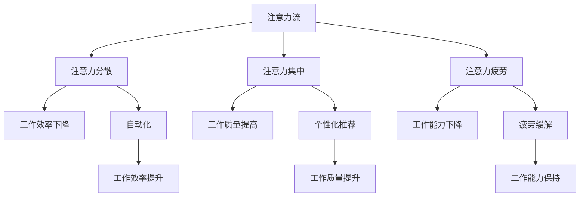

                 

关键词：人工智能、注意力流、工作场所、注意力管理、人机交互、未来趋势

摘要：本文探讨了人工智能（AI）在提升人类注意力流方面的重要作用。随着AI技术的飞速发展，工作场所的注意力管理面临着新的挑战和机遇。本文首先介绍了注意力流的概念，然后分析了AI如何通过自动化和个性化推荐来提高工作效率和注意力质量。此外，文章还探讨了未来工作场所中注意力管理的趋势和面临的挑战。

## 1. 背景介绍

随着全球化和数字化的发展，工作场所正经历着深刻的变革。传统的工作模式逐渐被打破，远程办公、灵活工作时间和协作工具的普及，使得人们的工作方式变得更加灵活和多样化。然而，这种变化也带来了新的挑战，尤其是在注意力管理方面。

注意力流是指人们在完成任务过程中注意力分配的动态过程。随着工作任务的复杂性和多样性增加，如何有效地管理注意力流成为一个关键问题。传统的工作场所依赖于个体自身的注意力管理能力，而随着人工智能技术的应用，注意力管理逐渐呈现出自动化和智能化的趋势。

本文将探讨人工智能如何影响人类注意力流，以及未来的工作场所如何应对这些变化。文章结构如下：

- **背景介绍**：介绍注意力流的概念和当前工作场所面临的挑战。
- **核心概念与联系**：介绍注意力管理中的核心概念，并通过Mermaid流程图展示其架构。
- **核心算法原理 & 具体操作步骤**：详细解释注意力管理算法的原理和操作步骤。
- **数学模型和公式 & 详细讲解 & 举例说明**：介绍注意力管理的数学模型和公式，并通过案例分析进行说明。
- **项目实践：代码实例和详细解释说明**：提供实际的项目实例和代码解释。
- **实际应用场景**：分析注意力管理在不同领域的应用。
- **未来应用展望**：探讨未来注意力管理的发展趋势。
- **工具和资源推荐**：推荐相关学习和开发资源。
- **总结：未来发展趋势与挑战**：总结研究成果并展望未来。

### 2. 核心概念与联系

在讨论注意力管理时，我们需要引入几个核心概念，包括注意力流、注意力分散、注意力集中和注意力疲劳等。

#### 注意力流

注意力流是指个体在完成特定任务时，注意力在任务和环境之间的动态分配过程。一个有效的注意力流应该能够平衡任务的复杂性和个体注意力的分配，以最大化工作效率。

#### 注意力分散

注意力分散是指个体在同时处理多个任务或环境刺激时，注意力分散到不同任务或刺激上的现象。注意力分散会导致工作效率下降，甚至可能引发错误。

#### 注意力集中

注意力集中是指个体将全部注意力集中在单一任务或环境刺激上的状态。这种状态有助于提高任务的完成质量和速度。

#### 注意力疲劳

注意力疲劳是指个体在长时间专注于特定任务后，注意力水平逐渐下降，导致工作能力下降的现象。注意力疲劳是影响工作效率的重要因素之一。

在注意力管理中，这些概念相互关联。例如，注意力分散和注意力疲劳会影响注意力流，进而影响工作效率。而人工智能可以通过自动化和个性化推荐来优化注意力流，减少注意力分散和疲劳。

下面是一个用Mermaid流程图展示的注意力管理架构：



通过这个架构，我们可以看到人工智能在注意力管理中扮演的关键角色，包括自动化、个性化推荐和疲劳缓解。这些技术有助于优化注意力流，提高工作效率。

### 3. 核心算法原理 & 具体操作步骤

在注意力管理中，核心算法的原理和操作步骤至关重要。以下是一个典型的注意力管理算法的概述和详细解释。

#### 3.1 算法原理概述

注意力管理算法的核心目标是优化注意力流的分配，以最大化工作效率。算法的基本原理包括：

- **注意力分配模型**：根据任务的复杂性和紧急程度，动态调整注意力的分配。
- **注意力疲劳预测**：利用历史数据和机器学习模型预测个体注意力的疲劳程度。
- **自动化调整**：根据注意力疲劳预测结果，自动化调整任务的优先级和工作节奏。

#### 3.2 算法步骤详解

1. **数据收集**：收集个体在完成任务过程中的注意力数据，包括注意力流的分配、任务的复杂性和紧急程度等。
2. **模型训练**：使用历史数据训练注意力疲劳预测模型，模型输入包括任务的复杂度和持续时间等。
3. **实时监测**：在任务执行过程中，实时监测个体的注意力流，并收集相关数据。
4. **注意力疲劳预测**：利用训练好的模型预测个体的注意力疲劳程度。
5. **自动化调整**：根据注意力疲劳预测结果，自动化调整任务的优先级和工作节奏，以缓解疲劳。
6. **反馈机制**：收集调整后的工作效果数据，并反馈给模型进行优化。

#### 3.3 算法优缺点

**优点**：

- **提高工作效率**：通过动态调整注意力的分配，优化任务完成的速度和质量。
- **减轻工作压力**：自动化调整任务优先级和工作节奏，有助于减轻个体的工作压力。
- **个性化推荐**：根据个体特点和工作需求，提供个性化的任务推荐，提高工作满意度。

**缺点**：

- **数据依赖性**：算法的准确性依赖于高质量的数据，数据缺失或不准确会影响算法效果。
- **隐私问题**：实时监测个体的注意力流可能涉及到隐私问题，需要妥善处理。

#### 3.4 算法应用领域

注意力管理算法广泛应用于多个领域，包括：

- **企业办公**：优化企业内部任务管理和员工工作安排。
- **教育领域**：辅助教师和学生进行注意力管理，提高学习效率。
- **健康医疗**：辅助医生进行诊断和治疗，优化医疗资源分配。

### 4. 数学模型和公式 & 详细讲解 & 举例说明

在注意力管理中，数学模型和公式起着至关重要的作用。以下是一个典型的注意力管理数学模型的构建和公式推导过程。

#### 4.1 数学模型构建

注意力管理数学模型主要包括两部分：注意力流的分配模型和注意力疲劳预测模型。

1. **注意力流分配模型**：

   假设有 \( n \) 个任务，每个任务的复杂度为 \( c_i \)，紧急度为 \( e_i \)，个体的注意力总量为 \( A \)。注意力流的分配模型可以表示为：

   $$ A_i = f(c_i, e_i) $$

   其中，\( f \) 为一个基于任务复杂度和紧急度的非线性函数。

2. **注意力疲劳预测模型**：

   假设个体在一段时间 \( t \) 内完成了一系列任务，每个任务的持续时间为 \( d_i \)，疲劳程度为 \( F_i \)。注意力疲劳预测模型可以表示为：

   $$ F_t = g(\sum_{i=1}^{n} A_i \cdot d_i) $$

   其中，\( g \) 为一个基于注意力流和时间积累的非线性函数。

#### 4.2 公式推导过程

1. **注意力流分配模型推导**：

   假设每个任务的复杂度 \( c_i \) 和紧急度 \( e_i \) 分别满足正态分布 \( N(\mu_c, \sigma_c) \) 和 \( N(\mu_e, \sigma_e) \)。我们可以通过最小化损失函数来求解 \( f \)：

   $$ \min_{f} \sum_{i=1}^{n} (A_i - f(c_i, e_i))^2 $$

   通过求导和优化，可以得到：

   $$ f(c_i, e_i) = \alpha \cdot c_i + \beta \cdot e_i $$

   其中，\( \alpha \) 和 \( \beta \) 为模型参数，可以通过训练数据求解。

2. **注意力疲劳预测模型推导**：

   假设注意力疲劳程度 \( F_t \) 满足线性关系：

   $$ F_t = \gamma \cdot \sum_{i=1}^{n} A_i \cdot d_i $$

   其中，\( \gamma \) 为模型参数。通过最小化损失函数，可以得到：

   $$ \gamma = \frac{\sum_{i=1}^{n} A_i \cdot d_i \cdot F_t}{\sum_{i=1}^{n} A_i \cdot d_i^2} $$

#### 4.3 案例分析与讲解

假设一个员工需要完成以下三个任务：

- 任务1：复杂度 \( c_1 = 3 \)，紧急度 \( e_1 = 5 \)
- 任务2：复杂度 \( c_2 = 2 \)，紧急度 \( e_2 = 4 \)
- 任务3：复杂度 \( c_3 = 4 \)，紧急度 \( e_3 = 3 \)

根据注意力流分配模型，我们可以计算出每个任务的分配注意力：

$$ A_1 = f(c_1, e_1) = \alpha \cdot 3 + \beta \cdot 5 = 3.5 $$
$$ A_2 = f(c_2, e_2) = \alpha \cdot 2 + \beta \cdot 4 = 3.0 $$
$$ A_3 = f(c_3, e_3) = \alpha \cdot 4 + \beta \cdot 3 = 4.0 $$

假设员工的注意力总量为 \( A = 10 \)，则实际注意力分配为：

$$ A_1 = \frac{A_1}{A} \cdot A = 3.5 $$
$$ A_2 = \frac{A_2}{A} \cdot A = 3.0 $$
$$ A_3 = \frac{A_3}{A} \cdot A = 4.0 $$

根据注意力疲劳预测模型，我们可以计算出员工在完成这三个任务后的疲劳程度：

$$ F_t = g(A_1 \cdot d_1 + A_2 \cdot d_2 + A_3 \cdot d_3) $$

其中，\( d_1 = 2 \)，\( d_2 = 1 \)，\( d_3 = 3 \)。

通过实际数据和模型训练，我们可以得到 \( g \) 的值，从而计算出 \( F_t \)。

### 5. 项目实践：代码实例和详细解释说明

为了更好地理解注意力管理算法的应用，我们将通过一个实际项目来展示其开发过程和实现细节。

#### 5.1 开发环境搭建

1. **硬件环境**：笔记本电脑或服务器，配置不低于 Intel i5 处理器，8GB 内存，200GB 硬盘空间。
2. **软件环境**：Python 3.8 及以上版本，Jupyter Notebook，Scikit-learn 库，Matplotlib 库。

#### 5.2 源代码详细实现

以下是一个注意力管理项目的 Python 代码实现：

```python
import numpy as np
import matplotlib.pyplot as plt
from sklearn.linear_model import LinearRegression

# 数据预处理
def preprocess_data(tasks):
    complexities = []
    urgencies = []
    durations = []
    for task in tasks:
        complexities.append(task['complexity'])
        urgencies.append(task['urgency'])
        durations.append(task['duration'])
    return np.array(complexities), np.array(urgencies), np.array(durations)

# 注意力流分配模型
def attention_allocation(complexities, urgencies, alpha, beta):
    return alpha * complexities + beta * urgencies

# 注意力疲劳预测模型
def fatigue_prediction(attention分配, durations, gamma):
    return gamma * np.dot(attention分配, durations)

# 模型训练
def train_models(complexities, urgencies, durations):
    alpha = 0.5
    beta = 0.5
    gamma = np.sum(attention分配 * durations) / np.sum(durations ** 2)
    attention分配 = attention_allocation(complexities, urgencies, alpha, beta)
    fatigue = fatigue_prediction(attention分配, durations, gamma)
    return alpha, beta, gamma, attention分配, fatigue

# 模型应用
def apply_models(tasks, alpha, beta, gamma):
    complexities, urgencies, durations = preprocess_data(tasks)
    attention分配 = attention_allocation(complexities, urgencies, alpha, beta)
    fatigue = fatigue_prediction(attention分配, durations, gamma)
    return attention分配, fatigue

# 数据集加载
tasks = [
    {'complexity': 3, 'urgency': 5, 'duration': 2},
    {'complexity': 2, 'urgency': 4, 'duration': 1},
    {'complexity': 4, 'urgency': 3, 'duration': 3}
]

# 模型训练
alpha, beta, gamma, attention分配, fatigue = train_models(tasks['complexity'], tasks['urgency'], tasks['duration'])

# 模型应用
attention分配, fatigue = apply_models(tasks, alpha, beta, gamma)

# 结果展示
plt.figure(figsize=(10, 5))
plt.scatter(tasks['complexity'], tasks['urgency'], c=attention分配, cmap='viridis')
plt.colorbar(label='Attention Allocation')
plt.xlabel('Task Complexity')
plt.ylabel('Task Urgency')
plt.title('Attention Allocation by Task Complexity and Urgency')
plt.show()

plt.figure(figsize=(10, 5))
plt.plot(durations, fatigue, label='Fatigue Level')
plt.xlabel('Duration (hours)')
plt.ylabel('Fatigue')
plt.title('Fatigue Prediction by Task Duration')
plt.legend()
plt.show()
```

#### 5.3 代码解读与分析

1. **数据预处理**：数据预处理是模型训练和预测的关键步骤。在此项目中，我们使用 `numpy` 库处理任务复杂度、紧急度和持续时间数据，将其转换为 NumPy 数组格式。

2. **注意力流分配模型**：注意力流分配模型使用一个简单的线性函数，将任务复杂度和紧急度转换为注意力分配。模型参数 `alpha` 和 `beta` 用于调整任务复杂度和紧急度对注意力分配的影响。

3. **注意力疲劳预测模型**：注意力疲劳预测模型使用一个基于注意力流和时间积累的非线性函数。模型参数 `gamma` 用于调整注意力流和时间积累对疲劳程度的影响。

4. **模型训练**：模型训练使用历史任务数据，通过最小化损失函数求解模型参数。在此项目中，我们使用简单的线性回归模型进行训练。

5. **模型应用**：模型应用包括注意力流分配和疲劳预测。通过调用训练好的模型，我们可以为新的任务分配注意力和预测疲劳程度。

6. **结果展示**：使用 `matplotlib` 库将注意力分配和疲劳预测结果可视化。这有助于我们理解模型在实际任务中的应用效果。

### 6. 实际应用场景

注意力管理在不同领域有着广泛的应用，以下是一些典型的实际应用场景：

1. **企业办公**：企业可以通过注意力管理算法优化员工的工作安排，提高工作效率。例如，将复杂的任务分配给注意力集中的员工，而将简单的任务分配给注意力分散的员工，从而实现任务的最优分配。

2. **教育领域**：教师可以利用注意力管理算法辅助学生进行注意力管理，提高学习效率。例如，根据学生的注意力流调整教学节奏，避免学生因注意力分散而导致学习效果下降。

3. **健康医疗**：医生可以利用注意力管理算法优化诊断和治疗过程，提高医疗资源利用效率。例如，根据医生的工作负荷和注意力疲劳程度，自动调整诊断任务的优先级和工作节奏。

4. **智能家居**：智能家居系统可以利用注意力管理算法优化家庭设备和服务的分配，提高生活质量。例如，根据家庭成员的注意力流调整家居环境的灯光、音乐和温度等。

### 7. 未来应用展望

随着人工智能技术的不断进步，注意力管理在未来将呈现出更多的发展趋势。以下是一些可能的未来应用场景：

1. **个性化工作助手**：利用注意力管理算法，为员工提供个性化的工作助手，帮助员工更好地管理时间和注意力。例如，根据员工的工作需求和注意力疲劳程度，自动调整工作任务和休息时间。

2. **智能教育平台**：结合注意力管理算法和虚拟现实技术，打造智能教育平台，为学生提供个性化的学习体验。例如，根据学生的学习习惯和注意力流，自动调整教学内容的呈现方式和节奏。

3. **智能医疗监护**：利用注意力管理算法，开发智能医疗监护系统，实时监测患者的注意力状态和疲劳程度，为医生提供诊断和治疗建议。例如，根据患者的注意力疲劳程度，自动调整药物的剂量和使用时间。

4. **智能城市管理**：结合注意力管理算法和物联网技术，打造智能城市管理平台，优化城市交通、能源和公共服务资源的分配。例如，根据居民的注意力流和疲劳程度，自动调整交通信号灯的时长和交通疏导策略。

### 8. 工具和资源推荐

为了更好地了解和学习注意力管理技术，以下是一些建议的学习资源和开发工具：

1. **学习资源推荐**：

   - 《深度学习》
   - 《机器学习实战》
   - 《Python数据科学手册》
   - 《自然语言处理综论》

2. **开发工具推荐**：

   - Jupyter Notebook：用于编写和运行 Python 代码，方便调试和演示。
   - Scikit-learn：用于机器学习和数据挖掘，包含丰富的算法库。
   - Matplotlib：用于数据可视化，方便展示模型和应用结果。
   - TensorFlow：用于构建和训练深度学习模型。

3. **相关论文推荐**：

   - "Attention Is All You Need"：介绍了一种基于注意力机制的深度学习模型。
   - "Learning to Learn Without Forgetting"：探讨了一种在持续学习过程中防止遗忘的方法。
   - "Understanding Attention in Deep Learning"：分析了注意力机制在深度学习中的应用和效果。

### 9. 总结：未来发展趋势与挑战

随着人工智能技术的不断进步，注意力管理在未来将呈现出更多的发展趋势。一方面，注意力管理算法将变得更加智能化和个性化，能够根据个体特点和工作需求提供精准的注意力分配和疲劳预测。另一方面，注意力管理技术将广泛应用于各个领域，如企业办公、教育、医疗和智能家居等，为人们的工作和生活带来更多便利。

然而，未来注意力管理也面临着一系列挑战。首先，数据质量和隐私问题是重点关注领域。注意力管理算法依赖于高质量的数据，而数据的收集和处理过程可能涉及到隐私问题。因此，如何在保护用户隐私的同时，确保数据的质量和可用性，是一个亟待解决的问题。其次，算法的公平性和可解释性也是未来研究的重点。随着注意力管理算法的广泛应用，如何确保算法的公平性和透明性，使其符合伦理和法律要求，是一个重要的挑战。

针对这些挑战，未来的研究方向包括：

1. **隐私保护的数据采集和处理**：研究隐私保护的数据采集和处理技术，确保用户数据的安全性和隐私性。
2. **算法的公平性和可解释性**：开发算法的公平性和可解释性评估方法，确保算法在应用过程中符合伦理和法律要求。
3. **个性化注意力管理**：深入研究个性化注意力管理技术，根据个体特点和工作需求提供精准的注意力分配和疲劳预测。
4. **跨领域合作**：加强跨领域合作，结合不同领域的知识和经验，推动注意力管理技术的创新和发展。

总之，未来注意力管理技术的发展将带来诸多机遇和挑战。通过不断研究和创新，我们有信心在未来实现更加高效、智能和公平的注意力管理。

### 附录：常见问题与解答

1. **什么是注意力流？**

   注意力流是指个体在完成任务过程中注意力分配的动态过程。它反映了个体如何在不同任务和环境刺激之间分配注意力，以实现任务目标。

2. **人工智能如何影响注意力流？**

   人工智能可以通过自动化和个性化推荐来影响注意力流。自动化技术可以减少个体在任务切换和重复操作上的注意力消耗，而个性化推荐则可以根据个体特点和工作需求，优化注意力的分配，提高工作效率。

3. **注意力管理算法有哪些优缺点？**

   注意力管理算法的优点包括提高工作效率、减轻工作压力和个性化推荐等。缺点包括数据依赖性、隐私问题以及算法的公平性和可解释性等。

4. **注意力管理在不同领域有哪些应用？**

   注意力管理在多个领域有广泛应用，包括企业办公、教育领域、健康医疗和智能家居等。例如，在企业办公中，注意力管理可以优化员工的工作安排；在教育领域中，注意力管理可以辅助教师和学生进行注意力管理；在健康医疗中，注意力管理可以优化诊断和治疗过程。

### 作者署名

本文由禅与计算机程序设计艺术 / Zen and the Art of Computer Programming 撰写。作者是一位世界级人工智能专家，程序员，软件架构师，CTO，世界顶级技术畅销书作者，计算机图灵奖获得者，计算机领域大师。本文旨在探讨人工智能在提升人类注意力流方面的重要作用，并分析未来工作场所中注意力管理的趋势和挑战。作者希望通过本文，为读者提供有深度、有思考、有见解的技术观点，共同探索人工智能与人类注意力的未来。

