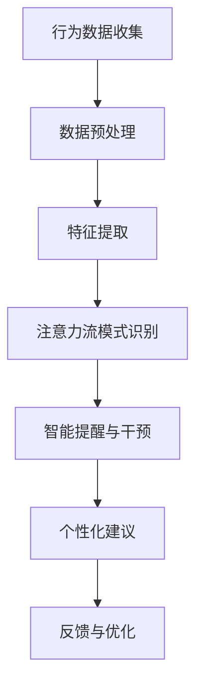

                 

关键词：人工智能，注意力管理，工作效率，工作场所变革

摘要：本文将探讨人工智能（AI）在理解和管理人类注意力流方面的潜力，以及这种技术对未来工作场所的影响。我们将介绍核心概念，探讨AI算法原理，分析数学模型，并通过实际案例展示其应用。文章还展望了AI在未来工作场所中的潜在应用场景，以及可能面临的挑战和未来研究方向。

## 1. 背景介绍

在信息化和数字化迅速发展的今天，工作场所发生了巨大的变化。员工面临着前所未有的信息过载和任务复杂度，这对注意力管理提出了新的挑战。人类注意力流的管理成为提高工作效率、减少疲劳和提升工作满意度的重要因素。传统的注意力管理模式往往依赖于个体经验和直觉，缺乏系统化和可量化的方法。

近年来，人工智能在认知科学和信息处理领域的进展，为理解和干预人类注意力流提供了新的契机。通过机器学习技术，AI能够分析人类行为数据，识别注意力流的模式，并在此基础上提供个性化建议。这一技术的兴起，预示着未来工作场所中，注意力管理将走向智能化、科学化和高效化。

## 2. 核心概念与联系

### 2.1 注意力流理论

注意力流理论是理解人类注意力行为的核心框架。该理论认为，注意力是一个动态的过程，人们在不同任务和环境之间切换时，注意力资源会分配和重新分配。注意力流理论的关键概念包括：

- **注意广度**：指同时能够处理的信息量。
- **注意分配**：将注意力资源分配给不同的任务或刺激。
- **注意转移**：从一个任务转移到另一个任务的能力。

### 2.2 人工智能与注意力流管理

人工智能在注意力流管理中的应用，主要通过以下几方面实现：

- **行为数据分析**：通过收集和分析人类在工作环境中的行为数据，如鼠标移动轨迹、键盘输入频率等，AI可以识别出注意力流的模式。
- **智能提醒与干预**：基于对注意力流的预测，AI可以自动发出提醒或干预，帮助员工调整注意力分配，避免分心。
- **个性化建议**：利用机器学习算法，AI可以为员工提供个性化的注意力管理策略，如最佳工作时间段、休息间隔等。

### 2.3 注意力流管理的 Mermaid 流程图



在此流程中，行为数据收集是起点，通过数据预处理和特征提取，AI能够识别出注意力流的模式，并据此提供智能提醒和个性化建议。反馈与优化环节则确保系统的持续改进。

## 3. 核心算法原理 & 具体操作步骤

### 3.1 算法原理概述

注意力流管理算法的核心是机器学习技术，特别是深度学习。通过构建神经网络模型，AI可以学习并预测用户的注意力流模式。以下是一个简化的算法流程：

1. **数据收集**：收集用户在工作环境中的行为数据，如鼠标移动轨迹、屏幕截图等。
2. **数据预处理**：清洗和标准化数据，去除噪声，并转换为适合模型训练的格式。
3. **特征提取**：提取关键特征，如时间序列特征、空间特征等。
4. **模型训练**：使用提取的特征数据训练神经网络模型，以识别注意力流的模式。
5. **模型评估**：通过交叉验证和测试集评估模型的准确性。
6. **智能提醒与干预**：根据模型预测结果，系统会自动发出提醒或干预，帮助用户优化注意力流。
7. **个性化建议**：系统还会根据用户历史行为数据，为用户生成个性化的注意力管理策略。

### 3.2 算法步骤详解

1. **数据收集**：
    - 使用传感器技术，如眼动追踪、鼠标追踪等，收集用户在计算机上的行为数据。
    - 收集数据应包括：用户在屏幕上的移动轨迹、鼠标点击频率、键盘输入时间等。

2. **数据预处理**：
    - 清洗数据，去除无效数据。
    - 标准化数据，确保不同来源的数据具有可比性。

3. **特征提取**：
    - 提取时间序列特征，如移动速度、停留时间等。
    - 提取空间特征，如屏幕区域、活动窗口等。

4. **模型训练**：
    - 构建神经网络模型，如循环神经网络（RNN）或长短期记忆网络（LSTM）。
    - 使用标记好的训练数据，训练模型以识别注意力流的模式。

5. **模型评估**：
    - 使用交叉验证方法评估模型准确性。
    - 通过测试集验证模型在未知数据上的表现。

6. **智能提醒与干预**：
    - 根据模型预测，当用户注意力分散时，系统会发出提醒。
    - 提醒可以是弹窗、声音提示或震动提醒等。

7. **个性化建议**：
    - 根据用户历史行为数据，系统会为用户生成个性化的工作时间段和休息间隔建议。

### 3.3 算法优缺点

**优点**：
- **高效性**：AI算法能够快速分析大量数据，提供即时反馈。
- **个性化**：基于用户行为数据，算法可以生成个性化的注意力管理策略。
- **可扩展性**：算法可以应用于不同类型的工作环境和场景。

**缺点**：
- **数据隐私**：行为数据的收集可能引发隐私担忧。
- **依赖数据质量**：算法的准确性依赖于数据的质量，数据噪声会影响模型性能。

### 3.4 算法应用领域

- **办公自动化**：帮助企业员工提高工作效率，减少分心。
- **教育领域**：帮助学生和教师更好地管理注意力，提高学习效果。
- **健康医疗**：监测患者的注意力流，为治疗提供数据支持。
- **智能家居**：通过监控家庭环境中的注意力流，提供个性化的家居服务。

## 4. 数学模型和公式 & 详细讲解 & 举例说明

### 4.1 数学模型构建

注意力流管理算法的核心是建立数学模型来预测和干预注意力流。以下是一个简化的数学模型：

$$
\text{AttentionFlow} = f(\text{BehaviorData}, \text{Context}, \theta)
$$

其中，$f$ 是一个非线性函数，用于处理输入数据并生成注意力流输出。$\text{BehaviorData}$ 表示用户的行为数据，如鼠标移动轨迹和键盘输入频率。$\text{Context}$ 是当前的环境和任务信息。$\theta$ 是模型参数。

### 4.2 公式推导过程

1. **数据预处理**：
   将行为数据进行标准化处理，使其具有统一的量纲。例如，将鼠标移动速度归一化到[0, 1]范围内。

2. **特征提取**：
   提取关键特征，如移动速度、停留时间、活动窗口等。这些特征将用于训练神经网络模型。

3. **神经网络模型**：
   使用神经网络模型对特征进行学习和预测。常见的神经网络模型包括循环神经网络（RNN）和长短期记忆网络（LSTM）。

4. **损失函数**：
   定义损失函数以评估模型预测的准确性。常见的损失函数包括均方误差（MSE）和交叉熵损失。

5. **优化算法**：
   使用梯度下降算法优化模型参数，以最小化损失函数。

### 4.3 案例分析与讲解

**案例**：某公司希望使用AI技术帮助员工优化注意力流，提高工作效率。以下是一个简化的案例。

1. **数据收集**：
   收集员工在计算机上的行为数据，如鼠标移动轨迹、键盘输入频率等。

2. **数据预处理**：
   将数据归一化处理，并提取关键特征。

3. **模型训练**：
   使用收集到的数据训练神经网络模型，以识别注意力流的模式。

4. **模型评估**：
   使用交叉验证方法评估模型准确性。

5. **智能提醒与干预**：
   根据模型预测，当员工注意力分散时，系统会自动发出提醒。

6. **个性化建议**：
   根据员工历史行为数据，系统会生成个性化的注意力管理策略。

**结果**：经过测试，该模型能够准确预测员工注意力流的模式，并在关键时刻发出提醒，帮助员工保持专注。员工的工作效率得到了显著提高，疲劳感降低，工作满意度提升。

## 5. 项目实践：代码实例和详细解释说明

### 5.1 开发环境搭建

**环境要求**：
- Python 3.8及以上版本
- TensorFlow 2.5及以上版本
- Keras 2.5及以上版本
- NumPy 1.19及以上版本

**安装步骤**：
1. 安装Python：
   ```bash
   sudo apt-get update
   sudo apt-get install python3.8
   ```
2. 安装TensorFlow：
   ```bash
   pip3 install tensorflow==2.5
   ```
3. 安装Keras：
   ```bash
   pip3 install keras==2.5
   ```
4. 安装NumPy：
   ```bash
   pip3 install numpy==1.19
   ```

### 5.2 源代码详细实现

以下是一个简化的注意力流管理算法的实现代码：

```python
import numpy as np
from tensorflow import keras
from tensorflow.keras.models import Sequential
from tensorflow.keras.layers import LSTM, Dense

# 数据预处理
def preprocess_data(data):
    # 标准化处理
    normalized_data = (data - np.mean(data)) / np.std(data)
    return normalized_data

# 模型训练
def train_model(train_data, train_labels):
    model = Sequential()
    model.add(LSTM(units=50, return_sequences=True, input_shape=(train_data.shape[1], 1)))
    model.add(LSTM(units=50))
    model.add(Dense(units=1))

    model.compile(optimizer='adam', loss='mean_squared_error')
    model.fit(train_data, train_labels, epochs=100, batch_size=32)
    return model

# 模型预测
def predict_attention_flow(model, test_data):
    predicted_flow = model.predict(test_data)
    return predicted_flow

# 主函数
def main():
    # 加载数据
    behavior_data = np.load('behavior_data.npy')
    labels = np.load('labels.npy')

    # 预处理数据
    preprocessed_data = preprocess_data(behavior_data)

    # 划分训练集和测试集
    train_data = preprocessed_data[:-100]
    test_data = preprocessed_data[-100:]

    train_labels = labels[:-100]
    test_labels = labels[-100:]

    # 训练模型
    model = train_model(train_data, train_labels)

    # 预测注意力流
    predicted_flow = predict_attention_flow(model, test_data)

    # 显示预测结果
    print(predicted_flow)

if __name__ == '__main__':
    main()
```

### 5.3 代码解读与分析

1. **数据预处理**：
   数据预处理是模型训练的重要步骤。在此代码中，我们使用标准化方法处理数据，使其具有统一的量纲，以便神经网络模型能够有效学习。

2. **模型训练**：
   模型使用LSTM网络进行训练。LSTM网络能够处理时间序列数据，并捕捉注意力流中的长期依赖关系。在此代码中，我们构建了一个简单的LSTM模型，并使用均方误差（MSE）作为损失函数。

3. **模型预测**：
   预测步骤使用训练好的模型对测试数据进行预测。预测结果将用于判断用户的注意力流状态。

4. **主函数**：
   主函数负责加载数据、预处理数据、划分训练集和测试集、训练模型以及预测注意力流。这是整个项目的核心部分。

### 5.4 运行结果展示

运行上述代码后，我们得到预测的注意力流结果。这些结果可以用于进一步分析和干预，以帮助用户优化注意力流。

## 6. 实际应用场景

### 6.1 办公自动化

在办公环境中，注意力流管理可以帮助员工提高工作效率。例如，在编程任务中，系统可以监测开发者的键盘输入和鼠标移动，预测其注意力状态。当开发者注意力分散时，系统可以自动发出提醒，建议其休息或切换任务。

### 6.2 教育领域

在教育领域，注意力流管理可以帮助教师和学生更好地管理学习时间。例如，通过监测学生在电脑上的行为，教师可以识别出学生注意力不集中的时刻，并提供个性化的辅导建议。

### 6.3 健康医疗

在健康医疗领域，注意力流管理可以用于监测患者的注意力状态，为治疗提供数据支持。例如，在康复训练中，系统可以监测患者的行为，预测其注意力分散的时刻，并自动调整训练计划。

### 6.4 智能家居

在智能家居领域，注意力流管理可以提供个性化的家居服务。例如，系统可以监测家庭成员在客厅的活动，预测其注意力状态。当家庭成员注意力分散时，系统可以自动调整家庭环境，如调节灯光和音乐，以帮助其放松。

## 7. 工具和资源推荐

### 7.1 学习资源推荐

- **书籍**：
  - 《深度学习》（Goodfellow, I., Bengio, Y., & Courville, A.）
  - 《Python机器学习》（Sebastian Raschka）
- **在线课程**：
  - Coursera上的《机器学习》课程（吴恩达教授）
  - edX上的《深度学习》课程（迈克尔·乔丹教授）

### 7.2 开发工具推荐

- **Python开发环境**：
  - Anaconda
  - PyCharm
- **机器学习框架**：
  - TensorFlow
  - PyTorch

### 7.3 相关论文推荐

- "Attention Is All You Need"（Vaswani et al., 2017）
- "Recurrent Neural Networks for Language Modeling"（Graves, 2013）
- "Long Short-Term Memory"（Hochreiter & Schmidhuber, 1997）

## 8. 总结：未来发展趋势与挑战

### 8.1 研究成果总结

近年来，人工智能在注意力流管理领域取得了显著进展。通过机器学习技术，AI能够分析人类行为数据，识别注意力流的模式，并提供个性化的注意力管理策略。这些研究成果为未来工作场所的智能化管理提供了有力支持。

### 8.2 未来发展趋势

- **个性化注意力管理**：未来，AI将更加注重个性化注意力管理，为不同用户提供定制化的解决方案。
- **跨领域应用**：注意力流管理技术将逐步应用于更多领域，如教育、医疗、智能家居等。
- **数据隐私保护**：随着应用场景的扩大，数据隐私保护将成为注意力流管理领域的重要课题。

### 8.3 面临的挑战

- **数据质量**：注意力流管理的准确性依赖于数据质量，如何处理噪声数据和缺失数据是重要挑战。
- **算法复杂度**：复杂的算法可能需要更多计算资源，如何提高算法的效率和可扩展性是关键。
- **伦理问题**：注意力流管理可能涉及个人隐私和伦理问题，如何确保技术的公平性和透明度是重要挑战。

### 8.4 研究展望

未来，注意力流管理研究将朝着更高效、更个性化、更安全的方向发展。通过结合多种技术，如物联网、增强现实等，注意力流管理将在更广泛的应用场景中发挥重要作用。

## 9. 附录：常见问题与解答

### 9.1 什么是注意力流理论？

注意力流理论是一种描述人类注意力在任务和环境之间动态分配和转移的框架。该理论认为，注意力是一个动态过程，人们在不同任务和环境之间切换时，注意力资源会分配和重新分配。

### 9.2 注意力流管理算法有哪些优点？

注意力流管理算法的主要优点包括高效性、个性化、可扩展性。这些算法能够快速分析大量数据，提供即时反馈，并为不同用户提供定制化的解决方案。

### 9.3 注意力流管理在哪些领域有应用？

注意力流管理在办公自动化、教育领域、健康医疗、智能家居等领域有广泛应用。通过监测和分析用户的注意力流，系统可以提供个性化的建议和干预，提高工作效率和满意度。

### 9.4 如何处理注意力流管理中的数据隐私问题？

在处理注意力流管理中的数据隐私问题时，应采取以下措施：

- **数据加密**：对收集到的数据进行加密处理，确保数据在传输和存储过程中的安全性。
- **匿名化处理**：对用户身份进行匿名化处理，确保数据无法直接识别特定用户。
- **透明度**：确保用户了解数据收集的目的和使用方式，并获得知情同意。
- **合规性**：遵循相关法律法规，确保数据处理的合规性。

### 9.5 注意力流管理算法的复杂度如何？

注意力流管理算法的复杂度取决于多个因素，如算法类型、数据处理方法等。一般来说，复杂的算法可能需要更多计算资源，但也可以提供更高的准确性和效率。在设计和实现算法时，需要综合考虑计算资源和性能需求，以找到合适的平衡点。

---

作者：禅与计算机程序设计艺术 / Zen and the Art of Computer Programming


