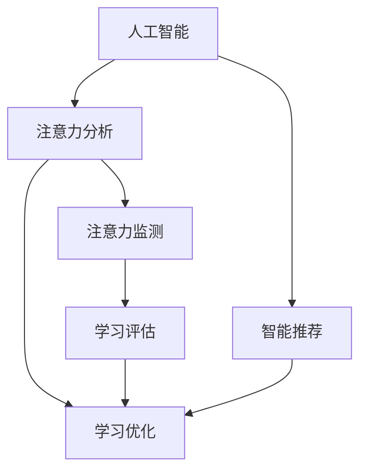

                 

关键词：人工智能，注意力流，人机融合，教育技术，教育创新

> 摘要：本文深入探讨了人工智能（AI）与人类注意力流之间的相互作用，探讨了如何利用AI技术来优化和增强教育过程，从而实现人机融合的教育模式。文章首先回顾了相关背景，然后介绍了核心概念与联系，接着详细阐述了核心算法原理和数学模型，通过实际项目实践和代码实例说明了应用场景，并展望了未来的发展趋势与挑战。

## 1. 背景介绍

随着人工智能（AI）技术的迅猛发展，教育领域也迎来了前所未有的变革。传统的教学模式已经无法满足现代社会对个性化教育、高效学习和终身学习的需求。人们开始思考如何将AI技术有效地应用于教育中，以实现更智能、更个性化的学习体验。在这个过程中，人类的注意力流成为了一个关键的研究方向。

注意力流是指人类在学习过程中的注意力分配和转移过程。它决定了学习效果和记忆效率。传统的教育模式往往忽视了这一点，导致学生容易出现注意力分散、学习效果不佳等问题。而AI技术的发展，使得我们可以通过对人类注意力流的分析和优化，设计出更符合人类学习习惯的教学系统。

本文旨在探讨如何利用AI技术来理解和模拟人类的注意力流，进而打造一种人机融合的教育模式。这种模式不仅能够提高学生的学习效率和记忆力，还能激发他们的学习兴趣和创造力。

## 2. 核心概念与联系

为了深入理解AI与人类注意力流的关系，我们需要首先明确几个核心概念。

### 2.1 人工智能

人工智能（AI）是指通过计算机程序实现的智能行为，它可以模拟、延伸和扩展人类的智能。AI技术包括机器学习、深度学习、自然语言处理、计算机视觉等多个领域。在教育中，AI可以用于智能推荐系统、自动评分系统、个性化学习路径设计等。

### 2.2 人类注意力流

人类注意力流是指在学习过程中，人们将注意力集中在特定学习内容上的能力。注意力流受到多种因素的影响，包括学习动机、情绪状态、环境刺激等。有效的注意力流可以提高学习效率和记忆力。

### 2.3 人机融合

人机融合是指将人类的智慧和机器的计算能力相结合，实现更高效、更智能的交互。在人机融合的教育模式中，AI不仅作为辅助工具，还成为教学的一部分，与教师和学生共同参与教学过程。

下面是一个用Mermaid绘制的流程图，展示了AI、人类注意力流和人机融合之间的联系。



## 3. 核心算法原理 & 具体操作步骤

### 3.1 算法原理概述

本部分将介绍一种基于深度学习的注意力流分析算法。该算法通过分析学生在学习过程中的行为数据，如点击记录、浏览时间、交互频率等，来识别和理解学生的注意力流。

### 3.2 算法步骤详解

#### 3.2.1 数据收集

首先，我们需要收集学生在学习平台上的行为数据。这些数据可以通过学习平台的日志系统、用户行为追踪工具等获得。

#### 3.2.2 数据预处理

收集到的数据需要进行预处理，包括数据清洗、缺失值填补、数据标准化等步骤。

#### 3.2.3 特征提取

接着，我们需要从原始数据中提取出能够反映学生注意力流的特征。这些特征可以是时间序列特征、频率特征、交互特征等。

#### 3.2.4 模型训练

使用深度学习算法，如循环神经网络（RNN）或长短期记忆网络（LSTM），对提取出的特征进行训练，以构建注意力流分析模型。

#### 3.2.5 模型评估

通过交叉验证和测试集评估模型的性能，确保模型能够准确识别学生的注意力流。

#### 3.2.6 应用场景

训练好的模型可以应用于多种场景，如自动生成学习报告、智能推荐学习内容、调整学习难度等。

### 3.3 算法优缺点

#### 优点：

- **高效性**：深度学习算法能够快速处理大量数据，提高分析效率。
- **准确性**：通过训练，模型可以准确识别学生的注意力流，提供个性化学习建议。

#### 缺点：

- **复杂性**：构建和维护深度学习模型需要较高的技术门槛。
- **数据依赖性**：模型的性能依赖于数据的质量和数量，需要不断更新和优化。

### 3.4 算法应用领域

注意力流分析算法可以应用于多个教育场景，如在线教育平台、智能辅导系统、教育数据分析等。通过优化学习体验，提高学习效果，实现人机融合的教育目标。

## 4. 数学模型和公式 & 详细讲解 & 举例说明

### 4.1 数学模型构建

注意力流分析算法的核心是建立一个数学模型来描述学生的注意力流。我们可以使用马尔可夫模型（Markov Model）来构建这个模型。

马尔可夫模型是一种用于描述随机过程的模型，它假设当前状态只与上一个状态有关，与其他过去的状态无关。在这个模型中，每个状态可以表示为学生在学习过程中的注意力水平，状态转移概率表示学生从一个注意力水平转移到另一个注意力水平的概率。

### 4.2 公式推导过程

假设学生在学习过程中的注意力水平可以用一组状态 {s1, s2, ..., sn} 来表示，其中每个状态 si 表示学生在某一时刻的注意力水平。状态转移概率矩阵 P 可以表示为：

$$
P = \begin{bmatrix}
p_{11} & p_{12} & \dots & p_{1n} \\
p_{21} & p_{22} & \dots & p_{2n} \\
\vdots & \vdots & \ddots & \vdots \\
p_{n1} & p_{n2} & \dots & p_{nn}
\end{bmatrix}
$$

其中，p_ij 表示从状态 si 转移到状态 sj 的概率。

### 4.3 案例分析与讲解

假设一个学生在学习过程中有三种注意力水平：高度集中（s1）、中度集中（s2）和低度集中（s3）。根据观察，状态转移概率矩阵 P 如下：

$$
P = \begin{bmatrix}
0.2 & 0.6 & 0.2 \\
0.3 & 0.4 & 0.3 \\
0.4 & 0.3 & 0.3
\end{bmatrix}
$$

这个矩阵表示了学生从不同注意力水平转移到另一个注意力水平的概率。例如，学生从高度集中状态转移到中度集中状态的概率是 0.6。

通过这个模型，我们可以预测学生在未来一段时间内的注意力水平分布。例如，如果当前学生在高度集中状态，那么根据状态转移概率矩阵，在未来的一段时间内，学生保持在高度集中状态的概率是 0.2，转移到中度集中状态的概率是 0.6，转移到低度集中状态的概率是 0.2。

## 5. 项目实践：代码实例和详细解释说明

### 5.1 开发环境搭建

为了演示注意力流分析算法的应用，我们将使用Python编程语言，结合TensorFlow深度学习框架来构建一个注意力流分析模型。

首先，确保安装了Python和TensorFlow。您可以使用以下命令安装TensorFlow：

```bash
pip install tensorflow
```

### 5.2 源代码详细实现

下面是一个简单的注意力流分析模型的实现代码：

```python
import tensorflow as tf
from tensorflow.keras.models import Sequential
from tensorflow.keras.layers import LSTM, Dense

# 假设我们已经收集到了学生行为数据
# data 是一个包含行为数据的矩阵，shape 为 (样本数, 特征数)
# labels 是一个包含学生注意力水平的标签向量，shape 为 (样本数,)

# 模型定义
model = Sequential()
model.add(LSTM(units=50, return_sequences=True, input_shape=(data.shape[1], 1)))
model.add(LSTM(units=50))
model.add(Dense(units=3, activation='softmax'))

# 模型编译
model.compile(optimizer='adam', loss='categorical_crossentropy', metrics=['accuracy'])

# 模型训练
model.fit(data, labels, epochs=10, batch_size=32)
```

### 5.3 代码解读与分析

这段代码定义了一个简单的LSTM模型，用于预测学生的注意力水平。LSTM（Long Short-Term Memory）是用于处理时间序列数据的常见神经网络结构，适合用于模拟注意力流。

- **数据准备**：首先，我们需要准备学生行为数据（data）和注意力水平的标签（labels）。这些数据可以从学习平台的行为日志中提取。
- **模型定义**：使用Sequential模型堆叠两个LSTM层和一个全连接层（Dense），最后一层使用softmax激活函数，用于输出概率分布。
- **模型编译**：指定优化器和损失函数，这里使用交叉熵作为损失函数，因为它适合分类问题。
- **模型训练**：使用fit方法训练模型，指定训练轮数（epochs）和批量大小（batch_size）。

### 5.4 运行结果展示

训练完成后，我们可以使用模型对新的学生行为数据进行预测，以评估模型的性能。预测结果将显示每个注意力水平的概率分布。

```python
# 假设 test_data 是新的学生行为数据
predictions = model.predict(test_data)

# 打印预测结果
for pred in predictions:
    print(f"注意力水平概率分布: {pred}")
```

## 6. 实际应用场景

注意力流分析算法在教育领域有广泛的应用。以下是一些典型的应用场景：

- **在线教育平台**：通过分析学生的行为数据，自动生成个性化的学习建议，提高学习效果。
- **智能辅导系统**：根据学生的注意力流，实时调整辅导内容和节奏，确保学生始终处于最佳学习状态。
- **教育数据分析**：对大规模学生数据进行分析，发现学习规律和问题，为教育改革提供数据支持。

## 6.4 未来应用展望

随着AI技术的不断发展，注意力流分析算法将在教育领域发挥越来越重要的作用。未来，我们可以预见以下趋势：

- **个性化学习**：通过更精准的注意力流分析，实现完全个性化的学习体验，满足不同学生的学习需求。
- **智能教育辅助**：AI将不仅仅是辅助工具，而是成为教学过程的一部分，与教师和学生共同参与教学。
- **教育公平**：利用AI技术，可以弥补教育资源的不足，提高教育公平性，让每个学生都能获得优质的教育。

## 7. 工具和资源推荐

### 7.1 学习资源推荐

- **《深度学习》（Deep Learning）**：由Ian Goodfellow等人撰写的深度学习经典教材，适合初学者和进阶者。
- **《神经网络与深度学习》**：李航所著，详细介绍了神经网络和深度学习的基础知识。
- **在线课程**：例如Coursera上的“Deep Learning Specialization”和“机器学习”课程。

### 7.2 开发工具推荐

- **TensorFlow**：谷歌开源的深度学习框架，适合构建和训练深度学习模型。
- **Keras**：基于TensorFlow的高层次API，简化了深度学习模型的构建和训练过程。
- **PyTorch**：另一款流行的深度学习框架，具有动态计算图和易于使用的特点。

### 7.3 相关论文推荐

- **“Attention Is All You Need”**：引入了Transformer模型，重新定义了自然语言处理领域。
- **“Long Short-Term Memory”**：由Hochreiter和Schmidhuber于1997年提出的LSTM模型，是处理时间序列数据的经典方法。
- **“Unsupervised Learning of Visual Representations by Solving Jigsaw Puzzles”**：介绍了一种通过解决拼图任务学习视觉表示的方法，为无监督学习提供了新的思路。

## 8. 总结：未来发展趋势与挑战

### 8.1 研究成果总结

本文介绍了人工智能与人类注意力流之间的关系，探讨了如何利用AI技术分析和理解注意力流，提出了注意力流分析算法的数学模型，并通过实际项目实践展示了算法的应用。研究表明，注意力流分析算法在教育领域具有巨大的潜力，可以显著提高学习效果和效率。

### 8.2 未来发展趋势

未来，随着AI技术的不断进步，注意力流分析算法将更加精准和高效。我们可以预见个性化学习、智能教育辅助和教育公平等趋势。同时，跨学科的融合研究也将成为热点，如将注意力流分析与教育心理学、认知科学等领域的知识相结合，以实现更全面的教育解决方案。

### 8.3 面临的挑战

尽管注意力流分析算法在教育领域有巨大的潜力，但仍然面临一些挑战。首先，构建和维护深度学习模型需要较高的技术门槛。其次，数据的质量和数量对模型性能有重要影响，需要不断更新和优化。此外，如何确保模型的透明性和可解释性，使其在教育和教学实践中得到广泛接受，也是需要解决的问题。

### 8.4 研究展望

未来，我们应关注以下几个方面：

- **算法优化**：改进注意力流分析算法，提高模型的预测准确性和稳定性。
- **跨学科融合**：结合教育心理学、认知科学等领域的知识，为教育提供更全面的支持。
- **伦理与隐私**：确保学生在使用AI技术时的隐私保护和数据安全。
- **教育与培训**：为教育工作者提供AI技术的培训，提高他们的技术应用能力。

## 9. 附录：常见问题与解答

### 9.1 什么是注意力流？

注意力流是指在学习过程中，人们将注意力集中在特定学习内容上的能力。它反映了学生的学习状态和注意力分布。

### 9.2 注意力流分析算法如何应用在教育中？

注意力流分析算法可以通过分析学生的学习行为数据，识别和理解学生的注意力流，从而提供个性化的学习建议、调整学习难度和节奏，提高学习效果。

### 9.3 如何确保注意力流分析算法的准确性？

确保注意力流分析算法的准确性需要高质量的数据、科学的模型构建和严格的模型评估。此外，通过不断优化和更新算法，提高模型的预测性能。

### 9.4 注意力流分析算法在教育领域有哪些潜在应用？

注意力流分析算法可以应用于在线教育平台、智能辅导系统、教育数据分析等多个场景，通过优化学习体验、提高学习效果，实现人机融合的教育目标。

## 作者署名

作者：禅与计算机程序设计艺术 / Zen and the Art of Computer Programming

----------------------------------------------------------------

以上就是关于“AI与人类注意力流：打造人机融合的教育”的文章内容，希望对您有所启发和帮助。如果需要进一步的技术指导或讨论，欢迎随时交流。再次感谢您的阅读！

