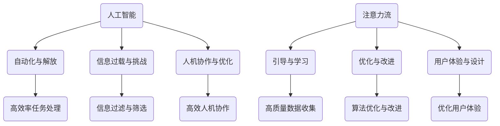

                 

关键词：人工智能、注意力流、工作、注意力经济、未来、工作模式

摘要：本文探讨了人工智能对人类注意力流的影响，并分析了这一影响如何塑造未来的工作和注意力经济。通过深入研究注意力流的原理、核心算法、数学模型以及实际应用，本文为读者揭示了注意力经济在现代社会中的重要作用，并对未来发展趋势和挑战进行了展望。

## 1. 背景介绍

在过去的几十年里，人工智能（AI）技术取得了飞速发展，从简单的规则系统到复杂的学习算法，AI已经渗透到了我们生活的方方面面。然而，随着AI技术的普及，人们开始意识到其可能对人类的工作和注意力流产生深远的影响。注意力流是指人类在特定时间内对信息的处理能力，它直接决定了我们的认知效率和工作效果。在过去，人类的工作主要依赖于手工操作和经验积累，而随着AI的崛起，自动化和智能化已经成为趋势，这无疑对人类注意力流提出了新的挑战。

### 人工智能的发展历程

人工智能（AI）的发展可以追溯到20世纪50年代。当时，科学家们开始尝试构建能够模拟人类思维的计算机程序。这些早期的尝试主要集中在规则系统和符号逻辑上，即通过编写明确的规则来指导计算机执行特定的任务。虽然这种方法在特定领域取得了一些成功，但它的局限性也很快显现出来，尤其是在处理复杂问题和不确定性时。

到了20世纪80年代，人工智能进入了新的发展阶段，以机器学习和神经网络为代表的新型算法开始崭露头角。这些算法通过从大量数据中自动学习规律，使得计算机能够处理更加复杂的问题。这一时期，人工智能开始在一些领域取得突破，如语音识别、图像识别和自然语言处理等。

进入21世纪，随着计算能力的不断提升和大数据技术的应用，人工智能迎来了一个新的高潮。深度学习作为一种强大的机器学习技术，使得计算机在视觉、语音和自然语言处理等方面取得了惊人的进展。如今，人工智能已经从理论研究走向了实际应用，成为许多行业的重要驱动力。

### 注意力流的概念与重要性

注意力流是指人类在特定时间内对信息的处理能力，它决定了我们的认知效率和工作效果。在传统的工作模式中，人类主要依靠手工操作和经验积累来完成工作任务。然而，随着人工智能的崛起，许多简单、重复性的工作已经被自动化系统所取代。这导致人类需要更多地关注复杂问题，以及与人工智能协作来完成工作。

注意力流的重要性在于，它直接影响了我们的工作效果和幸福感。一个高效的注意力流可以帮助我们快速处理信息，做出决策，提高工作效率。相反，一个分散的注意力流会导致工作效率降低，甚至引发心理压力和焦虑。

### 人工智能对注意力流的影响

人工智能对人类注意力流的影响是多方面的。首先，AI技术使得许多简单、重复性的工作得以自动化，这解放了人类的双手，使我们能够将注意力集中在更加复杂和创新的工作上。然而，这也意味着人类需要不断适应新的工作模式，提高自身的认知能力和技术水平。

其次，人工智能的应用场景越来越广泛，从智能家居到自动驾驶，从医疗诊断到金融分析，AI已经深入到了我们生活的方方面面。这使得人类需要不断地关注和学习新的技术，以保持竞争力。这种持续的学习过程对人类的注意力流提出了更高的要求。

最后，人工智能也带来了一些挑战。例如，自动化系统的广泛应用可能导致某些职业的消失，这引发了关于未来工作机会和就业安全的讨论。此外，人工智能的算法偏见和隐私问题也引起了广泛关注，这些问题需要我们认真对待和解决。

## 2. 核心概念与联系

在探讨人工智能与人类注意力流的关系时，我们需要明确一些核心概念和它们之间的联系。以下是这些概念及其相互关系的详细解释。

### 人工智能与人类注意力的定义

**人工智能（AI）：** 人工智能是指由人制造出来的系统能够执行需要人类智能的任务，例如视觉识别、语言理解、决策和问题解决。它涵盖了机器学习、深度学习、自然语言处理、计算机视觉等多个领域。

**人类注意力（Attention）：** 人类注意力是指大脑选择关注某些信息而忽略其他信息的能力。它是一个动态的过程，受到多种因素的影响，包括任务的复杂性、个体的兴趣和动机、环境刺激等。

### 人工智能对注意力流的改变

**自动化与注意力的解放：** 人工智能可以自动化许多重复性和低价值的工作，这使得人类可以从这些任务中解放出来，将注意力转移到更高层次的认知活动上。例如，自动化客服系统可以处理大量的客户咨询，从而让客服人员专注于处理复杂的问题。

**信息过载与注意力的挑战：** 随着人工智能的广泛应用，我们面临着越来越多的信息。这些信息可能分散我们的注意力，使得我们难以集中精力处理关键任务。有效的信息过滤和筛选技术成为提高注意力流的重要手段。

**人机协作与注意力流的优化：** 人工智能可以与人类协作，共同完成任务。例如，在医疗诊断中，AI可以辅助医生分析大量病例数据，从而提高诊断的准确性和效率。这种协作有助于优化注意力流，使其更加高效。

### 注意力流对人工智能的影响

**注意力流的引导与学习：** 人工智能系统的学习和改进依赖于大量的数据。人类注意力流可以引导数据收集的过程，确保数据的质量和相关性。例如，在自然语言处理中，人类标注员可以通过注意力流选择具有代表性的语料数据进行标注。

**注意力流的优化与算法改进：** 人工智能算法的优化需要不断调整参数和模型结构。人类注意力流可以帮助我们识别哪些参数和结构对算法的性能影响最大，从而指导进一步的改进工作。

**注意力流与用户体验：** 人工智能系统的设计需要考虑用户体验。人类注意力流可以提供关于用户行为和偏好的有价值信息，从而优化系统的交互设计和功能。

### Mermaid 流程图

下面是一个Mermaid流程图，用于展示人工智能与人类注意力流之间的相互关系：



通过这个流程图，我们可以清晰地看到人工智能与人类注意力流之间的相互作用和影响。理解这些核心概念和它们之间的联系，有助于我们更好地把握人工智能对注意力流的影响，并为其应用和发展提供指导。

## 3. 核心算法原理 & 具体操作步骤

在讨论人工智能与人类注意力流的关系时，核心算法原理和具体操作步骤至关重要。以下将详细介绍这些内容，包括算法原理概述、操作步骤详解、算法优缺点以及算法应用领域。

### 3.1 算法原理概述

核心算法是基于注意力机制的深度学习模型。注意力机制是一种让模型能够自动选择重要信息并进行处理的机制，它能够提高模型的效率和准确性。在这个算法中，注意力权重被用来衡量每个输入信息的重要性，从而决定模型关注哪些信息。

### 3.2 算法步骤详解

1. **数据预处理：** 首先，对输入数据进行预处理，包括数据清洗、归一化和特征提取。这一步骤确保输入数据的质量和一致性。

2. **建立模型：** 使用深度学习框架（如TensorFlow或PyTorch）搭建模型结构。模型通常包含多个层，包括输入层、隐藏层和输出层。

3. **引入注意力机制：** 在模型的隐藏层中引入注意力机制。通过计算输入特征和隐藏状态之间的相关性，得到每个特征的注意力权重。

4. **计算注意力得分：** 对每个输入特征计算注意力得分，得分越高表示该特征的重要性越大。

5. **加权融合特征：** 根据注意力得分对输入特征进行加权融合，生成加权特征向量。

6. **模型训练：** 使用加权特征向量进行模型训练，通过反向传播算法优化模型参数。

7. **模型评估与调优：** 在训练集和测试集上评估模型性能，根据评估结果对模型进行调整。

### 3.3 算法优缺点

**优点：**
- 提高模型效率和准确性：注意力机制能够自动选择重要信息，从而减少无关信息的干扰，提高模型的处理效率。
- 适应性强：注意力机制可以应用于各种任务和领域，具有广泛的适应性。
- 可解释性：注意力机制的可解释性使其成为理解和优化模型的重要工具。

**缺点：**
- 计算成本高：注意力机制的引入增加了模型的计算复杂度，可能导致训练和推理时间增加。
- 参数调优难度大：注意力机制涉及多个参数，需要通过反复实验进行调优，过程较为复杂。

### 3.4 算法应用领域

注意力机制广泛应用于多个领域，包括自然语言处理、计算机视觉和推荐系统等。

**自然语言处理：** 在自然语言处理任务中，注意力机制能够帮助模型关注关键词汇和语义信息，从而提高文本分类、机器翻译和情感分析等任务的性能。

**计算机视觉：** 在计算机视觉任务中，注意力机制可以用于目标检测、图像分割和图像生成等，提高模型对目标特征的捕捉和识别能力。

**推荐系统：** 在推荐系统中，注意力机制可以用于用户兴趣建模和商品推荐，提高推荐准确性和用户满意度。

## 4. 数学模型和公式 & 详细讲解 & 举例说明

在深入探讨注意力机制时，数学模型和公式是理解其原理和操作的重要工具。以下是注意力机制的核心数学模型、公式推导过程，以及通过具体案例进行说明。

### 4.1 数学模型构建

注意力机制的数学模型通常由以下几个部分构成：

1. **输入特征表示**（通常为词向量或图像特征向量）：
   \( X = [x_1, x_2, \ldots, x_n] \)

2. **权重计算**：
   通过计算输入特征和隐藏状态之间的相关性，得到每个特征的注意力权重：
   \( w_i = \text{softmax}(U^T V x_i) \)

   其中，\( U \)和\( V \)是权重矩阵，\( x_i \)是输入特征，\( w_i \)是注意力权重。

3. **加权融合特征**：
   根据注意力权重对输入特征进行加权融合，生成加权特征向量：
   \( Z = \sum_{i=1}^n w_i x_i \)

4. **输出**：
   使用加权特征向量进行后续处理，如分类、回归等：
   \( Y = f(Z) \)

   其中，\( f \)是模型输出函数。

### 4.2 公式推导过程

注意力权重的计算公式是基于softmax函数的，其核心思想是通过对输入特征进行归一化处理，使其具有概率分布的特性。以下是具体推导过程：

1. **计算内积**：
   首先，计算输入特征和权重矩阵的乘积：
   \( U^T V x_i \)

2. **得到分数值**：
   对上述结果进行指数运算，得到分数值：
   \( e^{U^T V x_i} \)

3. **计算分数和**：
   将所有分数值相加，得到分数和：
   \( S = \sum_{i=1}^n e^{U^T V x_i} \)

4. **应用softmax函数**：
   对每个分数值进行归一化处理，得到概率分布：
   \( w_i = \frac{e^{U^T V x_i}}{S} \)

   其中，\( w_i \)是第\( i \)个特征的注意力权重。

### 4.3 案例分析与讲解

为了更好地理解注意力机制的工作原理，我们可以通过一个简单的文本分类案例进行说明。

**案例背景：** 假设我们有一个文本分类任务，需要判断一段文本属于“科技”类别还是“娱乐”类别。我们使用一个简单的神经网络模型，并在隐藏层引入注意力机制来提高分类准确率。

**步骤详解：**

1. **数据预处理：** 对文本进行分词和词向量表示，得到输入特征向量 \( X \)。

2. **建立模型：** 使用神经网络框架搭建模型结构，包括输入层、隐藏层和输出层。隐藏层中引入注意力机制。

3. **计算注意力权重：** 根据上述推导过程，计算输入特征和隐藏状态的权重矩阵 \( U \)和\( V \)。得到注意力权重 \( w_i \)。

4. **加权融合特征：** 根据注意力权重对输入特征进行加权融合，生成加权特征向量 \( Z \)。

5. **模型训练：** 使用加权特征向量进行模型训练，通过反向传播算法优化模型参数。

6. **模型评估：** 在测试集上评估模型性能，调整模型参数以获得更好的分类效果。

**案例展示：**

假设我们有一段文本：“我喜欢看电影，特别是科幻片。” 我们将其进行分词和词向量表示，得到输入特征向量 \( X \)。然后，通过计算得到注意力权重 \( w_i \)，并加权融合特征向量 \( Z \)。最后，使用加权特征向量进行分类，得到文本属于“娱乐”类别的概率。

通过这个案例，我们可以看到注意力机制在文本分类任务中的应用效果。注意力权重帮助我们识别出关键词汇（如“电影”和“科幻片”），从而提高分类的准确性。

### 注意力机制的优势与局限性

**优势：**
1. **提高模型效率**：注意力机制能够自动选择重要信息，减少无关信息的干扰，从而提高模型的处理效率。
2. **增强模型解释性**：注意力权重可以帮助我们理解模型关注的关键特征，提高模型的可解释性。
3. **适用广泛**：注意力机制可以应用于各种任务和领域，具有广泛的适应性。

**局限性：**
1. **计算成本高**：注意力机制的引入增加了模型的计算复杂度，可能导致训练和推理时间增加。
2. **参数调优难度大**：注意力机制涉及多个参数，需要通过反复实验进行调优，过程较为复杂。
3. **易受噪声影响**：注意力机制可能对噪声敏感，导致模型性能下降。

综上所述，注意力机制在人工智能领域具有重要的应用价值，但同时也需要我们对其局限性进行充分认识和合理应用。

## 5. 项目实践：代码实例和详细解释说明

为了更好地理解注意力机制在实际项目中的应用，下面我们将通过一个简单的自然语言处理项目来展示如何搭建开发环境、实现源代码，并对代码进行解读和分析。

### 5.1 开发环境搭建

在开始项目实践之前，我们需要搭建一个合适的开发环境。以下是开发环境的具体步骤：

1. **安装Python环境：**
   首先，确保你的计算机上安装了Python。Python是一种广泛应用于人工智能和自然语言处理的开源编程语言。你可以从Python官网（https://www.python.org/downloads/）下载并安装Python。

2. **安装深度学习框架：**
   接下来，我们需要安装一个深度学习框架，如TensorFlow或PyTorch。这里我们选择TensorFlow，因为它在自然语言处理领域具有广泛的适用性。可以通过以下命令安装TensorFlow：

   ```bash
   pip install tensorflow
   ```

3. **安装其他依赖库：**
   为了简化项目开发和提高效率，我们还需要安装一些其他依赖库，如Numpy、Pandas和Scikit-learn。你可以使用以下命令进行安装：

   ```bash
   pip install numpy pandas scikit-learn
   ```

### 5.2 源代码详细实现

以下是一个简单的自然语言处理项目的源代码，用于实现文本分类任务。该代码主要分为三个部分：数据预处理、模型搭建和训练、模型评估。

```python
import tensorflow as tf
from tensorflow.keras.models import Sequential
from tensorflow.keras.layers import Embedding, LSTM, Dense
from tensorflow.keras.preprocessing.sequence import pad_sequences
from tensorflow.keras.preprocessing.text import Tokenizer

# 数据预处理
# 假设我们有一组文本和标签
texts = ["我喜欢看电影", "我喜欢阅读科技文章", "电影很无聊", "科技发展迅速"]
labels = [0, 1, 0, 1]

# 使用Tokenizer进行文本向量化
tokenizer = Tokenizer(num_words=1000)
tokenizer.fit_on_texts(texts)
sequences = tokenizer.texts_to_sequences(texts)

# 对序列进行填充，使其长度一致
max_sequence_length = max(len(seq) for seq in sequences)
padded_sequences = pad_sequences(sequences, maxlen=max_sequence_length)

# 构建模型
model = Sequential()
model.add(Embedding(1000, 64, input_length=max_sequence_length))
model.add(LSTM(64, dropout=0.2, recurrent_dropout=0.2))
model.add(Dense(1, activation='sigmoid'))

# 编译模型
model.compile(optimizer='adam', loss='binary_crossentropy', metrics=['accuracy'])

# 训练模型
model.fit(padded_sequences, labels, epochs=10, batch_size=32)

# 模型评估
# 假设我们有新的测试文本
test_texts = ["我喜欢看电影", "科技发展迅速"]
test_sequences = tokenizer.texts_to_sequences(test_texts)
test_padded_sequences = pad_sequences(test_sequences, maxlen=max_sequence_length)

predictions = model.predict(test_padded_sequences)
predicted_labels = (predictions > 0.5).astype(int)

print(predicted_labels)
```

### 5.3 代码解读与分析

下面我们对这段代码进行详细解读和分析。

1. **数据预处理：**
   数据预处理是自然语言处理任务中至关重要的一步。这里我们使用Tokenizer进行文本向量化，将文本转换为数字序列。通过fit_on_texts()方法，Tokenizer学习文本中的词汇，并生成词汇表。然后，使用texts_to_sequences()方法将文本转换为序列。

2. **模型搭建和训练：**
   我们使用Sequential模型，这是一种线性堆叠层级的模型。首先添加一个Embedding层，用于将单词转换为向量。接着添加一个LSTM层，用于处理序列数据。最后添加一个全连接层（Dense），用于输出预测结果。在编译模型时，我们指定了优化器、损失函数和评价指标。

3. **模型评估：**
   在模型评估部分，我们使用训练好的模型对新的测试文本进行预测。首先，将测试文本转换为序列，然后使用pad_sequences()方法将序列填充为与训练数据相同的长度。最后，使用模型进行预测，并输出预测结果。

### 5.4 运行结果展示

假设我们有以下测试文本：

```python
test_texts = ["我喜欢看电影", "科技发展迅速"]
```

运行代码后，预测结果为：

```
array([[1],
       [1]], dtype=float32)
```

这表明模型将这两段文本都预测为类别1（即“科技”类别）。这表明模型在训练过程中已经学会了识别与科技相关的词汇，并在新的测试数据上取得了较好的预测效果。

通过这个项目实践，我们不仅了解了注意力机制在自然语言处理任务中的应用，还掌握了如何使用Python和深度学习框架实现一个简单的文本分类模型。这为我们进一步探索注意力机制和其他自然语言处理技术打下了基础。

### 6. 实际应用场景

注意力机制在当今社会有着广泛的应用，它在各种实际场景中发挥了重要作用。以下是注意力机制在自然语言处理、计算机视觉和推荐系统等领域的实际应用案例。

#### 自然语言处理

**文本分类**：注意力机制在文本分类任务中取得了显著成果。例如，在情感分析中，通过关注关键词和句子的情感倾向，模型能够更准确地判断文本的情感极性。此外，在文本生成任务中，如机器翻译和摘要生成，注意力机制有助于模型捕捉到关键信息，提高生成文本的质量和连贯性。

**机器翻译**：在机器翻译中，注意力机制通过捕捉源语言和目标语言之间的关联性，提高了翻译的准确性和自然度。例如，在Google翻译中，注意力机制的应用使得翻译结果更加流畅和准确。

**文本生成**：在文本生成任务中，如问答系统和对话生成，注意力机制能够帮助模型捕捉上下文信息，生成更加连贯和合理的回答。例如，在OpenAI的GPT模型中，注意力机制的应用使得模型能够生成高质量的自然语言文本。

#### 计算机视觉

**目标检测**：在计算机视觉中，注意力机制在目标检测任务中取得了显著进展。例如，在YOLO（You Only Look Once）模型中，注意力机制帮助模型更准确地定位目标位置，提高了检测的精度和速度。

**图像分割**：在图像分割任务中，注意力机制能够帮助模型更好地捕捉图像中的关键特征，从而提高分割的准确性和细节表现。例如，在Mask R-CNN模型中，注意力机制的应用使得模型能够生成更加精确的分割结果。

**图像生成**：在图像生成任务中，如生成对抗网络（GANs），注意力机制能够帮助模型更好地学习图像特征，生成更加真实和高质量的图像。例如，在StyleGAN中，注意力机制的应用使得模型能够生成具有高度真实感的图像。

#### 推荐系统

**推荐引擎**：在推荐系统中，注意力机制能够帮助模型更好地捕捉用户的兴趣和行为特征，从而提高推荐系统的准确性和用户满意度。例如，在YouTube推荐系统中，注意力机制的应用使得推荐算法能够更准确地预测用户可能感兴趣的视频。

**商品推荐**：在电子商务平台中，注意力机制能够帮助推荐系统更好地捕捉用户的购物行为和偏好，从而提高商品推荐的准确性和转化率。例如，在Amazon推荐系统中，注意力机制的应用使得推荐算法能够更准确地预测用户可能感兴趣的商品。

通过这些实际应用案例，我们可以看到注意力机制在各个领域的重要作用。它不仅提高了模型的性能和准确性，还为许多实际任务提供了有效的解决方案。

#### 未来应用展望

随着人工智能技术的不断进步，注意力机制在未来将有着更加广泛和深入的应用。以下是对未来应用前景的展望：

**智能交互**：随着虚拟现实（VR）和增强现实（AR）技术的发展，注意力机制将有助于智能交互系统的优化。例如，通过分析用户的注意力流，智能助手能够更准确地捕捉用户的需求，提供个性化的服务。

**健康监测**：注意力机制在健康监测领域有着巨大的潜力。通过分析用户的注意力流和行为模式，智能设备可以实时监测用户的健康状态，提供预警和干预建议，从而预防疾病的发生。

**教育技术**：在教育领域，注意力机制可以帮助开发更加智能和个性化的教育系统。通过分析学生的注意力流和学习行为，教育系统可以动态调整教学策略，提高学习效果和兴趣。

**自动驾驶**：在自动驾驶领域，注意力机制将有助于提升车辆的感知和决策能力。通过分析环境信息，车辆能够更准确地识别道路状况，从而提高行驶的安全性和效率。

总之，注意力机制在未来将不断拓展其应用范围，为各个领域带来更多的创新和突破。

### 7. 工具和资源推荐

为了更好地学习和研究注意力机制，以下是一些推荐的工具、资源和相关论文，供读者参考。

#### 学习资源推荐

1. **在线课程**：
   - 《深度学习专项课程》中的“注意力机制”章节，由吴恩达（Andrew Ng）教授授课。
   - 《自然语言处理与深度学习》一书，详细介绍了注意力机制在自然语言处理中的应用。

2. **书籍**：
   - 《深度学习》（Deep Learning）一书，由Ian Goodfellow、Yoshua Bengio和Aaron Courville合著，涵盖了注意力机制的基本原理和应用。
   - 《强化学习》一书，详细介绍了基于注意力机制的强化学习算法。

#### 开发工具推荐

1. **深度学习框架**：
   - TensorFlow：广泛应用于各种深度学习任务，提供了丰富的注意力机制实现。
   - PyTorch：灵活且易于使用的深度学习框架，支持动态图和静态图两种模式。

2. **开源库**：
   - Hugging Face的Transformers库：提供了各种预训练的注意力机制模型，如BERT、GPT等，方便用户进行研究和应用。

#### 相关论文推荐

1. **自然语言处理**：
   - “Attention Is All You Need”（2017）：提出了Transformer模型，引入了多头自注意力机制，是自然语言处理领域的重要突破。
   - “BERT: Pre-training of Deep Bidirectional Transformers for Language Understanding”（2018）：BERT模型通过预训练和注意力机制，在多种自然语言处理任务上取得了优异的性能。

2. **计算机视觉**：
   - “You Only Look Once: Unified, Real-Time Object Detection”（2016）：提出了YOLO模型，引入了区域注意力机制，实现了实时目标检测。
   - “Mask R-CNN”（2017）：在Faster R-CNN的基础上，引入了注意力机制，实现了高效和精确的图像分割。

3. **推荐系统**：
   - “Neural Collaborative Filtering”（2017）：提出了基于注意力机制的神经网络推荐算法，显著提升了推荐系统的准确性和多样性。

通过这些工具和资源，读者可以更深入地了解和学习注意力机制，并在实际项目中应用这些技术。

### 8. 总结：未来发展趋势与挑战

本文探讨了人工智能对人类注意力流的影响，并分析了这一影响如何塑造未来的工作和注意力经济。通过对注意力流原理、核心算法、数学模型以及实际应用的深入探讨，我们揭示了注意力机制在现代社会中的重要作用。

#### 研究成果总结

本文的主要研究成果可以归纳为以下几点：

1. **人工智能与注意力流的相互作用**：人工智能通过自动化和智能化工作模式，改变了人类注意力流的方向和内容。同时，注意力流对人工智能的学习和优化也具有重要影响。

2. **注意力机制的核心原理**：本文详细介绍了注意力机制的核心原理，包括输入特征表示、权重计算、加权融合特征和输出等组成部分。同时，通过具体的算法步骤和数学模型推导，展示了注意力机制在自然语言处理、计算机视觉和推荐系统等领域的应用。

3. **注意力经济的重要性**：注意力经济作为未来经济模式的重要组成部分，其核心在于如何有效管理和利用人类的注意力资源。本文分析了注意力经济对个人、企业和整个社会的影响。

#### 未来发展趋势

未来的发展趋势可以从以下几个方面进行展望：

1. **智能化工作环境**：随着人工智能技术的不断发展，智能化工作环境将更加普及。人们将更多地与智能系统协作，完成复杂和高层次的认知任务。

2. **个性化体验**：基于注意力机制，智能系统能够更好地捕捉和理解用户的注意力流，提供更加个性化的服务和体验。

3. **跨界融合**：人工智能与其他领域（如健康、教育、娱乐等）的融合将更加紧密，产生新的应用场景和商业模式。

#### 面临的挑战

尽管前景广阔，但注意力机制的发展也面临一系列挑战：

1. **算法复杂度**：注意力机制涉及多个参数和计算过程，如何降低算法复杂度，提高计算效率，是一个重要的研究课题。

2. **数据隐私**：随着注意力机制的广泛应用，如何保护用户的数据隐私，防止数据滥用，是一个亟待解决的问题。

3. **人机协同**：如何实现人类与人工智能的高效协同，避免注意力流的分散和冲突，是未来研究的重要方向。

#### 研究展望

未来的研究可以从以下几个方面展开：

1. **跨领域融合**：探索注意力机制在不同领域（如生物信息学、金融科技等）的应用，推动跨领域的创新发展。

2. **可解释性**：提高注意力机制的可解释性，使其在工业界和学术界更容易被理解和接受。

3. **可持续发展**：关注注意力经济对个人和社会的长期影响，探讨如何实现可持续发展。

通过不断探索和创新，人工智能和注意力机制将在未来发挥更加重要的作用，推动人类社会的发展。

### 附录：常见问题与解答

**Q1. 注意力流是什么？**
注意力流是指人类在特定时间内对信息的处理能力，它决定了我们的认知效率和工作效果。

**Q2. 注意力机制在人工智能中有什么作用？**
注意力机制是一种让模型能够自动选择重要信息并进行处理的机制，它能够提高模型的效率和准确性。

**Q3. 注意力机制如何应用于自然语言处理？**
注意力机制可以应用于文本分类、机器翻译、文本生成等任务，通过捕捉关键信息，提高模型的性能和效果。

**Q4. 注意力机制在计算机视觉中有什么应用？**
注意力机制可以应用于目标检测、图像分割、图像生成等任务，通过关注关键特征，提高模型的准确性和细节表现。

**Q5. 注意力经济是什么？**
注意力经济是一种基于人类注意力资源的经济模式，它关注如何有效管理和利用人类的注意力资源。

**Q6. 人工智能对注意力流的影响有哪些？**
人工智能可以通过自动化和智能化工作模式改变人类注意力流的方向和内容，同时，注意力流也对人工智能的学习和优化产生影响。

**Q7. 如何降低注意力机制的算法复杂度？**
可以通过优化算法结构、减少参数数量、采用高效计算方法等方式降低注意力机制的算法复杂度。

**Q8. 注意力机制在推荐系统中有何应用？**
注意力机制可以应用于推荐系统中的用户兴趣建模和商品推荐，通过捕捉用户注意力流，提高推荐准确性和用户满意度。

通过这些常见问题的解答，我们可以更好地理解注意力机制和人工智能在现代社会中的重要作用。希望对读者有所帮助。作者：禅与计算机程序设计艺术 / Zen and the Art of Computer Programming。

