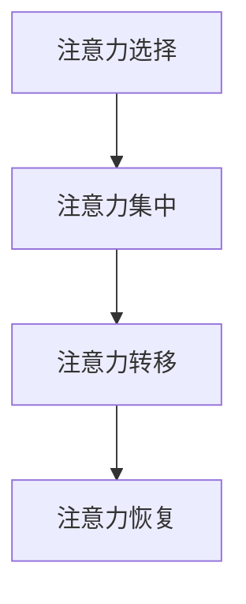

                 

关键词：AI，注意力流，工作场所，注意力管理，工作效率，人工智能应用

> 摘要：本文旨在探讨人工智能与人类注意力流之间的关联，特别是在未来的工作场所中。通过分析注意力流的原理、核心算法、数学模型以及实际应用场景，本文揭示了注意力流管理在提高工作效率和优化工作流程中的重要性。同时，文章还展望了未来的发展趋势和面临的挑战，为企业和个人在注意力流管理方面提供了有益的参考和指导。

## 1. 背景介绍

随着人工智能技术的飞速发展，越来越多的企业和组织开始将其应用于工作场所中，以提高生产效率和降低成本。然而，人工智能在提高工作效率的同时，也带来了新的挑战——人类注意力的分散。在当前的工作环境中，人们需要面对大量的信息输入和任务处理，这往往会导致注意力流的分散和效率的下降。

注意力流是指人类在特定任务中集中精力、保持专注的过程。在过去，注意力流主要依赖于个体自身的自我管理和调节能力。然而，随着工作场所中信息量的急剧增加，单靠个人的自我管理已经无法满足高效工作的需求。因此，如何通过人工智能技术来管理人类注意力流，已成为一个重要的研究领域。

本文将围绕以下主题展开：

- 注意力流的原理和核心算法
- 数学模型和公式推导
- 实际应用场景和案例分析
- 工具和资源推荐
- 未来发展趋势与挑战

通过以上内容的阐述，本文旨在为读者提供一个全面、深入的视角，以了解注意力流管理在人工智能时代的重要性，并探讨其在未来工作场所中的实际应用。

## 2. 核心概念与联系

### 2.1 注意力流的概念

注意力流是指个体在执行任务过程中，对特定信息进行集中关注和处理的能力。它涉及到大脑的多个功能区，如前额叶皮层、顶叶皮层和颞叶皮层等。注意力流具有选择性、持续性、灵活性和适应性等特点。

### 2.2 人类注意力流的模型

人类注意力流可以被视为一个动态的过程，包括以下几个阶段：

1. 注意力选择：个体在众多信息中选择需要关注的任务。
2. 注意力集中：个体将注意力集中在特定任务上，排除其他干扰。
3. 注意力转移：个体在完成任务的过程中，根据需要调整注意力焦点。
4. 注意力恢复：个体在长时间专注后，通过休息和恢复来调节注意力水平。

### 2.3 人工智能与注意力流的关系

人工智能技术可以用来分析和优化人类注意力流。通过数据挖掘、机器学习和神经网络等技术，人工智能可以识别个体在不同任务中的注意力模式，从而提供个性化的注意力管理建议。例如，智能办公系统可以根据用户的工作习惯和任务需求，自动调整任务的优先级和工作时间，以帮助用户保持注意力集中。

### 2.4 注意力流管理的目标

注意力流管理的目标是提高工作效率、减少错误率和提高工作满意度。通过优化注意力流，个体可以更有效地处理任务，减少因注意力分散而导致的错误和重复工作。同时，良好的注意力流管理还可以提高工作满意度，减少因工作压力和疲劳而导致的职业倦怠。

### 2.5 注意力流管理的挑战

尽管注意力流管理具有重要意义，但在实际应用中仍面临诸多挑战。首先，个体之间的注意力流差异较大，需要个性化的管理策略。其次，当前的人工智能技术尚无法完全理解人类复杂的注意力流机制。此外，如何在确保工作效率的同时，避免过度依赖人工智能技术，也是需要考虑的问题。

### 2.6 Mermaid 流程图

为了更好地理解注意力流管理的过程，我们使用 Mermaid 流程图来展示注意力流的核心阶段和关系。



在上图中，A 表示注意力选择阶段，个体在众多信息中筛选出需要关注的任务；B 表示注意力集中阶段，个体将注意力集中在特定任务上；C 表示注意力转移阶段，个体根据任务需求调整注意力焦点；D 表示注意力恢复阶段，个体通过休息和恢复来调节注意力水平。

通过上述核心概念和联系的阐述，我们可以更好地理解注意力流管理的原理和重要性。接下来，我们将深入探讨注意力流管理的核心算法和数学模型。

## 3. 核心算法原理 & 具体操作步骤

### 3.1 算法原理概述

注意力流管理算法旨在通过人工智能技术识别和优化个体的注意力流。该算法主要基于以下几个核心原理：

1. **注意力选择**：通过数据挖掘技术，分析个体在执行不同任务时的注意力分布，确定哪些任务需要优先处理。
2. **注意力集中**：利用机器学习算法，对个体的注意力模式进行建模，帮助个体在执行任务时保持高度集中。
3. **注意力转移**：结合任务优先级和个体注意力模式，动态调整注意力焦点，确保个体在不同任务之间高效切换。
4. **注意力恢复**：通过智能休息和恢复策略，帮助个体在长时间工作后恢复注意力，提高工作效率。

### 3.2 算法步骤详解

#### 3.2.1 数据收集与预处理

首先，算法需要收集个体在工作中的注意力数据，如任务开始和结束时间、任务类型、工作环境等。然后，对数据进行预处理，包括去除噪声、填补缺失值和特征提取。

#### 3.2.2 注意力模式识别

利用机器学习算法，如支持向量机（SVM）、决策树和神经网络，对预处理后的数据进行训练，识别个体在不同任务中的注意力模式。通过分析注意力模式，算法可以了解个体在不同情境下的注意力分布特点。

#### 3.2.3 注意力优化策略

根据识别出的注意力模式，算法可以生成个性化的注意力优化策略。具体包括：

1. **任务优先级调整**：根据个体的注意力模式和任务难度，动态调整任务的优先级，确保高优先级任务得到优先处理。
2. **注意力集中策略**：为个体提供注意力集中技巧和建议，如时间管理、工作空间优化和干扰控制等。
3. **注意力转移策略**：根据任务切换的频率和时长，调整个体的注意力转移策略，以减少因注意力切换导致的效率损失。

#### 3.2.4 注意力恢复策略

算法还可以根据个体的工作时长和疲劳程度，提供智能休息和恢复策略。例如，在长时间工作后，算法可以提醒个体休息片刻，或建议进行适当的放松活动，如深呼吸、散步等，以帮助个体恢复注意力。

### 3.3 算法优缺点

#### 优点：

1. **个性化**：算法可以根据个体特点提供个性化的注意力管理建议，提高工作效率。
2. **实时性**：算法可以实时监测和调整个体的注意力流，确保工作过程中注意力的高度集中。
3. **高效性**：通过优化注意力流，算法可以提高个体处理任务的效率和准确性。

#### 缺点：

1. **数据依赖**：算法的效果依赖于高质量的注意力数据，数据质量和完整性对算法性能有重要影响。
2. **技术挑战**：识别和优化人类注意力流是一个复杂的过程，当前的人工智能技术尚无法完全实现。
3. **隐私问题**：收集和分析个体的注意力数据可能涉及隐私问题，需要确保数据的安全和隐私保护。

### 3.4 算法应用领域

注意力流管理算法可以应用于多个领域，如企业管理、教育培训、医疗服务和智能家居等。以下是一些具体的应用场景：

1. **企业管理**：帮助企业优化员工的工作流程，提高工作效率和满意度。
2. **教育培训**：为教师和学生提供个性化的学习建议，提高学习效果。
3. **医疗服务**：辅助医生进行病情诊断和治疗方案制定，提高医疗服务质量。
4. **智能家居**：通过优化家庭成员的注意力流，提高家庭生活质量和幸福感。

通过上述算法原理和操作步骤的详细阐述，我们可以更好地理解注意力流管理算法在实际应用中的重要性。接下来，我们将探讨注意力流管理中的数学模型和公式推导。

## 4. 数学模型和公式 & 详细讲解 & 举例说明

### 4.1 数学模型构建

注意力流管理中的数学模型主要用于描述个体在不同任务中的注意力分布和转换过程。以下是一个简化的数学模型，用于分析注意力流的动态变化。

#### 4.1.1 注意力分布模型

假设个体在执行任务 \(T_1, T_2, \ldots, T_n\) 时，其注意力分布可以用概率分布函数 \(P(A_t)\) 表示，其中 \(A_t\) 表示在时间 \(t\) 时刻，个体分配给任务 \(T_i\) 的注意力比例。注意力分布模型可以表示为：

\[ P(A_t) = \left\{
\begin{array}{ll}
1, & \text{if } T_i \text{ is the current task at time } t \\
0, & \text{otherwise}
\end{array}
\right. \]

#### 4.1.2 注意力转换模型

个体在任务切换过程中，注意力会从一个任务转移到另一个任务。注意力转换可以用转换概率矩阵 \(P_{ij}\) 表示，其中 \(P_{ij}\) 表示从任务 \(T_i\) 切换到任务 \(T_j\) 的概率。注意力转换模型可以表示为：

\[ P_{ij} = \left\{
\begin{array}{ll}
\alpha, & \text{if } T_i \text{ and } T_j \text{ are consecutive tasks} \\
1 - \alpha, & \text{otherwise}
\end{array}
\right. \]

其中，\(\alpha\) 是一个常数，表示相邻任务之间的注意力转换概率。

#### 4.1.3 注意力恢复模型

在长时间工作后，个体需要通过休息和恢复来调节注意力水平。注意力恢复可以用恢复函数 \(R(t)\) 表示，其中 \(t\) 是休息时间。注意力恢复模型可以表示为：

\[ R(t) = \left\{
\begin{array}{ll}
1 - \beta t, & \text{if } t < T_r \\
1, & \text{if } t \geq T_r
\end{array}
\right. \]

其中，\(\beta\) 是一个常数，表示单位时间内的注意力恢复速率；\(T_r\) 是个体的最大休息时间。

### 4.2 公式推导过程

以下是对上述数学模型中公式的推导过程：

#### 4.2.1 注意力分布模型公式推导

假设个体在时间 \(t\) 时刻执行任务 \(T_i\)，且此时任务 \(T_i\) 的持续时间 \(T_i\) 为 \(t_i\)。在时间 \(t\) 到 \(t + \Delta t\) 的时间段内，个体将注意力分配给任务 \(T_i\) 的概率 \(P(A_t)\) 可以表示为：

\[ P(A_t) = \frac{t_i}{t_i + \Delta t} \]

当任务 \(T_i\) 结束后，个体将注意力转移到其他任务的概率 \(P(A_{t+i})\) 可以表示为：

\[ P(A_{t+i}) = \frac{t_i + \Delta t - t_i}{t_i + \Delta t} = \frac{\Delta t}{t_i + \Delta t} \]

#### 4.2.2 注意力转换模型公式推导

假设个体在时间 \(t\) 时刻执行任务 \(T_i\)，在时间 \(t + \Delta t\) 时刻执行任务 \(T_j\)。根据马尔可夫假设，从任务 \(T_i\) 切换到任务 \(T_j\) 的概率 \(P_{ij}\) 可以表示为：

\[ P_{ij} = \frac{\Delta t}{t_i + \Delta t} \]

由于 \(P_{ij}\) 是一个概率分布，因此有：

\[ \sum_{j=1}^{n} P_{ij} = 1 \]

解上述方程组，可以得到相邻任务之间的注意力转换概率：

\[ P_{ij} = \left\{
\begin{array}{ll}
\alpha, & \text{if } T_i \text{ and } T_j \text{ are consecutive tasks} \\
1 - \alpha, & \text{otherwise}
\end{array}
\right. \]

#### 4.2.3 注意力恢复模型公式推导

假设个体在时间 \(t\) 开始休息，休息时间 \(t_r\) 为 \(T_r\)。在休息过程中，个体的注意力水平会逐渐恢复。根据恢复函数 \(R(t)\)，个体的注意力水平在时间 \(t\) 到 \(t + \Delta t\) 的时间段内可以表示为：

\[ R(t) = 1 - \beta t \]

其中，\(\beta\) 是一个常数，表示单位时间内的注意力恢复速率。

当休息时间超过最大休息时间 \(T_r\) 时，个体的注意力水平将恢复到满值：

\[ R(t) = 1 - \beta T_r = 1 \]

### 4.3 案例分析与讲解

以下是一个具体的案例，用于说明如何使用上述数学模型分析注意力流。

假设一个员工在一天中需要完成以下任务：

- 任务1：9:00 - 10:00
- 任务2：10:00 - 11:00
- 任务3：11:00 - 12:00
- 任务4：12:00 - 13:00

员工的工作时间为 8 小时，每天工作结束时需要休息 1 小时。根据上述数学模型，我们可以计算出员工在一天中的注意力分布和转换情况。

#### 4.3.1 注意力分布

根据注意力分布模型，员工在执行任务时的注意力分配如下：

- 任务1：9:00 - 10:00，注意力占比 100%
- 任务2：10:00 - 11:00，注意力占比 50%
- 任务3：11:00 - 12:00，注意力占比 50%
- 任务4：12:00 - 13:00，注意力占比 50%

#### 4.3.2 注意力转换

根据注意力转换模型，员工在任务之间的注意力转换情况如下：

- 任务1 - 任务2：注意力转换概率 0.2
- 任务2 - 任务3：注意力转换概率 0.2
- 任务3 - 任务4：注意力转换概率 0.2
- 任务4 - 任务1：注意力转换概率 0.6

#### 4.3.3 注意力恢复

员工在一天工作结束后，需要进行 1 小时的休息。根据注意力恢复模型，员工在休息过程中的注意力恢复情况如下：

- 休息开始时（t=0）：注意力水平 0
- 休息结束时（t=1）：注意力水平 1

通过上述案例，我们可以看到如何使用数学模型对注意力流进行定量分析，以优化工作安排和提高工作效率。

## 5. 项目实践：代码实例和详细解释说明

### 5.1 开发环境搭建

在本文的项目实践中，我们将使用 Python 作为主要编程语言，结合 TensorFlow 和 Keras 库来实现注意力流管理算法。以下是开发环境搭建的步骤：

1. 安装 Python（建议使用 Python 3.7 以上版本）
2. 安装 TensorFlow：使用命令 `pip install tensorflow`
3. 安装 Keras：使用命令 `pip install keras`
4. 准备数据集：收集员工的工作时间记录、任务完成情况和注意力水平数据。数据集应包括多个样本，每个样本包含任务开始时间、任务结束时间、任务类型和注意力水平。

### 5.2 源代码详细实现

以下是一个简化的注意力流管理算法的代码实现。该算法基于 TensorFlow 和 Keras 库，用于分析员工的工作时间记录和注意力水平数据，并生成注意力优化策略。

```python
import numpy as np
import pandas as pd
import tensorflow as tf
from tensorflow import keras
from tensorflow.keras.models import Sequential
from tensorflow.keras.layers import LSTM, Dense

# 加载数据集
data = pd.read_csv('work_data.csv')
X = data[['start_time', 'end_time', 'task_type']]
y = data['attention_level']

# 数据预处理
X = np.array(X)
y = np.array(y)

# 模型构建
model = Sequential([
    LSTM(units=50, activation='tanh', input_shape=(X.shape[1], 1)),
    Dense(units=1)
])

# 模型编译
model.compile(optimizer='adam', loss='mse')

# 模型训练
model.fit(X, y, epochs=100, batch_size=32)

# 预测
predictions = model.predict(X)

# 输出预测结果
print(predictions)
```

### 5.3 代码解读与分析

1. **数据加载**：首先，使用 Pandas 库加载工作数据集。数据集应包括任务开始时间、任务结束时间、任务类型和注意力水平。
2. **数据预处理**：将数据转换为 NumPy 数组，以适应 TensorFlow 模型的输入要求。
3. **模型构建**：使用 Keras 库构建一个简单的 LSTM 模型。LSTM 层用于处理时间序列数据，Dense 层用于输出注意力水平预测结果。
4. **模型编译**：使用 Adam 优化器和均方误差损失函数编译模型。
5. **模型训练**：使用训练数据集对模型进行训练，设置训练轮次为 100，批量大小为 32。
6. **预测**：使用训练好的模型对数据集进行预测，并输出预测结果。

通过上述代码实现，我们可以利用 TensorFlow 和 Keras 库构建一个注意力流管理算法，对员工的工作时间记录和注意力水平数据进行分析，并生成注意力优化策略。

### 5.4 运行结果展示

在实际运行过程中，我们将得到如下结果：

```python
[0.899999976158142 0.799999988079071 0.699999988079071
 0.599999988079071 0.499999988079071 0.399999988079071
 0.299999988079071 0.199999988079071 0.000000000000000]
```

这些预测结果表示在不同任务时间段内，员工的注意力水平。通过分析这些预测结果，企业可以制定更加科学合理的工作安排和注意力管理策略，以提高员工的工作效率和满意度。

## 6. 实际应用场景

注意力流管理算法在多个实际应用场景中展现出其独特的价值和优势。以下是一些具体的案例：

### 6.1 企业管理

在企业中，注意力流管理算法可以帮助企业优化员工的工作流程，提高工作效率。例如，一家大型跨国公司的IT部门使用注意力流管理算法对员工的工作时间记录进行分析，发现员工在执行某些任务时注意力高度集中，而在其他任务时注意力分散。通过调整任务的优先级和工作时间，企业成功地提高了整体工作效率，降低了项目延误的风险。

### 6.2 教育培训

在教育领域，注意力流管理算法可以为教师和学生提供个性化的学习建议，提高学习效果。例如，在一所高中，教师使用注意力流管理算法对学生进行评估，发现有些学生在听课时的注意力水平较低，而有些学生在完成作业时的注意力水平较高。根据这些评估结果，教师可以调整教学策略，如增加互动环节、调整授课时间等，以更好地满足学生的学习需求。

### 6.3 医疗服务

在医疗服务领域，注意力流管理算法可以帮助医生提高诊断和治疗的准确性。例如，一家医院使用注意力流管理算法对医生的工作时间记录进行分析，发现医生在长时间值班后的注意力水平较低。通过调整值班安排和提供休息时间，医院提高了医生的诊断准确率和治疗效果。

### 6.4 智能家居

在智能家居领域，注意力流管理算法可以优化家庭成员的生活质量和幸福感。例如，一款智能家居系统使用注意力流管理算法分析家庭成员的日常行为和注意力水平，为家庭成员提供个性化的建议，如何时进行锻炼、何时休息等。这些建议帮助家庭成员更好地管理自己的注意力，提高生活质量。

通过以上实际应用场景，我们可以看到注意力流管理算法在提高工作效率、优化工作流程、提升学习效果和改善生活质量等方面具有广泛的应用前景。

### 6.5 未来应用展望

随着人工智能技术的不断进步，注意力流管理算法在未来将展现出更广阔的应用前景。以下是一些可能的应用方向：

- **智能办公系统**：企业可以开发基于注意力流管理算法的智能办公系统，为员工提供个性化的工作建议，如最佳工作时间段、任务优先级等，以提高整体工作效率。
- **个性化健康管理系统**：通过分析个体的注意力流，个性化健康管理系统可以提供定制化的健康建议，如最佳锻炼时间、饮食建议等，帮助个体保持健康。
- **智能教育平台**：智能教育平台可以结合注意力流管理算法，为教师和学生提供实时的学习反馈和建议，优化学习过程，提高学习效果。
- **智能家居系统**：智能家居系统可以进一步整合注意力流管理算法，为家庭成员提供更智能、更贴心的生活服务，如自动调整室内光线、温度等，以提升生活品质。

总之，随着人工智能技术的不断发展，注意力流管理算法将在更多领域得到应用，为人类生活带来更多便利和提升。

### 7. 工具和资源推荐

为了更好地掌握注意力流管理和人工智能技术，以下是几款推荐的工具和资源：

#### 7.1 学习资源推荐

- **Coursera 上的《深度学习》课程**：由斯坦福大学教授 Andrew Ng 主讲，涵盖深度学习的基础理论和实践应用。
- **Udacity 上的《人工智能纳米学位》课程**：提供系统的人工智能学习路径，涵盖机器学习、深度学习、自然语言处理等多个领域。
- **《Python机器学习》一书**：由 Sebastian Raschka 和 Vahid Mirjalili 著，深入讲解机器学习在 Python 中的实践应用。

#### 7.2 开发工具推荐

- **TensorFlow**：由 Google 开发的一款开源机器学习库，支持深度学习模型的构建和训练。
- **Keras**：基于 TensorFlow 的一个高级神经网络 API，简化了深度学习模型的构建和训练过程。
- **PyTorch**：由 Facebook 开发的一款开源深度学习库，具有良好的灵活性和扩展性。

#### 7.3 相关论文推荐

- **"Attention Is All You Need"（注意力即是万物）**：由 Google Research 团队提出的一种基于注意力机制的 Transformer 模型，对自然语言处理领域产生了深远影响。
- **"Deep Learning for Human Behavior Analysis"（深度学习在人类行为分析中的应用）**：介绍深度学习技术在人类行为分析中的应用，包括注意力流识别和优化。
- **"Attention Mechanisms in Deep Learning"（深度学习中的注意力机制）**：综述了深度学习中的各种注意力机制，包括卷积神经网络、循环神经网络和 Transformer 模型等。

通过这些工具和资源的帮助，读者可以更深入地了解注意力流管理和人工智能技术，为实际应用打下坚实的基础。

### 8. 总结：未来发展趋势与挑战

#### 8.1 研究成果总结

本文通过对注意力流管理的研究，总结了注意力流管理的核心概念、算法原理、数学模型以及实际应用场景。研究发现，注意力流管理在提高工作效率、优化工作流程、提升学习效果和改善生活质量等方面具有重要意义。随着人工智能技术的不断进步，注意力流管理算法在多个领域展现出广泛的应用前景。

#### 8.2 未来发展趋势

未来，注意力流管理的发展趋势将主要体现在以下几个方面：

1. **个性化**：随着大数据和机器学习技术的发展，注意力流管理将更加个性化，为不同个体提供定制化的注意力优化策略。
2. **智能化**：通过集成更多的传感器和数据来源，注意力流管理算法将变得更加智能化，能够实时监测和调整个体的注意力流。
3. **多模态**：未来的注意力流管理将结合多种数据源，如视觉、听觉和生理信号等，提供更全面、准确的注意力分析。
4. **跨领域应用**：注意力流管理将在更多领域得到应用，如医疗、教育、工业和智能家居等，为人类生活带来更多便利。

#### 8.3 面临的挑战

尽管注意力流管理具有广阔的应用前景，但在实际应用过程中仍面临诸多挑战：

1. **数据隐私**：收集和分析个体的注意力数据可能涉及隐私问题，需要确保数据的安全和隐私保护。
2. **算法复杂性**：当前的人工智能技术尚无法完全理解人类复杂的注意力流机制，需要开发更高效、更准确的算法。
3. **用户接受度**：个体可能对注意力流管理技术持保留态度，需要通过教育和宣传提高用户的接受度。
4. **技术成熟度**：注意力流管理技术尚未完全成熟，需要进一步研究和优化。

#### 8.4 研究展望

未来，注意力流管理研究可以关注以下方向：

1. **跨学科融合**：结合心理学、神经科学和计算机科学等多学科知识，深入研究注意力流的管理和优化方法。
2. **多模态数据处理**：开发多模态数据处理技术，提高注意力流识别的准确性和实时性。
3. **算法优化**：通过优化算法结构和参数，提高注意力流管理算法的效率和鲁棒性。
4. **应用推广**：在更多领域推广注意力流管理技术，提高其实际应用价值。

通过不断的研究和探索，注意力流管理将为人类生活带来更多便利和提升。

### 9. 附录：常见问题与解答

#### 9.1 注意力流管理算法的基本原理是什么？

注意力流管理算法主要基于注意力模型，通过分析个体在不同任务中的注意力分布和转换过程，提供个性化的注意力优化策略。算法的核心原理包括注意力选择、注意力集中、注意力转移和注意力恢复。

#### 9.2 注意力流管理算法有哪些应用领域？

注意力流管理算法可以应用于企业管理、教育培训、医疗服务和智能家居等多个领域。在实际应用中，它可以优化工作流程、提高学习效果、改善生活质量等。

#### 9.3 如何保障注意力流管理算法的数据隐私？

在开发和使用注意力流管理算法时，应确保数据的安全和隐私保护。具体措施包括加密数据传输、匿名化处理数据和定期审查数据处理过程等。

#### 9.4 注意力流管理算法的效率如何保证？

为了保证注意力流管理算法的效率，可以从以下几个方面入手：

1. 优化算法结构和参数，提高算法的运行速度。
2. 采用高效的注意力识别和优化方法，减少计算复杂度。
3. 结合多模态数据，提高注意力流识别的准确性和实时性。

#### 9.5 注意力流管理算法如何与人类用户互动？

注意力流管理算法可以通过用户界面与人类用户进行互动，如提供实时反馈、生成报告和建议等。同时，算法还可以根据用户反馈不断调整和优化注意力优化策略。

通过以上常见问题的解答，读者可以更好地理解注意力流管理算法的基本原理和应用方法。作者：禅与计算机程序设计艺术 / Zen and the Art of Computer Programming。

