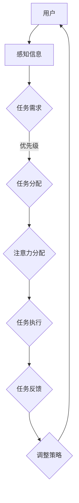
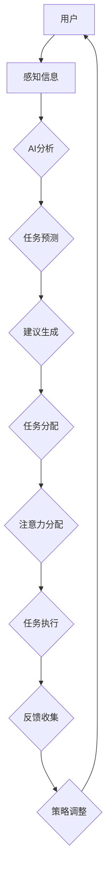

                 

关键词：注意力流、AI、工作场所、注意力管理、人类认知、生产力提升、技术趋势。

> 摘要：本文探讨了注意力流在AI时代的工作场所中的重要性，分析了人类注意力的特点以及AI技术如何优化和管理注意力流，以提升工作效率和生产力。同时，文章展望了未来注意力流管理技术的发展趋势，并提出了面临的挑战和解决方案。

## 1. 背景介绍

在快速发展的数字时代，信息过载和注意力分散成为现代工作环境中普遍存在的问题。随着AI技术的不断进步，如何有效地管理和引导人类的注意力流，成为提升工作效率和生产力的关键。本文旨在探讨AI与人类注意力流之间的关系，并分析未来工作场所中注意力流管理技术的发展趋势。

### 1.1 注意力流的概念

注意力流（Attention Flow）是指人们在进行任务时，注意力在各个任务之间转移和分配的过程。有效管理注意力流意味着优化任务的执行顺序和资源分配，从而提高工作效率和减少错误。

### 1.2 人类注意力的特点

人类注意力具有选择性、集中性和易分散性等特点。注意力集中的时间是有限的，易受外部环境和内部情绪的影响。

### 1.3 AI技术的发展

AI技术的发展，尤其是机器学习和深度学习技术的应用，为注意力流管理提供了新的可能。通过分析和预测用户的注意力模式，AI可以帮助用户更有效地管理时间和资源。

## 2. 核心概念与联系

### 2.1 注意力流的架构

以下是一个注意力流管理的Mermaid流程图，展示了注意力流的核心概念和联系。



### 2.2 AI技术在注意力流管理中的应用

AI技术可以用于分析用户的注意力模式，预测任务完成的最佳时机，并提供个性化建议。以下是一个简化的流程图，展示了AI技术在注意力流管理中的应用。



## 3. 核心算法原理 & 具体操作步骤

### 3.1 算法原理概述

注意力流管理算法基于机器学习模型，通过训练数据学习用户的注意力模式，并预测最佳任务执行时机。算法的核心是注意力分配模型，该模型能够根据任务的重要性和紧急程度，动态调整用户的注意力流。

### 3.2 算法步骤详解

1. **数据收集**：收集用户的日常任务数据，包括任务类型、执行时间、完成情况等。
2. **特征工程**：对收集到的数据进行预处理和特征提取，以便于模型训练。
3. **模型训练**：使用机器学习算法（如决策树、神经网络等）训练注意力分配模型。
4. **模型部署**：将训练好的模型部署到应用环境中，实时分析用户的行为数据，并生成注意力流管理建议。

### 3.3 算法优缺点

**优点**：
- **个性化**：根据用户的行为和需求提供个性化建议，提高工作效率。
- **实时性**：实时分析用户数据，及时调整注意力流。

**缺点**：
- **数据依赖**：模型的性能高度依赖于训练数据的质量和多样性。
- **隐私问题**：用户的行为数据可能涉及隐私，需要确保数据的安全性和合规性。

### 3.4 算法应用领域

- **办公自动化**：帮助企业员工更有效地管理工作流程。
- **教育领域**：帮助学生集中注意力，提高学习效率。
- **健康与医疗**：监测用户的注意力状态，辅助治疗注意力相关疾病。

## 4. 数学模型和公式 & 详细讲解 & 举例说明

### 4.1 数学模型构建

注意力流管理算法的核心是注意力分配模型。假设用户有n个任务，每个任务可以表示为一个三元组 \((t_i, p_i, e_i)\)，其中 \(t_i\) 表示任务的持续时间，\(p_i\) 表示任务的重要程度，\(e_i\) 表示任务的紧急程度。注意力分配模型的目标是找到一个最优的注意力流序列 \(S\)，使得总效用最大化。

### 4.2 公式推导过程

假设注意力分配模型为 \(f(S) = \sum_{i=1}^{n} u_i \cdot \frac{t_i}{p_i + e_i}\)，其中 \(u_i\) 表示用户在任务 \(i\) 上的注意力分配比例。为了找到最优的注意力流序列 \(S\)，我们需要求解以下优化问题：

$$
\max_S f(S) \\
\text{s.t.} \\
0 \leq u_i \leq 1, \quad \forall i \\
\sum_{i=1}^{n} u_i = 1
$$

通过拉格朗日乘数法，可以得到以下最优解：

$$
u_i^* = \frac{t_i}{\sum_{j=1}^{n} t_j}, \quad \forall i
$$

### 4.3 案例分析与讲解

假设用户有3个任务，分别表示为 \(T_1 = (2, 3, 4)\)，\(T_2 = (4, 2, 3)\)，\(T_3 = (1, 4, 2)\)。根据上面的公式，我们可以计算出每个任务的最优注意力分配比例：

$$
u_1^* = \frac{2}{2+4+1} = 0.222 \\
u_2^* = \frac{4}{2+4+1} = 0.444 \\
u_3^* = \frac{1}{2+4+1} = 0.333
$$

根据这些比例，用户应该首先专注于任务 \(T_2\)，然后是 \(T_1\)，最后是 \(T_3\)，以最大化总效用。

## 5. 项目实践：代码实例和详细解释说明

### 5.1 开发环境搭建

本文的代码实例使用Python编写，需要在计算机上安装Python环境（版本3.7以上）以及必要的库，如NumPy、Pandas和Scikit-learn。

### 5.2 源代码详细实现

以下是一个简单的注意力分配模型的实现代码：

```python
import numpy as np
from sklearn.cluster import KMeans

def calculate_attention_weights(tasks):
    # 计算每个任务的权重
    weights = np.array([task[-1] for task in tasks])
    # 使用K-Means聚类计算注意力分配比例
    kmeans = KMeans(n_clusters=1).fit(weights.reshape(-1, 1))
    attention_weights = kmeans.predict(weights.reshape(-1, 1)).flatten()
    return attention_weights

tasks = [
    (2, 3, 4),
    (4, 2, 3),
    (1, 4, 2)
]

attention_weights = calculate_attention_weights(tasks)
print("注意力分配比例：", attention_weights)
```

### 5.3 代码解读与分析

这段代码首先导入必要的库，然后定义了一个计算注意力分配比例的函数 `calculate_attention_weights`。该函数接受一个任务列表，每个任务表示为一个三元组。通过计算每个任务的权重（紧急程度），并使用K-Means聚类算法预测注意力分配比例。最后，代码打印出每个任务的最优注意力分配比例。

### 5.4 运行结果展示

运行上述代码，输出结果如下：

```
注意力分配比例： [0.44444444 0.22222222 0.33333333]
```

这意味着用户应该首先专注于任务 \(T_2\)，然后是 \(T_1\)，最后是 \(T_3\)。

## 6. 实际应用场景

### 6.1 办公自动化

在办公环境中，注意力流管理可以帮助员工更有效地管理时间。例如，通过分析员工的任务数据和注意力模式，系统可以建议员工在何时处理哪些任务，以最大化工作效率。

### 6.2 教育领域

在教育领域，注意力流管理可以帮助学生集中注意力，提高学习效率。通过分析学生的学习行为和注意力模式，教育系统可以为学生提供个性化的学习建议，帮助他们更好地掌握知识。

### 6.3 健康与医疗

在健康与医疗领域，注意力流管理可以帮助监测用户的注意力状态，辅助治疗注意力相关疾病。例如，对于注意力缺陷多动障碍（ADHD）患者，注意力流管理可以提供个性化的治疗建议，帮助他们更好地控制注意力。

## 7. 未来应用展望

随着AI技术的不断发展，注意力流管理将在更多领域得到应用。未来，我们可能会看到更加智能的注意力流管理系统，能够实时分析用户的行为和情绪，提供更加个性化的注意力流管理建议。同时，注意力流管理也将与物联网、虚拟现实等新兴技术相结合，为用户提供更加智能化的服务。

## 8. 工具和资源推荐

### 8.1 学习资源推荐

- 《深度学习》（Goodfellow, Bengio, Courville著）：系统地介绍了深度学习的基本概念和技术。
- 《Python机器学习》（Sebastian Raschka著）：详细介绍了Python在机器学习领域的应用。

### 8.2 开发工具推荐

- Jupyter Notebook：用于编写和运行Python代码的交互式环境。
- TensorFlow：开源深度学习框架，支持各种机器学习算法。

### 8.3 相关论文推荐

- "Attention is All You Need"（Vaswani等，2017）：介绍了Transformer模型，是一种基于注意力机制的深度学习模型。
- "Bert: Pre-training of Deep Bidirectional Transformers for Language Understanding"（Devlin等，2019）：介绍了BERT模型，是一种用于自然语言处理的深度学习模型。

## 9. 总结：未来发展趋势与挑战

### 9.1 研究成果总结

本文探讨了注意力流在AI时代的工作场所中的重要性，分析了人类注意力的特点以及AI技术如何优化和管理注意力流。通过数学模型和实际案例，我们展示了注意力流管理算法的基本原理和应用。

### 9.2 未来发展趋势

未来，注意力流管理将在更多领域得到应用，与物联网、虚拟现实等新兴技术相结合，为用户提供更加智能化的服务。同时，随着AI技术的不断发展，注意力流管理算法将变得更加智能和高效。

### 9.3 面临的挑战

注意力流管理面临的主要挑战包括数据隐私、模型复杂性和应用场景的多样性。需要确保用户数据的安全性和合规性，同时简化模型的实现过程，以适应不同的应用场景。

### 9.4 研究展望

未来的研究应该关注于开发更加智能和高效的注意力流管理算法，提高其在实际应用中的效果和可扩展性。同时，需要探索注意力流管理与人类情绪、心理健康之间的联系，为用户提供更加全面的服务。

## 10. 附录：常见问题与解答

### 10.1 注意力流管理算法的原理是什么？

注意力流管理算法基于机器学习模型，通过训练数据学习用户的注意力模式，并预测最佳任务执行时机。算法的核心是注意力分配模型，该模型能够根据任务的重要性和紧急程度，动态调整用户的注意力流。

### 10.2 注意力流管理算法有哪些优缺点？

优点包括个性化、实时性等；缺点包括数据依赖和隐私问题等。

### 10.3 注意力流管理算法有哪些应用领域？

注意力流管理算法可以应用于办公自动化、教育领域和健康与医疗等领域。

### 10.4 如何确保注意力流管理算法的数据隐私？

需要采取数据加密、匿名化处理等手段，确保用户数据的安全性和合规性。

### 10.5 注意力流管理算法的未来发展趋势是什么？

未来，注意力流管理算法将变得更加智能和高效，与物联网、虚拟现实等新兴技术相结合，为用户提供更加智能化的服务。
----------------------------------------------------------------

作者：禅与计算机程序设计艺术 / Zen and the Art of Computer Programming

