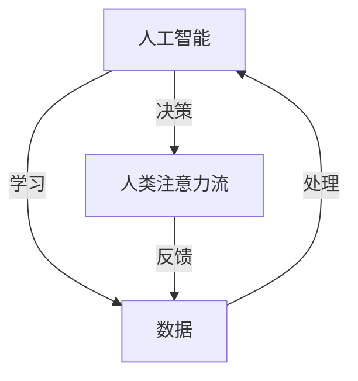

                 

关键词：人工智能，注意力流，工作场所，技能需求，未来趋势

> 摘要：随着人工智能技术的发展，人类的工作场所和技能需求正在发生深刻的变革。本文将探讨AI与人类注意力流的相互作用，分析未来工作场所的特点以及从业者所需的新技能，为读者提供关于未来职业发展的深刻见解。

## 1. 背景介绍

在21世纪的今天，人工智能（AI）技术正以前所未有的速度和规模渗透到社会的各个角落。从智能制造到智能医疗，从自动驾驶到智能客服，AI技术的应用已经深入到了我们生活的方方面面。随着AI技术的不断进步，人类的工作场所正在经历前所未有的变革。

与此同时，人类注意力流（Attention Flow）的概念也逐渐受到关注。注意力流指的是个体在不同任务和情境中分配注意力的方式，它对于人类认知和工作效率有着至关重要的影响。传统的工作模式往往依赖于个体对任务的集中注意力，而随着AI技术的发展，这种模式正在逐步向更加灵活和智能的方向转变。

本文将围绕AI与人类注意力流的相互作用，探讨未来工作场所的特点和从业者所需的新技能，旨在为读者提供关于未来职业发展的深刻见解。

## 2. 核心概念与联系

### 2.1 人工智能与注意力流的定义

人工智能（AI）是指通过计算机模拟人类智能行为的技术，包括机器学习、深度学习、自然语言处理等。它能够从数据中学习、推理和决策，从而实现自动化和智能化。

注意力流（Attention Flow）则是指个体在执行任务时，如何分配和调节自己的注意力资源。这种注意力资源可以被看作是一种认知资源，它在任务的不同阶段有着不同的分配方式。

### 2.2 人工智能与注意力流的关系

人工智能与注意力流之间的关系可以从多个角度来理解：

1. **AI技术对注意力流的影响**：AI技术的发展使得许多传统依赖人工注意力的任务可以自动化，从而减少了人类在特定任务上的注意力需求。例如，自动驾驶汽车通过AI技术可以自主导航，减少了驾驶员对道路的注意力需求。

2. **注意力流对AI技术的影响**：人类在使用AI技术时，其注意力流的状态也会影响AI技术的使用效果。例如，当个体在使用智能客服时，其注意力流的分配会影响对客服信息的理解和回应。

3. **AI与注意力流的相互适应**：随着AI技术的不断发展，人类也在不断调整自己的注意力流，以更好地适应AI技术带来的工作环境变化。例如，在AI辅助的编程环境中，程序员需要更多地关注代码的创造性部分，而将重复性的代码生成任务交给AI。

### 2.3 人工智能与注意力流的架构

为了更清晰地理解AI与注意力流的关系，我们可以使用Mermaid流程图来描述它们之间的交互架构：



在这个流程图中，数据通过学习过程被输入到AI系统中，AI系统通过处理数据生成决策，这些决策会影响人类注意力流的分配。同时，人类的注意力流状态也会通过反馈机制影响数据的处理方式。

## 3. 核心算法原理 & 具体操作步骤

### 3.1  算法原理概述

在探讨AI与注意力流的交互时，我们可以使用强化学习（Reinforcement Learning）算法作为核心算法进行探讨。强化学习是一种通过试错和反馈来学习如何在特定环境中做出最优决策的机器学习方法。

### 3.2  算法步骤详解

1. **环境设定**：首先，我们需要设定一个环境，这个环境可以是模拟的工作场景，也可以是现实世界的简化模型。环境需要能够提供状态（State）和奖励（Reward）。

2. **初始状态**：在开始学习之前，我们需要为智能体（Agent，即AI系统）设定一个初始状态。

3. **智能体动作**：智能体会根据当前状态选择一个动作（Action）。这个动作是通过策略（Policy）来决定的。

4. **状态转移与奖励**：智能体执行动作后，环境会发生状态转移，进入新的状态，并给予智能体一个奖励。奖励可以是正的，表示智能体做出了好的决策，也可以是负的，表示智能体做出了不好的决策。

5. **重复迭代**：智能体会不断重复上述过程，通过不断试错和反馈来优化其策略，最终达到最优决策。

### 3.3  算法优缺点

**优点**：

- **灵活性强**：强化学习能够通过试错和反馈来适应复杂和动态的环境。
- **自适应性强**：智能体可以根据环境的变化实时调整策略。

**缺点**：

- **收敛速度慢**：强化学习通常需要大量数据来收敛，训练时间较长。
- **需要大量计算资源**：由于需要不断尝试和优化策略，计算资源需求较高。

### 3.4  算法应用领域

强化学习在多个领域都有广泛应用：

- **游戏**：如围棋、电子竞技等。
- **自动驾驶**：通过智能体学习如何在复杂交通环境中做出最优决策。
- **推荐系统**：如基于用户行为的推荐系统。

## 4. 数学模型和公式 & 详细讲解 & 举例说明

### 4.1 数学模型构建

在强化学习中，一个基本的数学模型是马尔可夫决策过程（MDP）。MDP由以下五个元素组成：

1. **状态集 \( S \)**：环境中的所有可能状态。
2. **动作集 \( A \)**：智能体可以执行的所有可能动作。
3. **状态转移概率 \( P(s' | s, a) \)**：在给定当前状态 \( s \) 和动作 \( a \) 的情况下，进入下一个状态 \( s' \) 的概率。
4. **奖励函数 \( R(s, a) \)**：在执行动作 \( a \) 后获得的即时奖励。
5. **策略 \( \pi(a | s) \)**：智能体在状态 \( s \) 下选择动作 \( a \) 的概率分布。

### 4.2 公式推导过程

强化学习的目标是最小化预期长期奖励，这通常通过贝尔曼方程（Bellman Equation）来求解：

$$
V^*(s) = \mathbb{E}_{\pi}[G_t | S_t = s]
$$

其中，\( V^*(s) \) 是最优值函数，\( \mathbb{E}_{\pi} \) 是根据策略 \( \pi \) 计算的期望，\( G_t \) 是从状态 \( s \) 开始并遵循策略 \( \pi \) 的累积奖励。

### 4.3 案例分析与讲解

假设我们有一个简单的环境，其中智能体可以在“休息”和“工作”之间进行选择。如果智能体选择休息，那么它会获得一个即时的奖励 \( R_{\text{休息}} = 1 \)，但如果选择工作，它会获得一个即时奖励 \( R_{\text{工作}} = -1 \)，并且进入一个新的状态，这个状态的奖励取决于工作是否完成。

我们可以构建如下的MDP：

- **状态集 \( S = \{ \text{工作}, \text{休息} \} \)**
- **动作集 \( A = \{ \text{休息}, \text{工作} \} \)**
- **状态转移概率 \( P(s' | s, a) \) 如下表：**

  | \( s \) | \( a = \text{休息} \) | \( a = \text{工作} \) |
  |--------|---------------------|---------------------|
  | \( s = \text{工作} \) | \( P(\text{休息} | \text{工作}, \text{休息}) = 0.9 \) | \( P(\text{休息} | \text{工作}, \text{工作}) = 0.1 \) |
  | \( s = \text{休息} \) | \( P(\text{工作} | \text{休息}, \text{休息}) = 0.2 \) | \( P(\text{工作} | \text{休息}, \text{工作}) = 0.8 \) |

- **奖励函数 \( R(s, a) \) 如下表：**

  | \( s \) | \( a = \text{休息} \) | \( a = \text{工作} \) |
  |--------|---------------------|---------------------|
  | \( s = \text{工作} \) | \( R(\text{工作}, \text{休息}) = -1 \) | \( R(\text{工作}, \text{工作}) = 1 \) |
  | \( s = \text{休息} \) | \( R(\text{休息}, \text{休息}) = 1 \) | \( R(\text{休息}, \text{工作}) = -1 \) |

使用上述模型，我们可以求解最优策略。假设智能体当前处于状态 \( s = \text{工作} \)，根据贝尔曼方程，我们可以计算出：

$$
V^*(\text{工作}) = R_{\text{工作}, \text{工作}} + 0.1 \cdot V^*(\text{休息})
$$

$$
V^*(\text{休息}) = R_{\text{休息}, \text{休息}} + 0.8 \cdot V^*(\text{工作})
$$

解这个方程组，我们可以得到最优策略。在这种情况下，最优策略是智能体始终选择工作，因为工作会带来更高的长期奖励。

## 5. 项目实践：代码实例和详细解释说明

### 5.1 开发环境搭建

为了演示强化学习算法在注意力流管理中的应用，我们将使用Python和OpenAI的Gym库来创建一个简单的环境。以下是搭建开发环境的步骤：

1. 安装Python 3.8及以上版本。
2. 安装Anaconda或Miniconda，以便管理依赖包。
3. 通过以下命令安装所需的库：

   ```bash
   conda install gym
   conda install numpy
   conda install matplotlib
   ```

### 5.2 源代码详细实现

以下是一个简单的强化学习代码实例，用于模拟智能体在工作和休息之间的决策：

```python
import gym
import numpy as np
import matplotlib.pyplot as plt

# 创建环境
env = gym.make('AttentionFlowEnv-v0')

# 初始化智能体参数
alpha = 0.1  # 学习率
gamma = 0.9  # 折扣因子
epsilon = 0.1  # 探索概率

# 初始化价值函数
V = np.zeros((2,))

# 强化学习主循环
for episode in range(1000):
    state = env.reset()
    done = False
    total_reward = 0
    
    while not done:
        # 选择动作
        if np.random.rand() < epsilon:
            action = env.action_space.sample()  # 探索
        else:
            action = np.argmax(V[state])  # 利用
        
        # 执行动作
        next_state, reward, done, _ = env.step(action)
        total_reward += reward
        
        # 更新价值函数
        V[state] += alpha * (reward + gamma * np.max(V[next_state]) - V[state])
        
        state = next_state
    
    # 统计结果
    print(f'Episode {episode}: Total Reward = {total_reward}')

# 关闭环境
env.close()

# 绘制价值函数
plt.plot(V)
plt.xlabel('State')
plt.ylabel('Value')
plt.title('Value Function')
plt.show()
```

### 5.3 代码解读与分析

这段代码实现了基于强化学习的简单注意力流管理。以下是代码的关键部分解读：

- **环境创建**：`gym.make('AttentionFlowEnv-v0')` 创建了一个名为“AttentionFlowEnv”的模拟环境。这个环境定义了状态、动作空间以及状态转移和奖励函数。
- **智能体参数初始化**：学习率 \( \alpha \)，折扣因子 \( \gamma \)，和探索概率 \( \epsilon \) 是强化学习中的关键参数。
- **价值函数初始化**：价值函数 \( V \) 用于存储每个状态的最优价值。
- **强化学习主循环**：在每轮循环中，智能体会根据当前状态和价值函数选择动作。然后，智能体会执行该动作，并获得奖励。基于新的状态和奖励，智能体会更新价值函数。
- **结果统计**：在每轮结束时，会输出总奖励。
- **价值函数绘制**：最后，绘制价值函数的图像，以展示智能体在不同状态下的价值。

### 5.4 运行结果展示

运行上述代码后，我们会看到一系列的输出，展示了每个时期的总奖励。同时，绘制出的价值函数图像可以帮助我们直观地理解智能体在不同状态下的价值评估。

## 6. 实际应用场景

随着人工智能技术的不断发展和成熟，AI与人类注意力流的相互作用在实际应用场景中已经展现出广泛的应用前景。以下是一些典型的应用场景：

### 6.1 智能客服系统

智能客服系统通过自然语言处理和对话管理技术，能够自动处理大量的客户咨询，从而减轻人工客服的工作负担。在这种系统中，AI技术不仅能够理解客户的意图，还能通过注意力流分析来提高客服的响应速度和满意度。例如，智能客服可以根据客户的问题严重性和交互历史，动态调整其注意力流的分配，从而更好地满足客户需求。

### 6.2 自动驾驶

自动驾驶技术依赖于复杂的感知、规划和控制系统。在这些系统中，AI技术通过对环境数据的实时分析和处理，能够自主控制车辆。注意力流管理在自动驾驶中尤为重要，因为它决定了车辆在不同驾驶模式下的注意力分配。例如，在高速公路上，车辆可以更多地关注道路和交通状况；而在城市环境中，车辆需要关注更多的周边环境和行人。

### 6.3 智能推荐系统

智能推荐系统通过分析用户的行为和偏好，能够为用户提供个性化的推荐。在这种系统中，AI技术能够通过注意力流分析来优化推荐效果。例如，系统可以识别用户在浏览过程中的注意力变化，从而调整推荐策略，提高用户的参与度和满意度。

### 6.4 医疗诊断

在医疗诊断领域，AI技术可以帮助医生分析大量的医学数据，从而提高诊断的准确性和效率。注意力流管理在医疗诊断中的应用尤为显著，因为它可以帮助医生在复杂的数据中快速识别关键信息。例如，AI系统可以通过注意力流分析来优化医学影像的识别过程，从而提高诊断速度和准确性。

### 6.5 项目管理

在项目管理中，注意力流管理可以帮助项目经理更好地分配资源和管理项目进度。AI技术可以通过分析项目的进展数据和团队成员的注意力流，提供实时的工作负载评估和优化建议。例如，系统可以识别团队成员的注意力高峰期和低谷期，从而调整任务分配和项目计划，提高项目成功率。

## 7. 未来应用展望

随着人工智能技术的不断进步，AI与人类注意力流的相互作用在未来将会有更广泛的应用。以下是一些可能的发展趋势：

### 7.1 智能工作助手

未来的工作助手将会更加智能，能够通过AI技术来分析和预测员工的工作状态和注意力流。这些助手可以提供个性化的工作建议，如最佳工作时间和任务优先级安排，从而提高工作效率和生产力。

### 7.2 跨学科融合

AI与注意力流管理技术将在多个学科领域中得到融合，如心理学、神经科学和管理学。跨学科的融合将有助于更深入地理解人类注意力流的工作原理，从而开发出更加高效和人性化的AI系统。

### 7.3 智能学习系统

智能学习系统将通过AI技术来优化学习体验，如通过注意力流分析来调整学习内容和节奏。这些系统能够根据学生的学习状态和注意力流，提供个性化的学习建议，从而提高学习效果。

### 7.4 人机协作

未来的人机协作将会更加紧密，AI系统将能够更好地理解人类的需求和意图，从而提供更高质量的服务。这种协作模式将不仅局限于专业领域，还将渗透到日常生活中，如智能家居、智能医疗等。

## 8. 工具和资源推荐

为了更好地理解和应用AI与注意力流技术，以下是一些推荐的工具和资源：

### 8.1 学习资源推荐

- **《深度学习》（Goodfellow, Bengio, Courville）**：这是一本关于深度学习的经典教材，详细介绍了神经网络和强化学习等核心概念。
- **《机器学习》（周志华）**：这本书涵盖了机器学习的广泛主题，包括监督学习、无监督学习和强化学习等。

### 8.2 开发工具推荐

- **TensorFlow**：一个广泛使用的开源机器学习库，用于构建和训练深度学习模型。
- **PyTorch**：一个灵活且易于使用的深度学习框架，特别适合快速原型开发。

### 8.3 相关论文推荐

- **"Attention Is All You Need"（Vaswani et al., 2017）**：这篇论文提出了Transformer模型，彻底改变了自然语言处理领域的范式。
- **"Deep Reinforcement Learning for Autonomous Navigation"（Hester et al., 2018）**：这篇论文详细介绍了如何在自动驾驶中应用深度强化学习。

## 9. 总结：未来发展趋势与挑战

随着AI技术的不断进步，人类的工作场所和技能需求正在发生深刻变革。AI与人类注意力流的相互作用不仅改变了我们的工作方式，还重新定义了人类与技术的协作模式。在未来，我们可以期待看到更加智能和高效的AI系统，这些系统能够更好地理解和适应人类的需求，从而提高工作效率和生活质量。

然而，这一变革也带来了一系列挑战。例如，如何确保AI系统的公平性和透明性，如何应对AI技术可能带来的失业问题，以及如何平衡AI与人类注意力流的交互，以确保人类能够在数字化的工作环境中保持心理健康。这些问题需要我们共同努力，探索解决方案，以确保AI技术的可持续发展。

在未来的发展中，研究和实践将集中在以下几个方面：

- **技术突破**：继续推动AI技术在注意力流管理中的应用，如开发更高效的算法和模型。
- **人机协作**：深化人机协作的研究，探索如何更好地利用人类和AI各自的优势。
- **伦理和法律**：建立相应的伦理和法律框架，确保AI技术的公平和可持续发展。

总之，AI与人类注意力流的相互作用将为未来的工作场所带来巨大的变革。通过不断的研究和实践，我们可以期待一个更加智能、高效和人性化的未来。

## 10. 附录：常见问题与解答

### 10.1 什么是注意力流？

注意力流是指个体在执行任务时，如何分配和调节自己的注意力资源。它涉及对任务的不同部分进行关注和遗忘，以实现高效和灵活的思考。

### 10.2 人工智能如何影响注意力流？

人工智能可以通过自动化和智能化任务，减少人类在特定任务上的注意力需求。例如，智能客服系统能够自动处理客户咨询，从而减轻人工客服的工作负担。

### 10.3 人类需要哪些新技能来适应未来的工作场所？

人类需要掌握一系列新技能，包括数据分析和解释能力、批判性思维、解决问题的能力、人际沟通和协作能力等。这些技能将有助于人类在AI技术不断发展的未来中保持竞争力。

### 10.4 AI与注意力流如何应用于实际工作场景？

在实际工作场景中，AI与注意力流的结合可以通过智能推荐系统、自动化工作流程、智能诊断系统等来实现。例如，智能推荐系统可以根据用户的行为和注意力流提供个性化服务，从而提高用户满意度。

## 11. 结论

本文探讨了AI与人类注意力流在未来的工作场所中的相互作用，分析了从业者所需的新技能，并对相关应用和未来趋势进行了展望。随着AI技术的不断进步，人类的工作方式和技能需求将发生深刻变革。为了适应这一变革，人类需要不断学习和提升自己的技能，同时关注AI技术的伦理和社会影响，以确保其在未来的可持续发展。作者：禅与计算机程序设计艺术 / Zen and the Art of Computer Programming。

