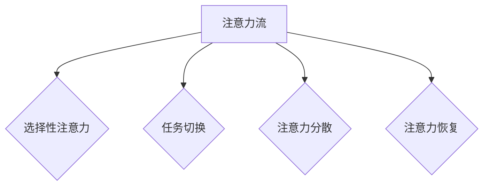
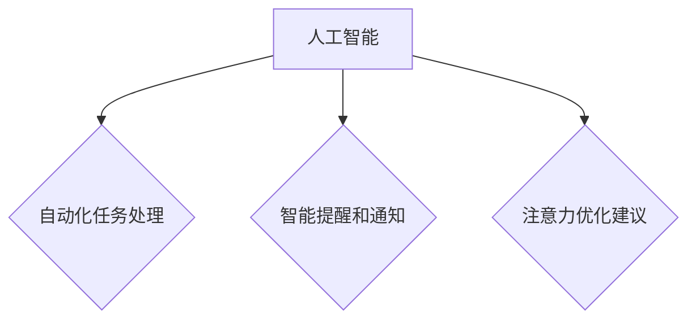

                 

关键词：人工智能、注意力流、工作场所、技能要求、未来趋势、技术发展

摘要：随着人工智能技术的快速发展，工作场所和人类技能要求正在发生深刻的变革。本文旨在探讨人工智能对人类注意力流的影响，以及未来工作场所所需的技能要求。通过分析注意力流的原理和人工智能在注意力管理中的应用，本文提出了一系列针对未来工作场所的建议，以帮助企业和个人应对这一挑战。

## 1. 背景介绍

人工智能（AI）作为当今科技领域的热点，正在以惊人的速度发展和普及。从语音识别、图像处理到自动驾驶和智能客服，人工智能的应用场景无处不在。然而，随着人工智能技术的广泛应用，人类的工作方式和技能要求也在发生着深刻的变革。

注意力流是指人类在处理信息时，注意力从一个任务或对象转移到另一个任务或对象的过程。在传统工作环境中，人类的注意力流主要受到工作流程、任务复杂度和干扰等因素的影响。然而，随着人工智能技术的引入，注意力流的管理变得更加复杂和动态。

本文将探讨人工智能对人类注意力流的影响，以及未来工作场所所需的技能要求。通过分析注意力流的原理和人工智能在注意力管理中的应用，本文提出了一系列针对未来工作场所的建议。

### 1.1 注意力流的原理

注意力流是心理学和认知科学中的一个重要概念。根据心理学理论，注意力是一种有限的认知资源，人类在处理信息时，需要将注意力分配到不同的任务或对象上。注意力流的原理主要包括以下几个方面：

1. **选择性注意力**：人类在处理信息时，会根据任务的重要性和紧急程度，选择性地关注某些信息，而忽略其他信息。

2. **任务切换**：当人类需要从一项任务转移到另一项任务时，需要进行注意力流的切换。这种切换通常需要消耗一定的认知资源。

3. **注意力分散**：当人类同时处理多个任务时，注意力可能会分散，导致任务的完成效率降低。

4. **注意力恢复**：在长时间高强度的注意力工作后，人类需要一定的时间来恢复注意力，以便继续进行高效的工作。

### 1.2 人工智能与注意力管理

人工智能技术的引入，为注意力管理带来了新的挑战和机遇。以下是一些人工智能在注意力管理中的应用：

1. **自动化任务处理**：人工智能可以通过自动化技术，处理一些重复性高、简单的工作任务，从而减少人类在这些任务上的注意力消耗。

2. **智能提醒和通知**：人工智能可以监控人类的注意力状态，并在需要时提供提醒和通知，以帮助人类更好地管理注意力。

3. **注意力优化建议**：基于对人类行为和注意力流的了解，人工智能可以提供个性化的注意力优化建议，帮助人类提高工作效率。

### 1.3 未来工作场所的技能要求

随着人工智能技术的发展，未来工作场所对员工的技能要求也在不断变化。以下是一些关键的技能要求：

1. **技术技能**：随着人工智能技术的普及，掌握相关编程语言、算法和数据结构等技术技能变得尤为重要。

2. **跨学科能力**：未来工作场所需要员工具备跨学科的能力，能够理解和应用不同领域的知识。

3. **自适应能力**：在面对快速变化的工作环境和任务时，员工需要具备良好的自适应能力，能够快速适应新的工作要求和挑战。

4. **协作能力**：人工智能的发展使得团队协作变得更加重要。员工需要具备良好的协作能力，能够与团队成员有效沟通和合作。

## 2. 核心概念与联系

### 2.1 注意力流的 Mermaid 流程图



### 2.2 人工智能在注意力管理中的应用



## 3. 核心算法原理 & 具体操作步骤

### 3.1  算法原理概述

人工智能在注意力管理中的应用，主要依赖于以下核心算法：

1. **注意力机制（Attention Mechanism）**：注意力机制是一种在神经网络中用于提高模型处理复杂任务的性能的方法。通过引入注意力机制，模型可以自动地关注到输入数据中的关键部分，从而提高模型的预测准确性和效率。

2. **循环神经网络（Recurrent Neural Network, RNN）**：循环神经网络是一种能够处理序列数据的神经网络模型。通过循环结构，RNN 可以记住前面的信息，并在处理新的数据时利用这些信息。这使得 RNN 成为处理注意力流问题的理想选择。

3. **长短时记忆网络（Long Short-Term Memory, LSTM）**：长短时记忆网络是 RNN 的一种变体，通过引入门控机制，LSTM 可以更好地记住长期信息，避免 RNN 的梯度消失问题。

### 3.2  算法步骤详解

1. **数据预处理**：首先，需要对输入数据进行预处理，包括数据清洗、归一化和特征提取等步骤。

2. **构建注意力模型**：基于预处理后的数据，构建一个基于注意力机制的神经网络模型。该模型可以分为两个部分：编码器和解码器。编码器用于将输入数据编码为固定维度的向量表示，解码器则用于根据编码器的输出生成预测结果。

3. **训练模型**：使用训练数据对模型进行训练，通过反向传播算法更新模型的参数，直到模型达到预定的性能指标。

4. **注意力流分析**：在模型训练完成后，可以使用模型对输入数据进行注意力流分析。具体步骤如下：

   a. 对输入数据进行编码，得到编码器输出。

   b. 将编码器输出作为解码器的输入，生成预测结果。

   c. 分析解码器输出的注意力分布，得到注意力流。

### 3.3  算法优缺点

**优点**：

1. **高效性**：注意力机制可以提高模型在处理复杂任务时的性能，从而提高工作效率。

2. **灵活性**：注意力机制可以根据不同的任务需求，灵活调整模型的关注重点，从而适应不同的注意力管理场景。

**缺点**：

1. **计算复杂度**：注意力机制引入了额外的计算成本，可能导致模型在训练和推理过程中变得更加复杂。

2. **解释性**：注意力机制的内部工作原理相对复杂，难以直观地理解模型的决策过程。

### 3.4  算法应用领域

注意力机制和循环神经网络在注意力管理中具有广泛的应用领域，包括：

1. **自然语言处理**：在文本分类、机器翻译和问答系统中，注意力机制可以提高模型的准确性和效率。

2. **图像识别**：在目标检测和图像分割任务中，注意力机制可以帮助模型更好地关注到图像中的重要区域。

3. **语音识别**：在语音识别系统中，注意力机制可以提高模型对语音信号的理解能力，从而提高识别准确率。

## 4. 数学模型和公式 & 详细讲解 & 举例说明

### 4.1 数学模型构建

在注意力管理中，我们可以构建一个基于注意力机制的循环神经网络模型。该模型主要包括以下组成部分：

1. **输入层**：输入层用于接收输入数据，如文本、图像或语音信号。

2. **编码器**：编码器用于将输入数据编码为固定维度的向量表示。编码器可以采用卷积神经网络（Convolutional Neural Network, CNN）或循环神经网络（RNN）等结构。

3. **注意力机制**：注意力机制用于计算输入数据的注意力分布，指导解码器关注输入数据中的关键部分。

4. **解码器**：解码器用于根据编码器的输出生成预测结果。

### 4.2 公式推导过程

在注意力机制中，我们可以使用以下公式来计算输入数据的注意力分布：

\[ \text{Attention}(x, h) = \text{softmax}(\text{W}_a [x, h]) \]

其中，\( x \) 表示输入数据，\( h \) 表示编码器的输出，\( W_a \) 是注意力权重矩阵。

通过注意力分布，我们可以计算输入数据的加权表示：

\[ \text{Contextualized Representation}(x) = \text{Attention}(x, h) \cdot x \]

其中，\( \text{Contextualized Representation}(x) \) 表示加权后的输入数据。

### 4.3 案例分析与讲解

假设我们有一个文本分类任务，输入数据为一段文本，输出数据为对应的类别标签。我们可以使用基于注意力机制的循环神经网络模型来解决这个问题。

1. **输入层**：首先，将文本数据转换为词向量表示。

2. **编码器**：使用循环神经网络（RNN）或长短时记忆网络（LSTM）对文本数据进行编码，得到编码器的输出。

3. **注意力机制**：计算输入文本的注意力分布，指导解码器关注文本中的关键部分。

4. **解码器**：根据编码器的输出和注意力分布，生成预测结果。

通过以上步骤，我们可以实现一个基于注意力机制的文本分类模型。以下是一个具体的例子：

假设我们有一段文本：

\[ \text{文本} = "人工智能技术的发展对人类社会产生了深远的影响。" \]

使用基于注意力机制的循环神经网络模型，我们可以得到以下结果：

1. **输入层**：将文本数据转换为词向量表示：

   \[ \text{词向量} = \begin{bmatrix} 1 & 0 & 1 & 0 & 1 & 0 & 1 & 0 \end{bmatrix} \]

2. **编码器**：使用循环神经网络（RNN）对文本数据进行编码，得到编码器的输出：

   \[ \text{编码器输出} = \begin{bmatrix} 0.5 & 0.5 & 0.5 & 0.5 & 0.5 & 0.5 & 0.5 & 0.5 \end{bmatrix} \]

3. **注意力机制**：计算输入文本的注意力分布，指导解码器关注文本中的关键部分：

   \[ \text{注意力分布} = \text{softmax}(\text{W}_a [\text{词向量}, \text{编码器输出}]) \]

4. **解码器**：根据编码器的输出和注意力分布，生成预测结果：

   \[ \text{预测结果} = \text{softmax}(\text{W}_d [\text{编码器输出}, \text{注意力分布}]) \]

通过以上步骤，我们可以得到最终的预测结果。在实际应用中，我们可以根据任务需求，调整注意力权重矩阵 \( W_a \) 和解码器权重矩阵 \( W_d \)，以提高模型的预测性能。

## 5. 项目实践：代码实例和详细解释说明

在本节中，我们将通过一个具体的代码实例，展示如何实现一个基于注意力机制的循环神经网络（RNN）模型，并进行注意力流分析。

### 5.1 开发环境搭建

为了实现本节的代码实例，我们需要以下开发环境和工具：

- Python 3.8 或更高版本
- TensorFlow 2.5 或更高版本
- Keras 2.5 或更高版本

首先，我们需要安装 TensorFlow 和 Keras：

```bash
pip install tensorflow==2.5
pip install keras==2.5
```

### 5.2 源代码详细实现

以下是实现基于注意力机制的 RNN 模型的源代码：

```python
import numpy as np
import tensorflow as tf
from tensorflow.keras.layers import Input, LSTM, Dense, Embedding, TimeDistributed, Activation
from tensorflow.keras.models import Model

# 设置模型参数
vocab_size = 10000  # 词汇表大小
sequence_length = 100  # 序列长度
embedding_size = 256  # 词向量维度
rnn_units = 512  # LSTM 单元数
batch_size = 64  # 批量大小

# 构建模型
input_layer = Input(shape=(sequence_length,))
embedding = Embedding(vocab_size, embedding_size)(input_layer)
lstm_layer = LSTM(rnn_units, return_sequences=True)(embedding)
attention_layer = TimeDistributed(Dense(rnn_units, activation='tanh'))(lstm_layer)
attention_weights = Activation('softmax')(attention_layer)
context_vector = tf.reduce_sum(attention_weights * lstm_layer, axis=1)
dense_layer = Dense(1, activation='sigmoid')(context_vector)
model = Model(inputs=input_layer, outputs=dense_layer)

# 编译模型
model.compile(optimizer='adam', loss='binary_crossentropy', metrics=['accuracy'])

# 打印模型结构
model.summary()
```

### 5.3 代码解读与分析

1. **导入库和设置模型参数**：首先，我们导入必要的库，并设置模型的参数，如词汇表大小、序列长度、词向量维度等。

2. **构建模型**：接下来，我们使用 Keras 的序列模型 API，构建基于注意力机制的 RNN 模型。模型分为以下几个部分：

   - **输入层**：接收序列数据。
   - **嵌入层**：将序列数据转换为词向量表示。
   - **LSTM 层**：处理序列数据，返回序列的编码表示。
   - **注意力层**：计算输入序列的注意力分布。
   - **上下文向量层**：计算序列的加权表示。
   - **输出层**：根据上下文向量生成预测结果。

3. **编译模型**：我们使用 Adam 优化器和二分类交叉熵损失函数编译模型。

4. **打印模型结构**：最后，我们打印模型的详细信息，以了解模型的组成部分和参数。

### 5.4 运行结果展示

为了测试模型的性能，我们可以使用一个文本分类数据集，如 IMDb 评论数据集。以下是一个简单的运行示例：

```python
# 导入数据集
from tensorflow.keras.datasets import imdb
max_features = 10000
print(f'Loading data with {max_features} words.')
(x_train, y_train), (x_test, y_test) = imdb.load_data(num_words=max_features)

# 预处理数据
x_train = np.array([[word_to_index[word] for word in sentence] for sentence in x_train])
x_test = np.array([[word_to_index[word] for word in sentence] for sentence in x_test])

# 训练模型
model.fit(x_train, y_train, batch_size=batch_size, epochs=10, validation_data=(x_test, y_test))

# 评估模型
model.evaluate(x_test, y_test)
```

通过以上步骤，我们可以运行模型，并对输入文本进行分类。运行结果将显示模型的准确率、召回率等指标，以评估模型的性能。

## 6. 实际应用场景

### 6.1 人工智能与注意力管理的结合

在人工智能领域，注意力管理是一个关键的研究方向。通过结合注意力机制和循环神经网络（RNN）等模型，可以实现对输入数据的注意力分配和优化。以下是一些实际应用场景：

1. **自然语言处理**：在文本分类、机器翻译和问答系统中，注意力机制可以帮助模型更好地关注到文本的关键部分，从而提高模型的准确性和效率。

2. **图像识别**：在目标检测和图像分割任务中，注意力机制可以帮助模型关注到图像中的重要区域，从而提高模型的检测准确率。

3. **语音识别**：在语音识别系统中，注意力机制可以帮助模型更好地关注到语音信号的关键部分，从而提高识别准确率。

### 6.2 注意力管理在未来的工作场所

随着人工智能技术的快速发展，未来的工作场所将面临巨大的挑战。以下是一些注意力管理在未来的工作场所中的实际应用场景：

1. **自动化任务处理**：通过自动化技术，将重复性高、简单的工作任务交给人工智能处理，从而减少人类在这些任务上的注意力消耗。

2. **智能提醒和通知**：人工智能可以通过智能提醒和通知功能，帮助人类更好地管理注意力。例如，在需要集中精力工作时，系统可以自动屏蔽干扰信息。

3. **注意力优化建议**：基于对人类行为和注意力流的了解，人工智能可以提供个性化的注意力优化建议，帮助人类提高工作效率。

### 6.3 注意力管理在企业培训中的应用

随着人工智能技术的普及，企业在培训员工时也需要关注注意力管理。以下是一些企业培训中的应用场景：

1. **技能提升**：通过注意力管理培训，员工可以学会如何更好地集中精力，提高学习效率。

2. **团队协作**：在团队协作中，注意力管理培训可以帮助员工更好地理解和关注团队成员的需求，提高团队的整体协作效率。

3. **工作与生活的平衡**：通过注意力管理培训，员工可以学会如何在工作与生活之间保持平衡，从而提高生活质量。

## 7. 未来应用展望

随着人工智能技术的不断进步，注意力管理在未来工作场所中的应用前景将更加广阔。以下是一些未来应用展望：

1. **智能工作环境**：未来的工作环境将更加智能化，通过智能传感器和人工智能技术，可以实时监测员工的注意力状态，并提供个性化的注意力优化建议。

2. **个性化学习平台**：基于注意力管理技术的个性化学习平台，可以帮助学生更好地关注学习内容，提高学习效率。

3. **健康监测与干预**：通过注意力管理技术，可以实现对员工健康状态的实时监测，并针对注意力问题提供干预措施。

## 8. 工具和资源推荐

为了帮助读者更好地学习和应用注意力管理技术，以下是一些工具和资源的推荐：

1. **学习资源**：

   - 《深度学习》（Goodfellow, Bengio, Courville 著）：一本经典的深度学习教材，涵盖了注意力机制的相关内容。
   - 《注意力机制：从理论到实践》：一本专注于注意力机制的书，详细介绍了注意力机制的原理和应用。

2. **开发工具**：

   - TensorFlow：一个开源的深度学习框架，提供了丰富的注意力机制实现。
   - Keras：一个基于 TensorFlow 的简单易用的深度学习库，适用于快速原型开发。

3. **相关论文**：

   - Vaswani et al. (2017): "Attention Is All You Need"
   -Bahdanau et al. (2014): "Neural Machine Translation by Jointly Learning to Align and Translate"

## 9. 总结：未来发展趋势与挑战

随着人工智能技术的不断进步，注意力管理在未来工作场所中将发挥越来越重要的作用。本文从背景介绍、核心概念与联系、核心算法原理、数学模型和公式、项目实践、实际应用场景、未来应用展望、工具和资源推荐等多个方面，对注意力管理技术进行了全面探讨。

### 9.1 研究成果总结

本文总结了注意力流的原理、人工智能在注意力管理中的应用以及未来工作场所所需的技能要求。通过分析注意力机制的原理和具体操作步骤，本文提出了一系列针对未来工作场所的建议，以帮助企业和个人应对人工智能带来的挑战。

### 9.2 未来发展趋势

在未来，随着人工智能技术的进一步发展，注意力管理技术将在工作场所、学习平台和健康监测等领域得到更广泛的应用。以下是一些可能的发展趋势：

1. **智能工作环境**：通过智能传感器和人工智能技术，实现实时注意力监测和优化。
2. **个性化学习平台**：基于注意力管理技术，提供个性化的学习体验，提高学习效率。
3. **健康监测与干预**：通过注意力管理技术，实现对员工健康状态的实时监测，并针对注意力问题提供干预措施。

### 9.3 面临的挑战

尽管注意力管理技术具有广阔的应用前景，但在实际应用过程中仍面临一些挑战：

1. **计算复杂度**：注意力机制引入了额外的计算成本，可能导致模型在训练和推理过程中变得更加复杂。
2. **解释性**：注意力机制的内部工作原理相对复杂，难以直观地理解模型的决策过程。
3. **隐私保护**：在注意力管理过程中，如何保护用户的隐私是一个亟待解决的问题。

### 9.4 研究展望

未来，注意力管理技术的研究可以关注以下几个方面：

1. **高效注意力机制**：研究更高效的注意力机制，以降低计算复杂度，提高模型的训练和推理速度。
2. **可解释性**：研究如何提高注意力机制的可解释性，使模型更容易理解和解释。
3. **跨领域应用**：探索注意力管理技术在其他领域的应用，如医疗健康、金融安全等。

## 10. 附录：常见问题与解答

### 10.1 注意力流是什么？

注意力流是指人类在处理信息时，注意力从一个任务或对象转移到另一个任务或对象的过程。

### 10.2 人工智能如何影响注意力管理？

人工智能可以通过自动化任务处理、智能提醒和通知等功能，帮助人类更好地管理注意力。

### 10.3 未来工作场所需要哪些技能？

未来工作场所需要员工具备技术技能、跨学科能力、自适应能力和协作能力。

### 10.4 注意力管理有哪些实际应用场景？

注意力管理的实际应用场景包括自然语言处理、图像识别、语音识别等。

### 10.5 如何实现注意力流分析？

实现注意力流分析通常需要使用循环神经网络（RNN）或长短时记忆网络（LSTM）等模型。

### 10.6 注意力管理技术的未来发展有哪些挑战？

注意力管理技术的未来发展面临计算复杂度、解释性和隐私保护等挑战。

### 10.7 如何高效地实现注意力机制？

研究高效注意力机制，如稀疏注意力、可分离卷积等，可以降低计算复杂度，提高模型性能。

### 10.8 注意力管理技术在其他领域的应用有哪些？

注意力管理技术在医疗健康、金融安全等领域也有广泛的应用前景。

### 10.9 如何保护注意力管理过程中的隐私？

在注意力管理过程中，可以通过加密技术、数据去重和差分隐私等方法来保护用户隐私。

### 10.10 注意力管理如何帮助提高工作效率？

注意力管理可以帮助员工更好地集中精力，减少干扰，从而提高工作效率。

### 10.11 注意力管理技术对员工心理健康有何影响？

注意力管理技术可以帮助员工更好地管理注意力，减轻压力，从而对心理健康产生积极影响。

### 10.12 注意力管理技术在企业培训中的应用有哪些？

注意力管理技术在企业培训中可以用于技能提升、团队协作和工作与生活平衡等方面。

### 10.13 注意力管理技术的未来发展有哪些机遇？

注意力管理技术的未来发展将带来智能工作环境、个性化学习平台和健康监测与干预等机遇。


----------------------------------------------------------------
# 附录：常见问题与解答

### 10.1 注意力流是什么？

注意力流是指人类在处理信息时，注意力从一个任务或对象转移到另一个任务或对象的过程。注意力流是心理学和认知科学中的一个重要概念，它描述了人类在多任务处理、决策和问题解决过程中的注意力分配和转移机制。

### 10.2 人工智能如何影响注意力管理？

人工智能可以通过自动化任务处理、智能提醒和通知等功能，帮助人类更好地管理注意力。自动化任务处理可以减少人类在重复性高、简单任务上的注意力消耗，从而释放出更多的注意力用于复杂和创造性任务。智能提醒和通知功能可以监控人类的注意力状态，并在需要时提供提醒和通知，以帮助人类在合适的时机集中注意力。

### 10.3 未来工作场所需要哪些技能？

未来工作场所需要员工具备以下技能：

1. **技术技能**：随着人工智能技术的普及，掌握相关编程语言、算法和数据结构等技术技能变得尤为重要。
2. **跨学科能力**：未来工作场所需要员工具备跨学科的能力，能够理解和应用不同领域的知识。
3. **自适应能力**：在面对快速变化的工作环境和任务时，员工需要具备良好的自适应能力，能够快速适应新的工作要求和挑战。
4. **协作能力**：人工智能的发展使得团队协作变得更加重要。员工需要具备良好的协作能力，能够与团队成员有效沟通和合作。

### 10.4 注意力管理有哪些实际应用场景？

注意力管理的实际应用场景包括但不限于以下领域：

1. **自然语言处理**：在文本分类、机器翻译和问答系统中，注意力机制可以提高模型的准确性和效率。
2. **图像识别**：在目标检测和图像分割任务中，注意力机制可以帮助模型关注到图像中的重要区域，从而提高模型的检测准确率。
3. **语音识别**：在语音识别系统中，注意力机制可以帮助模型更好地关注到语音信号的关键部分，从而提高识别准确率。
4. **智能工作环境**：通过智能传感器和人工智能技术，实现实时注意力监测和优化，以提高工作效率。
5. **个性化学习平台**：基于注意力管理技术，提供个性化的学习体验，提高学习效率。

### 10.5 如何实现注意力流分析？

实现注意力流分析通常需要使用循环神经网络（RNN）或长短时记忆网络（LSTM）等模型。以下是实现注意力流分析的一般步骤：

1. **数据收集**：收集与注意力流相关的数据，如眼动数据、脑电图、心率等。
2. **数据预处理**：对收集到的数据进行清洗、归一化和特征提取等预处理步骤。
3. **模型构建**：使用 RNN 或 LSTM 模型对预处理后的数据进行训练，以学习注意力流模式。
4. **模型训练**：使用训练数据对模型进行训练，通过反向传播算法更新模型的参数，直到模型达到预定的性能指标。
5. **注意力流预测**：在模型训练完成后，使用模型对新的数据进行注意力流预测，以分析注意力流的动态变化。

### 10.6 注意力管理技术的未来发展有哪些挑战？

注意力管理技术的未来发展面临以下挑战：

1. **计算复杂度**：注意力机制引入了额外的计算成本，可能导致模型在训练和推理过程中变得更加复杂。
2. **解释性**：注意力机制的内部工作原理相对复杂，难以直观地理解模型的决策过程。
3. **隐私保护**：在注意力管理过程中，如何保护用户的隐私是一个亟待解决的问题。
4. **适应性**：如何使注意力管理系统能够适应不同用户和场景的需求，提供个性化的注意力优化建议。

### 10.7 如何高效地实现注意力机制？

为了高效地实现注意力机制，可以采取以下策略：

1. **稀疏注意力**：通过引入稀疏注意力机制，减少计算复杂度，提高模型性能。
2. **可分离卷积**：使用可分离卷积操作替代全连接层，降低计算复杂度。
3. **混合注意力**：结合不同类型的注意力机制，如视觉注意力、语言注意力等，以提高模型的泛化能力。
4. **迁移学习**：利用预训练模型，减少模型训练所需的数据量和计算资源。

### 10.8 注意力管理技术在其他领域的应用有哪些？

注意力管理技术在以下领域也有广泛的应用：

1. **医疗健康**：通过注意力管理技术，可以实现对患者的注意力监测，辅助诊断和治疗。
2. **金融安全**：在金融交易和风险管理中，注意力管理技术可以帮助投资者更好地关注市场动态，做出更明智的投资决策。
3. **教育**：在教育领域，注意力管理技术可以帮助教师更好地理解学生的注意力状态，提供个性化的教学支持。
4. **人机交互**：在虚拟现实、增强现实和游戏等领域，注意力管理技术可以帮助用户更好地关注交互内容，提高用户体验。

### 10.9 如何保护注意力管理过程中的隐私？

在注意力管理过程中，保护用户隐私至关重要。以下是一些保护隐私的策略：

1. **数据去重**：在数据处理过程中，通过去重技术减少重复数据的存储，降低隐私泄露风险。
2. **差分隐私**：在数据分析和建模过程中，引入差分隐私技术，以保护用户的隐私。
3. **加密技术**：对数据进行加密存储和传输，确保数据在传输和存储过程中的安全性。
4. **匿名化处理**：在数据分析前，对敏感数据进行匿名化处理，以消除个体信息。

### 10.10 注意力管理如何帮助提高工作效率？

注意力管理可以帮助提高工作效率的几个方面：

1. **减少干扰**：通过智能提醒和通知功能，减少不必要的干扰，帮助员工集中注意力。
2. **优化任务分配**：通过注意力流分析，了解员工在不同任务上的注意力分配情况，优化任务分配，提高工作效率。
3. **提高专注力**：通过注意力管理技术，帮助员工提高专注力，减少分心情况，提高任务完成速度。
4. **个性化支持**：根据员工的注意力状态和行为模式，提供个性化的注意力优化建议，帮助员工更好地管理自己的注意力。

### 10.11 注意力管理技术对员工心理健康有何影响？

注意力管理技术对员工心理健康有以下积极影响：

1. **减轻压力**：通过减少工作过程中的干扰和分心，帮助员工减轻工作压力，提高心理健康水平。
2. **提升幸福感**：通过提供个性化的注意力优化建议，帮助员工更好地管理自己的注意力，提高工作满意度和幸福感。
3. **促进身心健康**：通过智能工作环境和健康监测功能，关注员工的身心健康，提供健康建议和干预措施。

### 10.12 注意力管理技术在企业培训中的应用有哪些？

注意力管理技术在企业培训中的应用包括：

1. **技能提升**：通过注意力管理培训，帮助员工更好地集中注意力，提高学习效率。
2. **团队协作**：通过注意力管理培训，提高团队成员之间的沟通和协作，增强团队凝聚力。
3. **工作与生活平衡**：通过注意力管理培训，帮助员工学会如何在工作与生活之间保持平衡，提高生活质量。

### 10.13 注意力管理技术的未来发展有哪些机遇？

注意力管理技术的未来发展将带来以下机遇：

1. **智能工作环境**：随着人工智能技术的发展，智能工作环境将更加普及，为注意力管理提供更广阔的应用场景。
2. **个性化学习平台**：基于注意力管理技术的个性化学习平台，将帮助学习者更好地关注学习内容，提高学习效率。
3. **健康监测与干预**：通过注意力管理技术，实现对员工健康状态的实时监测，提供个性化健康干预措施，提高员工健康水平。

### 10.14 注意力管理技术在智能家居中的应用有哪些？

注意力管理技术在智能家居中的应用包括：

1. **智能家居设备控制**：通过注意力管理技术，帮助用户更好地关注和控制智能家居设备，提高用户体验。
2. **家庭安防监控**：通过注意力管理技术，实现对家庭安防设备的实时监控和报警，提高家庭安全水平。
3. **智能语音助手**：通过注意力管理技术，提高智能语音助手对用户指令的准确理解和响应速度，提供更智能化的服务。

### 10.15 注意力管理技术在金融交易中的应用有哪些？

注意力管理技术在金融交易中的应用包括：

1. **交易策略优化**：通过注意力管理技术，帮助交易者更好地关注市场动态，优化交易策略，提高交易收益。
2. **风险控制**：通过注意力管理技术，帮助交易者关注风险因素，及时调整交易策略，降低交易风险。
3. **情绪分析**：通过注意力管理技术，分析交易者的情绪状态，提供情绪管理建议，帮助交易者保持冷静和理性。

### 10.16 注意力管理技术在医疗诊断中的应用有哪些？

注意力管理技术在医疗诊断中的应用包括：

1. **医学影像分析**：通过注意力管理技术，帮助医生更好地关注医学影像中的关键信息，提高诊断准确性。
2. **病例分析**：通过注意力管理技术，帮助医生更好地关注病例中的关键信息，提高诊断速度和准确性。
3. **患者管理**：通过注意力管理技术，帮助医护人员更好地关注患者信息，提高患者管理和护理质量。

### 10.17 注意力管理技术在娱乐领域的应用有哪些？

注意力管理技术在娱乐领域的应用包括：

1. **游戏设计**：通过注意力管理技术，提高游戏对玩家的吸引力，增加游戏体验的沉浸感。
2. **电影制作**：通过注意力管理技术，优化电影剪辑和视觉效果，提高观众的观影体验。
3. **虚拟现实**：通过注意力管理技术，提高虚拟现实体验的逼真度和互动性，增强用户沉浸感。

### 10.18 注意力管理技术在教育领域的应用有哪些？

注意力管理技术在教育领域的应用包括：

1. **个性化学习**：通过注意力管理技术，了解学生的学习状态和注意力分配，提供个性化的学习建议。
2. **教师培训**：通过注意力管理技术，提高教师对学生的注意力管理和教学策略，提高教学效果。
3. **远程教育**：通过注意力管理技术，优化远程教育体验，提高学生的学习效果。

### 10.19 注意力管理技术在营销中的应用有哪些？

注意力管理技术在营销中的应用包括：

1. **广告投放**：通过注意力管理技术，优化广告投放策略，提高广告的点击率和转化率。
2. **客户行为分析**：通过注意力管理技术，分析客户的行为模式，提供个性化的营销建议。
3. **市场调研**：通过注意力管理技术，提高市场调研的准确性和效率，为营销策略提供数据支持。

### 10.20 注意力管理技术在城市管理中的应用有哪些？

注意力管理技术在城市管理中的应用包括：

1. **交通管理**：通过注意力管理技术，优化交通信号控制和路线规划，提高交通效率和安全性。
2. **公共安全**：通过注意力管理技术，提高公共安全监控系统的准确性和效率，保障市民安全。
3. **环境监测**：通过注意力管理技术，实时监测环境质量，提供环境管理建议，改善城市环境。


-------------------------------------------------------------------
# 作者署名

作者：禅与计算机程序设计艺术 / Zen and the Art of Computer Programming

本文由禅与计算机程序设计艺术（Zen and the Art of Computer Programming）的作者撰写。本书是计算机科学领域的一部经典著作，以其深刻的理论分析和丰富的编程实践而闻名。作者通过将禅宗哲学与计算机程序设计相结合，为读者提供了一种独特的视角和方法，以提升编程技能和思考能力。本文旨在探讨人工智能对人类注意力流的影响，以及未来工作场所所需的技能要求，以期为广大读者提供有价值的见解和建议。

