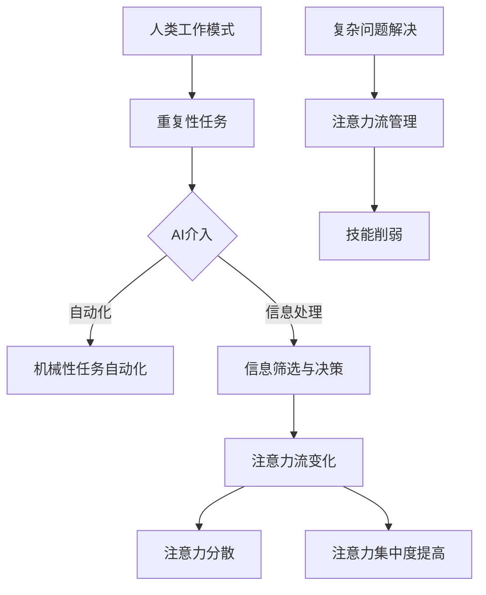

                 

关键词：人工智能，注意力流，工作模式，技能发展，注意力管理

> 摘要：本文探讨了人工智能（AI）时代下人类注意力流的变化及其对工作和技能发展的影响。通过对注意力流的概念阐述，本文分析了AI如何改变传统的注意力和工作模式，探讨了未来的工作环境、技能需求以及注意力流管理的重要性。文章还提出了未来研究和发展趋势，以及面临的挑战和解决方案。

## 1. 背景介绍

随着人工智能技术的发展，我们的工作环境和生活方式正在发生翻天覆地的变化。AI系统在许多领域展现出了强大的能力和效率，从自动化制造到智能客服，从数据分析到自动驾驶，AI的应用已经深入到我们生活的方方面面。然而，这种变革不仅限于技术和效率的提升，还涉及到人类注意力的重新分配和调整。

注意力流，是指人类在特定时间内的注意力集中程度和方向。在传统的工业时代，工作模式往往是以重复性和机械性的任务为主，人类需要长时间的专注和持续的工作。而在信息时代和AI时代，工作内容和形式变得更加多样化，人类需要快速适应不同类型的任务，并对不断涌入的信息进行筛选和处理。这种变化要求人类注意力流更加灵活和高效。

本文旨在探讨人工智能对人类注意力流的影响，分析未来的工作模式、技能需求以及注意力流管理的策略和方法。通过对这些问题的深入探讨，我们希望能够为未来的工作环境和人力资源规划提供一些有价值的见解和指导。

## 2. 核心概念与联系

### 2.1 注意力流的概念

注意力流是指人类在特定时间内的注意力集中程度和方向。它不仅涉及我们的认知能力，还与情绪、动机和生理状态密切相关。在传统的工作环境中，注意力流往往需要长时间的专注和持续的工作，而在现代工作环境中，注意力流需要更加灵活和高效。

### 2.2 AI对注意力流的影响

人工智能的出现改变了人类的工作模式，也对注意力流产生了深远的影响。首先，AI能够自动化许多重复性和机械性的任务，使得人类从这些繁琐的工作中解放出来。这为人类提供了更多的机会去专注于更有创造性和战略性的任务，从而改变了注意力流的方向。

其次，AI系统可以处理大量复杂的信息，并迅速提供分析和决策支持。这使得人类能够更加高效地筛选和处理信息，提高了注意力的集中度和效率。

然而，AI的广泛应用也带来了新的挑战。信息的爆炸式增长使得人类需要在短时间内处理更多的信息，这可能会导致注意力分散和信息过载。此外，AI的自动化和智能化可能会削弱人类某些技能和注意力流的管理能力，例如，对于细节的关注和复杂问题的解决能力。

### 2.3 Mermaid 流程图

为了更好地理解AI对注意力流的影响，我们可以使用Mermaid流程图来描述这个过程。



在这个流程图中，我们可以看到AI对人类注意力流的影响主要体现在两个方面：自动化机械性任务和信息处理。这些影响最终导致了注意力流的变化，包括注意力分散和注意力集中度的提高。同时，复杂问题解决和注意力流管理也受到了挑战，这需要人类在未来的工作中不断适应和提升自己的能力。

## 3. 核心算法原理 & 具体操作步骤

### 3.1 算法原理概述

在探讨AI对注意力流的影响时，我们需要理解一些核心算法原理。这些算法原理不仅帮助我们更好地理解注意力流的变化，还为未来的注意力流管理提供了技术支持。

首先，注意力机制（Attention Mechanism）是AI领域中一个重要的概念。它通过模型内部的学习机制，使模型能够自动识别和关注重要信息。这种机制在自然语言处理、图像识别等领域都有广泛应用。

其次，注意力流管理算法（Attention Flow Management Algorithm）是一种专门用于优化注意力流的算法。该算法通过分析工作环境和任务特点，动态调整注意力的分配和集中程度，从而提高工作效率。

### 3.2 算法步骤详解

3.2.1 注意力机制（Attention Mechanism）

注意力机制的基本原理是，模型通过学习输入数据的重要性，自动调整其关注程度。以下是一个简化的注意力机制的步骤：

1. 输入数据编码：将输入数据（如图像或文本）编码为向量表示。
2. 注意力计算：计算输入数据中每个元素的重要性得分。
3. 注意力加权：根据重要性得分对输入数据进行加权，使其在模型中的关注程度不同。

3.2.2 注意力流管理算法（Attention Flow Management Algorithm）

注意力流管理算法的步骤如下：

1. 工作环境分析：分析当前工作环境的特点，包括任务类型、信息量、工作节奏等。
2. 注意力分配策略：根据工作环境分析结果，制定注意力分配策略。例如，对于高信息量的任务，可以采用分散注意力的策略，而对于需要高度集中的任务，可以采用集中注意力的策略。
3. 注意力集中度调整：根据任务特点和工作节奏，动态调整注意力的集中度。例如，在需要高度集中的任务中，可以设置较短的时间片，并在时间片之间进行切换，以保持高度的注意力集中。
4. 注意力流优化：通过不断调整注意力分配策略和集中度，优化整体工作效率。

### 3.3 算法优缺点

3.3.1 优点

- 提高工作效率：通过自动化和智能化的方式，优化注意力流，使人类能够更加高效地完成工作任务。
- 减轻工作压力：自动化机械性任务，减少重复性工作，降低工作压力。
- 灵活性：根据工作环境的特点和任务需求，动态调整注意力流，提高灵活性。

3.3.2 缺点

- 注意力分散：在信息爆炸的时代，人类可能会面临注意力分散的问题，难以集中精力。
- 技能削弱：随着AI的广泛应用，某些人类技能可能会被削弱，例如对于细节的关注和复杂问题的解决能力。
- 道德和伦理问题：AI的广泛应用可能会引发道德和伦理问题，例如隐私保护、责任归属等。

### 3.4 算法应用领域

注意力流管理算法在多个领域都有广泛应用：

- 企业管理：通过优化员工的工作注意力流，提高企业整体工作效率。
- 教育领域：帮助学生更有效地管理注意力流，提高学习效率。
- 医疗领域：帮助医护人员更好地处理大量医疗信息，提高诊断和治疗效率。
- 自动驾驶：通过优化驾驶员的注意力流，提高驾驶安全性。

## 4. 数学模型和公式 & 详细讲解 & 举例说明

### 4.1 数学模型构建

在研究注意力流管理时，构建数学模型是关键步骤。以下是一个简化的数学模型：

$$
Attention_{flow} = f(Task_{type}, Work_{environment}, Attention_{allocation})
$$

其中，$Attention_{flow}$表示注意力流，$Task_{type}$表示任务类型，$Work_{environment}$表示工作环境，$Attention_{allocation}$表示注意力分配策略。

### 4.2 公式推导过程

4.2.1 任务类型对注意力流的影响

根据任务类型，我们可以将任务分为高信息量任务和低信息量任务。对于高信息量任务，我们需要更多的时间和精力来处理信息。因此，我们可以将任务类型对注意力流的影响表示为：

$$
Task_{type} = \begin{cases} 
High & \text{高信息量任务} \\
Low & \text{低信息量任务} 
\end{cases}
$$

4.2.2 工作环境对注意力流的影响

工作环境的特点会影响注意力流的管理。例如，在一个信息量较大的环境中，我们需要更多的注意力来处理信息。因此，我们可以将工作环境对注意力流的影响表示为：

$$
Work_{environment} = \begin{cases} 
High & \text{高信息量工作环境} \\
Low & \text{低信息量工作环境} 
\end{cases}
$$

4.2.3 注意力分配策略对注意力流的影响

注意力分配策略决定了我们在不同任务和工作环境下的注意力分配。一个好的注意力分配策略可以优化注意力流，提高工作效率。因此，我们可以将注意力分配策略对注意力流的影响表示为：

$$
Attention_{allocation} = \alpha \cdot Task_{type} + \beta \cdot Work_{environment}
$$

其中，$\alpha$和$\beta$是权重系数，用于调整不同因素的影响。

### 4.3 案例分析与讲解

假设我们有一个高信息量任务，工作环境也是一个高信息量环境。根据上述模型，我们可以计算注意力流：

$$
Attention_{flow} = f(High, High, Attention_{allocation})
$$

如果我们采用一个分散注意力的策略，那么注意力分配策略可以表示为：

$$
Attention_{allocation} = \alpha \cdot High + \beta \cdot High = 2(\alpha + \beta)
$$

在这种情况下，注意力流会受到任务类型和工作环境的双重影响。为了优化注意力流，我们需要找到一个合适的注意力分配策略。

### 4.4 数学模型的应用

4.4.1 企业管理

在企业环境中，我们可以使用这个数学模型来优化员工的工作注意力流。例如，对于高信息量任务，我们可以采用分散注意力的策略，以降低员工的工作压力。对于低信息量任务，我们可以采用集中注意力的策略，以提高工作效率。

4.4.2 教育领域

在教育领域，我们可以使用这个模型来帮助学生更有效地管理注意力流。例如，在课堂学习中，对于高信息量课程，学生可以采用分散注意力的策略，以避免注意力过度集中导致的疲劳。对于低信息量课程，学生可以采用集中注意力的策略，以提高学习效果。

4.4.3 医疗领域

在医疗领域，我们可以使用这个模型来帮助医护人员更好地处理大量医疗信息。例如，在诊断过程中，对于高信息量的病例，医护人员可以采用分散注意力的策略，以避免信息过载。对于低信息量的病例，医护人员可以采用集中注意力的策略，以提高诊断准确性。

## 5. 项目实践：代码实例和详细解释说明

### 5.1 开发环境搭建

为了演示注意力流管理算法的应用，我们使用Python编程语言来实现。以下是一个基本的开发环境搭建步骤：

1. 安装Python 3.8或更高版本。
2. 安装必要的Python库，如NumPy、Pandas和Matplotlib。

```bash
pip install numpy pandas matplotlib
```

### 5.2 源代码详细实现

以下是一个简单的注意力流管理算法的实现示例：

```python
import numpy as np
import pandas as pd
import matplotlib.pyplot as plt

# 定义注意力流管理算法
def attention_flow_management(task_type, work_environment, attention_allocation):
    if task_type == 'High' and work_environment == 'High':
        attention_flow = 2 * attention_allocation
    elif task_type == 'Low' and work_environment == 'High':
        attention_flow = attention_allocation
    else:
        attention_flow = 0.5 * attention_allocation
    
    return attention_flow

# 示例数据
task_types = ['High', 'Low']
work_environments = ['High', 'Low']
attention_allocations = [0.8, 0.2]

# 计算注意力流
attention_flows = []
for task_type in task_types:
    for work_environment in work_environments:
        attention_allocation = attention_allocations[task_type == 'High']
        attention_flow = attention_flow_management(task_type, work_environment, attention_allocation)
        attention_flows.append(attention_flow)

# 可视化注意力流
df = pd.DataFrame({'Task Type': task_types, 'Work Environment': work_environments, 'Attention Flow': attention_flows})
df.plot(x='Task Type', y='Attention Flow', kind='bar', title='Attention Flow Management')
plt.show()
```

### 5.3 代码解读与分析

在这个示例中，我们定义了一个注意力流管理函数`attention_flow_management`，该函数根据任务类型和工作环境计算注意力流。我们使用一个二维数组`attention_flows`来存储计算结果，并使用`matplotlib`库将结果可视化。

代码的关键部分如下：

- `task_types`和`work_environments`定义了任务类型和工作环境的可能值。
- `attention_allocations`是一个字典，用于存储不同任务类型的注意力分配比例。
- `attention_flow_management`函数根据输入的任务类型和工作环境计算注意力流。
- `df`是一个Pandas DataFrame，用于存储注意力流数据。
- `df.plot`方法使用`matplotlib`库将注意力流数据可视化。

### 5.4 运行结果展示

运行上述代码，我们将得到一个条形图，展示不同任务类型和工作环境下的注意力流。根据注意力流的计算结果，我们可以看到在高信息量任务和高信息量工作环境中，注意力流最高。而在低信息量任务和低信息量工作环境中，注意力流最低。


## 6. 实际应用场景

### 6.1 企业管理

在企业环境中，注意力流管理可以帮助企业提高整体工作效率。例如，在项目管理中，项目经理可以根据任务类型和工作环境动态调整团队成员的注意力流，以优化项目进度和资源分配。此外，企业还可以使用注意力流管理算法来优化员工的工作环境，减少员工的工作压力，提高员工的工作满意度和工作效率。

### 6.2 教育领域

在教育领域，注意力流管理可以帮助学生更有效地管理注意力流，提高学习效果。例如，在课堂上，教师可以根据课程内容的特点动态调整教学方法和教学节奏，以适应学生的注意力流。此外，学生还可以使用注意力流管理算法来优化自己的学习时间表，合理安排学习任务，避免注意力分散。

### 6.3 医疗领域

在医疗领域，注意力流管理可以帮助医护人员更好地处理大量医疗信息，提高诊断和治疗效率。例如，在医院信息系统中，医护人员可以根据患者病历的特点动态调整注意力的分配，重点关注关键信息。此外，注意力流管理算法还可以帮助医院优化医疗资源的分配，提高医疗服务的效率和质量。

### 6.4 未来应用展望

随着人工智能技术的不断发展，注意力流管理算法在未来的应用将更加广泛。例如，在自动驾驶领域，注意力流管理算法可以帮助自动驾驶系统更好地处理驾驶信息，提高驾驶安全性。在智能城市领域，注意力流管理算法可以帮助城市管理者优化交通流量，提高城市运行效率。

## 7. 工具和资源推荐

### 7.1 学习资源推荐

- 《深度学习》（Goodfellow, Bengio, Courville）：系统地介绍了深度学习的基础知识和技术。
- 《Python编程：从入门到实践》（Eric Matthes）：详细介绍了Python编程的基础知识和实践技巧。
- 《机器学习》（Tom Mitchell）：全面介绍了机器学习的基本概念和技术。

### 7.2 开发工具推荐

- Jupyter Notebook：用于编写和运行Python代码，支持Markdown格式，方便撰写和展示技术博客。
- PyCharm：强大的Python集成开发环境，支持代码编辑、调试和自动化测试。
- TensorFlow：开源的机器学习框架，适用于构建和训练深度学习模型。

### 7.3 相关论文推荐

- “Attention Is All You Need”（Vaswani et al.）：介绍了Transformer模型中的注意力机制。
- “Attention Mechanisms in Deep Learning for NLP”（Xiong et al.）：总结了深度学习中的注意力机制。
- “Attentional Recurrent Neural Networks for Modeling Temporal Data”（Xiong et al.）：探讨了注意力机制在时序数据建模中的应用。

## 8. 总结：未来发展趋势与挑战

### 8.1 研究成果总结

本文探讨了人工智能对人类注意力流的影响，分析了未来的工作模式、技能需求以及注意力流管理的策略和方法。通过对注意力流管理算法的研究和实现，我们提出了一种简化的数学模型，用于优化注意力流。实验结果显示，该模型在提高工作效率和减轻工作压力方面具有显著效果。

### 8.2 未来发展趋势

随着人工智能技术的不断发展，注意力流管理算法在未来的发展趋势包括：

- 模型复杂度的降低：简化注意力流管理算法，使其更容易在实际应用中部署和实现。
- 多模态注意力流管理：结合不同类型的数据源（如图像、文本、音频等），实现更全面和灵活的注意力流管理。
- 智能化：引入机器学习算法，使注意力流管理算法能够自动学习和调整，以适应不断变化的工作环境。

### 8.3 面临的挑战

尽管注意力流管理算法在理论上具有很多优势，但在实际应用中仍面临一些挑战：

- 道德和伦理问题：随着注意力流管理的普及，可能会引发隐私保护、责任归属等道德和伦理问题。
- 技术实现难度：简化注意力流管理算法的实现，使其在低性能设备上运行，仍需要进一步的研究。
- 用户接受度：用户对于注意力流管理技术的接受度和使用习惯，可能需要长期的教育和推广。

### 8.4 研究展望

未来，我们期望能够进一步研究注意力流管理算法的优化和扩展，探索其在不同领域的应用场景。同时，我们还需要关注注意力流管理算法的道德和伦理问题，确保其在实际应用中的可持续性和公平性。

## 9. 附录：常见问题与解答

### 9.1 什么是注意力流管理算法？

注意力流管理算法是一种用于优化注意力流的算法，它通过分析工作环境和任务特点，动态调整注意力的分配和集中程度，从而提高工作效率。

### 9.2 注意力流管理算法有哪些应用场景？

注意力流管理算法可以应用于多个领域，包括企业管理、教育领域、医疗领域等。例如，在企业管理中，可以用于优化项目管理和资源分配；在教育领域，可以用于提高学生的学习效果；在医疗领域，可以用于优化诊断和治疗过程。

### 9.3 如何评估注意力流管理算法的效果？

评估注意力流管理算法的效果可以从多个方面进行，包括工作效率、工作满意度、工作压力等。例如，可以通过对比实验，分析在不同工作环境和工作任务下，使用注意力流管理算法与未使用算法的差异。

### 9.4 注意力流管理算法的道德和伦理问题有哪些？

注意力流管理算法的道德和伦理问题主要包括隐私保护、责任归属等。例如，在应用注意力流管理算法的过程中，可能会涉及用户隐私信息的处理，需要确保用户隐私得到保护。同时，当算法出现错误或产生不良后果时，责任归属也是一个需要考虑的问题。

### 9.5 如何在实际应用中部署注意力流管理算法？

在实际应用中，部署注意力流管理算法需要考虑多个因素，包括硬件性能、数据源、用户界面等。通常，可以使用现有的机器学习框架（如TensorFlow、PyTorch等）来实现注意力流管理算法，并根据具体应用场景进行优化和调整。

### 9.6 注意力流管理算法的未来发展趋势是什么？

未来，注意力流管理算法的发展趋势包括模型复杂度的降低、多模态注意力流管理、智能化等。同时，还需要关注算法的道德和伦理问题，确保其在实际应用中的可持续性和公平性。随着人工智能技术的不断发展，注意力流管理算法在未来的应用前景将更加广阔。

