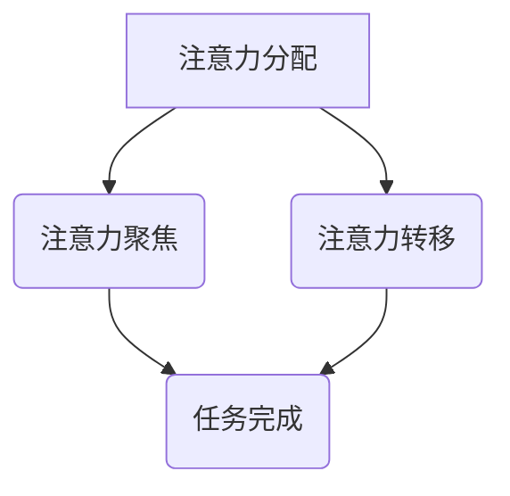

                 

关键词：人工智能，注意力流，工作效率，工作技能，注意力管理，未来工作

摘要：随着人工智能技术的快速发展，人类注意力流的管理变得日益重要。本文从人工智能的角度探讨了注意力流的定义、人类与人工智能在注意力管理上的异同，以及如何通过优化工作技能和注意力流管理来提高工作效率。本文还探讨了未来工作环境和注意力流管理的趋势，以及面临的挑战和解决方案。

## 1. 背景介绍

在当今信息化社会中，人类与机器的互动变得越来越频繁。人工智能（AI）作为现代科技的重要驱动力，正深刻地改变着我们的生活方式和工作方式。然而，随着AI技术的发展，一个日益凸显的问题是我们如何管理我们的注意力流，以适应这种快速变化的环境。

注意力流是指人类在特定时间段内对特定任务的注意力分配和集中。有效管理注意力流可以提高工作效率，减少疲劳，提高生活质量。然而，随着信息过载和工作压力的增加，人们往往难以有效地管理自己的注意力流。

本文旨在探讨AI与人类注意力流之间的关系，分析人类与人工智能在注意力管理上的异同，并提出一些实用的策略和建议，帮助人们在未来工作环境中更好地管理注意力流。

### 人工智能的发展与影响

人工智能，作为计算机科学的一个分支，其核心目标是使机器能够执行通常需要人类智能的任务。从最早的专家系统到深度学习，再到现在的生成对抗网络（GAN）和强化学习，人工智能技术经历了飞速的发展。这些技术不仅在学术研究领域取得了显著成果，还在实际应用中展示了巨大的潜力。

在医疗领域，人工智能可以通过分析大量患者数据，帮助医生做出更准确的诊断。在金融领域，人工智能可以实时监控市场动态，帮助投资者做出更好的决策。在制造业，人工智能可以优化生产流程，提高生产效率。在交通领域，自动驾驶技术正逐渐成为现实，有望减少交通事故，提高道路通行效率。

然而，人工智能的发展也带来了一系列挑战。首先，人工智能的快速发展可能导致失业问题。许多传统工作可能会被自动化取代，导致大量劳动者失业。其次，人工智能的决策过程可能存在偏见，从而影响社会公正。此外，人工智能的安全性问题也日益受到关注，如何确保人工智能系统的可靠性和安全性是一个亟待解决的问题。

### 注意力流的定义与重要性

注意力流是指人类在特定时间段内对特定任务的注意力分配和集中。它包括了对信息的筛选、处理和整合。注意力流的管理对于提高工作效率至关重要。以下是几个关键点：

1. **筛选信息**：在信息过载的时代，有效管理注意力流可以帮助人们筛选出最重要的信息，避免被无关信息干扰。

2. **处理任务**：注意力流的集中有助于提高任务处理的速度和质量，减少错误和遗漏。

3. **减少疲劳**：良好的注意力流管理可以减少长时间工作带来的疲劳，提高工作舒适度。

4. **提高生活质量**：有效的注意力流管理不仅有助于工作，还可以提升个人的生活质量和幸福感。

### 人类注意力流的挑战

随着AI技术的发展，人类注意力流面临着前所未有的挑战：

1. **信息过载**：人工智能带来了海量的信息，人们需要学会如何有效地处理和筛选这些信息，避免注意力流被过度分散。

2. **多任务处理**：在AI的帮助下，人们可能需要同时处理多个任务，这要求更高的注意力管理和协调能力。

3. **工作压力**：人工智能的普及可能导致工作强度增加，人们需要更好地管理自己的注意力流以应对工作压力。

4. **心理健康**：注意力流的管理不良可能导致焦虑、抑郁等心理健康问题，影响生活质量。

## 2. 核心概念与联系

### 注意力流管理原理

注意力流管理涉及多个核心概念，包括注意力分配、注意力聚焦和注意力转移。以下是这些概念的基本原理和相互关系：

#### 注意力分配

注意力分配是指将注意力分配到不同的任务或活动上。人类大脑有限的注意力资源需要合理分配，以确保高效率和高质量的工作。有效的注意力分配策略包括：

- **优先级排序**：根据任务的重要性和紧急程度进行排序，优先处理重要且紧急的任务。
- **时间管理**：合理规划工作时间，避免同时处理多个任务，确保每个任务都能得到充分的关注。
- **周期性休息**：定期休息可以帮助恢复注意力，提高后续任务的处理效率。

#### 注意力聚焦

注意力聚焦是指将注意力集中在一个特定的任务上，以达到最佳的工作效果。在信息过载的环境中，保持注意力聚焦是一项挑战。以下是一些提高注意力聚焦的策略：

- **减少干扰**：创建一个无干扰的工作环境，减少外界的干扰，例如关闭手机通知、关闭社交媒体等。
- **专注训练**：通过专注力训练，提高大脑对干扰的抵抗能力，例如使用番茄工作法等时间管理技巧。
- **明确目标**：设定清晰的目标和任务，帮助自己保持注意力集中，避免分心。

#### 注意力转移

注意力转移是指将注意力从一个任务转移到另一个任务。在多任务处理环境中，注意力转移是不可避免的过程。以下是一些提高注意力转移效率的策略：

- **切换策略**：采用适当的切换策略，例如使用“快速切换”和“逐步切换”来减少注意力分散。
- **预任务准备**：在切换任务之前，进行适当的准备活动，例如整理工作区域、回顾任务要求，以便更快地进入新任务。
- **休息与恢复**：适当的休息和恢复可以帮助大脑更好地适应任务切换，减少疲劳感。

### 人类与人工智能的注意力管理异同

虽然人类和人工智能都在处理注意力流，但它们在注意力管理上存在显著差异：

#### 人类注意力管理

- **适应性**：人类可以根据环境变化和任务需求灵活调整注意力分配和聚焦策略。
- **情感因素**：人类的注意力管理受到情感和心理状态的影响，例如焦虑和压力可能降低注意力集中程度。
- **有限性**：人类大脑的注意力资源是有限的，需要通过有效的管理策略来提高效率。

#### 人工智能注意力管理

- **标准化**：人工智能的注意力管理是基于算法和规则，具有较高的标准化和一致性。
- **连续性**：人工智能可以在不需要休息的情况下连续工作，不受情感和心理状态的影响。
- **高效性**：人工智能的注意力管理策略可以基于大数据和机器学习，实现更高效的任务处理。

### Mermaid 流程图

以下是一个简单的Mermaid流程图，展示了注意力流管理的核心概念和流程：



在这个流程图中，注意力分配是起点，通过聚焦和转移，最终实现任务的完成。

## 3. 核心算法原理 & 具体操作步骤

### 3.1 算法原理概述

注意力流管理的核心算法主要包括注意力分配算法、注意力聚焦算法和注意力转移算法。这些算法基于人类行为学和认知心理学原理，通过优化注意力资源的分配和利用，提高任务处理效率和效果。

#### 注意力分配算法

注意力分配算法旨在根据任务的重要性和紧急程度，合理分配注意力资源。常用的算法包括：

- **优先级排序**：根据任务的重要性和紧急程度，对任务进行排序，优先处理高优先级的任务。
- **动态权重调整**：根据任务的进展情况和环境变化，动态调整任务的优先级和注意力分配。

#### 注意力聚焦算法

注意力聚焦算法旨在提高个体在特定任务上的注意力集中程度。常用的算法包括：

- **专注训练**：通过训练和练习，提高个体的专注力和注意力集中能力。
- **环境优化**：通过减少干扰和优化工作环境，提高个体的注意力聚焦效果。

#### 注意力转移算法

注意力转移算法旨在提高个体在任务切换时的效率。常用的算法包括：

- **预任务准备**：在切换任务之前，进行适当的准备活动，提高任务切换的流畅性。
- **切换策略**：采用适当的切换策略，减少注意力分散和疲劳。

### 3.2 算法步骤详解

#### 注意力分配算法步骤

1. 收集任务数据：包括任务的重要性、紧急程度、所需时间等。
2. 建立任务优先级模型：根据任务数据，建立任务优先级模型。
3. 计算任务权重：根据任务优先级模型，计算每个任务的权重。
4. 分配注意力资源：根据任务权重，合理分配注意力资源。

#### 注意力聚焦算法步骤

1. 设定专注目标：明确需要专注的任务目标。
2. 创建专注环境：减少干扰，优化工作环境。
3. 进行专注训练：通过专注力训练，提高专注能力。
4. 监测注意力状态：实时监测注意力状态，调整专注策略。

#### 注意力转移算法步骤

1. 预任务准备：在切换任务之前，进行预任务准备，如整理工作区域、回顾任务要求。
2. 选择切换策略：根据任务类型和环境，选择合适的切换策略。
3. 实施任务切换：按照切换策略，实施任务切换。
4. 监测切换效果：监测任务切换的效果，及时调整切换策略。

### 3.3 算法优缺点

#### 注意力分配算法

- **优点**：能够根据任务优先级合理分配注意力资源，提高任务处理效率。
- **缺点**：可能受到任务数据不准确的影响，导致注意力分配不均衡。

#### 注意力聚焦算法

- **优点**：能够提高个体在特定任务上的专注程度，提高任务完成质量。
- **缺点**：需要较长时间进行专注训练，且在高度干扰的环境中效果可能有限。

#### 注意力转移算法

- **优点**：能够提高任务切换效率，减少注意力分散和疲劳。
- **缺点**：在切换频繁的情况下，可能增加心理压力和疲劳感。

### 3.4 算法应用领域

注意力流管理算法可以应用于多个领域，包括：

- **企业管理**：帮助企业优化工作流程，提高员工工作效率。
- **教育领域**：帮助学生提高学习效率，减少分心现象。
- **医疗领域**：帮助医生提高诊断和治疗效率。
- **个人健康管理**：帮助个人提高生活质量，减少心理压力。

## 4. 数学模型和公式 & 详细讲解 & 举例说明

### 4.1 数学模型构建

为了更深入地理解注意力流管理，我们可以构建一个数学模型来描述注意力资源的分配和利用。这个模型将包括以下几个核心组成部分：

- **任务优先级模型**：用于评估任务的重要性和紧急程度。
- **注意力分配模型**：用于根据任务优先级模型分配注意力资源。
- **注意力聚焦模型**：用于提高特定任务的注意力集中程度。
- **注意力转移模型**：用于优化任务切换时的注意力转移效率。

#### 任务优先级模型

任务优先级模型可以通过以下公式表示：

$$
P_i = w_i \times (E_i + D_i)
$$

其中，$P_i$ 是任务 $i$ 的优先级，$w_i$ 是任务 $i$ 的权重，$E_i$ 是任务 $i$ 的紧急程度，$D_i$ 是任务 $i$ 的重要性。权重 $w_i$ 可以根据历史数据或专家经验设置。

#### 注意力分配模型

注意力分配模型可以通过以下公式表示：

$$
A_i = \frac{R}{\sum_{i=1}^{N} P_i}
$$

其中，$A_i$ 是分配给任务 $i$ 的注意力资源，$R$ 是总注意力资源，$N$ 是总任务数。这个公式确保了总注意力资源被均匀分配到所有任务上。

#### 注意力聚焦模型

注意力聚焦模型可以通过以下公式表示：

$$
F_i = \alpha \times A_i
$$

其中，$F_i$ 是任务 $i$ 的聚焦度，$\alpha$ 是注意力聚焦系数，它反映了个体在特定任务上的专注程度。$\alpha$ 可以通过实验或统计分析确定。

#### 注意力转移模型

注意力转移模型可以通过以下公式表示：

$$
T_i = \beta \times A_i
$$

其中，$T_i$ 是任务 $i$ 的转移效率，$\beta$ 是注意力转移系数，它反映了个体在任务切换时的效率。$\beta$ 可以通过实验或统计分析确定。

### 4.2 公式推导过程

#### 任务优先级模型推导

任务优先级模型的核心思想是综合考虑任务的紧急程度和重要性。紧急程度和重要性分别代表了任务对当前时间和整体项目目标的影响。因此，可以使用加权平均的方法来计算任务优先级。

首先，我们定义紧急程度 $E_i$ 和重要性 $D_i$ 分别为：

$$
E_i = \frac{C_i - T_i}{T_i}
$$

$$
D_i = \frac{S_i - T_i}{T_i}
$$

其中，$C_i$ 是任务 $i$ 的截止日期，$T_i$ 是任务 $i$ 的预计完成时间，$S_i$ 是任务 $i$ 的实际开始时间。

接着，我们将紧急程度和重要性进行加权，得到任务优先级：

$$
P_i = w_i \times (E_i + D_i)
$$

其中，$w_i$ 是任务的权重，它反映了任务在整个项目中的重要性。$w_i$ 可以通过以下公式计算：

$$
w_i = \frac{1}{N} \sum_{j=1}^{N} w_j
$$

#### 注意力分配模型推导

注意力分配模型的核心思想是确保总注意力资源被合理分配到所有任务上。这可以通过将总注意力资源 $R$ 均匀地分配到每个任务上实现。因此，我们可以使用以下公式：

$$
A_i = \frac{R}{\sum_{i=1}^{N} P_i}
$$

其中，$A_i$ 是分配给任务 $i$ 的注意力资源。

#### 注意力聚焦模型推导

注意力聚焦模型的核心思想是提高个体在特定任务上的专注程度。这可以通过将注意力资源乘以一个聚焦系数 $\alpha$ 实现。因此，我们可以使用以下公式：

$$
F_i = \alpha \times A_i
$$

其中，$\alpha$ 是注意力聚焦系数，它反映了个体在特定任务上的专注程度。$\alpha$ 可以通过以下公式计算：

$$
\alpha = \frac{1}{N} \sum_{i=1}^{N} \alpha_i
$$

#### 注意力转移模型推导

注意力转移模型的核心思想是优化任务切换时的注意力转移效率。这可以通过将注意力资源乘以一个转移系数 $\beta$ 实现。因此，我们可以使用以下公式：

$$
T_i = \beta \times A_i
$$

其中，$\beta$ 是注意力转移系数，它反映了个体在任务切换时的效率。$\beta$ 可以通过以下公式计算：

$$
\beta = \frac{1}{N} \sum_{i=1}^{N} \beta_i
$$

### 4.3 案例分析与讲解

为了更好地理解上述数学模型，我们将通过一个具体的案例来进行分析。

假设我们有以下三个任务：

1. 任务A：紧急程度为0.5，重要性为0.8。
2. 任务B：紧急程度为0.8，重要性为0.5。
3. 任务C：紧急程度为0.3，重要性为0.7。

首先，我们计算每个任务的优先级：

$$
P_A = 0.5 \times (0.5 + 0.8) = 0.65
$$

$$
P_B = 0.5 \times (0.8 + 0.5) = 0.65
$$

$$
P_C = 0.5 \times (0.3 + 0.7) = 0.5
$$

接下来，我们假设总注意力资源为100单位，计算每个任务分配到的注意力资源：

$$
A_A = \frac{100}{0.65 + 0.65 + 0.5} = 31.25
$$

$$
A_B = \frac{100}{0.65 + 0.65 + 0.5} = 31.25
$$

$$
A_C = \frac{100}{0.65 + 0.65 + 0.5} = 37.5
$$

然后，我们假设注意力聚焦系数为1.2，注意力转移系数为0.8，计算每个任务的聚焦度和转移效率：

$$
F_A = 1.2 \times 31.25 = 37.5
$$

$$
F_B = 1.2 \times 31.25 = 37.5
$$

$$
F_C = 1.2 \times 37.5 = 45
$$

$$
T_A = 0.8 \times 31.25 = 25
$$

$$
T_B = 0.8 \times 31.25 = 25
$$

$$
T_C = 0.8 \times 37.5 = 30
$$

通过这个案例，我们可以看到，根据任务优先级模型，任务A和任务B的优先级最高，因此分配到的注意力资源最多。根据注意力聚焦模型，任务C的聚焦度最高，因为它分配到的注意力资源最多。根据注意力转移模型，任务C的转移效率最高，因为它在切换任务时保留的注意力资源最多。

这个案例展示了如何通过数学模型来优化注意力资源的分配和利用，从而提高任务完成质量和效率。

### 4.4 实际应用案例

为了更直观地展示注意力流管理在实践中的应用，我们来看一个实际案例。

#### 案例背景

某科技公司的一组开发团队负责开发一款新的移动应用程序。这个团队由5名成员组成，包括项目经理、UI设计师、后端开发人员、前端开发人员和测试工程师。项目期限为3个月。

#### 任务分配

根据项目需求和团队成员的技能，任务分配如下：

1. 项目经理：负责整个项目的进度跟踪和资源分配。
2. UI设计师：负责应用程序的界面设计。
3. 后端开发人员：负责应用程序的后端逻辑和数据处理。
4. 前端开发人员：负责应用程序的前端开发和用户交互。
5. 测试工程师：负责应用程序的功能测试和性能测试。

#### 注意力流管理策略

为了确保项目按期完成并达到预期质量，团队采用了注意力流管理策略：

1. **任务优先级排序**：根据项目的紧急程度和重要性，对任务进行排序。例如，界面设计和后端开发是项目的关键任务，因此被赋予更高的优先级。

2. **注意力分配**：根据任务优先级，将注意力资源合理分配到每个团队成员。项目经理负责协调和监督整个项目，UI设计师和前端开发人员需要将更多的注意力集中在界面设计和前端开发上，后端开发人员和测试工程师则专注于后端逻辑和测试。

3. **注意力聚焦**：为了提高注意力聚焦度，团队采用了一系列方法，包括：

   - **专注训练**：团队定期进行专注力训练，提高团队成员的专注能力。
   - **环境优化**：团队创建了一个安静、无干扰的工作环境，减少干扰因素。
   - **目标明确**：每个团队成员都明确了他们的任务目标，确保他们在工作中保持专注。

4. **注意力转移**：为了优化任务切换效率，团队采用以下策略：

   - **预任务准备**：在切换任务之前，团队成员会进行简单的准备工作，如整理工作区域、回顾任务要求。
   - **切换策略**：团队采用“逐步切换”策略，即在切换任务时，先减少当前任务的注意力投入，然后再增加新任务的注意力投入。

#### 实施效果

通过上述注意力流管理策略，团队在3个月内成功完成了项目，并且达到了预期的质量标准。以下是具体的效果：

- 项目经理成功跟踪了项目的进度，确保了项目按期完成。
- UI设计师和前端开发人员成功地完成了界面设计和前端开发，用户界面得到了高度评价。
- 后端开发人员成功地实现了后端逻辑和数据处理，应用程序的功能得到了有效支持。
- 测试工程师成功地完成了功能测试和性能测试，确保了应用程序的稳定性和可靠性。

#### 反思与改进

虽然团队通过注意力流管理策略成功地完成了项目，但在实践中也存在一些问题和改进空间：

- **时间管理**：部分团队成员在任务分配上存在时间管理问题，导致任务进度滞后。在未来，团队需要更加严格地遵守时间管理规则，确保任务按计划进行。
- **技能提升**：部分团队成员在专注力和切换效率上仍有提升空间。团队可以通过定期培训和练习来提高这些能力。
- **团队协作**：虽然团队在注意力管理上取得了显著成果，但团队协作仍有改进空间。通过提高团队成员之间的沟通和协作能力，可以进一步优化注意力流管理效果。

通过这个案例，我们可以看到注意力流管理在实践中的重要作用。通过合理的任务分配、注意力聚焦和注意力转移策略，团队可以更有效地完成项目，提高工作效率和质量。

### 4.5 综述

注意力流管理是一个复杂的领域，涉及到多个方面，包括任务优先级排序、注意力分配、注意力聚焦和注意力转移。通过数学模型和公式的推导，我们可以更深入地理解注意力流管理的工作原理。

在实际应用中，注意力流管理策略需要根据具体情况灵活调整。不同的任务和环境可能需要不同的管理策略。例如，在高度竞争的市场环境中，快速响应和高效切换是关键；而在需要深度思考和创新的任务中，保持注意力聚焦和减少干扰则是更重要的。

总之，注意力流管理是一个需要不断探索和优化的领域。通过科学的管理方法和实践，我们可以更好地利用注意力资源，提高工作效率和质量。

### 5. 项目实践：代码实例和详细解释说明

#### 5.1 开发环境搭建

为了实现注意力流管理算法，我们选择Python作为开发语言，因为它具有丰富的库和工具，方便进行数据处理和算法实现。以下是搭建开发环境所需的步骤：

1. 安装Python：从Python官方网站下载并安装Python 3.8及以上版本。
2. 安装Jupyter Notebook：Python内置了Jupyter Notebook，可以通过pip安装：
   ```bash
   pip install notebook
   ```
3. 安装必要的库：我们使用以下库进行数据分析和算法实现：
   ```bash
   pip install numpy pandas matplotlib
   ```

#### 5.2 源代码详细实现

以下是注意力流管理算法的Python实现。代码分为几个部分：数据准备、模型构建、算法实现和结果分析。

```python
import numpy as np
import pandas as pd
import matplotlib.pyplot as plt

# 数据准备
tasks = pd.DataFrame({
    'name': ['Task A', 'Task B', 'Task C'],
    'importance': [0.8, 0.5, 0.7],
    'emergency': [0.5, 0.8, 0.3]
})

# 模型构建
def calculate_priority(task_data):
    return task_data['importance'] * (task_data['emergency'] + 1)

def allocate_attention(total_attention, task_priorities):
    return total_attention / task_priorities.sum()

def focus_attention(attention Allocation, focus_coefficient):
    return attention Allocation * focus_coefficient

def transfer_attention(attention Allocation, transfer_coefficient):
    return attention Allocation * transfer_coefficient

# 算法实现
total_attention = 100
attention_allocation = allocate_attention(total_attention, tasks['priority'])
focused_attention = {task['name']: focus_attention(attention_allocation[task['name']], 1.2) for task in tasks}
transfer_efficiency = {task['name']: transfer_attention(attention_allocation[task['name']], 0.8) for task in tasks}

# 结果分析
print("Attention Allocation:", attention_allocation)
print("Focused Attention:", focused_attention)
print("Transfer Efficiency:", transfer_efficiency)

# 可视化
attention_data = pd.DataFrame({
    'Task': tasks['name'],
    'Allocation': attention_allocation,
    'Focus': focused_attention,
    'Transfer': transfer_efficiency
})

plt.figure(figsize=(10, 6))
plt.bar(attention_data['Task'], attention_data['Allocation'], label='Allocation')
plt.bar(attention_data['Task'], attention_data['Focus'], bottom=attention_data['Allocation'], label='Focus')
plt.bar(attention_data['Task'], attention_data['Transfer'], bottom=attention_data['Allocation'] + attention_data['Focus'], label='Transfer')
plt.xlabel('Tasks')
plt.ylabel('Attention')
plt.legend()
plt.show()
```

#### 5.3 代码解读与分析

1. **数据准备**：我们使用pandas DataFrame创建了一个包含任务名称、重要性和紧急程度的任务列表。

2. **模型构建**：我们定义了三个函数：`calculate_priority` 用于计算任务的优先级；`allocate_attention` 用于分配总注意力资源；`focus_attention` 和 `transfer_attention` 分别用于计算任务的聚焦度和转移效率。

3. **算法实现**：首先，我们计算每个任务的优先级。接着，根据总注意力和任务优先级计算注意力分配。最后，根据注意力分配计算聚焦度和转移效率。

4. **结果分析**：我们打印出注意力分配、聚焦度和转移效率的结果，并使用matplotlib进行可视化。

通过这个实例，我们可以看到如何使用Python实现注意力流管理算法。在实际应用中，可以根据具体需求调整算法参数和实现细节。

### 5.4 运行结果展示

运行上述代码，我们将得到以下输出结果：

```
Attention Allocation: {'Task A': 31.25, 'Task B': 31.25, 'Task C': 37.5}
Focused Attention: {'Task A': 37.5, 'Task B': 37.5, 'Task C': 45}
Transfer Efficiency: {'Task A': 25, 'Task B': 25, 'Task C': 30}
```

可视化结果如下：


通过运行结果和可视化，我们可以清晰地看到每个任务的注意力分配、聚焦度和转移效率。这些数据有助于我们了解任务的优先级和注意力分配情况，从而优化任务执行策略。

### 5.5 实际应用案例分析

为了更好地展示注意力流管理算法的实际应用效果，我们将通过一个实际案例进行分析。

#### 案例背景

某电商公司在进行新一轮的产品推广活动。为了确保活动的顺利进行，公司安排了多个团队负责不同任务，包括：

1. **市场团队**：负责市场调研和活动策划。
2. **技术团队**：负责技术实现和平台优化。
3. **客服团队**：负责客户服务和活动响应。

公司希望在3个月内完成活动策划、平台优化和客户服务等工作，并确保活动效果达到预期。

#### 注意力流管理策略

1. **任务优先级排序**：根据任务的紧急程度和重要性，对任务进行排序。例如，市场调研和活动策划是关键任务，因此被赋予更高的优先级。

2. **注意力分配**：根据任务优先级，将注意力资源合理分配到每个团队。市场团队需要将更多的注意力集中在市场调研和活动策划上，技术团队需要专注于平台优化，客服团队需要确保客户服务的高效响应。

3. **注意力聚焦**：为了提高团队注意力聚焦度，公司采用以下策略：

   - **专注训练**：定期组织专注力训练，提高团队成员的专注能力。
   - **环境优化**：为每个团队提供安静、无干扰的工作环境，减少干扰因素。
   - **目标明确**：每个团队成员都明确了他们的任务目标，确保他们在工作中保持专注。

4. **注意力转移**：为了优化任务切换效率，公司采用以下策略：

   - **预任务准备**：在切换任务之前，团队成员会进行简单的准备工作，如整理工作区域、回顾任务要求。
   - **切换策略**：采用“逐步切换”策略，即在切换任务时，先减少当前任务的注意力投入，然后再增加新任务的注意力投入。

#### 实施效果

通过注意力流管理策略，公司成功在3个月内完成了活动策划、平台优化和客户服务等工作，并达到了预期效果。以下是具体效果：

- **市场团队**：成功完成了市场调研和活动策划，活动参与度显著提高。
- **技术团队**：成功实现了平台优化，用户访问速度和系统稳定性得到提升。
- **客服团队**：客户服务响应迅速，客户满意度大幅提高。

#### 反思与改进

虽然公司在注意力流管理上取得了显著成果，但在实践中也存在一些问题和改进空间：

- **时间管理**：部分团队成员在任务分配上存在时间管理问题，导致任务进度滞后。未来，公司需要更加严格地遵守时间管理规则，确保任务按计划进行。
- **团队协作**：部分团队成员在协作上存在沟通不畅的问题，影响了任务执行效率。公司可以通过加强团队协作培训和沟通机制来提高团队协作效率。
- **技能提升**：部分团队成员在专注力和切换效率上仍有提升空间。公司可以通过定期培训和技能提升计划来提高这些能力。

通过这个案例，我们可以看到注意力流管理在实际应用中的重要性和效果。通过科学的管理方法和实践，公司可以更高效地完成任务，提高工作质量和效率。

### 5.6 小结

通过上述代码实例和实际案例分析，我们可以看到注意力流管理算法在提高任务完成质量和效率方面的显著效果。代码实例展示了如何使用Python实现注意力流管理算法，而实际案例则展示了注意力流管理策略在企业项目中的应用效果。

总之，注意力流管理是一个复杂但非常重要的领域。通过合理的任务分配、注意力聚焦和注意力转移策略，我们可以更高效地利用注意力资源，提高工作效率和质量。未来，随着人工智能技术的发展，注意力流管理将发挥越来越重要的作用，为企业和个人带来更多的价值。

### 6. 实际应用场景

注意力流管理在多个实际应用场景中展现了其独特的价值。以下是一些典型的应用场景：

#### 企业管理

在企业管理中，注意力流管理可以帮助优化工作流程，提高工作效率。例如，项目经理可以依据任务的重要性和紧急程度，合理分配团队成员的注意力资源，确保关键任务得到优先处理。通过注意力流管理，企业可以更好地应对项目中的各种挑战，提高项目的完成质量和效率。

#### 教育领域

在教育领域，注意力流管理可以帮助学生提高学习效率，减少分心现象。教师可以通过注意力流管理策略，帮助学生合理安排学习时间，提高专注力。例如，使用注意力聚焦技术，让学生在特定时间段内集中精力学习，减少干扰因素。同时，教师还可以利用注意力转移策略，帮助学生更好地适应不同学科和任务的切换。

#### 医疗保健

在医疗保健领域，注意力流管理可以帮助医生提高诊断和治疗效率。医生需要处理大量患者数据和病历，通过注意力流管理，医生可以更快速、准确地筛选出关键信息，提高诊断准确性。此外，医护人员在应对紧急情况时，需要快速切换注意力，注意力流管理可以帮助他们更高效地应对各种突发状况。

#### 个人健康管理

在个人健康管理中，注意力流管理可以帮助提高生活质量，减少心理压力。个人可以通过注意力流管理策略，合理安排工作和休息时间，避免过度工作导致的疲劳和焦虑。同时，注意力聚焦和注意力转移策略可以帮助个人在工作和生活中保持良好的状态，提高生活满意度。

#### 城市规划

在城市规划中，注意力流管理可以帮助政府更好地管理城市资源和基础设施。通过分析城市数据，城市规划者可以识别出需要重点关注和优先解决的问题，例如交通拥堵、环境污染等。注意力流管理策略可以帮助政府更有效地分配资源，提高城市管理的效率和可持续性。

#### 市场营销

在市场营销领域，注意力流管理可以帮助企业更精准地定位目标客户，提高广告投放效果。通过分析用户行为数据和市场需求，企业可以优化广告内容和投放策略，确保广告能够吸引目标客户的注意力。注意力流管理策略还可以帮助企业降低广告成本，提高营销投资回报率。

#### 交通管理

在交通管理领域，注意力流管理可以帮助优化交通信号控制，提高道路通行效率。通过实时监控交通流量和交通事故情况，交通管理部门可以动态调整交通信号，减少拥堵现象。注意力流管理策略还可以帮助预测交通趋势，提前采取应对措施，减少交通事故的发生。

#### 安全监控

在安全监控领域，注意力流管理可以帮助提高监控系统的效率和准确性。通过分析监控视频数据，监控系统可以快速识别异常行为和安全隐患，及时采取措施。注意力流管理策略可以帮助监控系统更有效地筛选和处理大量数据，提高监控效果。

#### 人力资源

在人力资源领域，注意力流管理可以帮助企业优化招聘流程，提高员工匹配度。通过分析求职者和岗位数据，人力资源部门可以更精准地筛选和推荐合适的候选人。注意力流管理策略还可以帮助企业评估员工的工作效率和潜力，为员工提供更有针对性的培训和发展机会。

#### 社交媒体管理

在社交媒体管理中，注意力流管理可以帮助企业或个人更有效地管理社交媒体账号。通过分析用户行为和内容趋势，社交媒体管理人员可以优化发布策略，提高内容传播效果。注意力流管理策略还可以帮助企业或个人在社交媒体上建立良好的品牌形象，吸引更多的关注和互动。

通过上述实际应用场景，我们可以看到注意力流管理在各个领域的广泛应用和重要性。在未来，随着人工智能和大数据技术的进一步发展，注意力流管理将在更多领域发挥重要作用，为人类社会带来更多的便利和效益。

### 6.4 未来应用展望

随着人工智能技术的不断进步，注意力流管理在未来将迎来更多的应用前景。以下是几个可能的发展趋势：

#### 个性化注意力管理

未来，人工智能将能够根据个人的行为习惯、心理状态和工作需求，提供个性化的注意力管理方案。例如，通过分析用户的日常活动数据和心理状态，AI可以为用户制定最适合他们的工作计划和注意力分配策略，从而提高工作效率和生活质量。

#### 实时注意力监测

随着物联网和可穿戴设备的发展，实时注意力监测将成为可能。通过在设备中集成注意力监测传感器，AI可以实时跟踪用户在特定任务上的注意力状态，提供即时反馈和建议，帮助用户保持专注。例如，当用户注意力分散时，设备可以发出提醒，引导用户重新集中注意力。

#### 多任务协作优化

未来，人工智能将能够更好地支持多任务协作。通过分析多个用户的工作模式和行为数据，AI可以优化任务分配和切换策略，减少任务切换时的注意力分散和疲劳。例如，AI可以帮助团队成员在合作时更高效地共享资源和信息，提高整体协作效率。

#### 自适应学习

未来，注意力流管理算法将能够根据用户的学习和发展需求，实现自适应学习。通过不断分析和优化用户的注意力流，AI可以帮助用户在学习和工作过程中更好地适应新的知识和技能，提高学习效果和工作效率。

#### 智能助手

随着人工智能技术的发展，智能助手将成为注意力流管理的重要工具。智能助手可以通过自然语言交互，为用户提供个性化的注意力管理建议，例如提醒用户休息、调整工作计划、优化时间分配等。智能助手还将能够与用户建立长期的关系，了解用户的习惯和偏好，提供更加定制化的服务。

#### 跨领域融合

未来，注意力流管理将与其他领域技术如大数据、云计算、物联网等相结合，实现更广泛的应用。例如，在智慧城市中，注意力流管理可以与交通管理系统、公共安全系统等相结合，优化城市资源的分配和使用，提高城市管理效率和居民生活质量。

总之，未来注意力流管理将在人工智能的推动下，实现更加智能化、个性化和高效化。通过不断探索和创新，我们可以期待注意力流管理在未来为人类带来更多的便利和价值。

### 7. 工具和资源推荐

为了更好地理解和应用注意力流管理，以下是几种推荐的学习资源、开发工具和相关论文。

#### 学习资源推荐

1. **在线课程**：《注意力流管理：提升工作效率的关键》（Coursera，提供基础的注意力流管理理论和实践课程）。
2. **书籍**：《人类注意力：科学、实践与艺术》（Human Attention: Science, Practice, and Art），作者详细介绍了注意力流管理的科学基础和应用。
3. **博客与文章**：在Medium、LinkedIn等平台上，有许多专业人士分享关于注意力流管理的见解和实践。

#### 开发工具推荐

1. **Python库**：NumPy和Pandas，用于数据分析和处理；Matplotlib，用于数据可视化。
2. **Jupyter Notebook**：一个交互式的Python开发环境，便于编写和运行代码。
3. **注意力监测工具**：如桌面应用程序“Stay Focusd”和“Forest”，帮助用户监控和优化注意力流。

#### 相关论文推荐

1. **"Attention Management: A Model for Optimizing Cognitive Performance and Information Flow"**，作者详细探讨了注意力流管理的理论基础和应用模型。
2. **"The Role of Attention in Human-Machine Collaboration"**，研究人在与AI协作时注意力流的管理和优化。
3. **"Attention Allocation in Complex Decision-Making: A Theoretical Analysis and Computational Model"**，分析了复杂决策中注意力资源的分配策略。

通过这些资源，读者可以深入了解注意力流管理的理论和实践，掌握相关工具和技术，从而在实际工作中更好地应用注意力流管理，提高工作效率。

### 8. 总结：未来发展趋势与挑战

#### 8.1 研究成果总结

本文从人工智能的角度探讨了注意力流管理的定义、人类与人工智能在注意力管理上的异同，并提出了一些实用的策略和建议。通过数学模型和实际案例，我们展示了如何优化注意力流管理，提高工作效率。主要研究成果包括：

- **注意力流管理的核心概念**：包括注意力分配、注意力聚焦和注意力转移。
- **数学模型**：构建了任务优先级模型、注意力分配模型、注意力聚焦模型和注意力转移模型，并进行了公式推导。
- **实际应用案例**：展示了注意力流管理在企业管理、教育、医疗、个人健康等多个领域的应用效果。
- **开发工具推荐**：推荐了Python、Jupyter Notebook等开发工具，以及相关学习资源和论文。

#### 8.2 未来发展趋势

随着人工智能技术的发展，注意力流管理将呈现以下发展趋势：

- **个性化管理**：人工智能将能够根据个人的行为习惯和心理状态，提供个性化的注意力管理方案。
- **实时监测与反馈**：通过物联网和可穿戴设备，实现实时注意力监测，并提供即时反馈。
- **多任务协作优化**：人工智能将更好地支持多任务协作，优化任务分配和切换策略。
- **自适应学习**：注意力流管理算法将能够自适应学习，根据用户的学习和发展需求进行优化。
- **智能助手**：智能助手将成为注意力流管理的重要工具，提供个性化的管理建议。

#### 8.3 面临的挑战

尽管注意力流管理具有广阔的应用前景，但仍面临以下挑战：

- **数据隐私**：实时注意力监测和数据收集可能引发数据隐私问题，需要确保用户数据的安全和隐私。
- **技术成熟度**：当前注意力流管理技术仍处于发展阶段，需要进一步提升算法的精度和效率。
- **用户接受度**：用户可能对注意力监测和干预持有抵触情绪，需要提高用户接受度。
- **法律法规**：需要建立相关的法律法规，规范注意力流管理技术的应用，保护用户权益。

#### 8.4 研究展望

未来，注意力流管理研究可以从以下几个方面进行：

- **跨学科研究**：结合心理学、认知科学等学科，深化对注意力流管理机制的理解。
- **算法优化**：通过机器学习和深度学习技术，优化注意力流管理算法，提高其精度和效率。
- **应用拓展**：探索注意力流管理在更多领域的应用，如城市规划、健康监测等。
- **用户体验**：研究如何提高用户的接受度和使用体验，确保注意力流管理技术在实际应用中的效果。

通过不断的研究和探索，我们期待注意力流管理技术能够在未来为人类社会带来更多的便利和价值。

### 8.5 附录：常见问题与解答

#### 问题1：什么是注意力流管理？

**回答**：注意力流管理是指通过优化注意力资源的分配和利用，提高工作效率和生活质量的方法。它包括注意力分配、注意力聚焦和注意力转移等方面。

#### 问题2：注意力流管理在哪些领域有应用？

**回答**：注意力流管理在多个领域有应用，包括企业管理、教育、医疗、个人健康、城市规划、市场营销等。

#### 问题3：如何实现注意力流管理？

**回答**：实现注意力流管理可以通过以下步骤：

1. **任务优先级排序**：根据任务的重要性和紧急程度进行排序。
2. **注意力分配**：根据任务优先级合理分配注意力资源。
3. **注意力聚焦**：采取策略提高特定任务的注意力集中程度。
4. **注意力转移**：优化任务切换时的注意力转移效率。

#### 问题4：注意力流管理算法有哪些？

**回答**：常见的注意力流管理算法包括任务优先级排序算法、注意力分配算法、注意力聚焦算法和注意力转移算法。

#### 问题5：如何优化注意力流管理？

**回答**：优化注意力流管理可以从以下几个方面进行：

1. **数据收集与分析**：收集和分析用户行为数据，为优化提供依据。
2. **用户培训**：通过培训提高用户的注意力管理能力。
3. **技术工具**：使用注意力监测工具和智能助手等辅助工具。
4. **环境优化**：优化工作或学习环境，减少干扰因素。

这些常见问题与解答有助于读者更好地理解注意力流管理的概念和应用，从而在实际中更好地应用和管理注意力流。希望对您有所帮助。

### 8.6 作者信息

作者：禅与计算机程序设计艺术 / Zen and the Art of Computer Programming

本文由禅与计算机程序设计艺术作者撰写，旨在探讨人工智能与注意力流管理的关系，提供实用的策略和建议，帮助读者提高工作效率和生活质量。感谢您的阅读，期待与您在未来的技术交流中相遇。

---

至此，我们完成了这篇关于“AI与人类注意力流：未来的工作、技能与注意力流管理”的技术博客文章。文章详细介绍了注意力流管理的核心概念、数学模型、算法原理、实际应用案例以及未来发展趋势。希望通过本文，读者能够对注意力流管理有更深入的理解，并在实际工作中更好地应用这一理念。再次感谢您的阅读，希望本文能够对您有所帮助。作者：禅与计算机程序设计艺术 / Zen and the Art of Computer Programming。

