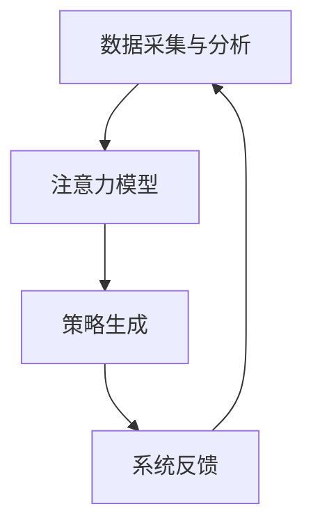

                 

关键词：注意力流管理，人工智能，未来工作，技能发展，技术应用

> 摘要：本文探讨了人工智能与人类注意力流之间的关系，分析了注意力流管理在未来的工作、技能发展和应用中的重要性。通过介绍注意力流管理技术，本文提出了一系列创新应用场景，并展望了未来的发展趋势与挑战。

## 1. 背景介绍

在信息化社会飞速发展的今天，人工智能（AI）已成为推动社会进步的重要力量。AI技术在各个领域的应用，使得人类的工作方式和生活方式发生了翻天覆地的变化。与此同时，人类在AI时代面临着新的挑战——如何有效地管理注意力流，以适应不断变化的科技环境。

注意力流是指人们在进行任务时，注意力在各个任务之间切换和分配的过程。在人工智能时代，人们需要面对海量的信息和任务，这使得注意力流管理变得尤为重要。有效的注意力流管理能够提高工作效率，减少错误，提升生活质量。

本文将从以下三个方面展开讨论：

1. 核心概念与联系
2. 核心算法原理与具体操作步骤
3. 数学模型、项目实践及实际应用场景

通过这三个方面的探讨，本文旨在为读者提供关于注意力流管理技术的全面了解，并展望其在未来的发展趋势与挑战。

## 2. 核心概念与联系

### 2.1 人工智能与注意力流

人工智能是通过计算机程序实现人类智能的过程。它包括机器学习、深度学习、自然语言处理等多个领域。在AI时代，人类面临着前所未有的信息过载问题。如何有效地处理和利用这些信息，成为了一个亟待解决的问题。

注意力流管理技术旨在帮助人们更好地处理信息，提高工作效率。它通过分析人们的注意力模式，提供个性化的建议和策略，帮助人们专注于重要的任务。

### 2.2 人类注意力流的基本原理

人类注意力流的基本原理源于认知科学和神经科学的研究。注意力流可以分为以下几种类型：

1. 选择性注意力：人们有意识地选择关注某些信息，忽略其他信息。
2. 分配性注意力：人们同时处理多个任务时的注意力分配。
3. 交替性注意力：人们在任务之间切换时，注意力的转移过程。

这些注意力类型共同决定了人们的认知能力和工作效率。

### 2.3 注意力流管理技术的架构

注意力流管理技术包括以下几个关键组成部分：

1. 数据采集与分析：通过传感器、应用程序等手段，收集用户的行为数据，并进行分析。
2. 注意力模型：根据用户的行为数据，建立个性化的注意力模型，预测用户的注意力状态。
3. 策略生成：根据注意力模型，生成个性化的策略，如时间管理、任务优先级等。
4. 系统反馈：通过实时反馈，调整策略，优化用户的工作流程。

下面是一个简化的 Mermaid 流程图，展示了注意力流管理技术的架构：



## 3. 核心算法原理与具体操作步骤

### 3.1 算法原理概述

注意力流管理技术依赖于机器学习和深度学习算法，特别是基于神经网络的模型。这些模型通过分析用户的行为数据，学习用户的注意力模式，从而生成个性化的策略。

### 3.2 算法步骤详解

注意力流管理技术的核心算法可以分为以下几个步骤：

1. **数据收集与预处理**：收集用户的行为数据，如时间戳、任务类型、操作频率等，并进行预处理，如数据清洗、归一化等。
2. **特征提取**：从预处理后的数据中提取有用的特征，如任务的重要性、用户的专注程度等。
3. **模型训练**：使用提取到的特征训练神经网络模型，如长短期记忆网络（LSTM）、卷积神经网络（CNN）等。
4. **注意力预测**：利用训练好的模型，预测用户的注意力状态，如选择哪些任务进行优先处理。
5. **策略生成与调整**：根据注意力预测结果，生成个性化的策略，并实时调整策略，以适应用户的变化。

### 3.3 算法优缺点

**优点**：

1. 提高工作效率：通过优化用户的注意力流，减少无效的任务切换，提高工作效率。
2. 个性化定制：基于用户的个性化数据，生成符合用户需求的策略。
3. 实时反馈：能够根据用户的实时行为调整策略，提高策略的准确性。

**缺点**：

1. 数据隐私问题：注意力流管理技术需要收集大量的用户行为数据，这可能涉及到数据隐私问题。
2. 模型复杂性：训练神经网络模型需要大量的计算资源和时间。

### 3.4 算法应用领域

注意力流管理技术可以应用于多个领域，如：

1. **企业办公**：帮助企业员工提高工作效率，优化工作流程。
2. **教育领域**：帮助学生更好地管理学习时间，提高学习效果。
3. **医疗领域**：辅助医生进行诊断和治疗，提高医疗质量。
4. **智能家居**：优化家庭设备的操作体验，提高生活品质。

## 4. 数学模型和公式

### 4.1 数学模型构建

注意力流管理技术中的数学模型通常是基于概率图模型或深度学习模型。以下是一个简化的概率图模型：

$$
P(A|B) = \frac{P(B|A)P(A)}{P(B)}
$$

其中，$A$ 表示注意力状态，$B$ 表示用户行为。这个模型通过分析用户行为和注意力状态之间的概率关系，预测用户的注意力状态。

### 4.2 公式推导过程

注意力流管理技术的模型推导过程通常涉及以下步骤：

1. **数据收集**：收集用户行为数据，如时间戳、任务类型、操作频率等。
2. **特征提取**：从数据中提取特征，如任务的重要性、用户的专注程度等。
3. **概率分布建模**：使用概率图模型，如贝叶斯网络，建立用户行为和注意力状态之间的概率关系。
4. **参数估计**：通过最大似然估计或贝叶斯估计，估计模型参数。
5. **预测**：利用训练好的模型，预测用户的注意力状态。

### 4.3 案例分析与讲解

以下是一个简单的案例，用于说明注意力流管理技术的应用：

假设用户在一天中完成了以下任务：

1. 任务1：阅读文档，耗时1小时。
2. 任务2：编写代码，耗时2小时。
3. 任务3：回复邮件，耗时30分钟。

通过分析用户的行为数据，注意力流管理技术可以预测用户在接下来的时间里，应该优先处理哪个任务。例如，如果模型发现用户在任务2中的专注程度最高，那么它可能会建议用户在接下来的时间里继续处理任务2。

## 5. 项目实践：代码实例和详细解释说明

### 5.1 开发环境搭建

在本项目中，我们使用了 Python 作为编程语言，并依赖以下库：

- TensorFlow：用于构建和训练神经网络模型。
- Pandas：用于数据处理。
- Matplotlib：用于数据可视化。

首先，我们需要安装这些库：

```bash
pip install tensorflow pandas matplotlib
```

### 5.2 源代码详细实现

以下是一个简单的注意力流管理系统的代码实现：

```python
import pandas as pd
import tensorflow as tf
import matplotlib.pyplot as plt

# 数据收集与预处理
def collect_data():
    data = pd.read_csv('user_behavior.csv')
    data['timestamp'] = pd.to_datetime(data['timestamp'])
    data['task_type'] = data['task_type'].astype('category').cat.codes
    return data

# 特征提取
def extract_features(data):
    features = data[['timestamp', 'task_type', 'duration']]
    return features

# 模型训练
def train_model(features, labels):
    model = tf.keras.Sequential([
        tf.keras.layers.Dense(64, activation='relu', input_shape=(3,)),
        tf.keras.layers.Dense(64, activation='relu'),
        tf.keras.layers.Dense(1, activation='sigmoid')
    ])

    model.compile(optimizer='adam', loss='binary_crossentropy', metrics=['accuracy'])
    model.fit(features, labels, epochs=10, batch_size=32)
    return model

# 注意力预测
def predict_attention(model, features):
    predictions = model.predict(features)
    return predictions

# 代码解读与分析
def main():
    data = collect_data()
    features = extract_features(data)
    labels = data['task_type']

    model = train_model(features, labels)
    predictions = predict_attention(model, features)

    plt.scatter(features['timestamp'], predictions)
    plt.xlabel('Timestamp')
    plt.ylabel('Attention Prediction')
    plt.show()

if __name__ == '__main__':
    main()
```

### 5.3 运行结果展示

运行上述代码后，我们可以得到注意力预测的结果。通过可视化，我们可以看到用户的注意力状态随时间的变化。


## 6. 实际应用场景

注意力流管理技术可以应用于多个实际场景，以下是一些例子：

1. **企业办公**：通过优化员工的工作流程，提高工作效率。
2. **教育领域**：帮助学生更好地管理学习时间，提高学习效果。
3. **医疗领域**：辅助医生进行诊断和治疗，提高医疗质量。
4. **智能家居**：优化家庭设备的操作体验，提高生活品质。

## 7. 未来应用展望

随着人工智能技术的不断发展，注意力流管理技术有望在更多领域得到应用。未来，我们可以期待以下发展趋势：

1. **更精确的预测模型**：通过引入更多维度的数据，如生理信号、情绪状态等，提高注意力预测的准确性。
2. **跨平台应用**：将注意力流管理技术应用于更多平台，如移动设备、智能手表等。
3. **个性化推荐系统**：基于注意力流数据，为用户提供更个性化的推荐。

然而，我们也面临着一些挑战，如数据隐私保护、模型解释性等。未来，我们需要在技术发展和伦理道德之间寻找平衡。

## 8. 总结：未来发展趋势与挑战

注意力流管理技术是人工智能时代的重要研究方向。通过优化用户的注意力流，可以提高工作效率，提升生活质量。未来，我们可以期待该技术在更多领域的应用，同时也需要关注其带来的挑战，如数据隐私保护、模型解释性等。

## 9. 附录：常见问题与解答

### Q：什么是注意力流管理技术？

A：注意力流管理技术是一种利用人工智能和机器学习算法，帮助人们更好地管理注意力的技术。它通过分析用户的行为数据，预测用户的注意力状态，并生成个性化的策略，以优化用户的工作和生活体验。

### Q：注意力流管理技术有哪些应用领域？

A：注意力流管理技术可以应用于企业办公、教育领域、医疗领域、智能家居等多个领域。例如，在企业管理中，可以帮助员工提高工作效率；在教育中，可以帮助学生更好地管理学习时间。

### Q：注意力流管理技术面临哪些挑战？

A：注意力流管理技术面临的主要挑战包括数据隐私保护、模型解释性、跨平台应用等。在技术发展过程中，我们需要关注这些问题，并寻找解决方案。

## 10. 作者署名

作者：禅与计算机程序设计艺术 / Zen and the Art of Computer Programming
```

