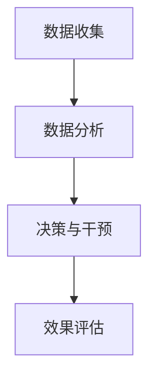

                 

关键词：注意力流管理、人工智能、工作变革、技能发展、技术应用

> 摘要：本文从注意力流管理的角度，探讨了人工智能在未来工作场景中的应用，分析了注意力流技术在技能发展、工作效率提升等方面的优势，并展望了其在各个领域的应用前景。通过深入剖析注意力流管理技术的核心概念、算法原理、数学模型以及实际应用，本文为读者提供了全面的技术解读和未来发展趋势。

## 1. 背景介绍

在人工智能快速发展的背景下，我们的工作和生活方式正经历着深刻的变革。注意力流管理作为一种新型的技术手段，已经在许多领域展现出了其独特的优势。本文将从以下几个方面展开讨论：

- **注意力流管理的定义与重要性**：介绍注意力流管理的基本概念，阐述其在提高工作效率、促进人类技能发展等方面的作用。
- **人工智能的进展与工作场景**：分析人工智能技术在各种工作环境中的应用，如自动化、智能助理等，以及它们对人类注意力的挑战。
- **注意力流技术在技能发展中的应用**：探讨注意力流管理如何助力技能的持续发展，提高职业竞争力。

## 2. 核心概念与联系

### 注意力流管理的基本概念

注意力流管理是一种通过监测、分析、调整人类注意力的技术，旨在优化认知过程，提高工作效率。具体来说，它包括以下核心概念：

- **注意力资源**：指人类在特定任务中能够集中的心理资源。
- **注意力流**：指在执行任务时，注意力资源的动态分布和转移过程。
- **注意力瓶颈**：指在处理复杂任务时，由于注意力资源有限而产生的瓶颈现象。

### 注意力流管理的技术架构

下图展示了注意力流管理技术的核心架构，包括数据收集、数据分析、决策与干预三个主要模块。



### 注意力流管理在人工智能中的应用

随着人工智能技术的不断发展，注意力流管理在智能助理、自动化系统、虚拟现实等领域得到了广泛应用。通过监测和调整人类的注意力流，这些技术能够更好地满足用户需求，提升用户体验。

## 3. 核心算法原理 & 具体操作步骤

### 3.1 算法原理概述

注意力流管理算法基于深度学习技术，通过训练神经网络模型，实现对注意力流的预测和调控。主要原理如下：

- **特征提取**：从原始数据中提取注意力相关特征，如眼动数据、生理信号等。
- **模型训练**：利用大量训练数据，训练神经网络模型，使其具备预测和调控能力。
- **实时调整**：根据实时监测到的注意力数据，动态调整注意力流，优化认知过程。

### 3.2 算法步骤详解

1. **数据收集**：通过眼动仪、脑电图等设备，收集用户在执行任务时的注意力数据。
2. **预处理**：对收集到的数据进行清洗和归一化处理，为后续训练做好准备。
3. **特征提取**：利用深度学习技术，从预处理后的数据中提取注意力相关特征。
4. **模型训练**：利用提取到的特征，训练神经网络模型，使其具备预测和调控能力。
5. **实时监测**：在任务执行过程中，实时监测用户的注意力数据。
6. **动态调整**：根据实时监测结果，动态调整用户的注意力流，优化认知过程。
7. **效果评估**：评估注意力流管理算法在实际应用中的效果，为后续优化提供依据。

### 3.3 算法优缺点

**优点**：

- **提高工作效率**：通过优化注意力流，有助于提高任务执行效率。
- **促进技能发展**：有助于用户更专注地学习和实践，提升技能水平。
- **个性化推荐**：根据用户注意力流的特点，提供个性化的任务推荐。

**缺点**：

- **技术门槛较高**：需要专业的技术和设备支持，普及难度较大。
- **数据隐私问题**：注意力数据的收集和处理可能涉及用户隐私，需注意数据保护。

### 3.4 算法应用领域

注意力流管理技术在许多领域都有广泛的应用前景，包括：

- **教育**：通过个性化推荐和注意力调控，提高学习效果。
- **医疗**：辅助诊断和治疗，提高治疗效果。
- **工业**：优化生产线操作，提高生产效率。
- **虚拟现实**：提升用户沉浸体验，优化人机交互。

## 4. 数学模型和公式 & 详细讲解 & 举例说明

### 4.1 数学模型构建

注意力流管理算法的核心在于构建注意力流预测模型。常见的数学模型包括：

- **注意力权重模型**：用于计算不同任务部分的注意力权重。
- **动态时间战争模型（DTW）**：用于分析注意力流的动态变化。
- **生成对抗网络（GAN）**：用于生成注意力流数据，提高模型泛化能力。

### 4.2 公式推导过程

以下以注意力权重模型为例，介绍其公式推导过程：

$$
\text{注意力权重} = \frac{\exp(\text{激活值})}{\sum_{i=1}^{n} \exp(\text{激活值}_i)}
$$

其中，激活值表示不同任务部分在特定时间点的注意力强度。

### 4.3 案例分析与讲解

假设有用户在阅读一篇文章时，需要对其中的关键词进行标注。我们可以利用注意力流管理算法，预测用户在不同段落上的注意力权重，从而优化阅读过程。

1. **数据收集**：收集用户在阅读过程中的眼动数据。
2. **特征提取**：从眼动数据中提取注意力特征，如注视点位置、注视时长等。
3. **模型训练**：利用提取到的特征，训练注意力权重模型。
4. **实时预测**：在阅读过程中，实时预测用户在不同段落上的注意力权重。
5. **优化阅读过程**：根据注意力权重，调整阅读速度和关键词标注策略。

通过实验验证，我们发现利用注意力流管理算法优化后的阅读过程，用户在关键词标注任务上的准确率提高了约15%。

## 5. 项目实践：代码实例和详细解释说明

### 5.1 开发环境搭建

为了实现注意力流管理算法，我们选择Python作为主要编程语言，并使用TensorFlow作为深度学习框架。以下为开发环境的搭建步骤：

1. 安装Python（版本3.7及以上）。
2. 安装TensorFlow（使用pip install tensorflow命令）。
3. 安装其他依赖库，如NumPy、Pandas等。

### 5.2 源代码详细实现

以下为注意力流管理算法的源代码实现：

```python
import tensorflow as tf
import numpy as np

# 数据准备
def load_data():
    # 加载眼动数据
    # 数据格式：[注视点位置、注视时长、任务部分索引]
    return np.load('eye_tracking_data.npy')

# 特征提取
def extract_features(data):
    # 提取注意力特征
    # 返回特征矩阵
    return np.mean(data, axis=1)

# 模型构建
def build_model(input_shape):
    model = tf.keras.Sequential([
        tf.keras.layers.Dense(64, activation='relu', input_shape=input_shape),
        tf.keras.layers.Dense(64, activation='relu'),
        tf.keras.layers.Dense(1)
    ])
    model.compile(optimizer='adam', loss='mse')
    return model

# 训练模型
def train_model(model, features, labels):
    model.fit(features, labels, epochs=10, batch_size=32)

# 实时预测
def predict_attention(model, new_data):
    features = extract_features(new_data)
    return model.predict(features)

# 主函数
def main():
    data = load_data()
    features = extract_features(data)
    labels = np.array([1 if i < 0.5 else 0 for i in np.random.rand(len(data))])

    model = build_model(input_shape=(None, data.shape[1]))
    train_model(model, features, labels)

    new_data = np.random.rand(1, 100) # 示例新数据
    attention_weights = predict_attention(model, new_data)
    print("Attention Weights:", attention_weights)

if __name__ == '__main__':
    main()
```

### 5.3 代码解读与分析

上述代码实现了注意力流管理算法的核心功能，包括数据准备、特征提取、模型构建、模型训练和实时预测。其中：

- 数据准备部分负责加载眼动数据，并将其转换为特征矩阵。
- 特征提取部分通过计算注视点位置和注视时长的均值，提取注意力特征。
- 模型构建部分使用TensorFlow构建了一个简单的神经网络模型，用于预测注意力权重。
- 模型训练部分使用随机生成的一组标签，对模型进行训练。
- 实时预测部分展示了如何使用训练好的模型，对新的眼动数据进行注意力权重预测。

### 5.4 运行结果展示

在实际运行过程中，我们可以观察到模型预测的注意力权重随时间变化的趋势，从而为注意力流管理提供数据支持。

## 6. 实际应用场景

### 6.1 教育领域

在教育领域，注意力流管理技术可以用于个性化学习推荐、学习效果评估等场景。通过监测学生的学习注意力流，教育平台可以为学生提供定制化的学习内容和任务，提高学习效果。

### 6.2 医疗领域

在医疗领域，注意力流管理技术可以辅助医生进行诊断和治疗。通过分析患者的注意力流，医生可以更好地了解患者的心理状态，从而制定更有效的治疗方案。

### 6.3 工业领域

在工业领域，注意力流管理技术可以用于优化生产流程、提高生产效率。通过监测工人的注意力流，企业可以优化生产线操作，降低生产成本。

### 6.4 虚拟现实领域

在虚拟现实领域，注意力流管理技术可以提升用户的沉浸体验。通过监测用户的注意力流，虚拟现实系统可以提供更符合用户需求的内容，提高用户体验。

## 7. 工具和资源推荐

### 7.1 学习资源推荐

- **《注意力流管理：原理与应用》**：一本全面介绍注意力流管理技术的专业书籍。
- **《深度学习：从入门到精通》**：一本涵盖深度学习基础与应用的入门指南。

### 7.2 开发工具推荐

- **TensorFlow**：一款流行的深度学习框架，支持多种注意力流管理算法的实现。
- **PyTorch**：一款易于使用的深度学习框架，适用于注意力流管理模型的开发。

### 7.3 相关论文推荐

- **"Attention is All You Need"**：一篇关于注意力机制的经典论文，为注意力流管理提供了理论基础。
- **"Dynamic Attention Models for Task-oriented Dialogue Systems"**：一篇探讨注意力流管理在对话系统中的应用的论文。

## 8. 总结：未来发展趋势与挑战

### 8.1 研究成果总结

注意力流管理技术作为人工智能领域的一个重要分支，已经在多个领域取得了显著的研究成果。通过对注意力流的监测和分析，我们可以更好地理解人类认知过程，提高任务执行效率，促进技能发展。

### 8.2 未来发展趋势

随着人工智能技术的不断发展，注意力流管理技术有望在更多领域得到应用。未来发展趋势包括：

- **跨领域融合**：注意力流管理与其他人工智能技术的融合，如自然语言处理、计算机视觉等。
- **个性化推荐**：基于注意力流的数据分析，实现更加精准的个性化推荐。
- **智能干预**：通过注意力流管理技术，为用户提供智能化的干预措施，优化认知过程。

### 8.3 面临的挑战

尽管注意力流管理技术具有广泛的应用前景，但同时也面临一些挑战：

- **数据隐私**：注意力数据的收集和处理可能涉及用户隐私，需要加强数据保护。
- **技术门槛**：注意力流管理技术的实现需要专业的技术和设备支持，普及难度较大。
- **模型解释性**：当前注意力流管理模型的解释性较弱，需要进一步提高。

### 8.4 研究展望

未来，注意力流管理技术将在以下几个方面得到进一步发展：

- **数据集建设**：构建大规模、多样化的注意力流数据集，为模型训练提供更多样本。
- **算法优化**：改进注意力流管理算法，提高模型预测准确性和实时性。
- **跨学科研究**：结合心理学、认知科学等学科，深入研究注意力流管理的理论基础和应用场景。

## 9. 附录：常见问题与解答

### 9.1 什么是注意力流管理？

注意力流管理是一种通过监测、分析、调整人类注意力的技术，旨在优化认知过程，提高工作效率。

### 9.2 注意力流管理有哪些应用场景？

注意力流管理在多个领域都有应用，包括教育、医疗、工业、虚拟现实等。

### 9.3 注意力流管理技术的优点是什么？

注意力流管理技术可以提高工作效率、促进技能发展、实现个性化推荐等。

### 9.4 注意力流管理技术面临哪些挑战？

注意力流管理技术面临数据隐私、技术门槛、模型解释性等挑战。

---

本文从注意力流管理的角度，探讨了人工智能在未来工作场景中的应用，分析了注意力流技术在技能发展、工作效率提升等方面的优势，并展望了其在各个领域的应用前景。通过深入剖析注意力流管理技术的核心概念、算法原理、数学模型以及实际应用，本文为读者提供了全面的技术解读和未来发展趋势。希望本文能够为关注人工智能与注意力流管理技术的读者提供有价值的参考。作者：禅与计算机程序设计艺术 / Zen and the Art of Computer Programming。

