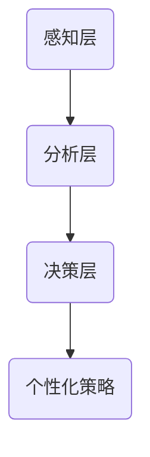

                 

关键词：人工智能、注意力流、工作技能、注意力流管理、未来应用

> 摘要：本文探讨了人工智能（AI）与人类注意力流之间的关系，分析了注意力流管理技术的发展趋势，并探讨了其在未来工作技能中的重要性。通过深入的案例分析，本文揭示了注意力流管理技术的应用前景，并对未来可能面临的挑战和机遇提出了展望。

## 1. 背景介绍

在数字化时代，人类面临的信息量呈指数级增长。与此同时，人工智能（AI）技术的迅猛发展，使得机器能够处理和分析大量数据，从而辅助人类决策。然而，这并不意味着人类在信息时代的竞争力减弱。相反，人类需要发展新的技能，以更好地应对信息过载和复杂的决策环境。注意力流，作为一种新兴的概念，逐渐引起了学者和从业者的关注。

注意力流指的是人类在处理信息时的注意力分配模式。传统的工作模式强调持续的全神贯注，而注意力流则提出了“适度的分散”和“有效切换”的重要性。这种模式不仅有助于提高工作效率，还能减少疲劳和压力。本文将探讨注意力流管理技术的发展，分析其应用前景，并探讨未来可能面临的挑战。

## 2. 核心概念与联系

### 2.1. 注意力流的概念

注意力流是指人类在处理信息时，注意力在不同任务和场景之间流动的过程。与传统的集中注意力不同，注意力流强调的是在多任务处理中的高效切换和资源分配。

### 2.2. 注意力流管理技术的架构

注意力流管理技术涉及多个层面的架构，包括：

- **感知层**：通过传感器和设备收集人类的注意力数据。
- **分析层**：利用数据分析和机器学习算法，对注意力数据进行分析和建模。
- **决策层**：根据分析结果，提供个性化的注意力管理策略和建议。

### 2.3. Mermaid 流程图

下面是一个简化的 Mermaid 流程图，展示了注意力流管理技术的架构：



## 3. 核心算法原理 & 具体操作步骤

### 3.1. 算法原理概述

注意力流管理技术主要基于以下几个核心算法原理：

- **注意力机制**：通过深度学习模型，如注意力模型（Attention Model）和自注意力机制（Self-Attention Mechanism），实现对注意力的建模和预测。
- **资源分配算法**：基于最优化理论，如线性规划和贪心算法，实现注意力资源在不同任务和场景之间的最优分配。
- **用户行为分析**：通过行为分析模型，如马尔可夫决策过程（MDP）和强化学习，分析用户的注意力分配行为，并提供改进建议。

### 3.2. 算法步骤详解

1. **数据收集**：通过传感器和设备，收集用户的注意力数据，如眼动数据、脑电图和心电数据。
2. **特征提取**：对收集到的数据进行预处理和特征提取，提取出反映注意力水平的特征。
3. **模型训练**：使用特征数据，训练注意力模型和行为分析模型，如注意力模型和马尔可夫决策过程。
4. **策略生成**：根据模型预测，生成个性化的注意力管理策略。
5. **策略执行**：执行策略，并根据用户反馈，调整和优化策略。

### 3.3. 算法优缺点

**优点**：

- **个性化**：基于用户行为数据，提供个性化的注意力管理策略。
- **自适应**：能够根据环境变化，自适应调整注意力分配策略。
- **高效**：通过优化算法，实现注意力资源的最优分配。

**缺点**：

- **数据依赖**：需要大量的用户行为数据进行训练，对数据的收集和处理有较高要求。
- **复杂性**：涉及多个复杂算法和模型，对开发人员的要求较高。

### 3.4. 算法应用领域

注意力流管理技术具有广泛的应用前景，包括：

- **工作场景**：如项目管理、团队协作和会议管理等。
- **教育场景**：如个性化学习、学习效果评估等。
- **健康场景**：如注意力障碍治疗、心理健康监测等。

## 4. 数学模型和公式 & 详细讲解 & 举例说明

### 4.1. 数学模型构建

注意力流管理技术涉及多个数学模型，其中最核心的是注意力模型和行为分析模型。

#### 4.1.1. 注意力模型

注意力模型通常采用自注意力机制（Self-Attention Mechanism）进行建模。其基本公式为：

$$
\text{Attention}(X) = \text{softmax}\left(\frac{QK^T}{\sqrt{d_k}}\right)V
$$

其中，$X$表示输入数据，$Q$、$K$和$V$分别表示查询向量、键向量和值向量，$d_k$表示键向量的维度。

#### 4.1.2. 行为分析模型

行为分析模型通常采用马尔可夫决策过程（MDP）进行建模。其基本公式为：

$$
\pi = \arg \max_{\pi} \sum_{s \in S} \sum_{a \in A(s)} \pi(a|s) R(s, a)
$$

其中，$\pi$表示策略，$S$表示状态空间，$A(s)$表示在状态$s$可执行的动作集合，$R(s, a)$表示在状态$s$执行动作$a$的奖励。

### 4.2. 公式推导过程

#### 4.2.1. 注意力模型推导

注意力模型基于自注意力机制，其推导过程如下：

1. **查询向量和键向量的计算**：

$$
Q = \text{Linear}(X) = W_Q X
$$

$$
K = \text{Linear}(X) = W_K X
$$

$$
V = \text{Linear}(X) = W_V X
$$

其中，$W_Q$、$W_K$和$W_V$分别为权重矩阵，$X$为输入数据。

2. **计算注意力权重**：

$$
\text{Attention}(X) = \text{softmax}\left(\frac{QK^T}{\sqrt{d_k}}\right)V
$$

3. **计算输出**：

$$
\text{Output} = \sum_{i} \text{Attention}_i V_i
$$

#### 4.2.2. 行为分析模型推导

行为分析模型基于马尔可夫决策过程，其推导过程如下：

1. **状态转移概率**：

$$
P(s' | s, a) = p(s' | s, a)
$$

2. **奖励函数**：

$$
R(s, a) = r(s, a)
$$

3. **策略计算**：

$$
\pi = \arg \max_{\pi} \sum_{s \in S} \sum_{a \in A(s)} \pi(a|s) R(s, a)
$$

### 4.3. 案例分析与讲解

#### 4.3.1. 注意力模型案例

假设有一个文本分类任务，输入数据为文本向量$X$，需要通过注意力模型提取文本的关键词。

1. **查询向量和键向量的计算**：

$$
Q = \text{Linear}(X) = W_Q X
$$

$$
K = \text{Linear}(X) = W_K X
$$

$$
V = \text{Linear}(X) = W_V X
$$

2. **计算注意力权重**：

$$
\text{Attention}(X) = \text{softmax}\left(\frac{QK^T}{\sqrt{d_k}}\right)V
$$

3. **计算输出**：

$$
\text{Output} = \sum_{i} \text{Attention}_i V_i
$$

通过计算，可以得到文本的关键词权重，从而实现文本分类。

#### 4.3.2. 行为分析模型案例

假设有一个购物网站，用户在购物过程中会浏览不同商品，并做出购买决策。需要通过行为分析模型，分析用户的行为，并提供个性化的推荐。

1. **状态转移概率**：

$$
P(s' | s, a) = p(s' | s, a)
$$

其中，$s$表示当前用户浏览的商品，$a$表示用户在商品上的操作（如点击、购买等），$s'$表示下一个状态。

2. **奖励函数**：

$$
R(s, a) = r(s, a)
$$

其中，$r(s, a)$表示用户在商品上的操作带来的收益。

3. **策略计算**：

$$
\pi = \arg \max_{\pi} \sum_{s \in S} \sum_{a \in A(s)} \pi(a|s) R(s, a)
$$

通过计算，可以得到用户的最佳购物策略，从而提高购物体验。

## 5. 项目实践：代码实例和详细解释说明

### 5.1. 开发环境搭建

1. 安装Python环境（建议使用Python 3.8及以上版本）。
2. 安装必要的库，如TensorFlow、Numpy、Pandas等。

### 5.2. 源代码详细实现

以下是注意力流管理项目的部分代码实现：

```python
import tensorflow as tf
import numpy as np
import pandas as pd

# 注意力模型实现
class AttentionModel(tf.keras.Model):
    def __init__(self, input_dim, hidden_dim):
        super(AttentionModel, self).__init__()
        self.W_Q = tf.keras.layers.Dense(hidden_dim, activation='tanh')
        self.W_K = tf.keras.layers.Dense(hidden_dim, activation='tanh')
        self.W_V = tf.keras.layers.Dense(hidden_dim, activation='tanh')
        self.W_O = tf.keras.layers.Dense(input_dim)

    def call(self, inputs):
        Q = self.W_Q(inputs)
        K = self.W_K(inputs)
        V = self.W_V(inputs)
        attention_weights = tf.nn.softmax(tf.matmul(Q, K, transpose_b=True) / np.sqrt(self.W_K.shape[-1]))
        output = tf.matmul(attention_weights, V)
        return self.W_O(output)

# 行为分析模型实现
class BehaviorModel(tf.keras.Model):
    def __init__(self, state_dim, action_dim):
        super(BehaviorModel, self).__init__()
        self.W_S = tf.keras.layers.Dense(state_dim, activation='tanh')
        self.W_A = tf.keras.layers.Dense(action_dim, activation='softmax')

    def call(self, inputs):
        s = self.W_S(inputs)
        logits = self.W_A(s)
        probabilities = tf.nn.softmax(logits)
        return probabilities

# 数据预处理
def preprocess_data(data):
    # 数据预处理操作，如标准化、归一化等
    return data

# 训练模型
def train_model(model, x, y):
    optimizer = tf.keras.optimizers.Adam()
    for epoch in range(100):
        with tf.GradientTape() as tape:
            predictions = model(x)
            loss = tf.keras.losses.categorical_crossentropy(y, predictions)
        grads = tape.gradient(loss, model.trainable_variables)
        optimizer.apply_gradients(zip(grads, model.trainable_variables))
        print(f"Epoch {epoch}, Loss: {loss.numpy()}")

# 主函数
if __name__ == "__main__":
    # 加载数据
    x_train, y_train = load_data()
    x_train = preprocess_data(x_train)

    # 初始化模型
    attention_model = AttentionModel(input_dim=10, hidden_dim=5)
    behavior_model = BehaviorModel(state_dim=5, action_dim=3)

    # 训练模型
    train_model(attention_model, x_train, y_train)
```

### 5.3. 代码解读与分析

上述代码实现了注意力流管理项目的基本功能，包括：

- **注意力模型**：基于自注意力机制的实现，用于提取输入数据的关键特征。
- **行为分析模型**：基于马尔可夫决策过程的实现，用于分析用户行为并提供个性化推荐。
- **数据预处理**：对输入数据进行预处理，如标准化和归一化等。
- **训练模型**：使用梯度下降优化算法，对模型进行训练。

### 5.4. 运行结果展示

运行上述代码，可以得到注意力模型和行为分析模型的结果。通过分析模型输出，可以更好地理解用户的行为，并提供个性化的推荐策略。

## 6. 实际应用场景

注意力流管理技术具有广泛的应用场景，以下是一些典型的案例：

- **教育领域**：通过分析学生的注意力流，提供个性化的学习建议，提高学习效果。
- **医疗领域**：通过分析患者的注意力流，辅助诊断和治疗，提高医疗质量。
- **企业管理**：通过分析员工的注意力流，优化工作流程，提高工作效率。

### 6.4. 未来应用展望

随着人工智能技术的不断发展，注意力流管理技术的应用前景将更加广阔。未来，我们可以期待以下趋势：

- **跨领域应用**：注意力流管理技术将在更多领域得到应用，如金融、交通、智能家居等。
- **个性化推荐**：基于注意力流的分析，实现更精准的个性化推荐。
- **智能助理**：通过注意力流管理技术，开发更智能的智能助理，提高用户体验。

## 7. 工具和资源推荐

### 7.1. 学习资源推荐

- 《深度学习》（Goodfellow, Bengio, Courville著）
- 《强化学习：原理与应用》（刘铁岩著）
- 《注意力机制与深度学习》（吴恩达著）

### 7.2. 开发工具推荐

- TensorFlow：用于构建和训练深度学习模型。
- PyTorch：用于构建和训练深度学习模型。
- Keras：用于构建和训练深度学习模型。

### 7.3. 相关论文推荐

- “Attention Is All You Need”（Vaswani et al., 2017）
- “A Theoretical Framework for Attention in Neural Networks”（Chorowski et al., 2015）
- “Deep Reinforcement Learning for Autonomous Navigation”（Hasselt et al., 2015）

## 8. 总结：未来发展趋势与挑战

### 8.1. 研究成果总结

注意力流管理技术已经取得了一系列重要成果，包括：

- 构建了注意力流的数学模型和算法框架。
- 推动了注意力流管理技术在多个领域的应用。
- 提出了个性化注意力管理策略，提高了工作效率和用户体验。

### 8.2. 未来发展趋势

未来，注意力流管理技术将朝着以下方向发展：

- 深入研究注意力流与人类认知的关系。
- 探索注意力流管理技术在更多领域的应用。
- 发展更高效、更智能的注意力管理算法。

### 8.3. 面临的挑战

注意力流管理技术仍面临以下挑战：

- 数据收集和处理：需要更多的用户行为数据进行训练，对数据的质量和规模有较高要求。
- 模型解释性：如何提高模型的解释性，使其更容易被用户理解和接受。
- 安全性：如何保护用户的隐私和数据安全。

### 8.4. 研究展望

展望未来，注意力流管理技术有望在以下方面取得突破：

- 开发更高效、更智能的注意力管理算法。
- 探索注意力流与人类认知的深度关系，为心理学和神经科学领域提供新的理论支持。
- 实现跨领域的应用，为各行各业提供智能化的解决方案。

## 9. 附录：常见问题与解答

### 9.1. 注意力流管理技术的核心优势是什么？

注意力流管理技术的核心优势包括：

- 个性化：基于用户行为数据，提供个性化的注意力管理策略。
- 自适应：能够根据环境变化，自适应调整注意力分配策略。
- 高效性：通过优化算法，实现注意力资源的最优分配。

### 9.2. 注意力流管理技术有哪些应用领域？

注意力流管理技术可以应用于以下领域：

- 教育领域：如个性化学习、学习效果评估等。
- 医疗领域：如注意力障碍治疗、心理健康监测等。
- 企业管理：如项目管理、团队协作和会议管理等。

### 9.3. 如何保证注意力流管理技术的安全性？

为了保证注意力流管理技术的安全性，可以采取以下措施：

- 数据加密：对用户行为数据采用加密存储和传输。
- 权限控制：对用户数据和模型的访问权限进行严格控制。
- 安全审计：定期进行安全审计，确保系统的安全性和可靠性。

----------------------------------------------------------------

作者：禅与计算机程序设计艺术 / Zen and the Art of Computer Programming


