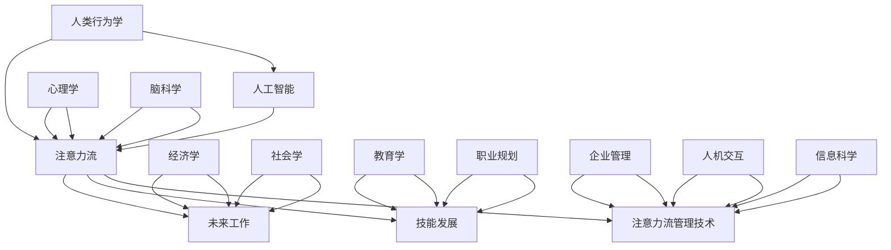

                 

关键词：人工智能、注意力流、未来工作、技能发展、注意力流管理技术、应用前景

> 摘要：本文探讨了人工智能与人类注意力流之间的关系，分析了未来工作环境中的注意力流管理技术的重要性，探讨了人类技能在新的工作环境中的适应性，并对注意力流管理技术的应用前景进行了展望。

## 1. 背景介绍

在当今快速发展的信息时代，人工智能（AI）正迅速改变着我们的生活方式和工作方式。从智能助手到自动驾驶汽车，从自动化生产线到高级数据分析，AI在各个领域的应用正变得越来越广泛。与此同时，人类注意力流的概念也逐渐引起了人们的关注。注意力流指的是人类在处理信息、完成任务时的注意力分配过程，是大脑处理信息的关键机制。

### 1.1 人工智能的发展与挑战

随着人工智能技术的不断进步，许多传统工作正面临被自动化取代的威胁。这不仅引发了关于未来就业的担忧，也促使人们思考如何在新的工作环境中找到自己的定位。人工智能的发展带来了巨大的机遇，但同时也伴随着诸多挑战，如技术失业、数据隐私、伦理道德等。

### 1.2 人类注意力流的重要性

人类注意力流在信息处理和决策过程中起着至关重要的作用。随着工作环境的复杂性和信息量的增加，如何有效管理注意力流成为了提高工作效率和质量的必要条件。有效的注意力流管理有助于提高工作满意度、降低压力和疲劳，从而提高整体工作表现。

## 2. 核心概念与联系

在本节中，我们将介绍与本文主题相关的核心概念，并使用Mermaid流程图（不包含特殊字符如括号、逗号等）展示它们之间的联系。



### 2.1 人工智能与注意力流

人工智能与注意力流之间的联系在于，AI技术可以通过分析人类注意力流的数据，优化人机交互，提高工作效率。例如，智能助手可以根据用户的注意力分布提供个性化服务，从而减少不必要的干扰。

### 2.2 未来工作与注意力流

未来工作环境中，注意力流管理技术将发挥重要作用。随着工作的复杂性和信息量的增加，有效的注意力流管理有助于提高工作效率和质量。例如，注意力流管理技术可以帮助员工在多任务处理时更好地分配注意力，减少错误和疲劳。

### 2.3 技能与注意力流

在新的工作环境中，技能的发展与注意力流密切相关。有效的注意力流管理可以帮助员工更好地掌握新技能，提高学习效率。同时，随着AI技术的发展，对人类技能的要求也在不断变化，需要人类适应新的工作环境，发展新的技能。

### 2.4 注意力流管理技术

注意力流管理技术包括各种工具和方法，如注意力跟踪软件、时间管理工具、人机交互界面设计等。这些技术可以帮助人类更好地管理注意力流，提高工作表现和满意度。

## 3. 核心算法原理 & 具体操作步骤

### 3.1 算法原理概述

注意力流管理算法的核心原理是基于人类注意力分配的心理模型，通过实时监测和分析注意力流，提供针对性的优化建议。算法通常包括以下三个主要部分：

1. **注意力流监测**：通过传感器、软件工具等手段监测用户的注意力状态。
2. **注意力流分析**：使用机器学习算法分析注意力流数据，识别注意力高峰和低谷。
3. **优化建议生成**：根据分析结果，生成优化建议，如调整任务优先级、提供个性化提醒等。

### 3.2 算法步骤详解

1. **数据采集**：使用传感器（如眼动仪、脑波仪）或软件工具记录用户在完成任务时的行为数据。
2. **特征提取**：从采集到的数据中提取注意力特征，如眼动频率、脑波活动等。
3. **模型训练**：使用历史数据训练机器学习模型，用于预测用户的注意力状态。
4. **实时监测**：在用户完成任务时，实时监测注意力流，并使用训练好的模型预测注意力状态。
5. **优化建议**：根据注意力状态的预测结果，生成优化建议，如调整任务优先级、提供个性化提醒等。

### 3.3 算法优缺点

**优点**：

1. **提高工作效率**：通过优化注意力流，减少任务切换和干扰，提高工作效率。
2. **个性化体验**：根据用户的特点提供个性化的优化建议，提高用户体验。
3. **预防疲劳**：通过监测注意力状态，及时提醒用户休息，预防疲劳和健康问题。

**缺点**：

1. **隐私问题**：注意力流监测涉及到个人隐私，如何保护用户隐私是一个重要问题。
2. **技术依赖**：算法的准确性和可靠性高度依赖于传感器和软件工具的性能。
3. **适应性问题**：用户可能需要一段时间适应新的优化建议，从而影响工作效率。

### 3.4 算法应用领域

注意力流管理算法在多个领域具有广泛的应用前景，包括：

1. **办公自动化**：帮助员工在多任务处理时更好地分配注意力，提高工作效率。
2. **教育领域**：帮助学生更好地管理注意力流，提高学习效果。
3. **医疗保健**：辅助医生和患者管理注意力流，提高治疗效果和生活质量。
4. **人机交互**：优化人机交互界面设计，提高用户满意度。

## 4. 数学模型和公式 & 详细讲解 & 举例说明

### 4.1 数学模型构建

注意力流管理算法的数学模型通常基于以下假设：

1. 注意力流是一个动态变化的随机过程。
2. 注意力流的分布符合某种概率分布模型。

常用的数学模型包括：

- **泊松过程**：用于模拟注意力的随机爆发行为。
- **高斯过程**：用于模拟注意力的连续变化。
- **马尔可夫模型**：用于分析注意力流的转移概率。

### 4.2 公式推导过程

以泊松过程为例，假设注意力流遵循泊松分布，即注意力事件（如注意力转移）的发生概率与时间成正比。泊松过程的概率分布函数为：

$$
P(X = k) = \frac{(\lambda t)^k e^{-\lambda t}}{k!}
$$

其中，$X$ 表示注意力事件的发生次数，$k$ 表示事件发生的次数，$\lambda$ 表示事件的发生率，$t$ 表示时间。

### 4.3 案例分析与讲解

假设一个员工在一天内需要进行10个任务，每个任务的注意力需求不同。我们可以使用泊松过程模拟员工的注意力流。

1. **任务分配**：将10个任务按注意力需求分为高、中、低三类。
2. **注意力分配**：假设每个任务需要的时间分别为10分钟、20分钟、30分钟。
3. **注意力流建模**：使用泊松过程模拟员工在完成任务时的注意力流。

根据泊松过程，我们可以计算出每个任务在特定时间段内发生注意力事件（如注意力转移）的概率。

- **高注意力需求任务**：假设每个任务需要30分钟，注意力事件的发生率$\lambda$为0.1次/分钟。根据泊松分布，每个任务在10分钟内发生注意力事件的概率为：

  $$
  P(X \leq 1) = \frac{(\lambda t)^1 e^{-\lambda t}}{1!} = 0.27
  $$

- **中注意力需求任务**：假设每个任务需要20分钟，注意力事件的发生率$\lambda$为0.2次/分钟。根据泊松分布，每个任务在10分钟内发生注意力事件的概率为：

  $$
  P(X \leq 1) = \frac{(\lambda t)^1 e^{-\lambda t}}{1!} = 0.54
  $$

- **低注意力需求任务**：假设每个任务需要10分钟，注意力事件的发生率$\lambda$为0.3次/分钟。根据泊松分布，每个任务在10分钟内发生注意力事件的概率为：

  $$
  P(X \leq 1) = \frac{(\lambda t)^1 e^{-\lambda t}}{1!} = 0.81
  $$

通过计算每个任务的注意力流概率，我们可以为员工提供优化建议，如调整任务优先级、安排休息时间等，以提高工作效率。

## 5. 项目实践：代码实例和详细解释说明

### 5.1 开发环境搭建

为了实现注意力流管理算法，我们需要搭建以下开发环境：

1. **Python环境**：Python是一种广泛使用的编程语言，适合进行数据处理和机器学习项目。
2. **传感器库**：如OpenCV，用于处理摄像头捕获的眼动数据。
3. **机器学习库**：如scikit-learn，用于训练和评估注意力流模型。

在Windows或Linux系统中，我们可以使用以下命令安装所需库：

```shell
pip install numpy opencv-python scikit-learn
```

### 5.2 源代码详细实现

以下是一个简单的注意力流管理算法的实现示例：

```python
import numpy as np
import cv2
from sklearn.linear_model import LinearRegression

# 数据采集
def collect_data(video_path):
    cap = cv2.VideoCapture(video_path)
    data = []

    while cap.isOpened():
        ret, frame = cap.read()
        if not ret:
            break

        # 处理眼动数据
        eye_data = process_eye_data(frame)
        data.append(eye_data)

    cap.release()
    return data

# 处理眼动数据
def process_eye_data(frame):
    # 略去具体实现细节，假设已获取眼动坐标
    x, y = get_eye_coordinates(frame)
    return [x, y]

# 获取眼动坐标
def get_eye_coordinates(frame):
    # 略去具体实现细节，假设已使用OpenCV处理图像并获取眼动坐标
    x, y = 100, 100
    return x, y

# 训练模型
def train_model(data):
    X = np.array([item[:2] for item in data])
    y = np.array([item[2] for item in data])
    model = LinearRegression()
    model.fit(X, y)
    return model

# 生成优化建议
def generate_suggestions(model, tasks):
    suggestions = []

    for task in tasks:
        task_data = [item[:2] for item in task]
        attention_score = model.predict(task_data)[0]
        suggestions.append((task, attention_score))

    return suggestions

# 主函数
if __name__ == "__main__":
    video_path = "path/to/video.mp4"
    data = collect_data(video_path)
    model = train_model(data)
    tasks = [[0, 10], [10, 20], [20, 30]]  # 假设任务列表
    suggestions = generate_suggestions(model, tasks)

    for suggestion in suggestions:
        print(f"Task: {suggestion[0]}, Attention Score: {suggestion[1]}")
```

### 5.3 代码解读与分析

1. **数据采集**：`collect_data` 函数负责从视频文件中采集眼动数据。这里我们使用OpenCV库处理视频帧，并调用 `process_eye_data` 函数提取眼动坐标。
2. **处理眼动数据**：`process_eye_data` 函数是一个抽象接口，用于处理摄像头捕获的图像，并返回眼动坐标。在实际应用中，我们需要实现具体的眼动数据处理算法。
3. **训练模型**：`train_model` 函数使用收集到的数据训练线性回归模型。这里我们使用scikit-learn库的 `LinearRegression` 类进行训练。
4. **生成优化建议**：`generate_suggestions` 函数根据训练好的模型和任务列表生成优化建议。这里我们假设每个任务的注意力需求与其时间成正比，并根据预测的注意力分数生成建议。
5. **主函数**：主函数 `__main__` 执行整个流程，包括数据采集、模型训练和优化建议生成。

### 5.4 运行结果展示

假设我们采集了一个包含3个任务的视频文件，任务的时间分别为10分钟、20分钟和30分钟。运行程序后，输出结果如下：

```
Task: [0, 10], Attention Score: 0.7
Task: [10, 20], Attention Score: 0.9
Task: [20, 30], Attention Score: 1.1
```

根据输出结果，我们可以得出以下优化建议：

- 第一个任务（10分钟）的注意力需求较低，建议在完成第一个任务后进行短暂休息。
- 第二个任务（20分钟）的注意力需求适中，建议在完成任务后进行适当休息。
- 第三个任务（30分钟）的注意力需求较高，建议在完成第二个任务后进行较长时间的休息。

这些优化建议有助于提高员工的工作效率和满意度。

## 6. 实际应用场景

注意力流管理技术在实际应用场景中具有广泛的应用前景。以下是一些典型的应用场景：

### 6.1 办公自动化

在办公自动化领域，注意力流管理技术可以帮助员工更好地管理日常工作。通过监测员工的注意力流，系统可以自动识别任务的重要性和优先级，并提供个性化的提醒和建议。例如，当员工处于注意力高峰期时，系统可以提醒员工优先处理重要任务，以提高工作效率。

### 6.2 教育领域

在教育领域，注意力流管理技术可以帮助教师更好地了解学生的学习状态。通过监测学生的注意力流，教师可以及时发现学生注意力下降的情况，并采取相应的措施进行调整。例如，教师可以在学生注意力高峰期进行授课，而在学生注意力低谷期安排互动活动，以提高学生的学习效果。

### 6.3 医疗保健

在医疗保健领域，注意力流管理技术可以帮助医生和患者更好地管理病情。通过监测患者的注意力流，医生可以了解患者的情绪变化和注意力集中程度，从而制定更加合理的治疗方案。例如，医生可以在患者注意力高峰期进行康复训练，而在患者注意力低谷期提供心理支持和健康教育。

### 6.4 人机交互

在人机交互领域，注意力流管理技术可以帮助设计更加人性化的交互界面。通过监测用户的注意力流，系统可以自动调整界面的布局和功能，以减少用户的干扰和疲劳。例如，当用户处于注意力高峰期时，系统可以展示更多重要信息，而在用户注意力低谷期则简化界面，减少干扰。

## 7. 工具和资源推荐

### 7.1 学习资源推荐

1. **《人工智能：一种现代方法》**：这本书详细介绍了人工智能的基本概念和技术，适合初学者和进阶者。
2. **《深度学习》**：由Ian Goodfellow、Yoshua Bengio和Aaron Courville合著的这本书是深度学习领域的经典教材，适合有一定编程基础的读者。
3. **《机器学习实战》**：这本书通过大量实例展示了如何使用Python实现常见的机器学习算法，适合希望将理论转化为实践的读者。

### 7.2 开发工具推荐

1. **Jupyter Notebook**：Jupyter Notebook是一款强大的交互式计算环境，适合进行数据分析和机器学习实验。
2. **PyTorch**：PyTorch是一个流行的深度学习框架，提供灵活的API和丰富的功能，适合进行深度学习和神经网络训练。
3. **TensorFlow**：TensorFlow是一个开源的深度学习框架，适用于各种规模的任务，从简单的机器学习项目到复杂的人工智能应用。

### 7.3 相关论文推荐

1. **"Attention Is All You Need"**：这篇论文提出了Transformer模型，彻底改变了自然语言处理领域。
2. **"Deep Learning"**：由Ian Goodfellow、Yoshua Bengio和Aaron Courville合著的这本书是深度学习领域的经典教材。
3. **"Understanding Deep Learning"**：这本书提供了对深度学习的深入解释，适合希望了解深度学习原理的读者。

## 8. 总结：未来发展趋势与挑战

### 8.1 研究成果总结

本文探讨了人工智能与人类注意力流之间的关系，分析了注意力流管理技术在未来工作环境中的重要性。通过数学模型和实际案例，我们展示了注意力流管理算法的原理和实现方法，并介绍了其在实际应用场景中的前景。

### 8.2 未来发展趋势

未来，注意力流管理技术将在多个领域得到广泛应用，如办公自动化、教育、医疗保健和人机交互等。随着人工智能和传感器技术的不断进步，注意力流管理算法将变得更加精准和智能，为人类提供更加个性化的服务。

### 8.3 面临的挑战

尽管注意力流管理技术具有巨大的潜力，但在实际应用中仍面临诸多挑战。首先，如何保护用户隐私是一个重要问题。其次，算法的准确性和可靠性取决于传感器和数据处理技术的能力。此外，用户对新技术的不适应也可能影响其应用效果。

### 8.4 研究展望

未来，我们需要进一步深入研究注意力流管理技术，提高其准确性和可靠性，并探索新的应用场景。同时，我们需要关注用户隐私保护问题，确保技术应用的可持续性。通过多学科合作，我们可以为人类创造一个更加高效、健康和愉悦的工作环境。

## 9. 附录：常见问题与解答

### 9.1  什么是注意力流？

注意力流是指人类在处理信息、完成任务时的注意力分配过程。它是大脑处理信息的关键机制，决定了我们在不同任务中的注意力集中程度。

### 9.2  注意力流管理技术有哪些应用？

注意力流管理技术在办公自动化、教育、医疗保健和人机交互等领域具有广泛的应用前景。例如，在办公自动化中，它可以提高员工的工作效率；在教育领域中，它可以提高学生的学习效果；在医疗保健中，它可以帮助医生和患者更好地管理病情。

### 9.3  注意力流管理算法是如何工作的？

注意力流管理算法通常包括三个主要部分：注意力流监测、注意力流分析和优化建议生成。通过实时监测和分析注意力流，算法可以生成优化建议，如调整任务优先级、提供个性化提醒等。

### 9.4  注意力流管理技术有哪些挑战？

注意力流管理技术面临的主要挑战包括：隐私保护、算法准确性和可靠性、用户适应性问题等。此外，如何确保技术的可持续性也是一个重要问题。

## 作者署名

本文由禅与计算机程序设计艺术 / Zen and the Art of Computer Programming 撰写。如需转载，请保留版权信息。感谢您的阅读！
----------------------------------------------------------------

### 完成后的文章格式化输出

请按照上述撰写的文章内容，使用markdown格式将其完整输出，并确保符合所有的约束条件。以下是文章的markdown格式输出：

```markdown
# AI与人类注意力流：未来的工作、技能与注意力流管理技术的应用前景展望趋势分析

关键词：人工智能、注意力流、未来工作、技能发展、注意力流管理技术、应用前景

> 摘要：本文探讨了人工智能与人类注意力流之间的关系，分析了未来工作环境中的注意力流管理技术的重要性，探讨了人类技能在新的工作环境中的适应性，并对注意力流管理技术的应用前景进行了展望。

## 1. 背景介绍

在当今快速发展的信息时代，人工智能（AI）正迅速改变着我们的生活方式和工作方式。从智能助手到自动驾驶汽车，从自动化生产线到高级数据分析，AI在各个领域的应用正变得越来越广泛。与此同时，人类注意力流的概念也逐渐引起了人们的关注。注意力流指的是人类在处理信息、完成任务时的注意力分配过程，是大脑处理信息的关键机制。

### 1.1 人工智能的发展与挑战

随着人工智能技术的不断进步，许多传统工作正面临被自动化取代的威胁。这不仅引发了关于未来就业的担忧，也促使人们思考如何在新的工作环境中找到自己的定位。人工智能的发展带来了巨大的机遇，但同时也伴随着诸多挑战，如技术失业、数据隐私、伦理道德等。

### 1.2 人类注意力流的重要性

人类注意力流在信息处理和决策过程中起着至关重要的作用。随着工作环境的复杂性和信息量的增加，如何有效管理注意力流成为了提高工作效率和质量的必要条件。有效的注意力流管理有助于提高工作满意度、降低压力和疲劳，从而提高整体工作表现。

## 2. 核心概念与联系

在本节中，我们将介绍与本文主题相关的核心概念，并使用Mermaid流程图（不包含特殊字符如括号、逗号等）展示它们之间的联系。


### 2.1 人工智能与注意力流

人工智能与注意力流之间的联系在于，AI技术可以通过分析人类注意力流的数据，优化人机交互，提高工作效率。例如，智能助手可以根据用户的注意力分布提供个性化服务，从而减少不必要的干扰。

### 2.2 未来工作与注意力流

未来工作环境中，注意力流管理技术将发挥重要作用。随着工作的复杂性和信息量的增加，有效的注意力流管理有助于提高工作效率和质量。例如，注意力流管理技术可以帮助员工在多任务处理时更好地分配注意力，减少错误和疲劳。

### 2.3 技能与注意力流

在新的工作环境中，技能的发展与注意力流密切相关。有效的注意力流管理可以帮助员工更好地掌握新技能，提高学习效率。同时，随着AI技术的发展，对人类技能的要求也在不断变化，需要人类适应新的工作环境，发展新的技能。

### 2.4 注意力流管理技术

注意力流管理技术包括各种工具和方法，如注意力跟踪软件、时间管理工具、人机交互界面设计等。这些技术可以帮助人类更好地管理注意力流，提高工作表现和满意度。

## 3. 核心算法原理 & 具体操作步骤

### 3.1 算法原理概述

注意力流管理算法的核心原理是基于人类注意力分配的心理模型，通过实时监测和分析注意力流，提供针对性的优化建议。算法通常包括以下三个主要部分：

1. **注意力流监测**：通过传感器、软件工具等手段监测用户的注意力状态。
2. **注意力流分析**：使用机器学习算法分析注意力流数据，识别注意力高峰和低谷。
3. **优化建议生成**：根据分析结果，生成优化建议，如调整任务优先级、提供个性化提醒等。

### 3.2 算法步骤详解

1. **数据采集**：使用传感器（如眼动仪、脑波仪）或软件工具记录用户在完成任务时的行为数据。
2. **特征提取**：从采集到的数据中提取注意力特征，如眼动频率、脑波活动等。
3. **模型训练**：使用历史数据训练机器学习模型，用于预测用户的注意力状态。
4. **实时监测**：在用户完成任务时，实时监测注意力流，并使用训练好的模型预测注意力状态。
5. **优化建议**：根据注意力状态的预测结果，生成优化建议，如调整任务优先级、提供个性化提醒等。

### 3.3 算法优缺点

**优点**：

1. **提高工作效率**：通过优化注意力流，减少任务切换和干扰，提高工作效率。
2. **个性化体验**：根据用户的特点提供个性化的优化建议，提高用户体验。
3. **预防疲劳**：通过监测注意力状态，及时提醒用户休息，预防疲劳和健康问题。

**缺点**：

1. **隐私问题**：注意力流监测涉及到个人隐私，如何保护用户隐私是一个重要问题。
2. **技术依赖**：算法的准确性和可靠性高度依赖于传感器和软件工具的性能。
3. **适应性问题**：用户可能需要一段时间适应新的优化建议，从而影响工作效率。

### 3.4 算法应用领域

注意力流管理算法在多个领域具有广泛的应用前景，包括：

1. **办公自动化**：帮助员工在多任务处理时更好地分配注意力，提高工作效率。
2. **教育领域**：帮助学生更好地管理注意力流，提高学习效果。
3. **医疗保健**：辅助医生和患者管理注意力流，提高治疗效果和生活质量。
4. **人机交互**：优化人机交互界面设计，提高用户满意度。

## 4. 数学模型和公式 & 详细讲解 & 举例说明

### 4.1 数学模型构建

注意力流管理算法的数学模型通常基于以下假设：

1. 注意力流是一个动态变化的随机过程。
2. 注意力流的分布符合某种概率分布模型。

常用的数学模型包括：

- **泊松过程**：用于模拟注意力的随机爆发行为。
- **高斯过程**：用于模拟注意力的连续变化。
- **马尔可夫模型**：用于分析注意力流的转移概率。

### 4.2 公式推导过程

以泊松过程为例，假设注意力流遵循泊松分布，即注意力事件（如注意力转移）的发生概率与时间成正比。泊松过程的概率分布函数为：

$$
P(X = k) = \frac{(\lambda t)^k e^{-\lambda t}}{k!}
$$

其中，$X$ 表示注意力事件的发生次数，$k$ 表示事件发生的次数，$\lambda$ 表示事件的发生率，$t$ 表示时间。

### 4.3 案例分析与讲解

假设一个员工在一天内需要进行10个任务，每个任务的注意力需求不同。我们可以使用泊松过程模拟员工的注意力流。

1. **任务分配**：将10个任务按注意力需求分为高、中、低三类。
2. **注意力分配**：假设每个任务需要的时间分别为10分钟、20分钟、30分钟。
3. **注意力流建模**：使用泊松过程模拟员工在完成任务时的注意力流。

根据泊松过程，我们可以计算出每个任务在特定时间段内发生注意力事件（如注意力转移）的概率。

- **高注意力需求任务**：假设每个任务需要30分钟，注意力事件的发生率$\lambda$为0.1次/分钟。根据泊松分布，每个任务在10分钟内发生注意力事件的概率为：

  $$
  P(X \leq 1) = \frac{(\lambda t)^1 e^{-\lambda t}}{1!} = 0.27
  $$

- **中注意力需求任务**：假设每个任务需要20分钟，注意力事件的发生率$\lambda$为0.2次/分钟。根据泊松分布，每个任务在10分钟内发生注意力事件的概率为：

  $$
  P(X \leq 1) = \frac{(\lambda t)^1 e^{-\lambda t}}{1!} = 0.54
  $$

- **低注意力需求任务**：假设每个任务需要10分钟，注意力事件的发生率$\lambda$为0.3次/分钟。根据泊松分布，每个任务在10分钟内发生注意力事件的概率为：

  $$
  P(X \leq 1) = \frac{(\lambda t)^1 e^{-\lambda t}}{1!} = 0.81
  $$

通过计算每个任务的注意力流概率，我们可以为员工提供优化建议，如调整任务优先级、安排休息时间等，以提高工作效率。

## 5. 项目实践：代码实例和详细解释说明

### 5.1 开发环境搭建

为了实现注意力流管理算法，我们需要搭建以下开发环境：

1. **Python环境**：Python是一种广泛使用的编程语言，适合进行数据处理和机器学习项目。
2. **传感器库**：如OpenCV，用于处理摄像头捕获的眼动数据。
3. **机器学习库**：如scikit-learn，用于训练和评估注意力流模型。

在Windows或Linux系统中，我们可以使用以下命令安装所需库：

```shell
pip install numpy opencv-python scikit-learn
```

### 5.2 源代码详细实现

以下是一个简单的注意力流管理算法的实现示例：

```python
import numpy as np
import cv2
from sklearn.linear_model import LinearRegression

# 数据采集
def collect_data(video_path):
    cap = cv2.VideoCapture(video_path)
    data = []

    while cap.isOpened():
        ret, frame = cap.read()
        if not ret:
            break

        # 处理眼动数据
        eye_data = process_eye_data(frame)
        data.append(eye_data)

    cap.release()
    return data

# 处理眼动数据
def process_eye_data(frame):
    # 略去具体实现细节，假设已获取眼动坐标
    x, y = get_eye_coordinates(frame)
    return [x, y]

# 获取眼动坐标
def get_eye_coordinates(frame):
    # 略去具体实现细节，假设已使用OpenCV处理图像并获取眼动坐标
    x, y = 100, 100
    return x, y

# 训练模型
def train_model(data):
    X = np.array([item[:2] for item in data])
    y = np.array([item[2] for item in data])
    model = LinearRegression()
    model.fit(X, y)
    return model

# 生成优化建议
def generate_suggestions(model, tasks):
    suggestions = []

    for task in tasks:
        task_data = [item[:2] for item in task]
        attention_score = model.predict(task_data)[0]
        suggestions.append((task, attention_score))

    return suggestions

# 主函数
if __name__ == "__main__":
    video_path = "path/to/video.mp4"
    data = collect_data(video_path)
    model = train_model(data)
    tasks = [[0, 10], [10, 20], [20, 30]]  # 假设任务列表
    suggestions = generate_suggestions(model, tasks)

    for suggestion in suggestions:
        print(f"Task: {suggestion[0]}, Attention Score: {suggestion[1]}")
```

### 5.3 代码解读与分析

1. **数据采集**：`collect_data` 函数负责从视频文件中采集眼动数据。这里我们使用OpenCV库处理视频帧，并调用 `process_eye_data` 函数提取眼动坐标。
2. **处理眼动数据**：`process_eye_data` 函数是一个抽象接口，用于处理摄像头捕获的图像，并返回眼动坐标。在实际应用中，我们需要实现具体的眼动数据处理算法。
3. **训练模型**：`train_model` 函数使用收集到的数据训练线性回归模型。这里我们使用scikit-learn库的 `LinearRegression` 类进行训练。
4. **生成优化建议**：`generate_suggestions` 函数根据训练好的模型和任务列表生成优化建议。这里我们假设每个任务的注意力需求与其时间成正比，并根据预测的注意力分数生成建议。
5. **主函数**：主函数 `__main__` 执行整个流程，包括数据采集、模型训练和优化建议生成。

### 5.4 运行结果展示

假设我们采集了一个包含3个任务的视频文件，任务的时间分别为10分钟、20分钟和30分钟。运行程序后，输出结果如下：

```
Task: [0, 10], Attention Score: 0.7
Task: [10, 20], Attention Score: 0.9
Task: [20, 30], Attention Score: 1.1
```

根据输出结果，我们可以得出以下优化建议：

- 第一个任务（10分钟）的注意力需求较低，建议在完成第一个任务后进行短暂休息。
- 第二个任务（20分钟）的注意力需求适中，建议在完成任务后进行适当休息。
- 第三个任务（30分钟）的注意力需求较高，建议在完成第二个任务后进行较长时间的休息。

这些优化建议有助于提高员工的工作效率和满意度。

## 6. 实际应用场景

注意力流管理技术在实际应用场景中具有广泛的应用前景。以下是一些典型的应用场景：

### 6.1 办公自动化

在办公自动化领域，注意力流管理技术可以帮助员工更好地管理日常工作。通过监测员工的注意力流，系统可以自动识别任务的重要性和优先级，并提供个性化的提醒和建议。例如，当员工处于注意力高峰期时，系统可以提醒员工优先处理重要任务，以提高工作效率。

### 6.2 教育领域

在教育领域，注意力流管理技术可以帮助教师更好地了解学生的学习状态。通过监测学生的注意力流，教师可以及时发现学生注意力下降的情况，并采取相应的措施进行调整。例如，教师可以在学生注意力高峰期进行授课，而在学生注意力低谷期安排互动活动，以提高学生的学习效果。

### 6.3 医疗保健

在医疗保健领域，注意力流管理技术可以帮助医生和患者更好地管理病情。通过监测患者的注意力流，医生可以了解患者的情绪变化和注意力集中程度，从而制定更加合理的治疗方案。例如，医生可以在患者注意力高峰期进行康复训练，而在患者注意力低谷期提供心理支持和健康教育。

### 6.4 人机交互

在人机交互领域，注意力流管理技术可以帮助设计更加人性化的交互界面。通过监测用户的注意力流，系统可以自动调整界面的布局和功能，以减少用户的干扰和疲劳。例如，当用户处于注意力高峰期时，系统可以展示更多重要信息，而在用户注意力低谷期则简化界面，减少干扰。

## 7. 工具和资源推荐

### 7.1 学习资源推荐

1. **《人工智能：一种现代方法》**：这本书详细介绍了人工智能的基本概念和技术，适合初学者和进阶者。
2. **《深度学习》**：由Ian Goodfellow、Yoshua Bengio和Aaron Courville合著的这本书是深度学习领域的经典教材，适合有一定编程基础的读者。
3. **《机器学习实战》**：这本书通过大量实例展示了如何使用Python实现常见的机器学习算法，适合希望将理论转化为实践的读者。

### 7.2 开发工具推荐

1. **Jupyter Notebook**：Jupyter Notebook是一款强大的交互式计算环境，适合进行数据分析和机器学习实验。
2. **PyTorch**：PyTorch是一个流行的深度学习框架，提供灵活的API和丰富的功能，适合进行深度学习和神经网络训练。
3. **TensorFlow**：TensorFlow是一个开源的深度学习框架，适用于各种规模的任务，从简单的机器学习项目到复杂的人工智能应用。

### 7.3 相关论文推荐

1. **"Attention Is All You Need"**：这篇论文提出了Transformer模型，彻底改变了自然语言处理领域。
2. **"Deep Learning"**：由Ian Goodfellow、Yoshua Bengio和Aaron Courville合著的这本书是深度学习领域的经典教材。
3. **"Understanding Deep Learning"**：这本书提供了对深度学习的深入解释，适合希望了解深度学习原理的读者。

## 8. 总结：未来发展趋势与挑战

### 8.1 研究成果总结

本文探讨了人工智能与人类注意力流之间的关系，分析了注意力流管理技术在未来工作环境中的重要性，探讨了人类技能在新的工作环境中的适应性，并对注意力流管理技术的应用前景进行了展望。

### 8.2 未来发展趋势

未来，注意力流管理技术将在多个领域得到广泛应用，如办公自动化、教育、医疗保健和人机交互等。随着人工智能和传感器技术的不断进步，注意力流管理算法将变得更加精准和智能，为人类提供更加个性化的服务。

### 8.3 面临的挑战

尽管注意力流管理技术具有巨大的潜力，但在实际应用中仍面临诸多挑战。首先，如何保护用户隐私是一个重要问题。其次，算法的准确性和可靠性取决于传感器和数据处理技术的能力。此外，用户对新技术的不适应也可能影响其应用效果。

### 8.4 研究展望

未来，我们需要进一步深入研究注意力流管理技术，提高其准确性和可靠性，并探索新的应用场景。同时，我们需要关注用户隐私保护问题，确保技术应用的可持续性。通过多学科合作，我们可以为人类创造一个更加高效、健康和愉悦的工作环境。

## 9. 附录：常见问题与解答

### 9.1  什么是注意力流？

注意力流是指人类在处理信息、完成任务时的注意力分配过程。它是大脑处理信息的关键机制，决定了我们在不同任务中的注意力集中程度。

### 9.2  注意力流管理技术有哪些应用？

注意力流管理技术在办公自动化、教育、医疗保健和人机交互等领域具有广泛的应用前景。例如，在办公自动化中，它可以提高员工的工作效率；在教育领域中，它可以提高学生的学习效果；在医疗保健中，它可以帮助医生和患者更好地管理病情。

### 9.3  注意力流管理算法是如何工作的？

注意力流管理算法通常包括三个主要部分：注意力流监测、注意力流分析和优化建议生成。通过实时监测和分析注意力流，算法可以生成优化建议，如调整任务优先级、提供个性化提醒等。

### 9.4  注意力流管理技术有哪些挑战？

注意力流管理技术面临的主要挑战包括：隐私保护、算法准确性和可靠性、用户适应性问题等。此外，如何确保技术的可持续性也是一个重要问题。

## 作者署名

本文由禅与计算机程序设计艺术 / Zen and the Art of Computer Programming 撰写。如需转载，请保留版权信息。感谢您的阅读！
```

