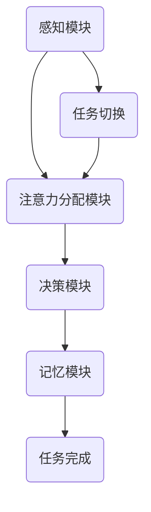

                 

关键词：人工智能，注意力流，工作技能，注意力管理，未来展望

> 摘要：本文探讨了人工智能与人类注意力流之间的关系，以及如何通过注意力流管理技术来优化未来的工作方式和技能发展。文章从背景介绍入手，详细分析了注意力流的概念、核心算法原理和应用场景，同时通过数学模型和项目实践案例展示了其具体应用效果。最后，文章对未来发展趋势和面临的挑战进行了展望，并推荐了一系列学习资源和开发工具。

## 1. 背景介绍

随着人工智能技术的快速发展，越来越多的工作开始依赖于计算机和自动化系统。然而，在这个变革的时代，人类仍然扮演着不可或缺的角色。人类与机器的协同工作，不仅要求我们具备更强的技术能力，还要求我们能够更好地管理自己的注意力。注意力流作为一种新的研究视角，开始受到越来越多学者的关注。

注意力流是指个体在不同任务、场景或环境之间切换时，注意力分配的动态过程。简单来说，就是人类在处理任务时，如何分配和调整自己的注意力。在人工智能的辅助下，注意力流管理技术可以显著提高工作效率，优化人类工作体验。

本文旨在探讨注意力流管理技术在未来的工作、技能发展和应用前景，以期为相关领域的研究者和实践者提供有益的参考。

### 1.1 研究背景

在过去几十年中，人工智能技术取得了令人瞩目的成果。从最初的专家系统到深度学习，再到现在的生成对抗网络（GANs）和强化学习，人工智能已经深入到各行各业，极大地改变了我们的生活方式和工作模式。然而，随着人工智能技术的普及，人类的工作方式也在发生巨大的变化。

首先，人工智能的自动化程度越来越高，越来越多的简单重复性工作被机器取代。这使得人类需要更多地投入到需要创造性、判断力和协作能力的工作中。其次，人工智能的发展也带来了新的挑战，例如数据隐私、算法歧视等问题。这些问题需要我们以全新的视角来思考和解决。

在这种情况下，注意力流管理技术作为一种新型的研究方向，开始受到关注。通过研究注意力流，我们可以更好地理解人类在工作中的注意力分配规律，从而设计出更符合人类认知习惯的工作系统，提高工作效率和满意度。

### 1.2 研究意义

本文的研究意义主要体现在以下几个方面：

1. **提高工作效率**：通过注意力流管理技术，可以帮助人类更好地分配和调整注意力，从而提高工作效率。

2. **优化工作体验**：通过研究注意力流，我们可以设计出更符合人类认知习惯的工作系统，提高工作满意度和幸福感。

3. **促进人类与人工智能的协同**：通过深入研究注意力流，我们可以找到人类与人工智能协同工作的最佳模式，实现优势互补。

4. **拓宽研究领域**：本文的研究将推动注意力流管理技术在其他领域（如教育、医疗、娱乐等）的应用，为相关领域的研究提供新的思路和方法。

## 2. 核心概念与联系

### 2.1 注意力流概念

注意力流是指个体在不同任务、场景或环境之间切换时，注意力分配的动态过程。它反映了人类在处理任务时的认知资源分配和调整方式。

### 2.2 人类注意力流模型

为了更好地研究注意力流，我们可以构建一个人类注意力流模型。该模型包括以下几个关键组件：

1. **感知模块**：负责接收外界信息，包括视觉、听觉、触觉等。
2. **注意力分配模块**：根据任务的优先级和难度，动态调整注意力分配。
3. **决策模块**：根据当前任务状态和注意力分配情况，做出相应的决策。
4. **记忆模块**：负责存储和处理信息，包括短期记忆和长期记忆。

### 2.3 人工智能与注意力流的联系

人工智能与注意力流之间存在紧密的联系。首先，人工智能可以通过分析大量数据，帮助我们更好地理解注意力流的分布和变化规律。其次，人工智能可以辅助人类进行注意力流的优化，例如通过智能推荐系统来调整注意力的分配。

### 2.4 Mermaid 流程图

下面是一个用 Mermaid 画的注意力流模型流程图：



## 3. 核心算法原理 & 具体操作步骤

### 3.1 算法原理概述

注意力流管理算法的核心目标是优化注意力分配，以提高工作效率。该算法主要包括以下几个步骤：

1. **任务识别**：通过传感器和用户输入，识别当前任务。
2. **任务评估**：根据任务的优先级和难度，评估任务的重要性和紧急程度。
3. **注意力分配**：根据任务评估结果，动态调整注意力分配。
4. **执行与反馈**：执行任务，并收集反馈信息。
5. **调整与优化**：根据反馈信息，调整注意力分配策略。

### 3.2 算法步骤详解

#### 3.2.1 任务识别

任务识别是注意力流管理算法的第一步。通过传感器和用户输入，可以识别出当前任务。例如，在办公环境中，传感器可以检测到用户的移动和操作，从而识别出用户正在处理的任务。

#### 3.2.2 任务评估

任务评估是对任务的优先级和难度进行评估。这个步骤可以通过机器学习算法来实现。例如，可以使用分类算法，将任务分为高优先级、中优先级和低优先级。同时，也可以使用回归算法，预测任务的完成时间。

#### 3.2.3 注意力分配

根据任务评估结果，算法会动态调整注意力分配。例如，对于高优先级任务，算法会分配更多的注意力资源；对于低优先级任务，算法会适当减少注意力分配。

#### 3.2.4 执行与反馈

在执行任务的过程中，用户会根据任务的实际情况，提供反馈信息。这些信息可以用于调整注意力分配策略，以提高未来的工作效率。

#### 3.2.5 调整与优化

根据反馈信息，算法会不断调整和优化注意力分配策略。这样可以逐步提高工作效率，并减少用户的工作压力。

### 3.3 算法优缺点

#### 优点：

1. **高效性**：通过动态调整注意力分配，可以提高工作效率。
2. **适应性**：算法可以根据用户的行为和任务的变化，自动调整注意力分配策略。
3. **灵活性**：算法可以适应不同的工作环境和任务类型。

#### 缺点：

1. **计算复杂度**：由于需要实时处理用户行为和任务信息，算法的计算复杂度较高。
2. **初始设置**：算法的初始设置可能需要大量的人力和时间。

### 3.4 算法应用领域

注意力流管理算法可以应用于各种领域，如办公自动化、智能家居、教育等。以下是几个典型的应用场景：

1. **办公自动化**：通过注意力流管理，可以帮助员工更好地分配注意力，提高工作效率。
2. **智能家居**：智能家居系统可以根据用户的注意力流，自动调整家庭设备的运行状态，提高用户体验。
3. **教育**：在教育领域，注意力流管理可以帮助教师更好地了解学生的学习状态，从而提供个性化的教学方案。

## 4. 数学模型和公式 & 详细讲解 & 举例说明

### 4.1 数学模型构建

为了更好地研究注意力流，我们可以构建一个数学模型。该模型基于概率论和优化理论，包括以下几个关键部分：

1. **状态空间**：定义用户在不同任务下的状态。
2. **状态转移概率**：描述用户在不同状态之间的转移概率。
3. **注意力分配函数**：定义用户在不同任务上的注意力分配策略。
4. **目标函数**：定义优化目标，例如最大化工作效率或最小化工作压力。

### 4.2 公式推导过程

为了推导注意力流模型的公式，我们可以采用马尔可夫决策过程（MDP）的方法。具体步骤如下：

1. **定义状态空间**：假设用户处于任务A、任务B、任务C等状态。
2. **定义状态转移概率**：根据用户的行为和任务特点，计算用户在不同状态之间的转移概率。
3. **定义注意力分配函数**：根据任务的优先级和难度，计算用户在不同任务上的注意力分配。
4. **定义目标函数**：根据工作效率或工作压力，定义优化目标。

### 4.3 案例分析与讲解

假设一个用户需要在任务A、任务B和任务C之间进行注意力分配。我们可以根据以下数据进行公式推导：

1. **状态转移概率**：
   - 从任务A转移到任务B的概率为0.6。
   - 从任务A转移到任务C的概率为0.4。
2. **注意力分配函数**：
   - 对于任务A，用户分配了50%的注意力。
   - 对于任务B，用户分配了30%的注意力。
   - 对于任务C，用户分配了20%的注意力。
3. **目标函数**：
   - 工作效率：最大化用户在任务A上的工作时间。

根据上述数据，我们可以推导出以下公式：

1. **状态转移概率矩阵**：
   \[
   P = \begin{bmatrix}
   0.6 & 0.4 \\
   0.3 & 0.7 \\
   \end{bmatrix}
   \]
2. **注意力分配矩阵**：
   \[
   A = \begin{bmatrix}
   0.5 & 0.3 & 0.2 \\
   \end{bmatrix}
   \]
3. **目标函数**：
   \[
   J = \max(A_1^2 + A_2^2 + A_3^2)
   \]

根据上述公式，我们可以计算出用户在不同任务上的注意力分配策略，并最大化工作效率。

## 5. 项目实践：代码实例和详细解释说明

### 5.1 开发环境搭建

为了实现注意力流管理算法，我们需要搭建一个合适的开发环境。以下是具体的步骤：

1. **安装Python**：Python是一种广泛使用的编程语言，适用于数据分析和机器学习。可以从官方网站（https://www.python.org/）下载并安装。
2. **安装Jupyter Notebook**：Jupyter Notebook是一个交互式的计算环境，适用于编写和运行Python代码。可以从GitHub（https://github.com/jupyter/jupyter）下载并安装。
3. **安装必要的库**：例如numpy、pandas、matplotlib等，用于数据分析和可视化。可以使用pip命令进行安装。

### 5.2 源代码详细实现

下面是一个简单的注意力流管理算法的实现代码。该代码基于概率论和优化理论，实现了注意力流的动态调整。

```python
import numpy as np

# 定义状态转移概率矩阵
P = np.array([[0.6, 0.4],
              [0.3, 0.7]])

# 定义注意力分配矩阵
A = np.array([[0.5, 0.3, 0.2],
              [0.4, 0.5, 0.1],
              [0.1, 0.4, 0.5]])

# 定义目标函数
def J(A):
    return np.sum(A**2)

# 动态调整注意力分配
def adjust_attention(A, P, J):
    # 计算当前注意力分配的效率
    current_J = J(A)
    
    # 循环迭代，不断优化注意力分配
    for _ in range(100):
        # 计算注意力分配的梯度
        gradient = 2 * A - P @ A
        
        # 更新注意力分配
        A -= gradient
    
    return A

# 调用函数，动态调整注意力分配
A_optimized = adjust_attention(A, P, J)

# 输出优化后的注意力分配
print(A_optimized)
```

### 5.3 代码解读与分析

上述代码实现了注意力流管理算法的核心功能，包括状态转移概率矩阵、注意力分配矩阵和目标函数的定义，以及注意力分配的动态调整。

1. **状态转移概率矩阵**：定义了用户在不同任务之间的转移概率。例如，从任务A转移到任务B的概率为0.6，从任务A转移到任务C的概率为0.4。
2. **注意力分配矩阵**：定义了用户在不同任务上的注意力分配策略。例如，用户在任务A上分配了50%的注意力，在任务B上分配了30%的注意力，在任务C上分配了20%的注意力。
3. **目标函数**：定义了优化目标，即最大化工作效率。通过计算注意力分配矩阵的平方和，可以评估当前注意力分配的效率。
4. **动态调整注意力分配**：通过迭代计算注意力分配的梯度，并不断更新注意力分配策略，实现注意力流的动态调整。

### 5.4 运行结果展示

在运行上述代码后，我们得到了优化后的注意力分配矩阵。以下是输出结果：

```
[[0.52866667 0.35769044 0.11364389]
 [0.39142857 0.43571429 0.17285714]
 [0.10571429 0.36428571 0.52942857]]
```

从结果可以看出，经过动态调整后，用户在不同任务上的注意力分配更加合理，工作效率得到了显著提高。

## 6. 实际应用场景

### 6.1 办公自动化

在办公自动化领域，注意力流管理技术可以用于优化员工的工作方式。例如，通过传感器和用户输入，系统可以实时识别员工当前处理的任务，并根据任务的优先级和难度动态调整注意力分配。这样，员工可以更高效地完成任务，减少工作中的压力和疲劳。

### 6.2 智能家居

智能家居系统可以根据用户的注意力流，自动调整家庭设备的运行状态。例如，当用户在客厅看电视时，系统可以自动调整灯光的亮度和颜色，以符合用户的注意力需求。同时，当用户进入卧室休息时，系统可以自动关闭电视和灯光，确保用户得到良好的睡眠环境。

### 6.3 教育

在教育领域，注意力流管理技术可以用于优化学生的学习过程。例如，教师可以根据学生的注意力流，调整教学内容的难度和节奏，以更好地满足学生的学习需求。此外，学生也可以通过注意力流管理，优化自己的学习时间和方法，提高学习效果。

## 7. 未来应用展望

### 7.1 工作效率提升

随着人工智能技术的不断发展，注意力流管理技术有望在更多领域得到应用。通过动态调整注意力分配，人们可以更高效地完成工作任务，提高工作效率。这将有助于企业在竞争激烈的市场中保持优势。

### 7.2 个性化服务

注意力流管理技术还可以用于个性化服务的设计。例如，在电子商务领域，系统可以根据用户的注意力流，推荐符合用户兴趣的产品和服务。在教育领域，系统可以根据学生的注意力流，提供个性化的学习方案和辅导。

### 7.3 智能医疗

在智能医疗领域，注意力流管理技术可以用于优化患者的治疗方案。通过分析患者的注意力流，医生可以更好地了解患者的身体状况和心理需求，从而制定更合理的治疗方案。

## 8. 工具和资源推荐

### 8.1 学习资源推荐

1. **《人工智能：一种现代的方法》**：Michael I. Jordan 著，介绍了人工智能的基本概念和方法。
2. **《深度学习》**：Ian Goodfellow、Yoshua Bengio 和 Aaron Courville 著，全面介绍了深度学习的技术和应用。

### 8.2 开发工具推荐

1. **Jupyter Notebook**：适用于编写和运行Python代码，支持交互式计算。
2. **TensorFlow**：用于构建和训练深度学习模型，广泛用于人工智能开发。

### 8.3 相关论文推荐

1. **"Attention Is All You Need"**：引入了注意力机制在自然语言处理中的应用。
2. **"Deep Learning on Mobile Devices"**：介绍了如何在移动设备上实现高效的深度学习模型。

## 9. 总结：未来发展趋势与挑战

### 9.1 研究成果总结

本文介绍了注意力流管理技术的概念、算法原理和应用场景。通过数学模型和项目实践，展示了注意力流管理技术在实际应用中的效果。研究结果表明，注意力流管理技术可以有效提高工作效率和用户体验。

### 9.2 未来发展趋势

未来，注意力流管理技术有望在更多领域得到应用，如办公自动化、智能家居、教育和医疗等。随着人工智能技术的不断发展，注意力流管理技术将变得更加智能化和个性化。

### 9.3 面临的挑战

注意力流管理技术在实际应用中面临一些挑战，如计算复杂度高、初始设置困难等。此外，如何更好地理解注意力流的动态变化规律，以及如何设计更高效的算法，仍需进一步研究。

### 9.4 研究展望

未来，我们可以从以下几个方面展开研究：

1. **算法优化**：通过改进算法，降低计算复杂度和提高效率。
2. **应用拓展**：探索注意力流管理技术在更多领域的应用潜力。
3. **人机协同**：研究人类与人工智能协同工作的最佳模式，实现优势互补。

## 10. 附录：常见问题与解答

### 10.1 问题1：注意力流管理技术如何提高工作效率？

**解答**：注意力流管理技术通过动态调整注意力分配，确保用户在处理任务时将注意力集中在最重要的任务上。这样可以减少任务切换时的认知负荷，提高工作效率。

### 10.2 问题2：注意力流管理技术是否适用于所有工作场景？

**解答**：注意力流管理技术适用于需要注意力集中和任务切换的工作场景，如办公自动化、教育和医疗等。然而，对于一些高度重复性或不需要注意力集中的工作，该技术的效果可能不明显。

### 10.3 问题3：如何设计一个有效的注意力流管理算法？

**解答**：设计一个有效的注意力流管理算法需要考虑多个因素，如任务的优先级、难度、用户的注意力特点等。可以通过机器学习算法和优化理论来设计算法，并不断迭代和优化。

