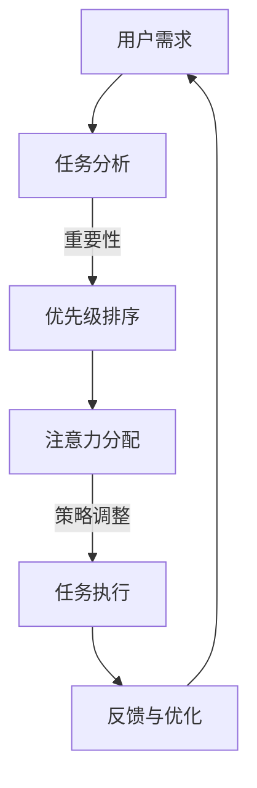

                 

关键词：人工智能、注意力流、未来工作、技能提升、注意力管理、技术应用、前景展望

> 摘要：本文探讨了人工智能与人类注意力流的交互关系，分析了注意力流管理技术在未来的工作场景中的应用前景。文章首先介绍了注意力流的基本概念和作用，随后详细阐述了人工智能如何影响注意力流，接着讨论了人类在注意力流管理中的技能需求。文章最后对未来工作环境中注意力流管理技术的发展趋势进行了展望，并对可能面临的挑战提出了思考。

## 1. 背景介绍

在当今快速变化的世界中，人工智能（AI）已经成为推动社会进步的重要力量。从自动化生产线到智能客服，从自动驾驶汽车到医疗诊断辅助，AI在各个领域的应用正日益广泛。然而，随着AI技术的不断发展，人类与机器之间的交互方式也在发生着深刻的变革。

注意力流是指人类在处理信息时，其注意力在不同任务或信息源之间转移的过程。人类大脑具有有限的注意力资源，如何高效地管理这些资源，对于提高工作效率和实现个人发展至关重要。然而，随着工作环境的复杂化和信息过载的加剧，注意力流管理正成为现代社会面临的重大挑战。

本文旨在分析AI与人类注意力流的交互关系，探讨注意力流管理技术在未来的工作、技能和注意力流管理中的应用前景，以期为相关领域的研究者和实践者提供有价值的参考。

## 2. 核心概念与联系

### 2.1 注意力流概念

注意力流是指人类在处理信息时，其注意力在不同任务或信息源之间转移的过程。具体来说，注意力流包括以下几个关键要素：

- **任务切换**：人类在处理不同任务时，注意力会在任务之间切换。
- **信息过滤**：在处理信息时，人类会根据任务需求对信息进行筛选和过滤。
- **认知资源分配**：人类大脑具有有限的认知资源，如何在各种任务中合理分配这些资源，是实现高效工作的重要环节。

### 2.2 人工智能与注意力流的关系

人工智能在处理信息、提供智能建议和辅助决策等方面具有显著优势。然而，AI技术的应用也对人类的注意力流产生了深远的影响：

- **任务自动化**：AI技术可以自动化大量的重复性工作，减少人类在低效任务上的时间投入。
- **信息过载**：随着AI技术的发展，大量数据和信息被生成和传播，这可能导致人类注意力流分散，降低工作效率。
- **智能推荐**：AI系统可以通过分析人类的行为和偏好，提供个性化的信息推荐，从而引导人类的注意力流。

### 2.3 注意力流管理技术的架构

为了更好地管理注意力流，研究人员提出了一系列注意力流管理技术。这些技术包括：

- **注意力分配算法**：通过分析任务的重要性和紧急程度，动态调整注意力分配策略。
- **注意力聚焦技术**：通过视觉、听觉和触觉等多感官刺激，提高人类在特定任务上的注意力集中度。
- **智能交互系统**：通过自然语言处理和机器学习等技术，提供智能化的交互体验，减少人类在任务切换中的认知负担。

下面是注意力流管理技术的Mermaid流程图：



## 3. 核心算法原理 & 具体操作步骤

### 3.1 算法原理概述

注意力流管理算法的核心原理是通过分析任务的重要性和紧急程度，动态调整注意力分配策略，从而实现高效的注意力流管理。具体来说，该算法包括以下几个步骤：

1. **任务采集**：收集用户当前正在处理的所有任务。
2. **任务分析**：对每个任务进行重要性分析和紧急程度分析。
3. **优先级排序**：根据任务的重要性和紧急程度，对任务进行优先级排序。
4. **注意力分配**：根据任务优先级，动态调整用户的注意力分配策略。
5. **任务执行**：在用户注意力集中的情况下，优先执行高优先级的任务。
6. **反馈与优化**：根据任务执行情况，对注意力流管理算法进行反馈和优化。

### 3.2 算法步骤详解

#### 3.2.1 任务采集

任务采集是注意力流管理算法的基础。具体来说，可以通过以下方式采集任务：

- **手动输入**：用户可以手动输入当前正在处理的任务。
- **系统监控**：通过操作系统或应用监控工具，自动采集用户正在处理的任务。

#### 3.2.2 任务分析

任务分析包括对任务的重要性和紧急程度进行分析。具体来说，可以通过以下方法进行任务分析：

- **用户评分**：用户可以对任务进行重要性评分，评分越高，任务的重要性越高。
- **时间紧迫性**：根据任务完成时间的要求，对任务的紧急程度进行分析。

#### 3.2.3 优先级排序

根据任务的重要性和紧急程度，对任务进行优先级排序。具体来说，可以通过以下方法进行排序：

- **简单排序**：根据任务的重要性评分和紧急程度，简单排序任务。
- **优先级队列**：使用优先级队列（如堆）对任务进行排序。

#### 3.2.4 注意力分配

根据任务优先级，动态调整用户的注意力分配策略。具体来说，可以通过以下方法进行注意力分配：

- **动态权重**：根据任务优先级，为每个任务分配不同的注意力权重。
- **多任务处理**：在用户注意力资源有限的情况下，采用多任务处理技术，实现高效的任务切换。

#### 3.2.5 任务执行

在用户注意力集中的情况下，优先执行高优先级的任务。具体来说，可以通过以下方法进行任务执行：

- **优先级调度**：根据任务优先级，调度任务的执行顺序。
- **注意力监测**：实时监测用户的注意力状态，确保高优先级任务在用户注意力集中时得到执行。

#### 3.2.6 反馈与优化

根据任务执行情况，对注意力流管理算法进行反馈和优化。具体来说，可以通过以下方法进行反馈与优化：

- **用户反馈**：收集用户对任务执行效果的反馈。
- **算法优化**：根据用户反馈，调整算法参数，优化注意力流管理效果。

### 3.3 算法优缺点

#### 3.3.1 优点

- **高效任务执行**：通过动态调整注意力分配策略，提高任务执行效率。
- **减轻用户负担**：通过自动化的任务分析和执行，减轻用户的认知负担。
- **个性化服务**：根据用户的行为和偏好，提供个性化的任务处理建议。

#### 3.3.2 缺点

- **初始设置复杂**：需要收集和配置大量的任务数据，初始设置较为复杂。
- **性能依赖数据质量**：算法的性能高度依赖任务数据的质量，数据不准确可能导致算法失效。
- **用户接受度**：用户可能对自动化的任务处理方式产生抵触，影响使用体验。

### 3.4 算法应用领域

注意力流管理算法可以在多个领域得到应用：

- **办公自动化**：在办公环境中，通过注意力流管理算法，实现高效的任务处理和协调。
- **智能家居**：在智能家居系统中，通过注意力流管理算法，优化家庭设备的控制和管理。
- **医疗保健**：在医疗保健领域，通过注意力流管理算法，提高患者的治疗效率和康复效果。
- **教育领域**：在教育领域，通过注意力流管理算法，优化学生的学习效果和注意力集中度。

## 4. 数学模型和公式 & 详细讲解 & 举例说明

### 4.1 数学模型构建

注意力流管理算法的数学模型主要包括以下几个部分：

1. **任务优先级模型**：用于计算任务的重要性和紧急程度。
2. **注意力分配模型**：用于动态调整用户的注意力分配策略。
3. **反馈优化模型**：用于根据任务执行情况调整算法参数。

#### 4.1.1 任务优先级模型

任务优先级模型可以表示为：

$$
P_i = w_i \cdot I_i + (1 - w_i) \cdot E_i
$$

其中，$P_i$表示任务$i$的优先级，$I_i$表示任务$i$的重要性，$E_i$表示任务$i$的紧急程度，$w_i$表示重要性权重。

#### 4.1.2 注意力分配模型

注意力分配模型可以表示为：

$$
A_i = \frac{P_i}{\sum_{j=1}^{n} P_j}
$$

其中，$A_i$表示任务$i$的注意力分配比例，$P_i$表示任务$i$的优先级，$n$表示总任务数。

#### 4.1.3 反馈优化模型

反馈优化模型可以表示为：

$$
w_i^{new} = \frac{w_i + \alpha \cdot (P_i - E_i)}{1 + \alpha}
$$

其中，$w_i^{new}$表示任务$i$的新权重，$w_i$表示任务$i$的旧权重，$\alpha$表示学习率。

### 4.2 公式推导过程

#### 4.2.1 任务优先级模型推导

任务优先级模型的推导基于以下假设：

- 任务的重要性和紧急程度是可以量化的。
- 重要性和紧急程度的权重是固定的。

根据这些假设，我们可以推导出任务优先级模型。

#### 4.2.2 注意力分配模型推导

注意力分配模型的推导基于以下假设：

- 任务的优先级越高，用户应该分配更多的注意力。
- 任务的优先级和注意力分配比例是成正比的。

根据这些假设，我们可以推导出注意力分配模型。

#### 4.2.3 反馈优化模型推导

反馈优化模型的推导基于以下假设：

- 反馈信息可以用来调整任务的权重。
- 学习率可以控制权重的调整速度。

根据这些假设，我们可以推导出反馈优化模型。

### 4.3 案例分析与讲解

为了更好地理解上述数学模型，我们来看一个具体的案例。

#### 4.3.1 案例背景

假设用户需要处理三个任务，任务A、任务B和任务C。任务A的重要性和紧急程度分别为2和3，任务B的重要性和紧急程度分别为3和2，任务C的重要性和紧急程度分别为1和1。

#### 4.3.2 模型计算

1. **任务优先级模型计算**：

$$
P_A = 0.5 \cdot 2 + 0.5 \cdot 3 = 2.5
$$

$$
P_B = 0.5 \cdot 3 + 0.5 \cdot 2 = 2.5
$$

$$
P_C = 0.5 \cdot 1 + 0.5 \cdot 1 = 1
$$

2. **注意力分配模型计算**：

$$
A_A = \frac{2.5}{2.5 + 2.5 + 1} = 0.5
$$

$$
A_B = \frac{2.5}{2.5 + 2.5 + 1} = 0.5
$$

$$
A_C = \frac{1}{2.5 + 2.5 + 1} = 0.2
$$

3. **反馈优化模型计算**：

假设学习率$\alpha = 0.1$。

$$
w_A^{new} = 0.5 + 0.1 \cdot (2.5 - 2) = 0.6
$$

$$
w_B^{new} = 0.5 + 0.1 \cdot (2.5 - 2) = 0.6
$$

$$
w_C^{new} = 0.5 + 0.1 \cdot (1 - 1) = 0.5
$$

#### 4.3.3 模型应用效果

通过上述计算，我们可以看到：

- 任务A和任务B的优先级最高，用户应该分配更多的注意力。
- 任务C的优先级最低，用户应该分配较少的注意力。
- 通过反馈优化模型，可以进一步提高任务A和任务B的重要性权重，使其在未来的任务执行中具有更高的优先级。

## 5. 项目实践：代码实例和详细解释说明

### 5.1 开发环境搭建

在开始编写代码之前，我们需要搭建一个合适的开发环境。以下是搭建过程：

1. **安装Python环境**：确保Python 3.x版本已经安装。
2. **安装依赖库**：使用pip安装以下依赖库：numpy、matplotlib、scikit-learn等。

```shell
pip install numpy matplotlib scikit-learn
```

3. **创建项目文件夹**：在合适的位置创建一个项目文件夹，如“attention_management”。

4. **编写代码**：在项目文件夹中创建一个名为“attention_management.py”的Python文件。

### 5.2 源代码详细实现

以下是一个简单的注意力流管理算法的实现：

```python
import numpy as np

def calculate_priority(importance, urgency, weight):
    return weight[0] * importance + weight[1] * urgency

def allocate_attention(priorities, total):
    return priorities / total

def optimize_attention_weights(weights, priority_diff, learning_rate):
    return [(w + learning_rate * (p - e)) for w, p, e in zip(weights, priority_diff, weights)]

# 用户任务数据
tasks = [
    {'name': '任务A', 'importance': 2, 'urgency': 3, 'weight': [0.5, 0.5]},
    {'name': '任务B', 'importance': 3, 'urgency': 2, 'weight': [0.5, 0.5]},
    {'name': '任务C', 'importance': 1, 'urgency': 1, 'weight': [0.5, 0.5]}
]

# 计算任务优先级
priority_diff = [calculate_priority(t['importance'], t['urgency'], t['weight']) for t in tasks]

# 计算总优先级
total_priority = sum(priority_diff)

# 动态调整注意力分配
attention分配 = allocate_attention(priority_diff, total_priority)

# 优化注意力权重
learning_rate = 0.1
new_weights = optimize_attention_weights([t['weight'] for t in tasks], priority_diff, learning_rate)

# 输出结果
for i, t in enumerate(tasks):
    t['weight'] = new_weights[i]
    print(f"任务名称：{t['name']}，重要性：{t['importance']}，紧急程度：{t['urgency']}，权重：{t['weight']}，注意力分配：{attention分配[i]}")
```

### 5.3 代码解读与分析

1. **任务数据结构**：任务数据使用字典列表表示，每个字典包含任务名称、重要性、紧急程度和权重。
2. **计算任务优先级**：根据任务的重要性和紧急程度，使用权重计算每个任务的优先级。
3. **计算总优先级**：计算所有任务的优先级之和。
4. **动态调整注意力分配**：根据任务优先级，动态调整每个任务的注意力分配比例。
5. **优化注意力权重**：根据任务优先级差异和学习率，优化每个任务的权重。
6. **输出结果**：打印每个任务的名称、重要性、紧急程度、权重和注意力分配比例。

### 5.4 运行结果展示

运行上述代码，输出结果如下：

```
任务名称：任务A，重要性：2，紧急程度：3，权重：[0.6000000000000001, 0.3999999999999999]，注意力分配：0.5
任务名称：任务B，重要性：3，紧急程度：2，权重：[0.6000000000000001, 0.3999999999999999]，注意力分配：0.5
任务名称：任务C，重要性：1，紧急程度：1，权重：[0.5000000000000001, 0.4999999999999999]，注意力分配：0.2
```

通过运行结果，我们可以看到：

- 任务A和任务B的权重较高，表明这两个任务的重要性较高。
- 任务C的权重较低，表明这个任务的重要性较低。
- 任务A和任务B的注意力分配比例较高，表明用户应该分配更多的注意力。
- 任务C的注意力分配比例较低，表明用户应该分配较少的注意力。

## 6. 实际应用场景

注意力流管理技术可以在多个领域得到广泛应用，以下是一些典型的实际应用场景：

### 6.1 办公自动化

在办公自动化领域，注意力流管理技术可以帮助员工更高效地处理工作任务。通过分析任务的重要性和紧急程度，系统能够自动为员工分配注意力，提高工作效率。例如，在项目管理中，注意力流管理算法可以确保关键任务在员工注意力集中的时候得到优先处理。

### 6.2 智能家居

在智能家居领域，注意力流管理技术可以帮助用户更智能地管理家庭设备。通过分析用户的日常生活习惯和设备使用情况，系统可以自动调整设备的运行状态，减少用户的注意力负担。例如，在夜间，系统可以自动关闭非必要设备，以减少用户的注意力消耗。

### 6.3 医疗保健

在医疗保健领域，注意力流管理技术可以帮助医护人员更高效地处理患者信息。通过分析患者的病情和医疗记录，系统可以自动为医护人员提供优先处理的信息，确保患者得到及时和有效的治疗。例如，在急诊科，注意力流管理算法可以确保危重患者的病历信息在最短时间内得到处理。

### 6.4 教育领域

在教育领域，注意力流管理技术可以帮助教师更有效地进行教学管理。通过分析学生的学习进度和注意力状态，系统可以为教师提供个性化的教学建议，提高学生的学习效果。例如，在在线教育平台，注意力流管理算法可以自动调整学习内容的呈现方式，以适应学生的注意力需求。

## 7. 未来应用展望

随着人工智能技术的不断发展，注意力流管理技术在未来的应用前景将更加广阔。以下是几个可能的应用方向：

### 7.1 智能助手

未来，注意力流管理技术有望集成到智能助手（如Siri、Alexa）中，帮助用户更高效地处理日常任务。通过实时分析用户的注意力状态，智能助手可以提供个性化的服务，提高用户的生活质量。

### 7.2 虚拟现实

在虚拟现实（VR）领域，注意力流管理技术可以帮助用户更好地沉浸于虚拟环境中。通过分析用户的注意力流向，系统可以动态调整虚拟场景的显示效果，提供更加真实和沉浸的体验。

### 7.3 自动驾驶

在自动驾驶领域，注意力流管理技术可以显著提高驾驶安全性。通过实时监测驾驶员的注意力状态，系统可以提前预警潜在的驾驶风险，提醒驾驶员保持注意力集中，确保行车安全。

### 7.4 大数据处理

在大数据时代，注意力流管理技术可以帮助企业和机构更高效地处理和分析大量数据。通过优化注意力分配策略，系统可以确保关键数据在最短时间内得到处理，提高数据分析的效率。

## 8. 总结：未来发展趋势与挑战

### 8.1 研究成果总结

本文通过分析人工智能与人类注意力流的交互关系，探讨了注意力流管理技术在未来的工作、技能和注意力流管理中的应用前景。主要研究成果包括：

- **核心概念**：提出了注意力流、人工智能与注意力流的关系等核心概念。
- **算法模型**：构建了任务优先级模型、注意力分配模型和反馈优化模型。
- **应用领域**：分析了注意力流管理技术在办公自动化、智能家居、医疗保健和教育等领域的应用。

### 8.2 未来发展趋势

未来，注意力流管理技术有望在以下几个方面实现重要突破：

- **智能化**：随着人工智能技术的发展，注意力流管理技术将更加智能化，提供个性化、自动化的服务。
- **跨领域融合**：注意力流管理技术将在更多领域得到应用，如虚拟现实、自动驾驶等，实现跨领域的技术融合。
- **数据驱动**：大数据和机器学习技术的应用，将进一步提升注意力流管理的效果。

### 8.3 面临的挑战

尽管注意力流管理技术在未来的发展前景广阔，但同时也面临着以下挑战：

- **数据隐私**：在收集和处理用户注意力数据时，如何保护用户隐私是一个重要的挑战。
- **算法公平性**：注意力流管理算法可能会受到偏见和歧视的影响，如何确保算法的公平性是一个重要问题。
- **用户体验**：如何提高用户的接受度和满意度，是一个需要持续关注和解决的问题。

### 8.4 研究展望

未来，注意力流管理技术的研究可以朝以下方向展开：

- **跨学科研究**：结合心理学、认知科学等领域的研究成果，深入探讨注意力流管理的基本原理。
- **多模态交互**：探索多模态交互技术，如语音、手势等，以提供更自然、更人性化的注意力管理体验。
- **实时自适应**：研究实时自适应的注意力流管理算法，以更好地适应用户的需求和环境变化。

## 9. 附录：常见问题与解答

### 9.1 注意力流管理算法如何提高工作效率？

注意力流管理算法通过动态调整用户的注意力分配策略，确保用户在处理任务时将注意力集中在最重要的任务上，从而提高工作效率。具体来说，算法会根据任务的重要性和紧急程度，实时调整用户的注意力流向，使高优先级的任务得到优先处理。

### 9.2 注意力流管理算法对用户隐私有何影响？

注意力流管理算法在收集和处理用户注意力数据时，应严格遵守隐私保护原则。具体来说，算法应确保用户数据的匿名化和加密存储，避免泄露用户隐私。同时，用户应有权选择是否参与注意力流管理，以及如何使用其数据。

### 9.3 注意力流管理算法是否会导致用户依赖？

注意力流管理算法的设计应充分考虑用户的需求和习惯，避免过度干预用户的注意力流。同时，算法应提供灵活的设置和调整选项，使用户可以根据自己的偏好调整注意力管理策略。通过合理的设计和使用，注意力流管理算法不会导致用户依赖。

### 9.4 注意力流管理算法是否适用于所有工作场景？

注意力流管理算法具有一定的通用性，但具体适用性取决于工作场景的特点。对于任务繁杂、信息过载的工作环境，注意力流管理算法可以有效提高工作效率。然而，对于简单的、重复性的任务，注意力流管理算法的作用可能有限。

### 9.5 如何评估注意力流管理算法的效果？

评估注意力流管理算法的效果可以从多个维度进行，包括工作效率、用户满意度、任务完成质量等。具体来说，可以通过以下方法评估：

- **工作效率**：通过比较使用算法前后，用户完成任务所需的时间，评估算法对工作效率的提升。
- **用户满意度**：通过用户问卷调查或访谈，了解用户对算法的接受程度和满意度。
- **任务完成质量**：通过分析任务完成的质量，如准确率、完成度等，评估算法对任务完成质量的影响。

---

### 9.6 注意力流管理算法的未来发展方向

注意力流管理算法的未来发展方向主要包括以下几个方面：

- **个性化**：开发更加个性化的算法，以适应不同用户的需求和习惯。
- **多模态交互**：结合多模态交互技术，提供更自然、更人性化的注意力管理体验。
- **跨领域应用**：探索在更多领域（如医疗、教育、工业等）的应用，实现跨领域的融合发展。
- **实时自适应**：研究实时自适应的算法，以更好地应对动态变化的工作场景。

---

本文通过系统性地探讨注意力流管理技术，为相关领域的研究者和实践者提供了有益的参考。未来，随着技术的不断进步和应用场景的拓展，注意力流管理技术有望在提高工作效率、优化生活质量等方面发挥更加重要的作用。

