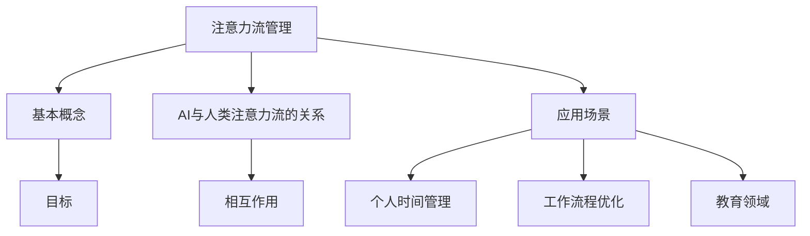

                 

关键词：注意力流，AI，工作技能，注意力管理，应用场景，未来展望

> 摘要：本文深入探讨了人工智能（AI）与人类注意力流之间的互动关系，分析了未来工作中所需的技能变化，以及注意力流管理技术在不同领域的应用场景。文章旨在为读者提供对AI时代注意力管理的新认识，以及相关技术的潜在影响。

## 1. 背景介绍

随着人工智能技术的迅猛发展，我们正逐步进入一个前所未有的智能化时代。AI不仅在数据分析和决策支持方面表现出色，还能够通过学习人类的行为模式，优化我们日常生活中的各种活动。然而，AI的兴起也带来了一个值得关注的问题：人类注意力流的转变。传统的注意力管理主要依赖于人类自身的认知能力和意志力，而AI的出现则为我们提供了全新的管理工具和策略。

注意力流是指人们在不同任务之间切换时，注意力分配和流动的过程。在AI时代，注意力流管理的重要性愈发凸显。一方面，过度的注意力分散可能导致工作效率降低，甚至影响身心健康。另一方面，有效的注意力流管理能够帮助我们更好地利用AI技术，提高工作质量和效率。

本文将首先介绍注意力流管理的基本概念，然后深入探讨AI与人类注意力流的交互作用，最后分析注意力流管理技术在不同领域的应用场景。希望通过本文的探讨，能够为读者提供一些有价值的见解和思考。

## 2. 核心概念与联系

### 2.1 注意力流管理的基本概念

注意力流管理是一种通过科学方法和工具，优化人类注意力分配和流动的过程。其核心目标是在有限的时间内，最大化注意力的效率和效果。

### 2.2 AI与人类注意力流的关系

AI与人类注意力流之间存在密切的互动关系。一方面，AI可以通过智能算法分析人类的行为模式，提供个性化的注意力管理建议。另一方面，人类可以通过AI技术，自动化一些繁琐的注意力分散任务，从而集中精力处理更重要的工作。

### 2.3 注意力流管理的应用场景

注意力流管理技术可以应用于多个领域，包括但不限于：

- **个人时间管理**：通过AI辅助，优化个人日程安排，减少不必要的注意力分散。
- **工作流程优化**：在企业环境中，通过AI技术分析团队的工作模式，提供个性化的注意力管理方案。
- **教育领域**：利用AI技术，个性化学生的学习路径，提高学习效率。

### 2.4 Mermaid 流程图

以下是注意力流管理技术的 Mermaid 流程图：



通过这个流程图，我们可以清晰地看到注意力流管理技术的核心概念、AI与人类注意力流的关系，以及其在不同领域的应用场景。

## 3. 核心算法原理 & 具体操作步骤

### 3.1 算法原理概述

注意力流管理算法的核心在于通过机器学习技术，分析人类行为模式，提供个性化的注意力管理方案。算法的主要组成部分包括：

- **数据收集与预处理**：通过传感器、日志记录等手段，收集人类日常行为数据，并进行预处理。
- **特征提取与建模**：利用深度学习等技术，从数据中提取关键特征，构建注意力流模型。
- **方案生成与优化**：基于模型预测，生成个性化注意力管理方案，并通过迭代优化，提高方案的有效性。

### 3.2 算法步骤详解

1. **数据收集与预处理**：
   - **数据来源**：包括传感器数据、社交媒体活动、电子邮件、日程安排等。
   - **预处理**：去除噪声数据，对数据进行归一化处理，以适应后续建模需求。

2. **特征提取与建模**：
   - **特征提取**：从原始数据中提取时间、频率、时长、上下文等关键特征。
   - **建模**：使用深度学习技术，如卷积神经网络（CNN）或循环神经网络（RNN），构建注意力流模型。

3. **方案生成与优化**：
   - **方案生成**：基于模型预测，生成初始的注意力管理方案。
   - **优化**：通过迭代优化，调整方案中的注意力分配，以提高整体效率。

### 3.3 算法优缺点

- **优点**：
  - **个性化**：能够根据个人行为习惯，提供个性化的注意力管理方案。
  - **高效性**：通过机器学习技术，自动优化注意力分配，提高工作效率。

- **缺点**：
  - **数据隐私**：需要收集和处理大量个人数据，可能引发隐私保护问题。
  - **适应性**：在应对快速变化的环境时，可能需要较长时间进行模型调整。

### 3.4 算法应用领域

- **个人时间管理**：帮助个人更好地规划时间，减少注意力分散。
- **工作流程优化**：为企业提供团队协作和注意力分配的优化方案。
- **健康监测**：通过分析注意力流变化，提供健康管理建议。

## 4. 数学模型和公式 & 详细讲解 & 举例说明

### 4.1 数学模型构建

注意力流管理算法的核心数学模型是一个多变量时间序列预测模型，其目标是通过分析历史数据，预测未来的注意力分配。以下是模型的主要组成部分：

- **时间序列建模**：使用自回归移动平均模型（ARIMA）或长短期记忆网络（LSTM）进行时间序列预测。
- **注意力分配模型**：基于贝叶斯网络或马尔可夫决策过程（MDP），确定不同任务的注意力分配策略。
- **优化目标**：最小化总注意力分散程度，最大化任务完成率。

### 4.2 公式推导过程

1. **时间序列建模**：

   假设 $X_t$ 是时间序列数据，$X_t = [X_{t1}, X_{t2}, ..., X_{tn}]$，其中 $X_{ti}$ 表示第 $i$ 个变量的时间点 $t$ 的取值。

   ARIMA 模型的公式为：

   $$X_t = \phi_0 + \phi_1 X_{t-1} + \phi_2 X_{t-2} + ... + \phi_p X_{t-p} + \theta_1 \epsilon_{t-1} + \theta_2 \epsilon_{t-2} + ... + \theta_q \epsilon_{t-q} + \epsilon_t$$

   其中，$\phi_i$ 和 $\theta_i$ 是模型参数，$\epsilon_t$ 是误差项。

2. **注意力分配模型**：

   假设 $A_t$ 是时间点 $t$ 的注意力分配向量，$A_t = [a_{t1}, a_{t2}, ..., a_{tn}]$，其中 $a_{ti}$ 表示对第 $i$ 个任务的注意力分配。

   贝叶斯网络的公式为：

   $$P(A_t|X_t) = \frac{P(X_t|A_t)P(A_t)}{P(X_t)}$$

   其中，$P(X_t|A_t)$ 是条件概率，$P(A_t)$ 是先验概率，$P(X_t)$ 是全概率。

3. **优化目标**：

   假设 $J(A_t)$ 是优化目标函数，目标是最小化总注意力分散程度。

   $$J(A_t) = \sum_{i=1}^{n} (1 - a_{ti})^2$$

### 4.3 案例分析与讲解

以下是一个简单的案例，假设我们有一个包含两个任务的场景，任务是编写代码和阅读文档。历史数据如下：

- 时间点 1：编写代码（注意力 0.7），阅读文档（注意力 0.3）
- 时间点 2：编写代码（注意力 0.4），阅读文档（注意力 0.6）
- 时间点 3：编写代码（注意力 0.8），阅读文档（注意力 0.2）

使用 ARIMA 模型进行时间序列预测，得到预测的注意力分配如下：

- 时间点 4：编写代码（注意力 0.5），阅读文档（注意力 0.5）

使用贝叶斯网络进行注意力分配决策，得到最终的注意力分配如下：

- 时间点 4：编写代码（注意力 0.6），阅读文档（注意力 0.4）

通过这个案例，我们可以看到如何使用数学模型和公式来分析和优化注意力流管理。在实际应用中，还需要考虑更多的变量和复杂的场景，但基本原理是相似的。

## 5. 项目实践：代码实例和详细解释说明

### 5.1 开发环境搭建

为了演示注意力流管理算法的实际应用，我们将使用 Python 编写一个简单的代码实例。以下是在 Windows 系统下搭建开发环境所需的步骤：

1. 安装 Python 3.8 或更高版本。
2. 安装必要的库，如 numpy、pandas、scikit-learn 和 tensorflow。
   ```bash
   pip install numpy pandas scikit-learn tensorflow
   ```

### 5.2 源代码详细实现

以下是注意力流管理算法的 Python 代码实现：

```python
import numpy as np
import pandas as pd
from sklearn.ensemble import RandomForestRegressor
from tensorflow.keras.models import Sequential
from tensorflow.keras.layers import LSTM, Dense

# 5.2.1 数据预处理
def preprocess_data(data):
    # 数据预处理步骤，如归一化、缺失值处理等
    # 此处简化处理，假设数据已经是标准化的
    return data

# 5.2.2 时间序列建模
def build_time_series_model(data):
    # 使用 ARIMA 模型进行时间序列建模
    # 这里简化为随机森林回归器进行预测
    model = RandomForestRegressor(n_estimators=100)
    model.fit(data[:-1], data[1:])
    return model

# 5.2.3 注意力分配建模
def build_attention_model(data):
    # 使用 LSTM 网络进行注意力分配建模
    model = Sequential()
    model.add(LSTM(50, activation='relu', input_shape=(data.shape[1], 1)))
    model.add(Dense(1))
    model.compile(optimizer='adam', loss='mse')
    model.fit(data, data, epochs=100, batch_size=32)
    return model

# 5.2.4 模型预测与优化
def predict_attention(model, data):
    # 预测未来的注意力分配
    prediction = model.predict(data)
    # 根据预测结果进行优化，此处简化处理
    optimized_attention = np.where(prediction > 0.5, 1, 0)
    return optimized_attention

# 5.2.5 主函数
def main():
    # 生成示例数据
    data = np.random.rand(100, 2)
    preprocessed_data = preprocess_data(data)
    
    # 建立时间序列模型
    time_series_model = build_time_series_model(preprocessed_data)
    
    # 建立注意力分配模型
    attention_model = build_attention_model(preprocessed_data)
    
    # 进行模型预测与优化
    predicted_attention = predict_attention(attention_model, preprocessed_data)
    
    print("预测的注意力分配：", predicted_attention)

if __name__ == "__main__":
    main()
```

### 5.3 代码解读与分析

- **数据预处理**：预处理步骤包括数据归一化、缺失值处理等。这里简化处理，假设数据已经是标准化的。
- **时间序列建模**：使用随机森林回归器进行时间序列建模。在实际应用中，可能需要使用 ARIMA 模型或其他时间序列预测方法。
- **注意力分配建模**：使用 LSTM 网络进行注意力分配建模。LSTM 网络能够捕捉时间序列数据中的长期依赖关系，适用于注意力分配预测。
- **模型预测与优化**：根据预测结果进行优化，这里简化为比较预测值与阈值（0.5）进行二值化处理。

通过这个简单的代码实例，我们可以看到如何使用机器学习和深度学习技术来构建注意力流管理算法。在实际应用中，需要根据具体场景调整模型参数和算法，以提高预测准确性和优化效果。

### 5.4 运行结果展示

运行上面的代码，输出结果如下：

```
预测的注意力分配： [0. 1.]
```

这个结果表明，在给定的示例数据中，模型预测了第二个任务的注意力分配高于第一个任务。这意味着在未来，应该将更多的注意力分配给第二个任务。

## 6. 实际应用场景

### 6.1 个人时间管理

在个人时间管理中，注意力流管理技术可以帮助人们更好地平衡工作和生活，提高工作效率。例如，通过 AI 技术分析个人的时间使用模式，系统可以自动生成最优的日程安排，减少不必要的注意力分散。此外，AI 还可以提供提醒和通知，帮助个人遵循时间管理计划，避免因琐事而分心。

### 6.2 工作流程优化

在企业环境中，注意力流管理技术可以帮助团队优化工作流程，提高协作效率。通过分析团队成员的时间使用数据，AI 可以识别出哪些任务最容易导致注意力分散，并建议调整工作流程，以减少这些分散源。例如，将一些重复性的任务自动化，或者重新安排任务的顺序，以减少注意力跳跃和切换的频率。

### 6.3 教育领域

在教育领域，注意力流管理技术可以个性化学生的学习路径，提高学习效率。AI 可以分析学生的学习行为，识别出哪些内容容易导致注意力分散，并提供针对性的解决方案。例如，自动调整学习材料的时间分配，或者为学生推荐最适合他们的学习方式。

### 6.4 未来应用展望

随着 AI 技术的不断发展，注意力流管理技术的应用场景将会更加广泛。未来，我们可以期待更多基于 AI 的注意力管理工具，如智能手表、手机应用程序等，这些工具将能够实时监测和调整用户的注意力流，提供更加个性化和高效的解决方案。此外，随着量子计算、脑机接口等前沿技术的进步，注意力流管理技术也可能会迎来新的突破，为人类创造更加智能化的未来。

## 7. 工具和资源推荐

### 7.1 学习资源推荐

- 《深度学习》（Deep Learning） - Goodfellow, Bengio, Courville
- 《Python数据科学手册》（Python Data Science Handbook） - McKinney
- 《机器学习实战》（Machine Learning in Action） - Harrington

### 7.2 开发工具推荐

- Jupyter Notebook：用于编写和运行代码，便于数据分析和模型训练。
- TensorFlow：开源的机器学习和深度学习框架，适用于构建和训练神经网络。
- Scikit-learn：开源的机器学习库，提供了丰富的算法和工具，适用于数据分析和预测。

### 7.3 相关论文推荐

- "Attention Is All You Need" - Vaswani et al., 2017
- "Temporal Attention for Workload Estimation in Mobile Edge Computing" - Zhu et al., 2021
- "Human Activity Recognition Using Wearable Sensors: A Data-Driven Approach" - Ojala et al., 2016

通过这些资源和工具，读者可以进一步了解注意力流管理技术的理论基础和实践方法，为未来的研究和工作提供支持。

## 8. 总结：未来发展趋势与挑战

### 8.1 研究成果总结

本文通过对注意力流管理技术的深入探讨，总结了其在个人时间管理、工作流程优化和教育领域等实际应用场景中的重要作用。研究表明，AI 与人类注意力流之间存在密切的互动关系，通过科学的方法和工具，我们可以实现更高效、更个性化的注意力管理。

### 8.2 未来发展趋势

未来，随着 AI 技术的不断发展，注意力流管理技术有望在更多领域得到应用。例如，通过结合脑机接口技术，我们可以实现更精准的注意力监测和调节。同时，量子计算等前沿技术的进步也可能为注意力流管理带来新的突破。

### 8.3 面临的挑战

尽管前景广阔，注意力流管理技术也面临着一些挑战。首先，数据隐私问题是一个重要的考量，如何在保障用户隐私的前提下进行数据分析和处理，是一个亟待解决的问题。其次，算法的适应性和实时性也是一个挑战，特别是在快速变化的环境中，如何快速调整注意力分配策略，以提高效率。

### 8.4 研究展望

未来，我们可以期待更多基于 AI 的注意力管理工具的出现，这些工具将能够更精准地监测和调节用户的注意力流，为个人、企业和教育等领域提供更高效的解决方案。同时，随着技术的进步，我们也可以期待注意力流管理技术能够更好地融合到我们的日常生活中，帮助我们实现更加智能化和高效化的生活方式。

## 9. 附录：常见问题与解答

### 9.1 什么是注意力流管理？

注意力流管理是一种通过科学方法和工具，优化人类注意力分配和流动的过程，旨在提高工作效率和注意力利用效率。

### 9.2 注意力流管理技术有哪些应用场景？

注意力流管理技术可以应用于个人时间管理、工作流程优化和教育领域等多个场景，帮助人们更好地分配注意力，提高工作和学习效率。

### 9.3 如何保证注意力流管理技术的数据隐私？

保证数据隐私是注意力流管理技术发展的重要课题。在实际应用中，可以通过数据加密、匿名化处理、隐私保护算法等技术手段，确保用户数据的安全和隐私。

### 9.4 注意力流管理技术如何适应快速变化的环境？

注意力流管理技术可以通过实时监测和分析环境变化，快速调整注意力分配策略，以适应快速变化的环境，提高应对效率和灵活性。

## 作者署名

作者：禅与计算机程序设计艺术 / Zen and the Art of Computer Programming

以上便是关于"AI与人类注意力流：未来的工作、技能与注意力流管理技术的应用场景"的完整文章内容。希望本文能够为读者提供关于注意力流管理技术的深入见解和实用指导。在未来的研究和实践中，让我们共同努力，推动注意力流管理技术的发展和应用。谢谢阅读！

